# Combinational Logic Design

## 概述

 A circuit can be viewed as a black box, shown in Figure 2.1, with

- one or more discrete-valued *input terminals*
- one or more discrete-valued *output terminals*
- a **functional specification** describing the relationship between inputs and outputs
- a **timing specification** describing the delay between inputs changing and outputs responding.

Peering inside the black box, circuits are composed of nodes and elements. An **element** is itself a circuit with inputs, outputs, and a specification. A **node** is a wire, whose voltage conveys a discrete-valued variable. Nodes are classified as 

- **input**：receive values from the external world
- **output**：deliver values to the external world
- **internal**：are not inputs or outputs

Digital circuits are classified as **combinational** or **sequential**：

- A combinational circuit’s outputs depend only on the current values of the inputs
- A sequential circuit’s outputs depend on both current and previous values of the inputs; in other words, it depends on the input sequence.

A combinational circuit is **memoryless**（无状态）, but a sequential circuit has **memory**（有状态）

The rules of **combinational composition** tell us how we can build a large combinational circuit from smaller combinational circuit elements：

A circuit is combinational if it consists of interconnected circuit elements such that

- Every circuit element is itself combinational
- Every node of the circuit is either designated as an input to the circuit or connects to **exactly one** output terminal of a circuit element.
- The circuit contains no cyclic paths: every path through the circuit visits each circuit node at most once. 

> The rules of combinational composition are sufficient but not strictly necessary. Certain circuits that disobey these rules are still combinational

下面给出一个例子来练习：

(b)(d)(f)都不是组合电路，其中(d)电路中n6连接了两个输出端I3、I4.

## 数学基础

### Boolean Equation

The **complement**（补） of a variable *A* is its inverse（逆） $\bar{A}$. The variable or its complement is called a **literal**. For example, *A*, *A*, *B*, and *B* are literals. We call *A* the **true form** of the variable and *A* the **complementary form**; “true form” does not mean that *A* is TRUE

The AND of one or more literals is called a **product** or an **implicant**（蕴含项）. A **minterm**（最小项） is a product involving all of the inputs to the functionthe OR of one or more literals is called a **sum**.  A **maxterm**（最大项） is a sum involving all of the inputs to the function. 

The **precedence of operations** ：NOT > AND > OR

We can write a Boolean equation for any truth table by summing each of the minterms for which the output, *Y*, is TRUE

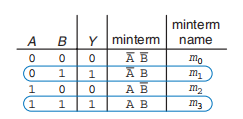
$$
F(A, B) = \bar{A}B + AB
$$

we can also write a Boolean equation for any truth table by producting each of the maxterms for which the output, Y, is FALSE

$$
F(A, B) = (A + \bar{B}) + (A + B)
$$

**sum-of-products (SOP) canonical form（范式）** can also be written in *sigma notation*：
$$
F(A, B) = \Sigma(m_1, m_3)\\
F(A, B) = \Sigma(1, 3)
$$
**product-of sums (POS) canonical form** can also be written in *pi notation*：
$$
F(A, B) = \Pi(M_1, M_3) \\
F(A, B) = \Pi(1, 3)
$$

### Boolean Algebra

 you can use **Boolean algebra** to simplify Boolean equations

> In modern engineering practice, computer programs called **logic synthesizers** produce simplified circuits from a description of the logic function.  For large problems, logic synthesizers are much more efficient than humans

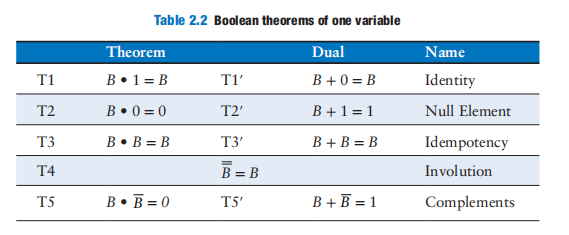

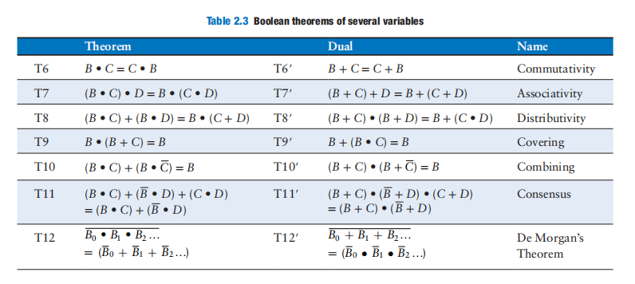

 We define an equation in sum-of-products form to be **minimized** if it uses the fewest possible implicants. If there are several equations with the same number of implicants, the minimal one is the one with the fewest literals.

An implicant is called a **prime implicant** if it cannot be combined with any other implicants in the equation to form a new implicant with fewer literals. The implicants in a minimal equation must all be prime implicants.

Example：Minimize Equation $\bar{A}\bar{B}\bar{C} + A\bar{B}\bar{C} + A\bar{B}C$

Simplifying reduces the number of gates used to physically implement the function, thus making it smaller, cheaper, and possibly faster.

## 构建组合电路

guidelines of wire connection

we can use a **two-level logic**  to describe a boolean equation：

this form of two-level logic is similar to **Programmable Logic Array（PLA）**

### Priority Circuit

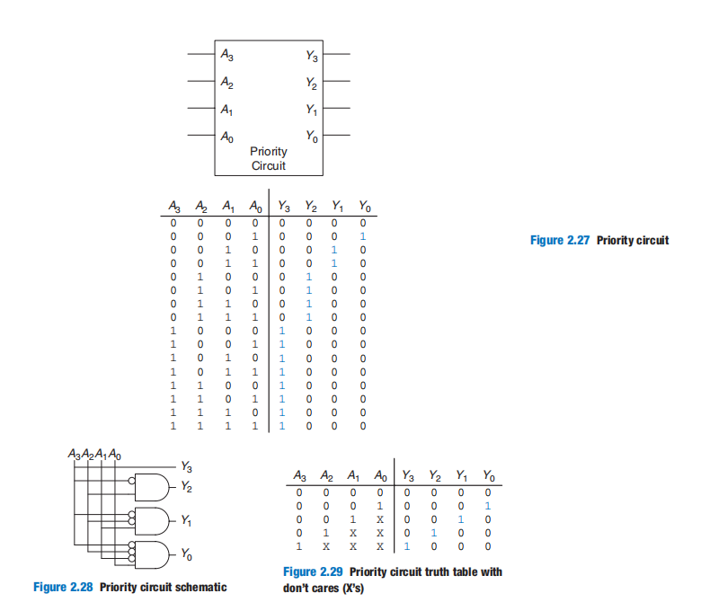

### Bubble Pushing

Most designers think in terms of AND and OR gates, but CMOS circuit favors NAND and NOR gates.  

How to redraw AND gates to NAND gates？Answer：De Morgan's Theorem

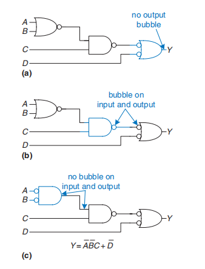

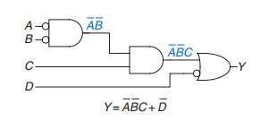

How to redraw  NAND gates to AND gates？

 A brute force solution is to just replace each AND gate with a NAND and an inverter, and each OR gate with a NOR and an inverter, as shown in Figure 2.37

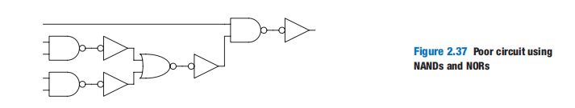

For a better solution, observe that bubbles can be added to the output of a gate and the input of the next gate without changing the function, as shown in Figure 2.38(a). The final AND is converted to a NAND and an inverter, as shown in Figure 2.38(b). This solution requires only five gates.

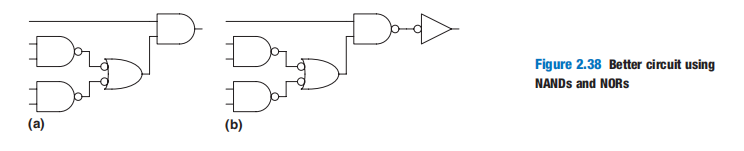

### X'S and Z'S

 real circuits can also have illegal and floating values, represented symbolically by X and Z.

The symbol X indicates that the circuit node has an **unknown** or **illegal** value. Figure 2.39 shows a case where node *Y* is driven both HIGH and LOW. This situation, called **contention**, is considered to be an error and must be avoided. 

> digital designers also use the symbol X to indicate “don’t care” values in truth tables. X is 1(HIGH) or 0(LOW). Be sure not to mix up the two meanings

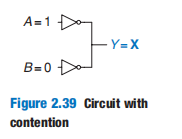

The actual voltage on a node with contention may be somewhere between 0 and *V**DD*, depending on the relative strengths of the gates driving HIGH and LOW. It is often, but not always, in the forbidden zone. Contention also can cause large amounts of power to flow between the fighting gates, resulting in the circuit getting hot and possibly damaged.

The symbol Z indicates that a node is being driven neither HIGH nor LOW. The node is said to be **floating**, **high impedance**, or **high Z**.A typical misconception is that a floating or undriven node is the same as a logic 0. In reality, a floating node might be 0, might be 1, or might be at some voltage in between, depending on the history of the system. A floating node does not always mean there is an error in the circuit, so long as some other circuit element does drive the node to a valid logic level when the value of the node is relevant to circuit operation.（翻译：只有当节点的值与电路操作相关时，一些其他的电路元件才驱动节点到一个有效的逻辑水平。）

The *tristate buffer*, shown in Figure 2.40, has three possible output states: HIGH (1), LOW (0), and floating (Z). The tristate buffer has an input *A*, output *Y*, and *enable E*. When the enable is TRUE, the tristate buffer acts as a simple buffer, transferring the input value to the output. When the enable is FALSE, the output is allowed to float (Z).（你可以认为当E=0时，A-Y的电路是断开的，此时Y的值是浮动的）

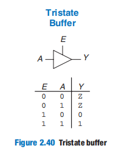

Tristate buffers are commonly used on *busses* that connect multiple chips.Only one chip at a time is allowed to assert its enable signal to drive a value onto the bus. The other chips must produce floating outputs so that they do not cause contention with the chip talking to the memory

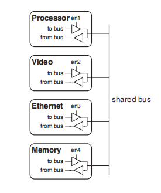

However, in modern computers, higher speeds are possible with **point-to-point links**, in which chips are connected to each other directly rather than over a shared bus. 

### 卡诺图

**Karnaugh maps** (*K-maps*) are a graphical method for simplifying Boolean equations. **K-maps work well for problems with up to four variables**

>Neither of authors has ever used a Karnaugh map in real life to solve a practical problem. But the insight gained from the principles underlying Karnaugh maps is valuable. And Karnaugh maps often appear at job interviews!

the mathematical priciple of K-maps is $PA + P\bar{A} = P$

如何利用K-map进行化简：

- writing the input combinations in **Gray Code**. It differs from ordinary binary order (00, 01, 10, 11) in that adjacent entries differ only in a single variable(00, 01, 11, 10)
- Use the fewest circles necessary to cover all the 1’s. Each circle should be as large as possible
- All the squares in each circle must contain 1’s.
- Each circle must span a rectangular block that is a power of 2 (i.e., 1, 2, or 4) squares in each direction.
- A circle may wrap around the edges of the K-map.
- A 1 in a K-map may be circled multiple times if doing so allows fewer circles to be used.

下面给出一个简单的例子：

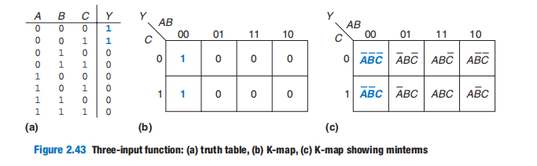

In a K-map, X’s allow for even more logic minimization. They can be circled if they help cover the 1’s with fewer or larger circles, but they do not have to be circled if they are not helpful.

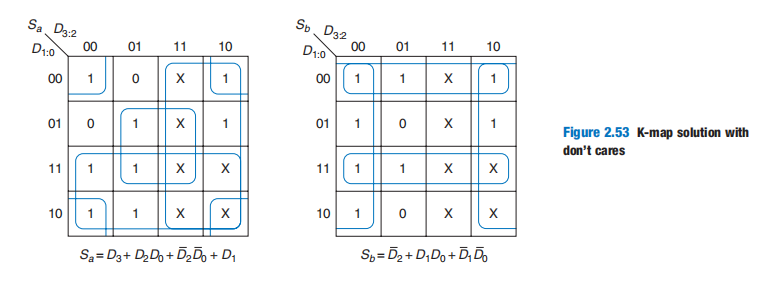

### Seven-Segment Display Decoder

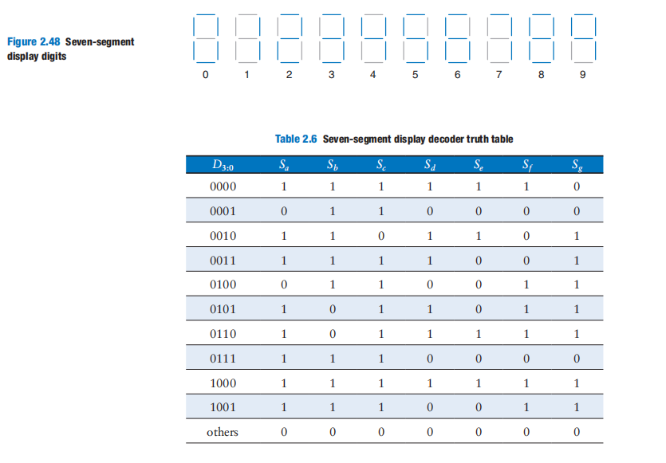

下面仅给出两个输出端$S_a$和$S_b$的卡诺图化简

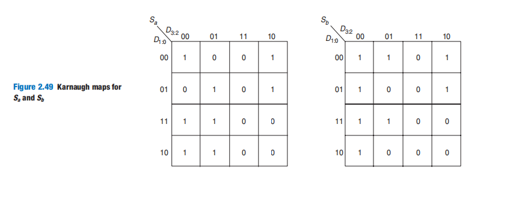

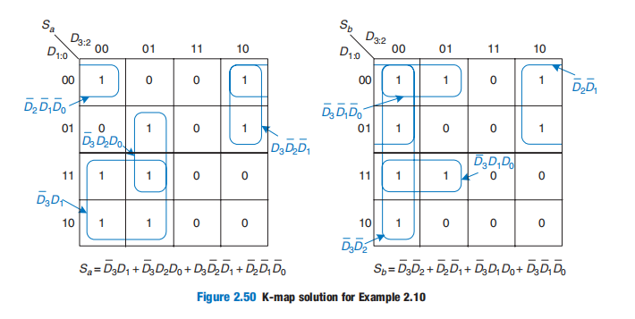

### Multiplexers

They choose an output from among several possible inputs, based on the value of a *select* signal. A multiplexer is sometimes affectionately called a **mux**.

Truth Table of 2:1 Mux :

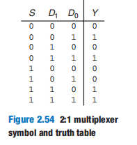

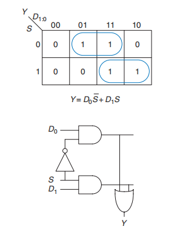

Alternatively, multiplexers can be built from tristate buffers as shown in Figure 2.56：

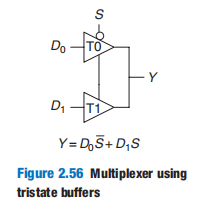

A 4:1 mux can be built : 

Wider multiplexers, such as 8:1 and 16:1 multiplexers, can be built by expanding the methods shown in Figure 2.58. In general, an *N*:1 multiplexer needs $log_2N$ select lines. Again, **the best implementation choice depends on the target technology.**

Multiplexers can be used as **lookup tables** to perform any logic functions. 

In general, a $2^N$-input multiplexer can be programmed to perform any *N*-input logic function by applying 0’s and 1’s to the appropriate data inputs

With a little cleverness, we can cut the multiplexer size in half, using only a $2^{N-1}$-input multiplexer to perform any *N*-input logic function. The strategy is to provide one of the literals to the multiplexer data inputs.

### Decoders

A decoder has $N$ inputs and $2^N$ outputs. It asserts exactly one of its outputs depending on the input combination：

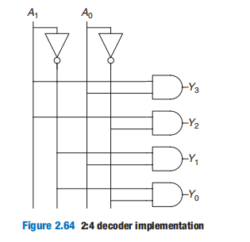

Decoders can be combined with OR gates to build any logic functions. Because each output of a decoder represents a single minterm, the function is built as the OR of all of the minterms in the function

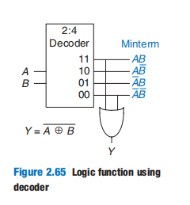

## 时序

### delay

The transition from LOW to HIGH is called the **rising edge**（上升沿）. Similarly, the transition from HIGH to LOW (not shown in the figure) is called the **falling edge**（下降沿）

Combinational logic is characterized by its **propagation delay** and **contamination delay**. The propagation delay$t_{pd}$ is the maximum time from when any input changes until the output or outputs reach their final value. The contamination delay $t_{cd}$​ is the minimum time from when any input changes until any output starts to change its value. 

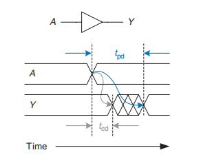

The underlying causes of delay in circuits include the time required to charge the capacitance in a circuit and the speed of light.

Calculating  $t_{pd}$ and $t_{cd}$ requires delving into the lower levels of abstraction beyond the scope of this book. However, manufacturers normally supply data sheets specifying these delays for each gate.

### Path

**Critical Path** limits the speed at which the circuit operates

### Example

请你分别给出以下三种4:1 mux实现的时序分析

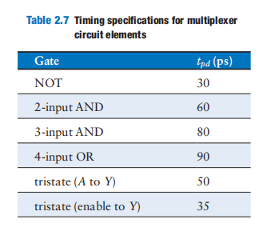

 $t_{pd\_sy}$ indicates the propagation delay from input *S* to output *Y*; *$t_{pd\_dy}$* indicates the propagation delay from input *D* to output *Y*; $t_{pd}$ for the circuit is the worst of the two: $max(t_{pd\_sy}, t_{pd\_dy})$

if $t_{pd}$ = $t_{pd\_sy}$（$t_{pd\_sy}> t_{pd\_dy}$）then this circuit is **control critical**, otherwise **data critical**

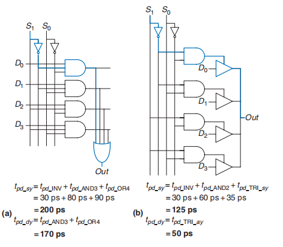

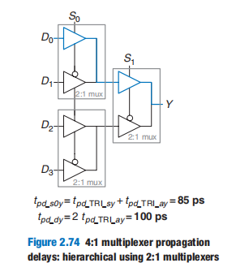

### Glitches

it is possible that a single input transition can cause *multiple* output transitions. These are called **glitches** or **hazards**

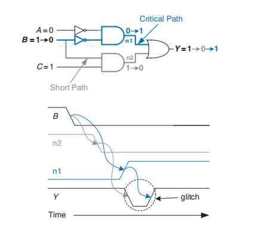

As long as we wait for the propagation delay to elapse before we depend on the output, glitches are not a problem, because the output eventually settles to the right answer

 glitches are a fact of life in most circuits. we should aware that they exist.

