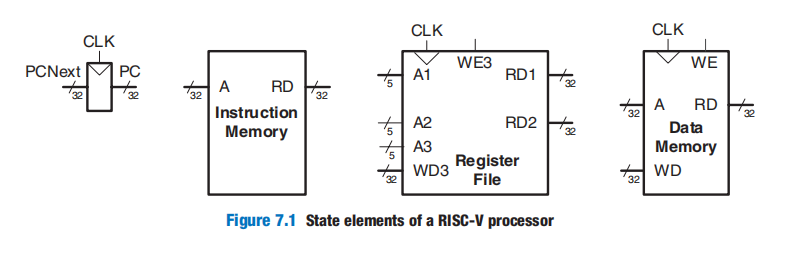
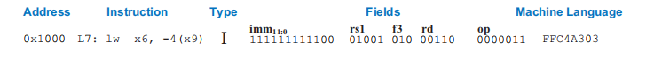
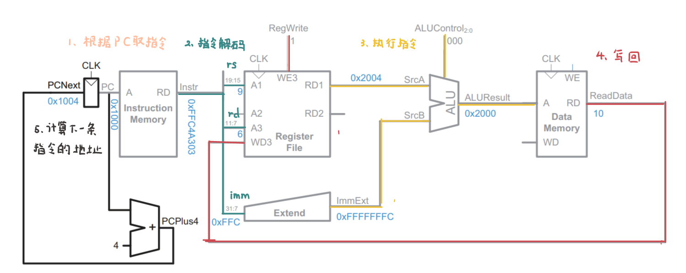
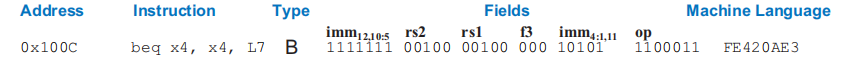
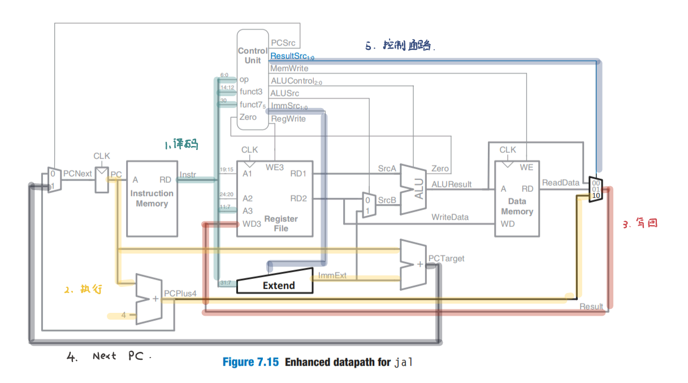
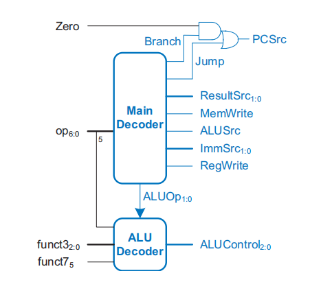
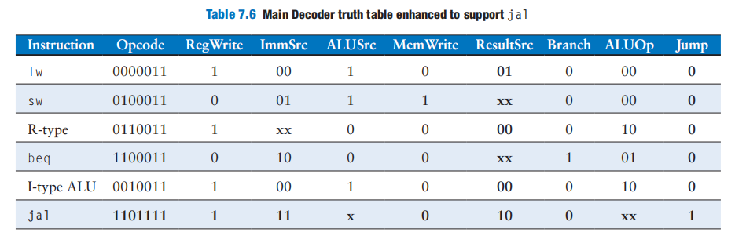

# Microarchitecture

> 我们通过三个案例（单周期、多周期、流水线），渐进式地构建RISC-V处理器，来学习微架构这一块内容。

[TOC]

## Introduction

Microarchitecture is the specific arrangement of registers, arithmetic logic units (ALUs), finite state machines (FSMs), memories, and other logic building blocks needed to implement an architecture.RISC-V, may have many different microarchitectures, each with different trade-offs of performance, cost, and complexity. 

a computer architecture is defined by its instruction set and architectural state. The **architectural state** for the RISC-V processor consists of the program counter and the 32 32-bit registers.Based on the current architectural state, the processor executes a particular instruction with a particular set of data to produce a new architectural state. Some microarchitectures contain additional **nonarchitectural state** to either simplify the logic or improve performance; 

We divide our microarchitectures into two interacting parts: 

- **datapath**：it operates on words of data. It also contains structures such as memories, registers, ALUs, and multiplexers.
-  **control unit**：it produces multiplexer select, register enable, and memory write signals to control the operation of the datapath

A good way to design a complex system is to start with hardware containing the **state elements** including  the memories and the architectural state (the program counter and registers).  it is often convenient to partition the overall memory into two smaller memories, one containing instructions and the other containing data

note that The instruction memory, register file, and data memory are all read **combinationally**. In other words, if the address changes, then the new data appears at *RD* after some propagation delay; no clock is involved. The clock controls writing only. In this fashion, the state of the system is changed only at the clock edge

In this note, we develop three microarchitectures for the RISC-V architecture: **single-cycle**, **multicycle**, and **pipelined**. They differ in how the state elements are connected and in the amount of nonarchitectural state needed.

- The **single-cycle microarchitecture** executes an entire instruction in one cycle. it does not require any nonarchitectural state. However, the cycle time is limited by the slowest instruction. Moreover, the processor requires separate instruction and data memories, which is generally unrealistic.
- The **multicycle microarchitecture** executes instructions in a series of shorter cycles.Moreover, the multicycle microarchitecture reduces the hardware cost by reusing expensive hardware blocks, such as adders and memories. The multicycle microprocessor accomplishes this by introducing several nonarchitectural registers to hold intermediate results.The multicycle processor executes only one instruction at a time, but each instruction takes multiple clock cycles. This processor requires only a single memory,
- The **pipelined microarchitecture** applies pipelining to the single-cycle microarchitecture. It also requires nonarchitectural pipeline registers. Pipelined processors must access instructions and data in the same cycle; they generally use separate instruction and data caches for this purpose

**实际上，处理器就是一个有限状态机**

## Performance Analysis

microprocessor makers often market their products based on the clock frequency and the number of cores. However, they gloss over the complications that some processors accomplish more work than others in a clock cycle and that this varies from program to program. What is a buyer to do? 

The only gimmick-free way to measure performance is by measuring the execution time of a program of interest to you. Such collections of programs are called **benchmarks**, and the execution times of these programs are commonly published to give some indication of how a processor performs. **Dhrystone**, **CoreMark**, and **SPEC** are three popular benchmarks.

$$
ExecutionTime = (\#instructions) (\frac{cycles}{instruction})(\frac{seconds}{cycle})
$$
The number of instructions in a program depends on the processor architecture. Some architectures have complicated instructions that do more work per instruction, thus reducing the number of instructions in a program. However, these complicated instructions are often slower to execute in hardware, which decreases the CPI.

The **cycles per instruction (CPI)** is the number of clock cycles required to execute an average instruction. It is the reciprocal of the throughput (**instructions per cycle**, or **IPC**). 

Many other factors affect overall computer performance. For example, the hard disk, the memory, the graphics system, and the network connection may be limiting factors that make processor performance irrelevant

## Single-Cycle Processor

我们先关注每个指令的数据通路的设计，控制通路单独说明

### lw

### sw

### or

在这里我们需要说明一些事实：

- 得益于指令格式的规整性，指令的译码很简单。仅需将32位的总线，按位分为多个子总线即可。
- 控制信号 + Mux，可以”关闭“无关的数据通路，避免这些无关数据通路干扰当前指令的执行，从而影响到结果。

### beq

这里：$PCSrc = Zero * Branch$，在Control Unit会解释这一点的。

### jal

`jal rd offset`：`[rd] = PC + 4` then `PC = PC + offset`

### Control Unit

注意：这张图中并没有包括`jal`指令的数据通路。

控制通路的核心思想就是状态机。其中，状态就是指令的操作码op、fun3、fun7，而PC控制着状态转移。就不再过多阐述，直接给出真值表

还需要说明一下，并不是所有的指令格式都有相同的立即数格式。因此，我们要根据指令码op，来解码指令对应的立即数格式。

## Multi-Cycle Processor

The single-cycle processor has three notable weaknesses：

- First, it requires separate memories for instructions and data, whereas most processors have only a single external memory holding both instructions and data. 
- Second, it requires a clock cycle long enough to support the slowest instruction (lw) even though most instructions could be faster
-  Finally, it requires three adders (one in the ALU and two for the PC logic); adders are relatively expensive circuits

The multicycle processor addresses these weaknesses by breaking an instruction into multiple shorter steps. But, this time, we also add nonarchitectural state elements to hold intermediate results between the steps

## Pipelined  Processor

## Advanced Microarchitecture

### Deep Pipelines

### Micro-Operations

### Branch Prediction

### Super-Scalar Processors

### Out-of-Order Processors

### Register Renaming

### Multithreading

### Multiprocessors

