# Sequential Logic Design

[TOC]

## Introduction

The outputs of sequential logic depend on both current and prior input values. Hence, **sequential logic has memory**. 

Sequential logic might explicitly remember certain previous inputs or it might distill the prior inputs into a smaller amount of information called the **state** . The state of a digital sequential circuit is a set of bits that contain all the information about the past necessary to explain the future behavior of the circuit.

## Latch & Flip-Flop

### Bistable Element

The fundamental building block of memory is a **bistable** element, an element with two stable states（Q = 0 or Q = 1）

如何分析该系统的状态呢？分别假定Q = 1和Q = 0，然后分析即可。若分析出Q的值与假定值相同，那么我们称Q=0这个状态是**稳定的（stable）**。

**An element with *N* stable states conveys $log_2N$ bits of information**, so a bistable element stores one bit.  $\overline{Q}$ does not contain any additional information because if *Q* is known, $\overline{Q}$ is also known

 the circuit is said to be bistable. A subtle point is that the circuit has a third possible state with both outputs approximately halfway between 0 and 1. This is called a **metastable** state

Although the cross-coupled inverters can store a bit of information, they are not practical because the user has no inputs to control the state. 

### SR Latch

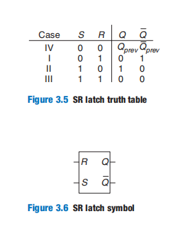

Asserting both *S* and *R* simultaneously doesn’t make much sense because it means the latch should be set and reset at the same time, which is impossible. The poor confused circuit responds by making both outputs 0.

Like the cross-coupled inverters, the SR latch is a bistable element with one bit of state stored in *Q*

### D Latch

D触发器是在SR触发器的基础上改进的：

- 决定何时（CLK = 1）可以改变状态
- 避免了同时设置Set与Reset的情况

### D Flip-Flop

D Flip-Flop对D触发器做了进一步的改进

- 在时钟上升沿处可以改变状态

When *CLK* = 0, the leader (latch L1) is transparent and the follower (L2) is opaque. Therefore, whatever value was at *D* propagates through to N1. When *CLK* = 1, the leader (L1) goes opaque and the follower (L2) becomes transparent. The value at N1 propagates through to *Q*, but N1 is cut off from *D*. Hence, whatever value was at *D*  before the clock rises from 0 to 1 gets copied to *Q* immediately after the clock rises

**Remember that a D latch is level-sensitive, whereas a D flip-flop is edge-triggered**

### Register

An *N*-bit register is a bank of *N* flip-flops that share a common *CLK* input 

### Enabled Flip-Flop

An **enabled flip-flop** adds another input called *EN* or *ENABLE* to determine whether data is loaded on the clock edge

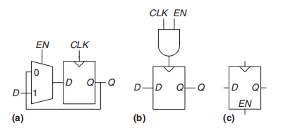

### Resettable Flip-Flop

A **resettable flip-flop** adds another input, called *RESET*. When *RESET*is FALSE, the resettable flip-flop behaves like an ordinary D flip-flop. When *RESET* is TRUE, the resettable flip-flop ignores *D* and resets the output to 0. Resettable flip-flops are useful when we want to force a known state (i.e., 0) into all the flip-flops in a system when we first turn it on.

Such flip-flops may be **synchronously** or **asynchronously resettable**. Synchronously resettable flip-flops reset themselves only on the rising edge of *CLK*. Asynchronously resettable flip-flops reset themselves as soon as *RESET* becomes TRUE, independent of *CLK*.

### Transistor-Level Latch&Flip-Flop Design

we could take advantage of transmission gates to reduce the transistor count.

A compact D latch can be constructed from a single transmission gate, as shown in Figure 3.12(a). but  it suffers from two major limitations:

- **Floating output node**：When the latch is opaque, *Q* is not held at its value by any gates. Thus, *Q* is called a *floating* or *dynamic* node. After some time, noise and charge leakage may disturb the value of *Q*.
- **No buffers**：The lack of buffers has caused malfunctions on several commercial chips. A spike of noise that pulls *D* to a negative voltage can turn on the nMOS transistor, making the latch transparent, even when *CLK* = 0

Figure 3.12(b) shows a more robust 12-transistor D latch used on modern commercial chips

 it adds inverters I1 and I2 to buffer the input and output.  The state of the latch is held on node N1. Inverter I3 and the tristate buffer, T1, provide feedback to turn N1 into a **static node**. If a small amount of noise occurs on N1 while *CLK* = 0, T1 will drive N1 back to a valid logic value.

Figure 3.13 shows a D flip-flop constructed from two static latches：

## Synchronous Logic Design

我们首先来看一个不稳定状态的电路

 Suppose that node *X* is initially 0. Then, *Y* = 1, *Z* = 0, and, hence, *X* =1, which is inconsistent with our original assumption. The circuit has no stable states and is said to be **unstable**.

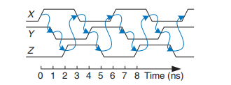

这个电路被称为**ring oscillator（环形振荡器）**。接着，我们使用以下电路来实现D Latch

 Suppose that *CLK* = *D* = 1. The latch is transparent and passes *D* through to make *Q* = 1.Now, *CLK* falls. The latch should remember its old value, keeping *Q* = 1. However, suppose that the delay through the inverter from *CLK* to *CLK* is rather long compared with the delays of the AND and OR gates. Then, nodes N1 and *Q* may both fall before *CLK* rises. In such a case, N2 will never rise and *Q*becomes stuck at 0. the circuit has a **race condition**

This is an example of **asynchronous** circuit design in which outputs are directly fed back to inputs. Asynchronous circuits are infamous for having race conditions where the behavior of the circuit depends on which of two paths through logic gates is fastest

> 严格来说，SR Latch也是一个asynchronous circuit。但是由于对称设计，消除了结果对于路径的依赖。因此基于SR Latch的Latch、Flip-Flop都可以避免竞争条件的产生。

The previous two examples contain loops called **cyclic paths**They are sequential rather than combinational circuits. Combinational logic has no cyclic paths and no races. However, sequential circuits can have undesirable races or unstable behavior. Analyzing such circuits for problems is time-consuming, and many bright people have made mistakes.

To avoid these problems, **designers break the cyclic paths by inserting registers somewhere in the path. This transforms the circuit into a collection of combinational logic and registers**. The registers contain the state of the system, which changes only at the clock edge, so we say the state is **synchronized** to the clock. If the clock is sufficiently slow, so that the inputs to all registers settle before the next clock edge, all races are eliminated. 

We often use the terms **current state** and **next state** to distinguish the state of the system at the present from the state to which it will enter on the next clock edge.

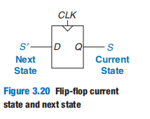

The **functional specification** details the next state and the value of each output for each possible combination of current state and input values.

The **timing specification** consists of an upper bound, $t_{pcq}$, and a lower bound, $t_{ccq}$, on the time from the rising edge of the clock until the *out*put changes, as well as **setup** and **hold** times, $t_{setup}$ and $t_{hold}$, that indicate when the *inputs* must be stable relative to the rising edge of the clock.

The rules of **synchronous sequential circuit composition** teach us that a circuit is a synchronous sequential circuit if it consists of interconnected circuit elements, such that

- Every circuit element is either a register or a combinational circuit
- At least one circuit element is a register
- All registers receive the same clock signal
- Every cyclic path contains at least one register

Sequential circuits that are not synchronous are called **asynchronous**

异步电路是一种不依赖全局时钟信号的数字电路设计方式，各模块使用请求-确认(Request-Acknowledge)握手协议来进行通信和同步。

Two other common types of synchronous sequential circuits are called **finite state machines** and **pipelines**.

下面做一个练习：判断(a) ~ (h)是否为同步电路

- (h) is not, strictly speaking, a synchronous sequential circuit, because the second register receives a different clock signal than the first, delayed by two inverter delays. 
- (a) is combinational, not sequential
- (c) is neither a combinational circuit nor a synchronous sequential circuit because it has a latch that is neither a register nor a combinational circuit
- (f) is neither combinational nor synchronous sequential because it has a cyclic path from the output of the combinational logic back to the input of the same logic but no register in the path

Of course, asynchronous circuits are occasionally necessary when communicating between systems with different clocks or when receiving inputs at arbitrary times, just as analog circuits are necessary when communicating with the real world of continuous voltages

## Finite State Machines

Synchronous sequential circuits can be drawn in the forms shown in Figure 3.22. These forms are called **finite state machines** (*FSMs*)

There are two general classes of finite state machines, characterized by their functional specifications:

- **Moore machines**, the outputs depend only on the current state of the machine
- **Mealy machines**, the outputs depend on both the current state and the current inputs

FSM的状态代表了一个通过对问题的建模抽象出的系统状态；而时序电路的状态仅代表存储元素的当前输出值。

Finite state machines provide a systematic way to design synchronous sequential circuits given a functional specification:

- 从问题描述中抽象出状态、输入、输出
- 画出状态转移图
- 确定编码方案
- 确定状态转移表与输出表
- 写出用于描述下一个状态和输出的布尔表达式
- 根据上述两表画出电路图

下面通过几个例子来体会一下上述设计有限状态机的步骤

### Case：Traffic Light

由于问题描述的篇幅过长，因此这里直接给出状态转移图：

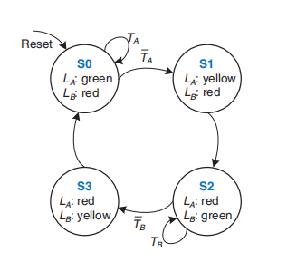

注意，只有在时钟上升沿时，状态才转移。

编码方案如下：

还可以采用one-hot的编码方案

| State | Encoding |
| :---: | :------: |
|  S0   |   0001   |
|  S1   |   0010   |
|  S2   |   0100   |
|  S3   |   1000   |

不同的编码方案对应着不同的布尔表达式，因此有着不同的电路布局。

基于以上编码方案，我们给出状态转移表与输出表：

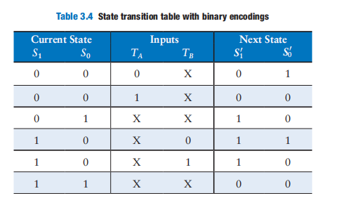

根据以上两表，我们给出布尔表达式：

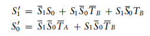

我们还可以对$S_1'$继续化简：

接着我们便根据布尔表达式画出电路图来：

Modify the traffic light controller from Section 3.4.1 to have a parade mode, which keeps the Bravado Boulevard light green.The controller receives two more inputs: *P* and *R*. Asserting *P* for at least one cycle enters parade mode. Asserting *R* for at least one cycle leaves parade mode.When in parade mode, the controller proceeds through its usual sequence until *LB* turns green, then remains in that state with *LB* green until parade mode ends.

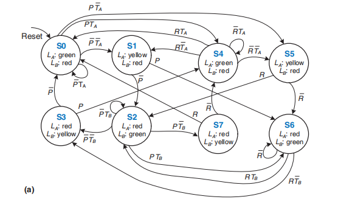

 Figure 3.34(a) shows the single FSM design. States S0 to S3 handle normal mode. States S4 to S7 handle parade mode. The two halves of the diagram are almost identical, but in parade mode, the FSM remains in S6 with a green light on Bravado Blvd. The *P* and *R* inputs control movement between these two halves. The FSM is messy and tedious to design

 Figure 3.34(b) shows the factored FSM design. The Mode FSM has two states to track whether the lights are in normal or parade mode. The Lights FSM is modified to remain in S2 while *M* is TRUE.

注意，Lights FSM中的S0、S1跟Mode FSM中的含义是不一样。其中Mode FSM中的S0表示Normal Mode（M = 0），而S1表示Parade Mode（M = 1）。

## Timing

### dynamic discipline

a flip-flop copies the input *D* to the output *Q* on the rising edge of the clock. This process is called **sampling D** on the clock edge. 

For the circuit to sample its input correctly, the input (or inputs) must have stabilized at least some **setup time**, $t_{setup}$, before the rising edge of the clock and must remain stable for at least some **hold time**, $t_{hold}$, after the rising edge of the clock. The sum of the setup and hold times is called the **aperture time** of the circuit. 

When the clock rises, the output may start to change after the clockto-*Q contamination delay*, $t_{ccq}$, and must definitely settle to the final value within the clock-to-*Q propagation delay*, $t_{pcq}$. These represent the fastest and slowest delays through the circuit, respectively. 

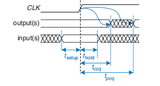

$t_{ccq}$与$t_{cd}$类似，但是$t_{ccq}$描述的是触发器的延迟，而$t_{cd}$描述的是组合逻辑电路的延迟

The **dynamic discipline** states that the inputs of a synchronous sequential circuit must be stable during the setup and hold aperture time around the clock edge

 Just as the **static discipline** limited us to using logic levels outside the forbidden zone, the **dynamic discipline** limits us to using signals that change outside the aperture time. By taking advantage of the dynamic discipline, we can think of time in discrete units called **clock cycles**, just as we think of signal levels as discrete 1’s and 0’s

Under the dynamic discipline, we are concerned only about its final value at the end of the clock cycle, after it has settled to a stable value. Hence, we can simply write *A*[*n*], the value of signal *A* at the end of the *nth* clock cycle. The clock period has to be long enough for all signals to settle. This sets a limit on the speed of the system.

### Time Constraint

The *clock period* or **cycle time**, $T_{c}$, is the time between rising edges of a repetitive clock signal. Its reciprocal, $f_c = 1/T_c$, is the **clock frequency**

To satisfy the setup time of R2, *D*2 must settle no later than the setup time before the next clock edge. Hence, we find an equation for the minimum clock period:

The above inequality is **setup time constraint** or **max-delay constraint**，where  $t_{pcq}$ + $t_{setup}$, is called the **sequencing overhead**.

The register R2 also has a **hold time constraint** or **min-delay constraint**. Its input, *D*2, must not change until some time, *t*hold, after the rising edge of the clock：

In commercial designs, the clock period is often dictated by the Director of Engineering or by the marketing department (to ensure a competitive product). Moreover, the flip-flop clock-to-*Q* propagation delay and setup time, $t_{pcq}$ and $t_{setup}$, are specified by the manufacturer. Hence, we rearrange Equation 3.13 to solve for the maximum propagation delay through the combinational logic, which is usually the only variable under the control of the individual designer.（此时，$T_c \quad t_{pcq} \quad t_{setup}$都视为常量）

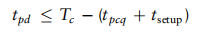

### Clock Skew

 In real systems, the clock does not reach all flip-flops at precisely the same time. This variation in time, called **clock skew**

由于clock skew，我们需要重新考虑 **setup time constraint** & **hold time constraint**：

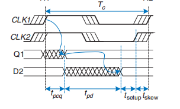

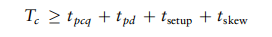

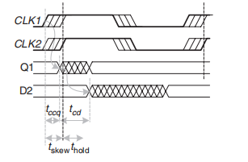

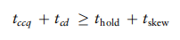

In summary, clock skew adds to the sequencing overhead, reducing the time available for useful work in the combinational logic

### Metastability

Sometimes it is impossible to satisfy the dynamic discipline, especially when interfacing with the real world. When a flip-flop samples an input that is changing during its aperture, the output *Q* may momentarily take on a voltage between 0 and $V_{DD}$ that is in the forbidden zone. This is called a **metastable** state.

> 异步电路与外界异步信号的主要区别是：
>
> - 异步电路：内部不依赖时钟信号的数字电路结构和设计方式。
> - 外界异步信号：相对于数字系统而言，在外部环境中不定时产生的信号。

If a flip-flop input changes at a random time during the clock cycle, the resolution time, $t_{res}$, required to resolve to a stable state is also a random variable. If the input changes outside the aperture, then $t_{res}$ = $t_{pcq}$. But if the input happens to change within the aperture, $t_{res}$​ can be substantially longer. Theoretical and experimental analyses  have shown that the probability that the resolution time, $t_{res}$, exceeds some arbitrary time, *t*, decreases exponentially with *t*：

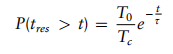

where $T_c$ is the clock period, and $T_0$ and $\tau$ are characteristic of the flipflop. **The equation is valid only for *t* substantially longer than $t_{pcq}$**

Asynchronous inputs to digital systems from the real world are inevitable.  The goal of a digital system designer should be to ensure that, given asynchronous inputs, the probability of encountering a metastable voltage is sufficiently small. To guarantee good logic levels, all asynchronous inputs should be passed through **synchronizers**.

We say that a synchronizer *fails* if *Q*, the output of the synchronizer, becomes metastable.  This may happen if  $t_{res} + t_{setup} > T_c$：

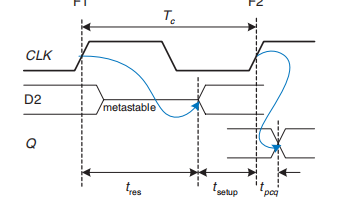

if *D* changes *N* times per second, the probability of failure per second is *N* times as great:
$$
P(failure)/sec = N\frac{T_0}{T_c}e^{-\frac{T_c - t_{setup}}{\tau}}
$$
System reliability is usually measured in **mean time between failures**(MTBF). As the name suggests, MTBF is the average amount of time between failures of the system：

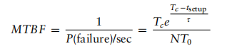

## Parallelism

The speed of a system is characterized by the**latency** and **throughput** of information moving through it. We define a **token** to be a group of inputs that are processed to produce a group of outputs.The **latency** of a system is the time required for one token to pass through the system from start to end. The **throughput** is the number of tokens that can be produced per unit time.

**parallelism** comes in two forms: 

- **spatial parallelism**：multiple copies of the hardware are provided so that multiple tasks can be done at the same time

- **temporal parallelism**：a task is broken into stages, like an assembly line. 

  针对资源复用的不同情况，我们可以将「时间并行」进一步分为：

  - 在操作系统中，阻塞方法以及抢占式调度都是线程的阶段点。同一时间只有一个子任务在执行
  - 在处理器中，一条流水线可以划分为多个阶段，用于同时处理不同阶段的子任务。同一时间有多个子任务在执行

Temporal parallelism is commonly called **pipelining**. Spatial parallelism is sometimes just called **parallelism**

Consider a task with latency $L$. In a system with no parallelism, the throughput is $1/L$. In a spatially parallel system with *N* copies of the hardware, the throughput is $N/L$. In a temporally parallel system, the task is ideally broken into $N$ steps, or stages, of equal length. In such a case, the throughput is also $N/L$, and only one copy of the hardware is required.  finding $N$ steps of equal length is often impractical. If the longest step has a latency $L_{1}$, the pipelined throughput is $1/L_1$.

Pipelining (temporal parallelism) is particularly attractive because it speeds up a circuit without duplicating the hardware. Instead, registers are placed between blocks of combinational logic to divide the logic into shorter stages that can run with a faster clock. The registers prevent a token corrupting the token in the next stage 

**Adding a pipeline stage improves throughput at the expense of some latency**. 

此时，理器的时钟周期取决于子任务中的最长延迟。每个任务的执行时间与这个最长延迟的差额总和，就是延迟的代价。
