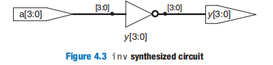
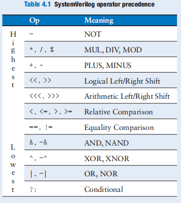
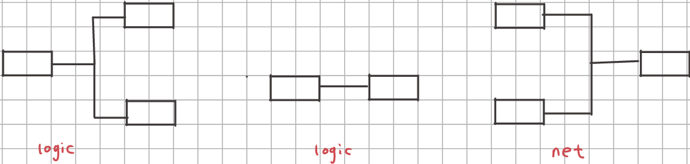
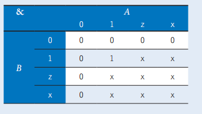
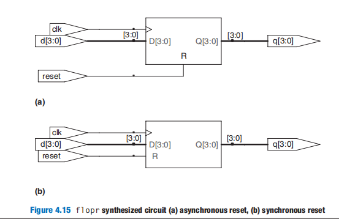
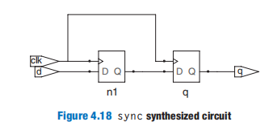
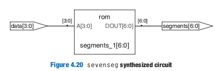
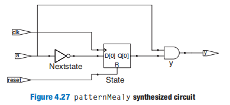

# SystemVerilog

## Introduction

Thus far, we have focused on designing combinational and sequential digital circuits at the schematic level. The process of finding an efficient set of logic gates to perform a given function is labor intensive and error prone. In the 1990’s, designers discovered that they were far more productive if they worked at a higher level of abstraction, specifying just the logical function and allowing a **computer-aided design** (*CAD*) tool to produce the optimized gates. The specifications are generally given in a **hardware description language（HDL）**

**HDL与HTML类似，是描述性语言。所以我们不能用过程式或命令式的思维去编写HDL**。

The two major purposes of HDLs are logic 

- **simulation**：inputs are applied to a module, and the outputs are checked to verify that the module operates correctly

- **synthesis**：the textual description of a module is transformed into logic gates.

A block of hardware with inputs and outputs is called a **module**，The two general styles for describing module functionality：

- **behavioral**：describe what a module does
- **structural**： describe how a module is built from simpler pieces

下面我们通过一些代码片段来学习`SystemVerilog`

## behavioral

~~~systemverilog
//A SystemVerilog module begins with the module name and a listing of the inputs and outputs

//logic signals such as the inputs and outputs are Boolean variables (0 or 1).logic should be used everywhere except on signals with multiple drivers. Signals with multiple drivers are called nets
module sillyfunction(
    input logic a, b, c
    output logic y
);
    //The assign statement describes combinational logic
    // ~ indicates NOT, & indicates AND, and | indicates OR
    assign y = ~a & ~b & ~c |
        		a & ~b & ~c |
        		a & ~b & c;
    
endmodule
~~~

~~~systemverilog
//a[3:0] represents a 4-bit bus. The bits, from most significant to least significant, are a[3], a[2], a[1], and a[0]. This is called little-endian order. we could have used a[0:3], in which case the bits, from most significant to least significant, would be a[0], a[1], a[2], and a[3]. This is called big-endian order.

module inv(
    input logic [3:0] a,
    output logic [3:0] y
);
    assign y = ~a;
endmodule
~~~

~~~systemverilog
//~, ^, and | are examples of SystemVerilog operators, whereas a, b, and y1 are operands. A combination of operators and operands, such as a & b, or ~(a | b), is called an expression. A complete command such as assign y4 = ~(a & b); is called a statement.

module gates(
    //注意，这里a、b都是logic [3:0]
    input logic [3:0] a, b,
 	output logic [3:0] y1, y2, y3, y4, y5
);
    
    //assign out = in1 op in2; is called a continuous assignment statement
    assign y1 = a & b; // AND
    assign y2 = a | b; // OR
    assign y3 = a ^ b; // XOR
    assign y4 = ~(a & b); // NAND
    assign y5 = ~(a | b); // NOR
endmodule

~~~

~~~systemverilog
//Reduction operators imply a multiple-input gate acting on a single bus.reduction operators exist for AND, OR, XOR, NAND, NOR, and XNOR gates

module and8(
 	input logic [7:0] a,
 	output logic y
);
    assign y = &a;		//reduction operators

    // &a is much easier to write than
    // assign y = a[7] & a[6] & a[5] & a[4] &
    // a[3] & a[2] & a[1] & a[0];
endmodule
~~~

~~~systemverilog
module mux2(
    //这里d0、d1都是logic [3:0]，而s为logic
    input logic [3:0] d0, d1,
	input logic s,
 	output logic [3:0] y
);
 //The conditional operator ?: chooses, based on a first expression, between a second and third expression. ?: is especially useful for describing a multiplexer
 assign y = s ? d1 : d0;
    
endmodule
~~~

Underscores in numbers are ignored and can be helpful in breaking long numbers into more readable chunks

HDLs use z to indicate a floating value. 

~~~systemverilog
// y is declared as tri rather than logic. logicsignals can only have a single driver. Tristate busses can have multiple drivers, so they should be declared as a net. Two types of nets in SystemVerilog are called tri and trireg. Typically, exactly one driver on a net is active at a time, and the net takes on that value.If no driver is active, a tri floats (z), while a trireg retains the previous value. If no type is specified for an input or output, tri is assumed.

module tristate(
    input logic [3:0] a,
 	input logic en,
	output tri [3:0] y
);
 	assign y = en ? a : 4'bz;
endmodule
~~~

If a gate receives a floating input, it may produce an x output when it can’t determine the correct output value. Similarly, if it receives an illegal or uninitialized input, it may produce an x output

~~~systemverilog
//bit swizzling
assign y = {c[2:1], {3{d[0]}}, c[0], 3'b101};

//The {} operator is used to concatenate busses. {3{d[0]}}indicates three copies of d[0].If y were wider than 9 bits, zeros would be placed in the most significant bits.
~~~

~~~systemverilog

//a timescale directive that indicates the value of each time unit.  In this file, each unit is 1 ns and the simulation has 1 ps precision. If no timescale directive is given in the file, a default unit and precision (usually 1 ns for both) are used

'timescale 1ns/1ps
module example(
    input logic a, b, c,
    output logic y
);
    
    logic ab, bb, cb, n1, n2, n3;
    //These delays are ignored during synthesis
    //# symbol is used to indicate the number of units of delay. It can be placed in assign statements
    assign #1 {ab, bb, cb} = ~{a, b, c};
    assign #2 n1 = ab & bb & cb;
    assign #2 n2 = a & bb & cb;
    assign #2 n3 = a & bb & c;
    assign #4 y = n1 | n2 | n3;
    
endmodule
~~~

## Structural

In general, complex systems are designed *hierarchically*. The overall system is described structurally by instantiating its major components. Each of these components is described structurally from its building blocks and so forth recursively until the pieces are simple enough to describe behaviorally. It is good style to **avoid (or at least to minimize) mixing structural and behavioral descriptions within a single module**.

~~~systemverilog
module mux4(
    input logic [3:0] d0, d1, d2, d3,
 	input logic [1:0] s,
 	output logic [3:0] y
);
    logic [3:0] low, high;
    //The three mux2 instances are called lowmux, highmux, and finalmux
    mux2 lowmux(d0, d1, s[0], low);
    mux2 highmux(d2, d3, s[0], high);
    mux2 finalmux(low, high, s[1], y);
endmodule
~~~

## Sequential Logic

~~~systemverilog
module flop(
	input logic	clk,
    input logic[3:0] d,
    output logic [3:0] q
);
    //always statements can be used to imply flip-flops, latches, or combinational logic, depending on the sensitivity list and statement. Because of this flexibility, it is easy to produce the wrong hardware inadvertently. SystemVerilog introduces always_ff, always_latch, and always_comb to reduce the risk of common errors. always_ff behaves like always but is used exclusively to imply flip-flops and allows tools to produce a warning if anything else is implied.
    always_ff @(sensitivity list)
        //The statement is executed only when the event specified in the sensitivity list occurs
        statement;
endmodule
~~~

~~~systemverilog
module flop(
	input logic	clk,
    input logic[3:0] d,
    output logic [3:0] q
);
    // the flip-flop copies d to q on the positive edge of the clock and otherwise remembers the old state of q
    always_ff @(posedge clk)
        q <= d;
    //<= is called a nonblocking assignment.  Note that <= is used instead of assign inside an always statement.
endmodule
~~~

~~~systemverilog
module flopr(
	input logic clk,
    input logic reset,
    input logic [3:0] d,
    output logic [3:0] q
);
     // asynchronous reset
    always_ff @(posedge clk, posedge reset)
        if (reset) q <= 4'b0;
    	else q <= d;
endmodule

module flopr(
	input logic clk,
    input logic reset,
    input logic [3:0] d,
    output logic [3:0] q
);
     // synchronous reset
    always_ff @(posedge clk, posedge reset)
        if (reset) q <= 4'b0;
    	else q <= d;
endmodule
~~~

~~~systemverilog
module flopenr(
    input logic clk,
    input logic reset,
    input logic en,
    input logic [3:0] d,
    output logic [3:0] q
);
    // asynchronous reset
    always_ff @(posedge clk, posedge reset)
        if (reset) q <= 4'b0;
        else if (en) q <= d;
    	//retains its old value if both reset and en are FALSE
endmodule
~~~

~~~systemverilog
module sync(
    input logic clk,
    input logic d,
    output logic q
);
    logic n1;
    always_ff @(posedge clk)
    //Notice that the begin/end construct is necessary because multiple statements appear in the always statement
    begin
        n1 <= d; // nonblocking
        q <= n1; // nonblocking
    end
endmodule
~~~

~~~systemverilog
module latch(
	input logic clk,
    input logic [3:0] d,
    output logic [3:0] q
);
    //always_latch is equivalent to always @(clk, d).  It evaluates whenever clk(in condition of if statement) or d (all signal in right-hand side of <=) changes
    always_latch
        if (clk) q <= d;
endmodule
~~~

~~~systemverilog
module inv(
    input logic [3:0] a,
    output logic [3:0] y
);
    //always_comb reevaluates the statements inside the alwaysstatement whenever any of the signals on the right-hand side of <= or = in the always statement change. always_comb is equivalent to always @(*)
    always_comb
    	y = ~a;
    //The = in the always statement is called a blocking assignment, in contrast to the <= nonblocking assignment. In SystemVerilog, it is good practice to use blocking assignments for combinational logic and nonblocking assignments for sequential logic
    
endmodule
~~~

HDLs support **blocking** and **nonblocking assignments** in an always/process statement.A group of blocking assignments are evaluated in the order in which they appear in the code. A group of nonblocking assignments are evaluated concurrently; all of the statements are evaluated before any of the signals on the left-hand sides are updated.

Do not confuse blocking assignments with continuous assignment, i.e., the **assign** statement. **assign** statements must be used outside **always** statements and are also evaluated concurrently

~~~systemverilog
module sevenseg(
    input logic [3:0] data,
    output logic [6:0] segments
);
    always_comb
    //case statement that must appear inside an always/process statement.
    //case can easily describe the truth table.
    case(data)
        0: segments = 7'b111_1110;
        1: segments = 7'b011_0000;
        2: segments = 7'b110_1101;
        3: segments = 7'b111_1001;
        4: segments = 7'b011_0011;
        5: segments = 7'b101_1011;
        6: segments = 7'b101_1111;
        7: segments = 7'b111_0000;
        8: segments = 7'b111_1111;
        9: segments = 7'b111_0011;
        default: segments = 7'b000_0000;
    endcase
endmodule
~~~

~~~systemverilog
module priority_casez(
    input logic [3:0] a,
    output logic [3:0] y
);
    
always_comb
    //The casez statement acts like a case statement except that it also recognizes ? as don’t care.
    //Truth Tables with Don’t Cares
    casez(a)
        4'b1???: y = 4'b1000;
        4'b01??: y = 4'b0100;
        4'b001?: y = 4'b0010;
        4'b0001: y = 4'b0001;
        default: y = 4'b0000;
    endcase
endmodule
~~~

alway是使用于任何场景的，但是没有语义检查。always_ff用于描述flip-flop；always_comb用于描述组合电路；always_latch用于描述latch的。

​    下面我们通过两个例子来说明如何用HDL描述一个有限状态机：

~~~systemverilog
module patternMoore(
    input logic clk,
    input logic reset,
    input logic a,
    output logic y
);
    ////the typedef statement defines statetype to be a two-bit logic value with three possibilities: S0, S1, or S2. state and nextstate are statetype signals.
    typedef enum logic [1:0] {S0, S1, S2} statetype;
    statetype state, nextstate;
    
    // state register
    always_ff @(posedge clk, posedge reset)
        if (reset) state <= S0;
        else state <= nextstate;
    
    // next state logic
    always_comb
        case (state)
            S0: if (a) nextstate = S0;
            	else nextstate = S1;
            S1: if (a) nextstate = S2;
            	else nextstate = S1;
            S2: if (a) nextstate = S0;
            	else nextstate = S1;
            default: nextstate = S0;
        endcase
    
    //这里always_ff是在上升沿触发的，而always_comb是在水平沿触发的，可以认为这里always_ff先于always_comb执行
    
    // output logic
    assign y = (state == S2);
endmodule
~~~

always_ff与always_comb描述了有限状态机的核心逻辑：状态转移

~~~systemverilog
module patternMealy(
    input logic clk,
    input logic reset,
    input logic a,
    output logic y
);
    typedef enum logic {S0, S1} statetype;
    statetype state, nextstate;
    
    // state register
    always_ff @(posedge clk, posedge reset)
        if (reset) state <= S0;
        else state <= nextstate;
    
    // next state logic
    always_comb
        case (state)
            S0: if (a) nextstate = S0;
            	else nextstate = S1;
            S1: if (a)nextstate = S0;
            	else nextstate = S1;
            default: nextstate = S0;
        endcase
    
    // output logic
    assign y = (a & state == S1);
endmodule
~~~

~~~systemverilog
// 4.33(a): unsigned multiplier
module multiplier(
    input logic [3:0] a, b,
    output logic [7:0] y
);
   assign y = a * b;
endmodule

// 4.33(b): signed multiplier
module multiplier(
    input logic signed [3:0] a, b,
    output logic signed [7:0] y
);
    //In SystemVerilog, signals are considered unsigned by default. Adding the signed modifier causes the signal a to be treated as a signed. it influences the algorithm of mul or div.
   assign y = a * b;
endmodule
~~~

~~~systemverilog
//HDLs permit variable bit widths using parameterized modules
module mux2 
    #(parameter width = 8)(
    input logic [width–1:0] d0, d1,
    input logic s,
    output logic [width–1:0] y
);
    assign y = s ? d1 : d0;
endmodule

//use paramterized modules
mux2 #(12) lowmux(d0, d1, s[0], low);
~~~

~~~systemverilog
module decoder
	#(parameter N = 3)(
	input logic [N–1:0] a,
    output logic [2**N–1:0] y
    //2**N indicates 2^N.
);
    always_comb
    begin
        y = 0;
        y[a] = 1;		//logic a is used as value 
    end
endmodule
~~~

~~~systemverilog
//HDLs also provide generate statements to produce a variable amount of hardware, depending on the value of a parameter. generatesupports for loops and if statements to determine how many of what types of hardware to produce

//Of course, a reduction operator would be cleaner and simpler for this application
module andN
 	#(parameter width = 8)(
    input logic [width–1:0] a,
    output logic y
);
    
 genvar i;
 logic [width–1:0] x;
    
 generate
     assign x[0] = a[0];
     for(i=1; i<width; i=i+1) 
     //The begin in a generate for loop must be followed by a : and an arbitrary label (forloop, in this case).
     begin: forloop
     	assign x[i] = a[i] & x[i–1];
     end
 endgenerate
    
 assign y = x[width–1];
endmodule
~~~

## TestBenches

A **testbench** is an HDL module that is used to test another module, called the **device under test (DUT)**. The testbench contains statements to apply inputs to the DUT and, ideally, to check that the correct outputs are produced. The input and desired output patterns are called **test vectors**.

> 如果您的testbench本身就有逻辑错误，那么测试工作就毫无意义 :) 。
>
> testbench编写逻辑如下：
>
> - 如果测试单元的输入与输出关系明确，直接断言验证即可
> - 用另一个正确的程序（通常来说，优化很差）与该被测单元进行对拍。

~~~systemverilog
module testbench1();
    logic a, b, c, y;
    // instantiate device under test
    sillyfunction dut(a, b, c, y);
    
    // The initial statement executes the statements in its body at the start of simulation. In this case, it first applies the input pattern 000 and waits for 10 time units. It then applies 001 and waits 10 more units, and so forth until all eight possible inputs have been applied
    initial 
    begin
        a = 0; b = 0; c = 0; #10;
        c = 1; #10;
        b = 1; c = 0; #10;
        c = 1; #10;
        a = 1; b = 0; c = 0; #10;
        c = 1; #10;
        b = 1; c = 0; #10;
        c = 1; #10;
    end
    
    //initial statements should be used only in testbenches for simulation, not in modules intended to be synthesized into actual hardware.
endmodule
~~~

~~~systemverilog
module testbench2();
    logic a, b, c, y;
    // instantiate device under test
    sillyfunction dut(a, b, c, y);

	//The SystemVerilog assert statement checks whether a specified condition is true. If not, it executes the else statement.
    initial 
    begin
        a = 0; b = 0; c = 0; #10;
        assert (y === 1) else $error("000 failed.");
        c = 1; #10;
        assert (y === 0) else $error("001 failed.");
        b = 1; c = 0; #10;
        assert (y === 0) else $error("010 failed.");
        c = 1; #10;
        assert (y === 0) else $error("011 failed.");
        a = 1; b = 0; c = 0; #10;
        assert (y === 1) else $error("100 failed.");
        c = 1; #10;
        assert (y === 1) else $error("101 failed.");
        b = 1; c = 0; #10;
        assert (y === 0) else $error("110 failed.");
        c = 1; #10;
        assert (y === 0) else $error("111 failed.");
    end
endmodule
~~~

~~~systemverilog
//An even better approach is to place the test vectors in a separate file
module testbench3();
    logic clk, reset;
    logic a, b, c, y, yexpected;
    logic [31:0] vectornum, errors;
    logic [3:0] testvectors[10000:0];
    // instantiate device under test
    sillyfunction dut(a, b, c, y);
    
    // generate clock
    always
    begin
    	clk = 1; #5; clk = 0; #5;
    end
    
    
    // at start of test, load vectors
    // and pulse reset
    initial
    begin
        $readmemb("example.txt", testvectors);
        vectornum = 0; errors = 0;
        reset = 1; #22; reset = 0;
    end
    
    // apply test vectors on rising edge of clk
    always @(posedge clk)
    begin
    	#1; {a, b, c, yexpected} = testvectors[vectornum];
    end
    
    
    // check results on falling edge of clk
    always @(negedge clk)
        if (~reset) 
        begin // skip during reset
            if (y !== yexpected) 
            begin // check result
                $display("Error: inputs = %b", {a, b, c});
                $display(" outputs = %b (%b expected)", y, yexpected);
                errors = errors + 1;
            end
            
            vectornum = vectornum + 1;
            
            if (testvectors[vectornum] === 4'bx) 
            begin
                $display("%d tests completed with %d errors",
                vectornum, errors);
                $stop;
            end
        end
endmodule
~~~

