# Scroll原理

[TOC]


## ListView


ListView的构造函数根据参数，创建出一个SliverChildDelegate对象。Delegate类是用来说明Sliver的配置信息的。


然后在`buildChildLayout`方法中将`childrenDelegate`对象传入，构建出相应的`Sliver`组件：

~~~dart
  final SliverChildDelegate childrenDelegate; 

  @override
  Widget buildChildLayout(BuildContext context) {
    if (itemExtent != null) {
      return SliverFixedExtentList(
        delegate: childrenDelegate,
        itemExtent: itemExtent!,
      );
    } else if (prototypeItem != null) {
      return SliverPrototypeExtentList(
        delegate: childrenDelegate,
        prototypeItem: prototypeItem!,
      );
    }
    return SliverList(delegate: childrenDelegate);
  }
~~~


## BoxScrollView

`BoxScrollView` 类信息：可以看出它是一个抽象类，只有一个 `buildChildLayout` 抽象方法。只维护一个 `padding` 成员


`BoxScrollView` 中覆写了父类的 `buildSlivers` 方法（本身是一个模板设计模式），返回`List<Widget>`：


这里的 `buildSlivers` 就是负责创建`Sliver`列表的，虽然这个列表只有一个元素。

`第 714` 行的创建的 `sliver` 组件，是由 子类（ListView、GridView） 实现的 `buildChildLayout` 方法负责构建的

`BoxScrollView` 作为抽象类，只是为了在构建时通过 `SliverPadding` 组件处理边距。并通过抽象方法 `buildChildLayout` 构建滑动内容，而具体实现会交由子类完成。

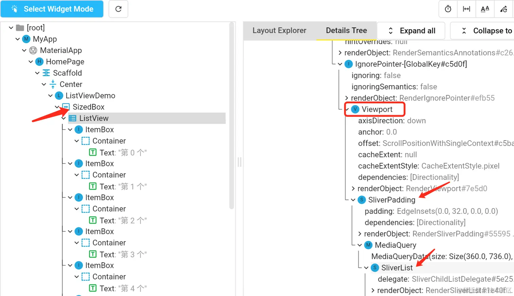


## ScrollView

`ScrollView` 是一个继承自 `StatelessWidget` 抽象类。下面是 `ScrollView` 类的结构：它抽象出一个 `buildSlivers` 方法：

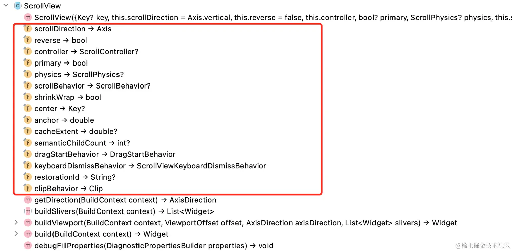


`ScrollView` 想要支持滑动，那就必然需要构建 `Sliver`，但它并不关心具体的`Sliver`构建逻辑，所以抽象出 `buildSlivers` 的行为，交由子类来实现。

`BoxScrollView` 作为 `ScrollView` 的子类，它只想处理一下 `padding`以及返回只有一个`Sliver` 的列表，但也不想关心这个`Sliver` 的构建逻辑，所以抽象出 `buildChildLayout` 的行为，交由子类实现。

`ListView` 不是抽象类，作为 `BoxScrollView` 的子类，必然要去实现 `buildChildLayout` 来创建 `sliver`

这里就体现了面向对象的设计思想（多态 + 继承）：将有共同的属性或者行为抽象为一个父类，父类将有差异化的行为抽象，由子类来负责实现（override）

这就是由 **个性到共性**的探索


在创建完内容列表 `slives` 后，下来 `第 393 行`会使用 `成员属性` 创建 `Scrollable` 组件对象。`Scrollable` 组件便是负责监听拖动事件，处理偏移逻辑的核心类。


构造Scrollable对象时，最为关键的就是viewportBuilder参数，这个回调函数调用buildViewport方法来构建一个Viewport组件。Viewport组件并不关心滑动偏移量的计算过程。随着触点的拖动， `Scrollable` 会通过一定的手段将偏移量告诉它，从而更新显示。

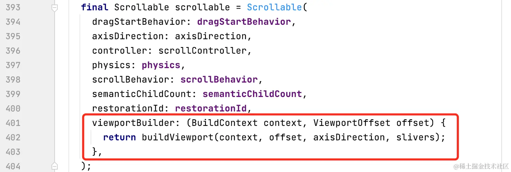


## GridView

`GridView` 继承自 `BoxScrollView`，这就说明它和 `ListView` 一样：滑动处理、视口构建、边距处理 ，这些都逻辑已经在 上层抽象 中被处理好了。自己只需要实现父类的`buildChildLayout`抽象方法，创建一块滑动内容组件 (sliver)。


`GridView` 中有两个成员 `childrenDelegate` 和 `gridDelegate` ，这两个成员将作为入参用来创建 `SliverGrid` 。


~~~dart
  final SliverGridDelegate gridDelegate;
  final SliverChildDelegate childrenDelegate;
~~~


其中 `gridDelegate` 成员是必须传入的参数，通过 `this.属性` 在入参中进行初始化。另外 `childrenDelegate` 成员的初始化和 `ListView`一样：使用入参在构造时创建 `SliverChildListDelegate` 对象为它赋值

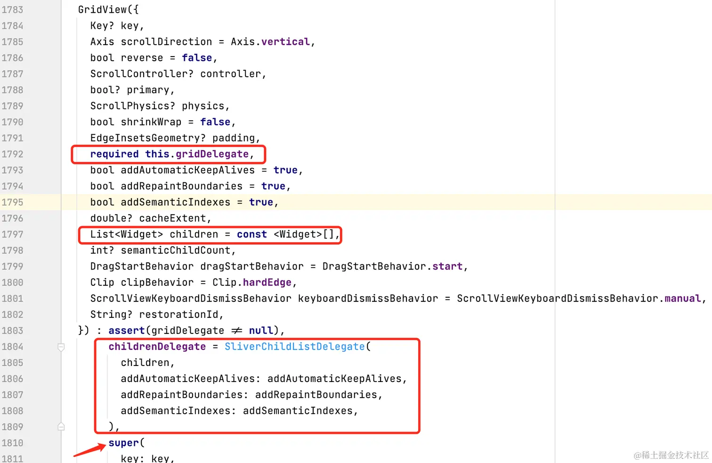

由于普通构造必须传入 `gridDelegate`，使用时需要创建 `SliverGridDelegate` 对象，而 `SliverGridDelegate` 是抽象类，`Flutter` 中提供了如下两个可用的实现类：


`SliverGridDelegateWithFixedCrossAxisCount` 特点是固定`交叉轴`的数量，并会为每个条目`进行强约束`：

|                                                              |                                                              |                                                              |
| ------------------------------------------------------------ | ------------------------------------------------------------ | ------------------------------------------------------------ |
| 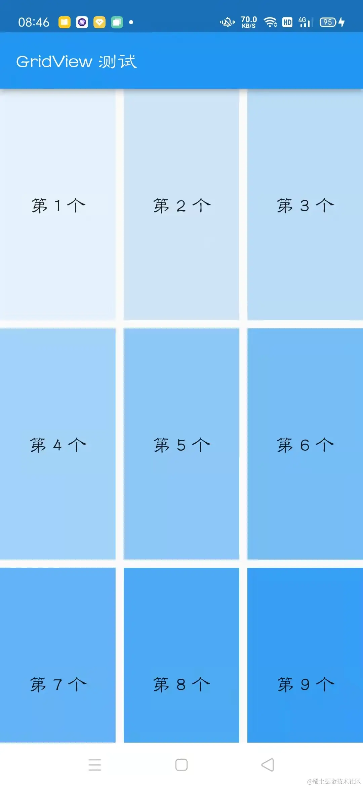 | 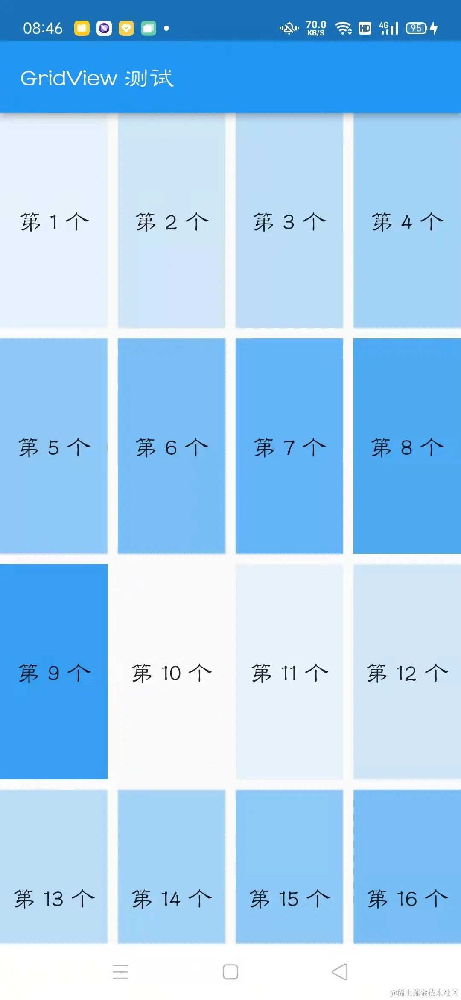 |  |

SliverGridDelegateWithMaxCrossAxisExtent指定条目在`交叉轴方向`的最大尺寸，其中count = 交叉轴视口可用尺寸/maxCrossAxisExtent 向上取整

GridView地count构造和extent构造都是避免与Delegate打交道地，方便使用

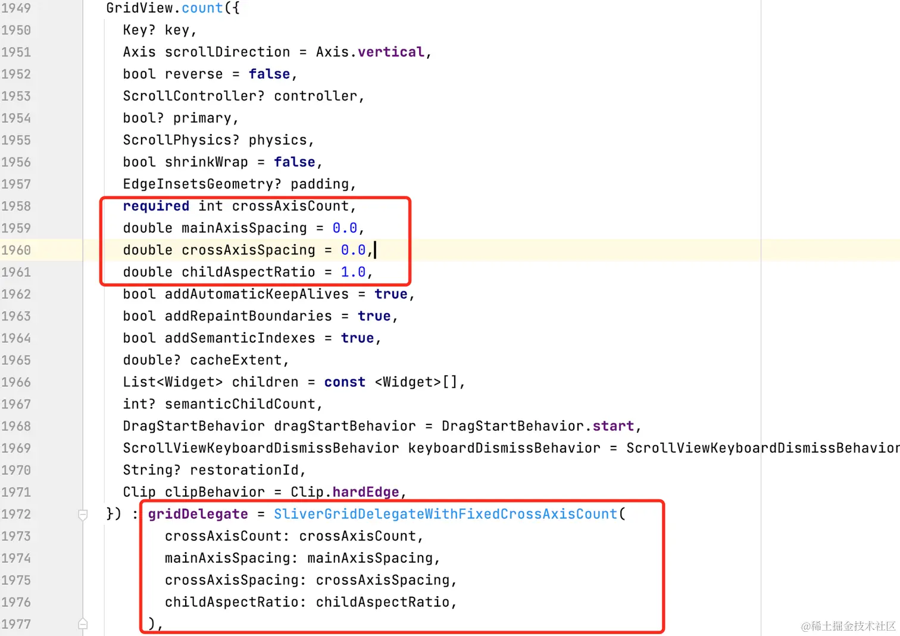


此外还有builder构造以及custom构造

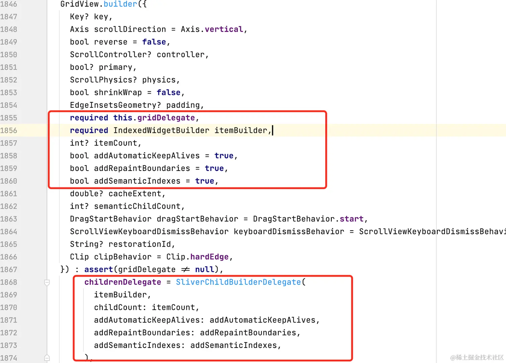


`GridView` 源码核心是对 `gridDelegate` 和 `childrenDelegate` 成员的维护，五个构造方法只是使用不同的方式为这两个成员赋值。把握住这个核心，你就能在纷繁的代码中看到一条清晰的线索，从而不被表象所迷惑。

`GridView` 组件的本质，就是通过构建 `SliverGrid` 组件完成父类抽象出的 `buildChildLayout` 方法，创建`一块滑动内容组件 `


## CustomScrollView

`CustomScrollView` 直接继承自 `ScrollView` ，说明它需要实现父类的抽象方法 `buildSlivers` 来构建滑动内容组件列表 

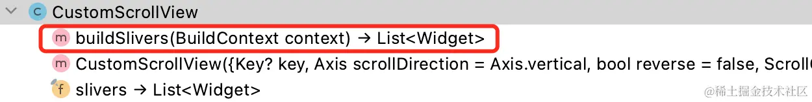


可以看到其中有一个 `slivers` 成员，类型为`List<Widget>` ，即`组件列表`。这个成员是在入参时被初始化的，也就是说使用 `CustomScrollView` 时，滑动内容组件列表构建的任务是交由`使用者` 来完成的。


`buildSlivers` 的具体实现直接返回使用者传入的 `slivers`

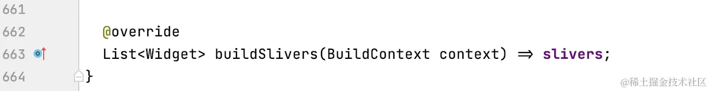


 `ListView` 和 `GridView` 只能创建 一个`Sliver`；而通过 `CustomScrollView` ，用户可以创建`List<Sliver>`，并且自定义这些Sliver


`GridView` 是一个 完整的滑动体，其中包含 `Scrollable` 滑动处理器、`Viewport` 视口和 `SliverGrid` 滑动内容； 而 `SliverGrid` 只是要显示的内容，其本身并不具有滑动的能力。


## Scrollable初步

首先， `Scrollable` 是一个 `StatefulWidget`


~~~dart
typedef ViewportBuilder = Widget Function(BuildContext context, ViewportOffset position);
final ViewportBuilder viewportBuilder;
~~~


之所以设置`ViewportBuilder`回调，是因为 `Scrollable` 希望将组件构建的逻辑交由外界处理，自身只处理手势事件，这样很符合单一职责原则。如下是 `ScrollableState#build` 的逻辑 ，可以看出内部集成了 `RawGestureDetector` 来处理手势事件：


`ScrollableState` 是一个比较复杂的类，其中实现了拖动手势事件处理的核心逻辑。如下，它实现 `ScrollContext` 接口，而且混入了 `TickerProviderStateMixin` 和 `RestorationMixin` 。 


`ScrollPosition` 类型的 `_position` 对象是 `ScrollableState` 类非常重要的一个成员。其中包含滑动的偏移量 `pixels` ，视口会根据该偏移量决定显示的内容，当用户滑动视口时，该值会改变，从而达到内容滑动的效果。


## Viewport初步

`Viewport` 组件继承自 `MultiChildRenderObjectWidget` ，这就说明它可以容纳`多个子组件`。它主要是通过给定的偏移量来决定显示的内容区域，随着偏移量的变化，显示区域就会变化，从而就可以看到不同的内容。

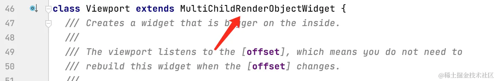


从下面的 `createRenderObject` 方法中可以看出：`Viewport` 组件维护的渲染对象类型是 `RenderViewport` 。另外，`Viewport` 组件的 8 个成员属性都会用于创建 `RenderViewport` 对象。

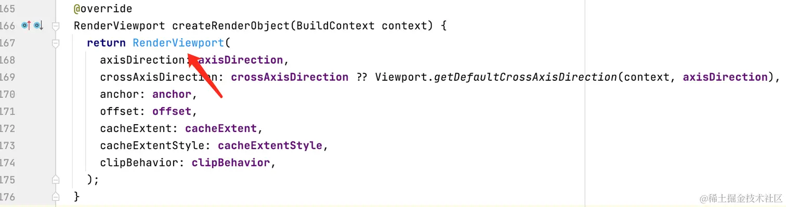

`Viewport` 构造中会通过入参对八个成员进行赋值，从 `73 行` 可以看出 `slivers` 参数传入到super构造函数中 ，为 父类中的 `children` 成员赋值：

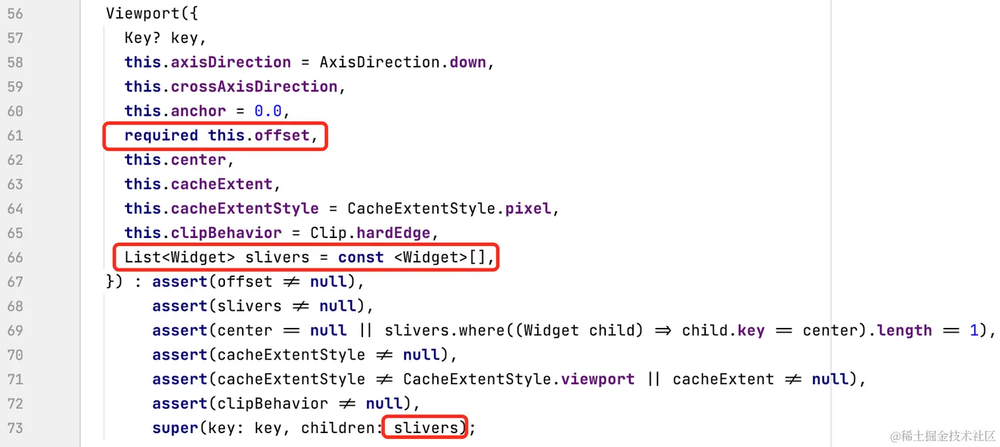

另外，值得注意的是 `offset` 参数是必须传入的。从成员声明中可以看出 `offset` 的类型为 `ViewportOffset` 。

~~~dart
final ViewportOffset offset;
~~~

在`ScrollView` 组件的实现中，`Viewport` 对象的`offset` 成员是通过 `buildViewport` 的参数offset来赋值的：

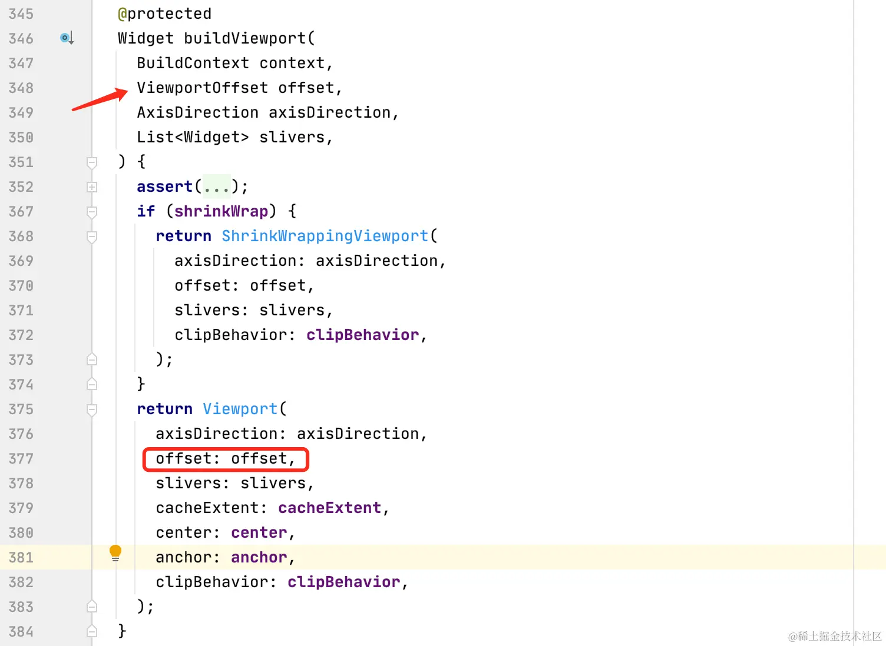

而buildViewport()在viewportBuilder回调函数中调用，而viewportBuilder回调函数是构造Scrollable对象时传入的参数。

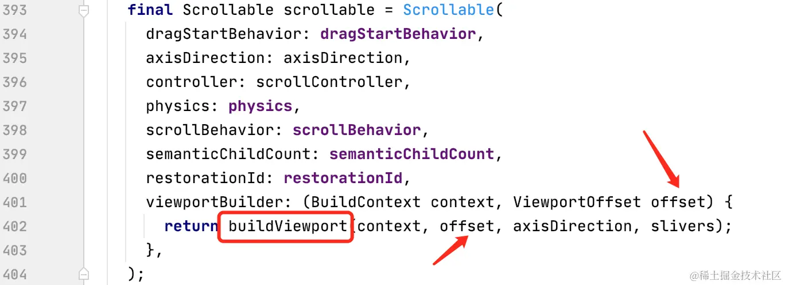

当Scrollable监听到滚动手势后，计算出position，并将position传入到viewportBuilder这个回调函数中：


这样Scrollable中的position变量就传递给了Viewport的offset变量了


到这里，整个滑动体系的`大致轮廓`就已经浮出水面了，主要分为三层。

- `第一层`：对 `Scrollable` 和 `Viewport` 进行封装，分化出不同功能的滑动组件，从而方便使用。
- `第二层`：是视口滑动的三个组成部分，包括 `Scrollable 滑动处理` 、 `Viewport 视口 `和 `Sliver 内容` 。
- `第三层`：是第二层的底层实现，包括手势响应机制、相关渲染对象的 `布局 `与 `绘制 `处理。

## Scrollable成员

`Scrollable` 中维护了如下 `10` 个成员：


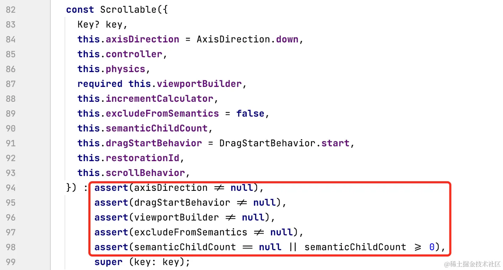


### axisDirection

其类型为 `AxisDirection` 枚举，它表示 `滑动方向`。包括如下四个元素：

```dart
dart复制代码enum AxisDirection {
  up, // 向上
  right, // 向右
  down, // 向下
  left, // 向左
}
```

| AxisDirection.down                                           | **AxisDirection.up**                                         | AxisDirection.right                                          |
| ------------------------------------------------------------ | ------------------------------------------------------------ | ------------------------------------------------------------ |
|  | 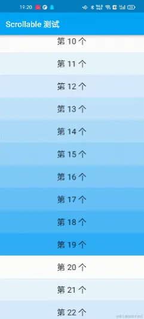 |  |


`Scrollable `组件只会处理滑动手势相关工作，对滑动内容并没有任何决定权。如果想让视口将滑动内容横向排布，是视口 `Viewport` 的工作

### controller

其类型为 `ScrollController`，它继承自 `ChangeNotifier` ，说明是一个可监听对象，我们可以通过监听它获取`滑动信息`。


另外 `ScrollController` 提供了一个获取 `ScrollPosition` 对象的访问器，其中记录着更加`详细`的滑动信息。`offset` 属性其实就是 `ScrollPosition` 的偏移像素值。


通过 `ScrollPosition` 对象，可以获得最大滑动长度、用户滑动方向、滑动轴的方向等信息：

~~~dart
ScrollPosition position;
position.pixels;
position.maxScrollExtent;
position.userScrollDirection;			//用户滑动方向
position.axisDirection;					//滑动轴的方向
~~~

`ScrollPosition` 为我们提供了 `atEdge` 方法，可以判断是否滑到了边缘：

~~~dart
bool get atEdge => pixels == minScrollExtent || pixels == maxScrollExtent;
~~~

`ScrollController` 最重要的作用是来控制滑动，如果只是希望监听滑动的信息，就没有必要使用它。因为 `ScrollController` 只有滑动信息发送变化时才会触发通知。我们可以通过 `NotificationListener` 能够更好的监听到这些信息。

### dragStartBehavior成员

该属性是 `DragStartBehavior` 型枚举，只有两个元素，默认是 `start`：

~~~dart
enum DragStartBehavior {
  down,
  start,
}
~~~

该成员用于对在`ScrollableState`类的`setCanDrag`方法中的手势检测器`VerticalDragGestureRecognizer`的`dragStartBehavior`属性进行赋值：


由于涉及到手势竞争，这一部分内容先不介绍。https://juejin.cn/book/6984685333312962573/section/7056218205529833486

### scrollPhysics成员

它决定 `Scrollable` 组件滚动时的 物理特性。比如通过该对象来确定：当用户滑动到视口的边缘或者用户停止滚动时，`Scrollable` 组件将如何运行。之所以用 物理这一词，是因为其中会通过 `Simulation` 仿真器来模拟物理运动，通过模拟的结果来确定小部件的滚动位置。


Flutter框架中提供了如下七个可用的实现类：

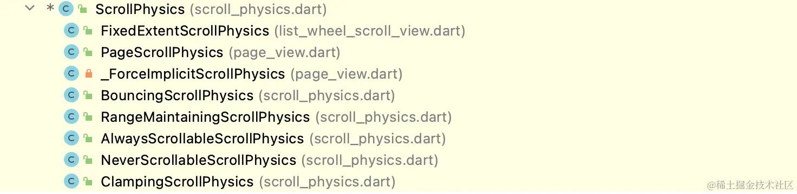

- ClampingScrollPhysics：当用户想要滑动超过边界时，会被阻止
- BouncingScrollPhysics：允许滑动超出边界
- PageScrollPhysics：类似PageView效果
- NeverScrollableScrollPhysics：不响应用户的滑动行为

`ScrollPhysics` 的构造方法中有`ScrollPhysics` 类型的 `parent` 属性。也就是说，可以对多个 `physics` 效果进行叠加。

下面来看一个小例子：如下左图，在视口未满时，`BouncingScrollPhysics` 并不会响应拖拽事件。这时如果想要滑动时有上下的弹性区间，可以通过叠加 `AlwaysScrollableScrollPhysics` ，表示总算响应用户滑动行为。这样就可以达到如下右图效果。

|                   仅 BouncingScrollPhysics                   |              叠加 AlwaysScrollableScrollPhysics              |
| :----------------------------------------------------------: | :----------------------------------------------------------: |
|  |  |


### scrollBehavior成员

该属性是 `ScrollBehavior` 类型，用于描述滑动组件的行为。

在`ScrollableState`类（`Scrollable`对应的状态类）的 `_updatePosition` 方法中，`407` 行中会为 `_configuration` 赋值。 如果`widget.scrollBehavior` 非空，会取其值；否则，会从`context` 中查询上层最邻近的 `ScrollConfiguration` 组件提供的配置信息。
这里很容易想到， `ScrollConfiguration` 是一个 `InheritedWidget` 的子类，可以为下层子树提供默认的 `scrollBehavior` 配置。

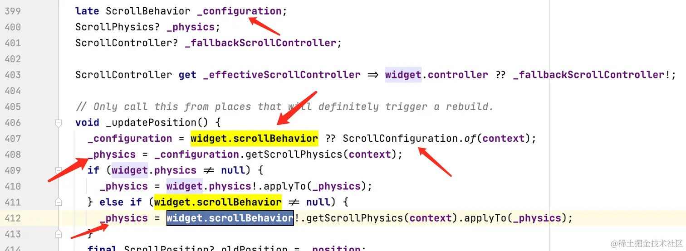

第411行的else if 完全是多余的....

另外值得注意的是，上图 `408` 行中，`ScrollBehavior` 对象可以通过 `getScrollPhysics` 得到 一个`ScrollPhysics` 对象。如果使用者提供了 `physics` 属性，则会通过 `applyTo` 将两个 `ScrollPhysics` 对象合并。

下图是`ScrollBehavior`对象的 `getScrollPhysics` 方法的实现，在 `iOS` 和 `macOS` 中会使用 `BouncingScrollPhysics` ，其他平台使用 `ClampingScrollPhysics` 。这就是不同平台下默认 `physics` 不同的根本原因。


另外，`ScrollBehavior`对拖动手势检测器也有一定的配置作用。其成员 `dragDevices`表示决定支持的触点指针类型。

```dart
//ScrollBehavior
Set<PointerDeviceKind> get dragDevices => _kTouchLikeDeviceTypes;

const Set<PointerDeviceKind> _kTouchLikeDeviceTypes = <PointerDeviceKind>{
  PointerDeviceKind.touch,
  PointerDeviceKind.stylus,
  PointerDeviceKind.invertedStylus,
};
```

然后`ScrollBehavior`类的`dragDevices`属性在手势检测器中使用：

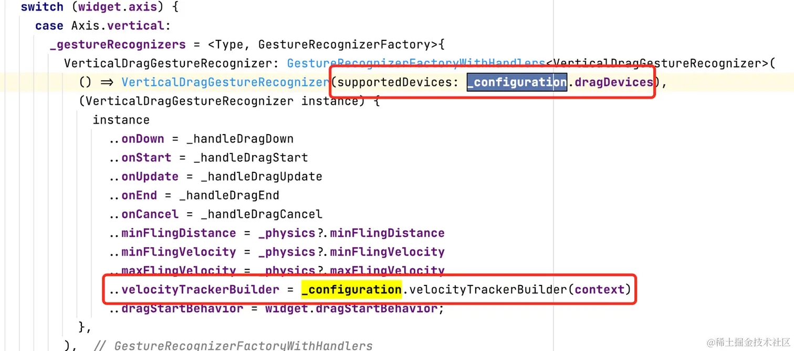

注：这里`_configuration`就是`Scrollable`所使用的`ScrollBehevior`对象。


`ScrollBehavior`类的`velocityTrackerBuilder` 方法可以为 手势检测器提供速度跟踪构造器。如下所示 `ScrollBehavior` 也对平台进行了区分对待，在 `ios` 和 `macOS` 中，使用的是 `IOSScrollViewFlingVelocityTracker` ，在其他平台通过 `VelocityTracker.withKind` 创建对象。


最后 `ScrollBehavior` 还有一处作用：在 `build` 方法返回组件时，会通过 `buildScrollbar` 和 `buildOverscrollIndicator` 进行包裹。

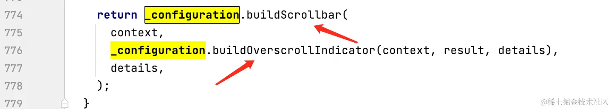

如下是 `ScrollBehavior#buildScrollbar` 的源码处理，在 `linux`、`macOS`、`windows `平台时，会套一个 `RowScrollBar` 。这就是目前在桌面应用中，可滑动组件默认会有 `ScrollBar` 的本质原因：


另外， `ScrollBehavior#buildOverscrollIndicator` 会为滑动体添加顶部和底部的指示器。如下源码所示，对于为`android`或`fuchsia` 平台添加`GlowingOverscrollIndicator` 指示器，也就是滑动到边缘时的蓝色阴影。其他平台直接返回 `child` ，表示不对内容进行包裹：

~~~dart
Widget buildOverscrollIndicator(BuildContext context, 
                                Widget child, ScrollableDetails details) {
  return buildViewportChrome(context, child, details.direction);
}
~~~

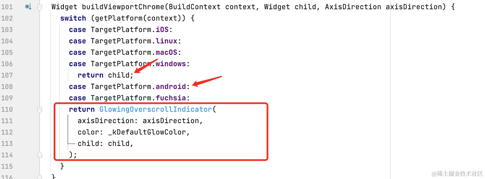

如果不想要蓝色阴影，只要自定义一个 `ScrollBehavior` 即可。


### restorationld

在 `android` 中， 当系统`"未经你许可"` 时销毁了你的 Activity 时，比如横竖屏切换、点击 Home 键、导航菜单栏切换，当前 `Activity` 都 `有可能 `被系统销毁。在 `android` 开发中，系统会提供一个机会，让开发中通过 `onSaveInstanceState` 回调来保存临时状态数据，通过 `onRestoreInstanceState` 恢复数据，这样可以保证下次用户进入时数据不会被重置。而在 `Flutter` 中，`restorationId` 所做的就是临时存储和恢复数据的这件事。

下面以 `ListView` 为例，介绍一下 `restorationId` 属性的作用。如下两个动图分别是 `无 restorationId` 和 `有 restorationId` 的效果。可见 `restorationId` 在ListView中的作用是在某种情况下，保持滑动的偏移量。

|                              有                              |                              无                              |
| :----------------------------------------------------------: | :----------------------------------------------------------: |
|  |  |


首先我们要为 `MaterialApp` 指定 `restorationScopeId` 参数，任意字符串都可以。

~~~dart
MaterialApp(
  restorationScopeId: 'any-string',
  //...
~~~

然后为 `Scrollable` 指定 `restorationId` 即可，任意字符串都可以：

~~~dart
Scrollable(
  restorationId: 'toly', //tag1
  //...
),
~~~


我们首先看一个官方示例：

~~~dart
class RestorableCounter extends StatefulWidget {
  //参数要传入 restorationId 标识。
  const RestorableCounter({Key? key, this.restorationId}) : super(key: key);
  final String? restorationId;

  @override
  State<RestorableCounter> createState() => _RestorableCounterState();
}

class _RestorableCounterState extends State<RestorableCounter>
    with RestorationMixin { // 1. 混入 RestorationMixin

  // 2. 使用 RestorableInt 对象记录数值
  final RestorableInt _counter = RestorableInt(0);

  // 3. 覆写 restorationId 提供 id 
  String? get restorationId => widget.restorationId;

  @override
  void restoreState(RestorationBucket? oldBucket, bool initialRestore) {
    // 4. 注册 _counter
    registerForRestoration(_counter, 'count');
  }

  @override
  void dispose() {
    _counter.dispose(); // 5. 销毁
    super.dispose();
  }
    
    @override
    Widget build(BuildContext context) {
      Text(
         //最后显示的数值通过 _counter.value 获取即可
        '${_counter.value}',
         style: Theme.of(context).textTheme.headline4,
      ),
    }
}
~~~

 `ScrollableState` 状态类，它混入了 `RestorationMixin` ，用于存储的对象类型为 `_RestorableScrollOffset` 。


其中覆写的 `restorationId` 返回组件的 `restorationId` 属性。


覆写的 `restoreState` 方法中会通过 `registerForRestoration` 对 `_persistedScrollOffset` 进行注册。当 `_persistedScrollOffset` 值非空 ，`position` 对象就会恢复到该值，这样就能保证视口维持之前的偏移量。

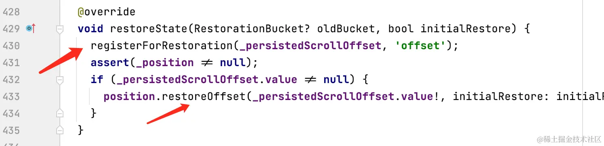

## Viewport 成员属性


`Viewport` 继承自 `MultiChildRenderObjectWidget`：

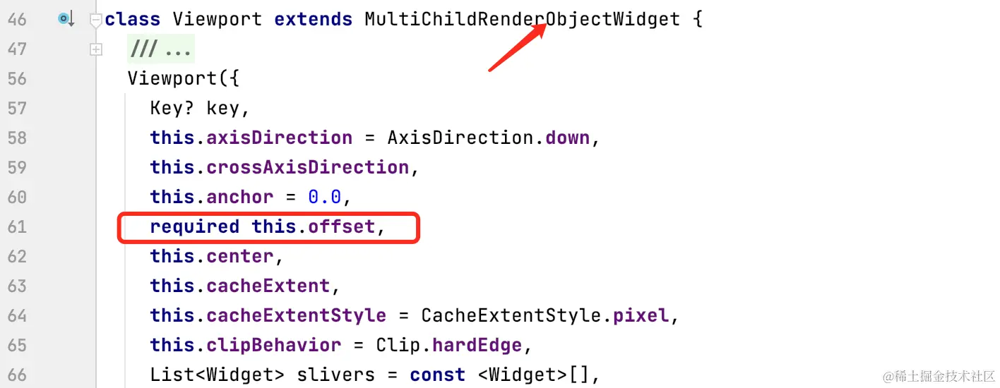


`Viewport` 组件在构造中主要有如下九个入参：


入参 `slivers` 是视口中的内容列表，该对象会对传入到 `super` 构造中：

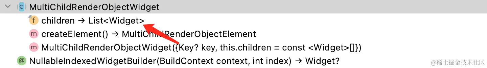

### axisDirection

| AxisDirection.up                                             | AxisDirection.right                                          | AxisDirection.left                                           |
| ------------------------------------------------------------ | ------------------------------------------------------------ | ------------------------------------------------------------ |
| 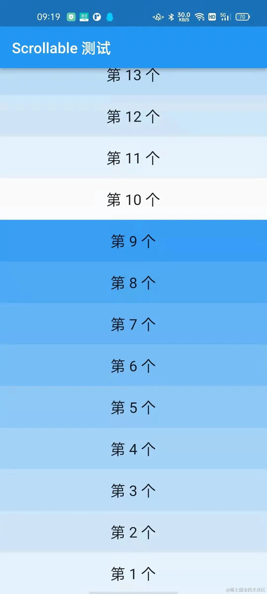 | 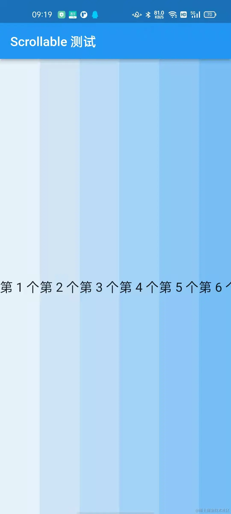 | 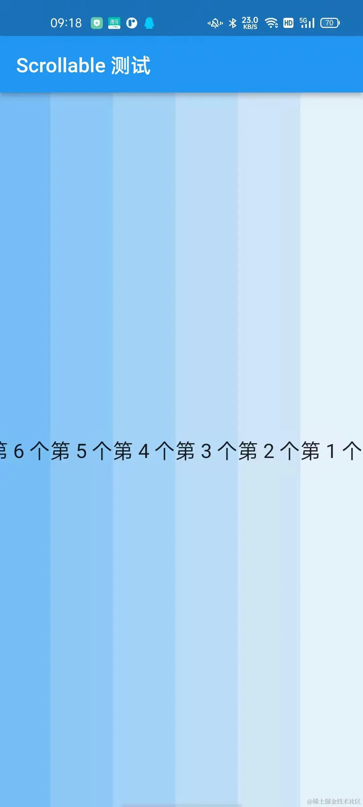 |

### crossAxisDirection

考虑到不同地域的阅读习惯不同，就提供了该属性


### 缓存

`Viewport` 中与缓存相关的属性有 `cacheExtent `和 `cacheExtentStyle`.

其中 `cacheExtent` 的类型为 `doule` ，表示 缓存区域的大小；`cacheExtentStyle` 类型为 `CacheExtentStyle` 枚举，它表示缓存的单位，有两个元素。`pixel` 表示单位为逻辑像素，`viewport` 表示单位是视口主轴方向尺寸。

注意：视口`Viewport` 中有上下两个缓存区域。

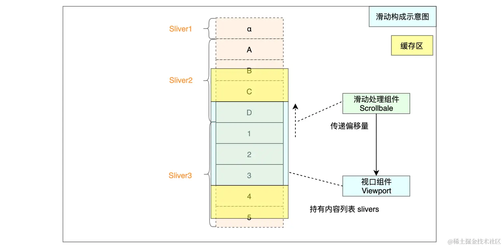

当ItemBox移出缓冲区后，那么它就会被销毁。这对于StatefulWidget来说，是一种意料外的行为。


### 其他属性

`anchor` 类型为 `double` ，它表示 零偏移量的相对位置。

| 0.1                                                          | 0.5                                                          | 0.8                                                          |
| ------------------------------------------------------------ | ------------------------------------------------------------ | ------------------------------------------------------------ |
| 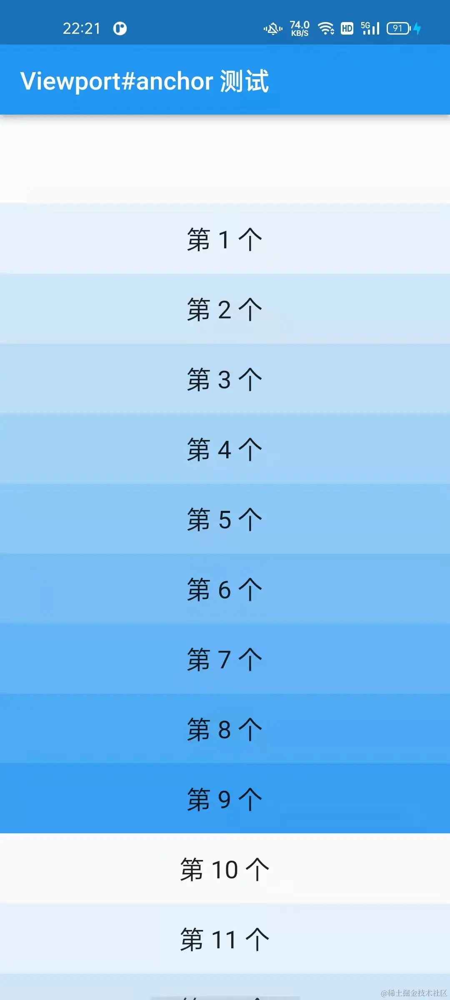 |  |  |

对 `anchor` 属性设置值时，限制 `anchor` 的值在`[0.0,1.0]` 区间。


`center` 的类型是 `Key`，当 `center` 属性非 `null `时，内容组件列表中必须有一个组件的 `key` 和 `center` 一致。

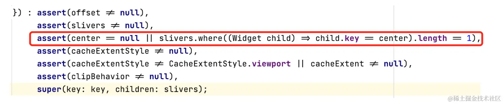

当指定 `Viewport` 的 `center` 属性为 `centerKey` ，且 `Sliver2` 的 `key` 为 `centerKey` ，这样的话 `Sliver2` 将会被作为滑动内容的`中心`，默认置于视口顶部。


`clipBehavior` 属性对应的类型为 `Clip` 枚举，有如下四个元素。

~~~dart
enum Clip {
  none, // 无
  hardEdge, // 硬边缘，适合用于矩形裁剪
  antiAlias, // 抗锯齿
  antiAliasWithSaveLayer, // 抗锯齿+存储层
}
~~~

它用来表示组件内容裁剪的方式。在这里中默认是 `antiAlias` ，这种方式是抗锯齿的裁剪。

至于其他几个，`none` 是不进行裁剪，一般我们默认组件不会超过边界，但如果内容会溢出边界，我们需要指定后三种裁剪方式之一


## 再探ScrollView

从 `ScrollView` 组件构造方法中可以发现：绝大多数都是属性都是为 `Scrollable` 和 `Viewport` 准备的


我们在使用 `ScrollView` 时，轴向传入的是 `Axis` 对象，只能确定滑动方向是 `水平` 还 `竖直` 。 但 `Scrollable` 和 `Viewport` 组需要的是 `AxisDirection` 对象，它有 `上下左右` 四个情况。

~~~dart
enum Axis {
    horizontal, vertical,
}

enum AxisDirection {
    up, right, down, left,
}
~~~


需要根据 `scrollDirection` 和 `reverse` 成员，来转化为 `AxisDirection` 对象。这个方法就是 `getDirection` 。

~~~dart
AxisDirection getDirection(BuildContext context) {
  return getAxisDirectionFromAxisReverseAndDirectionality(
           context, scrollDirection, reverse);
}
~~~

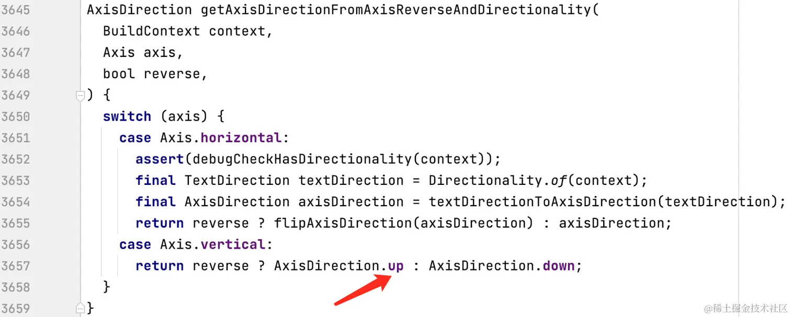

如下图 `389 行` 中使用 `getDirection` 方法得到 `axisDirection` 对象；该对象在 `395 行` 作为 `Scrollable` 的构造入参；在 `402 行` ，传入 `buildViewport` 方法，作为 `Viewport` 的入参。通过这样的封装，使得`Scrollable` 和 `Viewport` 组件的轴向总是一致的。

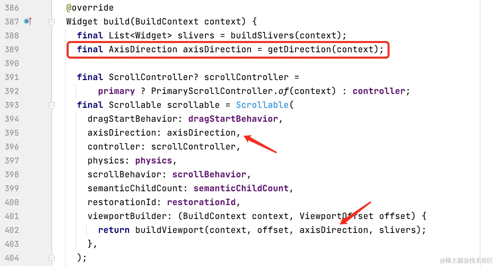


`shrinkWrap` 成员在源码的 `buildViewport` 方法中被使用，该方法用于创建视口组件。如下所示：当 `shrinkWrap` 为 `true` 时，会返回 `ShrinkWrappingViewport` 组件，否则返回 `Viewport` 组件:

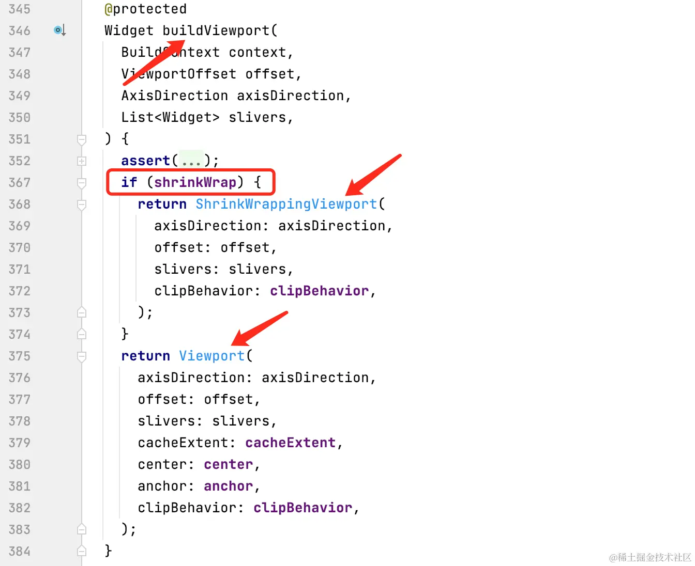

`ShrinkWrappingViewport` 与 `Viewport` 组件的差异是什么呢？

| Viewport 的尺寸                                              | ShrinkWrappingViewport 的尺寸                                |
| ------------------------------------------------------------ | ------------------------------------------------------------ |
|  |  |

