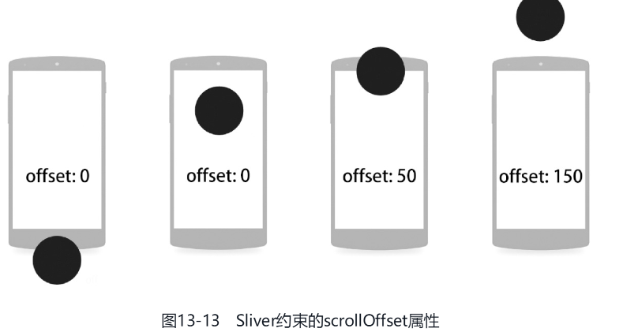

# Sliver & 滚动

[TOC]

## 概述

通常将滚动方向称为主轴，非滚动方向称为副轴

Flutter 中的可滚动组件主要由三个角色组成：Scrollable、Viewport 和 Sliver：

- Scrollable ：用于处理滑动手势，确定滑动偏移，滑动偏移变化时构建 Viewport 。
- Viewport：显示的视窗，即列表的可视区域；
- Sliver：视窗里显示的元素


具体布局过程：

1. Scrollable 监听到用户滑动行为后，根据最新的滑动偏移构建 Viewport 。
2. Viewport 将当前视口信息和配置信息通过 SliverConstraints 传递给 Sliver。
3. Sliver 中对子组件（RenderBox）按需进行构建和布局，然后确认自身的位置、绘制等信息，保存在 geometry 中（一个 SliverGeometry 类型的对象）。


## Scrollable


```dart
Scrollable({
  ...
  this.axisDirection = AxisDirection.down,
  this.controller,
  this.physics,
  required this.viewportBuilder,
})
```

- `axisDirection` 滚动方向。
- `physics`：此属性接受一个`ScrollPhysics`类型的对象，它决定可滚动组件如何响应用户操作。Flutter SDK中包含了四个`ScrollPhysics`的子类：
  - BouncingScrollPhysics()：允许滚动超出边界，但之后内容会**反弹**回来

  - ClampingScrollPhysics()： 防止滚动超出边界

  - NeverScrollableScrollPhysics()：禁止用户滚动

  - AlwaysScrollableScrollPhysics() ：始终响应用户的滚动。
- `controller`：控制滚动位置和监听滚动事件。
- `viewportBuilder`：当用户滑动时，Scrollable 会调用此回调构建新的 Viewport


## Viewport

~~~dart
Viewport({
  Key? key,
  this.axisDirection = AxisDirection.down,
  this.crossAxisDirection,
  this.anchor = 0.0,
  required ViewportOffset offset, 			// 用户的滚动偏移

  this.center,
  this.cacheExtent, 						// 预渲染区域

  this.cacheExtentStyle = CacheExtentStyle.pixel, 
  this.clipBehavior = Clip.hardEdge,
  List<Widget> slivers = const <Widget>[], 	// 需要显示的 Sliver 列表
})
~~~

- `offset`：该参数为Scrollabel 构建 Viewport 时传入，它描述了滚动偏移

- `CacheExtentStyle`
  - `pixel `，预渲染区域的具体像素长度为$cacheExtent$
  - ` viewport`，预渲染区域的具体像素长度为$cacheExtent * viewport$


## Sliver

Sliver 主要作用是对子组件进行构建和布局

Sliver 的布局协议如下：

1. Viewport 将当前布局和配置信息通过 SliverConstraints 传递给已经进入了构建区域的Sliver。
2. Sliver 确定自身的位置、绘制等信息，保存在 geometry 中（一个 SliverGeometry 类型的对象）。
3. Viewport 读取 geometry 中的信息来对 Sliver 进行布局和绘制。


###  SliverConstraints 

~~~dart
class SliverConstraints extends Constraints {
    //主轴方向
    AxisDirection? axisDirection;
    
    //Sliver 沿着主轴从列表的哪个方向插入？枚举类型，正向或反向
    GrowthDirection? growthDirection;
    
    //用户滑动方向
    ScrollDirection? userScrollDirection;
    
    //当前Sliver已经滑出可视区域的总偏移
    double? scrollOffset;
    
    //当前Sliver之前的Sliver占据的总高度，因为列表是懒加载，如果不能预估时，该值为double.infinity
    double? precedingScrollExtent;
    
    //上一个 sliver 覆盖当前 sliver 的长度（重叠部分的长度），通常在 sliver 是 pinned/floating
    double? overlap;
    
    //该属性指当前Sliver应绘制多少逻辑像素的内容。若该Sliver最终绘制了远超出该数值的内容，则其超出部分也不会显示在视窗内（毕竟视窗尺寸有限），因此可能会造成性能的浪费。
    double? remainingPaintExtent;
    
    //纵轴的长度；如果列表滚动方向是垂直方向，则表示列表宽度。
    double? crossAxisExtent;
    
    //纵轴方向
    AxisDirection? crossAxisDirection;
    
    //Viewport在主轴方向的长度；如果列表滚动方向是垂直方向，则表示列表高度。
    double? viewportMainAxisExtent;
    
    //Viewport 预渲染区域的起点[-Viewport.cacheExtent, 0]
    double? cacheOrigin;
    
    //Viewport加载区域的长度，范围:
    //[viewportMainAxisExtent,viewportMainAxisExtent + Viewport.cacheExtent*2]
    double? remainingCacheExtent;
}
~~~


- scrollOffset

  

- remaingPaintExtent：例如在一个向下滚动的视窗中，

  假设某Sliver暂时还没出现在视窗范围内，如图13-13的第1种情况所示，则此时remainingPaintExtent属性值为0，表示该Sliver无须绘制任何内容。

  当它开始出现在视窗内时，如图13-13的第2种或第3种情况所示，则remainingPaintExtent属性值为该Sliver顶部至视窗底部的距离。

  最后，当该Sliver完全移出视窗时，如图13-13第4种情况所示，它仍然可享有整个视窗高度的remainingPaintExtent供其绘制

### SliverGeometry

~~~dart
const SliverGeometry({
  //Sliver在主轴方向预估长度，大多数情况是固定值，用于计算sliverConstraints.scrollOffset
  this.scrollExtent = 0.0, 
    
  this.paintExtent = 0.0, // 可视区域中的绘制长度
    
  this.paintOrigin = 0.0, // 绘制的坐标原点，相对于自身布局位置
    
  //在 Viewport中占用的长度；如果列表滚动方向是垂直方向，则表示列表高度。
  //范围[0,paintExtent]
  double? layoutExtent, 
    
  this.maxPaintExtent = 0.0,//最大绘制长度
    
  this.maxScrollObstructionExtent = 0.0,
    
  double? hitTestExtent, // 点击测试的范围
    
  bool? visible,// 是否显示
    
  //是否会溢出Viewport，如果为true，Viewport便会裁剪
  this.hasVisualOverflow = false,
    
  //scrollExtent的修正值：layoutExtent变化后，为了防止sliver突然跳动（应用新的layoutExtent）
  this.scrollOffsetCorrection,
    
  double? cacheExtent, // 在预渲染区域中占据的长度
}) 
~~~


## ScrollPhysics

`ScrollPhysics` 的作用是 **确定可滚动控件的物理特性**。这里的物理特性就是指：当某些滚动事件触发时（当用户滑动到最大位置时、当用户停止滑动时），滚动组件的行为如何？ 

以下是一些方法：

~~~dart
double applyPhysicsToUserOffset(ScrollMetrics position, double offset)

//对边界条件进行判断
double applyBoundaryConditions(ScrollMetrics position, double value)

//触发边界后的动画
Simulation createBallisticSimulation(ScrollMetrics position, double velocity)  

double get minFlingVelocity

double carriedMomentum(double existingVelocity)

double get dragStartDistanceMotionThreshold

Tolerance get tolerance
~~~


有以下实现类：

- **`BouncingScrollPhysics`** ：允许滚动超出边界，但之后内容会**反弹**回来。
- **`ClampingScrollPhysics`** ： 防止滚动超出边界，**夹住** 。
- **`AlwaysScrollableScrollPhysics`** ：始终**响应**用户的滚动。
- **`NeverScrollableScrollPhysics`** ：**不响应**用户的滚动。
- 等等


`BouncingScrollPhysics` 中的 `applyPhysicsToUserOffset`：用户没有达到边界前，依旧返回默认的`offset`，当用户到达边界时，通过算法来达到模拟溢出阻尼效果。

~~~dart
 ///摩擦因子
 double frictionFactor(double overscrollFraction) => 0.52 * math.pow(1 - overscrollFraction, 2);

@override
double applyPhysicsToUserOffset(ScrollMetrics position, double offset) {
    assert(offset != 0.0);
    assert(position.minScrollExtent <= position.maxScrollExtent);

    if (!position.outOfRange)
      return offset;

    final double overscrollPastStart = math.max(position.minScrollExtent - position.pixels, 0.0);
    final double overscrollPastEnd = math.max(position.pixels - position.maxScrollExtent, 0.0);
    final double overscrollPast = math.max(overscrollPastStart, overscrollPastEnd);
    final bool easing = (overscrollPastStart > 0.0 && offset < 0.0)
        || (overscrollPastEnd > 0.0 && offset > 0.0);

    final double friction = easing
        // Apply less resistance when easing the overscroll vs tensioning.
        ? frictionFactor((overscrollPast - offset.abs()) / position.viewportDimension)
        : frictionFactor(overscrollPast / position.viewportDimension);
    final double direction = offset.sign;

    return direction * _applyFriction(overscrollPast, offset.abs(), friction);
}
~~~

`ClampingScrollPhysics` 的 `applyBoundaryConditions`：在计算边界条件值的时候，滑动值会和边界值相减得到相反的数据，使得滑动边界相对静止，从而达到“夹住”的作用。

~~~dart
  @override
  double applyBoundaryConditions(ScrollMetrics position, double value) {
    if (value < position.pixels && position.pixels <= position.minScrollExtent) // underscroll
      return value - position.pixels;
    if (position.maxScrollExtent <= position.pixels && position.pixels < value) // overscroll
      return value - position.pixels;
    if (value < position.minScrollExtent && position.minScrollExtent < position.pixels) // hit top edge
      return value - position.minScrollExtent;
    if (position.pixels < position.maxScrollExtent && position.maxScrollExtent < value) // hit bottom edge
      return value - position.maxScrollExtent;
    return 0.0;
  }
~~~

`BouncingScrollPhysics` 中 `applyBoundaryConditions`：达到 0 是就边界，过了 0 的就是边界外的拖拽效果了。

~~~dart
  @override
  double applyBoundaryConditions(ScrollMetrics position, double value) => 0.0;
~~~


下面给出一个模拟器`Simulation`例子：以200单位的速度进行滚动

~~~dart
class AutoScrollPhysicsPage extends StatelessWidget {
  const AutoScrollPhysicsPage({super.key});

  @override
  Widget build(BuildContext context) {
    return ListView.builder(
      itemBuilder: (_, index) => Text("$index"),
      physics: AutoScrollPhysics(),
    );
  }
}

class AutoScrollPhysics extends ScrollPhysics {
  @override
  ScrollPhysics applyTo(ScrollPhysics? ancestor) => AutoScrollPhysics();

  @override
  bool shouldAcceptUserOffset(ScrollMetrics position) => false;

  @override
  Simulation? createBallisticSimulation(
          ScrollMetrics position, double velocity) =>
      AutoScrollSimulation();
}

class AutoScrollSimulation extends Simulation {
  static const velocity = 200.0;

  @override
  double x(double time) => velocity * time;			//位置

  @override
  double dx(double time) => velocity;				//速度

  @override
  bool isDone(double time) => false;
}
~~~


总结起来就是  `ScrollPhysics`  中控制了用户触摸转化和边界条件，并且在用户停止触摸时，利用 `Simulation`  实现了自动滚动与溢出回弹的动画效果。

## ScrollBehavior

如何使用ScrollBehavior

- 使用ScrollConfiguration包裹滑动组件，并将其behavior设置成自己实现的behavior。

  ~~~dart
  ScrollConfiguration(
     behavior: ChatScrollBehavior(),
     child: yourScrollViewWidget,
  ),
  ~~~

- 或者将CustomScrollView的scrollBehavior属性设置为自己实现的behavior

  ~~~dart
  CustomScrollView(
    physics: BouncingScrollPhysics(),
    scrollBehavior: MyBehavior(),
    slivers: <Widget>[],
  );
  ~~~

  

~~~dart
class MyBehavior extends ScrollBehavior {
  
  //返回一个physics
  @override
  ScrollPhysics getScrollPhysics(BuildContext context) {
    return super.getScrollPhysics(context);
  }
    
  //它在滚动到可滚动组件的边界时被调用,用于构建一个小部件来表示过冲状态。
  @override
  Widget buildOverscrollIndicator(
      BuildContext context, Widget child, ScrollableDetails details) {
    return GlowingOverscrollIndicator(
      //不显示头部水波纹
      showLeading: true,
      //不显示尾部水波纹
      showTrailing: true,
      axisDirection: AxisDirection.up,
      color: Colors.red,
      child: child,
    );
  }
  
  //限制只能垂直或水平滚动
  @override
  AxisDirection getDirection(BuildContext context) {
    return AxisDirection.up; 
  }
    
}

~~~


## ScrollController

~~~dart
ScrollController({
  double initialScrollOffset = 0.0, //初始滚动位置
  this.keepScrollOffset = true,//是否保存滚动位置
  ...
})
~~~

当keepScrollOffset为true时，每次滚动结束，可滚动组件都会将滚动位置`offset`存储到`PageStorage`中。此后，可滚动组件重新创建时，再从PageStorage中恢复。

~~~dart
ListView(key:PageStorageKey(1), ...);
~~~


它的一些常用属性和方法如下：

- `offset`：可滚动组件当前的滚动位置。只在控制器唯一绑定一个可滚动组件时，才可以访问这个属性。

- `positions`：一个`ScrollController`对象可以同时被多个可滚动组件使用，`ScrollController`会为每一个可滚动组件创建一个`ScrollPosition`对象，这些`ScrollPosition`保存在该属性中。

  假设一个`ScrollController`同时被两个可滚动组件使用，那么我们可以通过如下方式分别读取他们的滚动位置：

  ~~~dart
  controller.positions.elementAt(0).pixels
  controller.positions.elementAt(1).pixels
  ~~~

- `jumpTo(double offset)`、`animateTo(double offset,...)`：这两个方法用于跳转到指定的位置。

  offset可以设置为负数，列表则会跳转至顶部后过量滚动，产生触顶动画并自动纠正至0.0

- `addListener`：在滚动值发生变化时调用

  ~~~dart
  _controller.addListener((){ print("现在的位置: ${_controller.offset}");});
  ~~~


我们来看一下如何向`ScrollController`注册滚动组件（一般不会用到）：
~~~dart
ScrollPosition createScrollPosition(
    ScrollPhysics physics,
    ScrollContext context,
    ScrollPosition oldPosition);

void attach(ScrollPosition position) ;
void detach(ScrollPosition position) ;
~~~

可滚动组件首先会调用`ScrollController`的`createScrollPosition()`方法来创建一个`ScrollPosition`来存储滚动位置信息。接着，可滚动组件会调用`attach()`方法，将创建的`ScrollPosition`添加到`ScrollController`的`positions`属性中，只有注册后`animateTo()` 和 `jumpTo()`才可以被调用。当可滚动组件销毁时，会调用`ScrollController`的`detach()`方法，将其`ScrollPosition`对象从`ScrollController`的`positions`属性中移除。

## ScrollConfiguration

`ScrollConfiguraion`和`Theme`一样，都是`inheritedWidget`。ScrollConfiguration 用于控制子控件的滚动行为

~~~dart
ScrollConfiguration(
  behavior: ScrollBehavior(),
  child: ...
}
~~~


## NotificationListener

 Scrollable 组件在滑动时就会发送**滚动通知**（ScrollNotification）。滚动通知的类型包括：

- ScrollStartNotification：滚动开始通知。
- UserScrollNotification：用户滚动通知，通常在用户改变滚动方向时触发。
- ScrollUpdateNotification：滚动更新通知。
- ScrollEndNotification：滚动终止通知
- OverscrollNotification：过度滚动通知


### ScrollMetrics

`ScrollNotification`包括一个`metrics`属性，它的类型是`ScrollMetrics`，该属性包含当前ViewPort及滚动位置等信息：

- `pixels`：当前滚动位置。
- `maxScrollExtent`：最大可滚动长度。
- `extentBefore`：滑出ViewPort顶部的长度；此示例中相当于顶部滑出屏幕上方的列表长度。
- `extentInside`：ViewPort内部长度；此示例中屏幕显示的列表部分的长度。
- `extentAfter`：ViewPort之后的可滚动长度
- `atEdge`：是否滑到了可滚动组件的边界


当`NotificationListener`组件选择拦截通知时，其父级的`Scrollable`组件将无法获得滚动通知。

## ScrollBar

Scrollbar组件可以为大部分滚动列表添加滚动条，若需要在任何设备上都显示iOS风格的滚动条，则可以直接使用CupertinoScrollbar组件。

`thumbVisbility`属性设置滚动条是否一直可见。


## ListView

`ListView`是最常用的可滚动组件之一，它可以沿一个方向线性排布所有子组件，并且它也支持列表项懒加载。ListView内部使用了SliverChildBuilderDelegate来构建item。

它会尽量扩展到父Widget所允许的最大尺寸，而且将自己在滚动副轴上的长度，以紧约束的形式传递给它的子Widget。如果父约束是无边界（例如，其父Widget为Column），那么将会抛出异常。

在Flutter框架中，使用ListView组件的默认构造函数，会使其立即初始化children列表，即不支持懒加载，不推荐使用。

~~~dart
ListView({
  ...  
  //可滚动widget公共参数
  Axis scrollDirection = Axis.vertical,
  bool reverse = false,
  ScrollController? controller,
  bool? primary,
  ScrollPhysics? physics,
  EdgeInsetsGeometry? padding,
  
  //ListView各个构造函数的共同参数  
  double? itemExtent,
  Widget? prototypeItem, //列表项原型，后面解释
  bool shrinkWrap = false,
  bool addAutomaticKeepAlives = true,
  bool addRepaintBoundaries = true,
  double? cacheExtent, // 预渲染区域长度
    
  //子widget列表
  List<Widget> children = const <Widget>[],
})
~~~

- `itemExtent`：该参数如果不为`null`，则会强制`children`的“长度”为`itemExtent`的值；这里的“长度”是指滚动方向上子组件的长度。

  >固定子组件的主轴尺寸可在大幅跳转时提升性能。某程序可通过滚动控制器实现一键跳转x逻辑像素的功能。若ListView无法提前确定每个元素的高度，则跳转时它必须依次加载这些元素并完成布局测量。然而，若每个元素的高度是固定的，则只需简单计算便可得知一共需跳过个元素

- `cacheExtent`：在ListView动态加载与回收元素时，除了屏幕上可见的子组件外，ListView还会在视窗范围外额外加载x个像素作为缓冲

- `scrollDirection`：设置滚动的方向。Axis.horizontal水平滚动

- `shrinkWrap`：该属性表示是否根据子组件的总长度来设置`ListView`的长度，默认值为`false`。

- `padding`：内边距

- `physics`，可以设置列表滚动的行为

- `addAutomaticKeepAlives`：ListView 会为每一个列表项添加一个 AutomaticKeepAlive 父组件。可以缓存列表项，保存其状态


推荐使用支持懒加载的`ListView.builder()`：

~~~java
ListView.builder({
  // ListView公共参数已省略  
  ...
  required IndexedWidgetBuilder itemBuilder,
  int itemCount,
  ...
})
 
~~~

- `itemBuilder`：它是列表项的构建器，类型为`IndexedWidgetBuilder`，返回值为一个widget。当列表滚动到具体的`index`位置时，会调用该构建器构建列表项。

- `itemCount`：列表项的数量，如果为`null`，则为无限列表。

  


`ListView.separated()`可以在生成的列表项之间添加一个分割组件，它比`ListView.builder`多了一个`separatorBuilder`参数，该参数是一个分割组件生成器。


在ListView组件对元素的动态加载与资源回收机制的作用下，移出屏幕的元素会被摧毁，其内部状态也一并销毁。有两种解决方案：

- 状态提升：采纳前端网页React框架中著名的Lift State Up（状态提升）思路，把列表中每个子组件的状态都提升到列表之上。不过在构建列表项时，需要根据状态来构造。

- KeepAlive：将列表项所在的State类融合AutomaticKeepAliveClientMixin类，最后覆写wantKeepAlive函数。如果返回true，那么将保存其内部状态，否则直接销毁。别忘了在`build()`内调用`super.build(context)`

  ~~~dart
  class _CounterState extends State<Counter> with AutomaticKeepAliveClientMixin {
      int _count = 0;
      
      @override
      Widget build(BuildContext context) {
          //...
      }
      
      @override
      bool get wantKeepAlive => _count != 0;
  }
  ~~~

  

## AnimatedList

AnimatedList 和 ListView 的功能大体相似，不同的是， AnimatedList 可以在列表中插入或删除节点。并且执行一个动画。

AnimatedList 是一个 StatefulWidget，它对应的 State 类型为 AnimatedListState，添加和删除元素的方法位于 AnimatedListState 中：

~~~dart
void insertItem(int index, { Duration duration = _kDuration });

void removeItem(int index, AnimatedListRemovedItemBuilder builder, { Duration duration = _kDuration }) ;
~~~


~~~dart
  const AnimatedList({
    super.key,
    required super.itemBuilder,
    super.initialItemCount = 0,
    super.scrollDirection = Axis.vertical,
    super.reverse = false,
    super.controller,
    super.primary,
    super.physics,
    super.shrinkWrap = false,
    super.padding,
    super.clipBehavior = Clip.hardEdge,
  }) : assert(initialItemCount >= 0);
~~~

- `initialItemCount`属性，可以设置初始时表项的数量。

- `itemBuilder`：

  ~~~dart
  itemBuilder: (
      BuildContext context,
      int index,
      Animation<double> animation,
  );
  ~~~

一个简单的使用示例：

~~~dart
class _MyHomePage extends State<MyHomePage> {
    final globalKey = GlobalKey<AnimatedListState>();
    var data = <String>[];				//data[i]表示第i个表项的数据
    
    @override
    Widget build(countext) {
        return AnimatedList(
          key: globalKey,	//需要绑定一个key，来访问这个AnimatedList的State
          initialItemCount: data.length,
          itemBuilder: (
            BuildContext context,
            int index,
            Animation<double> animation,
          ) {
            return FadeTransition(
              opacity: animation,
              child: buildItem(context, index),		//最好将表项抽象成根据index构造的表项，原因见下
            );
          },
        ),
    }
    
    Widget buildItem(Context, index) {
    	return Widget();
  	}
    
    
    globalKey.currentState.insertItem(index);			
    globalKey.currentState.removeItem(index, (context, animation) {
        return FadeTransition(
        	child : buildItem(context, index);			//原表项被直接删除，所以这里需要一个Widget来应用删除动画。
        )
    })
}
~~~

我们需要特别注意地是：调用 AnimatedListState 的插入和移除方法相当于发送一个通知：在什么位置执行插入或移除动画，它并不执行滚动操作。并且我们列表的渲染区域是由数据驱动的，这个数据是由我们单独维护的。

## GridView

GridView组件是一个可将元素显示为二维网格状的列表组件，并支持主轴方向滚动。它会尽量扩展到父Widget所允许的最大尺寸。

~~~dart
  GridView({
    Key? key,
    Axis scrollDirection = Axis.vertical,
    bool reverse = false,
    ScrollController? controller,
    bool? primary,
    ScrollPhysics? physics,
    bool shrinkWrap = false,
    EdgeInsetsGeometry? padding,
    required this.gridDelegate,  //下面解释
    bool addAutomaticKeepAlives = true,
    bool addRepaintBoundaries = true,
    double? cacheExtent, 
    List<Widget> children = const <Widget>[],
    ...
  })
~~~

`GridView`和`ListView`的大多数参数都是相同的。其中我们需要关注SliverGridDelegate属性，它说明网格该如何构建。Flutter框架已经提供了该委托的两种实现方式，分别是：

- SliverGridDelegateWithFixedCrossAxisCount（交叉轴方向固定数量的委托）

  ~~~dart
  SliverGridDelegateWithFixedCrossAxisCount({
    @required double crossAxisCount, 
    double mainAxisSpacing = 0.0,
    double crossAxisSpacing = 0.0,
    double childAspectRatio = 1.0,
  })
  ~~~

  - `crossAxisCount`：副轴子元素的数量
  - `mainAxisSpacing`：主轴方向的间距
  - `crossAxisSpacing`：副轴方向子元素的间距
  - `childAspectRatio`：子元素在副轴长度和主轴长度的比例

  子元素的大小是通过`crossAxisCount`和`childAspectRatio`两个参数共同决定的

- SliverGridDelegateWithMaxCrossAxisExtent（交叉轴方向限制最大长度的委托）

  ~~~dart
  SliverGridDelegateWithMaxCrossAxisExtent({
    double maxCrossAxisExtent,
    double mainAxisSpacing = 0.0,
    double crossAxisSpacing = 0.0,
    double childAspectRatio = 1.0,
  })
  ~~~
  
  - `maxCrossAxisExtent`：设置每个元素的在副轴上的最大尺寸。
  
    在不考虑间距的情况下，假设GridView在副轴上的长度为$L$，而在副轴上的子元素有$x$个，它的在副轴上的宽度为$a$，那么必须满足$x*a \leq L < (x+1)*a$。


`GridView.count`构造函数内部使用了`SliverGridDelegateWithFixedCrossAxisCount`，我们通过它可以快速的创建副轴固定数量子元素的`GridView`。

`GridView.extent`构造函数内部使用了`SliverGridDelegateWithMaxCrossAxisExtent`，我们通过它可以快速的创建副轴子元素为固定最大长度的`GridView`。


~~~dart
GridView.builder(
 ...
 required SliverGridDelegate gridDelegate, 
 required IndexedWidgetBuilder itemBuilder,
)
~~~


## PageView

Tab 换页效果、图片轮动以及TikTok上下滑页切换视频功能等等，这些都可以通过 PageView 轻松实现。


PageView会尽量扩展到父Widget所允许的最大尺寸，而且它的每个子组件的尺寸都会被紧约束为父级允许的最大尺寸。

~~~dart
PageView({
  Key? key,
  this.scrollDirection = Axis.horizontal, // 滑动方向
  PageController? controller,
  this.physics,
  List<Widget> children = const <Widget>[],
  this.onPageChanged,
  this.pageSnapping = true,
})
~~~

- pageSnapping：如需允许用户停留在相邻页面之间的任意位置，则可传入pageSnapping：false实现
- onPageChanged：无论pageSnapping是否开启，页码变化的回传函数都会在翻页过半时触发，而不是在动作完成后触发
- controller：接受一个`PageController（页面控制器）`，它继承于ScrollController（滚动控制器。jumpTo（300）可以跳转300个逻辑像素（受pageSnapping属性影响），jumpToPage（3）则可以直接跳转到第4个页面。还支持previousPage（前一页）和nextPage（后一页）方法

PageView.builder支持懒加载。

~~~dart
pageView.builder(
	itemCount : 20,
     itemBuilder(context, index) {
        return Widget()
    }
)
~~~


PageView 并没有缓存功能，一旦页面滑出屏幕它就会被销毁。可以使用`AutomaticKeepAliveClientMixin`来解决这一问题。


## SingleChildScrollView

通常`SingleChildScrollView`只应在期望的内容不会超过屏幕太多时使用。这是因为`SingleChildScrollView`不支持基于 Sliver 的延迟加载模型。

它将父Widget的约束传递给子组件，然后它会尽可能地匹配子组件的大小。当子组件中的溢出时，就会提供一个滚动条。当Column作为SingleChildScrollView的孩子时，会强制设置`mainAxisSize：MainAxisSize.min`

~~~dart
SingleChildScrollView({
  this.scrollDirection = Axis.vertical, //滚动方向，默认是垂直方向
  this.padding, 
  bool primary, 
  this.physics, 
  this.controller,
  this.child,
})
~~~


## CustomScrollView

`CustomScrollView` 组件来帮助我们创建一个公共的 Scrollable 和 Viewport ，然后它的 slivers 参数接受一个 Sliver 数组。为所有子 Sliver 提供一个共享的 Scrollable，然后统一处理指定滑动方向的滑动事件。

~~~dart
CustomScrollView(
    slivers: [
        SliverFixedExtentList(),
        SliverFixedExtentList(),
    ],
);
~~~


用户体验上就是Sliver一个接着一个地滚动下来，而不是分别滚动。


| Sliver名称                | 功能                               | 对应的可滚动组件                 |
| ------------------------- | ---------------------------------- | -------------------------------- |
| SliverList                | 列表                               | ListView                         |
| SliverFixedExtentList     | 高度固定的列表                     | ListView，指定`itemExtent`时     |
| SliverAnimatedList        | 添加/删除列表项可以执行动画        | AnimatedList                     |
| SliverGrid                | 网格                               | GridView                         |
| SliverPrototypeExtentList | 根据原型生成高度固定的列表         | ListView，指定`prototypeItem` 时 |
| SliverFillViewport        | 包含多个子组件，每个都可以填满屏幕 | PageView                         |

还有一些用于对 Sliver 进行布局、装饰的组件，它们的子组件必须是 Sliver

| Sliver名称                      | 对应 RenderBox      |
| ------------------------------- | ------------------- |
| SliverPadding                   | Padding             |
| SliverVisibility、SliverOpacity | Visibility、Opacity |
| SliverFadeTransition            | FadeTransition      |
| SliverLayoutBuilder             | LayoutBuilder       |

还有一些其他常用的 Sliver：

| Sliver名称             | 说明                                                |
| ---------------------- | --------------------------------------------------- |
| SliverAppBar           | 对应 AppBar，主要是为了在 CustomScrollView 中使用。 |
| SliverToBoxAdapter     | 一个适配器，可以将 RenderBox 适配为 Sliver          |
| SliverPersistentHeader | 滑动到顶部时可以固定住                              |

### SliverFixedExtentList

~~~dart
SliverFixedExtentList(
    itemExtent: 56, //列表项高度固定
    delegate: SliverChildBuilderDelegate(
        (_, index) => ListTile(title: Text('$index')),
        childCount: 10,
    ),
);
~~~

### SliverAppBar

`SliverAppBar`可以结合`FlexibleSpaceBar`实现Material Design中头部伸缩的模型。`SliverAppBar`组件是通过封装`SliverPersistentHeader`组件来实现的。

这些属性的含义请见`SliverPersistentHeader`

~~~dart
const SliverAppBar({
  this.collapsedHeight, 	// 收缩起来的高度
  this.expandedHeight,		// 展开时的高度
  this.pinned = false, 		// 是否固定
  this.floating = false, 	// 是否漂浮
  this.snap = false, 		
  bool forceElevated 		// 导航栏下面是否一直显示阴影
  ...
})
~~~

- snap：当手指放开时，`SliverAppBar`会根据当前的位置进行调整，始终保持展开或收起的状态；`snap`效果要求`float`为`true`。

### SliverToBoxAdapter

`SliverToBoxAdapter `组件可以将 RenderBox 适配为 Sliver，这样我们可以往 CustomScrollView 中添加一些非Sliver版本的组件。如果该SliverToBoxAdapter的孩子为可滚动组件，那么该孩子不会与CustomScrollView共享一套滚动逻辑。

### SliverFillRemaining

SliverFillRemaining会自动充满视图的全部空间，通常用于slivers的最后一个。

### SliverPersistentHeader


~~~dart
const SliverPersistentHeader({
  Key? key,
  required SliverPersistentHeaderDelegate delegate, 	// 构造 header组件的委托
  this.pinned = false, 				
  this.floating = false, 
})
~~~

- `floating`：

  - false：与其他Sliver一样，滚动到相应位置时才显示。
  - true：当用户开始向下滚动时，立即滚动下来。

- `pinned`：是否固定在视窗顶部。

  - false：滚动减少到`minExtent`时，继续滚动
  - true：滚动减少到`minExtent`时，吸附到顶部。

  对于HeaderB来说，如果已经有floating属性为false的、固定在顶部的HeaderA，那么这个HeaderA的底部就是当前HeaderB的顶部。

- `delegate`：用于生成 header 的委托

  ~~~dart
  abstract class SliverPersistentHeaderDelegate {
    double get maxExtent;
    double get minExtent;
    Widget build(BuildContext context, double shrinkOffset, bool overlapsContent);
    bool shouldRebuild(covariant SliverPersistentHeaderDelegate oldDelegate;
                       
    //其他属性
  }
  ~~~
  
  - `maxExtent`、`minExtent`：这个伸缩头部的大小在`[minExtent, maxExtent]`内变化
  - `shouldRebuild`：是否需要重新构建
  - `build`：构建Header里的子组件。当开始滚动伸缩时，不断调用build函数。子组件的最大约束为Header的大小。
    	-  `shrinkOffset`参数：当Header位于顶部时，其滚动偏移量，范围在$[0, maxExtent]$。


### SliverLayoutBuilder

这个组件是LayoutBuilder组件的Sliver版本，可用于在程序运行时获取上级的SliverConstraints约束信息。

~~~dart
SliverLayoutBuilder(
	builder : (BuildContext context, SliverConstraints constraints) => SliverToBoxAdapter();
)
~~~


## NestedScrollView

它的功能是组合（协调）两个可滚动组件。

~~~dart
const NestedScrollView({
  ... //省略可滚动组件的通用属性
  //header，sliver构造器
  required this.headerSliverBuilder,
  //可以接受任意的可滚动组件
  required this.body,
  this.floatHeaderSlivers = false,
}) 
~~~


协调器的实现原理就是分别给内外可滚动组件分别设置一个 controller，然后通过这两个controller 来协调控制它们的滚动。这样body与header可以共享一套滚动逻辑

## RefreshIndicator

~~~dart
RefreshIndicator(
    key: _refreshIndicatorKey,
    color: Colors.white,
    backgroundColor: Colors.blue,
    strokeWidth: 4.0,
    onRefresh: () async {
      return Future<void>.delayed(const Duration(seconds: 3));
    },
    
    notificationPredicate: (ScrollNotification notification) {
          return notification.depth == 0;
    },
    
    child: child
)
    
    
_refreshIndicatorKey.currentState?.show();		//立即显示指示器
~~~

当onRefresh异步函数执行完毕后，指示器才会消失。

