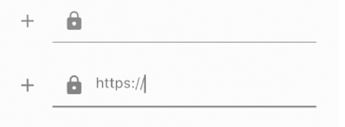

# 交互

[TOC]

## 文本框

### TextField

`TextField`一共有五种状态：无焦点、无焦点且错误、有焦点、有焦点且错误、禁用。

TextField会尽量扩展到父组件尺寸的。但是如果父组件的高度不足以放下TextField，那么就会抛出异常。同时如果宽度是double.infinite，那么也会抛出异常。

~~~dart
const TextField({
  ...
  TextEditingController controller, 
  FocusNode focusNode,
  InputDecoration decoration = const InputDecoration(),
  TextInputType keyboardType,
  TextInputAction textInputAction,
  TextStyle style,
  TextAlign textAlign = TextAlign.start,
  bool autofocus = false,
  bool obscureText = false,
  int maxLines = 1,
  int maxLength,
  this.maxLengthEnforcement,
  ToolbarOptions? toolbarOptions,
  ValueChanged<String> onChanged,
  VoidCallback onEditingComplete,
  ValueChanged<String> onSubmitted,
  List<TextInputFormatter> inputFormatters,
  bool enabled,
  this.cursorWidth = 2.0,
  this.cursorRadius,
  this.cursorColor,
  this.onTap,
  ...
})
~~~

- `InputDecoration`：用于控制`TextField`的外观显示，如提示文本、背景颜色、边框等。如果设置为null，那么什么样式都没有。

- `keyboardType`：用于设置该输入框默认的键盘输入类型，取值如下：

  | TextInputType枚举值 | 含义                                                |
  | ------------------- | --------------------------------------------------- |
  | text                | 文本输入键盘                                        |
  | number              | 数字；会弹出数字键盘                                |
  | phone               | 优化后的电话号码输入键盘；会弹出数字键盘并显示“* #” |
  | datetime            | 优化后的日期输入键盘；Android上会显示“: -”          |
  | emailAddress        | 优化后的电子邮件地址；会显示“@ .”                   |
  | url                 | 优化后的url输入键盘； 会显示“/ .”                   |

- `textInputAction`：键盘动作按钮图标(即回车键位图标)。下面是当值为`TextInputAction.search`时，原生Android系统下键盘样式如图所示：

  

- `style`：正在输入的文本样式。

- `cursorWidth`、`cursorRadius`和`cursorColor`：这三个属性是用于自定义输入框光标宽度、圆角和颜色的。

- `enable`：如果为`false`，则输入框会被禁用，禁用状态不能响应输入和事件，同时显示禁用态样式。程序在运行时可随时通过`enabled`属性设置启用或禁用文本框。

- `maxLines`：默认值为`1`，此时输入框不会换行。若值为`null`，则无限行。而值为`x`，那么最多显示`x`行，不会阻止用户输入超过`x`行。若需要允许用户超出长度后依然输入，则可通过传入`maxLengthEnforced`：`false`，使`TextField`不强行停止用户输入。但是超出限制后，`TextField`状态被设置为错误的

- `obscureText`、`obscureText`：决定是否将内容遮挡，并且用什么字符遮挡。默认为“U+2022 BULLET”字符。

- `maxLength`：设置TextField可允许的最长字符数。`

- `buildCounter`：设置计数器

  ~~~dart
  TextField（
      buildContext : (BuildContext context, {
          required int currentLength,
          required int? maxLength,
          required bool isFocused,
      }) {
          return Text(`${maxLength! - currentLength}`);
      }
  ）
  ~~~

  注意，InputDecoration中有一个counter属性也可以设置计数器，但是它不能自动计数，而buildCounter确是可以的。若两边都设置，InputDecoration中的counter属性则有优先权，覆盖这里的自动计数器。

- `inputFormatters`：自动过滤器

  ~~~dart
  TextField(
  	inputFormatters : [
          FilteringTextInputFormatter.deny(
          	"zzz",								//当用户输入zzz时，自动替换成ZZZZ
              replacementString: "ZZZZ",
          ),
          FilteringTextInputFormatter.deny(
              RegExp(r"[aeiou]"),					
              replacementString : "*",
          ),
          FilteringTextInputFormatter.allow(RegExp("[0-9.]"))	//只允许用户指定字符，其他字符会被忽略掉
      ]
  )
  ~~~

- `onSubmitted`：当用户单击屏幕软键盘上的“完成”等表示结束的按钮时，软键盘会被收起，同时onSubmitted事件会被触发

- `onChanged`：每当用户对TextField的内容做出改动，如添加或删除文字时，onChangd事件都会被触发。但若用户没有直接修改TextField，而是通过controller导致文本内容发生变动的，则不会触发onChanged事件。

- `onEditingComplete`。当用户完成输入时，onEditingComplete事件会在onSubmitted事件之前触发。它的主要作用是处理与焦点相关的逻辑。

  默认情况下，当用户单击软键盘上的done、go、send、search等表示结束的按键时，TextField会自动放弃焦点并收起软键盘。例如，在即时通信软件中，开发者通常会通过textInputAction属性将软键盘右下角修改为“发送”按键，但用户发送完一条短消息后很可能希望立即开始编辑下一条消息，因此不应该放弃焦点。此时可通过向onEditingComplete传入一个空函数来覆盖默认行为

- `onTap`：每当用户单击一次TextField组件，它的onTap事件就会被触发一次

### InputDecoration

`InputDecoration`有三类前缀：

- `icon`
- `prefixIcon`、`prefixIconConstraints`
- `prefix`、`prefixText`、`prefixStyle`。注意：`prefix`与`prefixText`只能二选一。只有在获得焦点时才渲染出，而且不可被用户删除

~~~dart
TextField(
	decoration : InputDecoration(
    	icon : Icon(Icons.add),
        prefixIcon : Icon(Icons.lock),
        prefixText : "https://",
    )
)
~~~

`InputDecoration`也有三类后缀

- `counter`、`counterText`、`counterStyle`
- `suffixIcon`、`sufficIconConstraints`
- `suffixText`、`suffixStyle`、`suffix`。

Material设计风格的文本框有3类提示信息，它们是`label`（标签）、`hint`（暗示）和`helper`（助手）分别对应`labelText`、`labelStyle`和`floatingLabelBehavior`属性。其中，暗示在用户输入任何字符后自动消失。

`TextField`组件共有5种状态，因此`InputDecoration`也有5个相应的定义边框样式的属性，分别为`enabledBorder`（无焦点时的边框）、`errorBorder`（无焦点且错误）、`focusedBorder`（有焦点时的边框）、`focusedErrorBorder`（有焦点且错误）、`disabledBorder`（禁用时的边框）。另外它还提供简单的`border`属性，用于定义默认边框，一般情况下通过`border`属性即可同时设置5种状态。注意，如果要自定义边框，那么必须设置`enabledBorder`等五个属性，否则在对应状态时，会显示`border`属性所设置边框的状态。

`InputDecoration`支持为文本框填充背景色，先将`filled`属性设置为`true`，启用填充色，再通过`fillColor`属性设置一种颜色。此外还可以通过`hoverColor`属性设置鼠标悬浮时的填充色。注意，`fillColor`与`hoverColor`会混色。

### 控制器

~~~dart
class _HyHomePageState extends State<MyHomePage> {
  TextEditingController _controller = TextEditingController();

  @override
  void dispose() {
    _controller.dispose();
    super.dispose();
  }

  @override
  Widget build(BuildContext context) {
    return TextField(
        controller: _controller,
        onChanged: (_) => {log("onChange")},
      ),
    );
  }
}
~~~

~~~dart
controller.text;		//获取并修改文本
controller.clear();		//清除文本
controller.section;		//获取并修改选中的区域
~~~

## 手势

## 拖放

