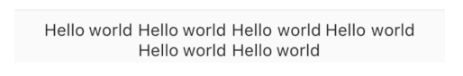
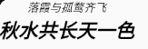

# 基础组件

[TOC]

runApp负责初始化WidgetsFlutterBinding等核心服务，并与Flutter引擎配合，将组件渲染到屏幕上。调用runApp函数时只需传入一个参数，就是一个组件。Flutter会将这个组件当作组件树（Widget Tree）的根，再继续一层层嵌套其他组件，最终满足各式复杂的布局需求和程序效果。

## 文本

### Text

若需要渲染的字体尺寸不符合父级约束，那么Text控件的尺寸强制被修正，（无约束时）。注意，Text控件的尺寸并不会影响到需要渲染的字体。

~~~dart
  const Text(
    String this.data, {
    this.style,
    this.textAlign,
    this.softWrap,
    this.overflow,
    this.textScaleFactor,
    this.maxLines,
    this.semanticsLabel,
  })
~~~

- `textAlign`：只有 Text 宽度大于文本内容长度时指定此属性才有意义

  ~~~dart
  Text("Hello world "*6,  //字符串重复六次
    textAlign: TextAlign.center,
  );
  ~~~

  

- `maxLines`：指定文本显示的最大行数

- `overflow`：指定截断方式。clip（裁剪）、fade（渐淡）、ellipsis（省略号）、visible（可见）

- `textScaleFactor`：默认值由操作系统决定。设用户在安卓或苹果系统中设置了将全局文字放大至150%，则Flutter中所有Text组件的textScaleFactor默认值都会是1.5。这属性适用在某部分布局需要固定文字大小的情景。

- `semanticsLabel`：语义标签是辅助功能的一部分，用来协助第三方软件为有障碍人士提供无障碍功能。例如，盲人一般会通过某些软件将屏幕上的内容朗读出来，而这里的语义标签就可以帮助屏幕朗读软件，以提供更友好的用户体验

  ~~~dart
  Text("$5.00",semanticsLabel: "五元整")
  ~~~

### 文本修饰

`TextStyle`用于指定文本显示的样式如颜色、字体、粗细、背景等

~~~dart
TextStyle({
    this.inherit = true,
    this.color,
    this.backgroundColor,
    this.fontSize,
    this.fontWeight,
    this.fontStyle,
    this.letterSpacing,
    this.wordSpacing,
    this.textBaseline,
    this.height,
    this.leadingDistribution,
    this.locale,
    this.foreground,
    this.background,
    this.shadows,
    this.fontFeatures,
    this.fontVariations,
    this.decoration,
  })
~~~

- `height`：该属性用于指定行高。这里接受一个比例因子，即具体的行高等于`fontSize `* `height`。

可以通过DefaultTextStyle组件为多个Text组件应用统一的样式。当Text组件遇到Text组件多个DefaultTextStyle组件嵌套时，只有最近的那个样式会生效。

可以使用DefaultTextStyle.merge()函数继承父级DefaultTextStyle，并在此基础上扩展或覆盖一些样式。

~~~dart
DefaultTextStyle(
  style: TextStyle(
      color: Colors.grey, fontSize: 24, fontWeight: FontWeight.bold),
  child: Column(
    children: <Widget>[
      DefaultTextStyle(
        style:
            TextStyle(color: Colors.black, fontStyle: FontStyle.italic),
        child: Text("落霞与孤鹜齐飞"),
      ),
      DefaultTextStyle.merge(
        style:
            TextStyle(color: Colors.black, fontStyle: FontStyle.italic),
        child: Text("秋水共长天一色"),
      ),
    ],
  ),
)
~~~

### 使用自定义字体

在`pubspec.yaml`中配置：

~~~yaml
flutter:
  fonts:
    - family: Raleway
      fonts:
        - asset: assets/fonts/Raleway-Regular.ttf
        - asset: assets/fonts/Raleway-Medium.ttf
          weight: 500
        - asset: assets/fonts/Raleway-SemiBold.ttf
          weight: 600
    - family: AbrilFatface
      fonts:
        - asset: assets/fonts/abrilfatface/AbrilFatface-Regular.ttf
~~~

~~~dart
TextStyle(
  fontFamily: 'Raleway',
);
~~~

如果使用了某一款自定义字体，但是没有参数所要求的粗体、斜体等版本。那么Flutter会模拟出对应的字体效果。

### RichText & TextSpan

RichText与TextSpan配合使用，可以很方便地为不同的字体片段应用不同的样式。下面是一个基本结构

~~~dart
RichText(
	text: TextSpan(
    	style : TextStyle(),
        text : "晋太元中",
        children : [
            TextSpan(
            	text : "武陵",
                style : TextStyle(),
            ),
            TextSpan(text : "人捕鱼为业"),
            TextSpan(
            	style : TextStyle()
                text : "缘溪行，忘路之远近",
                children : [
                    TextSpan("忘路之远近")
                ]
            ),
            TextSpan(text : "忽逢桃花林")
        ]
    )
)
~~~

这里TextSpan形成一个树状结构，文本内容的生成遵循深度优先遍历顺序。文本内容从代码结构上来看就是从上到下的。

下级TextSpan会自动继承上级的style，并且可以覆写或扩展上级TextSpan的style。但是RichText组件中的TextSpan并不会继承上级DefaultTextStyle组件提供的默认样式。如需使用DefaultTextStyle组件统一设置样式，则可以考虑使用Text组件的Text.rich（）构造函数。

~~~dart
RichText(
	text : TextSpan(...)
)
    
Text.rich(TextSpan(...))
~~~

TextSpan中的recognizer参数支持传入一个GestureRecognizer类以便完成TextSpan树中某一片段的交互

~~~dart
Text.rich(
	TextSpan(
    	children : [
            TextSpan(
                text: "使用条款",
                recongizer: TapGestureRecongnizer()..onTap;
            ),
            TextSpan(
                text: "隐私政策",
                recongizer: TapGestureRecongnizer()..onTap;
            ),
        ]
    )
);
~~~

## 图片 & Icon

### Icon

Icon组件可以表示小图标。图标的本质是一些相对特殊的字体，属于矢量图形，可以支持无限缩放且不会失真。

Flutter框架中已经自带了一些图标，分别由Icons和CupertinoIcons两个类提供。前者包含常用的Material设计风格（常见于安卓系统）的图标，后者含有Cupertino风格（常见于iOS系统）的图标

~~~dart
Icon(
	IconData? icon, {		
    double? size,			//设置大小
    Color? color,			//设置图标的前景颜色
        
})
    
Icon(Icons.share);
~~~

IconTheme与DefaultTextStyle组件用法几乎相同，这里不再介绍。

### Image

`Image`组件有1个必传的参数image，类型为`ImageProvider`。实际上，`ImageProvider`是一个抽象类，而Flutter框架提供了4种已知继承，分别为**NetworkImage（网络图片）**、**FileImage（文件图片）**、**AssetImage（资源包图片）**及**MemoryImage（内存图片）**。下面分别介绍它们是如何使用的：

- `NetworkImage`：Image组件将根据URL链接地址，自动完成下载、解码、渲染等一系列动作

  ~~~dart
  Image(image : NetworkImage('https://flutter.github.io/assets-for-api-docs/assets/widgets/ owl.jpg');
        
  Image.network('https://flutter.github.io/assets-for-api-docs/assets/widgets/ owl.jpg');
  ~~~

  因为这里需要访问网络，记得检查是否已经打开相关权限，如安卓App模块需要在原生manifest文件内添加android.permission.INTERNET申请网络权限。

  

- `FileImage`：用来加载文件系统中的图片资源文件

  ~~~dart
  Image(image : FileImage(File("path/...")));
  
  Image.file(File("Path/...."));
  ~~~

  记得检查是否打开相关权限，安卓模块可能需要在原生manifest里添加android.permission.READ_EXTERNAL_ STORAGE权限。

  

- `AssetImage`：用于加载在打包时放入资源包（AssetBundle）中的图片资源。

  图片资源的文件路径需要写入pubspec.yaml文件中

  ~~~yaml
  flutter:
  	assets:
  		- images/cat.jpg
          - images/icon/			#images/icon下的所有资源，但是不包括子目录的
  ~~~

  ~~~dart
  Image(image : AssetImage("images/cat.jpg"));
  ~~~

  

- `MemoryImage`：可以从内存中的一个Uint8List字节序列中加载图片。

  在实践中，一般使用convert包里的base64Decode函数，它base64编码转换成Uint8List类型，并传给MemoryImage使用。

  ~~~dart
  final String data = r'iVBORwOKGgoAAAAANsu....';
  final bytes = base64Decode(data);
  Image(image : MemoryImage(bytes));
  Image.memory(bytes);
  ~~~

Image大小受父约束、Widget参数、素材大小的影响。

~~~dart
const Image({
  ...
  this.width, 							//图片的宽
  this.height, 							//图片高度
  this.color, 							//图片的混合色值
  this.colorBlendMode, 					//混合模式
  this.fit,								//缩放模式
  this.alignment = Alignment.center, 	//对齐方式
  this.repeat = ImageRepeat.noRepeat, 	//重复方式
  ...
})
~~~

- `width`、`height`：用于设置图片的宽、高。如果只设置`width`、`height`的其中一个，那么另一个属性默认会按比例缩放

- `alignment`：设置图片的对齐方式。与`fit`一起决定如何渲染不匹配Image控件尺寸的图片。

- `fit`：该属性用于在图片的显示空间和图片本身大小不同时指定图片的适应模式。BoxFit

  当图片过小时的适应模式

  - `none`（默认）：什么也不做。

  - `fill`：会拉伸填充满显示空间，图片本身长宽比会发生变化，图片会变形。
  - `cover`：会按图片的长宽比放大后填满显示空间，图片不会变形，超出显示空间部分会被剪裁。

  当图片过大时的适应模式

  - `contain`（默认）：图片会在保证图片本身长宽比不变的情况下缩放以适应当前显示空间，图片不会变形。
  - `fitWidth`：图片的宽度会缩放到显示空间的宽度，高度会按比例缩放，然后居中显示，图片不会变形，超出显示空间部分会被剪裁。
  - `fitHeight`：图片的高度会缩放到显示空间的高度，宽度会按比例缩放，然后居中显示，图片不会变形，超出显示空间部分会被剪裁。
  - `none`：什么也不做

  

- `errorBuilder`，如果图片加载的过程中发生错误，则Image组件会将errorBuilder方法返回的Widget渲染到屏幕上，并且Image的父组件约束会传递给这个Widget。

  ~~~dart
  Iamge.network(
  	'https://file.not.found/404.png',
      errorBuilder : (context, exception, stackTrace) {
          return Widget();
      }
  )
  ~~~

- `loadingBuilder`

### FadeInImage

在图片加载过程中暂时使用另一张图片来代替，并在加载完成时平滑地过渡成新的图片。

~~~dart
FadeInImage.assetNetwork(
	iamge : "https://.../owl.jpg",
    placeholer : "assets/loading.gif",
    fadeOutDuration : Duration(seconds : 2),
    fadeOutCurve : null
    fadeInDuration : Duration(seconds : 3),
)
~~~

## 容器类组件

### Container

Container组件是一个结合了定义尺寸、形状、背景颜色、装饰、间距、对齐等多功能于一身的组件。虽然这些功能都有对应的组件，而Container的实现也是利用这些组件。

~~~dart
Container({
  this.alignment,					// 子组件的对齐方式
  this.padding, 					// 内边距
  Color color, 						// 背景色，默认是透明的
  Decoration decoration, 			// 背景装饰。包括形状、阴影、边框、渐变色填充等
  Decoration foregroundDecoration, 	// 前景装饰
  double width,						// 宽度
  double height, 					// 高度
  BoxConstraints constraints, 		// 布局约束
  this.margin,						// 外边距
  this.transform, 					// 变换
  this.child,						// 子组件
  ...
})
~~~

- Alignment(double x, double y)，其中x、y分别对应横轴和纵轴方向的位置，取值范围为[-1.0, 1.0]。左上对齐既可以用Alignment(-1.0, -1.0)，也可以用Alignment.topLeft。

- EdgeInsets. fromLTRB（double left，double top，double right，double bottom）即依次单独设置左、上、右、下这4个方向分别留白多少逻辑像素。EdgeInsets. all（doublevalue）同时设置4个方向的值。EdgeInsets. only（）方法，传入需要设置的方向，省略的方向则自动为0。

  ~~~dart
  EdgeInsets.only(left : 16.0, bottom : 80);
  EdgeInsets.all(16.0)
  EdgeInsets.formLTRB(10, 20, 10, 20);
  ~~~

- transform接收一个4×4的矩阵。三维物体的任意缩放、平移和旋转都可以通过一个4× 4矩阵完成

Container的布局行为十分复杂：推荐查阅官方文档https://api.flutter.dev/flutter/widgets/Container-class.html

| child | height、width、constraints | alignment | parent constraints |                           behavior                           |
| :---: | :------------------------: | :-------: | :----------------: | :----------------------------------------------------------: |
|   ❌   |             ❌              |           |         ❌          |                     as small as possible                     |
|   ❌   |             ✔️              |     ❌     |                    | as small as possible given the combination of those constraints and the parent's constraints. |
|   ❌   |             ❌              |     ❌     |         ✔️          |    expand to fit the constraints provided by the parent.     |
|   ✔️   |                            |     ✔️     |         ❌          |                 size itself around the child                 |
|   ✔️   |                            |     ✔️     |         ✔️          | expand to fit the parent, and then positions the child within itself as per the [alignment](https://api.flutter.dev/flutter/widgets/Container/alignment.html). |
|   ✔️   |             ❌              |     ❌     |                    | passes the constraints from the parent to the child and sizes itself to match the child. |

注：constraints ❌意味着是无约束，而constraints ✔️意味着有界约束

## MaterialWiget

## 按钮

这些按钮都是在满足父约束的情况下，尽可能地匹配子组件的尺寸。

`ElevatedButton`、`TextButton`、`OutlinedButton`、`IconButton`，它们的动画效果都是涟漪动画。而`ElevatedButton`、`TextButton`、`OutlinedButton`都有一个`icon` 构造函数，通过它可以轻松创建带图标的按钮。

~~~dart
ElevatedButton(onPressed: () {},child: Text("ElevatedButton"),)
    
TextButton(child: Text("normal"),onPressed: () {},)
    
OutlinedButton(child: Text("normal"),onPressed: () {},)
    
IconButton(icon: Icon(Icons.thumb_up),onPressed: () {},)
    
ElevatedButton.icon(icon: Icon(Icons.send),label: Text("发送"),onPressed: () {},)
    
OutlinedButton.icon(icon: Icon(Icons.add),label: Text("添加"),onPressed: () {},)

TextButton.icon(icon: Icon(Icons.info),label: Text("详情"),onPressed: () {},)
~~~

## 进度条

`LinearProgressIndicator`和`CircularProgressIndicator`，它们都可以同时用于精确的进度指示和模糊的进度指示。精确进度通常用于任务进度可以计算和预估的情况，比如文件下载；而模糊进度则用户任务进度无法准确获得的情况，如下拉刷新，数据提交等。

它们都是尽可能地扩展到父组件的尺寸。

### LinearProgressIndicator

~~~dart
LinearProgressIndicator({
  double value,
  Color backgroundColor,
  Animation<Color> valueColor,
  ...
})
~~~

- `value`：`value`表示当前的进度，取值范围为[0,1]；当`value`为`null`时则指示器会执行一个循环动画（模糊进度）
- `backgroundColor`：指示器的背景色。
- `valueColor`: 指示器的进度条颜色；

### CircularProgressIndicator

~~~dart
 CircularProgressIndicator({
  double value,
  Color backgroundColor,
  Animation<Color> valueColor,
  this.strokeWidth = 4.0,
  ...   
}) 
~~~

- `strokeWidth` 表示圆形进度条的粗细

## 其他

### Placeholder

它可以方便开发者在屏幕上画出一个占位框，表示这块内容暂时还没完成。一般而言，它会试图占满全部可用空间。基本代码如下：

~~~dart
Placeholder()
~~~

