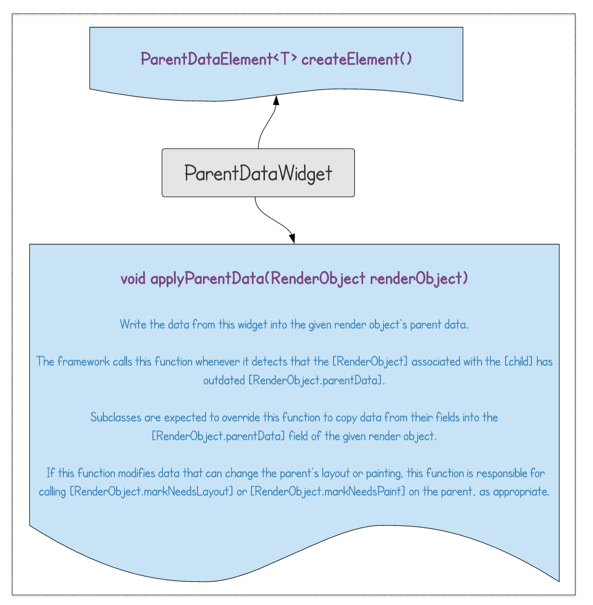
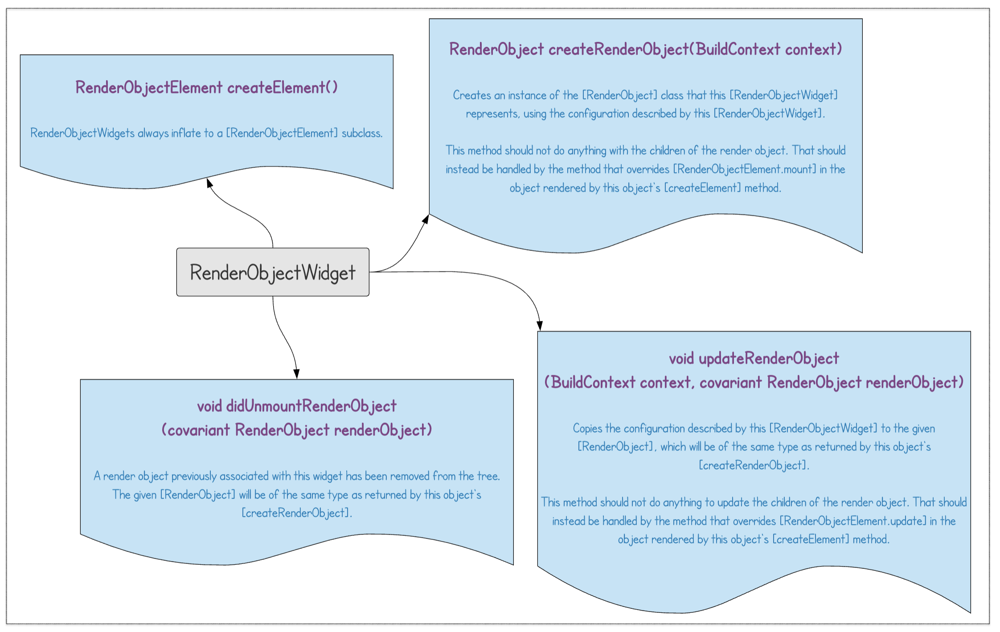
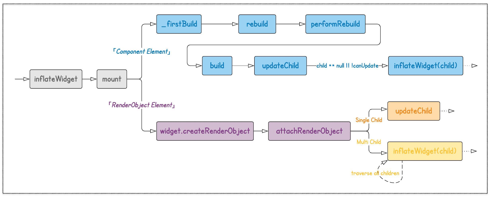
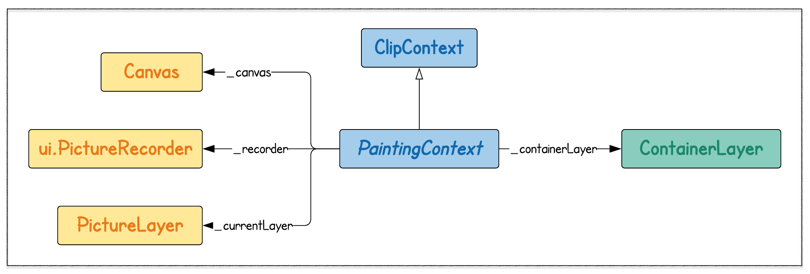
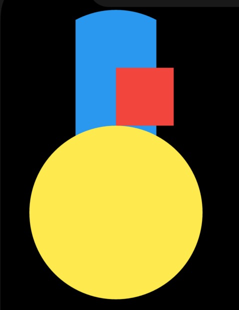
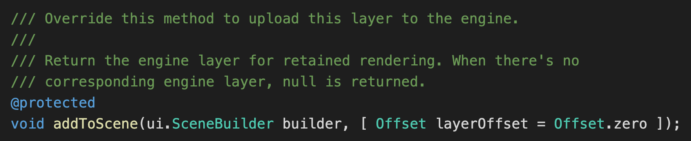
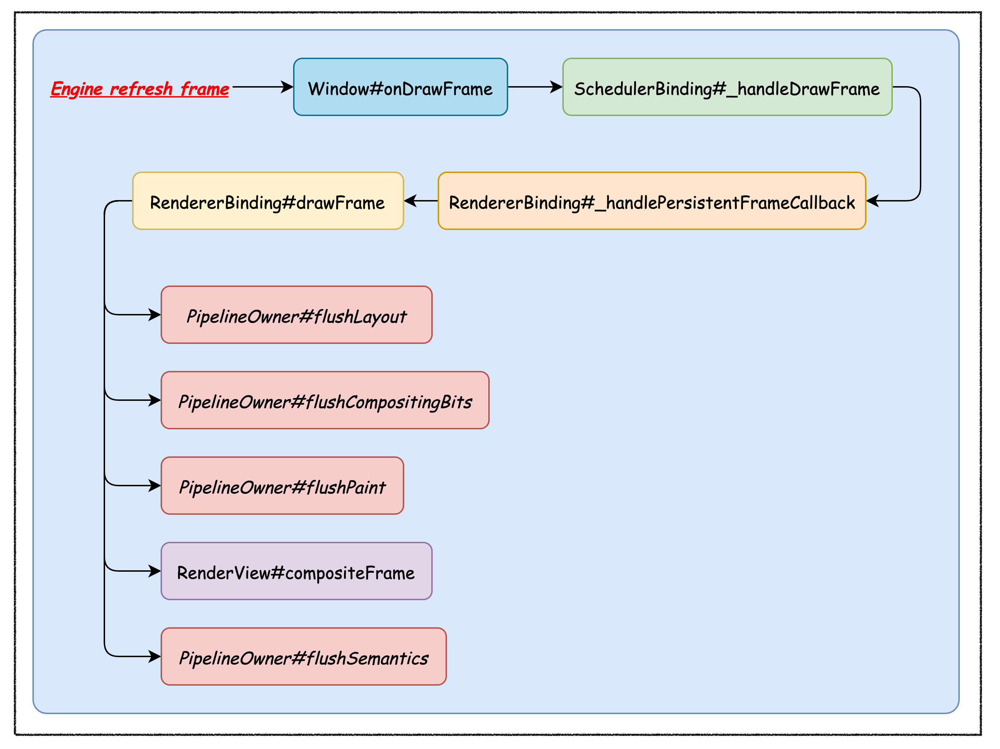
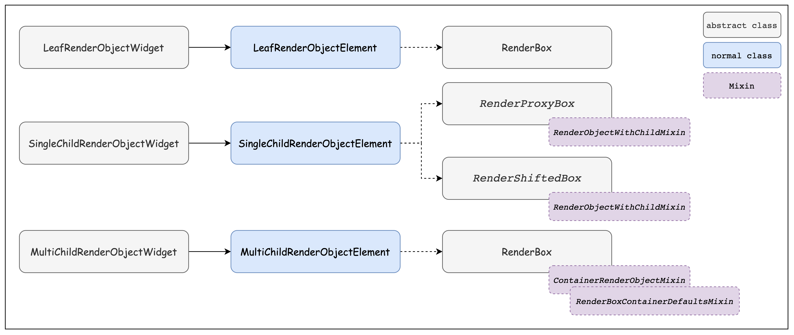

# Flutter框架层原理

[TOC]

Flutter 整体分为三层：Framework (dart)、Engine (C/C++)、Embedder (Platform)


## Widget

Flutter 中万物皆为Widget。**Widget 的功能就是描述一个UI元素的配置信息**：

- 描述 UI 的层级结构 (通过`Widget`嵌套)；

- 定制 UI 的具体样式 (如：`font`、`color`等)；

- 指导 UI 的布局过程 (如：`padding`、`center`等)；

  


既然 Widget 只是描述一个UI元素的配置信息，那么真正的布局、绘制是由谁来完成的呢？Flutter 框架的处理流程是这样的：

1. 根据 Widget 树生成一个 Element 树，Element 树中的节点都继承自 `Element` 类。
2. 根据 Element 树生成 Render 树（渲染树），渲染树中的节点都继承自`RenderObject` 类。
3. 根据渲染树生成 Layer 树，然后上屏显示，Layer 树中的节点都继承自 `Layer` 类。

真正的布局和渲染逻辑在 Render 树中，Element 是 Widget 和 RenderObject 之间的桥梁。


如下图所示，按照功能划分`Widget`大致可以分为 3 类：

- **「Component Widget」** —— 组合类 Widget，这类 Widget 都直接或间接继承于`StatelessWidget`或`StatefulWidget`。这就体现了组合大于继承的原则
- **「Proxy Widget」** —— 代理类 Widget，「Proxy Widget」本身并不涉及 Widget 内部逻辑，只是为「Child Widget」提供一些附加的中间功能。典型的如：`InheritedWidget`用于在「Descendant Widgets」间传递共享信息
- **「Render Widget」** —— 渲染类 Widget，是最核心的`Widget`类型，会直接参与后面的「Layout」、「Paint」流程。无论是「Component Widget」还是「Proxy Widget」最终都会映射到「Render Widget」上，否则将无法被绘制到屏幕上。


## StatelessWidget

`StatelessWidget`相对比较简单，它继承自`widget`类，覆写了`createElement()`方法：

~~~dart
class MyCustomWidget extends StatelessWidget {
    @override
	StatelessElement createElement() => StatelessElement(this);
    
    @override
    Widgtet build(BuildContext context) {
        return Widget();
    }
}
~~~


>当「Parent Widget」或 依赖的「Inherited Widget」频繁变化时，`build`方法也会频繁被调用。因此，提升`build`方法的性能就显得十分重要，Flutter 官方给出了几点建议：
>
>- 减少不必要的中间节点，即减少 UI 的层级，例如通过 「CustomPaint」自定义
>- 尽可能使用`const` Widget
>- 尽量减小 rebuilt 范围，如：某个 Widget 因使用了「Inherited Widget」，导致频繁 rebuilt，可以将真正依赖「Inherited Widget」的部分提取出来，封装成更小的独立 Widget，并尽量将该独立 Widget 推向树的叶子节点，以便减小 rebuilt 时受影响的范围。
>- 必要时，可以将「Stateless Widget」重构成「Stateful Widget」，以便可以使用「Stateful Widget」中一些特定的优化手法


## StatefulWidget

有状态-组合型 Widget，但要注意的是`StatefulWidget`本身还是不可变的，其可变状态存在于`State`中。

下面我们看看`StatefulWidget`的类定义：

~~~dart
abstract class StatefulWidget extends Widget {
  const StatefulWidget({ Key key }) : super(key: key);
    
  @override
  StatefulElement createElement() => StatefulElement(this);
    
  @protected
  State createState();
}
~~~

- `createState()` 用于创建和 StatefulWidget 相关的状态，它在StatefulWidget 的生命周期中可能会被多次调用。例如，当一个 StatefulWidget 同时插入到 widget 树的多个位置时，Flutter 框架就会调用该方法为每一个位置生成一个独立的State实例，其实，本质上就是一个`StatefulElement`对应一个State实例。这里多次插入的意思是：

  ~~~dart
  class CustomWidget extends StatelessWidget  {
    @override
    Widget build(BuildContext context) {
      StatefulWidget statefulWidget = new StatefulWidet();
        
      return Column(
      	children: [
              statefulWidget,			//多次插入，每一处插入都对应一个新的State实例
              statefulWidget,
              statefulWidget,
          ]
      )
    }
  }
  ~~~


### State

State 用于处理「Stateful Widget」的业务逻辑以及可变状态。

State实例有两个重要的属性

- `widget`：指向与该 State 实例的StatefulWidget实例。注意，这种关联并非永久的，因为在应用生命周期中，UI树上的某一个节点的 widget 实例在重新构建时可能会变化，如果 widget 被修改了，Flutter 框架会动态设置State.widget 为新的 widget 实例。

- `context`：指向与该 State 实例关联的Element实例。

  ~~~dart
  Widget build(BuildContext context) {
      this.context;				//这样就避免和参数context发生命名冲突
      return Widget();
  }
  ~~~

  

此外，StatefulWidget中也可以保存状态，但是不推荐。因为多个State共享一个StatefulWidget的话，其中一个State调用setState来更新数据，而其他State却不能主动感知这一点，从而造成数据不一致问题。

~~~dart
class _MyAppState extends State<MyApp> {
  @override
  Widget build(BuildContext context) {
    StatefulWidget widget = CustomWidget();
    return Column(
      children: [widget,widget,widget,],
    );
  }
}

class CustomWidget extends StatefulWidget {
  CustomWidget({super.key});
  int _j = 10;
  @override
  State<CustomWidget> createState() => _CustomWidgetState();
}

class _CustomWidgetState extends State<CustomWidget> {
  int i = 10;
  @override
  Widget build(BuildContext context) {
    return GestureDetector(
      onTap: () {setState(() {i++; widget._j++;});},
      child: Container(
        width : 100, height: 100, color : Colors.red,
        child: Text("$i ${widget._j}"),
      )
    );
  }
}
~~~


 State 有较复杂的生命周期：


State 的生命周期大致可以分为 8 个阶段

- `createState`：在对应的「Stateful Element」被挂载 (mount) 到树上时，通过`StatefulElement.constructor` –> `StatefulWidget.createState`创建 State 实例；

  ~~~dart
  abstract class StatefulWidget extends Widget {
    @override
    StatefulElement createElement() => StatefulElement(this);
      
    @protected
    @factory
    State createState();
    //...
  }
  
  class StatefulElement extends ComponentElement {
    StatefulElement(StatefulWidget widget)
        : _state = widget.createState() {
        //...
    }
  }
  ~~~

  

- `initState`：State对象首次插入到Element Tree时被调用。对于每一个State对象，Flutter 框架只会调用一次该回调函数。

  

  在此函数中不能调用 **BuildContext.dependOnInheritedWidgetOfExactType**。否则会抛出异常

  ~~~dart
  //State
  @override
  void initState() {
    super.initState();
    IconTheme iconTheme = context.dependOnInheritedWidgetOfExactType<IconTheme>();
  }
  ~~~

  解决方案：在didChangeDependencies中调用

  ~~~dart
  //State
  @override
  void didChangeDependencies() {
    super.didChangeDependencies();
    context.dependOnInheritedWidgetOfExactType<IconTheme>();
  }
  ~~~

  

  下面这段代码也会报异常

  ```dart
  
  @override
  void initState() {
    super.initState();
    showDialog(context: context,builder: (context){
      return AlertDialog();
    });
  }
  ```

  解决方案：

  ~~~dart
  @override
  void initState() {
    super.initState();
    //在该帧结束后，调用该回调函数
    WidgetsBinding.instance.addPostFrameCallback((timeStamp) {
      showDialog(context: context,builder: (context){
        return AlertDialog(title: Text('AlertDialog'),);
      });
    });
  }
  ~~~

  

- `didChangeDependencies()`：didChangeDependencies 方法在 initState 之后由 Framework 立即调用。另外，当此 **State** 对象的依赖项更改时被调用，比如其所依赖的 **InheritedWidget** 发生变化时， Framework 会调用此方法通知组件发生变化。典型的场景是当系统语言 Locale 或应用主题改变时，Flutter 框架会通知 widget 调用此回调。

  

  > didChangeDependencies 方法调用后，组件的状态变为 **dirty**，立即调用 build 方法。

- `build()`：它主要是用于构建 widget 子树的，会在如下场景被调用：

  1. 调用 **initState** 方法后。
  2. 调用 **setState** 方法后。
  3. 调用 **didUpdateWidget** 方法后。
  4. 此 **State** 对象的依存关系发生更改后（例如，依赖的 **InheritedWidget** 发生了更改）。
  5. 调用 **deactivate** 之后，然后将 **State** 对象重新插入树的另一个位置。
  
  
  
- `reassemble()`：此回调是专门为了开发调试而提供的，在热重载(hot reload)时会被调用，此回调在Release模式下永远不会被调用。

- `didUpdateWidget ()`：在 widget 重新构建时，Flutter 框架会调用`widget.canUpdate`来检测 widget 树中同一位置的新旧节点，然后决定是否需要更新，如果`widget.canUpdate`返回`true`，则会调用此回调函数。

  > Framework 调用完此方法后，会将组件设置为 **dirty** 状态，然后调用 **build** 方法

- `deactivate()`：当 State 对象从树中被移除时，会调用此回调。

  > 在一些场景下，Flutter 框架会将 State 对象重新插到树中，例如包含此 State 对象的子树在树的一个位置移动到另一个位置时（可以通过GlobalKey 来实现）。

- `dispose()`：如果在帧结束时，State对象仍未重新插入到树中，那么该State对象就会被回收。此时就会调用该函数。通常在此回调函数中释放资源。


> **注意**：在继承`StatefulWidget`重写其方法时，对于包含`@mustCallSuper`标注的父类方法，都要在子类方法中调用父类方法。


### setState

~~~dart
//State
void setState(VoidCallback fn) {
  assert(fn != null);
  assert(() {
    //在`State.dispose`后不能调用`setState` 
    if (_debugLifecycleState == _StateLifecycle.defunct) {
      throw FlutterError.fromParts(<DiagnosticsNode>[...]);
    }
    //在 State 的构造方法中不能调用`setState` 
    if (_debugLifecycleState == _StateLifecycle.created && !mounted) {
      throw FlutterError.fromParts(<DiagnosticsNode>[...]);
    }
    return true;
  }());
  final dynamic result = fn() as dynamic;
  //`setState`方法的回调函数 (`fn`) 不能是异步的 。原因很简单，因为从流程设计上 framework 需要根据回调函数产生的新状态去刷新 UI (第 14 行)；
  assert(() {
    if (result is Future) {
      throw FlutterError.fromParts(<DiagnosticsNode>[...]);
    }
    return true;
  }());
    
  //更新UI
  _element.markNeedsBuild();
}
~~~

setState 调用后：

1. 首先调用当前 element 的` markNeedsBuild `方法，将当前 element标记为 dirty 。

   ~~~dart
   void markNeedsBuild() {
       //...
       _dirty = true;
       owner!.scheduleBuildFor(this);		//owner为BuildOwner类型
   }
   ~~~

2. 接着调用` scheduleBuildFor`，将当前 element 添加到BuildOwner的 dirtyElements 列表。

   ~~~dart
   //
   void scheduleBuildFor(Element element) {
       //..
       if (!_scheduledFlushDirtyElements && onBuildScheduled != null) {
         _scheduledFlushDirtyElements = true;
         onBuildScheduled!();				//BuildOwner中的方法
       }
       _dirtyElements.add(element);
       element._inDirtyList = true;
   }
   ~~~

3. `onBuildScheduled`之后的调用链如下 `onBuildScheduled` -> `ensureVisualUpdate` -> `window.scheduleFrame` ->  `window.onDrawFrame`  -> `drawFrame`。

> 当我们调用 `window.scheduleFrame()` 方法之后，Flutter引擎会在合适的时机（可以认为是在屏幕下一次刷新之前，具体取决于Flutter引擎的实现）来调用`onBeginFrame`和`onDrawFrame`。

## 启动流程与事件循环

Flutter的入口在"lib/main.dart"的`main()`函数中：

~~~dart
void main() => runApp(MyApp());
~~~

`runApp()`方法如下：

~~~dart
void runApp(Widget app) {
  WidgetsFlutterBinding.ensureInitialized()
    ..attachRootWidget(app)
    ..scheduleWarmUpFrame();
}
~~~

参数`app`是一个 widget，它是 Flutter 应用启动后要展示的第一个组件。而`WidgetsFlutterBinding`正是绑定widget 框架和Flutter 引擎的桥梁。定义如下：

~~~dart
class WidgetsFlutterBinding extends BindingBase with GestureBinding, ServicesBinding, SchedulerBinding, PaintingBinding, SemanticsBinding, RendererBinding, WidgetsBinding {}
~~~

可以看到`WidgetsFlutterBinding`继承自`BindingBase` 并混入了很多`Binding`。这些Binding中基本都是监听并处理`Window`对象的一些事件，然后将这些事件按照Framework的模型封装后分发

> Window：The most basic interface to the host operating system's user interface.

我们接着回过头来看runApp。`WidgetsFlutterBinding.ensureInitialized()`负责初始化一个`WidgetsBinding`的全局单例，紧接着会调用`WidgetsBinding`的`attachRootWidget`方法，该方法负责将根Widget添加到`RenderView`上

> `renderView`是一个`RenderObject`，它是渲染树的根，而`renderViewElement`是`renderView`对应的`Element`对象

最后会调用`WidgetsFlutterBinding` 实例的 `scheduleWarmUpFrame()` 方法，该方法的实现在`SchedulerBinding` 中，它被调用后会立即进行一次绘制，在此次绘制结束前，该方法会锁定事件分发，也就是说在本次绘制结束完成之前 Flutter 将不会响应各种事件，这可以保证在绘制过程中不会再触发新的重绘。


一次绘制过程，我们称其为一**帧（frame）**。Flutter UI 框架的 frame 并不是每次屏幕刷新时都会重新绘制，而是会采取一种主动请求 frame 的方式来刷新UI的

1. Flutter 在 `window` 上注册一个 `onBeginFrame`和一个 `onDrawFrame` 回调，在`onDrawFrame` 回调中最终会调用 `drawFrame`。
2. 当我们调用 `window.scheduleFrame()` 方法之后，Flutter引擎会在合适的时机（可以认为是在屏幕下一次刷新之前，具体取决于Flutter引擎的实现）来调用`onBeginFrame`和`onDrawFrame`。


Flutter 应用执行过程简单来讲分为 idle 和 frame 两种状态。

当有新的 frame 到来时，就进入了frame状态，具体处理过程就是依次执行四个任务队列：`transientCallbacks`、`midFrameMicrotasks`、`persistentCallbacks`、`postFrameCallbacks`。当四个任务队列执行完毕后当前 frame 结束，然后切换到idle状态。

```
enum SchedulerPhase {
  idle,
  transientCallbacks,
  midFrameMicrotasks,
  persistentCallbacks,
  postFrameCallbacks,
}
```


- `idle`：空闲状态表示页面未发生变化，并不需要重新渲染。微任务、定时器回调或者用户事件回调
- `transientCallbacks`： 执行”临时“的回调任务，动画回调会在该阶段执行。
- `midFrameMicrotasks`：在执行临时任务时可能会产生一些新的微任务，比如在执行第一个临时任务时创建了一个Future，且这个 Future 在所有临时任务执行完毕前就已经 resolve 了，这中情况Future 的回调将在[midFrameMicrotasks]阶段执行
- `persistentCallbacks`：渲染管线
- `postFrameCallbacks`：执行一些清理工作

drawFrame方法在persistentCallbacks阶段执行

```
void drawFrame() {
  buildOwner!.buildScope(renderViewElement!); // 1.重新构建widget树
  //下面是 展开 super.drawFrame() 方法
  pipelineOwner.flushLayout(); 				// 2.更新布局
  pipelineOwner.flushCompositingBits(); 	// 3.更新“层合成”信息
  pipelineOwner.flushPaint(); 				// 4.重绘
  if (sendFramesToEngine) {
    renderView.compositeFrame(); 			// 5.上屏，会将绘制出的bit数据发送给GPU
    ...
  }
}
```

1. 重新构建widget树
2. 更新布局
3. 更新“层合成”信息
4. 重绘
5. 上屏：将绘制的产物显示在屏幕上


~~~dart
void buildScope(Element context, [ VoidCallback callback ]) {
  if (callback == null && _dirtyElements.isEmpty)
    return;

  try {
    if (callback != null) {
      callback();
    }

    _dirtyElements.sort(Element._sort);
    int dirtyCount = _dirtyElements.length;
    int index = 0;
    while (index < dirtyCount) {
      _dirtyElements[index].rebuild();
      index += 1;
    }
  } finally {
    for (Element element in _dirtyElements) {
      element._inDirtyList = false;
    }
    _dirtyElements.clear();
  }
}
~~~


## Key

Key有两个主要作用：

- Widget对象的标识
- 引用Widget对象、Element对象、State对象


设globalKey为一个GlobalKey类型的对象，那么：

- globalKey.currentWidget：获得该 widget 对象
- globalKey.currentElement：来获得 widget 对应的element对象
- globalKey.currentState：来获得 element 对应的state对象


## Context

通过源码我们发现Element实现了BuildContext接口。

~~~dart
abstract class Element extends DiagnosticableTree implements BuildContext
~~~

事实上，context就是指向某个widget对应的element实例！


`context`对象有一个`findAncestorStateOfType()`方法，该方法可以从当前节点沿着 widget 树向上查找指定类型的 StatefulWidget 对应的 State 对象。

~~~dart
ScaffoldState _state = context.findAncestorStateOfType<ScaffoldState>()!;
~~~

一般来说不应该直接获取StatefulWidget的状态实例，因为这些状态是私有的，不应该向外部暴露的。

在 Flutter 开发中便有了一个默认的约定：如果 StatefulWidget 的状态是希望暴露出的，应当在 StatefulWidget 中提供一个`of` 静态方法来获取其 State 对象，开发者便可直接通过该方法来获取；如果 State不希望暴露，则不提供`of`方法。

~~~dart
ScaffoldState _state = Scaffold.of(context);
~~~


## ProxyWidget

### ParentDataWidget

`ParentDataWidget`作为 Proxy 型 Widget，其功能主要是为其他 Widget 提供`ParentData`信息。

> ParentData的详细信息会在介绍 RenderObject 时介绍。




下面这段代码来自`RenderObjectElement`

~~~dart
void attachRenderObject(dynamic newSlot) {
  assert(_ancestorRenderObjectElement == null);
  _slot = newSlot;
  _ancestorRenderObjectElement = _findAncestorRenderObjectElement();
  _ancestorRenderObjectElement?.insertChildRenderObject(renderObject, newSlot);
  final ParentDataElement<RenderObjectWidget> parentDataElement = _findAncestorParentDataElement();			//向上开始找ParentDataElement
  if (parentDataElement != null)		 //如果找到就用其 Widget(ParentDataWidget) 中的 parentData 信息去设置 Render Obejct
    _updateParentData(parentDataElement.widget);
}

ParentDataElement<RenderObjectWidget> _findAncestorParentDataElement() {
  Element ancestor = _parent;
  while (ancestor != null && ancestor is! RenderObjectElement) {	//在查找过程中如查到RenderObjectElement，说明当前 RenderObject 没有 Parent Data 信息。
    if (ancestor is ParentDataElement<RenderObjectWidget>)
      return ancestor;
    ancestor = ancestor._parent;
  }
  return null;
}

void _updateParentData(ParentDataWidget<RenderObjectWidget> parentData) {
  parentData.applyParentData(renderObject);			//ParentDataWidget需要重写applyParentData方法，以便设置对应RenderObject的parentData属性。
}
~~~

来看个例子，`Positioned`组件(继承自ParentDataWidget)：

~~~dart
void applyParentData(RenderObject renderObject) {
  assert(renderObject.parentData is StackParentData);
  final StackParentData parentData = renderObject.parentData;
  bool needsLayout = false;

    //Positioned在必要时将自己的属性赋值给了对应的RenderObject.parentData (此处是StackParentData)
  if (parentData.left != left) {
    parentData.left = left;
    needsLayout = true;
  }
  ...
  if (parentData.width != width) {
    parentData.width = width;
    needsLayout = true;
  }
  ...
  if (needsLayout) {
    final AbstractNode targetParent = renderObject.parent;
    if (targetParent is RenderObject)
      //重新布局
      targetParent.markNeedsLayout();
  }
}
~~~


### InheritedWidget

**InheritedWidget（继承式组件）**提供了一种在 widget 树中从上到下共享数据的方式。国际化、Theme组件等都是通过它来实现。

InheritedWidget的思想就是状态提升，相比较原生的状态提升方案，InheritedWidget实现了跨级传递数据，而不是逐级传递数据。


通过`BuildContext.dependOnInheritedWidgetOfExactType`可以获取最近的「Inherited Widget」。通过这种方式获取「Inherited Widget」时，当「Inherited Widget」状态有变化时，就会重新build引用方。

下面给出一个例子：

~~~dart
class ShareDataWidget extends InheritedWidget {
  ShareDataWidget({
    Key? key,
    required this.data,
    required Widget child,
  }) : super(key: key, child: child);

  final int data; //需要在子树中共享的数据

  //定义一个便捷方法，方便子树中的widget获取共享数据
  static ShareDataWidget? of(BuildContext context) {
      
  //从这里就向InheritedWidget注册了需要依赖的子组件，同时返回该组件对象。这样子组件可以读取InheritedWidget中的数据了
    return context.dependOnInheritedWidgetOfExactType<ShareDataWidget>();
  }

  
  //当该IngeritedWidget重新build时，是否通知子树中依赖该data的Widget重新build，以及调用该widget的didChangeDependencies方法
  @override
  bool updateShouldNotify(ShareDataWidget old) {
    return old.data != data;
  }
}
~~~

~~~dart
class _TestWidget extends StatefulWidget {
  @override
  __TestWidgetState createState() => __TestWidgetState();
}

class __TestWidgetState extends State<_TestWidget> {
  @override
  Widget build(BuildContext context) {
    //使用InheritedWidget中的共享数据
    return Text(ShareDataWidget.of(context)!.data.toString());
  }
}
~~~

注册的子组件还可以覆写didChangeDependencies方法，来监听InheritedWidget的通知

~~~dart
class __TestWidgetState extends State<_TestWidget> {
  @override
  void didChangeDependencies() {
    super.didChangeDependencies();
     //父或祖先widget中的InheritedWidget改变(updateShouldNotify返回true)时会被调用。
    //如果build中没有依赖InheritedWidget，则此回调不会被调用。
    print("Dependencies change");
  }
}
~~~

如果我们只想在`__TestWidgetState`中引用`ShareDataWidget`数据，但却不希望在`ShareDataWidget`发生变化时调用`__TestWidgetState`的`didChangeDependencies()`方法应该怎么办？

其实答案很简单，把`context.dependOnInheritedWidgetOfExactType()`方法换成`context.getElementForInheritedWidgetOfExactType<ShareDataWidget>().widget`即可。因为调用`dependOnInheritedWidgetOfExactType()` 和 `getElementForInheritedWidgetOfExactType()`的区别就是前者会注册依赖关系，而后者不会。


在 Element 基类中有这样两个成员：

~~~dart
PersistentHashMap<Type, InheritedElement>? _inheritedElements;
Set<InheritedElement>? _dependencies;
~~~

-  `_inheritedWidgets`——用于保存从「Element Tree」根节点到当前节点路径上所有的「Inherited Elements」

   前文提到过在`mount`方法结束处会调用`_updateInheritance`：
   以下是 Element 基类的实现，可以看到子节点直接获得父节点的`_inheritedWidgets`：

   ~~~dart
   void _updateInheritance() {
     _inheritedWidgets = _parent?._inheritedWidgets;
   }
   ~~~

   以下是`InheritedElement`类的实现，其在父节点的基础上将自己加入到`_inheritedWidgets`中，以便其子孙节点的`_inheritedWidgets`包含它 (第 8 行)：

   ~~~dart
   void _updateInheritance() {
     final Map<Type, InheritedElement> incomingWidgets = _parent?._inheritedWidgets;
     if (incomingWidgets != null)
       _inheritedWidgets = HashMap<Type, InheritedElement>.from(incomingWidgets);
     else
       _inheritedWidgets = HashMap<Type, InheritedElement>();
   
     _inheritedWidgets[widget.runtimeType] = this;
   }
   ~~~

- `_dependencies` —— 用于记录当前节点依赖了哪些「Inherited Elements」。


最终，在「Inherited Element」发生变化，需要通知依赖者时，会读取依赖者的`_dependencies`

~~~dart
//InheritedElement

final Map<Element, Object?> _dependents = HashMap<Element, Object?>();

void notifyClients(InheritedWidget oldWidget) {
  for (Element dependent in _dependents.keys) {
    // check that it really depends on us
    assert(dependent._dependencies.contains(this));
    notifyDependent(oldWidget, dependent);
  }
}

@protected
void notifyDependent(covariant InheritedWidget oldWidget, Element dependent) {
	dependent.didChangeDependencies();
}

@mustCallSuper
void didChangeDependencies() {
    assert(_lifecycleState == _ElementLifecycle.active); // otherwise markNeedsBuild is a no-op
    assert(_debugCheckOwnerBuildTargetExists('didChangeDependencies'));
    markNeedsBuild();
}
~~~


## RenderObjectWidget

真正与渲染相关的 Widget，属于最核心的类型，一切其他类型的 Widget 要渲染到屏幕上，最终都要回归到该类型的 Widget 上。




## BuildOwner

BuildOwner 主要是用于保存那些需要 rebuild 的「Dirty Elements」以及处于 Inactive 状态的 Elements。


`BuildOwner`两个关键成员变量：

~~~dart
final _InactiveElements _inactiveElements = _InactiveElements();
final List<Element> _dirtyElements = <Element>[];
~~~

其命名已清晰表达了他们的用途：分别用于保存「Inactive Elements」、「Dirty Elements」。

> 所谓「Inactive Element」，是指 element 从「Element Tree」上被移除到 dispose 或被重新插入「Element Tree」间的一个中间状态。
>


整棵「Element Tree」共享同一个`BuildOwner`实例 (全局的)，在 Element 挂载过程中由 parent 传递给 child element：

~~~dart
@mustCallSuper
void mount(Element parent, dynamic newSlot) {
  _parent = parent;
  _slot = newSlot;
  _depth = _parent != null ? _parent.depth + 1 : 1;
  _active = true;
  if (parent != null) 
    _owner = parent.owner;			//从这里设置的
}
~~~

`BuildOwner`实例由`WidgetsBinding`负责创建，并赋值给「Element Tree」的根节点`RenderObjectToWidgetElement`，此后随着「Element Tree」的创建逐级传递给子节点。


## Elements

Element 有 2 个主要职责：

- 根据 UI配置信息 (「Widget Tree」) 的变化来维护「Element Tree」，包括：节点的插入、更新、删除、移动等；
- Widget 与 RenderObject 间的桥梁。


如图所示，Element 根据特点可以分为 2 类：

- **「Component Element」** —— 组合型 Element，「Component Widget」、「Proxy Widget」对应的 Element 都属于这一类型
- **「Renderer Element」** —— 渲染型 Element，对应「Renderer Widget」，其不同的子类型包含的子节点个数也不一样，如：LeafRenderObjectElement 没有子节点，RootRenderObjectElement、SingleChildRenderObjectElement 有一个子节点，MultiChildRenderObjectElement 有多个子节点。


 Element 与其他几个核心元素间的关系：


- Element 通过 parent、child 指针形成「Element Tree」；

- Element 持有 Widget、「Render Object」；

- State 是绑定在 Element 上的，而不是绑在「Stateful Widget」上(这点很重要)。

  > 上述这些关系并不是所有类型的 Element 都有，如：「Render Object」只有「RenderObject Element」才有，State 只有「Stateful Element」才有。


### 生命周期


- parent 通过`Element.inflateWidget`->`Widget.createElement`创建 child element

- parent 通过`Element.mount`将新创建的 child 插入到「Element Tree」中指定的插槽处 (slot)。插入后，child element 处于 active 状态。

- 当UI 结构变化时（Widget Tree发生变化），若

  - 新老 Widget.[key && runtimeType] 相等（调用`Widget.canUpdate`返回`true`）：此时 parent 会调用`Element.update`去更新子节点。此方法会递归执行，直到叶子节点。

  - 新老 Widget.[key || runtimeType] 不相等：此时parent 将调用`deactivateChild`方法，之后element 处于 “inactive” 状态。该方法主要做了 3 件事：

    - 从「Element Tree」中移除该 element (将 parent 置为 null)；
    - 将相应的「render object」从「render tree」上移除；
    - 将 element 添加到`owner._inactiveElements`中。在添加过程中会对以该 element 为根节点子树上的所有节点调用`deactivate`方法 (移除的是整棵子树)。

    ~~~dart
    void deactivateChild(Element child) {
      child._parent = null;
      child.detachRenderObject();
      owner._inactiveElements.add(child); // this eventually calls child.deactivate()
    }
    ~~~

- 在当前帧动画结束之前，处于inactive状态的element可以重新插入到element tree中。若结束时，仍未插入到element tree，那么就会被回收掉。


### 核心方法

这些核心方法搭建了Widget与RenderObject之间的桥梁，例如updateChild和inflateWidget方法可以将Widget对象转换为Element对象。这些核心方法又会调用updateRenderObject等方法，会将Element对象转换为Render Object对象。


#### updateChild

`updateChild`是 flutter framework 中的核心方法之一：**父节点通过该方法来修改子节点对应的 Widget**。

~~~dart
// 1. newWidget为null，那么删除相应的element
// 2. 如果child为null，那么根据newWidget来创建element
// 3. 如果child不为null
//		3.1 widget无更新
//		3.2 widget已更新，创建新的Element

Element updateChild(Element child, Widget newWidget, dynamic newSlot) {
  //说明子节点对应的 Widget 已被移除
  if (newWidget == null) {
    //删除对应的element
    if (child != null)
      deactivateChild(child);
    return null;
  }

  
  if (child != null) {
    //明 child.widget 前后没有变化
    if (child.widget == newWidget) {
        
      //若 child.slot != newSlot 表明子节点在兄弟结点间移动了位置，通过updateSlotForChild修改 child.slot 即可；
      if (child.slot != newSlot)
        updateSlotForChild(child, newSlot);
      return child;
    }
	
    //新旧Widget无更新
    if (Widget.canUpdate(child.widget, newWidget)) { 
      if (child.slot != newSlot)
        updateSlotForChild(child, newSlot);
      
      child.update(newWidget);
      assert(child.widget == newWidget);

      return child;
    }
	
    //此时新旧Widget不同，则先将 child element 移除，并通过newWidget创建新的element子节点。
    deactivateChild(child);
    assert(child._parent == null);
  }

  //然后创建新的Element
  return inflateWidget(newWidget, newSlot);
}
~~~

#### update

在更新流程中，若新老 Widget.[runtimeType && key] 相等，则会调用到该方法。
子类需要重写该方法以处理具体的更新逻辑：

- Element基类：

  ~~~dart
  @mustCallSuper
  void update(covariant Widget newWidget) {
    _widget = newWidget;
  }
  //基类中的update很简单，只是更新element的_widget属性。
  ~~~

- StatelessElement

  ~~~dart
  void update(StatelessWidget newWidget) {
    super.update(newWidget);
    _dirty = true;
    rebuild();
  }
  ~~~

- StatefulElement

  ~~~dart
  void update(StatefulWidget newWidget) {
    super.update(newWidget);
    final StatefulWidget oldWidget = _state._widget;
    _dirty = true;
    _state._widget = widget;		//修改 State 的 _widget属性；		
    try {
      _state.didUpdateWidget(oldWidget) as dynamic;		//调用State.didUpdateWidget
    }
    finally {
    }
    rebuild();
  }
  ~~~

- ProxyElement
  
  ~~~dart
  void update(ProxyWidget newWidget) {
    final ProxyWidget oldWidget = widget;
    super.update(newWidget);
    updated(oldWidget);
    _dirty = true;
    rebuild();
  }
  
  void updated(covariant ProxyWidget oldWidget) {
    //InheritedElement会触发所有依赖者 rebuild 
    notifyClients(oldWidget);
  }
  
  Widget build() => widget.child;
  ~~~
  
- RenderObjectElement
  
  ~~~dart
  void update(covariant RenderObjectWidget newWidget) {
    super.update(newWidget);
    widget.updateRenderObject(this, renderObject);
    _dirty = false;
  }
  ~~~
  
- SingleChildRenderObjectElement
  
  ~~~dart
  void update(SingleChildRenderObjectWidget newWidget) {
    super.update(newWidget);
    _child = updateChild(_child, widget.child, null);
  }
  ~~~
  
- MultiChildRenderObjectElement
  
  ~~~dart
  void update(MultiChildRenderObjectWidget newWidget) {
    super.update(newWidget);
    _children = updateChildren(_children, widget.children, forgottenChildren: _forgottenChildren);
  }
  ~~~
  

####  inflateWidget

该方法的主要职责：通过 Widget 创建对应的 Element，并将其挂载 (mount) 到「Element Tree」上。

~~~dart
Element inflateWidget(Widget newWidget, dynamic newSlot) {
  final Key key = newWidget.key;
  if (key is GlobalKey) {
    final Element newChild = _retakeInactiveElement(key, newWidget);
    if (newChild != null) {
      newChild._activateWithParent(this, newSlot);
      final Element updatedChild = updateChild(newChild, newWidget, newSlot);
      return updatedChild;
    }
  }

  final Element newChild = newWidget.createElement();
  newChild.mount(this, newSlot);
  return newChild;
}
~~~


  #### mount

当 Element 第一次被插入「Element Tree」上时，调用该方法。

- Element

  ~~~dart
  @mustCallSuper
  void mount(Element parent, dynamic newSlot) {
    _parent = parent;
    _slot = newSlot;
    _depth = _parent != null ? _parent.depth + 1 : 1;
    _active = true;
    if (parent != null) // Only assign ownership if the parent is non-null
      _owner = parent.owner;
  
    if (widget.key is GlobalKey) {
      final GlobalKey key = widget.key;
      key._register(this);
    }
  
    _updateInheritance();
  }
  ~~~

- ComponentElement

  ```dart
  void mount(Element parent, dynamic newSlot) {
    super.mount(parent, newSlot);
    _firstBuild();
  }
  
  void _firstBuild() {
    rebuild();
  }
  ```

- RenderObjectElement

  ~~~dart
  void mount(Element parent, dynamic newSlot) {
    super.mount(parent, newSlot);
    //创建了RenderObject
    _renderObject = widget.createRenderObject(this);
    attachRenderObject(newSlot);
    _dirty = false;
  }
  ~~~

- SingleChildRenderObjectElement

  ~~~dart
  @override
  void mount(Element parent, dynamic newSlot) {
    super.mount(parent, newSlot);
    _child = updateChild(_child, widget.child, null);
  }
  ~~~

- MultiChildRenderObjectElement

  ~~~dart
  void mount(Element parent, dynamic newSlot) {
    super.mount(parent, newSlot);
    _children = List<Element>(widget.children.length);
    Element previousChild;
    for (int i = 0; i < _children.length; i += 1) {
      final Element newChild = inflateWidget(widget.children[i], previousChild);
      _children[i] = newChild;
      previousChild = newChild;
    }
  }
  ~~~

  


#### markNeedsBuild

~~~dart

void markNeedsBuild() {
  //...
  if (!_active)
    return;

  if (dirty)
    return;

  _dirty = true;
  owner.scheduleBuildFor(this);
}
~~~


  #### rebuild

~~~dart
void rebuild() {
  //...
  if (!_active || !_dirty)
    return;

  performRebuild();
}
~~~

#### performRebuild

- ComponentElement

  ~~~dart
  void performRebuild() {
     //...
    Widget built;
    built = build();
    _child = updateChild(_child, built, slot);
  }
  ~~~

- RenderObjectElement

  ~~~dart
  void performRebuild() {
     //...
    widget.updateRenderObject(this, renderObject);
    _dirty = false;
  }
  ~~~


### 总结

被创建



被更新


被销毁


## PaintingContext

『Painting Context』主要职责包括：

- 在绘制流程中按需引入新的 Layer
- 维护「Layer Tree」，每个 PaintingContext 实例都会生成一棵 Layer Sub Tree；
- 管理 Canvas，对底层细节进行抽象、封装。


> RenderObject 与 Layer 是多对一的关系，即多个 RenderObject 绘制在一个 Layer 上。



- `PaintingContext`继承自`ClipContext`，`ClipContext`是抽象类，主要提供了几个与裁剪 (Clip) 有关的辅助方法；

- `PictureLayer`、`ui.PictureRecorde`以及`Canvas`用于具体的绘制操作；

- `ContainerLayer`表示「Layer Subtree」的根节点。


### Canvas

`Canvas`是 Engine(C++) 层与 Framework(Dart) 层的桥接，真正的功能在 Engine 层实现。Canvas 向 Framework 层曝露了与绘制相关的基础接口，如：`draw*`、`clip*`、`transform`以及`scale`等，RenderObject 正是通过这些基础接口完成绘制任务的。

~~~dart
void scale(double sx, [double sy]);
void rotate(double radians) native;
void transform(Float64List matrix4);

void clipRect(Rect rect, { ClipOp clipOp = ClipOp.intersect, bool doAntiAlias = true });
void clipPath(Path path, {bool doAntiAlias = true});

void drawColor(Color color, BlendMode blendMode);
void drawLine(Offset p1, Offset p2, Paint paint);
void drawRect(Rect rect, Paint paint);
void drawCircle(Offset c, double radius, Paint paint);
void drawImage(Image image, Offset p, Paint paint);
void drawParagraph(Paragraph paragraph, Offset offset);
~~~

在`Canvas`初始化时需要指定`PictureRecorder`，用于记录所有的「graphical operations」：

~~~dart
Canvas(PictureRecorder recorder, [ Rect cullRect ]){}
~~~

### Picture

它是「graphical operations」的集合，对 Framework 层透明。

通过`toImage`方法可以将其记录的所有操作经光栅化后，生成`Image`对象。

~~~dart
Future<Image> toImage(int width, int height)
~~~

### PictureRecorder

其主要作用是**记录**在`Canvas`上执行的「graphical operations」。它的endRecording可以获取到Picture对象

### Scene

同样对 Framework 层透明，是一系列 Picture、Texture 合成的结果。

UI 帧刷新时，经 build、layout、paint 等步骤后最终生成 Scene。
其后通过`window.render`将该 Scene 送入 Engine 层，最终经 GPU 光栅化后显示在屏幕上。

### SceneBuilder

用于将多个图层(Layer)、Picture、Texture 合成为 Scene。


~~~dart
void addPicture(Offset offset, Picture picture, { bool isComplexHint = false, bool willChangeHint = false });
void addTexture(int textureId, { Offset offset = Offset.zero, double width = 0.0, double height = 0.0 , bool freeze = false});
~~~

通过`addPicture`、`addTexture`可以引入要合成的 Picture、Texture。


下面给出一个例子：

~~~dart
void main() {
  // 初始化 Canvas 时，传入 PictureRecorder 实例
  PictureRecorder recorder = PictureRecorder();
  Canvas canvas = Canvas(recorder);
  Paint circlePaint = Paint();
  circlePaint.color = Colors.blueAccent;
  canvas.drawCircle(Offset(400, 400), 200, circlePaint);

  // 绘制结束，生成Picture
  Picture picture = recorder.endRecording();

  SceneBuilder sceneBuilder = SceneBuilder();
  sceneBuilder.pushOffset(0, 0);
  // 将 picture 送入 SceneBuilder
  sceneBuilder.addPicture(Offset(0, 0), picture);
  sceneBuilder.pop();
  // 生成 Scene
  Scene scene = sceneBuilder.build();
  // 将 scene 送入 Engine 层进行渲染显示
  // 这个window对象从3.7.0开始就废弃了，为了支持桌面上的多窗口管理。
  window.onDrawFrame = () {
    window.render(scene);
  };
  window.scheduleFrame();
}

~~~


### 绘制流程

PaintingContext 与 RenderObject 是什么关系？**依赖关系**，即 RenderObject 依赖于 PaintingContext —— PaintingContext 作为参数出现在 RenderObject 的绘制方法中。
也就是说，PaintingContext 是一次性的，每次执行 Paint 时都会生成对应的 PaintingContext，当绘制完成时其生命周期也随之结束。

PaintingContext 在 RenderObject 的绘制过程中的作用如下图所示：


- 在 UI Frame 刷新时，调用链为`RendererBinding.drawFrame`->`PipelineOwner.flushPaint`->`RenderObject.paint`；
- `RenderObject.paint`调用`PaintingContext.canvas`提供的图形操作接口(`draw*`、`clip*`、`transform`等)完成绘制任务；上述绘制操作被 PictureRecorder 记录下来，在绘制结束时生成 picture，并被添加到 PictureLayer
- 随后，RenderObject 调用`PaintingContext.paintChild`递归地绘制子节点：在绘制子节点时，根据子节点是否是「Repaint Boundary」而采用不同的策略：
  - 是「Repaint Boundary」— 为子节点生成新的 PaintingContext，从而子节点可以独立进行绘制，绘制结果就是一颗「Layer subTree」，最后将该子树 append 到父节点生成的「Layer Tree」上；
  - 不是「Repaint Boundary」— 子节点直接绘制在当前`PaintingContext.canvas`上，即 RenderObject 与 Layer 是多对一的关系。
- 整个绘制流程结束时就得到了一棵「Layer Tree」，其后通过 SceneBuilder 生成 Scene，再经`window.render`送入 Engine 层，最终 GPU 对其进行光栅化处理，显示在屏幕上。


### Composition

Compositing，合成，属于 Rendering Pipeline 中的一环，表示是否要生成新的 Layer 来实现某些特定的图形效果。

`RenderObject.needCompositing`表示该 RenderObject 是否需要合成，即在`paint`方法中是否需要生成新的 Layer。

下面再出一个例子：

~~~dart
void demo2() {
  ContainerLayer containerLayer = ContainerLayer();
  PaintingContext paintingContext = PaintingContext(containerLayer, Rect.zero);

  Paint circlePaint = Paint();
  circlePaint.color = Colors.blue;

  // 对画布进行裁剪
  paintingContext.canvas.clipRect(
      Rect.fromCenter(center: Offset(400, 400), width: 280, height: 600));

  // 在裁剪后的画布上画一个⭕️
  paintingContext.canvas.drawCircle(Offset(400, 400), 300, circlePaint);

  void _painter(PaintingContext context, Offset offset) {
    Paint circle2Paint = Paint();
    circle2Paint.color = Colors.red;
    context.canvas.drawCircle(Offset(400, 400), 250, circle2Paint);
  }

  // 通过 pushClipRect 方法再次执行裁剪
  // 注意此处 needsCompositing 参数为 true
  paintingContext.pushClipRect(
    true,
    Offset.zero,
    Rect.fromCenter(center: Offset(500, 400), width: 200, height: 200),
    _painter,
  );

  Paint circlePaint3= Paint();
  circlePaint3.color = Colors.yellow;

  // 再次画一个⭕️
  paintingContext.canvas.drawCircle(Offset(400, 800), 300, circlePaint3);
  paintingContext.stopRecordingIfNeeded();

}
~~~



若上述代码中在调用`paintingContext.pushClipRect`时，`needsCompositing`参数为`false`：则结果如下：


## Layer

Layer Tree 是 Flutter Framework 最终的输出产物，之后的流程就进入到 Flutter Engine 了。


- 在`build`过程中，由 Element Tree 生成 RenderObject Tree (只有 RenderObject_Element 才会有对应的 RenderObject)
- 在`paint`阶段，由 RenderObject Tree 生成 Layer Tree (只有当`RenderObject#isRepaintBoundary`为`true`时才会生成独立的 Layer 节点)


如上图，`Layer`是抽象基类，其内部实现了基本的 Layer Tree 的管理逻辑以及对渲染结果复用的控制逻辑。
具体的 Layer 大致可以分为2类：

- Container Layer：Layout容器，用于管理一组 Layers
- 非 Container Layer：真正用于承载渲染结果的 layer。如：`PictureLayer`承载的是图片的渲染结果，`TextureLayer`承载的是纹理的渲染结果。


抽象基类`Layer`一个非常重要的职责就是管理 Layer Tree 的状态简单讲，就是控制什么情况下可以复用 engine 在前一帧渲染的结果

每个 Layer 实例都有一个与之对应的`EngineLayer`实例，其属于 engine 层范畴，对 framework 来说是个黑盒。可以简单理解 EngineLayer 为 engine 渲染的结果。


在`Layer`内有一个非常重要的变量：`_needsAddToScene`，用于记录该 Layer 自上次渲染后(`addToScene`)是否发生了变化，这是是否进行复用的标准。

在`Layer`刚初始化时，`_needsAddToScene`为`true`，在第一次调用`addToScene`后置为`false`，之后有几种情况可能会被再次置为`true`，表明该 layer需要 engine 重新渲染，如下图所示：

- 自身发生了变化，如`PictureLayer#picture`、`TransformLayer#transform`被重新赋值；
- 子节点有增删；
- 子节点的`needsAddToScene`变为`true`；


`addToScene`方法可以说是`Layer`中最重要的方法之一，用于将 layer 送入 engin 进行渲染。




## PipelineOwner


`PipelineOwner`在 Rendering Pipeline 中起到重要作用：

- 随着 UI 的变化而不断收集『 Dirty Render Objects 』
- 随之驱动 Rendering Pipeline 刷新 UI


- `RendererBinding`创建并持有`PipelineOwner`实例。
- 同时，`RendererBinding`会创建『RenderObject Tree』的根节点，即：RenderView，并将其赋值给`PipelineOwner#rootNode`。
- 在『RenderObject Tree』构建过程中，每插入一个新节点，就会将`PipelineOwner`实例 attach 到该节点上，即『RenderObject Tree』上所有结点共享同一个`PipelineOwner`实例

然而，如果有『 off-screen RenderObjects 』，则可以创建新的`PipelineOwner`实例来管理它们。
『on-screen PipelineOwner』与 『 off-screen PipelineOwner 』完全独立，后者需要创建者自己维护、驱动。


Render Object 有4种『 Dirty State』 需要 PipelineOwner 去维护：

- Needing Layout：Render Obejct 需要重新 layout
- Needing Compositing Bits Update：Render Obejct 合成标志位(Compositing)有变化
- Needing Paint：Render Obejct 需要重新绘制
- Needing Semantics：Render Object 语义辅助信息有变化


- 当 RenderObject 需要重新 layout 时，调用`markNeedsLayout`方法，该方法会将当前 RenderObject 加入 `PipelineOwner#_nodesNeedingLayout`或传给父节点去处理；
- 当 RenderObject 的 Compositing Bits 有变化时，调用`markNeedsCompositingBitsUpdate`方法，该方法会将当前 RenderObject 加入 `PipelineOwner#_nodesNeedingCompositingBitsUpdate`或传给父节点去处理；
- 当 RenderObject 需要重新 paint 时，调用`markNeedsPaint`方法，该方法会将当前 RenderObject 加入`PipelineOwner#_nodesNeedingPaint`或传给父节点处理；
- 当 RenderObject 的辅助信息(Semantics)有变化时，调用`markNeedsSemanticsUpdate`方法，该方法会将当前 RenderObject 加入 `PipelineOwner#_nodesNeedingSemantics`或传给父节点去处理

> 在更新Element的时候，也在同时更新

上述4个`markNeeds*`方法最后都会调用`PipelineOwner#requestVisualUpdate`，随着`PipelineOwner#requestVisualUpdate`->`RendererBinding#scheduleFrame`->`Window#scheduleFrame`调用链，UI 需要刷新的信息最终传递到了 Engine 层。

Engine 在接收到 UI 需要更新后，在下一帧刷新时会调用`Window#onDrawFrame`，通过提前注册好的`PersistentFrameCallback`，最终调用到`RendererBinding#drawFrame`方法：

~~~dart
void drawFrame() {
  pipelineOwner.flushLayout();
  pipelineOwner.flushCompositingBits();
  pipelineOwner.flushPaint();
  renderView.compositeFrame(); // this sends the bits to the GPU
  pipelineOwner.flushSemantics(); // this also sends the semantics to the OS.
}
~~~

如上，`RendererBinding#drawFrame`依次调用`PipelineOwner`的`flushLayout`、`flushCompositingBits`、`flushPaint`以及`flushSemantics`方法，来处理对应状态下的 RenderObject。最终完成 UI 的刷新。


~~~dart
void flushLayout() {
  while (_nodesNeedingLayout.isNotEmpty) {
    final List<RenderObject> dirtyNodes = _nodesNeedingLayout;
    _nodesNeedingLayout = <RenderObject>[];
    for (RenderObject node in dirtyNodes..sort((RenderObject a, RenderObject b) => a.depth - b.depth)) {
      if (node._needsLayout && node.owner == this)
        node._layoutWithoutResize();
    }
  } 
}
~~~

首先，`PipelineOwner`对于收集到的『 Needing Layout RenderObjects 』按其在『 RenderObject Tree 』上的深度升序排序，主要是为了避免子节点重复 Layout (因为父节点 layout 时，也会递归地对子树进行 layout)；
其次，对排好序的且满足条件的 RenderObjects 依次调用`_layoutWithoutResize`来执行 layout 操作。


## RenderObject


- `RenderSliver`
- `RenderBox`
- `RenderView`，是一种特殊的 Render Object，是『 RenderObect Tree 』的根节点；
- `RenderAbstractViewport`，主要用于『 Scroll-Widget 』。


`RenderObject`是抽象类，它即没有明确使用哪种坐标系 (Cartesian coordinates or Polar coordinates)，也没有指定使用哪种排版算法 (width-in-height-out or constraint-in-size-out)。

`RenderBox`采用笛卡尔坐标系、排版算法是 constraint-in-size-out，即根据父节点传递的排版约束来计算 Size。

### 创建

当 RenderObjectElement 被挂载(mount) 到『 Element Tree 』上时，会创建对应的 Render Object 。

~~~dart
// RenderObjectElement
  void mount(Element? parent, Object? newSlot) {
    super.mount(parent, newSlot);
    _renderObject = (widget as RenderObjectWidget).createRenderObject(this);
    attachRenderObject(newSlot);
    super.performRebuild(); // clears the "dirty" flag
  }
~~~

### 布局

当 RenderObject 需要(重新)布局时调用`markNeedsLayout`方法，从而被`PipelineOwner`收集，并在下一帧刷新时触发 Layout 操作。

#### Relayout Boundary

若某个 Render Object 的布局变化不会影响到其父节点的布局，则该 Render Object 就是『 Relayout Boundary 』。
Relayout Boundary 是一项重要的优化措施，可以避免不必要的 re-layout。


满足以下 4 个条件之一即可成为 Relayout Boundary：

- `parentUsesSize`为`false`，即父节点在 layout 时不会使用当前节点的 size 信息
- `sizedByParent`为`true`，即当前节点的 size 完全由父节点的 constraints 决定
- 传给当前节点的 constraints 是紧凑型 (Tight)
- 父节点不是 RenderObject 类型(主要针对根节点，其父节点为nil)。

~~~dart
void layout(Constraints constraints, { bool parentUsesSize = false }) {
  RenderObject relayoutBoundary;
  if (!parentUsesSize || sizedByParent || constraints.isTight || parent is! RenderObject) {
    relayoutBoundary = this;
  } 
  else {
    relayoutBoundary = (parent as RenderObject)._relayoutBoundary;
  }

  if (!_needsLayout && constraints == _constraints && relayoutBoundary == _relayoutBoundary) {
    return;
  }

  if (_relayoutBoundary != null && relayoutBoundary != _relayoutBoundary) {
    visitChildren(_cleanChildRelayoutBoundary);
  }
  _relayoutBoundary = relayoutBoundary;
}
~~~

#### markNeedsLayout

~~~dart
void markNeedsLayout() {
  if (_needsLayout) {
    return;
  }
  if (_relayoutBoundary != this) {
    markParentNeedsLayout();
  } 
  else {
    _needsLayout = true;
    if (owner != null) {
      owner._nodesNeedingLayout.add(this);
      owner.requestVisualUpdate();
    }
  }
}
~~~

从上述代码可以看到：

- 若当前 Render Object 不是 Relayout Boundary，则 layout 请求向上传播给父节点(即 layout 范围扩大到父节点，这是一个递归过程，直到遇到 Relayout Boundary)；
- 若当前 Render Object 是 Relayout Boundary，则 layout 请求到该节点为此，不会传播到其父节点。

#### layout

一般情况下，由父节点调用子节点的`layout`方法来更新其整体布局。

~~~dart
void layout(Constraints constraints, { bool parentUsesSize = false }) {
  RenderObject relayoutBoundary;
  if (!parentUsesSize || sizedByParent || constraints.isTight || parent is! RenderObject) {
    relayoutBoundary = this;
  } 
  else {
    relayoutBoundary = (parent as RenderObject)._relayoutBoundary;
  }

  if (!_needsLayout && constraints == _constraints && relayoutBoundary == _relayoutBoundary) {
    return;
  }
  _constraints = constraints;
  if (_relayoutBoundary != null && relayoutBoundary != _relayoutBoundary) {
    visitChildren(_cleanChildRelayoutBoundary);
  }
  _relayoutBoundary = relayoutBoundary;
	
  //若sizedByParent为true，则调用performResize来计算该 Render Object 的 size。
  if (sizedByParent) {
    performResize();
  }

  performLayout();
  markNeedsSemanticsUpdate();
  
  _needsLayout = false;
  markNeedsPaint();
}
~~~

`sizedByParent`为`true`的 Render Object 需重写`performResize`方法，在该方法中仅根据`constraints`来计算 size。`RenderBox`中定义的`performResize`的默认行为：取`constraints`约束下的最小 size：

~~~dart
@override
void performResize() {
  // default behavior for subclasses that have sizedByParent = true
  size = constraints.smallest;
  assert(size.isFinite);
}
~~~

若父节点 layout 依赖子节点的 size，在调用`layout`方法时需将`parentUsesSize`参数设为`true`。
因为，在这种情况下若子节点 re-layout 导致其 size 发生变化，需要及时通知父节点，父节点也需要 re-layout (即 layout dirty 范围需要向上传播)。这一切都是通过上节介绍过的 Relayout Boundary 来实现。

#### performLayout

本质上，`layout`是一个模板方法，具体的布局工作由`performLayout`方法完成。

下面给出一个RenderFlex的performLayout的例子：

~~~dart
// RenderFlex
void performLayout() {
  RenderBox child = firstChild;
  while (child != null) {
    final FlexParentData childParentData = child.parentData;
    BoxConstraints innerConstraints = BoxConstraints(minHeight: constraints.maxHeight, maxHeight: constraints.maxHeight);
    child.layout(innerConstraints, parentUsesSize: true);
    child = childParentData.nextSibling;
  }
    
  //计算当前 Render Object 的 size；
  size = constraints.constrain(Size(idealSize, crossSize));
  
  child = firstChild;
  while (child != null) {
    //将与子节点布局有关的信息存储到相应子节点的parentData中
    final FlexParentData childParentData = child.parentData;
    double childCrossPosition = crossSize / 2.0 - _getCrossSize(child) / 2.0;
    childParentData.offset = Offset(childMainPosition, childCrossPosition);
    child = childParentData.nextSibling;
  }
}
~~~


### 绘制

与`markNeedsLayout`相似，当 Render Object 需要重新绘制 (paint dirty) 时通过`markNeedsPaint`方法上报给`PipelineOwner`。

~~~dart
void markNeedsPaint() {
  if (isRepaintBoundary) {
    assert(_layer is OffsetLayer);
    if (owner != null) {
      owner._nodesNeedingPaint.add(this);
      owner.requestVisualUpdate();
    }
  } 
  else if (parent is RenderObject) {
    final RenderObject parent = this.parent;
    parent.markNeedsPaint();
  } 
  else {
    if (owner != null)
      owner.requestVisualUpdate();
  }
}
~~~

- 若当前 Render Object 是 Repaint Boundary，则将其添加到`PipelineOwner#_nodesNeedingPaint`中，Paint request 也随之结束；
- 否则，Paint request 向父节点传播，即需要 re-paint 的范围扩大到父节点(这是一个递归的过程)；
- 有一个特例，那就是『 Render Object Tree 』的根节点，即 RenderView，它的父节点为 nil，此时只需调用`PipelineOwner#requestVisualUpdate`即可。


#### Paint

`paint`方法主要有2项任务：

- 当前 Render Object 本身的绘制，如：`RenderImage`，其`paint`方法主要职责就是 image 的渲染

  ~~~dart
  void paint(PaintingContext context, Offset offset) {
    paintImage(
      canvas: context.canvas,
      rect: offset & size,
      image: _image,
      ...
    );
  }
  ~~~

  

- 绘制子节点，如：`RenderTable`，其`paint`方法主要职责是依次对每个子节点调用

  ```dart
  void paint(PaintingContext context, Offset offset) {
    for (int index = 0; index < _children.length; index += 1) {
      final RenderBox child = _children[index];
      if (child != null) {
        final BoxParentData childParentData = child.parentData;
        context.paintChild(child, childParentData.offset + offset);
      }
    }
  }
  ```


- 当新一帧开始时，会触发`PipelineOwner#flushPaint`方法，进而对收集的所有『 paint-dirty Render Obejcts 』进行 re-paint：

- `PaintingContext#repaintCompositedChild`是一个非常重要的方法，一是为『 paint-dirty Render Obejcts 』创建 Layer (若没有)、二是为 RenderObject 的绘制准备`context`并发起绘制流程

- `RenderObject#_paintWithContext`逻辑比较简单，主要就是调用`paint`方法

- 在`paintChild`方法中，对于当前绘制子节点，若是 Repaint Boundary，则需要在独立的 layer 上进行绘制，否则直接调用子节点的`_paintWithContext`方法在当前上下文(paint context)中绘制

- 在`_compositeChild`中，通过`repaintCompositedChild`对子节点发起新一轮的绘制，并将绘制结果(`child._layer`)添加到『 Layer Tree 』

  
  
  
  
  
  
## 案例

  

- 自定义子类本身是『 Render Tree 』的叶子节点，一般直接继承自`RenderBox`；
