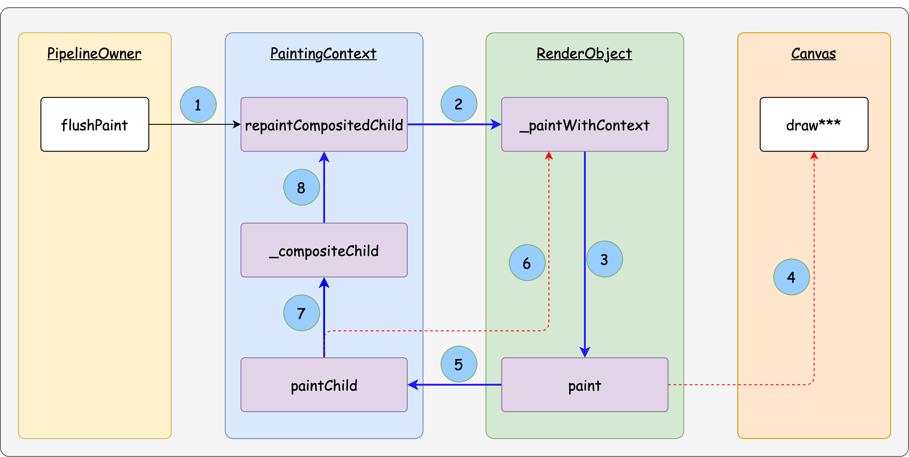

# Flutter框架层原理

[TOC]

Flutter 整体分为三层：Framework (dart)、Engine (C/C++)、Embedder (Platform)


## Widget

Flutter 中万物皆为Widget。**Widget 的功能就是描述一个UI元素的配置信息**：

- 描述 UI 的层级结构 (通过`Widget`嵌套)；

- 定制 UI 的具体样式 (如：`font`、`color`等)；

- 指导 UI 的布局过程 (如：`padding`、`center`等)；

  


既然 Widget 只是描述一个UI元素的配置信息，那么真正的布局、绘制是由谁来完成的呢？Flutter 框架的处理流程是这样的：

1. 根据 Widget 树生成一个 Element 树，Element 树中的节点都继承自 `Element` 类。
2. 根据 Element 树生成 Render 树（渲染树），渲染树中的节点都继承自`RenderObject` 类。
3. 根据渲染树生成 Layer 树，然后上屏显示，Layer 树中的节点都继承自 `Layer` 类。

真正的布局和渲染逻辑在 Render 树中，Element 是 Widget 和 RenderObject 之间的桥梁。


如下图所示，按照功能划分`Widget`大致可以分为 3 类：

- **「Component Widget」** —— 组合类 Widget，这类 Widget 都直接或间接继承于`StatelessWidget`或`StatefulWidget`。这就体现了组合大于继承的原则
- **「Proxy Widget」** —— 代理类 Widget，「Proxy Widget」本身并不涉及 Widget 内部逻辑，只是为「Child Widget」提供一些附加的中间功能。典型的如：`InheritedWidget`用于在「Descendant Widgets」间传递共享信息
- **「Render Widget」** —— 渲染类 Widget，是最核心的`Widget`类型，会直接参与后面的「Layout」、「Paint」流程。


## StatelessWidget

`StatelessWidget`相对比较简单，它继承自`widget`类，覆写了`createElement()`方法：

~~~dart
class MyCustomWidget extends StatelessWidget {
    @override
	StatelessElement createElement() => StatelessElement(this);
    
    @override
    Widgtet build(BuildContext context) {
        return Widget();
    }
}
~~~


>当「Parent Widget」或 依赖的「Inherited Widget」频繁变化时，`build`方法也会频繁被调用。因此，提升`build`方法的性能就显得十分重要，Flutter 官方给出了几点建议：
>
>- 减少不必要的中间节点，即减少 UI 的层级，例如通过 「CustomPaint」自定义
>- 尽可能使用`const` Widget
>- 尽量减小 rebuilt 范围，如：某个 Widget 因使用了「Inherited Widget」，导致频繁 rebuilt，可以将真正依赖「Inherited Widget」的部分提取出来，封装成更小的独立 Widget，并尽量将该独立 Widget 推向树的叶子节点，以便减小 rebuilt 时受影响的范围。
>- 必要时，可以将「Stateless Widget」重构成「Stateful Widget」，以便可以使用「Stateful Widget」中一些特定的优化手法


## StatefulWidget

有状态-组合型 Widget，但要注意的是`StatefulWidget`本身还是不可变的，其可变状态存在于`State`中。

下面我们看看`StatefulWidget`的类定义：

~~~dart
abstract class StatefulWidget extends Widget {
  const StatefulWidget({ Key key }) : super(key: key);
    
  @override
  StatefulElement createElement() => StatefulElement(this);
    
  @protected
  State createState();
}
~~~

- `createState()` 用于创建和 StatefulWidget 相关的状态，它在StatefulWidget 的生命周期中可能会被多次调用。例如，当一个 StatefulWidget 同时插入到 widget 树的多个位置时，Flutter 框架就会调用该方法为每一个位置生成一个独立的State实例，其实，本质上就是一个`StatefulElement`对应一个State实例。这里多次插入的意思是：

  ~~~dart
  class CustomWidget extends StatelessWidget  {
    @override
    Widget build(BuildContext context) {
      StatefulWidget statefulWidget = new StatefulWidet();
        
      return Column(
      	children: [
              statefulWidget,			//多次插入，每一处插入都对应一个新的State实例
              statefulWidget,
              statefulWidget,
          ]
      )
    }
  }
  ~~~


### State

State 用于处理「Stateful Widget」的业务逻辑以及可变状态。

State实例有两个重要的属性

- `widget`：指向与该 State 实例的StatefulWidget实例。注意，这种关联并非永久的，因为在应用生命周期中，UI树上的某一个节点的 widget 实例在重新构建时可能会变化，如果 widget 被修改了，Flutter 框架会动态设置State.widget 为新的 widget 实例。

- `context`：指向与该 State 实例关联的Element实例。

  ~~~dart
  Widget build(BuildContext context) {
      this.context;				//这样就避免和参数context发生命名冲突
      return Widget();
  }
  ~~~

  

此外，StatefulWidget中也可以保存状态，但是不推荐。因为多个State共享一个StatefulWidget的话，其中一个State调用setState来更新数据，而其他State却不能主动感知这一点，从而造成数据不一致问题。

~~~dart
class _MyAppState extends State<MyApp> {
  @override
  Widget build(BuildContext context) {
    StatefulWidget widget = CustomWidget();
    return Column(
      children: [widget,widget,widget,],
    );
  }
}

class CustomWidget extends StatefulWidget {
  CustomWidget({super.key});
  int _j = 10;
  @override
  State<CustomWidget> createState() => _CustomWidgetState();
}

class _CustomWidgetState extends State<CustomWidget> {
  int i = 10;
  @override
  Widget build(BuildContext context) {
    return GestureDetector(
      onTap: () {setState(() {i++; widget._j++;});},
      child: Container(
        width : 100, height: 100, color : Colors.red,
        child: Text("$i ${widget._j}"),
      )
    );
  }
}
~~~


 State 有较复杂的生命周期：


State 的生命周期大致可以分为 8 个阶段

- `createState`：在对应的「Stateful Element」被挂载 (mount) 到树上时，通过`StatefulElement.constructor` –> `StatefulWidget.createState`创建 State 实例；

  ~~~dart
  abstract class StatefulWidget extends Widget {
    @override
    StatefulElement createElement() => StatefulElement(this);
      
    @protected
    @factory
    State createState();
    //...
  }
  
  class StatefulElement extends ComponentElement {
    StatefulElement(StatefulWidget widget)
        : _state = widget.createState() {
        //...
    }
  }
  ~~~

  

- `initState`：State对象首次插入到Element Tree时被调用。对于每一个State对象，Flutter 框架只会调用一次该回调函数。

  

  在此函数中不能调用 **BuildContext.dependOnInheritedWidgetOfExactType**。否则会抛出异常

  ~~~dart
  //State
  @override
  void initState() {
    super.initState();
    IconTheme iconTheme = context.dependOnInheritedWidgetOfExactType<IconTheme>();
  }
  ~~~

  解决方案：在didChangeDependencies中调用

  ~~~dart
  //State
  @override
  void didChangeDependencies() {
    super.didChangeDependencies();
    context.dependOnInheritedWidgetOfExactType<IconTheme>();
  }
  ~~~

  

  下面这段代码也会报异常

  ```dart
  
  @override
  void initState() {
    super.initState();
    showDialog(context: context,builder: (context){
      return AlertDialog();
    });
  }
  ```

  解决方案：

  ~~~dart
  @override
  void initState() {
    super.initState();
    //在该帧结束后，调用该回调函数
    WidgetsBinding.instance.addPostFrameCallback((timeStamp) {
      showDialog(context: context,builder: (context){
        return AlertDialog(title: Text('AlertDialog'),);
      });
    });
  }
  ~~~

  

- `didChangeDependencies()`：didChangeDependencies 方法在 initState 之后由 Framework 立即调用。另外，当此 **State** 对象的依赖项更改时被调用，比如其所依赖的 **InheritedWidget** 发生变化时， Framework 会调用此方法通知组件发生变化。典型的场景是当系统语言 Locale 或应用主题改变时，Flutter 框架会通知 widget 调用此回调。

  

  > didChangeDependencies 方法调用后，组件的状态变为 **dirty**，立即调用 build 方法。

- `build()`：它主要是用于构建 widget 子树的，会在如下场景被调用：

  1. 调用 **initState** 方法后。
  2. 调用 **setState** 方法后。
  3. 调用 **didUpdateWidget** 方法后。
  4. 此 **State** 对象的依存关系发生更改后（例如，依赖的 **InheritedWidget** 发生了更改）。
  5. 调用 **deactivate** 之后，然后将 **State** 对象重新插入树的另一个位置。
  
  
  
- `reassemble()`：此回调是专门为了开发调试而提供的，在热重载(hot reload)时会被调用，此回调在Release模式下永远不会被调用。

- `didUpdateWidget ()`：在 widget 重新构建时，Flutter 框架会调用`widget.canUpdate`来检测 widget 树中同一位置的新旧节点，然后决定是否需要更新，如果`widget.canUpdate`返回`true`，则会调用此回调函数。

  > Framework 调用完此方法后，会将组件设置为 **dirty** 状态，然后调用 **build** 方法

- `deactivate()`：当 State 对象从树中被移除时，会调用此回调。

  > 在一些场景下，Flutter 框架会将 State 对象重新插到树中，例如包含此 State 对象的子树在树的一个位置移动到另一个位置时（可以通过GlobalKey 来实现）。

- `dispose()`：如果在帧结束时，State对象仍未重新插入到树中，那么该State对象就会被回收。此时就会调用该函数。通常在此回调函数中释放资源。


> **注意**：在继承`StatefulWidget`重写其方法时，对于包含`@mustCallSuper`标注的父类方法，都要在子类方法中调用父类方法。


### setState

~~~dart
//State
void setState(VoidCallback fn) {
  assert(fn != null);
  assert(() {
    //在`State.dispose`后不能调用`setState` 
    if (_debugLifecycleState == _StateLifecycle.defunct) {
      throw FlutterError.fromParts(<DiagnosticsNode>[...]);
    }
    //在 State 的构造方法中不能调用`setState` 
    if (_debugLifecycleState == _StateLifecycle.created && !mounted) {
      throw FlutterError.fromParts(<DiagnosticsNode>[...]);
    }
    return true;
  }());
  final dynamic result = fn() as dynamic;
  //`setState`方法的回调函数 (`fn`) 不能是异步的 。原因很简单，因为从流程设计上 framework 需要根据回调函数产生的新状态去刷新 UI (第 14 行)；
  assert(() {
    if (result is Future) {
      throw FlutterError.fromParts(<DiagnosticsNode>[...]);
    }
    return true;
  }());
    
  //更新UI
  _element.markNeedsBuild();
}
~~~

setState 调用后：

1. 首先调用当前 element 的` markNeedsBuild `方法，将当前 element标记为 dirty 。

   ~~~dart
   void markNeedsBuild() {
       //...
       _dirty = true;
       owner!.scheduleBuildFor(this);		//owner为BuildOwner类型
   }
   ~~~

2. 接着调用` scheduleBuildFor`，将当前 element 添加到BuildOwner的 dirtyElements 列表。

   ~~~dart
   //
   void scheduleBuildFor(Element element) {
       //..
       if (!_scheduledFlushDirtyElements && onBuildScheduled != null) {
         _scheduledFlushDirtyElements = true;
         onBuildScheduled!();				//BuildOwner中的方法
       }
       _dirtyElements.add(element);
       element._inDirtyList = true;
   }
   ~~~

3. `onBuildScheduled`之后的调用链如下 `onBuildScheduled` -> `ensureVisualUpdate` -> `window.scheduleFrame` ->  `window.onDrawFrame`  -> `drawFrame`。当我们调用 `window.scheduleFrame()` 方法之后，Flutter引擎会在合适的时机（可以认为是在屏幕下一次刷新之前，具体取决于Flutter引擎的实现）来调用`onBeginFrame`和`onDrawFrame`。


## 启动流程与事件循环

Flutter的入口在"lib/main.dart"的`main()`函数中：

~~~dart
void main() => runApp(MyApp());
~~~

`runApp()`方法如下：

~~~dart
void runApp(Widget app) {
  WidgetsFlutterBinding.ensureInitialized()
    ..attachRootWidget(app)
    ..scheduleWarmUpFrame();
}
~~~

参数`app`是一个 widget，它是 Flutter 应用启动后要展示的第一个组件。而`WidgetsFlutterBinding`正是绑定widget 框架和Flutter 引擎的桥梁。定义如下：

~~~dart
class WidgetsFlutterBinding extends BindingBase with GestureBinding, ServicesBinding, SchedulerBinding, PaintingBinding, SemanticsBinding, RendererBinding, WidgetsBinding {}
~~~

可以看到`WidgetsFlutterBinding`继承自`BindingBase` 并混入了很多`Binding`。这些Binding中基本都是监听并处理`Window`对象的一些事件，然后将这些事件按照Framework的模型封装后分发

> Window：The most basic interface to the host operating system's user interface.

我们接着回过头来看runApp。`WidgetsFlutterBinding.ensureInitialized()`负责初始化一个`WidgetsBinding`的全局单例，紧接着会调用`WidgetsBinding`的`attachRootWidget`方法，该方法负责将根Widget添加到`RenderView`上

> `renderView`是一个`RenderObject`，它是渲染树的根，而`renderViewElement`是`renderView`对应的`Element`对象

最后会调用`WidgetsFlutterBinding` 实例的 `scheduleWarmUpFrame()` 方法，该方法的实现在`SchedulerBinding` 中，它被调用后会立即进行一次绘制，在此次绘制结束前，该方法会锁定事件分发，也就是说在本次绘制结束完成之前 Flutter 将不会响应各种事件，这可以保证在绘制过程中不会再触发新的重绘。


一次绘制过程，我们称其为一**帧（frame）**。Flutter UI 框架的 frame 并不是每次屏幕刷新时都会重新绘制，而是会采取一种主动请求 frame 的方式来刷新UI的

1. Flutter 在 `window` 上注册一个 `onBeginFrame`和一个 `onDrawFrame` 回调。而在`onDrawFrame` 回调中会调用 `drawFrame`。
2. 当我们调用 `window.scheduleFrame()` 方法之后，Flutter引擎会在合适的时机来调用`onBeginFrame`和`onDrawFrame`。


Flutter 应用执行过程简单来讲分为 idle 和 frame 两种状态。

当有新的 frame 到来时，就进入了frame状态，具体处理过程就是依次执行四个任务队列：`transientCallbacks`、`midFrameMicrotasks`、`persistentCallbacks`、`postFrameCallbacks`。当四个任务队列执行完毕后当前 frame 结束，然后切换到idle状态。

```
enum SchedulerPhase {
  idle,
  transientCallbacks,
  midFrameMicrotasks,
  persistentCallbacks,
  postFrameCallbacks,
}
```


- `idle`：空闲状态表示页面未发生变化，并不需要重新渲染。微任务、定时器回调或者用户事件回调
- `transientCallbacks`： 执行”临时“的回调任务，动画回调会在该阶段执行。
- `midFrameMicrotasks`：在执行临时任务时可能会产生一些新的微任务，比如在执行第一个临时任务时创建了一个Future，且这个 Future 在所有临时任务执行完毕前就已经 resolve 了，这中情况Future 的回调将在[midFrameMicrotasks]阶段执行
- `persistentCallbacks`：渲染管线
- `postFrameCallbacks`：执行一些清理工作

drawFrame方法在persistentCallbacks阶段执行

```
void drawFrame() {
  buildOwner!.buildScope(renderViewElement!); 	// 1.重新构建widget树
  //下面是 展开 super.drawFrame() 方法
  pipelineOwner.flushLayout(); 					// 2.更新布局
  pipelineOwner.flushCompositingBits(); 		// 3.更新“层合成”信息
  pipelineOwner.flushPaint(); 					// 4.重绘
  if (sendFramesToEngine) {
    renderView.compositeFrame(); 				// 5.上屏，会将绘制出的bit数据发送给GPU
    ...
  }
}
```

1. 重新构建widget树

   ~~~dart
   void buildScope(Element context, [ VoidCallback callback ]) {
     if (callback == null && _dirtyElements.isEmpty)
       return;
   
     try {
       if (callback != null) {
         callback();
       }
   
       _dirtyElements.sort(Element._sort);
       int dirtyCount = _dirtyElements.length;
       int index = 0;
       while (index < dirtyCount) {
         //调用element对象的rebuild方法来更新Widget
         _dirtyElements[index].rebuild();
         index += 1;
       }
     } finally {
       for (Element element in _dirtyElements) {
         element._inDirtyList = false;
       }
       _dirtyElements.clear();
     }
   }
   ~~~

   

2. 更新布局

3. 更新“层合成”信息

4. 重绘

5. 上屏：将绘制的产物显示在屏幕上


## Key

Key有两个主要作用：

- Widget对象的标识
- 引用Widget对象、Element对象、State对象


设globalKey为一个GlobalKey类型的对象，那么：

- globalKey.currentWidget：获得该 widget 对象
- globalKey.currentElement：来获得 widget 对应的element对象
- globalKey.currentState：来获得 element 对应的state对象


## Context

通过源码我们发现Element实现了BuildContext接口。

~~~dart
abstract class Element extends DiagnosticableTree implements BuildContext
~~~

事实上，context就是指向某个widget对应的element实例！


`context`对象有一个`findAncestorStateOfType()`方法，该方法可以从当前节点沿着 widget 树向上查找指定类型的 StatefulWidget 对应的 State 对象。

~~~dart
ScaffoldState _state = context.findAncestorStateOfType<ScaffoldState>()!;
~~~

一般来说不应该直接获取StatefulWidget的状态实例，因为这些状态是私有的，不应该向外部暴露的。

在 Flutter 开发中便有了一个默认的约定：如果 StatefulWidget 的状态是希望暴露出的，应当在 StatefulWidget 中提供一个`of` 静态方法来获取其 State 对象，开发者便可直接通过该方法来获取；如果 State不希望暴露，则不提供`of`方法。

~~~dart
ScaffoldState _state = Scaffold.of(context);
~~~


## ProxyWidget

### ParentDataWidget

`ParentDataWidget`作为 Proxy 型 Widget，其功能主要是为其他 Widget 提供`ParentData`信息。

> ParentData的详细信息会在介绍 RenderObject 时介绍。


下面这段代码来自`RenderObjectElement`

~~~dart
void attachRenderObject(dynamic newSlot) {
  assert(_ancestorRenderObjectElement == null);
  _slot = newSlot;
  _ancestorRenderObjectElement = _findAncestorRenderObjectElement();
  _ancestorRenderObjectElement?.insertChildRenderObject(renderObject, newSlot);
  final ParentDataElement<RenderObjectWidget> parentDataElement = _findAncestorParentDataElement();			//向上开始找ParentDataElement
  if (parentDataElement != null)		 //如果找到就用其 Widget(ParentDataWidget) 中的 parentData 信息去设置 Render Obejct
    _updateParentData(parentDataElement.widget);
}

ParentDataElement<RenderObjectWidget> _findAncestorParentDataElement() {
  Element ancestor = _parent;
  while (ancestor != null && ancestor is! RenderObjectElement) {	//在查找过程中如查到RenderObjectElement，说明当前 RenderObject 没有 Parent Data 信息。
    if (ancestor is ParentDataElement<RenderObjectWidget>)
      return ancestor;
    ancestor = ancestor._parent;
  }
  return null;
}

void _updateParentData(ParentDataWidget<RenderObjectWidget> parentData) {
  parentData.applyParentData(renderObject);			//ParentDataWidget需要重写applyParentData方法，以便设置对应RenderObject的parentData属性。
}
~~~

来看个例子，`Positioned`组件(继承自ParentDataWidget)：

~~~dart
void applyParentData(RenderObject renderObject) {
  assert(renderObject.parentData is StackParentData);
  final StackParentData parentData = renderObject.parentData;
  bool needsLayout = false;

    //Positioned在必要时将自己的属性赋值给了对应的RenderObject.parentData (此处是StackParentData)
  if (parentData.left != left) {
    parentData.left = left;
    needsLayout = true;
  }
  ...
  if (parentData.width != width) {
    parentData.width = width;
    needsLayout = true;
  }
  ...
  if (needsLayout) {
    final AbstractNode targetParent = renderObject.parent;
    if (targetParent is RenderObject)
      //重新布局
      targetParent.markNeedsLayout();
  }
}
~~~


### InheritedWidget

**InheritedWidget（继承式组件）**提供了一种在 widget 树中从上到下共享数据的方式。国际化、Theme组件等都是通过它来实现。

InheritedWidget的思想就是状态提升，相比较原生的状态提升方案，InheritedWidget实现了跨级传递数据，而不是逐级传递数据。


通过`BuildContext.dependOnInheritedWidgetOfExactType`可以获取最近的「Inherited Widget」。通过这种方式获取「Inherited Widget」时，当「Inherited Widget」状态有变化时，就会重新build引用方。

下面给出一个例子：

~~~dart
class ShareDataWidget extends InheritedWidget {
  ShareDataWidget({
    Key? key,
    required this.data,
    required Widget child,
  }) : super(key: key, child: child);

  final int data; //需要在子树中共享的数据

  //定义一个便捷方法，方便子树中的widget获取共享数据
  static ShareDataWidget? of(BuildContext context) {
      
  //从这里就向InheritedWidget注册了需要依赖的子组件，同时返回该组件对象。这样子组件可以读取InheritedWidget中的数据了
    return context.dependOnInheritedWidgetOfExactType<ShareDataWidget>();
  }

  
  //当该IngeritedWidget重新build时，是否通知子树中依赖该data的Widget重新build，以及调用该widget的didChangeDependencies方法
  @override
  bool updateShouldNotify(ShareDataWidget old) {
    return old.data != data;
  }
}
~~~

~~~dart
class _TestWidget extends StatefulWidget {
  @override
  __TestWidgetState createState() => __TestWidgetState();
}

class __TestWidgetState extends State<_TestWidget> {
  @override
  Widget build(BuildContext context) {
    //使用InheritedWidget中的共享数据
    return Text(ShareDataWidget.of(context)!.data.toString());
  }
}
~~~

注册的子组件还可以覆写didChangeDependencies方法，来监听InheritedWidget的通知

~~~dart
class __TestWidgetState extends State<_TestWidget> {
  @override
  void didChangeDependencies() {
    super.didChangeDependencies();
     //父或祖先widget中的InheritedWidget改变(updateShouldNotify返回true)时会被调用。
    //如果build中没有依赖InheritedWidget，则此回调不会被调用。
    print("Dependencies change");
  }
}
~~~

如果我们只想在`__TestWidgetState`中引用`ShareDataWidget`数据，但却不希望在`ShareDataWidget`发生变化时调用`__TestWidgetState`的`didChangeDependencies()`方法应该怎么办？

其实答案很简单，把`context.dependOnInheritedWidgetOfExactType()`方法换成`context.getElementForInheritedWidgetOfExactType<ShareDataWidget>().widget`即可。因为调用`dependOnInheritedWidgetOfExactType()` 和 `getElementForInheritedWidgetOfExactType()`的区别就是前者会注册依赖关系，而后者不会。


在 Element 基类中有这样两个成员：

~~~dart
PersistentHashMap<Type, InheritedElement>? _inheritedElements;
Set<InheritedElement>? _dependencies;
~~~

-  `_inheritedWidgets`——用于保存从「Element Tree」根节点到当前节点路径上所有的「Inherited Elements」

   前文提到过在`mount`方法结束处会调用`_updateInheritance`：
   以下是 Element 基类的实现，可以看到子节点直接获得父节点的`_inheritedWidgets`：

   ~~~dart
   void _updateInheritance() {
     _inheritedWidgets = _parent?._inheritedWidgets;
   }
   ~~~

   以下是`InheritedElement`类的实现，其在父节点的基础上将自己加入到`_inheritedWidgets`中，以便其子孙节点的`_inheritedWidgets`包含它 (第 8 行)：

   ~~~dart
   void _updateInheritance() {
     final Map<Type, InheritedElement> incomingWidgets = _parent?._inheritedWidgets;
     if (incomingWidgets != null)
       _inheritedWidgets = HashMap<Type, InheritedElement>.from(incomingWidgets);
     else
       _inheritedWidgets = HashMap<Type, InheritedElement>();
   
     _inheritedWidgets[widget.runtimeType] = this;
   }
   ~~~

- `_dependencies` —— 用于记录当前节点依赖了哪些「Inherited Elements」。


最终，在「Inherited Element」发生变化，需要通知依赖者时，会读取依赖者的`_dependencies`

~~~dart
//InheritedElement

final Map<Element, Object?> _dependents = HashMap<Element, Object?>();

void notifyClients(InheritedWidget oldWidget) {
  for (Element dependent in _dependents.keys) {
    // check that it really depends on us
    assert(dependent._dependencies.contains(this));
    notifyDependent(oldWidget, dependent);
  }
}

@protected
void notifyDependent(covariant InheritedWidget oldWidget, Element dependent) {
	dependent.didChangeDependencies();
}

@mustCallSuper
void didChangeDependencies() {
    assert(_lifecycleState == _ElementLifecycle.active); // otherwise markNeedsBuild is a no-op
    assert(_debugCheckOwnerBuildTargetExists('didChangeDependencies'));
    markNeedsBuild();
}
~~~


## RenderObjectWidget

真正与渲染相关的 Widget，属于最核心的类型，一切其他类型的 Widget 要渲染到屏幕上，最终都要回归到该类型的 Widget 上。


| Widget                        | 说明             | 用途                                                         |
| ----------------------------- | ---------------- | ------------------------------------------------------------ |
| LeafRenderObjectWidget        | 非容器类组件基类 | Widget树的叶子节点，用于没有子节点的widget，通常基础组件都属于这一类，如Image。 |
| SingleChildRenderObjectWidget | 单子组件基类     | 包含一个子Widget，如：ConstrainedBox、DecoratedBox等         |
| MultiChildRenderObjectWidget  | 多子组件基类     | 包含多个子Widget，一般都有一个children参数，接受一个Widget数组。如Row、Column、Stack等 |


## BuildOwner

BuildOwner 主要是用于保存那些需要 rebuild 的「Dirty Elements」以及处于 Inactive 状态的 Elements。


`BuildOwner`两个关键成员变量：

~~~dart
final _InactiveElements _inactiveElements = _InactiveElements();
final List<Element> _dirtyElements = <Element>[];
~~~

其命名已清晰表达了他们的用途：分别用于保存「Inactive Elements」、「Dirty Elements」。

> 所谓「Inactive Element」，是指 element 从「Element Tree」上被移除到 dispose 或被重新插入「Element Tree」间的一个中间状态。
>


整棵「Element Tree」共享同一个`BuildOwner`实例 (全局的)，在 Element 挂载过程中由 parent 传递给 child element：

~~~dart
@mustCallSuper
void mount(Element parent, dynamic newSlot) {
  _parent = parent;
  _slot = newSlot;
  _depth = _parent != null ? _parent.depth + 1 : 1;
  _active = true;
  if (parent != null) 
    _owner = parent.owner;			//从这里设置的
}
~~~

`BuildOwner`实例由`WidgetsBinding`负责创建，并赋值给「Element Tree」的根节点`RenderObjectToWidgetElement`，此后随着「Element Tree」的创建逐级传递给子节点。


## Elements

Element 有 2 个主要职责：

- 根据 UI配置信息 (「Widget Tree」) 的变化来维护「Element Tree」，包括：节点的插入、更新、删除、移动等；
- Widget 与 RenderObject 间的桥梁。


如图所示，Element 根据特点可以分为 2 类：

- **「Component Element」** —— 组合型 Element，「Component Widget」、「Proxy Widget」对应的 Element 都属于这一类型
- **「Renderer Element」** —— 渲染型 Element，对应「Renderer Widget」，其不同的子类型包含的子节点个数也不一样，如：LeafRenderObjectElement 没有子节点，RootRenderObjectElement、SingleChildRenderObjectElement 有一个子节点，MultiChildRenderObjectElement 有多个子节点。


 Element 与其他几个核心元素间的关系：


- Element 通过 parent、child 指针形成「Element Tree」；

- Element 持有 Widget、「Render Object」；

- State 是绑定在 Element 上的，而不是绑在「Stateful Widget」上(这点很重要)。

  > 上述这些关系并不是所有类型的 Element 都有，如：「Render Object」只有「RenderObject Element」才有，State 只有「Stateful Element」才有。


### 生命周期


- parent 通过`Element.inflateWidget`->`Widget.createElement`创建 child element

- parent 通过`Element.mount`将新创建的 child 插入到「Element Tree」中指定的插槽处 (slot)。插入后，child element 处于 active 状态。

- 当UI 结构变化时（Widget Tree发生变化），若

  - 新老 Widget.[key && runtimeType] 相等（调用`Widget.canUpdate`返回`true`）：此时 parent 会调用`Element.update`去更新子节点。此方法会递归执行，直到叶子节点。

  - 新老 Widget.[key || runtimeType] 不相等：此时parent 将调用`deactivateChild`方法，之后element 处于 “inactive” 状态。该方法主要做了 3 件事：

    - 从「Element Tree」中移除该 element (将 parent 置为 null)；
    - 将相应的「render object」从「render tree」上移除；
    - 将 element 添加到`owner._inactiveElements`中。在添加过程中会对以该 element 为根节点子树上的所有节点调用`deactivate`方法 (移除的是整棵子树)。

    ~~~dart
    void deactivateChild(Element child) {
      child._parent = null;
      child.detachRenderObject();
      owner._inactiveElements.add(child); // this eventually calls child.deactivate()
    }
    ~~~

- 在当前帧动画结束之前，处于inactive状态的element可以重新插入到element tree中。若结束时，仍未插入到element tree，那么就会被回收掉。


### 核心方法

这些核心方法搭建了Widget与RenderObject之间的桥梁，

- 例如updateChild和inflateWidget方法可以将Widget对象转换为Element对象。
- 这些核心方法又会调用updateRenderObject等方法，会将Element对象转换为Render Object对象。


#### updateChild

`updateChild`是 flutter framework 中的核心方法之一：**父节点通过该方法来修改子节点对应的 Widget**。

~~~dart
// 1. newWidget为null，那么删除相应的element
// 2. 如果child为null，那么根据newWidget来创建element
// 3. 如果child不为null
//		3.1 widget无更新
//		3.2 widget已更新，创建新的Element

Element updateChild(Element child, Widget newWidget, dynamic newSlot) {
  //说明子节点对应的 Widget 已被移除
  if (newWidget == null) {
    //删除对应的element
    if (child != null)
      deactivateChild(child);
    return null;
  }

  
  if (child != null) {
    //明 child.widget 前后没有变化
    if (child.widget == newWidget) {
        
      //若 child.slot != newSlot 表明子节点在兄弟结点间移动了位置，通过updateSlotForChild修改 child.slot 即可；
      if (child.slot != newSlot)
        updateSlotForChild(child, newSlot);
      return child;
    }
	
    //新旧Widget无更新
    if (Widget.canUpdate(child.widget, newWidget)) { 
      if (child.slot != newSlot)
        updateSlotForChild(child, newSlot);
      
      child.update(newWidget);
      assert(child.widget == newWidget);

      return child;
    }
	
    //此时新旧Widget不同，则先将 child element 移除，并通过newWidget创建新的element子节点。
    deactivateChild(child);
    assert(child._parent == null);
  }

  //然后创建新的Element subTree
  return inflateWidget(newWidget, newSlot);
}
~~~


#### update

在updateChild的更新流程中，若新老 Widget.[runtimeType && key] 相等，则会调用到该方法。子类需要重写该方法以处理具体的更新逻辑：

- Element基类：

  ~~~dart
  @mustCallSuper
  void update(covariant Widget newWidget) {
    _widget = newWidget;
  }
  //基类中的update很简单，只是更新element的_widget属性。
  ~~~

- StatelessElement

  ~~~dart
  void update(StatelessWidget newWidget) {
    super.update(newWidget);
    _dirty = true;
    rebuild();
  }
  ~~~

- StatefulElement

  ~~~dart
  void update(StatefulWidget newWidget) {
    super.update(newWidget);
    final StatefulWidget oldWidget = _state._widget;
    _dirty = true;
    _state._widget = widget;		//修改 State 的 _widget属性；		
    try {
      _state.didUpdateWidget(oldWidget) as dynamic;		//调用State.didUpdateWidget
    }
    finally {
    }
    rebuild();
  }
  ~~~

- ProxyElement
  
  ~~~dart
  void update(ProxyWidget newWidget) {
    final ProxyWidget oldWidget = widget;
    super.update(newWidget);
    updated(oldWidget);
    _dirty = true;
    rebuild();
  }
  
  void updated(covariant ProxyWidget oldWidget) {
    //InheritedElement会触发所有依赖者 rebuild 
    notifyClients(oldWidget);
  }
  
  Widget build() => widget.child;
  ~~~
  
- RenderObjectElement
  
  ~~~dart
  void update(covariant RenderObjectWidget newWidget) {
    super.update(newWidget);
    widget.updateRenderObject(this, renderObject);
    _dirty = false;
  }
  ~~~
  
- SingleChildRenderObjectElement
  
  ~~~dart
  void update(SingleChildRenderObjectWidget newWidget) {
    super.update(newWidget);
    _child = updateChild(_child, widget.child, null);
  }
  ~~~
  
- MultiChildRenderObjectElement
  
  ~~~dart
  void update(MultiChildRenderObjectWidget newWidget) {
    super.update(newWidget);
    _children = updateChildren(_children, widget.children, forgottenChildren: _forgottenChildren);
  }
  ~~~
  

####  inflateWidget

该方法的主要职责：通过 Widget 创建对应的 Element，并将其挂载 (mount) 到「Element Tree」上。

~~~dart
Element inflateWidget(Widget newWidget, dynamic newSlot) {
  final Key key = newWidget.key;
  if (key is GlobalKey) {
    final Element newChild = _retakeInactiveElement(key, newWidget);
    if (newChild != null) {
      newChild._activateWithParent(this, newSlot);
      final Element updatedChild = updateChild(newChild, newWidget, newSlot);
      return updatedChild;
    }
  }

  final Element newChild = newWidget.createElement();
  newChild.mount(this, newSlot);
  return newChild;
}
~~~

> 如果 Widget 带有 GlobalKey，首先在 Inactive Elements 列表中查找是否有处于 inactive 状态的节点 (即刚从树上移除)，如找到就直接复活该节点。

主要调用路径来自上面介绍的`updateChild`方法。

  #### mount

当 Element 第一次被插入「Element Tree」上时，调用该方法。

- Element

  ~~~dart
  @mustCallSuper
  void mount(Element parent, dynamic newSlot) {
    _parent = parent;
    _slot = newSlot;
    _depth = _parent != null ? _parent.depth + 1 : 1;
    _active = true;
    if (parent != null) // Only assign ownership if the parent is non-null
      _owner = parent.owner;
  
    if (widget.key is GlobalKey) {
      final GlobalKey key = widget.key;
      key._register(this);
    }
  
    _updateInheritance();
  }
  ~~~

- ComponentElement

  ```dart
  void mount(Element parent, dynamic newSlot) {
    super.mount(parent, newSlot);
    _firstBuild();
  }
  
  void _firstBuild() {
    rebuild();
  }
  ```

- RenderObjectElement

  ~~~dart
  void mount(Element parent, dynamic newSlot) {
    super.mount(parent, newSlot);
    //创建了RenderObject
    _renderObject = widget.createRenderObject(this);
    attachRenderObject(newSlot);
    _dirty = false;
  }
  ~~~

- SingleChildRenderObjectElement

  ~~~dart
  @override
  void mount(Element parent, dynamic newSlot) {
    super.mount(parent, newSlot);
    _child = updateChild(_child, widget.child, null);
  }
  ~~~

- MultiChildRenderObjectElement

  ~~~dart
  void mount(Element parent, dynamic newSlot) {
    super.mount(parent, newSlot);
    _children = List<Element>(widget.children.length);
    Element previousChild;
    for (int i = 0; i < _children.length; i += 1) {
      final Element newChild = inflateWidget(widget.children[i], previousChild);
      _children[i] = newChild;
      previousChild = newChild;
    }
  }
  ~~~

  


#### markNeedsBuild

~~~dart

void markNeedsBuild() {
  //...
  if (!_active)
    return;

  if (dirty)
    return;

  _dirty = true;
  owner.scheduleBuildFor(this);		//这里就会请求新的帧
}
~~~


  #### rebuild

该方法逻辑非常简单，对于活跃的、脏节点调用`performRebuild`，在 3 种场景下被调用：

- 对于 dirty element，在新一帧绘制过程中由`BuildOwner.buildScope`；
- 在 element 挂载时，由`Element.mount`调用；
- 在`update`方法内被调用。（复用Widget的情况）

> 上述第 2、3 点仅「Component Element」需要

~~~dart
void rebuild() {
  //...
  if (!_active || !_dirty)
    return;

  performRebuild();
}
~~~

#### performRebuild

- ComponentElement

  ~~~dart
  void performRebuild() {
     //...
    Widget built;
    built = build();
    _child = updateChild(_child, built, slot);		//_child是ComponentElement的成员变量
  }
  ~~~

  

  对于组合型 Element，rebuild 过程其实就是调用`build`方法生成「child widget」，再由其更新「child element」。

  > StatelessElement.build: `Widget build() => widget.build(this);`
  > StatefulElement.build: `Widget build() => state.build(this);`
  > ProxyElement.build: `Widget build() => widget.child;`

- RenderObjectElement

  ~~~dart
  void performRebuild() {
     //...
    widget.updateRenderObject(this, renderObject);
    _dirty = false;
  }
  ~~~


### 总结

被创建


被更新


被销毁


## RenderObject

RenderObject 在整个 Flutter Framework 中属于核心对象，其职责概括起来主要有三点：『 Layout 』、『 Paint 』、『 Hit Testing 』。


它的继承体系如下：


### 创建

当 RenderObjectElement 被挂载(mount) 到『 Element Tree 』上时，会创建对应的 Render Object 。 同时，会将其 attach 到『 RenderObject Tree 』上

~~~dart
// RenderObjectElement  
@override
  void mount(Element? parent, Object? newSlot) {
    super.mount(parent, newSlot);
    _renderObject = (widget as RenderObjectWidget).createRenderObject(this);
    attachRenderObject(newSlot);
    super.performRebuild(); // clears the "dirty" flag
  }
~~~

### 布局

当 RenderObject 需要(重新)布局时调用`markNeedsLayout`方法，从而被`PipelineOwner`收集，并在下一帧刷新时触发 Layout 操作。markNeedsLayout的调用场景：

- Render Object 被添加到『 RenderObject Tree 』;
- adopt、drop、move『 RenderObject Tree 』中的子节点 ；
- Render Object 自身与布局相关的属性发生变化

```
void markNeedsLayout() {
   _needsLayout = true;
  if (_relayoutBoundary != this) { // 如果不是布局边界节点
    markParentNeedsLayout(); // 递归调用前节点到其布局边界节点路径上所有节点的方法 markNeedsLayout
  } else {// 如果是布局边界节点 
    if (owner != null) {
      // 将布局边界节点加入到 pipelineOwner._nodesNeedingLayout 列表中
      owner!._nodesNeedingLayout.add(this); 
      owner!.requestVisualUpdate();//该函数最终会请求新的 frame
    }
  }
}
```

从上述代码可以看到：若当前 Render Object 不是 Relayout Boundary，则 layout 请求向上传播给父节点，直到遇到 Relayout Boundary。


通过 PipelineOwner 收集所有 layout dirty 节点，并在下一帧刷新时批量处理，即在drwaFrame方法中调用`pipelineOwner.flushLayout()`：

~~~dart
void flushLayout() {
    if (!kReleaseMode) {
      Map<String, String>? debugTimelineArguments;
      FlutterTimeline.startSync(
        'LAYOUT',
        arguments: debugTimelineArguments,
      );
    }
    try {
      while (_nodesNeedingLayout.isNotEmpty) {
        final List<RenderObject> dirtyNodes = _nodesNeedingLayout;
        _nodesNeedingLayout = <RenderObject>[];
        dirtyNodes.sort((RenderObject a, RenderObject b) => a.depth - b.depth);
        for (int i = 0; i < dirtyNodes.length; i++) {
          if (_shouldMergeDirtyNodes) {
            _shouldMergeDirtyNodes = false;
            if (_nodesNeedingLayout.isNotEmpty) {
              _nodesNeedingLayout.addAll(dirtyNodes.getRange(i, dirtyNodes.length));
              break;
            }
          }
          final RenderObject node = dirtyNodes[i];
          if (node._needsLayout && node.owner == this) {
            node._layoutWithoutResize();					//这个方法会调用performLayout
          }
        }
        _shouldMergeDirtyNodes = false;
      }
      for (final PipelineOwner child in _children) {
        child.flushLayout();
      }
    } finally {
      _shouldMergeDirtyNodes = false;
      if (!kReleaseMode) {
        FlutterTimeline.finishSync();
      }
    }
~~~

在`_layoutWithoutResize()`方法中会调用`performLayout()`：

~~~dart
  void _layoutWithoutResize() {
    RenderObject? debugPreviousActiveLayout;
    try {
      performLayout();					//调用performLayout
      markNeedsSemanticsUpdate();
    } catch (e, stack) {
      _reportException('performLayout', e, stack);
    }
    _needsLayout = false;
    markNeedsPaint();
  }
~~~

而在`performLayout()`中会调用**子节点**的`layout`方法：

~~~dart
oid layout(Constraints constraints, { bool parentUsesSize = false }) {
  RenderObject? relayoutBoundary;
  // 先确定当前组件的布局边界
  if (!parentUsesSize || sizedByParent || constraints.isTight || parent is! RenderObject) {
    relayoutBoundary = this;
  } else {
    relayoutBoundary = (parent! as RenderObject)._relayoutBoundary;
  }
  // _needsLayout 表示当前组件是否被标记为需要布局
  // _constraints 是上次布局时父组件传递给当前组件的约束
  // _relayoutBoundary 为上次布局时当前组件的布局边界
  // 所以，当当前组件没有被标记为需要重新布局，且父组件传递的约束没有发生变化，
  // 且布局边界也没有发生变化时则不需要重新布局，直接返回即可。
  if (!_needsLayout && constraints == _constraints && relayoutBoundary == _relayoutBoundary) {
    return;
  }
  // 如果需要布局，缓存约束和布局边界
  _constraints = constraints;
  _relayoutBoundary = relayoutBoundary;

  // 后面解释
  if (sizedByParent) {
    performResize();
  }
  // 执行布局
  performLayout();
  // 布局结束后将 _needsLayout 置为 false
  _needsLayout = false;
  // 将当前组件标记为需要重绘（因为布局发生变化后，需要重新绘制）
  markNeedsPaint();
}
~~~

- `layout`方法是一个模板方法，不应该覆写它。而在layout中又会调用本节点的`performLayout()`。
- 若父节点 layout 依赖子节点的 size，那么父节点在调用`layout`方法时需将`parentUsesSize`参数设为`true`。
- sizedByParent 为 true 时表示：当前组件的大小只取决于父组件传递的约束，而不会依赖后代组件的大小。此时计算当前组件大小的逻辑应抽离到 performResize() 中，并且覆写sizedByParent，让其返回true。这种情况下 performLayout 主要的任务便只有两个：对子组件进行布局和确定子组件在当前组件中的布局起始位置偏移。下面给出一个例子：


Flutter使用了布局边界（relayoutBoundary）的概念来优化布局过程。每个组件的 renderObject 中都有一个 `_relayoutBoundary` 属性指向自身的布局边界节点，如果当前节点布局发生变化后，自身到其布局边界节点路径上的所有的节点都需要 relayout。

若组件自身的大小变化不会影响父组件，那么他就是一个relayoutBoundary，对应的代码实现是：

~~~dart
// parent is! RenderObject 为 true 时则表示当前组件是根组件，因为只有根组件没有父组件。
if (!parentUsesSize || sizedByParent || constraints.isTight || parent is! RenderObject) {
  _relayoutBoundary = this;
} else {
  _relayoutBoundary = (parent! as RenderObject)._relayoutBoundary;
}
~~~


### 绘制

与`markNeedsLayout`相似，当 Render Object 需要重新绘制 (paint dirty) 时通过`markNeedsPaint`方法上报给`PipelineOwner`。

~~~dart
void markNeedsPaint() {
  if (isRepaintBoundary) {
    assert(_layer is OffsetLayer);
    if (owner != null) {
      owner._nodesNeedingPaint.add(this);
      owner.requestVisualUpdate();
    }
  } 
  else if (parent is RenderObject) {
    final RenderObject parent = this.parent;
    parent.markNeedsPaint();
  } 
  else {
    if (owner != null)
      owner.requestVisualUpdate();
  }
}
~~~


在这里我们稍加讨论一下RepaintBoundary概念

Repaint Boundary 有以下特点：

- 每个 Repaint Boundary 都有一个独属于自己的 OffsetLayer (继承自ContainerLayer)，)，其自身及子孙节点的绘制结果都将 attach 到以该 layer 为根节点的子树上；
- 每个 Repaint Boundary 都有一个独属于自己的 PaintingContext (包括背后的 Canvas)，从而使得其绘制与父节点完全隔离开。


Flutter Framework 为开发者预定义了`RepaintBoundary` widget，其继承自`SingleChildRenderObjectWidget`，在有需要时我们可以通过`RepaintBoundary` widget 来添加 Repaint Boundary。




在`drawFrame()`中会调用`PipelineOwner#flushPaint`方法，进而对收集的所有『 paint-dirty Render Obejcts 』进行 re-paint：

~~~dart
void flushPaint() {
    if (!kReleaseMode) {
        Map<String, String>? debugTimelineArguments;
        FlutterTimeline.startSync(
            'PAINT',
            arguments: debugTimelineArguments,
        );
    }
    final List<RenderObject> dirtyNodes = _nodesNeedingPaint;
    _nodesNeedingPaint = <RenderObject>[];

    for (final RenderObject node in dirtyNodes..sort((RenderObject a, RenderObject b) => b.depth - a.depth)) {
    if ((node._needsPaint || node._needsCompositedLayerUpdate) && node.owner == this) {
        if (node._layerHandle.layer!.attached) {
            if (node._needsPaint) {
            	PaintingContext.repaintCompositedChild(node);
            } else {
            	PaintingContext.updateLayerProperties(node);
         	}
        } else {
            node._skippedPaintingOnLayer();
        }
    }
    for (final PipelineOwner child in _children) {
    	child.flushPaint();
    }
}
~~~

`PaintingContext#repaintCompositedChild`是一个非常重要的方法：

- 为没有Layer的『 paint-dirty Render Obejcts 』创建 Layer
- 为 RenderObject 的绘制准备`context`并发起绘制流程：

~~~dart
static void _repaintCompositedChild(
  RenderObject child, {
  bool debugAlsoPaintedParent = false,
  PaintingContext childContext,
}) {
  assert(child.isRepaintBoundary);
  OffsetLayer childLayer = child._layer;
  if (childLayer == null) {
    child._layer = childLayer = OffsetLayer();
  } 
  else {
    assert(childLayer is OffsetLayer);
    childLayer.removeAllChildren();
  }
  
  // 在正常的绘制流程中通过参数传递过来的 childContext 都是 null
  // 因此，此处总是会创建新的 PaintingContext
  //
  childContext ??= PaintingContext(child._layer, child.paintBounds);
  child._paintWithContext(childContext, Offset.zero);

  childContext.stopRecordingIfNeeded();
}
~~~

`RenderObject#_paintWithContext`逻辑比较简单，主要就是调用`paint`方法；

~~~dart
void _paintWithContext(PaintingContext context, Offset offset) {
  if (_needsLayout)
    return;
  _needsPaint = false;
  paint(context, offset);
}
~~~


抽象基类`RenderObject`中的`paint`是个空方法，需要子类重写。`paint`方法主要有2项任务：

- 当前 Render Object 本身的绘制，如：`RenderImage`，其`paint`方法主要职责就是 image 的渲染

  ```
  void paint(PaintingContext context, Offset offset) {
    paintImage(
      canvas: context.canvas,
      rect: offset & size,
      image: _image,
      ...
    );
  }
  ```

- 绘制子节点，如：`RenderTable`，其`paint`方法主要职责是依次对每个子节点调用`PaintingContext#paintChild`方法进行绘制：

  ```
  void paint(PaintingContext context, Offset offset) {
    for (int index = 0; index < _children.length; index += 1) {
      final RenderBox child = _children[index];
      if (child != null) {
        final BoxParentData childParentData = child.parentData;
        context.paintChild(child, childParentData.offset + offset);
      }
    }
  }
  ```


~~~dart
  void paintChild(RenderObject child, Offset offset) {
    if (child.isRepaintBoundary) {
      stopRecordingIfNeeded();
      _compositeChild(child, offset);
    } else if (child._wasRepaintBoundary) {
      child._layerHandle.layer = null;
      child._paintWithContext(this, offset);
    } else {
      child._paintWithContext(this, offset);
    }
  }
~~~

在`_compositeChild`中，通过`repaintCompositedChild`对子节点发起新一轮的绘制，并将绘制结果(`child._layer`)添加到『 Layer Tree 』中：

~~~~dart
void _compositeChild(RenderObject child, Offset offset) {
  repaintCompositedChild(child, debugAlsoPaintedParent: true);
  final OffsetLayer childOffsetLayer = child._layer;
  childOffsetLayer.offset = offset;
  appendLayer(child._layer);
}
~~~~


整个绘制过程其实就是对『 RenderObject Tree 』进行深度遍历的过程；

## 绘制

### 概述

Flutter中和绘制相关的对象有三个，分别是Canvas、Layer 和 Scene：

- Canvas：封装了Flutter Skia各种绘制指令，比如画线、画圆、画矩形等指令。
- Layer：图层
- Scene：屏幕上要要显示的元素


Flutter 绘制流程：

1. 构建一个 Canvas，用于绘制；同时还需要创建一个绘制指令记录器PictureRecorder
2. Canvas 绘制完成后，通过 PictureRecorder 获取绘制产物Picture，然后将其保存在 Layer 中。
3. 构建 Scene 对象，将 layer和 Scene 关联起来。
4. 上屏；调用window.render API 将Scene上的绘制产物发送给GPU。

~~~dart
void main() {
    //1.创建绘制记录器和Canvas
    PictureRecorder recorder = PictureRecorder();
    Canvas canvas = Canvas(recorder);

    //2.在指定位置区域绘制。
    var rect = Rect.fromLTWH(30, 200, 300,300 );
    drawChessboard(canvas,rect); 	//画棋盘
    drawPieces(canvas,rect);		//画棋子

    //3.创建layer，将绘制的产物保存在layer中
    var pictureLayer = PictureLayer(rect);
    //recorder.endRecording()获取绘制产物。
    pictureLayer.picture = recorder.endRecording();
    var rootLayer = OffsetLayer();
    rootLayer.append(pictureLayer);
    
    //4.上屏，将绘制的内容显示在屏幕上。
    final SceneBuilder builder = SceneBuilder();
    final Scene scene = rootLayer.buildScene(builder);
    window.render(scene);
    
}
~~~


### Layer

Layer作为绘制产物的持有者——图层，它可以：

- 在不同的帧之间复用绘制产物
- 划分绘制边界，缩小重绘范围


Layer分为两种类型：

- 容器类：Layer的集合。容器类 Layer 可以添加任意多个子Layer。容器类 Layer 可以对其子 Layer 整体做一些变换效果，比如剪裁效果、过滤效果、矩阵变换、透明变换等。
- 绘制类：直接承载绘制结果的 Layer


两个Layer对象：

- OffsetLayer：根 Layer，继承自ContainerLayer，为容器类。
- PictureLayer：保存绘制产物的 Layer，为绘制类。


### Picture

Picture 实际上是一系列的图形绘制操作指令，Picture 要显示在屏幕上，必然会经过光栅化，随后Flutter会将光栅化后的位图信息缓存起来。

实际上，Picture有一个toImage方法，可以根据指定的大小导出Image：

~~~dart
//将图片导出为Uint8List
final Image image = await pictureLayer.picture.toImage();
final ByteData? byteData = await image.toByteData(format: ImageByteFormat.png);
final Uint8List pngBytes = byteData!.buffer.asUint8List();
print(pngBytes);
~~~


### 绘制流程


- 在 UI Frame 刷新时，通过`RendererBinding#drawFrame`->`PipelineOwner#flushPaint`调用状态为dirty的RenderObject对象的paint方法；

- `RenderObject#paint`调用`PaintingContext.canvas`提供的图形操作接口(`draw*`、`clip*`、`transform`等)完成绘制任务；这些绘制操作被 PictureRecorder 记录下来，在绘制结束时生成 picture，并被添加到 PictureLayer (_currentLayer)上；

- 随后，RenderObject 通过`PaintingContext#paintChild`递归地绘制子节点；在绘制子节点时，根据子节点是否是「Repaint Boundary」而采用不同的策略：

  - 是「Repaint Boundary」— 为子节点生成新的 PaintingContext，从而子节点可以独立进行绘制，绘制结果就是一颗「Layer subTree」，最后将该子树 append 到父节点生成的「Layer Tree」上；

  - 不是「Repaint Boundary」— 子节点直接绘制在当前`PaintingContext.canvas`上

- 整个绘制流程结束时就得到了一棵「Layer Tree」，其后通过 SceneBuilder 生成 Scene，再经`window.render`送入 Engine 层，最终 GPU 对其进行光栅化处理，显示在屏幕上。


### PaintingContext


## 合成 Compositing

Compositing属于 Rendering Pipeline 中的一环，表示是否将某些特定的图形效果应用到新的 Layer 上。

下面我们通过一个例子来说明这个概念，这里我们先定义一个顺时针旋转90°的组件：

~~~dart
void main() =>
    runApp(MaterialApp(home: Scaffold(body: CustomRotatedBoxTest())));

class CustomRotatedBox extends SingleChildRenderObjectWidget {
  CustomRotatedBox({Key? key, Widget? child})
      : super(
          key: key,
          child: child,
        );

  @override
  RenderObject createRenderObject(BuildContext context) {
    return CustomRenderRotatedBox();
  }
}

class CustomRotatedBoxTest extends StatelessWidget {
  const CustomRotatedBoxTest({Key? key}) : super(key: key);

  @override
  Widget build(BuildContext context) {
    return Center(
        child: CustomRotatedBox(child: Text("A", textScaleFactor: 5)));
  }
}

class CustomRenderRotatedBox extends RenderBox
    with RenderObjectWithChildMixin<RenderBox> {
  Matrix4? _paintTransform;

  @override
  void performLayout() {
    _paintTransform = null;
    if (child != null) {
      child!.layout(constraints, parentUsesSize: true);
      size = child!.size;
      //根据子组件大小计算出旋转矩阵
      _paintTransform = Matrix4.identity()
        ..translate(size.width / 2.0, size.height / 2.0)
        ..rotateZ(pi / 2) // 旋转90度
        ..translate(-child!.size.width / 2.0, -child!.size.height / 2.0);
    } else {
      size = constraints.smallest;
    }
  }

  @override
  void paint(PaintingContext context, Offset offset) {
    if (child != null) {
      // 根据偏移，需要调整一下旋转矩阵
      final Matrix4 transform =
          Matrix4.translationValues(offset.dx, offset.dy, 0.0)
            ..multiply(_paintTransform!)
            ..translate(-offset.dx, -offset.dy);
      _paint(context, offset, transform);
    }
  }

  void _paint(PaintingContext context, Offset offset, Matrix4 transform) {
    context.canvas
      ..save()
      ..transform(transform.storage);
    context.paintChild(child!, offset);
    context.canvas.restore();
  }
}
~~~


现在我们给 CustomRotatedBox 添加一个 RepaintBoundary 再试试：

~~~dart
@override
  Widget build(BuildContext context) {
    return Center(
        child: CustomRotatedBox(
            child: RepaintBoundary(
                // 添加一个 RepaintBoundary
                child: Text(
      "A",
      textScaleFactor: 5,
    ))));
~~~

运行后如图：


A怎么又站起来了！原因很简单RepaintBoundary使得父子的 PictureLayer分离了：


如何解决这个问题呢？我们可以在 CustomRotatedBox 中绘制子节点之前：

1. 创建一个TransformLayer（记为 TransformLayer1） 添加到 Layer树中，接着创建一个新的 PaintingContext 和 TransformLayer1绑定。
2. 子节点通过这个新的 PaintingContext 去绘制。

完成上述操作之后，后代节点绘制所在的 PictureLayer 都会是 TransformLayer 的子节点，因此我们可以通过 TransformLayer 对所有子节点整体做变换


这其实就是一个重新 **Layer 合成（layer compositing）** 的过程：创建一个新的 ContainerLayer，然后将该ContainerLayer 传递给子节点，这样后代节点的Layer必然属于ContainerLayer。

实际上，PaintingContext 针对常见的拥有变换功能的容器类Layer的组合都封装好了相应的方法，同时Flutter中已经预定了拥有相应变换功能的组件，下面是一个对应表：

| Layer的名称    | PaintingContext对应的方法 | Widget                |
| -------------- | ------------------------- | --------------------- |
| ClipPathLayer  | pushClipPath              | ClipPath              |
| OpacityLayer   | pushOpacity               | Opacity               |
| ClipRRectLayer | pushClipRRect             | ClipRRect             |
| ClipRectLayer  | pushClipRect              | ClipRect              |
| TransformLayer | pushTransform             | RotatedBox、Transform |

每新建一个 layer 都会有额外的开销。一般来说，如果needsCompositing为false，那么就会调用canvas来绘制变换效果。所以**引入 flushCompositingBits 的根本原因其实是为了减少 layer的数量**。在自定义组件的时候，要尽可能地根据needsCompositing来做优化（使用canvas）


每一个节点（RenderObject中）都有一个`_needsCompositing` 字段，该字段用于缓存当前节点在绘制子节点时是否需要合成 layer。flushCompositingBits 的功能就是在节点树初始化和子树中合成信息发生变化时来重新遍历节点树，更新每一个节点的`_needsCompositing` 值（注：flushCompositingBits 的执行过程只是做标记，并没有进行层的合成，真正的合成是在组件的 paint 方法中时）：

~~~dart
void flushCompositingBits() {
  // 对需要更新合成信息的节点按照节点在节点树中的深度排序
  _nodesNeedingCompositingBitsUpdate.sort((a,b) => a.depth - b.depth);
  for (final RenderObject node in _nodesNeedingCompositingBitsUpdate) {
    if (node._needsCompositingBitsUpdate && node.owner == this)
      node._updateCompositingBits(); //更新合成信息
  }
  _nodesNeedingCompositingBitsUpdate.clear();
}
~~~

RenderObject 的 `_updateCompositingBits` 方法的功能就是递归遍历子树确定如果每一个节点的`_needsCompositing` 值：

~~~dart
void _updateCompositingBits() {
  if (!_needsCompositingBitsUpdate)
    return;
  final bool oldNeedsCompositing = _needsCompositing;
  _needsCompositing = false;
  // 递归遍历查找子树, 如果有孩子节点 needsCompositing 为true，则更新 _needsCompositing 值
  visitChildren((RenderObject child) {
    child._updateCompositingBits(); //递归执行
    if (child.needsCompositing)
      _needsCompositing = true;
  });

  if (isRepaintBoundary || alwaysNeedsCompositing)		//注意这里
    _needsCompositing = true;
  if (oldNeedsCompositing != _needsCompositing)
    markNeedsPaint();
  _needsCompositingBitsUpdate = false;
}
~~~

执行完毕后，每一个节点的`_needsCompositing` 就确定了，我们在绘制时只需要判断一下当前的 `needsCompositing`（一个getter，会直接返回`_needsCompositing` ） 就能知道子树是否存在剥离layer了

那么之前有问题的代码可以修改如下：

~~~dart
class CustomRenderRotatedBox extends RenderBox
    with RenderObjectWithChildMixin<RenderBox> {
  Matrix4? _paintTransform;
  final LayerHandle<TransformLayer> _transformLayer = LayerHandle<TransformLayer>();
    
  @override
  void performLayout() {
	//与之前一样
  }
  
  @override
  void paint(PaintingContext context, Offset offset) {
    if (child != null) {
      _transformLayer.layer = context.pushTransform(
        needsCompositing, // pipelineOwner.flushCompositingBits(); 执行后这个值就能确定
        offset,
        _paintTransform!,
        _paintChild,
        oldLayer: _transformLayer.layer,
      );
    } else {
      _transformLayer.layer = null;
    }
  }

  void _paintChild(PaintingContext context, Offset offset) {
    context.paintChild(child!, offset);
  }
}

~~~


## 自定义组件

下面我们通过一些例子来说明如何自定义组件：

### 单子组件布局示例

我们来实现一个Center组件，首先使用SingleChildRenderObjectWidget来封装RenderObject对象：

~~~dart
class CustomCenter extends SingleChildRenderObjectWidget {
  const CustomCenter({Key? key, required Widget child})
      : super(key: key, child: child);

  @override
  RenderObject createRenderObject(BuildContext context) {
    return RenderCustomCenter();
  }
}
~~~

这里我们继承自RenderShiftedBox，它会帮我们实现布局之外的一些功能（绘制、命中测试）：

~~~dart
class RenderCustomCenter extends RenderShiftedBox {
  RenderCustomCenter({RenderBox? child}) : super(child);

  @override
  void performLayout() {
    //1. 先对子组件进行layout，随后获取它的size
    child!.layout(
      constraints.loosen(), //将约束传递给子节点
      parentUsesSize: true, // 因为我们接下来要使用child的size,所以不能为false
    );
      
    //2.根据子组件的大小确定自身的大小
    size = constraints.constrain(Size(
      constraints.maxWidth == double.infinity
          ? child!.size.width
          : double.infinity,
      constraints.maxHeight == double.infinity
          ? child!.size.height
          : double.infinity,
    ));

    // 3. 根据父节点子节点的大小，算出子节点在父节点中居中之后的偏移，然后将这个偏移保存在子节点的parentData中，在后续的绘制阶段，会用到。
    BoxParentData parentData = child!.parentData as BoxParentData;
    parentData.offset = ((size - child!.size) as Offset) / 2;
  }
}
~~~

我们看一下RenderShiftedBox中默认的 paint 实现：

~~~dart
@override
void paint(PaintingContext context, Offset offset) {
  if (child != null) {
    final BoxParentData childParentData = child!.parentData! as BoxParentData;
    //从child.parentData中取出子节点相对当前节点的偏移，加上当前节点在屏幕中的偏移，
    //便是子节点在屏幕中的偏移。
    context.paintChild(child!, childParentData.offset + offset);
  }
}
~~~


### 多子组件布局示例

这里我们实现一个左右布局的Widget，用MultiChildRenderObjectWidget来封装RenderObject

~~~dart
class LeftRightBox extends MultiChildRenderObjectWidget {
  LeftRightBox({
    Key? key,
    required List<Widget> children,
  })  : assert(children.length == 2, "只能传两个children"),
        super(key: key, children: children);

  @override
  RenderObject createRenderObject(BuildContext context) {
    return RenderLeftRight();
  }
}
~~~

接下来需要实现 RenderLeftRight，在其 performLayout 中我们实现实现左-右布局算法：

~~~dart
class LeftRightParentData extends ContainerBoxParentData<RenderBox> {}

class RenderLeftRight extends RenderBox
    with
        ContainerRenderObjectMixin<RenderBox, LeftRightParentData>,
        RenderBoxContainerDefaultsMixin<RenderBox, LeftRightParentData> {
 
  // 初始化每一个child的parentData        
  @override
  void setupParentData(RenderBox child) {
    if (child.parentData is! LeftRightParentData)
      child.parentData = LeftRightParentData();
  }

  @override
  void performLayout() {
    final BoxConstraints constraints = this.constraints;
    RenderBox leftChild = firstChild!;
    
    LeftRightParentData childParentData =
        leftChild.parentData! as LeftRightParentData;
    
    RenderBox rightChild = childParentData.nextSibling!;

    //我们限制右孩子宽度不超过总宽度一半
    rightChild.layout(
      constraints.copyWith(maxWidth: constraints.maxWidth / 2),
      parentUsesSize: true,
    );

    //调整右子节点的offset
    childParentData = rightChild.parentData! as LeftRightParentData;
    childParentData.offset = Offset(
      constraints.maxWidth - rightChild.size.width,
      0,
    );

    // layout left child
    // 左子节点的offset默认为（0，0），为了确保左子节点始终能显示，我们不修改它的offset
    leftChild.layout(
      //左侧剩余的最大宽度
      constraints.copyWith(
        maxWidth: constraints.maxWidth - rightChild.size.width,
      ),
      parentUsesSize: true,
    );

    //设置LeftRight自身的size
    size = Size(
      constraints.maxWidth,
      max(leftChild.size.height, rightChild.size.height),
    );
  }

  @override
  void paint(PaintingContext context, Offset offset) {
    defaultPaint(context, offset);
  }

  @override
  bool hitTestChildren(BoxHitTestResult result, {required Offset position}) {
    return defaultHitTestChildren(result, position: position);
  }
            
  //RenderBox中命中测试的方法有仨：hitTest、hitTestSelf、hitTestChildren
}
~~~

RenderLeftRight是直接继承自 RenderBox，同时混入ContainerRenderObjectMixin 和 RenderBoxContainerDefaultsMixin 两个 mixin，这两个 mixin 实现了通用的绘制和事件处理相关逻辑


此外，还需要说明一下如何去处理重新绘制同一个RenderObject的逻辑。当UI配置发生改变时，若RenderObjectWIdget的canUpdateWidget方法返回true，那么就会调用widget.updateRenderObject方法，在该方法里我们可以获取到对应的RenderObject以及配置信息。此时我们需要在自定义的RenderObject类中定义一些方法，传入这些配置信息，并在这些方法中调用makeNeedsLayout或者makeNeedsPaint即可（注意，makeNeedsLayout会调用makeNeedsPaint）。之后就会调用paint方法，根据传入的配置信息重新绘制即可，下面给出一个例子：

~~~dart
class ScoreStar extends LeafRenderObjectWidget {
  final Color backgroundColor;
  final Color foregroundColor;
  final double score;

  ScoreStar(this.backgroundColor, this.foregroundColor, this.score);

  @override
  RenderObject createRenderObject(BuildContext context) {
    return RenderScoreStar(backgroundColor, foregroundColor, score);
  }

  @override
  void updateRenderObject(BuildContext context, covariant RenderScoreStar renderObject) {
    renderObject
      ..backgroundColor = backgroundColor
      ..foregroundColor = foregroundColor
      ..score = score;
  }
}

class RenderScoreStar extends RenderBox {
  Color _backgroundColor;

  Color _foregroundColor;

  double _score;
    
  double get score => _score;
  set score(double value) {
    markNeedsPaint();				//向Widget暴露改接口，这样就可以重新绘制RenderObject
  }

  RenderScoreStar(this._backgroundColor, this._foregroundColor, this._score);

  @override
  void performLayout() {}

  @override
  void paint(PaintingContext context, Offset offset) {}

}
~~~

