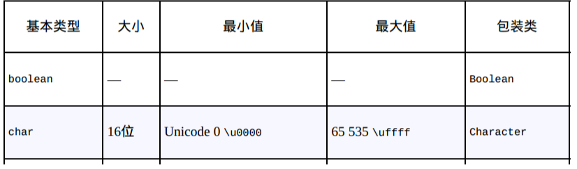

# Java 类型系统

[TOC]

## 类型

### 基本类型

对于**基本类型（primitive type）**，Java会直接在栈上创建。

**自动变量（automatic variable）**或**局部变量（local variable）**指的是在栈上创建的基本类型以及引用类型。

- 所有数值类型都是有符号的

- 并未对boolean类型的空间大小做出规定，而且其对象只能赋值为true或false

### 初始化

必须对栈中的自动变量进行显式初始化工作，否则编译器会抛出一个编译期错误。而对于数组中的元素以及类中的字段，编译器会执行默认初始化：

- 对于基本类型

	

	

- 对于对象，它的默认初始化值为`null`

所以当你操作引用之前，需要确保将其指向了某个对象。如果你试图操作一个值为`null`的引用，系统会返回一个运行时报错

### 数据存储方式

Java中数据存储方式：

- **寄存器（register）**：数据直接保存在中央处理器（CPU）中，因此这是访问速度最快的数据存储方式。然而寄存器的数量是有限的，所以只能按需分配。同时你不能直接控制寄存器的分配，甚至你在程序中都找不到寄存器存在过的证据（ C 和 C++ 是例外，它们允许你向编译器申请分配寄存器）。

- **栈（stack）**：数据存储在**随机存取存储器（random-access memory, RAM）**里，处理器可以通过栈指针（stack pointer）直接操作该数据。具体来说，栈指针向下移动将申请一块新的内存，向上移动则会释放这块内存。只不过 Java 系统在创建应用程序时就必须明确栈上所有对象的生命周期。这种限制约束了程序的灵活性。引用以及基本类型会保存在栈上。

- **堆（heap）**：用于存放所有 Java 对象。与栈不同的是，编译器并不关心位于堆上的对象需要存在多久。因此，堆的使用是非常灵活的。然而这种灵活性是有代价的：分配和清理堆存储要比栈存储花费更多的时间。但你并不需要太过关注此类问题。

- **常量存储（constant storage）**：常量通常会直接保存在程序代码中，因为它们的值不会改变，所以这样做是安全的。常量存储的一个例子就是**字符串常量池**

- **非RAM存储（non-RAM storage）**：这些数据的生命周期独立于应用程序的。其中最典型的例子：

	- **序列化对象（serialized object）**：转换为字节流并可以发送至其他机器的对象。网络
	- **持久化对象（persistent object）**：保存在磁盘上的对象，而这些对象即便在程序结束运行之后也依然能够保持其状态。数据库

### 包装类

Java 还为基本类型提供了对应的**“包装类”（wrapper class）**，通过包装类可以将位于栈上的基本类型转换为位于堆上的对象。

而**自动装箱**（auto boxing）机制能够将基本类型对象自动转换为包装类对象，例如

~~~java
Character ch = '\u0000';
Character ch = new Character('c');
~~~

**自动拆箱**：

~~~java
char c = ch;
~~~

至于使用包装类的原因，后续章节会进行更为细致的讲解。

Java 提供了两个支持高精度计算的类，分别是`BigInteger`和`BigDecimal`。`BigInteger`可以支持任意精度的整数。`BigDecimal`可用于任意精度的定点数（fixed-point number）。但是以速度换取精度。

### 作用域

**作用域**会决定其范围内定义的变量名的可见性和生命周期，下面是一个Java 作用域的例子：

~~~java
{
    int x = 12;
    {
        String s = "scope";
   		x = 12;
    }
    //s此时不可见
}
~~~

虽然引用s会在作用域结束后消失，但是它指向的String对象还会继续占用内存。在适当时候，Java垃圾回收器会清理这个String对象。

类似 C 和 C++ 的**作用域屏蔽规则**在 Java 中是**不被允许**的，因为 Java 的设计者认为这种编程方式会引发歧义。但对于字段名与局部变量名仍遵循作用域屏蔽规则！

## 运算
