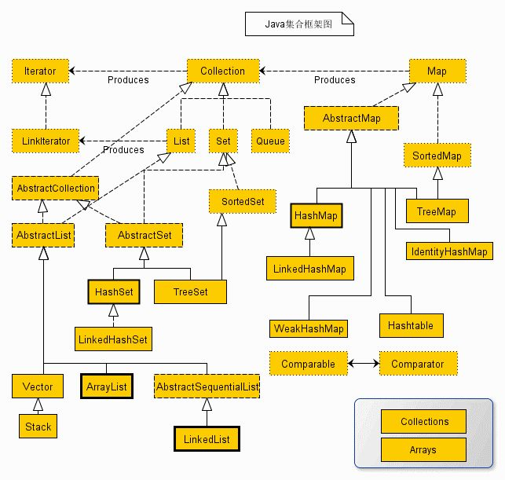

# Java 集合

[TOC]

一般来说，我们的程序总是会根据某些在运行时才能知道的条件来创建新的对象。我们无法提前知道所需对象的数量，甚至不知道它们的确切类型。为解决这个普遍的编程问题，我们必须能够随时随地创建任意数量的对象。

而数组在创建之后大小就固定了，这具有很大的局限性。`java.util`库有相当完整的一组**集合类（collection class）**来解决这个问题，它可以自动调整大小。其中基本的类型是List、Set、Queue和Map。这些类型也叫作**容器类（container class）**。

## 集合类

Java集合类库是用来“持有对象”的，而且从设计上讲，它可以分为两个不同的概念，表示以下两个基本接口。

- `Collection`：Collection接口就是序列概念的一般化。它是由多个元素组成的序列，而且这些元素要符合一条或多条规则。
	- `List`必须按照元素插入顺序来保存它们；例如`ArrayList`
	- `Set`中不能存在重复元素；
	- 而`Queue`则要按照排队规则来输出元素。
- `Map`：一组键值对象对，使用键来查找值。数组就是使用一个数值来查找某个对象，所以在**某种意义上**它将数值与对象关联在了一起。而Map使用另一个对象来查找某个对象。它也被称作**关联数组**（或者被称作**字典**），因为它将对象与其他对象关联在了一起；

在Java中，几乎所有的容器类都是**持有对象的引用**。当你向一个容器中添加一个对象时，实际上是将这个对象的引用添加到容器中（浅复制），而不是对象本身（深复制）。因此，如果你修改了这个对象，这些修改也会反映存储在容器中的引用所指向的对象上。

~~~Java
class A {
    int i = 0;
    A(int i) { this.i = i;}
}

A a = new A(1);
A a1 = new A(2);
A a2= new A(3);

List<A> list = new ArrayList<>(Arrays.asList(a, a1, a2));
aa1.i = 10;
System.out.println(list);

list = List.of(a, a1, a2);
a1.i = 1000;
System.out.println(list);
/*
[1, 10, 3]
[1, 1000, 3]
*/
~~~

### Collection接口

~~~java
public interface Collection<E> extends Iterable<E> {
    int size();
    boolean isEmpty();
    boolean contains(Object o);
    Iterator<E> iterator();
    Object[] toArray();
    <T> T[] toArray(T[] a);
    boolean add(E e);
    boolean remove(Object o);
    boolean containsAll(Collection<?> c);
    boolean addAll(Collection<? extends E> c);
    boolean removeAll(Collection<?> c);
    boolean retainAll(Collection<?> c);
    void clear();
    boolean equals(Object o);
    int hashCode();
    
    default Stream<E> stream() { //... }
}

作者：落落小方地发卡
链接：https://zhuanlan.zhihu.com/p/63331971
~~~

- `boolean removeAll(Collection<?> c);`。Removes from this list all of its elements that are contained in the specified collection (optional operation)。这也就意味着**不考虑重复**情况，直接删除全部重复的元素。对于`retainAll`以及`containsAll`也是如此。此外containsAll**不考虑顺序**问题。

	~~~java
	List<Integer> list = new ArrayList<>(Arrays.asList(1, 2, 2 ,2 ,4));
	List<Integer> removeList = new ArrayList<>(Arrays.asList(2));
	list.removeAll(removeList);
	System.out.println(list);
	
	list = new ArrayList<>(Arrays.asList(1, 2, 2 ,2 ,4));
	List<Integer> containsList = new ArrayList<>(Arrays.asList(2, 1));
	System.out.println(list.containsAll(containsList));
	
	list = new ArrayList<>(Arrays.asList(1, 2, 2 ,2 ,4));
	List<Integer> retainList = new ArrayList<>(Arrays.asList(2));
	list.retainAll(retainList);
	System.out.println(list);
	
	/*
	[1, 4]
	true
	[2, 2, 2]
	*/
	
	~~~

	

- contain、remove等方法依赖于对象的equal方法！

- toArray方法其中一个重载版本允许传递一个数组。如果数组大小可以容纳容器中的所有元素，那么就填充该数组，否则一个都不填充。注意，它也是浅拷贝

`Collection`支持一些批处理操作，如`removeAll()`、`removeIf()`和`retainAll()`。这些批处理操作也可以将Collection转换为Stream来执行。

## Set

- **HashSet**：基于哈希表实现，支持快速查找，但不支持有序性操作。并且失去了元素的插入顺序信息，也就是说使用 Iterator 遍历 HashSet 得到的结果是不确定的。

- **TreeSet**：如果存储顺序非常重要，可以使用TreeSet，它会以升序保存对象；底层使用红黑树来实现的，支持有序性操作

- **LinkedHashSet**。具有 HashSet 的查找效率，且内部使用双向链表维护元素的插入顺序。

- **ConcurrentSkipListSet**

- **CopyOnWriteArraySet**

- **SortedSet**（接口）

	

`Set`接口继承了`Collection`接口，并没有添加什么特殊的方法

## Map

- **HashMap**：键和值在HashMap之中的存储顺序不同于插入顺序，这是因为HashMap使用了一种非常快速的算法，而该算法会控制顺序。

- **TreeMap**：TreeMap会按照键的升序来排序。

- **LinkedHashMap**：LinkedHashMap则按照插入顺序来保存键，同时保留了HashMap的查找速度。

**对象作为 Map 的 key 时，需重写 equals() 和 hashCode() 方法**

~~~java
HashMap:

HashMap() 		//构造一个空的HashMap,默认初始容量为16,负载因子为0.75
HashMap(int initialCapacity) //构造一个指定初始容量的空HashMap
HashMap(int initialCapacity, float loadFactor) //构造一个指定初始容量和负载因子的空HashMap
HashMap(Map<? extends K, ? extends V> m) //构造一个包含指定Map的数据的新HashMap
~~~

~~~java
Map<String, Pet> petMap = new HashMap<>();

petMap.of("My Hamster", new Hamster("bosco")
         ,"My Dog", new Dog()
         ,"My Cat", new Cat());		//一个不可变的map对象，而且参数最多支持十个键值对

petMap.put("My Hamster", new Hamster("Bosco"));
petMap.put("My Hamster", new Hamster("Molly"));	//插入键值对。If the map previously contained a mapping for the key, the old value is replaced by the specified value

petMap.containsKey("My Hamster");			//判断键是否在map中
petMap.containsValue("Bosco");				//判断值是否在map中
System.out.println(petMap.get("My Hamster"));//根据键获取值，若未查找到键则返回null
System.out.println(petMap.values());		//返回所有的value
System.out.println(petMap.keySet());		//返回所有的key
~~~

~~~java
if (map.containsKey(words[i])) {
    map.put(words[i], map.get(words[i]) + 1);
} else {
    map.put(words[i], 1);
}
~~~

可以优化为

~~~java
map.put(words[i], map.getOrDefault(words[i], 0) + 1);
~~~

## List

有两种类型的List：

- **ArrayList**：擅长随机访问元素，但是在List的中间插入或删除元素比较慢。
- **LinkedList**：供了理想的顺序访问性能，在List的中间插入和删除元素的成本都比较低。LinkedList随机访问性能相对较差

### 接口

~~~java
public interface List<E> extends Collection<E> {
    E get(int index);
    E set(int index, E element);    // return the element previously at the specified position
    void add(int index, E element);
    E remove(int index);
    int indexOf(Object o);
    int lastIndexOf(Object o);
    List<E> subList(int fromIndex, int toIndex);	//注意返回List的引用，而不是创建一个新List
    static <E> List<E> of(E... elements);		//创建一个List
    
}

作者：落落小方地发卡
链接：https://zhuanlan.zhihu.com/p/63331971
~~~

### ArrayList

`ArrayList`是**线程不安全**的 。

ArrayList的构造器如下：

~~~java
public class ArrayList<E> extends AbstractList<E>
        implements List<E>, RandomAccess, Cloneable, java.io.Serializable {
    public ArrayList(int initialCapacity)    		// 初始容量
    public ArrayList()							 //创建一个默认初始容量(10)空 ArrayList。
    public ArrayList(Collection<? extends E> c)    // 浅拷贝
        
}

作者：落落小方地发卡
链接：https://zhuanlan.zhihu.com/p/63331971
~~~

可以用第三种初始化方法返回列表的浅拷贝

~~~java
Integer[] array = {1, 2, 3, 4, 5};
List<Integer> list = Arrays.asList(array);
System.out.println(list);
List<Integer> list2= new ArrayList<>(list);
list.set(2, 100);
System.out.println(list);

/*
[1, 2, 3, 4, 5]
[1, 2, 100, 4, 5]
*/
~~~

ArrayList的set方法要满足(index < 0 || index >= size())，否则抛出异常IndexOutOfBoundsException – if the index is out of range 

另外,从 Java 9 开始,还提供了几个工厂方法来创建不可变的 ArrayList:

- List.of()
- List.copyOf()

这些方法创建的 ArrayList 在添加和删除时会抛出异常。

### LinkedList

和`ArrayList`一样，`LinkedList`实现了基本的`List`接口。同时它也实现了`Deque`接口。

## Stack

Java 1.0就提供了Stack类，结果这个类的设计非常糟糕。不过因为要向后兼容，所以我们永远也无法摆脱Java过去的设计错误了。Java 6加入了ArrayDeque，提供了直接实现栈功能的方法（它也可以实现队列功能的方法）：

~~~java
Deque<String> stack = new ArrayDeque<>();
for (String str : "Hello World".split(" ")) {
    stack.push(str);
}
while (!stack.isEmpty()) {
    System.out.println(stack.peek());
    System.out.println(stack.pop());
}
~~~

Stack是使用**ArrayDeque**实现的，它也持有T类型对象。注意，`push()`接受一个T类型的对象，而`peek()`和`pop()`返回一个T类型的对象。`peek()`方法用于提供栈顶元素，并不把它从栈顶移走，而`pop()`则移除并返回顶端元素。

ArrayDeque还有一些功能是Stack使用不到的。在使用中可能会误用这些方法，而违背栈的使用语义。

## Queue

### Queue接口

~~~java
public interface Queue<E> extends Collection<E> {
    boolean add(E e);
    boolean offer(E e);
    E remove();
    E poll();
    E element();
    E peek();
}
~~~

### Deque接口

`Deque`接口继承了`Queue`接口

~~~java
public interface Deque<E> extends Queue<E> {
    void addFirst(E e);
    void addLast(E e);
    boolean offerFirst(E e);
    boolean offerLast(E e);
    E removeFirst();
    E removeLast();
    E pollFirst();
    E pollLast();
    E getFirst();
    E getLast();
    E peekFirst();
    boolean removeFirstOccurrence(Object o);
    boolean removeLastOccurrence(Object o);
    boolean add(E e);
    boolean offer(E e);
    E remove();
    E poll();
    E element();
    E peek();
    boolean addAll(Collection<? extends E> c);
    void push(E e);
    E pop();
    boolean remove(Object o);
    boolean contains(Object o);
    int size();
    Iterator<E> iterator();
    Iterator<E> descendingIterator();

}

~~~

- `getFirst()`和`element()`是完全相同的，它们**都返回列表的头部（第一个元素），而并不移除它**，如果`List`为空，则抛出`NoSuchElementException`。`peek()`和这两个方法稍有不同，如果列表为空，它会返回`null`。
- `removeFirst()`和`remove()`也是完全相同的，它们都会**移除并返回列表的头**，对于空列表则抛出`NoSuchElementException`。`poll()`稍有不同，如果列表为空，它会返回`null`。
- `addFirst()`在列表的开头插入一个元素。
- `offer()`和`add()`以及`addLast()`相同，都是向列表的尾部插入一个元素。
- `removeLast()`**移除并返回列表中的最后一个元素**。会抛出`NoSuchElementException`。

### 队列

可以使用`ArrayDeque`类来创建队列。而`ArrayDeque`实现了`Deque`接口。

### 优先队列

~~~java
public class PriorityQueue<E> extends AbstractQueue<E> 
        implements java.io.Serializable {

    public PriorityQueue();
    public PriorityQueue(int initialCapacity);  // 不传入 Comparator 则会使用类的默认比较方法
    public PriorityQueue(Comparator<? super E> comparator);
    public PriorityQueue(int initialCapacity,
                         Comparator<? super E> comparator);
    public PriorityQueue(Collection<? extends E> c);
    public PriorityQueue(PriorityQueue<? extends E> c);
    public PriorityQueue(SortedSet<? extends E> c);
}

作者：落落小方地发卡
链接：https://zhuanlan.zhihu.com/p/63331971
~~~

可以使用**比较器（comparator）**改变优先队列的选择方法：
~~~java
PriorityQueue<String> queue = new PriorityQueue<>(Collection.reverseOrder());
~~~

## 工具类 Arrays、Collections

### Arrays

- `public static <T> java.util.List<T> asList(@NotNull  T... a )`

	返回一个固定大小的`List`。推荐使用`List.of`方法，但他也返回一个不可变的`List`。
	
	~~~java
	List<Integer> list1 = List.of(1, 2, 3);、
	list1.set(1, 2);	//Error
	list1.add(5);		//Error
	List<Integer> list2 = Arrays.asList(1, 2, 3);
	list2.set(1, 2);	//Error
	list2.add(5);		//Ok
	~~~
	
	

### Collections

- `public static <T> boolean addAll(@NotNull  java.util.Collection<? super T> c,
	    @NotNull  T... elements `

	

	`Collections`对象也有`addAll`方法，但是它只能接受`Collection`接口作为对象，不能接受可变参数列表（本质上还是一个数组）。

## 迭代器 Iterator

迭代器（也是一种设计模式）是一个对象，它可以在序列中移动，并用来选择该序列中的每个对象。能够**将序列的遍历操作与序列的底层结构分离**。因此，我们有时候会说，**迭代器统一了对集合的访问**。

实际上`Iterator`是实现了`Iteratable`接口的对象。

`Iterator`接口有：

- `next()`方法获得序列中的下一个对象。
- `hasNext()`方法检查序列中是否还有更多对象。
- `remove()`方法删除该迭代器最近返回的元素。这暗含着调用`remove()`之前必须调用`next()`。

`Iteratable`接口有

- `iterator()`方法让`Collection`返回一个`Iterator`。这个迭代器将准备好返回序列中的第一个元素。

例子：https://github.com/BruceEckel/OnJava8-Examples/blob/master/collections/SimpleIteration.java

### ListIterator

`ListIterator`是`Iterator`的一种更为强大的子类型。它是`List`对象特有的迭代器。

- `hasPrevious`
- `privious`
- `listIterator(int)`，返回一个`Iterator`对象。第一次`next`返回索引为`n`的元素。

### for-in与Iterator

for-in强制要求接受一个数组或者实现java.lang.Iterable的对象。Iterable对象

对于已经实现Iterable的对象，for-in会自动调用它的iterator()方法获取Iterator，然后开始迭代。或者显式调用一个返回Iterable接口的方法（一般用适配器来实现）来使用多种不同迭代的行为。

注意：Iterator接口并没有扩展Iterable接口，因此无法向上转型。

~~~java
public class ForEachAndIetrator {
    public static void main(String[] args) {
        for (String s : new T()) {
            System.out.print(s + " ");
        }
        System.out.println();
        for (String s : new T().reversedIterator()) {
            System.out.print(s + " ");
        }
    }
}

class T implements Iterable<String> {
    protected String[] words = ("And that is how we know the Earth to be banana-shaped.").split(" ");
    
    @Override
    public Iterator<String> iterator() {
        return new Iterator<String>() {
            private int index = 0;
            @Override public boolean hasNext() {
                return index < words.length;
            }
            @Override public String next() {
                return words[index++];
            }
            @Override public void remove() {
                throw new UnsupportedOperationException();
            }
        };
    }
    
    //适配器
    public Iterable<String> reversedIterator() {
        return new Iterable<String>() {
            @Override public Iterator<String> iterator() {
                return new Iterator<String>() {
                    private int index = words.length;
                    
                    @Override public boolean hasNext() {return index > 0; }
                    @Override public String next() { return words[--index];}
                    @Override public void remove() {throw new UnsupportedOperationException();}
                };
            }
        };
    }
}
/*
And that is how we know the Earth to be banana-shaped. 
banana-shaped. be to Earth the know we how is that And 
*/
~~~

## record类型

record定义的是希望成为**数据传输对象**（也叫数据载体）的类。当使用record关键字时，编译器会自动生成：

- 不可变的实例字段，默认`private final`实例字段。但是不能向record中添加实例字段，只能将其定义在头部。可以添加方法、静态字段
- 一个规范的构造器
- 每个元素都有的访问器方法。Java的设计者们没有继续使用过时的JavaBean中的实践，例如把访问器叫作getName()和getId()，而是name()和id()。
- equals()
- hashCode()
- toString()

我们不能继承record，因为它隐含为final的（而且不能为abstract的）。此外，record也不能继承其他类。然而，record可以实现interface：

~~~java
interface Star {
    double brightness();
    double density();
}

record RedDwarf(double brightness) implements Star {
    @Override public double density() { return 100.0; }
    //注意record为brightness字段生成的brightness方法会覆写Star中的brightness方法。
}
~~~

record类型可以嵌套record类型

~~~java
record Employee(String name, int id) {}
record Company(Employee[] e) {}
~~~

嵌套和局部record隐式是静态的：

~~~java
public class NextedLocalRecords {
    int i = 10;
    static int j = 10;
    record Nested(String s) {
        void f() {
            i = 10;	//Error
            j = 10; //OK
        }
    }
    
    void method() {
        record Local(String s) {}
    }
}
~~~

紧凑构造器（compact constructor）来添加构造器行为，它没有构造列表.紧凑构造器通常用于验证参数。也可以修改字段的初始化值：

~~~java
record Point(int x, int y) {
    Point {
        x = 10; //OK
    }
    void f() {
        x = 10;	//Error
    }
}
~~~

我们也可以用普通构造器来替换规范构造器：

~~~java
record Point(int x, int y) {
    Point(int x, int y) {
        this.x = x;
        this.y = y;
    }
}
~~~

注意：

- 普通构造器与紧凑构造器必须二选一
- 普通构造器中的签名必须和规范构造器一样，而且参数名不允许改变。这暗示着不能声明其他构造器。
- 必须在普通构造中对每个实例字段进行初始化，否则编译器会报错。紧凑构造器就没有此限制。
- 支持泛型

