# 搜索树

[TOC]

## 概述

是否能既要求对象集合可以高效率地动态调整，同时也要求能够高效率地查找？通过对二分查找策略的抽象与推广，定义并实现二叉搜索树结构，可以回答上述问题。

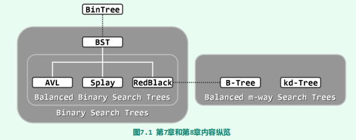

搜索树的查找是基于寻关键码访问的。这里隐含地做了一个假定——所有词条构成一个全序关系。需指出的是，这一假定条件不见得总是满足。比如在人事数据库中，作为姓名的关键码之间并不具有天然的大小次序。另外，在任务相对单纯但更加讲求效率的某些场合，并不允许花费过多时间来维护全序关系，只能转而付出有限的代价维护一个偏序关系。后者的一个实例，即第10章将要介绍的优先级队列，根据其ADT接口规范，只需高效地跟踪全局的极值元素，其它元素一般无需直接访问。

## 二叉搜索树

二叉搜索树（binary search tree）是在二叉树的基础上满足**顺序性**：
$$
任一节点r的左（右）子树中，所有节点（若存在）均不大于（不小于）r
$$

****

为回避边界情况，这里不妨暂且假定所有节点互不相等。

命题：**任何一棵二叉树是二叉搜索树，当且仅当其中序遍历序列单调非降**

证明：由顺序性即可推出

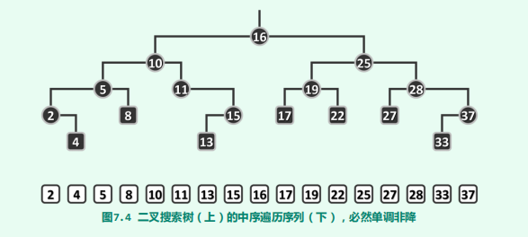

### 实现

~~~java
public class BinarySearchTree<T extends Comparable<T>>
    extends BinaryTree<T> {
    protected BinaryTreeNode<T> hot;      //被命中节点的父亲
    //...
}
~~~

hot成员变量的含义是被命中节点的父亲，这里被命中节点可以是外部节点（对应搜索失败的情况），此时hot就是叶节点。

### 搜索

二叉搜索树的查找算法，亦采用了减而治之的思路与策略，其执行过程可描述为从树根出发，逐步地缩小查找范围，直到发现目标（成功）或缩小至空树（失败）。

~~~java
/**
 * 在以指定节点为根的子树中查找指定元素。
 * 该方法会设置hot成员。如果node为空，那么hot也为空。其中hot为命中节点的父节点
 * @param e 待查找的元素
 * @param node 指定搜索子树的根节点
 * @return 若查找成功返回匹配节点，否则返回null
 */
protected BinaryTreeNode<T> search(BinaryTreeNode<T> node, T e) {
    hot = null;
    while (node != null) {
        hot = node.parent;
        if (node.data.compareTo(e) < 0) {
            node = node.rightChild;
        } else if (node.data.compareTo(e) > 0) {
            node = node.leftChild;
        } else {
            return node;
        }
    }
    return null;
}

/**
 * 在树中查找指定元素
 * @param e 待查找的元素
 * @return 若查找成功返回匹配节点，否则返回null
 */
public BinaryTreeNode<T> search(T e) {
    return search(root, e);
}
~~~

### 插入

思路：利用查找算法search()确定插入的位置及方向，然后才能将新节点作为叶子插入。

~~~java
public BinaryTreeNode<T> insert(T e) {
    //在教科书中使用了C++ 指针 + 引用的特性，这可以很方便修改父类的指针，
    //但是在Java中却是不行的，实属遗憾。造成这一问题的实质就是在Java中并没有二级指针！
    if (isEmpty()) {
        root = new BinaryTreeNode<>(e, null);
        size = 1;
        return root;
    }
    BinaryTreeNode<T> x = search(e);
    if (x != null)          //这里约定在二叉搜索树中没有重复元素
        return x;
    x = new BinaryTreeNode<>(e, hot);
    if (e.compareTo(hot.data) < 0) {
        hot.leftChild = x;
    } else {
        hot.rightChild = x;
    }
	size += 1;
    updateHeightAbove(x);
    return x;
}
~~~

### 删除

思路：利用查找算法search()确定要删除的元素。如果是单分支情况，直接左孩子代替即可。如果是双分支情况，那么将删除节点的后继节点与删除节点交换，转换为单分支情况

~~~java
/**
 * 删除数据为e的节点
 * @param e 待删除的元素
 * @return 如果未找到该节点，那么返回false。否则返回true
 */
public boolean remove(T e) {
    BinaryTreeNode<T> x = search(e);
    if (x == null) {        //该节点并不存在
        return false;
    }
    removeAt(x);            //删除该节点
    size -= 1;
    updateHeightAbove(hot); //更新被删除节点的祖父的高度
    return true;
}

/**
 * 删除指定节点，并设置hot为被删除节点的父节点
 * @param x 被删除的节点
 * @return 返回实际被删除节点接替者
 */
protected BinaryTreeNode<T> removeAt(BinaryTreeNode<T> x) {
    if (x.leftChild == null || x.rightChild == null) {      //处理单边情况
        removeAt1(x);
        hot = x.parent;
        return x.leftChild == null ? x.rightChild : x.leftChild;
    } else {            //双边情况
        BinaryTreeNode<T> succeedNode = x.getSucceedNode();
        T temp = succeedNode.data;
        succeedNode.data = x.data;
        x.data = temp;
        removeAt1(succeedNode);
        hot = succeedNode.parent;
        return succeedNode;
    }
}

/**
 * 删除指定节点，该节点至多只有一个孩子
 * @param x 被删除的节点
 */
private void removeAt1(BinaryTreeNode<T> x) {
    BinaryTreeNode<T> child = x.leftChild == null ? x.rightChild : x.leftChild;
    if (x.parent == null) {
        root = child;
    } else if (BinaryTreeNode.isLeftChild(x)) {
        x.parent.leftChild = child;
    } else {
        x.parent.rightChild = child;
    }
}
~~~

删除操作总是固定地将待删除的二度节点与其直接后继交换，则随着删除操作次数的增加，二叉搜索树向左侧倾斜的趋势将愈发明显，这加剧了高度不平衡的情况

### 连接

~~~java
 /**
 * 给定七个节点，并将这七个节点组装成一颗树, 同时会修改a、b、c三个节点的高度
 *                  b
 *                /   \
 *               a     c
 *             /  \   /  \
 *            T0  T1 T2  T3
 * @return 返回这个树的根节点
 */
protected  BinaryTreeNode<T> connect34(
    BinaryTreeNode<T> a, BinaryTreeNode<T> b, BinaryTreeNode<T> c,
    BinaryTreeNode<T> T0, BinaryTreeNode<T> T1, BinaryTreeNode<T> T2, BinaryTreeNode<T> T3
) {
    a.leftChild = T0;
    if (T0 != null) T0.parent = a;
    a.rightChild = T1;
    if (T1 != null) T1.parent = a;
    updateHeight(a);

    c.leftChild = T2;
    if (T2 != null) T2.parent = c;
    c.rightChild = T3;
    if (T3 != null) T3.parent = c;
    updateHeight(c);

    b.leftChild = a;
    a.parent = b;
    b.rightChild = c;
    c.parent = b;
    updateHeight(b);

    return b;
}
~~~

### 旋转

~~~java
/**
 * 对节点v实施zig-zig、或zig-zag旋转
 * @param v 待旋转的节点
 * @return 旋转后的等价二叉子树的根节点
 */
protected  BinaryTreeNode<T> rotateAt(BinaryTreeNode<T> v) {
    BinaryTreeNode<T> p = v.parent;
    BinaryTreeNode<T> g = v.parent;

    if (BinaryTreeNode.isLeftChild(p)) {
        if (BinaryTreeNode.isLeftChild(v)) {
            p.parent = g.parent;
            return connect34(v, p, g, v.leftChild, v.rightChild, p.rightChild, g.rightChild);
        } else {
            v.parent = g.parent;
            return connect34(p, v, g, p.leftChild, v.leftChild, v.rightChild, g.rightChild);
        }
    } else {
        if (BinaryTreeNode.isRightChild(v)) {
            p.parent = g.parent;
            return connect34(g,p,v,g.leftChild,p.leftChild,v.leftChild,v.rightChild);
        } else {
            v.parent = g.parent;
            return connect34(g,v,p,g.leftChild,v.leftChild,v.rightChild,p.rightChild);
        }
    }
}
~~~

## 平衡二叉树

然而不幸的是，对于规模为$n$的二叉搜索树，深度在最坏情况下可达$\Omega(n)$。此时该树j近似退化为一条单链，而此时的查找效率会降至*O*(n)，线性正比于数据集的规模。

下面，将按照两种常用的随机统计口径，就二叉搜索树查询操作的平均性能做一比较。

首先考虑**随机生成（randomly generatly）**的情况：不妨设各个节点对应n个互异关键码$\{e_1,e_2,...,e_n\}$。这些关键码的排列记为$\sigma = (e_{i_1},e_{i_2},...,e_{i_n})$。从一个空树开始，依次执行insert($e_{i_k}$)，即可得到一颗二叉搜索树$T(\sigma)$。

由以下两篇论文证明了在这一随机意义下，二叉搜索树的平均高度为$\Theta(logn)$

- [29] L. Devroye. A Note on the Height of Binary Search Trees. J. of ACM (1986), 33(3):489-498

- [30] P. Flajolet & A. Odlyzko. The Average Height of Binary Trees and Other Simple Trees. Journal of Computer and System Sciences (1982), 25(2):171-213

在考虑**随机组成（randomly composed）**的情况：n个互异节点同时给定，然后再遵循顺序性的前提下，随即确定它们拓扑链接。可以证明这样组成的二叉树共有$\frac{2n!}{n!(n+1)!}$。证明：

1. 设n个互异的节点随机组成的二叉树共有$T(n)$颗。且$T(0) = T(1) = 1$
2. 给定节点$e_0, e_1, ..., e_k, ... e_n$，以$e_k$为根节点随机组成的二叉树有$T(k) * T(n - k - 1)$
3. 那么$T(n) = \Sigma_{k = 0}^{n}T(k) * T(n - k - 1)$，这就是Catalan数的递推公式

这篇论文[30]证明了在这一随机意义下，平均查找长度为$\Theta(\sqrt{n})$

我们受到启发：若要控制单次查找在最坏情况下的运行时间，须从控制二叉搜索树的高度入手。为此，我们先定义树的**平衡性**：指一棵树的左右子树的高度差不超过某个限定值的性质。平衡性分为两类：

- 理想平衡：整课树的树高恰好为$\lfloor log_2n\rfloor$
- 适度平衡：整课树的树高渐进地不超$O(logn)$，即在渐进意义下的平衡性

> 包含n个节点的二叉树，高度不可能小于$\lfloor log_2n\rfloor$。若搜索二叉树的树高恰好为$\lfloor log_2n\rfloor$，则称作**理想平衡树**

平衡二叉搜索树的适度平衡性，都是通过对树中每一局部增加某种限制条件来保证的。比如

- 在红黑树中，从树根到叶节点的通路，总是包含一样多的黑节点
- 在AVL树中，兄弟节点的高度相差不过1

除了平衡性，局部性也至关重要：

- 经过单次动态修改操作后，至多只有O(1)处局部不再满足限制条件
- 总可在O(logn)时间内，使这O(1)处局部（以至全树）重新满足限制条件

局部性意味着刚刚失去平衡的二叉搜索树，必然可以迅速转换为一棵等价的平衡二叉搜索树。尽管任何二叉搜索树都可等价变换至理想平衡的完全二叉树，然而鉴于二者的拓扑结构可能相去甚远，在最坏情况下我们将不得不花费*O*(n)时间来完成等价转换操作，不满足局部性。

若两棵二叉搜索树的中序遍历序列相同，则称它们彼此等价

> 接下来介绍的AVL、Splay Tree、Red Black Tree都满足局部性以及适当平衡性。

在失衡后，通过围绕特定节点的旋转，实现等价前提下的局部拓扑调整。平衡化算法以旋转操作为基础完成全局拓扑调整，修复失衡情况。

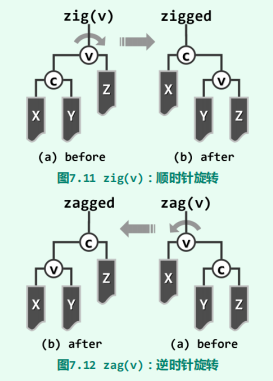

## AVL

> 由G. M. Adelson-Velsky和E. M. Landis不1962年发明[36]，并以他们名字命名

AVL中各节点平衡因子的绝对值均不超过1，任一节点v的平衡因子（balance factor）定义为“其左、右子树的高度差“。下图是AVL树的最坏情况

命题：高度为h的AVL树至少包含fib(h+3)-1个节点。

证明：

1. 先考虑递归基。当$h = 0$时，$fib(3) - 1 = 2 - 1 = 1$，并且此时T仅有一个根节点，命题成立。当$h = 1$时，$fib(4) - 1= 3 - 1= 2$，并且此时T至少有两个节点，命题成立。
2. 假设$h < n$时命题成立，现在考察$h = n$的情况。在所有高度为$h$的AVL树中挑选节点数量最少的一颗S$（注意这样的树不止一颗）
3. 设$S$的根节点为$r$，r的左子树、右子树分别为$S_l$、$S_R$，那么有$|S| = 1 + |S_L| + |S_R|$。
4. 由于节点数量是最少的，所以$S_l$、$S_R$的高度只能是一个为h-1，另一个为h-2。不妨设$S_l$的高度是h-1，那么$S_R$的高度为h-2
5. 由递归假设可得$|S| = 1 + |S_L| + |S_R| \geq 1 + fib(h + 2) -1 + fib(h+1) -1 = fib(h+3)-1 $。命题成立

推论：包含n个节点的AVL树的高度应为*O*(logn)，即AVL是适当平衡的。

证明：

~~~java
public class AVL<T extends Comparable<T>>
    extends BinarySearchTree<T> {
    //...
}
~~~

辅助函数：

~~~java
/**
 * @param node 指定节点
 * @return 获取指定节点中高度最高的孩子。若node为空，那么返回null。若孩子高度相等，优先返回左孩子
 */
BinaryTreeNode<T> getTallerChild(BinaryTreeNode<T> node) {
    if (node == null)
        return null;
    int leftHeight = node.leftChild == null ? -1 : node.leftChild.height;
    int rightHeight = node.rightChild == null ? -1 : node.rightChild.height;

    return  (leftHeight < rightHeight) ? node.rightChild : node.leftChild;
}

/**
 * 判断是否为理想平衡
 * @return 理想平衡返回true
 */
static boolean isBalanced(BinaryTreeNode<?> node) {
    return node.leftChild.height == node.rightChild.height;
}

/**
 * @return 获得该节点的AVL平衡因子
 */
static int getBalancedFactor(BinaryTreeNode<?> node) {
    return node.leftChild.height - node.rightChild.height;
}

/**
 * 判断是否为AVL平衡
 * @return AVL平衡返回true
 */
static boolean isAVLBalanced(BinaryTreeNode<?> node) {
    int factor = getBalancedFactor(node);
    return -2 < factor && factor < 2;
}
~~~

### 插入

单旋

双旋

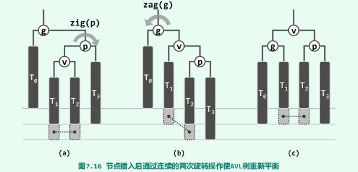

图中以虚线联接的每一对灰色方块中，其一对应于节点x，另一为空。

从中我们可以发现在AVL树中插入新节点后，仅需不超过两次旋转，即可使整树恢复平衡。

~~~java
@Override
public BinaryTreeNode<T> insert (T element) {
    if (isEmpty()) {
        root = new BinaryTreeNode<>(element, null);
        size++;
        return root;
    }

    BinaryTreeNode<T> node = search(element);
    if (node != null)           //要求元素互异
        return node;

    size++;
    //设置待插入节点
    node = new BinaryTreeNode<>(element, hot);

    if (element.compareTo(hot.data) < 0) {
        hot.leftChild = node;
    } else {
        hot.rightChild = node;
    }

    //开始修复失衡情况
    for (BinaryTreeNode<T> p = hot; p != null; p = p.parent) {
        if (!isAVLBalanced(p)) {
            BinaryTreeNode<T> pp = p.parent;
            //rotateAt方法会正确修正子树的高度
            node = rotateAt(getTallerChild(getTallerChild(p)));
            if (pp == null) {
                root = node;
            }
            //这里调整后的节点node与pp比较，与原先失衡节点p与pp比较是一样的。因为p与node都是在pp的同一颗子树下，而且有顺序性。
            if (node.data.compareTo(pp.data) < 0) {
                pp.leftChild = node;
            } else {
                pp.rightChild = node;
            }
            break;          //p复衡后，整个树也就平衡了
        } else {
            //对于出现失衡的情况，整个树的高度势必不会增加
            //而对于插入后未出现失衡的情况，整个树的高度可能增加。
            //这个分支正是处理这种情况的
            updateHeight(p);
        }
    }
    return node;
}
~~~

### 删除

T3中删除了节点而致使g(x)不再平衡，如图所示

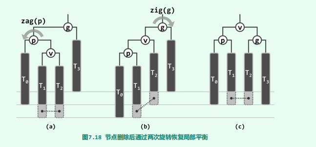

图中以虚线联接的灰色方块所对应的节点，不能同时为空（若同时为空，那么对应7.18(a)中的情况）；T2底部的灰色方块所对应的节点，可能为空，也可能非空。

同时我们还注意到在局部恢复平衡后，平衡后的子树根节点的高度可能下降，从而可能导致更高层祖先失衡。这种由于低层失衡节点的重平衡而致使其更高层祖先失衡的现象，称作**“失衡传播”**

~~~java
@Override
public boolean remove(T element) {
    BinaryTreeNode<T> node = search(element);
    if (node == null) {
        return false;
    }
    removeAt(node);
    size--;

    for (BinaryTreeNode<T> p = hot; p != null;) {
        BinaryTreeNode<T> pp = p.parent;
        if (!isAVLBalanced(p)) {     //节点p失衡
            node = rotateAt(getTallerChild(getTallerChild(p)));
            if (pp == null) {
                root = node;
            }
            else if (node.data.compareTo(pp.data) < 0) {
                pp.leftChild = node;
            } else {
                pp.rightChild = node;
            }
        }
        p = pp;     //旋转后所得到的等价二叉树的根节点并不一定是p了，所以要从这里修正
        updateHeight(pp);
    }
    return true;
}
~~~

## Splay Tree

### 基本原理

伸展树的主要优势就在于不需要对基本的二叉树节点结构，做任何附加的要求或改动，例如记录平衡因子或黑高度之类的额外信息，实现比较简便。同时在任何足够长的真实操作序列中，能够保持分摊意义上的高效率。但是SplayTree并不满足局部性，因此不适用于对于单次操作时间敏感的场合。

通常在任意数据结构的生命周期内，不仅执行不同操作的概率往往极不均衡，而且各操作之间具有极强的相关性，并在整体上多呈现出极强的规律性。这种现象被表述为**数据局部性**:

- **刚刚被访问过的元素，极有可能在不久之后再次被访问到**
- **将被访问的下一元素，极有可能就处于不久之前被访问过的某个元素的附近**

对任意一个数据结构来说，如果能充分利用数据局部特性，即可进一步地提高数据结构和算法的效率。Splay Tree就是这方面的一个例子。

它的基本思想如下：对于任意访问到的节点p，通过zig-zag或zig-zig等旋转操作构造出一颗等价二叉树，该二叉树以节点p作为根节点。

一种方法是**逐层伸展**：即每访问过一个节点之后，随即反复地以它的父节点为轴，经适当的旋转将其提升一层，直至最终成为树根。

它的最坏情况如下：

这一最坏情况的实例，完全可以推广至规模任意的二叉搜索树。于是对于规模为任意$n$的伸展树，只要按关键码单调的次序，周期性地反复进行查找，不难验证在一个周期中，旋转操作的总次数应为：
$$
(n - 1) + (n - 2) + ... + 1 = \Omega(n^2)
$$
如此分摊下来，每次访问平均需要$\Omega(n)$时间。很遗憾，这一效率不仅远远低于AVL树，而且甚至与原始的二叉搜索树的最坏情况相当。

为克服上述伸展调整策略的缺陷，一种简便且有效的方法就是：将逐层伸展改为**双层伸展**。每经过一次双层调整操作，节点v都会上升两层。当多次旋转后depth(v) = 1，不妨最后再相应地做一次zig或zag单旋操作。无论如何，经过$ \lceil  depth(v) / 2 \rceil$次旋转后，v最终总能成为树根。

我们再来考察下最坏情况：

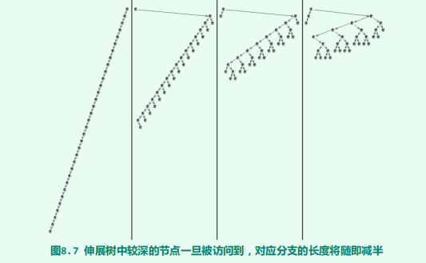

Tarjan等人采用势能分析法（potential analysis）已证明，在改用“双层伸展”策略之后，伸展树的单次操作均可在分摊的*O*(logn)时间内完成。

证明：

1. 就具体某次操作而言，实际执行时间$T$与分摊执行时间$A$往往不一致，可以通过势能函数弥合两者之间的差距。即当某一步计算实际所需的时间小于分摊复杂度时，可理解为通过势能的增加，将提前支出的计算成本存储起来；反之，则可将此前累积的势能中支出相应量，用于支付超出的计算成本。因此在某次操作中有：
   $$
   A_i = T_i + \Delta\Phi_i
   $$

2. 我们定义势能函数为
   $$
   \Phi(S) = \Sigma_{v\in S}log|v|
   $$
   其中，S为一颗伸展树，|v|为节点v的后代数目，同时我们对节点引入势能函数
   $$
   \Phi(v) = log|v|
   $$
   那么我们有：
   $$
   \begin{align}
   \Sigma_{i = 1}^mA_i &= \Sigma_{i = 1}^mT_i+ \Sigma_{i = 1}^m[\Phi(S_i) - \Phi(s_{i-1})]\\
   &=\Sigma_{i = 1}^mT_i +[\Phi(S_m) - \Phi(S_0)]
   \end{align}
   $$
   即
   $$
   A = T + [\Phi(S_m) - \Phi(S_0)]
   $$
   下面我们分两种情况来讨论，zag与zag-zig不再讨论

3. 情况A：zig
   $$
   \begin{align}
   A_i &= T_i + \Phi'(p) - \Phi(p) + \Phi'(v) - \Phi(v) \\
   &\leq T_i + \Phi'(v) - \Phi(v)\\
   &\leq 3*[\Phi'(v) - \Phi(v)]
   \end{align}
   $$

4. 情况B：zig-zag
   $$
   \begin{align}
   A_i &= T_i + \Phi'(g) - \Phi(g) + \Phi'(p) - \Phi(p) + \Phi'(v) - \Phi(v) \\
   &= T_i + \Phi'(g)  + \Phi'(p) - \Phi(p)  - \Phi(v)\\
   &\leq T_i + \Phi'(g)  + \Phi'(p)  - 2\Phi(v)\\
   &\leq T_i + 2\Phi'(v)  - 2\Phi(v)\\
   &\leq 3*[\Phi'(v) - \Phi(v)]
   \end{align}
   $$

   最后一步使用了凹函数的不等式
   $$
   \frac{log_2x + log_2y}{2} \leq log_2\frac{x+y}{2}
   $$
   其他步骤可根据图8.4即可推出

5. 因此我们有
   $$
   A = T + [\Phi(S_m) - \Phi(S_0)] \leq 3 * [\Phi(r) - \Phi(v)] \leq 3 * \Phi(r) = \Omicron(logn)
   $$

### 伸缩

~~~java
/**
 * 节点q作为p的左孩子插入
 */
private void attachAsLeftChild(BinaryTreeNode<T> p, BinaryTreeNode<T> q) {
    p.leftChild = q;
    if (q != null) q.parent = p;
}

/**
 * 节点q作为p的右孩子插入
 */
private void attachAsRightChild(BinaryTreeNode<T> p, BinaryTreeNode<T> q) {
    p.rightChild = q;
    if (q != null) q.parent = p;
}

private BinaryTreeNode<T> splay(BinaryTreeNode<T> v) {
    if (v == null) return null;
    BinaryTreeNode<T> p;
    BinaryTreeNode<T> g;
    while ((p = v.parent) != null && (g = p.parent) != null) {
        BinaryTreeNode<T> gg = g.parent;
        if (BinaryTreeNode.isLeftChild(v)) {
            if (BinaryTreeNode.isLeftChild(p)) {            //zig-zig，不可以用connect34代替
                attachAsLeftChild(g, p.rightChild);
                attachAsLeftChild(p, v.rightChild);
                attachAsRightChild(p, g);
                attachAsRightChild(v,p);
            } else {                                        //zig-zag，这里可以用connect34代替
                attachAsLeftChild(p,v.rightChild);
                attachAsRightChild(g,v.leftChild);
                attachAsLeftChild(v, g);
                attachAsRightChild(v, p);
            }
        } else {
            if (BinaryTreeNode.isLeftChild(p)) {            //zag-zag
                attachAsRightChild(p, v.leftChild);
                attachAsLeftChild(g,v.rightChild);
                attachAsRightChild(v, g);
                attachAsLeftChild(v, p);
            } else {                                        //zag-zig
                attachAsRightChild(p,v.leftChild);
                attachAsRightChild(p,v.leftChild);
                attachAsLeftChild(p, g);
                attachAsLeftChild(v,p);
            }
        }

        v.parent = gg;
        if (gg != null) {
            if (g == gg.leftChild) {
                attachAsLeftChild(gg, v);
            } else {
                attachAsRightChild(gg, v);
            }
        }
        updateHeight(g);
        updateHeight(p);
        updateHeight(v);
    }
    //此时g一定为null，p可能为null
    if (p != null) {    //如果p不为null，那么再进行一次单旋
        if (BinaryTreeNode.isLeftChild(v)) {
            attachAsLeftChild(p,v.rightChild);
            attachAsRightChild(v, p);
        } else {
            attachAsRightChild(p,v.leftChild);
            attachAsLeftChild(v, p);
        }
        updateHeight(p);
        updateHeight(v);
        v.parent = null;
    }
    return v;
}
~~~

### 查找

~~~java
/**
 * 查找指定元素，并将元素推至到树根。同时会修改整个树的高度以及成员root
 * @param element 待查找的元素
 * @return 返回树根root
 */
@Override
public boolean search(T element) {
    BinaryTreeNode<T> p = search(root, element);
    root = splay(p == null ? hot : p);
    return p != null;
}
~~~

### 插入

~~~java
@Override
public BinaryTreeNode<T> insert(T element) {
    if (root == null) {     //处理空树的退化情况
        size += 1;
        return root = new BinaryTreeNode<T>(element, null);
    }
    //if (search(element) != null) 是错误的，因为覆写了search方法，返回值有所变化
    if (search(root, element).data.compareTo(element) == 0) {      //若元素已存在
        return root;
    }

    size += 1;
    BinaryTreeNode<T> t = root;
    if (root.data.compareTo(element) < 0) {
        t.parent = root = new BinaryTreeNode<T>(element, null, t, t.rightChild);
        if (BinaryTreeNode.hasRightChild(t)) {
            t.rightChild.parent = root;
            t.rightChild = null;
        }
    } else {
        t.parent = root = new BinaryTreeNode<T>(element, null, t.leftChild, t);
        if (BinaryTreeNode.hasLeftChild(t)) {
            t.leftChild.parent = root;
            t.leftChild = null;
        }
    }
    updateHeight(t);
    return root;
}
~~~

### 删除

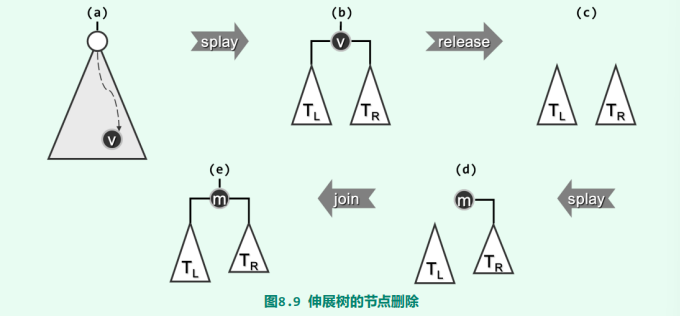

~~~java
@Override
public boolean remove(T element) {
    if (search(element)) {
        return false;
    }

    if (!BinaryTreeNode.hasLeftChild(root)) {               //左子树不存在
        root = root.rightChild;
        if (root != null)                                   //右子树可能不存在
            root.parent = null;
    } else if (!BinaryTreeNode.hasRightChild(root)) {       //左子树存在，但是右子树不存在
        root = root.leftChild;
        root.parent = null;
    } else {                                                //左子树和右子树都存在
        BinaryTreeNode<T> leftTree = root.leftChild;
        root.leftChild = null;                              //暂时将左子树切除
        root = root.rightChild;
        root.parent = null;
        search(element);                                    //必然会查找失败，此时树根root会被修改为hot
        root.leftChild = leftTree;
        leftTree.parent = root;
    }
    size -= 1;
    if (root != null)
        updateHeight(root);     //拼接左子树后要手动更新高度
    return true;
}
~~~

## B-Tree

### 概述

计算机存储能力的提高速度相对于计算能力的是严重滞后，这是长期存在的现象，而且随着时间的推移，这一矛盾将日益凸显。实践证明，分级存储才是行之有效的方法。在由内存与外存（磁盘）组成的二级存储系统中，全部数据往往存放于外存中，计算过程中则可将内存作为外存的高速缓存，存放最常用数据项的副本。借助高效的调度算法，如此便可将内存的“高速度”与外存的“大容量”结合起来。

当数据规模大到内存已不足以容纳，转而采用分级存储时，常规平衡二叉搜索树的查找、插入等操作的效率将大打折扣。其原因在于以下两点：

- 关键码的逻辑次序与物理地址之间几乎毫无关联，这使得查找过程中对外存的访问次数增多
- 磁盘访问速度比内存访问速度相差5~6个数量级。

B-树从第一点着手，充分利用磁盘按块访问数据的特性，将多个关键码组织到同一个节点中，这使得在同一个节点中的多个关键码的逻辑次序与一块连续的物理地址建立起关联。从而相比常规平衡二叉搜索树，在访问相同多个关键码时，减少对外存的访问次数。在同一个节点中进行关键码比较，仅仅涉及内存的访问操作（参数设置正确的话）。而当从一个节点转向另一个节点时，才可能发生I/O操作。

当然，每组关键码的最佳数目，取决于不同外存的批量访问特性。比如旋转式磁盘的读写操作多以扇区为单位，故可根据扇区的容量和关键码的大小，经换算得出每组关键码的最佳规模。

B-树的宏观结构如下：由于B-树的定义以及相关的上溢、下溢操作，使得B-树的宏观结构类似于完美二叉树。

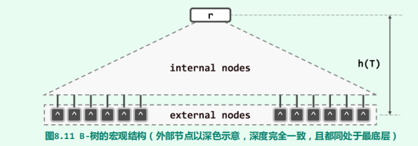

一颗m阶B-树的定义如下：

- 每个节点（除根结点）的关键码数量为$\lceil m / 2\rceil - 1\to m - 1$，那么对应地，每个节点（除根节点）的分支数量为 $\lceil m/2 \rceil \to m$
- 根节点至少有一个关键码（非空树）

B-树的**外部节点（external node）**未必意味着查找失败，而可能表示目标关键码存在于更低层次的某一外部存储系统（例如，网络文件系统）中。

命题：对于有N个关键码的、高度为h的m阶B-树，我们有$log_m(N+1) \leq h \leq log_{\lceil m/2\rceil}\lfloor\frac{N+1}{2}\rfloor$

证明：

1. 先证明$h \leq log_{\lceil m/2\rceil}\lfloor\frac{N+1}{2}\rfloor + 1$。当关键码总数固定时，为了使m阶B-树高度最高，各个节点应该包含尽可能少的关键码。于是，各个高度层次上节点数目是：（由于B-树的定义以及相关的上溢、下溢操作，使得B-树的宏观结构类似于完美二叉树）
   $$
   \begin{align}
    n_0 &= 1 \\
    n_1 &= 2 \\
    n_2 &= 2 * \lceil m / 2\rceil ^2 \\
    ...\\
    n_{h-1} &= 2 * \lceil m / 2\rceil ^{h-2} \\ 
    n_{h} &\geq 2 * \lceil m / 2\rceil ^{h-1} \\ 
   \end{align}
   $$

2. 每个节点（除根结点）都包含$\lceil m / 2\rceil - 1$个关键码，因此有
   $$
   (2 + 2 * \lceil m / 2\rceil ^2 + ... + 2 * \lceil m / 2\rceil ^{h-1})(\lceil m / 2\rceil - 1) + 1 \leq N
   $$
   化简得
   $$
   2 *\lceil m / 2\rceil ^h - 1 \leq N
   $$
   即
   $$
   h \leq  log_{\lceil m/2\rceil}\lfloor\frac{N+1}{2}\rfloor
   $$

3. 同理可证$log_m(N+1) \leq h$

推论：有N个关键码的m阶B-树的高度$h = \Theta(log_mN)$

### 数据结构

~~~java
final public class BTree<T extends Comparable<T>> {
    int size;       	   //关键码总数
    final int order;       //阶数
    BTreeNode<T> root;
    BTreeNode<T> hot;       //命中节点的父节点
}

public class BTreeNode<T extends Comparable<T>> {
    BTreeNode<T> parent;
    Vector<BTreeNode<T>> children;
    Vector<T> keys;
}
~~~

### 搜索

~~~java
BTreeNode<T> search(T element) {
    BTreeNode<T> v = root;
    hot = null;
    while (v != null) {
        hot = v;
        int rank = Vector.search(v.keys, element);
        if (0 <= rank && element.compareTo(v.keys.get(rank)) == 0) {
            break;
        }
        v = v.children.get(rank + 1);
    }
    return v;
}
~~~

### 删除

~~~java
boolean remove(T element) {
    BTreeNode<T> v = search(root, element);
    if (v == null)
        return false;
    int r = Vector.search(v.keys, element);
    if (v.children.get(0) != null) {                //v不是叶节点
        BTreeNode<T> u = v.children.get(r + 1);
        while (u.children.get(0) != null)           //找v中关键码为element的后继
            u = u.children.get(0);
        v.keys.set(u.keys.get(0), r);               //关键码覆盖
        v = u;                                      //将v设置为后继节点
    }
    v.keys.remove(0);
    v.children.remove(0);        
    solveUnderflow(v);
    return true;
}
~~~

### 插入

~~~java
boolean insert(T element) {
    BTreeNode<T> v = search(root, element);
    if (v != null)
        return false;
    if (hot == null) {
        root = new BTreeNode<>();
        root.keys.insert(element);
        root.children.insert(null,0);
        root.children.insert(null, 0);
        return true;
    }
    int rank = Vector.search(hot.keys, element);
    hot.keys.insert(element, rank + 1);
    hot.children.insert(null, rank + 2);
    size++;
    solveOverflow(hot);
    return true;
}
~~~

### 上溢

发生上溢的节点恰好有m个关键码，分别记为$n_0, n_1, n_2, ... ,n_{m-1}$。取$s=\lfloor m/2\rfloor$。那么将$n_s$上溢到父节点，而剩下的节点分裂成两个节点，分别是$n_0, n_1, ... n_{s-1}$与$n_{s+1}, ... n_{m-1}$。其中分裂后的左节点有$(s - 1) - 0 + 1 = s = \lfloor m / 2\rfloor \geq \lceil m / 2\rceil -1$个，右节点有$(m - 1) - (s + 1) + 1= m - \lfloor m / 2 \rfloor + 1 \geq \lfloor m / 2 \rfloor + 1 \geq \lceil m / 2\rceil -1$。满足B-树的条件

只有出现以下三种上溢情况：

- a：上溢到父节点就结束
- b：上溢传播
- c：上溢传播到根节点，此时全树高度+1

~~~java
private void solveOverflow(BTreeNode<T> t) {
    if (t.children.size() <= order) //递归基
        return;

    final int s = order / 2;       //选取中轴点

    // v作为分裂后的右孩子
    // 上溢节点t作为左孩子
    BTreeNode<T> v = new BTreeNode<>();

    // 将[s + 1, order - 1]处的关键码以及对应的左孩子复制到节点v中
    // 同时将节点t中的[s + 1, order - 1]的关键码以及对应的孩子删除掉。
    // 那么循环结束时，节点t作为分裂后的左孩子
    for (int j = 0; j < order - s - 1; j++) {
        //调用remove效率低下，以后有时间再优化吧
        v.children.insert(t.children.remove(s + 1));
        v.keys.insert(t.keys.remove(s + 1));
    }

    // 分支比关键码多一
    v.children.insert(v.children.remove(s + 1));

    if (v.children.get(0) != null) {        //如果孩子不为空
        for (BTreeNode<T> node : v.children) {
            node.parent = v;    //让这些孩子指向新的父亲——节点v
        }
    }

    BTreeNode<T> p = t.parent;
    if (p == null) {        //这种对应情况c，是一种特殊情况，此时全树的高度会增加1
        root = p = new BTreeNode<>();
        p.children.insert(t);
        v.parent = p;
    }

    int r = Vector.search(p.keys, t.keys.get(0));
    p.keys.insert(t.keys.remove(s),r + 1);
    p.children.insert(v, r + 2);
    v.parent = p;
    solveOverflow(p);
}
~~~

下面来看一个实例：

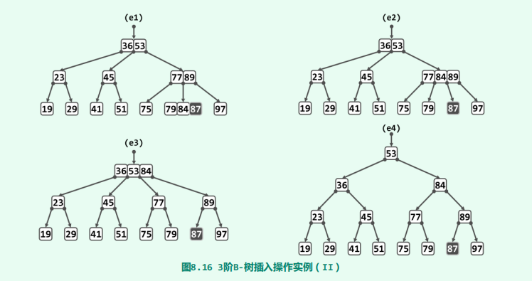

### 下溢

发生下溢的节点v恰好包含$\lceil m/2\rceil - 1$个关键码。根据其左右兄弟所含关键码的数目，可以分为三种情况做相应的处置：

- V的左兄弟L存在，且至少包含$\lceil m/2\rceil$个关键码

  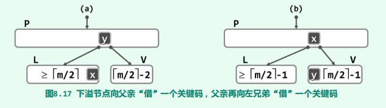

- V的右兄弟R存在，且至少包含$\lceil m/2\rceil$个关键码

  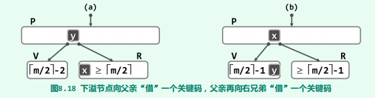

- V的兄弟包含最少$\lceil m/2\rceil - 1$个关键码

  

对于第三种情况，可能造成父节点发生下溢，即下溢传播现象。如果传播到根节点，那么全树的高度减一。

~~~java
private void solveUnderflow(BTreeNode<T> v) {
    if (v.children.size() >= (order + 1) / 2) {     //递归基
        //这里[(order + 1) / 2]就是(order / 2)向上取整
        return;
    }
    BTreeNode<T> p = v.parent;
    if (p == null) {
        //下溢传播到根节点处
        if (v.keys.size() == 0) {
            root = v.children.get(0);
            root.parent = null;
        }
        return;
    }

    //通过分支寻找孩子
    int rank = p.children.find(v);
    if (rank != 0) {                                //有左孩子
        BTreeNode<T> leftNode = p.children.get(rank - 1);
        if (p.keys.size() >= (order + 1) / 2) {     //左孩子可以借出一个关键码
            //这里不得不感叹C++重载运算符是多么的方便
            //这是教科书上的代码，技巧性太强，可读性差。
            v.keys.insert(p.keys.get(rank - 1), 0);
            p.keys.set(leftNode.keys.remove(leftNode.keys.size() - 1), rank - 1);
            v.children.insert(leftNode.children.remove(leftNode.children.size() - 1),0);
            BTreeNode<T> child = v.children.get(0);
            if (child != null)
                child.parent = v;
            return;
        }
    }
    if (rank != p.children.size() - 1) {            //有右孩子
        BTreeNode<T> rightNode = p.children.get(rank + 1);
        if (p.keys.size() >= (order + 1) / 2) {     //右孩子可以借出一个关键码
            //这是自己的实现方式，比较直观，可读性比教科书上的好。性能上，与教科书上的代码是相同的，毕竟汇编代码都一样。
            T x = rightNode.keys.remove(0);
            BTreeNode<T> child = rightNode.children.remove(0);

            T y = p.keys.get(rank + 1);
            p.keys.set(x, rank + 1);

            v.keys.insert(y);
            v.children.insert(child);

            if (child != null)
                child.parent = v;
            return;
        }
    }
    if (rank != 0) {        //左右兄弟节点（如果有的话）都不能借出
        //一定有左孩子
        BTreeNode<T> leftNode = p.children.get(rank - 1);

        T y = p.keys.remove(rank - 1);
        p.children.remove(rank);

        leftNode.keys.insert(y);
        while (v.keys.size() != 0) {
            leftNode.keys.insert(v.keys.remove(0));
        }

        while (v.children.size() != 0) {
            BTreeNode child = v.children.remove(0);
            if (child != null)
                child.parent = leftNode;
            leftNode.children.insert(child);
        }
    } else {
        //一定有右孩子
        BTreeNode<T> rightNode = p.children.get(rank + 1);
        T y = p.keys.remove(rank);
        p.children.remove(rank);

        rightNode.keys.insert(y);
        while (v.keys.size() != 0) {
            rightNode.keys.insert(v.keys.remove(v.keys.size() - 1),0);
        }

        while (v.children.size() != 0) {
            BTreeNode<T> child = v.children.remove(v.children.size() - 1);
            if (child != null)
                child.parent = rightNode;
            rightNode.children.insert(child ,0);
        }
    }
    solveUnderflow(p);
}
~~~

下面来看一个实例：

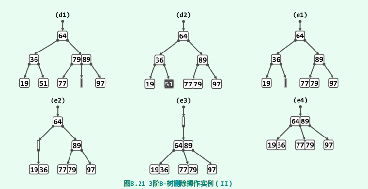

## 红黑树

AVL树的性能已经足够的好了，但是，删除操作之后的重平衡过程可能需做多达$\Omega(logn)$次旋转，从而导致全树整体拓扑结构的大幅度变化。红黑树可以保证每次插入或删除操作之后的重平衡过程中，全树拓扑结构的更新仅涉及*O*(1)个节点。但是需要对$\Omega(logn)$个节点重染色。

红黑树的定义：

- **树根始终为黑色**
- **外部节点均为黑色**
- **若节点为红色，则其孩子节点必为黑色**
- **从任一外部节点到根节点的沿途，黑节点的数目相等**（这对子树也成立）

红黑树等价于一颗（2，4）树：

红黑树所采用的“适度平衡”标准，可大致表述为：**任一节点左、右子树的高度，相差不得超过两倍**。下面证明这一点。

命题：包含n个内部节点的红黑树T，其高度h满足$ h \leq 2*log_2(n+1)$

证明：

1. 将T的黑高记为H，那么H同时也是T对应的（2，4）树的高度

2. 由B-关键码个数与高度的命题可知：
   $$
   H \leq log_{\lceil 4 / 2\rceil}\lceil\frac{n+1}{2}\rceil\leq log_2(n+1)
   $$

3. 由红黑树的定义（3）的逆否形式知：一条路径上不可能有相邻的红节点，因此
   $$
   h \leq 2 * H \leq 2*log_2(n+1)
   $$

命题：染色操作的分摊时间复杂度为$\Omicron(1)$

### 插入 & 双红修正

~~~java
@Override
public BinaryTreeNode<T> insert(T e) {
    if (isEmpty()) {
        size = 1;
        return root = new BinaryTreeNode<>(e, null, null, null, 0, RBColor.BLACK);
    }

    BinaryTreeNode<T> x = search(root, e);
    if (x != null)          //这里约定在二叉搜索树中没有重复元素
        return x;

    x = new BinaryTreeNode<>(e, hot, null, null, -1, RBColor.RED);
    if (e.compareTo(hot.data) < 0) {
        hot.leftChild = x;
    } else {
        hot.rightChild = x;
    }
    size += 1;
    solveDoubleRed(x);
    return x;
}
~~~

当新的节点以红节点插入时，红黑树的第三个条件未必满足，即出现双红缺陷。因此我们需要调用solveDoubleRed算法给予修正。双红修正可分为两类情况分别处置。（注：$T_k$表示外部节点或者省略子树的内部节点，他们的黑高都相等）

在第二种修正情况下，祖父节点g被染成红色，可能将双红缺陷向上传播。只有在缺陷传播到根节点时，全树的黑高才增加一。

~~~java
void solveDoubleRed(BinaryTreeNode<T> x) {
    //x必为红节点
    if (BinaryTreeNode.isRoot(x)) {         //递归到根节点，全树的黑高 + 1
        x.color = RBColor.BLACK;
        x.height++;
        return;
    }

    BinaryTreeNode<T> p = x.parent;         //x不为根节点，其父亲必然存在
    if (BinaryTreeNode.isBlack(p)) {        //此时没有双红缺陷现象，进行双红修复
        return;
    }

    BinaryTreeNode<T> g = p.parent;         //此时p为红色，那么其父亲一定存在
    BinaryTreeNode<T> u = BinaryTreeNode.getUncle(x);
    if (BinaryTreeNode.isBlack(u)) {        //叔叔为黑节点，对应情况一
        g.color = RBColor.RED;
        BinaryTreeNode<T> gg = g.parent;
        BinaryTreeNode<T> r;
        if (BinaryTreeNode.isLeftChild(p) == BinaryTreeNode.isLeftChild(x)) {       //p x同侧
            p.color = RBColor.BLACK;
            if (BinaryTreeNode.isLeftChild(p)) {            //zig旋转
                attachAsLeftChild(g, p.rightChild);
                attachAsRightChild(p, g);
            } else {                                        //zag旋转
                attachAsRightChild(g, p.leftChild);
                attachAsLeftChild(p, g);
            }
            r = p;
            p.height += 1;
            g.height -= 1;
        } else {                            //p x异侧
            x.color = RBColor.BLACK;
            r = rotateAt(x);
            g.height -= 1;
        }
        updateHeight(x);
        r.parent = gg;
        if (gg == null) {
            root = r;
        } else {
            if (gg.data.compareTo(r.data) > 0) {
                gg.leftChild = r;
            } else {
                gg.rightChild = r;
            }
        }
    } else {                                //对应情况二
        p.color = u.color = RBColor.BLACK;
        g.color = RBColor.RED;
        p.height += 1;
        u.height += 1;
        solveDoubleRed(g);
    }
}
~~~

### 删除 & 双黑修正

~~~java
@Override
public boolean remove(T e) {
    BinaryTreeNode<T> x = search(root, e);
    if (x == null)          //目标不存在
        return false;
    BinaryTreeNode<T> r = removeAt(x);
    if ((--size) == 0)          //空树，直接结束
        return true;

    //现在至少有一个元素
    if (hot == null) {      //若实际上删除的是根节点
        root.color = RBColor.BLACK;
        updateHeight(root);
        return true;
    }

    if (BinaryTreeNode.isRed(x)) {       //也就是说，删除x对黑高无影响
        return true;
    }

    if (BinaryTreeNode.isRed(r)) {
        //此时r为红节点，那么它是内部节点，非null
        //重新染色就可以修正
        r.color = RBColor.BLACK;
        r.height++;
        return true;
    }
    solveDoubleRed(r);
    return true;
}
~~~

记实际上被删除的节点为x，而其接替者（它的左孩子或者右孩子）为r。那么删除可以分为以下三种情况

- 若x为红色，那么删除x对黑高无影响，此时无需修正

  

- 若x为黑色，而r为红色，那么删除x后将染为黑色即可

  

- 若与其接替者同时为黑色，删除后会导致局部子树的黑高度降低一个单位。这可能违反定义的第三条，此时我们需要调用solveDoubleBlack算法给予修正。双黑修正可分为四类情况分别处置。（注意$T_1T_2T_3$的黑高比$T_4T_5$多1或2）

  - BB-1

    

  - BB-2-R

    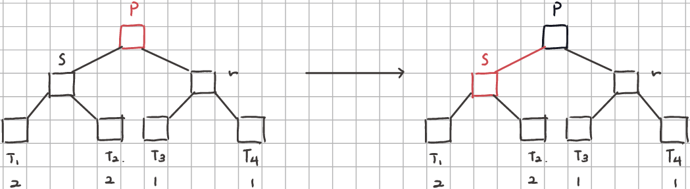

  - BB-2-B：此时p子树的黑高减一，可以等效地理解为节点p的父节点刚被”删除“。此时可能再次发生双黑缺陷，应继续进行迭代来完成修复。

    

  - BB-3

    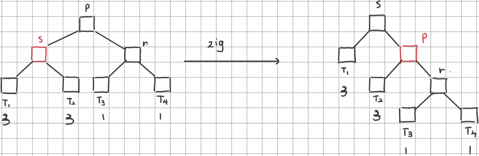

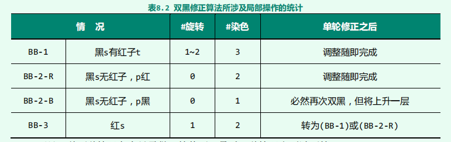

~~~java
void solveDoubleBlack(BinaryTreeNode<T> x) {
    BinaryTreeNode<T> p = x == null ? hot : x.parent;       //节点r的父亲
    if (p == null) {
        return;
    }
    BinaryTreeNode<T> s = BinaryTreeNode.getSibling(x);
    if (BinaryTreeNode.isBlack(s)) {
        BinaryTreeNode<T> t = null;
        if (BinaryTreeNode.isRed(s.leftChild)) t = s.leftChild;
        if (BinaryTreeNode.isRed(s.rightChild)) t = s.rightChild;
        if (t != null) {        //BB-1情况
            BinaryTreeNode<T> g = p.parent;
            if (BinaryTreeNode.isLeftChild(t) == BinaryTreeNode.isLeftChild(s)) {       //同侧
                if (BinaryTreeNode.isLeftChild(t)) {
                    attachAsLeftChild(p, s.rightChild);
                    attachAsRightChild(s, p);
                } else {
                    attachAsRightChild(p, s.leftChild);
                    attachAsLeftChild(s, p);
                }
                s.color = p.color;
                p.color = RBColor.BLACK;
                t.color = RBColor.RED;
                s.parent = g;
                if (g == null) {
                    root = s;
                } else {
                    if (g.data.compareTo(s.data) > 0) {
                        g.leftChild = s;
                    } else {
                        g.rightChild = s;
                    }
                }
                updateHeight(t);
                updateHeight(p);
                updateHeight(s);
            } else {        //异侧
                rotateAt(t);
                t.color = p.color;
                p.color = RBColor.BLACK;
                updateHeight(p);
                updateHeight(t);
            }
        } else {
            if (BinaryTreeNode.isRed(p)) {          //BB-2-R情况
                p.color = RBColor.BLACK;
                s.color = RBColor.RED;
                s.height -= 1;
            } else {                                //BB-2-B情况
                s.color = RBColor.RED;
                p.height -= 1;
                solveDoubleBlack(p);
            }
        }
    } else {                    //BB-3情况
        BinaryTreeNode<T> g = p.parent;
        if (BinaryTreeNode.isLeftChild(s)) {
            attachAsLeftChild(p,s.rightChild);
            attachAsRightChild(s, p);
        } else {
            attachAsRightChild(p, s.leftChild);
            attachAsLeftChild(s, p);
        }
        s.color = RBColor.BLACK;
        p.color = RBColor.RED;
        s.parent = g;
        if (g == null) {
            root = s;
        } else {
            if (g.data.compareTo(s.data) > 0) {
                g.leftChild = s;
            } else {
                g.rightChild = s;
            }
        }
        updateHeight(p);
        updateHeight(s);
        solveDoubleBlack(x);
    }
}
~~~

## kd-Tree

kdTree借助平衡二叉树实现多维范围查询

~~~java
class KDNode <T extends Comparable<T>>{
    Vector<T> data;
    KDNode<T> leftChild;
    KDNode<T> rightChild;

    int splitDirection;

    public KDNode(Vector<T> data, KDNode<T> leftChild, KDNode<T> rightChild) {
        this.data = data;
        this.leftChild = leftChild;
        this.rightChild = rightChild;
    }
}
public class KDTree<T extends Comparable<T>> {
{
    KDNode<T> root;
    int dimension;

    BiFunction<Vector<T>, Integer, Vector<T>[]> divide;
    //由调用者决定划分策略
    public KDTree(Vector<T> collection,
           int dimension,
           BiFunction<Vector<T>, Integer, Vector<T>[]> divide) {
        
        this.divide = divide;
        this.dimension = dimension;
        root = buildKDTree(collection, 0);
    }

    private KDNode<T> buildKDTree(Vector<T> collection, int depth) {
        KDNode<T> node = new KDNode<>(collection, null, null);
        if (collection.size() > 1) {
            node.splitDirection = depth;
            Vector<T>[] collections = divide.apply(collection, node.splitDirection);
            node.leftChild = buildKDTree(collections[0], (depth + 1) % dimension);
            node.rightChild = buildKDTree(collections[1], (depth + 1) % dimension);
        }
        return node;
    }

    public void search(Vector<T> R, Consumer<Vector<T>> consumer) {
        search(root, R, consumer);
    }

    private void search(KDNode<T> v, Vector<T> R, Consumer<Vector<T>> consumer) {
        //null对应空集，自然地包含于R中
        if (R.hasContained(v.leftChild.data)) {
            consumer.accept(v.leftChild.data);
        } else if (R.intersection(v.leftChild.data)) {
            search(v.leftChild, R, consumer);
        }
        if (R.hasContained(v.rightChild.data)) {
            consumer.accept(v.rightChild.data);
        } else if (R.intersection(v.rightChild.data)) {
            search(v.rightChild, R, consumer);
        }
    }
}
~~~

实例：

