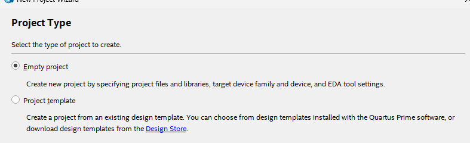
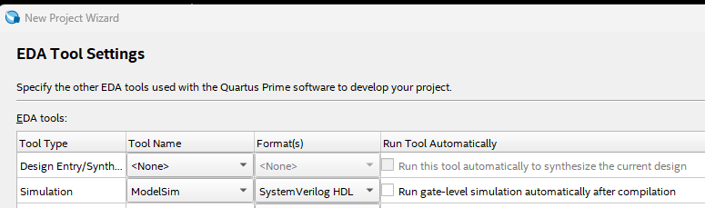
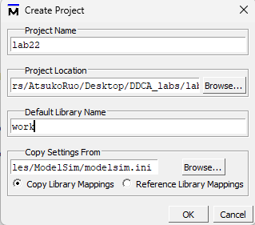
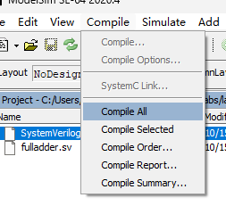

# Lab 

## Lab2

首先从官网下载Lite（精简）版 https://www.intel.cn/content/www/cn/zh/products/details/fpga/development-tools/quartus-prime/resource.html。解压后，点击`setup.bat`安装即可

再下载ModuleSim，按照这篇教程走即可https://zhuanlan.zhihu.com/p/646172508

1. 创建新项目 File -> New Project Wizard

   

2. 填写项目路径、项目名称、顶层模块名

   

3. 选择空项目

   

4. Add Files选项卡中直接点Next

   

5. 配置设备信息

   - Device：Cyclone V E Base
   - Pin count：484
   - devices：5CEBA4F23C7

   

6. 模拟器选择ModelSim，Format选择SystemVerilog

   

7. Finish

如何添加SystemVerilog文件：File -> new -> SystemVerilog HDL File

然后编写代码即可。

编写完后点击如下按钮，可以对整个模块进行合成

没有办法对单个模块进行合成，但是可以进行语法检查

合成完后，可以通过Tools->Neslist Viewers 查看电路图

通过 Assignments -> Pin Planner来配置顶层模块的引脚。不配置的话，在合成时有警告信息

而

下面讲解一下如何进行仿真：

首先新创建一个项目 New -> Project

然后在项目中添加testbench文件，以及被测文件

编译这些文件

编译成功后的显示：

然后开始仿真：Simulate-> Start Simulation

选择testbench文件，然后再Optimization Option选项卡中选择 Apply full visbility to all modules。如果不选择的话，有一些信号是捕获不到的

选择所有信号，然后右键 Add to -> Wave -> Selected Signals

在最下面的transcript面板中输入命令`run 200`，这个命令表示运行200ns

这个就是仿真成功后的波形图

如何想重新仿真，那么在transcript面板中输入`restart -f`即可。

这个软件的底层所使用的技术很落后，有些操作（例如，重新选择信号）不能实时反映到界面上。这时推荐重启该款软件。