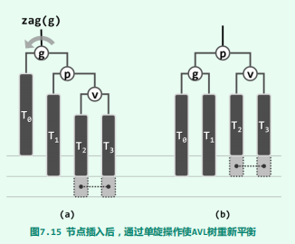
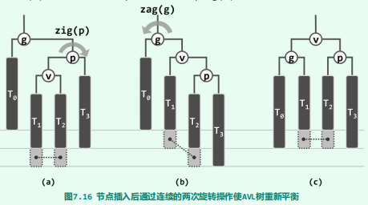
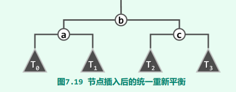
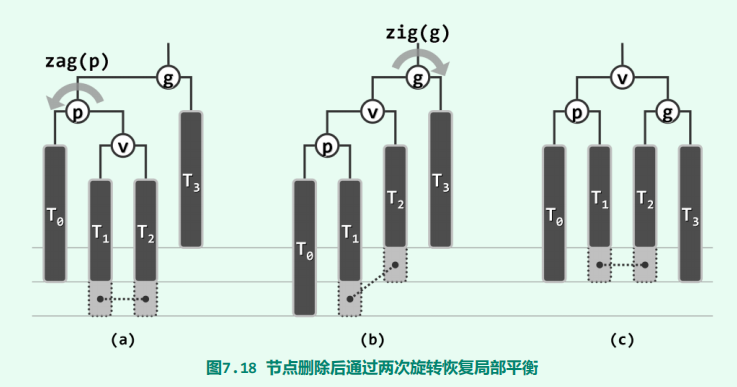

## 插入

- 如图所示：当在其中一个浅灰色处添加节点时，会引起节点g的失衡。

- 出现失衡情况时，对局部`O(1)`修正后，即可保持AVL的适度平衡的条件。
-  当出现失衡的情况，整个树的高度势必不会增加。而对于插入后未出现失衡的情况，整个树的高度可能增加。
- 时间复杂度为`O(logn)`，包括`O(logn)`的查找、`O(logn)`的修正高度以及`O(1)`的、恢复全树平衡的旋转操作。

辅助方法

~~~Java
/**
 * 给定七个节点，并将这七个节点组装成一颗树, 同时会修改a、b、c三个节点的高度
 *                  b
 *                /   \
 *               a     c
 *             /  \   /  \
 *            T0  T1 T2  T3
 * @return 返回这个树的根节点
 */
protected  BinaryTreeNode<T> connect34(
    BinaryTreeNode<T> a, BinaryTreeNode<T> b, BinaryTreeNode<T> c,
    BinaryTreeNode<T> T0, BinaryTreeNode<T> T1, BinaryTreeNode<T> T2, BinaryTreeNode<T> T3
) {
    a.leftChild = T0;
    if (T0 != null) T0.parent = a;
    a.rightChild = T1;
    if (T1 != null) T1.parent = a;
    updateHeight(a);

    c.leftChild = T2;
    if (T2 != null) T2.parent = c;
    c.rightChild = T3;
    if (T3 != null) T3.parent = c;
    updateHeight(c);

    b.leftChild = a;
    a.parent = b;
    b.rightChild = c;
    c.parent = b;
    updateHeight(b);

    return b;
}

/**
 * 对节点v实施zig-zig、或zig-zag旋转
 * @param v 待旋转的节点
 * @return 返回旋转后的等价二叉子树的根节点
 */
protected  BinaryTreeNode<T> rotateAt(BinaryTreeNode<T> v) {
    BinaryTreeNode<T> p = v.parent;
    BinaryTreeNode<T> g = v.parent;

    if (BinaryTreeNode.isLeftChild(p)) {
        if (BinaryTreeNode.isLeftChild(v)) {
            p.parent = g.parent;
            return connect34(v, p, g, v.leftChild, v.rightChild, p.rightChild, g.rightChild);
        } else {
            v.parent = g.parent;
            return connect34(p, v, g, p.leftChild, v.leftChild, v.rightChild, g.rightChild);
        }
    } else {
        if (BinaryTreeNode.isRightChild(v)) {
            p.parent = g.parent;
            return connect34(g,p,v,g.leftChild,p.leftChild,v.leftChild,v.rightChild);
        } else {
            v.parent = g.parent;
            return connect34(g,v,p,g.leftChild,v.leftChild,v.rightChild,p.rightChild);
        }
    }
}
~~~

~~~java
/**
 * 在树中插入一个元素
 * @param element 待插入的元素
 * @return 返回新插入的节点
 */
@Override
public BinaryTreeNode<T> insert (T element) {
    if (isEmpty()) {
        root = new BinaryTreeNode<>(element, null);
    }

    BinaryTreeNode<T> node = search(element);
    size++;
    if (node != null)
        return node;

    //设置待插入节点的父节点的孩子
    node = new BinaryTreeNode<>(element, null);

    if (element.compareTo(hot.data) < 0) {
        hot.leftChild = node;
    } else {
        hot.rightChild = node;
    }

    /**
     * 这段代码是有问题的
     *  temp = element.compareTo(hot.data) < 0 ？ hot.leftChild ： hot.rightChild
     *  temp = node;
     *  这仅仅是将temp指向其他对象而已，并没有修改hot.lifeChild引用。
     *
     *  只有当temp用于读操作时，上述代码才有意义。例子请见BinarySearchTree中的removeAt1方法
     */

    for (BinaryTreeNode<T> p = hot; p != null; p = p.parent) {
        if (!isAVLBalanced(p)) {
            BinaryTreeNode<T> pp = p.parent;
            //rotateAt方法会正确修正子树的高度
            if ((node = rotateAt(getTallerChild(getTallerChild(p)))).data.compareTo(pp.data) < 0) {
                pp.leftChild = node;
            } else {
                pp.rightChild = node;
            }
            break;
        } else {
            //对于出现失衡的情况，整个树的高度势必不会增加。
            //而对于插入后未出现失衡的情况，整个树的高度可能增加。
            //这个分支正是处理这种情况的
            updateHeight(p);
        }
    }
    return node;
}
~~~

## 删除 

- 如图所示，当在T3子树中删除一个节点时，引起节点p的失衡

- 当出现失衡时，旋转后所得等价二叉子树的高度可能会减一，那么失衡的情况可能会传播到节点g的祖先上。这种由于低层失衡节点的重平衡而致使其更高层祖先失衡的现象，称作**“失衡传播”**。

~~~java
@Override
public boolean remove(T element) {
    BinaryTreeNode<T> node = search(element);
    if (node == null) {
        return false;
    }
    super.removeAt(node);
    size--;

    for (BinaryTreeNode<T> p = hot; p != null;) {
        BinaryTreeNode<T> pp = p.parent;
        if (isAVLBalanced(p)) {     //节点p失衡
            if ((node = rotateAt(getTallerChild(getTallerChild(p))))
                .data.compareTo(pp.data) < 0) {
                pp.leftChild = node;
            } else {
                pp.rightChild = node;
            }
        }
        p = pp;     //旋转后所得到的等价二叉树的根节点并不一定是p了，所以要从这里修正
        updateHeight(pp);
    }
    return true;
}
~~~

