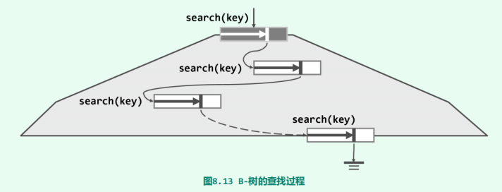

# B- Tree

[TOC]

## 概述

计算机存储能力的提高速度相对于计算能力的是严重滞后，这是长期存在的现象，而且随着时间的推移，这一矛盾将日益凸显。实践证明，分级存储才是行之有效的方法。在由内存与外存（磁盘）组成的二级存储系统中，全部数据往往存放于外存中，计算过程中则可将内存作为外存的高速缓存，存放最常用数据项的副本。借助高效的调度算法，如此便可将内存的“高速度”与外存的“大容量”结合起来。

当数据规模大到内存已不足以容纳，转而采用分级存储时，常规平衡二叉搜索树的查找、插入等操作的效率将大打折扣。其原因在于以下两点：

- 关键码的逻辑次序与物理地址之间几乎毫无关联，这使得查找过程中对外存的访问次数增多
- 磁盘访问速度比内存访问速度相差5~6个数量级。

B-树从第一点着手，充分利用磁盘按块访问数据的特性，将多个关键码组织到同一个节点中，这使得在同一个节点中的多个关键码的逻辑次序与一块连续的物理地址建立起关联。从而相比常规平衡二叉搜索树，在访问相同多个关键码时，减少对外存的访问次数。

当然，每组关键码的最佳数目，取决于不同外存的批量访问特性。比如旋转式磁盘的读写操作多以扇区为单位，故可根据扇区的容量和关键码的大小，经换算得出每组关键码的最佳规模。

B-树的宏观结构如下：

一颗m阶B-树的定义如下：

- 每个节点（除根结点）的关键码数量为$\lceil m / 2\rceil - 1\to m - 1$，那么对应地，每个节点（除根节点）的分支数量为 $\lceil m/2 \rceil \to m$
- 根节点至少有一个关键码（非空树）

B-树的**外部节点（external node）**更加名副其实——它们实际上未必意味着查找失败，而可能表示目标关键码存在于更低层次的某一外部存储系统（网络文件系统）中。

## 数据结构

## 搜索

- 显然，在同一个节点中进行关键码比较，仅仅涉及内存的访问操作（参数设置正确的话）。而当从一个节点转向另一个节点时，才可能发生I/O操作。

~~~java
BTreeNode<T> search(T element) {
    BTreeNode<T> v = root;
    hot = null;
    while (v != null) {
        int rank = Vector.search(v.keys, element);
        if (0 <= rank
            && element.compareTo(v.keys.get(rank)) == 0) {
            return v;
        }
        hot = v;
        
        //此时keys[rank] <= element < keys[rank + 1]
        //那么指向keys[rank]右孩子，也就是keys[rank + 1]左孩子。
        //这对rank = 0 | rank = size - 1的边界情况也成立
        v = v.children.get(rank + 1);
    }
    return null;
}
~~~

## 插入 & 上溢

插入类似二叉树的插入即可：

~~~java
boolean insert(T element) {
    BTreeNode<T> v = search(element);
    if (v != null)
        return false;
    int rank = Vector.search(hot.keys, element);
    hot.keys.insert(element, rank + 1);
    hot.children.insert(null, rank + 2);
    size++;
    solveOverflow(hot);
    return true;
}
~~~

只有出现以下三种上溢情况：

- a：上溢到父节点就结束
- b：上溢传播
- c：上溢传播到根节点，此时全树高度+1

~~~java
 private void solveOverflow(BTreeNode<T> t) {
    if (order >= t.children.size()) //递归基
        return;

    int s = order / 2;       //选取中轴点

    // v作为分裂后的右孩子
    // 注意有一个空孩子，会在之后替换掉它
    BTreeNode<T> v = new BTreeNode<>();

    // 将[s + 1, order - 1]处的关键码以及对应的左孩子复制到节点v中
    // 同时将节点t中的[s + 1, order - 1]的关键码以及对应的孩子删除掉。
    // 那么循环结束时，节点t作为分裂后的左孩子
    for (int j = 0; j < order - s - 1; j++) {
        v.children.insert(t.children.remove(s + 1), j);
        v.keys.insert(t.keys.remove(s + 1), j);
    }

    // 孩子比关键码多一
    // 之前有个冗余的空孩子，在此处替换
    v.children.set(v.children.remove(s + 1), order - s - 1);

    if (v.children.get(0) != null) {        //如果孩子不为空
        for (int i = 0; i < v.children.size(); i++) {
            v.children.get(i).parent = v;   //让这些孩子指向新的父亲——节点v
        }
    }

    BTreeNode<T> p = t.parent;
    if (p == null) {        //这种对应情况c，是一种特殊情况，此时全树的高度会增加1
        p = new BTreeNode<>();
        p.children.set(v, 0);       //p初始化时有个空孩子，在此处替换掉它
        v.parent = p;
        size += 1;
    }

    //p[r] <= t中所有的关键码 < p[r + 1]
    int r = Vector.search(v.keys, t.keys.get(0));
    p.keys.insert(t.keys.remove(s),r + 1);
    p.children.insert(v, r + 2);
    v.parent = p;
    solveOverflow(p);
}
~~~

