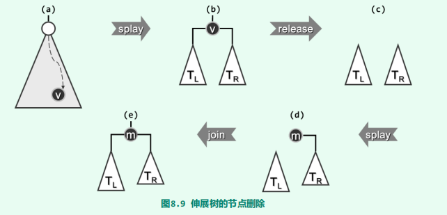

# Splay Tree

## 查找

- 注意 `zig-zig`与AVL树中的旋转是有所不同的，因此在这种情况下不能使用`connect34()`

~~~java
/**
 * 节点q作为p的左孩子插入
 */
private void attachAsLeftChild(BinaryTreeNode<T> p, BinaryTreeNode<T> q) {
    p.leftChild = q;
    if (q != null) q.parent = p;
}

/**
 * 节点q作为p的右孩子插入
 */
private void attachAsRightChild(BinaryTreeNode<T> p, BinaryTreeNode<T> q) {
    p.rightChild = q;
    if (q != null) q.parent = p;
}
~~~

~~~java

/**
 * 将节点v伸展至树根，会修改整棵树的高度
 * @param v 要伸展的节点
 * @return 返回伸展后的树的根节点，即参数v
 */
private BinaryTreeNode<T> splay(BinaryTreeNode<T> v) {
    if (v == null) return null;
    BinaryTreeNode<T> p;
    BinaryTreeNode<T> g;
    while ((p = v.parent) != null && (g = p.parent) != null) {
        BinaryTreeNode<T> gg = g.parent;
        if (BinaryTreeNode.isLeftChild(v)) {
            if (BinaryTreeNode.isLeftChild(p)) {            //zig-zig，不可以用connect34代替
                attachAsLeftChild(g, p.rightChild);
                attachAsLeftChild(p, v.rightChild);
                attachAsRightChild(p, g);
                attachAsRightChild(v,p);
            } else {                                        //zig-zag，这里可以用connect34代替
                attachAsLeftChild(p,v.rightChild);
                attachAsRightChild(g,v.leftChild);
                attachAsLeftChild(v, g);
                attachAsRightChild(v, p);
            }
        } else {
            if (BinaryTreeNode.isLeftChild(p)) {            //zag-zag
                attachAsRightChild(p, v.leftChild);
                attachAsLeftChild(g,v.rightChild);
                attachAsRightChild(v, g);
                attachAsLeftChild(v, p);
            } else {                                        //zag-zig
                attachAsRightChild(p,v.leftChild);
                attachAsRightChild(p,v.leftChild);
                attachAsLeftChild(p, g);
                attachAsLeftChild(v,p);
            }
        }

        v.parent = gg;
        if (gg != null) {
            if (g == gg.leftChild) {
                attachAsLeftChild(gg, v);
            } else {
                attachAsRightChild(gg, v);
            }
        }
        updateHeight(g);
        updateHeight(p);
        updateHeight(v);
    }
    //此时g一定为null，p可能为null
    if (p != null) {    //如果p不为null，那么再进行一次单旋
        if (BinaryTreeNode.isLeftChild(v)) {
            attachAsLeftChild(p,v.rightChild);
            attachAsRightChild(v, p);
        } else {
            attachAsRightChild(p,v.leftChild);
            attachAsLeftChild(v, p);
        }
        updateHeight(p);
        updateHeight(v);
        v.parent = null;
    }
    return v;
}
~~~

~~~java
/**
 * 查找指定元素，并将元素推至到树根。同时会修改整个树的高度以及成员root
 * @param element 待查找的元素
 * @return 返回树根root
 */
@Override
public BinaryTreeNode<T> search(T element) {
    BinaryTreeNode<T> p = search(root, element);
    return root = splay(p == null ? hot : p);
}
~~~

## 插入

以上接口Splay::search()已集成了splay()伸展功能，故查找返回后，树根节点要么等于查找目标（查找成功）；要么就是hot，而且恰为拟插入节点的直接前驱或直接后继（查找失败）。因此，不妨改用如下方法实现Splay::insert()接口。

~~~java
@Override
public BinaryTreeNode<T> insert(T element) {
    if (root == null) {     //处理空树的退化情况
        size += 1;
        return root = new BinaryTreeNode<T>(element, null);
    }
    //if (search(element) != null) 是错误的，因为覆写了search方法，返回值有所变化
    if (search(element).data.compareTo(element) == 0) {      //若元素已存在
        return root;
    }

    size += 1;
    BinaryTreeNode<T> t = root;
    if (root.data.compareTo(element) < 0) {
        t.parent = root = new BinaryTreeNode<T>(element, null, t, t.rightChild);
        if (BinaryTreeNode.hasRightChild(t)) {
            t.rightChild.parent = root;
            t.rightChild = null;
        }
    } else {
        t.parent = root = new BinaryTreeNode<T>(element, null, t.leftChild, t);
        if (BinaryTreeNode.hasLeftChild(t)) {
            t.leftChild.parent = root;
            t.leftChild = null;
        }
    }
    updateHeight(t);
    return root;
}
~~~

## 删除

然而同样地，在实施删除操作之前，通常都需要调用Splay::search()定位目标节点，而该接口已经集成了splay()伸展功能，从而使得在成功返回后，树根节点恰好就是待删除节点。因此，亦不妨改用如下策略，以实现Splay::remove()接口。

~~~java
 @Override
public boolean remove(T element) {
    if (root == null
        || search(element).data.compareTo(element) != 0) {
        //1. 空树的退化情况
        //2. 未查找到元素
        return false;
    }

    if (!BinaryTreeNode.hasLeftChild(root)) {       //左子树不存在
        root = root.rightChild;
        if (root != null)            //右子树可能不存在
            root.parent = null;
    } else if (!BinaryTreeNode.hasRightChild(root)) {       //左子树存在，但是右子树不存在
        root = root.leftChild;
        root.parent = null;
    } else {                //左子树和右子树都存在
        BinaryTreeNode<T> leftTree = root.leftChild;
        root.leftChild = null;      //暂时将左子树切除
        root = root.rightChild;
        root.parent = null;
        search(element);            //必然会查找失败，此时树根root会被修改为hot
        root.leftChild = leftTree;
        leftTree.parent = root;
    }
    size -= 1;
    if (root != null)
        updateHeight(root);     //拼接左子树后要手动更新高度
    return true;
}
~~~

