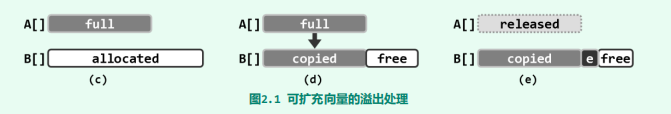
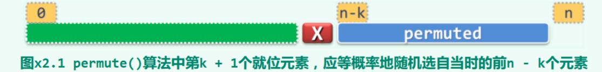
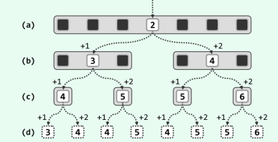
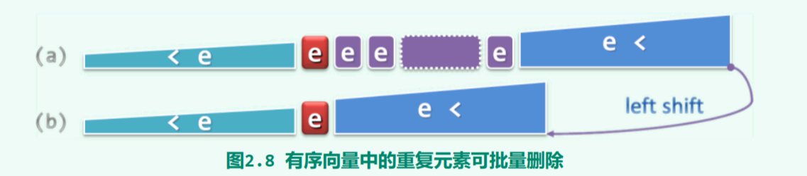
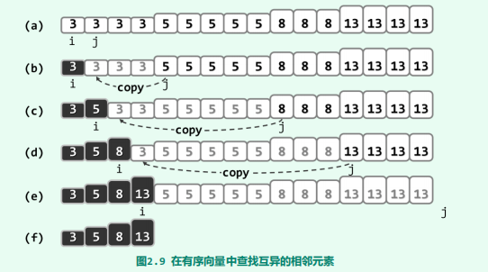

# 向量

[TOC]

## 理论

### 数组

首先我们先考察数组这个数据结构：若集合$S$由相同类型的$n$个元素组成，且各元素之间具有一个线性次序，同时它们依次存放于起始于地址$A$、物理位置连续的一段存储空间，这称作**数组（array）**

其中，对于任何$0 \le i < j$，$A[i]$都是$A[j]$的**前驱（predecessor）**；$A[j]$都是$A[i]$的**后继（successor）**。特别地，对于任何$i \ge 1$，$A[i - 1]$称作$A[i]$的**直接前驱（immediate predecessor）**；对于任何，$A[i + 1]$称作$A[i]$的**直接后继（immediate successor）**。

任一元素的所有前驱构成其**前缀（prefix）**，所有后继构成其**后缀（suffix）**。

我们发现数组具有以下特性：

- 若数组A[]存放空间的起始地址为A，且每个元素占用s个单位的空间，则元素A[i]对应的物理地址为$A + i * s$，即元素的物理地址与其下标之间满足这种线性关系。

### 向量

我们对此做一般性推广，使得使得上述特性更具普遍性。**向量（vector）**就是线性数组的一种抽象与泛化，它也是由具有线性次序的一组元素构成的集合$V = \{ v_0, v_1, ..., v_{n-1} \}$​，且具有上述特性，但不再限定同一向量中的各元素都属于同一类型。因为元素类型不一样，所以其中的元素分别由秩相互区分。另外，各元素也不见得同时具有某一数值属性，故而并不保证它们之间能够相互比较大小。

如果任何两个元素之间具有可比性，那么我们称该向量为**有序向量**

## 实现

出于算法效率、讲解重点以及叙述简洁的优先考虑，这里我们只关注数据结构本身，对于参数检查等工作留给上层调用例程处理。在充分掌握了本书的内容之后，读者不妨再按照软件工程的规范，就此做进一步的完善。

### 数据成员

~~~java
final public class Vector<T> {
    private static final int DEFAULT_CAPACITY = 47;     //默认初始容量
    private int size;                                   //当前有效元素的数量
    private int capacity;                               //容量
    T[] data;                                           //数据
    final static private Random rand = new Random(System.currentTimeMillis());    //随机器，用于置乱算法中
}
~~~

### 扩容

若内部数组所占物理空间的容量，在向量的生命期内不允许调整，则称作**静态空间管理策略**。既然容量固定，总有那么可能在此后的某一时刻，无法加入更多的新元素——即导致所谓的**上溢（overflow）**。

如何解决上溢问题呢？在静态空间管理策略下，只能事先预留空间而为降低这种风险，但也很难界定一个合理的预留量。为此，我们改用动态空间管理策略。在该策略下，有一个衡量空间利用率的重要指标——**装填因子（load factor）**，即向量实际规模与其内部数组容量的比值（即$size/ capacity$）。

上溢问题在动态空间管理策略下可以用扩容方案来解决，扩容的大小则根据期望的装载因子来决定。

~~~java
private void expand() {
    if (size < capacity) return;            //未发生上溢，不进行扩容
    capacity = capacity << 1;
    if (capacity < DEFAULT_CAPACITY) capacity = DEFAULT_CAPACITY;
    Object[] oldData = data;
    data = (T[])new Object[capacity];
    System.arraycopy(oldData,0, data, 0, size);
}
~~~

下面我们分析一下扩容的时间代价。每一次由n到2n的扩容，都需要花费$O(2n) = O(n)$时间。表面看来，这一扩容策略似乎效率很低，但这不过是一种错觉，扩容实际上只需花费$$O(1)$$分摊时间。推导过程如下：

1. 假设向量的初始容量为常数N，且初始规模也为N——即将溢出
2. 不妨考察最坏的情况，连续进行n次insert()操作，其中n > N
3. 定义以下函数
   - size(n) = n + N，连续插入n个元素后向量的规模
   - capacity(n)，连续插入n个元素后向量的容量
   - T(n)，连续插入n个元素而花费的扩容时间
4. 我们这里采用“懒惰”策略只有在的确即将发生溢出时，才不得不将容量加倍，所以有$$size(n) \leq capacity(n) < 2 * size(n)$$，那么渐进意义上有$capacity(n) = \Theta(n)$
5. 因此有 $T(n) = 2N + 4N + ... + capacity(n) < 2 * capacity(n) = \Theta(n)$，这里2N是第一次扩容所花费的时间，以此类推。
6. 将其分摊到其间的连续n次操作，单次操作所需的分摊运行时间应为*O*(1)

> 平均运行时间（average running time）是按照某种假定的概率分布，对各种情况下所需执行时间的加权平均。而分摊运行时间（amortized running time）则要求参与分摊的操作必须构成和来自一个真实可行的操作序列，而且该序列还必须足够地长。

### 缩容

当装填因子低于某一阈值时，我们称数组发生了**下溢（underflow）**。尽管下溢不属于必须解决的问题，但在格外关注空间利用率的场合，发生下溢时也有必要适当缩减内部数组容量。下面给出了一个动态缩容shrink()算法：

~~~java
private void shrink() {
    if (capacity < DEFAULT_CAPACITY * 2         //避免收缩到DEFAULT_CAPACITY以下
    || size * 4 > capacity)                     //以25%作为装填因子的下限
        return;
    Object[] oldData = data;
    capacity /= 2;
    data = (T[])new Object[capacity];
    System.arraycopy(oldData, 0, data, 0, size);
}
~~~

这里以25%作为装填因子的下限，但在实际应用中，为避免出现频繁交替扩容和缩容的情况，可以选用更低的阈值，甚至取作0（相当于禁止缩容）。

### 置乱

在软件测试、仿真模拟等应用中，随机向量的生成都是一项至关重要的基本操作，直接影响到测试的覆盖面或仿真的真实性

~~~java
private void unsort(int left, int right) {
    for (int i = right; i > left; i--) {
        swap(this, i - 1, rand.nextInt(i) + left);
    }
}
~~~

下面我们将会证明不仅可以枚举出同一向量所有可能的排列，而且能够保证生成各种排列的概率均等

Lemma1：通过反复调用permute()算法，可以生成向量$[0, n)$所有的$n!$排列

1. 当$n = 1$时，显然成立

2. 假设$n = k$时成立，考察$n = k + 1$的情况，并任取排列$V[a_1], ... , V[a_{k - 1}], V[a_k]$

3. 在第一轮交换时，总是有可能将$V[k]$与$V[a_k]$交换，交换后得

   $V[1], ..., V[a_k - 1], V[k], V[a_k + 1], ..., V[a_k]$

4. 接下来，算法是从$V[1], ..., V[a_k - 1], V[k], V[a_k + 1], ..., V[k - 1]$开始。由归纳性假设知，可以置乱为$V[a_1], ... , V[a_{k - 1}]$，因此归纳成立

Lemma2：置乱后，各个元素处于任意位置的概率均为$1/n$

1. 显然，置乱后，$V[a_k]$必以等概率$1/n$来选择原向量中的各个元素

2. 假设命题置乱后的对前k个($0\leq k < n$)元素成立，即它们各自都以$1/n$的概率取自原向量中的各个元素，现在考察下一个元素$X = V[a_{n-k-1}]$

   

3. 元素X应随机地选自此时前n－k个元素（包含其自身）且其中各元素被选中的概率均为1/(n-k)

4. 此时，原向量中的任何一个元素，都有$（n－k)／n$的概率成为**此时**前n－k个中的元素。

5. 综上原向量中的每一个元素交换至$V[a_{n-k-1}]$的概率是 $\frac{n-k}{n} * \frac{1}{n - k} = 1/n$

命题：生成各种排列的概率均等

1. 既然以上已经证明，原向量中各元素最终就位于各位置的概率均等，permute()算法就应以相等的概率，随机地生成所有可能的排列。对于规模为n的向量，可能的排列共计n！种，故概率分别为1/n！

### 查找

查找要求元素必须支持判等操作！

#### 顺序查找

~~~java
public int find(T element, int left, int right) {
    while ((left < right--) && !(element.equals(data[right])))
        ;
    return right;
}
~~~

当同时有多个匹配的元素时，约定返回其中秩最大者。查找失败返回left - 1

>最坏情况下，运行时间为*O*(n)。最好情况下，仅需*O*(1)时间。对于规模相同、内部组成不同的输入，渐进运行时间却有本质区别，故此类算法也称作输入敏感的（input sensitive）算法。

#### 二分查找

~~~java
public static <T extends Comparable<T>>
int binarySearch(Vector<T> vector, T element, int left, int right) {
    while (left < right) {
        int mid = (left + right) >> 1;
        int result = vector.data[mid].compareTo(element);
        if (result > 0) {
            right = mid;
        } else if (result < 0) {
            left = mid + 1;
        } else {
            return mid;
        }
    }
    return -1;
}
~~~

查找区间宽度将以几何级数的速度递减，故时间复杂度为$\Omicron(logn)$。

另一方面，查找算法的整体效率也主要地取决于其中所执行的元素大小比较操作的次数，即所谓**查找长度（search length）**

我们计算成功情况下平均查找长度：

1. 不妨假设有序向量的长度为$n = 2^{k} - 1$，记$C_{average}(k)$为平均查找长度，而$C(k)$为所有元素的查找长度总和，那么有$C(k) = C_{average}(k) * (2^k - 1)$

2. 显然有，$C(1) = C_{average}(1) = 2$

3. 我们不难发现以下递推式：
   $$
   C(k) = [C(k - 1) + 2^{k-1} - 1] + 2 + [C(k - 1) + 2*(2^{k - 1} - 1)]
   $$
   其中，第一个中括号表示进入左侧分支，第二个中括号表示进入右侧分支，中间的$2$表示查找成功。

   即

   
   $$
   C(k) = 2*C(k - 1) + 3 * 2^{k-1} - 1
   $$

4. 于是有
   $$
   C(k) - 3k * 2^{k-1} - 1 = 2*[C(k-1) - 3(k-1)*2^{k-2} -1]
   $$
5. 令$F(k) = C(k) - 3n * 2^{k-1} - 1$，因此有
   $$
   F(k) = 2F(k-1) = ... = 2^{k-1}*F(1) = -2^k
   $$

5. 所以
   $$
   \begin{align}
   C(k) &= F(k) + 3k * 2^{k-1} + 1 \\
   &= (\frac{3k}{2} - 1) * (2^k - 1) + \frac{3n}{2}
   \end{align}
   $$

6. 进而
   $$
   \begin{align}
   C_{average}(k)& = \frac{C(k)}{2^k - 1}\\
   &=\frac{3k}{2} - 1 + \frac{3k}{2 * (2^k - 1)} \\
   &=\frac{3k}{2} - 1 + \Omicron(\epsilon)
   \end{align}
   $$
   

也就是说若忽略末尾趋于收敛的波动项，平均查找长度应为
$$
\Omicron(1.5k) = \Omicron(1.5log_2n)
$$

仿照以上对平均成功查找长度的递推分析方法，不难证明（习题[2-20]），一般情况下的平均失败查找长度亦为$\Omicron(1.5log_2n)$

### 插入

~~~java
public int insert(T element, int rank) {
    expand();
    System.arraycopy(data, rank, data, rank + 1, size - rank);
    data[rank] = element;
    size += 1;
    return rank;
}
~~~

### 删除

~~~java
public int remove(int left, int right) {
    int length = right - left;
    System.arraycopy(data, left, data, right, length);
    size -= length;
    shrink();
    return length;
}
~~~

### 唯一化

有很多场合要求数据元素互异

#### 无序

~~~java
public int deduplicate() {
    int oldSize = size;
    for (int index = 1; index < size; index++) {
        if (find((T)data[index], 0, index) != -1) {
            remove(index);
            index -= 1;
        }
    }
    return oldSize - size;
}
~~~

#### 有序

利用元素的有序性，可以以区间为单位批量地删除元素

~~~java
public static <T extends Comparable<T>> int uniquify(Vector<T> vector) {
    // 双指针法
    int first = 0;
    int second = 0;
    while (++second < vector.size) {
        if (vector.data[first].compareTo(vector.data[second]) != 0) {
            vector.data[++first] = vector.data[second];
        }
    }
    vector.size = first + 1;
    vector.shrink();
    return second - first;
}
~~~

### 遍历

~~~java
public void traverse(Consumer<T> consumer) {
    for (int index = 0; index < size; index++) {
        consumer.accept((T)data[index]);
    }
}
~~~

