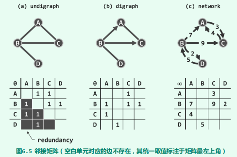
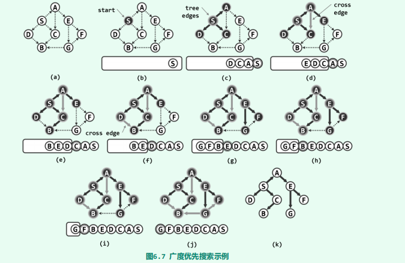
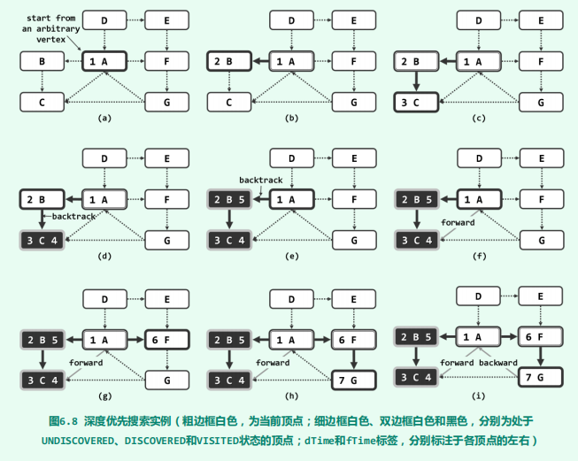
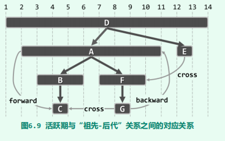

# 图

[TOC]

## 概念

图可以表示一般的二元关系，因此从从数据结构的角度分类，它属于**非线性结构（non-linear structure）**。

**图（graph）**，可定义为G = (V, E)。其中，集合V中的元素称作**顶点（vertex）**；集合E中的元素分别对应于V中的某一对顶点(u, v)，表示它们之间存在某种关系，故亦称作**边（edge）**。从计算的需求出发，我们约定V和E均为有限集，通常将其规模分别记n = |V|和e = |E|。

若边(u, v)所对应顶点u和v的次序无所谓，则称作**无向边（undirected edge）**反之若u和v不对等，则称**(u, v)为有向边（directed edge）**。有向边(u, v)从u指向v，其中u称作该边的**起点（origin）**或尾顶点（tail），而v称作该边的**终点（destination）**或头顶点（head）。

若E中各边均无方向，则G称作**无向图（undirected graph，简称undigraph）**。若E中只含有向边，则G称作**有向图（directed graph，简称digraph）**。若E同时包含无向边和有向边，则G称作**混合图（mixed graph）**。相对而言，有向图的通用性更强，因为无向图和混合图都可转化为有向图。

任何边e = (u, v)，称顶点u和v彼此**邻接（adjacent）**，互为邻居；而它们都与边e彼此**关联（incident）**。在无向图中，与顶点v关联的边数，称作v的**度数（degree）**，记作deg(v)。

对于有向边e = (u, v)，e称作u的**出边（outgoing edge）**、v的**入边（incoming edge）**。v的出边总数称作其**出度（out-degree）**，记作outdeg(v)；入边总数称作其**入度（in-degree）**，记作indeg(v)。

连接于同一顶点v之间的边(v, v)，称作**自环（self-loop）**，不含任何自环的图称作**简单图（simple graph）**，也是本书主要讨论的对象。

所谓**路径**或**通路（path）**，就是由m + 1个顶点与m条边交替而成的一个序列：
$$
\pi = \{v_0, e_1, v_1, e_2, ..., e_m, v_m\} \quad \forall0 < i \leq m,e_i=(v_{i-1}, v_i)
$$
其中沿途边的总数$m$，亦称作通路的长度，记作$|\pi| = m$。也可以简化表述为
$$
\pi = \{v_0, v_1, ... ,v_m\}
$$
沿途顶点互异的通路，称作**简单通路（simple path）**。

对于长度$m \geq1$的通路$\pi$，若起止顶点相同（即$v_0 = v_m$），则称作**环路（cycle）**。若沿途除$v_0 = v_m$外所有顶点均互异，则称作**简单环路（simple cycle）**。

不含任何环路的有向图，称作**有向无环图（directed acyclic graph, DAG）**。

经过图中各边一次且恰好一次的环路，称作**欧拉环路（Eulerian tour）**。经过图中各顶点一次且恰好一次的环路，称作**哈密尔顿环路（Hamiltonian tour）**

可以为每一条边$e$指定一个权重$W(e)$​。各边均带有权重的图，称作**带权图（weighted graph）**或带权网络（weighted network），有时也简称**网络（network）**，记作$G(V, E, W)$。

## 数据结构

图算法的时间、空间性能，却与图结构的具体实现方式紧密相关。

~~~java
class Vertex<T> {
    T data;             //数据域
    int inDegree;       //入度
    int outDegree;      //出度
    VStatus status;     //遍历时的状态
    int dTime;          //时间戳
    int fTime;          //时间戳
    int parent;         //在遍历树中的父节点
    int priority;       //在遍历树中的优先级

    private void init() {
        status = VStatus.UNDISCOVERED;
        dTime = -1;
        fTime = -1;
        parent = -1;
        priority = Integer.MAX_VALUE;
    }
    Vertex(T data) {
        this.data = data;
        init();
    }
    Vertex() {
        init();
    }
}
~~~

~~~java
class Edge<T> {
    T data;             // 数据域
    int weight;     	// 权重
    EType type;         // 边的类型
    int v;              // 关联节点，用于邻接表中

    Edge(T data, int weight) {
        this.data = data;
        this.weight = weight;
        type = EType.UNDETERMINED;
    }

    Edge(T data, int weight, int v) {
        this(data, weight);
        this.v = v;
    }
}
~~~

~~~java
//顶点状态
enum VStatus {
    UNDISCOVERED,				//还未被访问到
    DISCOVERED,					//被访问到，但是它至少有一个邻居未被访问到
    VISITED;					//被访问到，它所有的邻居也都被访问到
}

//边在遍历树中所属的类型
enum EType {
    UNDETERMINED,
    TREE,
    CROSS,
    FORWARD,
    BACKWARD;
}
~~~

### 邻接矩阵

**邻接矩阵（adjacency matrix）**是图ADT最基本的实现方式：使用方阵`A[n][n]`表示由n个顶点构成的图，其中每个单元，各自负责描述一对顶点之间可能存在的邻接关系

~~~java
public class GraphMatrix<VertexType, EdgeType>
    extends Graph<VertexType, EdgeType> {
    
    Vector<Vertex<VertexType>> V;       		//顶点集（向量）
    Vector<Vector<Edge<EdgeType>>> E;         	//边集（邻接矩阵）

    public GraphMatrix() {
        V = new Vector<Vertex<VertexType>>();
        E = new Vector<Vector<Edge<EdgeType>>>();
    }
	
    //顶点的get、set方法
    @Override public VertexType vertex(int i) { return V.get(i).data; }
    @Override public int inDegree(int i) { return V.get(i).inDegree; }
    @Override public int outDegree(int i) { return V.get(i).outDegree; }
    @Override public VStatus status(int i) { return V.get(i).status; }
    @Override public void status(int i, VStatus status) {V.get(i).status = status;}
    @Override public int dTime(int i) { return V.get(i).dTime; }
    @Override public void dTime(int i, int time) { V.get(i).dTime = time;}
    @Override public int fTime(int i) { return V.get(i).fTime; }
    @Override public void fTime(int i, int time) { V.get(i).fTime = time;}
    @Override public int parent(int i) { return V.get(i).parent; }
    @Override public void parent(int i, int parent) {V.get(i).parent = parent;}
    @Override public int priority(int i) { return V.get(i).priority; }
    @Override public void priority(int i, int priority) { V.get(i).priority = priority;}

    @Override
    public Iterator<Integer> getIteratorOfNode(int i) {
        return new Iterator<Integer>() {
            int index = 0;
            @Override
            public boolean hasNext() {
                return index != n;
            }
            @Override
            public Integer next() {
                while (!exists(i, index)) index += 1;
                return index++;
            }
        };
    }

    @Override public boolean exists(int i, int j) {return E.get(i).get(j) != null;}
    //edge的set、get方法
    @Override public EType type(int i, int j) {return E.get(i).get(j).type;}
    @Override public void type(int i, int j, EType type) {E.get(i).get(j).type = type;}
    @Override public EdgeType edge(int i, int j) {return E.get(i).get(j).data;}
    @Override public int weight(int i, int j) {return E.get(i).get(j).weight;}

	//插入一个顶点
    @Override
    public int insert(VertexType data) {
        for (int j = 0; j < n; j++)
            E.get(j).insert(null);
        n++;
        E.insert(new Vector<Edge<EdgeType>>(n, n));
        return V.insert(new Vertex<VertexType>(data));
    }

	//删除一个顶点
    @Override
    public VertexType remove(int i) {
        //先删(j, i)边
        for (int j = 0; j < n; j++) {
            if (exists(j, i)) {
                V.get(j).outDegree -= 1;
            }
            E.get(j).remove(i);
        }
        //再删(i, j)边
        for (int j = 0; j < n; j++) {
            if (exists(i, j)) {
                V.get(j).inDegree -= 1;
            }
        }
        E.remove(i);
        n -= 1;            
        return V.remove(i).data;
    }

	//插入一条边
    @Override
    public void insert(EdgeType edge, int w, int i, int j) {
        if (exists(i,j)) return;
        E.get(i).insert(new Edge<>(edge, w), j);

        //更新边计数与关联顶点的度数
        e++;
        V.get(i).outDegree += 1;
        V.get(j).inDegree += 1;
    }

	//删除一条边
    @Override
    public EdgeType remove(int i, int j) {
        if (!exists(i,j)) return null;
        EdgeType edge = E.get(i).get(j).data;
        E.get(i).set(null, i);
        //更新边计数与关联顶点的度数
        e--;
        V.get(i).outDegree--;
        V.get(j).inDegree--;
        return edge;
    }

}
~~~

得益于向量，边的静态和动态操作也仅需$O(1)$时间（删除一条边仅仅是将矩阵元素设置为`null`即可）。但是，顶点的动态操作接口均十分耗时。为了插入新的顶点，顶点集向量V[]需要添加一个元素；边集向量E[][]也需要增加一行，且每行都需要添加一个元素。顶点删除操作，亦与此类似。同时空间复杂度为$O(n^2 )$。

### 邻接表

然而实际应用所处理的图，所含的边通常远远少于$O(n^2 )$。比如在的**稀疏图（sparse graph）**中，边数渐进地不超过$O(n)$，仅与顶点总数大致相当。由此可见，邻接矩阵的空间效率之所以低，是因为其中大量单元所对应的边，通常并未在图中出现。我们可以使用向量来代替列表来解决这利用率低的问题。

~~~java
public class GraphAdjacencyList<VertexType, EdgeType>
    extends Graph<VertexType, EdgeType>{

    Vector<List<Edge<EdgeType>>> E;             //边集
    Vector<Vertex<VertexType>> V;               //点集
	
    //顶点的get、set方法
    @Override public VertexType vertex(int i) {return V.get(i).data;}
    @Override public int inDegree(int i) {return V.get(i).inDegree;}
    @Override public int outDegree(int i) {return V.get(i).outDegree;}
    @Override public VStatus status(int i) {return V.get(i).status;}
    @Override public void status(int i, VStatus status) {V.get(i).status = status;}
    @Override public int dTime(int i) {return V.get(i).dTime;}
    @Override public void dTime(int i, int time) {V.get(i).dTime = time;}
    @Override public int fTime(int i) {return V.get(i).fTime;}
    @Override public void fTime(int i, int time) {V.get(i).fTime = time;}
    @Override public int parent(int i) {return V.get(i).parent;}
    @Override public void parent(int i, int parent) {V.get(i).parent = parent;}
    @Override public int priority(int i) {return V.get(i).priority;}
    @Override public void priority(int i, int priority) {V.get(i).priority = priority;}

    @Override
    public Iterator<Integer> getIteratorOfNode(int i) {
        return new Iterator<Integer>() {
            Iterator<List.ListNode<Edge<EdgeType>>> iterator = E.get(i).iterator();
            @Override public boolean hasNext() {return iterator.hasNext();}
            @Override public Integer next() {return iterator.next().data().v;}
        };
    }

    @Override
    public boolean exists(int i, int j) {
        Iterator<Integer> iterator = getIteratorOfNode(i);
        while (iterator.hasNext()) {
            if (iterator.next() == j) return true;
        }
        return false;
    }

    @Override
    public EType type(int i, int j) {
        for (var temp : E.get(i)) {
            if (temp.data().v == j) {
                return temp.data().type;
            }
        }
        return null;
    }

    @Override
    public void type(int i, int j, EType type) {
        for (var temp : E.get(i)) {
            if (temp.data().v == j) {
                temp.data().type = type;
                break;
            }
        }
    }

    @Override
    public EdgeType edge(int i, int j) {
        for (var temp : E.get(i)) {
            if (temp.data().v == j) {
                return temp.data().data;
            }
        }
        return null;
    }

    @Override
    public int weight(int i, int j) {
        for (var temp : E.get(i)) {
            if (temp.data().v == j) {
                return temp.data().weight;
            }
        }
        return Integer.MIN_VALUE;
    }

    @Override
    public int insert(VertexType data) {
        n += 1;
        return V.insert(new Vertex<>(data));
    }

    @Override
    public VertexType remove(int i) {
        //先删边(j, i);
        for (int j = 0; j < V.size(); j++) {
            if (j == i) continue;
            for (var temp : E.get(j)) {
                if (temp.data().v == j) {
                    V.get(j).outDegree -= 1;
                    E.get(j).remove(temp);
                }
            }
        }

        //再删边(i, j)
        for (int j = 0; j < E.get(i).size(); i++) {
            V.get(j).inDegree -= 1;
        }
        E.remove(i);
        n -= 1;
        return V.remove(i).data;
    }

    //插入一条边
    @Override
    public void insert(EdgeType edge, int w, int i, int j) {
        e += 1;
        E.get(i).insertAsFirst(new Edge<>(edge, w, j));
    }

    //删除一条边
    @Override
    public EdgeType remove(int i, int j) {
        e -= 1;
        return E.get(i).remove(j).data;
    }
}
~~~

邻接表所含列表数等于顶点总数$n$，每条边在其中仅存放一次（有向图）或两次（无向图），故空间复杂度为故空间总量为$O(n + e)$。

当然，空间性能的这一改进，需以某些方面时间性能的降低为代价。exists(v, u)需在v对应的列表中顺序查找，共需$O(n)$时间。顶点的插入操作，可在$O(1)$完成。顶点的删除操作，仍需遍历所有邻接表，共需$O(e)$时间。

尽管邻接表访问单条边的效率并不算高，却十分擅长于以批量方式，即处理同一顶点的所有关联边。在以下图遍历等算法中，这是典型的处理流程和模式。比如，为枚举从顶点v发出的所有边，现在仅需$\Theta(1 + outDegree(v))$而非$\Theta(n)$时间。故总体而言，邻接表的效率较之邻接矩阵更高。

## 搜索

图算法是个庞大的家族，其中大部分成员的主体框架，都可归结于图的遍历（图搜索）。实际上，无论采用何种策略，图的遍历都可理解为，**将非线性结构转化为半线性结构的过程**。经遍历而确定的边类型中，最重要的一类即所谓的树边，它们与所有顶点共同构成了原图的一棵支撑树（森林），称作**遍历树（traversal tree）**。各种图搜索之间的区别，体现为边分类结果的不同，以及所得遍历树（森林）的结构差异。其决定因素在于，搜索过程中的每一步迭代，将依照何种策略来选取下一接受访问的顶点。

无论是深度优先、广度优先还是最佳优先，它们的时间复杂度为$\Omicron(n + e)$。

图遍历对于无向图必能覆盖s所属的**连通分量（connected component）**，对于有向图必能覆盖以s为起点的**可达分量（reachable component）**。倘若还有来自其它连通分量或可达分量的顶点，则不妨从该顶点出发，重复上述过程，这样就可以得到一个森林。

### 广度优先

**广度优先搜索（breadth-first search, BFS）**采用的策略：**越早被访问到的顶点，其邻居越优先被选用**。

在所有已访问到的顶点中，所有尚未访问其全部邻居的顶点构成所谓的**波峰集（frontier）**。于是，BFS搜索过程也可等效地理解为：**反复从波峰集中找到最早被访问到顶点v，若其邻居均已访问到，则将其逐出波峰集；否则，随意选出一个尚未访问到的邻居，并将其加入到波峰集中**。

不难发现，若将上述BFS策略应用于树结构，则效果等同于层次遍历。

~~~java
//上层主函数bfs()的作用，正在于处理多个连通分量或可达分量并存的情况
public void bfs(int s) {
    reset();
    int k = s;
    MutableInteger clock = new MutableInteger();
    do {
        if (status(k) == VStatus.UNDISCOVERED) {
            bfs(s, clock);
        }
    } while (s != (k = (k + 1) % n));
}

private void bfs(int s, MutableInteger clock) {
    Queue<Integer> queue = new Queue<>();
    queue.enqueue(s);
    status(s,VStatus.DISCOVERED);
    while (!queue.empty()) {
        s = queue.dequeue();
        dTime(s, clock.getAndAdd(1));
        for (var iterator = getIteratorOfNode(s);
             iterator.hasNext();) {
            int x = iterator.next();
            if (status(x) == VStatus.UNDISCOVERED) {
                status(x, VStatus.DISCOVERED);
                queue.enqueue(x);
                type(s, x, EType.TREE);
                parent(x, s);				//遍历树根节点的父亲并不会从这里设置，而是从reset中设置，即为-1
            } else {					   //已经被访问到了，状态为DISCOVERED或者VISITED
                type(s, x, EType.CROSS);
            }
        }
        status(s, VStatus.VISITED);
    }
}
~~~

~~~java
private void reset() {
    for (int i = 0; i < n; i++) {
        status(i, VStatus.UNDISCOVERED);
        dTime(i, -1);
        fTime(i, -1);
        parent(i, -1);
        priority(i, Integer.MAX_VALUE);
        for (int j = 0; j < n; j++) {
            if (exists(i, j)) {
                type(i, j, EType.UNDETERMINED);
            }
        }
    }
}
~~~

### 深度优先

深度优先搜索（Depth-First Search, DFS）选取下一顶点的策略：**优先选取最后一个被访问到的顶点的邻居**

故各顶点被访问到的次序，类似于树的先序遍历（5.4.2节）；而各顶点被访问完毕的次序，则类似于树的后序遍历（5.4.4节）。

~~~java
public void dfs(int s) {
    int v = s;
    status(s, VStatus.DISCOVERED);
    //这里将int封装成MutableInteger主要是为了模拟 C++中的 int& clock。
    //这样clock可以在多次调用dfs之间保持同步。
    MutableInteger clock = new MutableInteger();
    do {
        if (status(v) == VStatus.UNDISCOVERED)
            dfs(v, clock);
    } while (s != (v = (v + 1) % n));
}

private void dfs(int s, MutableInteger clock) {
    dTime(s, clock.getAndAdd(1));
    status(s, VStatus.DISCOVERED);
    for (var iterator = getIteratorOfNode(s);
         iterator.hasNext();) {
        int v = iterator.next();
        switch (status(v)) {
            case DISCOVERED :
                type(s, v, EType.BACKWARD);
                break;
            case VISITED :
                type(s, v, (dTime(s) < dTime(v) ? EType.FORWARD : EType.CROSS));
                break;
            case UNDISCOVERED :
                type(s,v,EType.TREE);
                parent(v, s);
                dfs(v, clock);
                break;
        }
    }
    status(s, VStatus.VISITED);
    clock.add(1);
    fTime(s, clock.value());
}
~~~

下面我们探讨一下这些边的类型在DFS遍历树中的意义：

这里为每个顶点v都记录了被发现的和访问完成的时刻，对应的时间区间$[dTime(v), fTime(v)]$均称作v的**活跃期（active duration）**。

考虑边(v,u)，有以下命题成立：

1. 若顶点u处于UNDISCOVERED状态，则边(v, u)为**树边（tree edge）**。

2. 若顶点u处于DISCOVERED状态，则意味着在此处发现一个有向环路。此时，在DFS遍历树中u必为v的祖先，故应将边(v, u)归类为**后向边（back edge）**。

3. 若顶点u处于VISITED状态：
   1. $[dTime(u), fTime(u)] \subset [dTime(v), fTime(v)]$当且仅当v是u的祖先。此时边(v,u)归类为**前向边（forward edge）**。
   2. $[dTime(u), fTime(u)] \cap [dTime(v), fTime(v)] = \empty$当且仅当v与u无祖先关系。此时边(v, u)归类为**跨边（cross edge）**。

证明命题3.1：

- 先证$\Rightarrow$，因为$dTime(u) > dTime(v)$，这说明当u处于DISCOVERED状态时，v已经处于DISCOVERED。所以既不可能v、u无祖先关系，也不可能v是u的孩子
- 再证$\Leftarrow$，因为v是u的祖先，所以遍历次序应该是"v被发现 ... u被发现....u访问完毕....v访问完毕"（算法的实现确保这一点）。这也就是说u的活跃期包含于v的活跃期。

证明命题3.2：

- $\Rightarrow$：3.1的$\Rightarrow$表明在任意顶点被发现时，其后代顶点u都应该处于UNDISCOVERED状态。所以显然成立
- 用反证法证明$\Leftarrow$。不妨设$dTime(v) < dTime(u) < fTime(v)$，那么必有一条从v到u的路径。这与条件矛盾。

证明命题2：

- 由题所述条件，可知必有：$dTime(u) < dTime(v) < fTime(u)$
- 由命题3.1推知$dTime(u) < dTime(v) < fTime(v) < fTime(u)$

### 最佳优先

## 图算法

基于BFS搜索，可有效地解决连通域分解）、最短路径等问题  

### Case1：拓扑排序

### Case2：双连通域分解

### Case3：连通域分解

### Case4：最短路径

### Case5：最小支撑树

