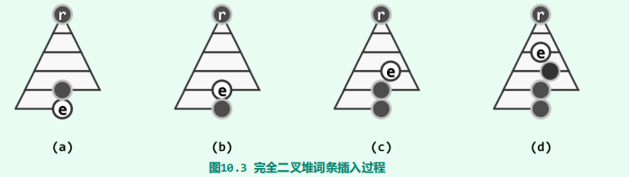
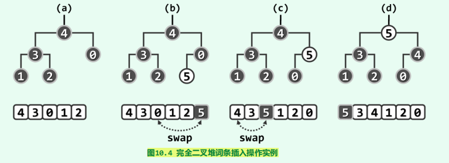
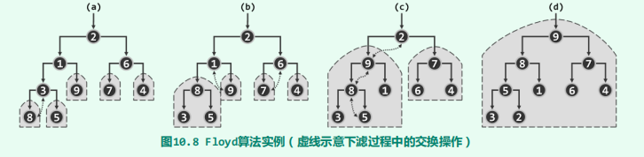

# 堆

[TOC]

## 概述

之前介绍的搜索树、线性表等数据结构，都需要维护一个全序关系。我们从这个角度入手，考虑维护一个偏序关系是否可行。可行的话，操作的计算成本就会降低，而相应的代价就是，对于集合的操作可能受到限制。事实上，堆正是这样的一个数据结构，它只对最值元素进行访问。它的接口定义如下：

~~~java
public interface Heap<T> {
    void insert(T data);
    T getMax();
    T delMax();
}
~~~

堆有多种实现形式，以下首先介绍其中最基本的一种形式——**完全二叉堆（complete binary heap）**。完全二叉堆应该满足以下两个条件：

- 结构性：结构上完全等同于完全二叉树
- 堆序性：每个节点（除根结点）都不大于其父节点

若根节点是最大值，那么我们称这个堆为最大堆。

由于其结构性，我们可以用向量简便地实现一个最大堆。不难验证，对于完全二叉堆中地任意节点v，它必然满足

- 若有左孩子，那么$i(leftchild(v)) = 2*i(v) + 1$
- 若有左孩子，那么$i(rightchild(v)) = 2*i(v) + 2$
- 若有父节点，那么$i(parent(v)) = \lfloor \frac{i(v) - 1}{2}\rfloor $

## 数据成员

下面我们来实现完全二叉堆：

~~~java
package cn.atsukoruo.heap;

import cn.atsukoruo.list.Vector;

public class CompleteBinaryHeap<T extends Comparable<T>> implements Heap<T>{
    int size = 0;
    Vector<T> vector;

    public CompleteBinaryHeap() {
         vector = new Vector<>();
    }

    public CompleteBinaryHeap(Vector<T> vector) {
        this.vector = new Vector(vector);
        size = vector.size();
        heapify();
    }
}
~~~

一些辅助函数

~~~java
/**
 * 判断节点i是否在堆中
 * @param size 堆的大小
 */
static boolean isInHeap(int size, int i) {
    return -1 < i && i < size;
}

static int parent(int i) {
    return (i - 1) >> 1;            //相当于i/2向下取整
}

/**
 * 返回最后一个节点的父亲，即内部节点
 * @param size 堆的大小
 */
static int lastInternal(int size) {
    return parent( size - 1);
}

static int leftChild(int i) {
    return (i << 1) + 1;
}

static int rightChild(int i) {
    return (i + 1) << 1;
}

static boolean hasParent(int i) {
    return i != 0;
}

static boolean hasLeftChild(int size, int i) {
    return isInHeap(size, leftChild(i));
}

static boolean hasRightChild(int size, int i) {
    return isInHeap(size, rightChild(i));
}

/**
 * 指定两个节点，取出最大者。如果两者相同，那么返回i
 */
int getBigger( int i, int j) {
    return vector.get(i).compareTo(vector.get(j)) >= 0 ? i : j;
}

/**
 * 节点i、i的左孩子、i的右孩子中最大者
 */
int properParent(int i) {
    return hasRightChild(size, i) ? (getBigger(i, getBigger(leftChild(i), rightChild(i)))) :
            hasLeftChild(size, i) ? getBigger(i, leftChild(i)) : i;
}
~~~

## 插入与上溢

~~~java
@Override
public void insert(T data) {
    vector.insert(data);			//先插入到最后一个位置
    size += 1;
    percolateUp(size - 1);			//上溢修复
}

private int percolateUp(int i) {
    while (hasParent(i)) {
        int j = parent(i);
        if (getBigger(i, j) == j)
            break;
        Vector.swap(vector, i, j);
        i = j;
    }
    return i;
}
~~~

## 删除与下溢

~~~java
@Override
public T delMax() {
    if (size == 0) return null;
    T ret = vector.get(0);
    //vector.set(vector.remove(vector.size() - 1), 0) 是错误的，它无法处理删除最后一个元素的情况
    Vector.swap(vector, 0, vector.size() - 1);			//堆顶元素与最后一个元素交换，然后删除最后一个元素
    vector.remove(vector.size() - 1);
    size -= 1;
    percolateDown(0);
    return ret;
}

private int percolateDown(int i) {
    int j;
    while (i != (j = properParent(i))) {
        Vector.swap(vector, i, j);
        i = j;
    }
    return i;
}
~~~

## 建堆

### 蛮力算法

那么从空堆起反复调用标准insert()接口，即可将输入词条逐一插入其中，并最终完成建堆任务

时间复杂度为
$$
\Omicron(log1 + log2 + ... + logn) = \Omicron(logn!) = \Omicron(nlogn)
$$

### 自上而下

对任何一棵完全二叉树，只需自顶而下、自左向右地针对其中每个节点实施一次上滤，即可使之成为完全二叉堆。

考虑一颗高度为$h$的满二叉树。那么其节点个数$n = 2^{h+1}- 1$，高度为$i$的节点共有$2^i$个。因此时间复杂度为

$\sum^h_{i=0}(i*2^i) = (h-1)*2^{h+1}+2 =  [log_2(n+1)-2](n+1)+2 = \Omicron(nlogn)$

其中第一步是错位相消。

### 自下而上（Floyd算法）

只需自下而上、由深而浅地遍历所有内部节点，并对每个内部节点分别调用一次下滤算法

~~~java
void heapify() {
    for (int i = lastInternal(size); isInHeap(size, i); i--) {
        percolateDown(i);
    }
}
~~~

考虑一颗高度为$h$的满二叉树。时间复杂度为
$$
\sum^h_{i=0}(h-i)*2^i = 2^{h+1} - (h+2) = n - log_2(n+1) = \Omicron(n)
$$
