# 搜索树

[TOC]

## 概述

是否能既要求对象集合可以高效率地动态调整，同时也要求能够高效率地查找？通过对二分查找策略的抽象与推广，定义并实现二叉搜索树结构，可以回答上述问题。

搜索树的查找是基于寻关键码访问的。这里隐含地做了一个假定——所有词条构成一个全序关系。需指出的是，这一假定条件不见得总是满足。比如在人事数据库中，作为姓名的关键码之间并不具有天然的大小次序。另外，在任务相对单纯但更加讲求效率的某些场合，并不允许花费过多时间来维护全序关系，只能转而付出有限的代价维护一个偏序关系。后者的一个实例，即第10章将要介绍的优先级队列，根据其ADT接口规范，只需高效地跟踪全局的极值元素，其它元素一般无需直接访问。

## 二叉搜索树

二叉搜索树（binary search tree）是在二叉树的基础上满足**顺序性**：
$$
任一节点r的左（右）子树中，所有节点（若存在）均不大于（不小于）r
$$

****

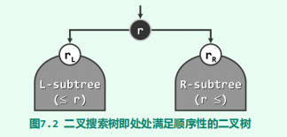

为回避边界情况，这里不妨暂且假定所有节点互不相等。

命题：**任何一棵二叉树是二叉搜索树，当且仅当其中序遍历序列单调非降**

证明：由顺序性即可推出

### 实现

~~~java
public class BinarySearchTree<T extends Comparable<T>>
    extends BinaryTree<T> {
    protected BinaryTreeNode<T> hot;      //被命中节点的父亲
    //...
}
~~~

hot成员变量的含义是被命中节点的父亲，这里被命中节点可以是外部节点（对应搜索失败的情况），此时hot就是叶节点。

### 搜索

二叉搜索树的查找算法，亦采用了减而治之的思路与策略，其执行过程可描述为从树根出发，逐步地缩小查找范围，直到发现目标（成功）或缩小至空树（失败）。

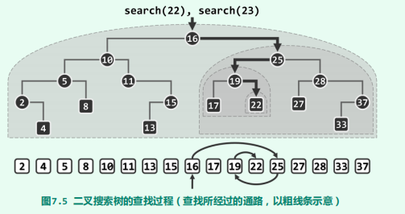

~~~java
/**
 * 在以指定节点为根的子树中查找指定元素。
 * 该方法会设置hot成员。如果node为空，那么hot也为空。其中hot为命中节点的父节点
 * @param e 待查找的元素
 * @param node 指定搜索子树的根节点
 * @return 若查找成功返回匹配节点，否则返回null
 */
protected BinaryTreeNode<T> search(BinaryTreeNode<T> node, T e) {
    hot = null;
    while (node != null) {
        hot = node.parent;
        if (node.data.compareTo(e) < 0) {
            node = node.rightChild;
        } else if (node.data.compareTo(e) > 0) {
            node = node.leftChild;
        } else {
            return node;
        }
    }
    return null;
}

/**
 * 在树中查找指定元素
 * @param e 待查找的元素
 * @return 若查找成功返回匹配节点，否则返回null
 */
public BinaryTreeNode<T> search(T e) {
    return search(root, e);
}
~~~

### 插入

思路：利用查找算法search()确定插入的位置及方向，然后才能将新节点作为叶子插入。

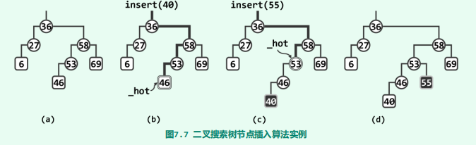

~~~java
public BinaryTreeNode<T> insert(T e) {
    //在教科书中使用了C++ 指针 + 引用的特性，这可以很方便修改父类的指针，
    //但是在Java中却是不行的，实属遗憾。造成这一问题的实质就是在Java中并没有二级指针！
    if (isEmpty()) {
        root = new BinaryTreeNode<>(e, null);
        size = 1;
        return root;
    }
    BinaryTreeNode<T> x = search(e);
    if (x != null)          //这里约定在二叉搜索树中没有重复元素
        return x;
    x = new BinaryTreeNode<>(e, hot);
    if (e.compareTo(hot.data) < 0) {
        hot.leftChild = x;
    } else {
        hot.rightChild = x;
    }
	size += 1;
    updateHeightAbove(x);
    return x;
}

~~~

### 删除

思路：利用查找算法search()确定要删除的元素。如果是单分支情况，直接左孩子代替即可。如果是双分支情况，那么将删除节点的后继节点与删除节点交换，转换为单分支情况

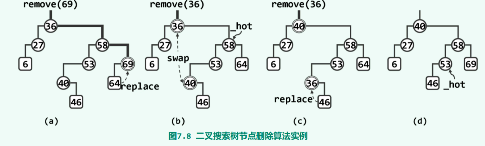

~~~java
/**
 * 删除数据为e的节点
 * @param e 待删除的元素
 * @return 如果未找到该节点，那么返回false。否则返回true
 */
public boolean remove(T e) {
    BinaryTreeNode<T> x = search(e);
    if (x == null) {        //该节点并不存在
        return false;
    }
    removeAt(x);            //删除该节点
    size -= 1;
    updateHeightAbove(hot); //更新被删除节点的祖父的高度
    return true;
}

/**
 * 删除指定节点，并设置hot为被删除节点的父节点
 * @param x 被删除的节点
 * @return 返回实际被删除节点接替者
 */
protected BinaryTreeNode<T> removeAt(BinaryTreeNode<T> x) {
    if (x.leftChild == null || x.rightChild == null) {      //处理单边情况
        removeAt1(x);
        hot = x.parent;
        return x.leftChild == null ? x.rightChild : x.leftChild;
    } else {            //双边情况
        BinaryTreeNode<T> succeedNode = x.getSucceedNode();
        Tool.swap(succeedNode.data, x.data);
        removeAt1(succeedNode);
        hot = succeedNode.parent;
        return succeedNode;
    }
}

/**
 * 删除指定节点，该节点至多只有一个孩子
 * @param x 被删除的节点
 */
private void removeAt1(BinaryTreeNode<T> x) {
    BinaryTreeNode<T> child = x.leftChild == null ? x.rightChild : x.leftChild;
    if (x.parent == null) {
        root = child;
    } else if (BinaryTreeNode.isLeftChild(x)) {
        x.parent.leftChild = child;
    } else {
        x.parent.rightChild = child;
    }
}
~~~

删除操作总是固定地将待删除的二度节点与其直接后继交换，则随着删除操作次数的增加，二叉搜索树向左侧倾斜的趋势将愈发明显，这加剧了高度不平衡的情况

### 连接

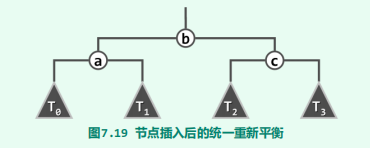

~~~java
 /**
 * 给定七个节点，并将这七个节点组装成一颗树, 同时会修改a、b、c三个节点的高度
 *                  b
 *                /   \
 *               a     c
 *             /  \   /  \
 *            T0  T1 T2  T3
 * @return 返回这个树的根节点
 */
protected  BinaryTreeNode<T> connect34(
    BinaryTreeNode<T> a, BinaryTreeNode<T> b, BinaryTreeNode<T> c,
    BinaryTreeNode<T> T0, BinaryTreeNode<T> T1, BinaryTreeNode<T> T2, BinaryTreeNode<T> T3
) {
    a.leftChild = T0;
    if (T0 != null) T0.parent = a;
    a.rightChild = T1;
    if (T1 != null) T1.parent = a;
    updateHeight(a);

    c.leftChild = T2;
    if (T2 != null) T2.parent = c;
    c.rightChild = T3;
    if (T3 != null) T3.parent = c;
    updateHeight(c);

    b.leftChild = a;
    a.parent = b;
    b.rightChild = c;
    c.parent = b;
    updateHeight(b);

    return b;
}
~~~

### 旋转

~~~java
/**
 * 对节点v实施zig-zig、或zig-zag旋转
 * @param v 待旋转的节点
 * @return 旋转后的等价二叉子树的根节点
 */
protected  BinaryTreeNode<T> rotateAt(BinaryTreeNode<T> v) {
    BinaryTreeNode<T> p = v.parent;
    BinaryTreeNode<T> g = v.parent;

    if (BinaryTreeNode.isLeftChild(p)) {
        if (BinaryTreeNode.isLeftChild(v)) {
            p.parent = g.parent;
            return connect34(v, p, g, v.leftChild, v.rightChild, p.rightChild, g.rightChild);
        } else {
            v.parent = g.parent;
            return connect34(p, v, g, p.leftChild, v.leftChild, v.rightChild, g.rightChild);
        }
    } else {
        if (BinaryTreeNode.isRightChild(v)) {
            p.parent = g.parent;
            return connect34(g,p,v,g.leftChild,p.leftChild,v.leftChild,v.rightChild);
        } else {
            v.parent = g.parent;
            return connect34(g,v,p,g.leftChild,v.leftChild,v.rightChild,p.rightChild);
        }
    }
}
~~~

## 平衡二叉树

然而不幸的是，对于规模为$n$的二叉搜索树，深度在最坏情况下可达$\Omega(n)$。此时该树j近似退化为一条单链，而此时的查找效率会降至*O*(n)，线性正比于数据集的规模。

下面，将按照两种常用的随机统计口径，就二叉搜索树查询操作的平均性能做一比较。

首先考虑**随机生成（randomly generatly）**的情况：不妨设各个节点对应n个互异关键码$\{e_1,e_2,...,e_n\}$。这些关键码的排列记为$\sigma = (e_{i_1},e_{i_2},...,e_{i_n})$。从一个空树开始，依次执行insert($e_{i_k}$)，即可得到一颗二叉搜索树$T(\sigma)$。

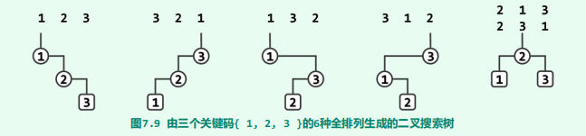

由以下两篇论文证明了在这一随机意义下，二叉搜索树的平均高度为$\Theta(logn)$

- [29] L. Devroye. A Note on the Height of Binary Search Trees. J. of ACM (1986), 33(3):489-498

- [30] P. Flajolet & A. Odlyzko. The Average Height of Binary Trees and Other Simple Trees. Journal of Computer and System Sciences (1982), 25(2):171-213

在考虑**随机组成（randomly composed）**的情况：n个互异节点同时给定，然后再遵循顺序性的前提下，随即确定它们拓扑链接。可以证明这样组成的二叉树共有$\frac{2n!}{n!(n+1)!}$。证明：

1. 设n个互异的节点随机组成的二叉树共有$T(n)$颗。且$T(0) = T(1) = 1$
2. 给定节点$e_0, e_1, ..., e_k, ... e_n$，以$e_k$为根节点随机组成的二叉树有$T(k) * T(n - k - 1)$
3. 那么$T(n) = \Sigma_{k = 0}^{n}T(k) * T(n - k - 1)$，这就是Catalan数的递推公式

这篇论文[30]证明了在这一随机意义下，平均查找长度为$\Theta(\sqrt{n})$

我们受到启发：若要控制单次查找在最坏情况下的运行时间，须从控制二叉搜索树的高度入手。为此，我们先定义树的**平衡性**：指一棵树的左右子树的高度差不超过某个限定值的性质。平衡性分为两类：

- 理想平衡：整课树的树高恰好为$\lfloor log_2n\rfloor$
- 适度平衡：整课树的树高渐进地不超$O(logn)$，即在渐进意义下的平衡性

> 包含n个节点的二叉树，高度不可能小于$\lfloor log_2n\rfloor$。若搜索二叉树的树高恰好为$\lfloor log_2n\rfloor$，则称作**理想平衡树**

平衡二叉搜索树的适度平衡性，都是通过对树中每一局部增加某种限制条件来保证的。比如

- 在红黑树中，从树根到叶节点的通路，总是包含一样多的黑节点
- 在AVL树中，兄弟节点的高度相差不过1

除了平衡性，局部性也至关重要：

- 经过单次动态修改操作后，至多只有O(1)处局部不再满足限制条件
- 总可在O(logn)时间内，使这O(1)处局部（以至全树）重新满足限制条件

局部性意味着刚刚失去平衡的二叉搜索树，必然可以迅速转换为一棵等价的平衡二叉搜索树。尽管任何二叉搜索树都可等价变换至理想平衡的完全二叉树，然而鉴于二者的拓扑结构可能相去甚远，在最坏情况下我们将不得不花费*O*(n)时间来完成等价转换操作，不满足局部性。

若两棵二叉搜索树的中序遍历序列相同，则称它们彼此等价

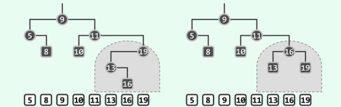

> 接下来介绍的AVL、Splay Tree、Red Black Tree都满足局部性以及适当平衡性。

在失衡后，通过围绕特定节点的旋转，实现等价前提下的局部拓扑调整。平衡化算法以旋转操作为基础完成全局拓扑调整，修复失衡情况。

## AVL

> 由G. M. Adelson-Velsky和E. M. Landis不1962年发明[36]，并以他们名字命名

AVL中各节点平衡因子的绝对值均不超过1，任一节点v的平衡因子（balance factor）定义为“其左、右子树的高度差“。下图是AVL树的最坏情况

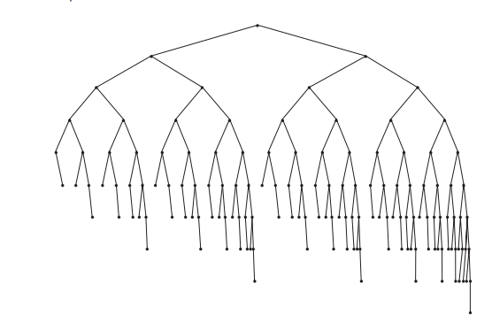

命题：高度为h的AVL树至少包含fib(h+3)-1个节点。

证明：

1. 先考虑递归基。当$h = 0$时，$fib(3) - 1 = 2 - 1 = 1$，并且此时T仅有一个根节点，命题成立。当$h = 1$时，$fib(4) - 1= 3 - 1= 2$，并且此时T至少有两个节点，命题成立。
2. 假设$h < n$时命题成立，现在考察$h = n$的情况。在所有高度为$h$的AVL树中挑选节点数量最少的一颗S$（注意这样的树不止一颗）
3. 设$S$的根节点为$r$，r的左子树、右子树分别为$S_l$、$S_R$，那么有$|S| = 1 + |S_L| + |S_R|$。
4. 由于节点数量是最少的，所以$S_l$、$S_R$的高度只能是一个为h-1，另一个为h-2。不妨设$S_l$的高度是h-1，那么$S_R$的高度为h-2
5. 由递归假设可得$|S| = 1 + |S_L| + |S_R| \geq 1 + fib(h + 2) -1 + fib(h+1) -1 = fib(h+3)-1 $。命题成立

推论：包含n个节点的AVL树的高度应为*O*(logn)，即AVL是适当平衡的。

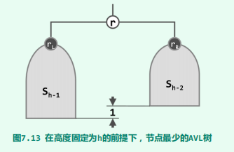

证明：

~~~java
public class AVL<T extends Comparable<T>>
    extends BinarySearchTree<T> {
    //...
}
~~~

辅助函数：

~~~java
/**
 * @param node 指定节点
 * @return 获取指定节点中高度最高的孩子。若node为空，那么返回null。若孩子高度相等，优先返回左孩子
 */
BinaryTreeNode<T> getTallerChild(BinaryTreeNode<T> node) {
    if (node == null)
        return null;
    int leftHeight = node.leftChild == null ? -1 : node.leftChild.height;
    int rightHeight = node.rightChild == null ? -1 : node.rightChild.height;

    return  (leftHeight < rightHeight) ? node.rightChild : node.leftChild;
}

/**
 * 判断是否为理想平衡
 * @return 理想平衡返回true
 */
static boolean isBalanced(BinaryTreeNode<?> node) {
    return node.leftChild.height == node.rightChild.height;
}

/**
 * @return 获得该节点的AVL平衡因子
 */
static int getBalancedFactor(BinaryTreeNode<?> node) {
    return node.leftChild.height - node.rightChild.height;
}

/**
 * 判断是否为AVL平衡
 * @return AVL平衡返回true
 */
static boolean isAVLBalanced(BinaryTreeNode<?> node) {
    int factor = getBalancedFactor(node);
    return -2 < factor && factor < 2;
}
~~~

### 插入

单旋

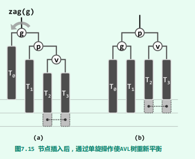

双旋

图中以虚线联接的每一对灰色方块中，其一对应于节点x，另一为空。

从中我们可以发现在AVL树中插入新节点后，仅需不超过两次旋转，即可使整树恢复平衡。

~~~java
@Override
public BinaryTreeNode<T> insert (T element) {
    if (isEmpty()) {
        root = new BinaryTreeNode<>(element, null);
        size++;
        return root;
    }

    BinaryTreeNode<T> node = search(element);
    if (node != null)           //要求元素互异
        return node;

    size++;
    //设置待插入节点
    node = new BinaryTreeNode<>(element, hot);

    if (element.compareTo(hot.data) < 0) {
        hot.leftChild = node;
    } else {
        hot.rightChild = node;
    }

    //开始修复失衡情况
    for (BinaryTreeNode<T> p = hot; p != null; p = p.parent) {
        if (!isAVLBalanced(p)) {
            BinaryTreeNode<T> pp = p.parent;
            //rotateAt方法会正确修正子树的高度
            node = rotateAt(getTallerChild(getTallerChild(p)));
            if (pp == null) {
                root = node;
            }
            //这里调整后的节点node与pp比较，与原先失衡节点p与pp比较是一样的。因为p与node都是在pp的同一颗子树下，而且有顺序性。
            if (node.data.compareTo(pp.data) < 0) {
                pp.leftChild = node;
            } else {
                pp.rightChild = node;
            }
            break;          //p复衡后，整个树也就平衡了
        } else {
            //对于出现失衡的情况，整个树的高度势必不会增加
            //而对于插入后未出现失衡的情况，整个树的高度可能增加。
            //这个分支正是处理这种情况的
            updateHeight(p);
        }
    }
    return node;
}
~~~

### 删除

T3中删除了节点而致使g(x)不再平衡，如图所示

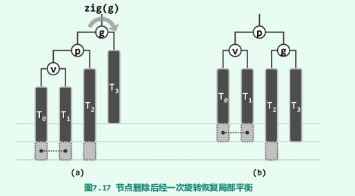

图中以虚线联接的灰色方块所对应的节点，不能同时为空（若同时为空，那么对应7.18(a)中的情况）；T2底部的灰色方块所对应的节点，可能为空，也可能非空。

同时我们还注意到在局部恢复平衡后，平衡后的子树根节点的高度可能下降，从而可能导致更高层祖先失衡。这种由于低层失衡节点的重平衡而致使其更高层祖先失衡的现象，称作**“失衡传播”**

~~~java
@Override
public boolean remove(T element) {
    BinaryTreeNode<T> node = search(element);
    if (node == null) {
        return false;
    }
    removeAt(node);
    size--;

    for (BinaryTreeNode<T> p = hot; p != null;) {
        BinaryTreeNode<T> pp = p.parent;
        if (!isAVLBalanced(p)) {     //节点p失衡
            node = rotateAt(getTallerChild(getTallerChild(p)));
            if (pp == null) {
                root = node;
            }
            else if (node.data.compareTo(pp.data) < 0) {
                pp.leftChild = node;
            } else {
                pp.rightChild = node;
            }
        }
        p = pp;     //旋转后所得到的等价二叉树的根节点并不一定是p了，所以要从这里修正
        updateHeight(pp);
    }
    return true;
}
~~~

## Splay Tree

### 基本原理

伸展树的主要优势就在于不需要对基本的二叉树节点结构，做任何附加的要求或改动，例如记录平衡因子或黑高度之类的额外信息，实现比较简便。同时在任何足够长的真实操作序列中，能够保持分摊意义上的高效率。

通常在任意数据结构的生命周期内，不仅执行不同操作的概率往往极不均衡，而且各操作之间具有极强的相关性，并在整体上多呈现出极强的规律性。这种现象被表述为**数据局部性**:

- **刚刚被访问过的元素，极有可能在不久之后再次被访问到**
- **将被访问的下一元素，极有可能就处于不久之前被访问过的某个元素的附近**

对任意一个数据结构来说，如果能充分利用数据局部特性，即可进一步地提高数据结构和算法的效率。Splay Tree就是这方面的一个例子。

它的基本思想如下：对于任意访问到的节点p，通过zig-zag或zig-zig等旋转操作构造出一颗等价二叉树，该二叉树以节点p作为根节点。

一种方法是**逐层伸展**：即每访问过一个节点之后，随即反复地以它的父节点为轴，经适当的旋转将其提升一层，直至最终成为树根。

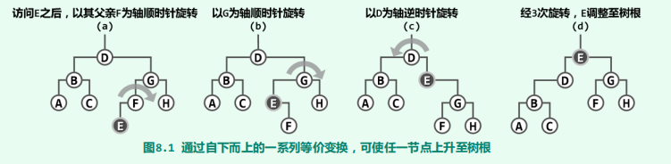

它的最坏情况如下：

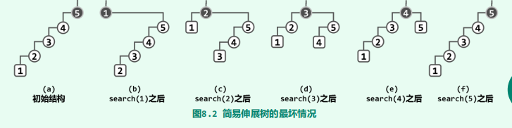

这一最坏情况的实例，完全可以推广至规模任意的二叉搜索树。于是对于规模为任意$n$的伸展树，只要按关键码单调的次序，周期性地反复进行查找，不难验证在一个周期中，旋转操作的总次数应为：
$$
(n - 1) + (n - 2) + ... + 1 = \Omega(n^2)
$$
如此分摊下来，每次访问平均需要$\Omega(n)$时间。很遗憾，这一效率不仅远远低于AVL树，而且甚至与原始的二叉搜索树的最坏情况相当。

为克服上述伸展调整策略的缺陷，一种简便且有效的方法就是：将逐层伸展改为双层伸展。每经过一次双层调整操作，节点v都会上升两层。若v的初始深度depth(v)为偶数，则最终v将上升至树根。若depth(v)为奇数，则当v上升至深度为1时，不妨最后再相应地做一次zig或zag单旋操作。无论如何，经过depth(v)次旋转后，v最终总能成为树根。

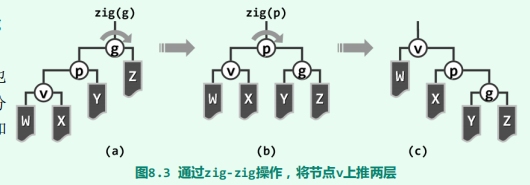

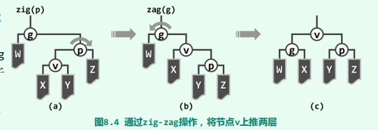

我们再来考察下最坏情况：

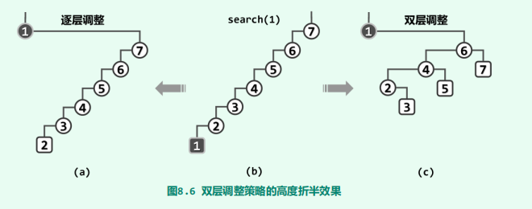

Tarjan等人采用势能分析法（potential analysis）业已证明，在改用“双层伸展”策略之后，伸展树的单次操作均可在分摊的*O*(logn)时间内完成。

逐层伸展的问题根源可解释为：在持续访问的过程中，树高依算术级数逐步从$n - 1$递减至$n/2$，然后再逐步递增回到$n - 1$​。在双层伸展中一旦这类“坏”节点被“碰触”到，经过随后的双层伸展，其对应的分支都会收缩至长度大致折半。于是，即便每次都“恶意地”试图访问最底层节点，最坏情况也不会持续发生。可见，伸展树虽不能杜绝最坏情况的发生，却能有效地控制最坏情况发生的频度，从而在分摊意义下保证整体的高效率。

