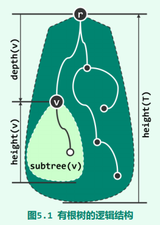
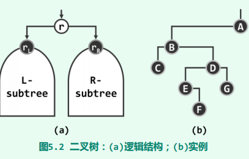
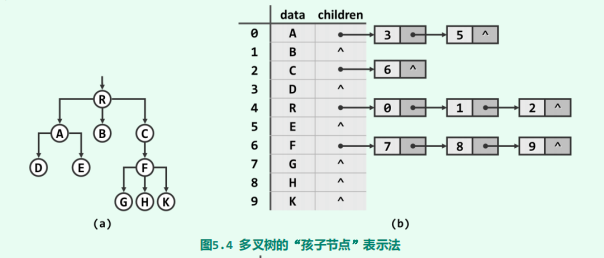
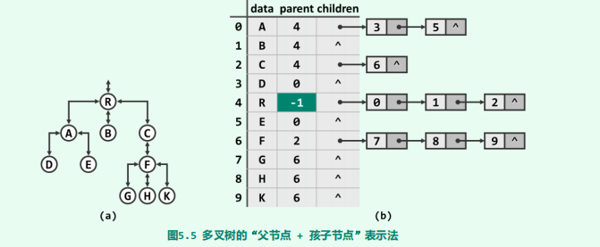
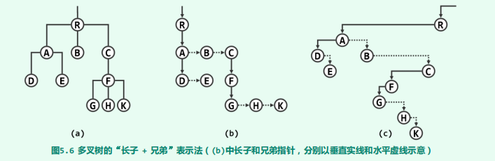
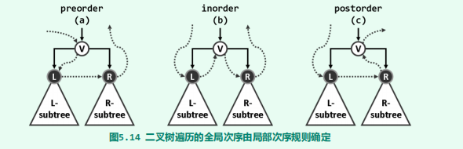
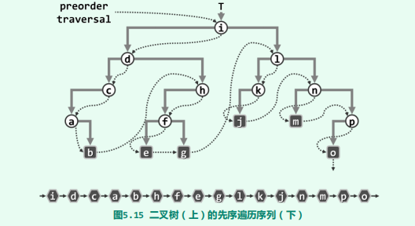
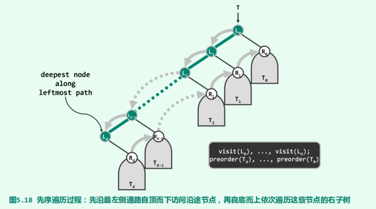
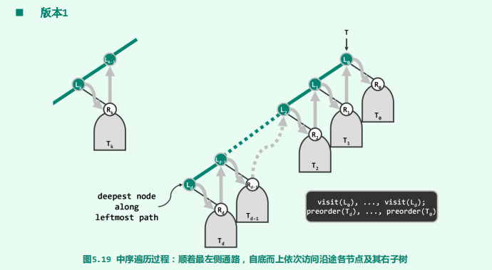
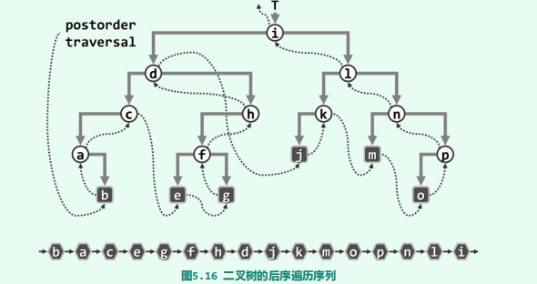

# 树

[TOC]

## 理论

### 树

是否能将向量与列表的有点结合起来，并回避其中的不足呢？本章所讨论的树结构，将正面回答这一问题

在线性结构中，元素之间都存在一个自然的线性次序。树则不然，其中的元素之间并不存在天然的直接后继或直接前驱关系。但是只要附加某种约束（比如遍历），也可以在树中的元素之间确定某种线性次序（全序关系）。

树的结构可以表示一个具有最大元的偏序关系，因此且属于**半线性结构（semi-linear structure）**。

从图论的角度看，树等价于连通无环图。但是真正意义上的树，往往还会在此基础上，再指定某一特定顶点，并称之为**根（root）**

由树的连通性，每一节点与根之间都有一条路径相联；而根据树的无环性，由根通往每个节点的路径必然唯一。

下面介绍下有关树的概念：

- **深度（depth）**：沿每个节点v到根r的唯一通路所经过边的数目，称作v的深度（depth），记作depth(v)。

  特别地，约定根节点的深度depth(r) = 0

- 任一节点v在通往树根沿途所经过的每个节点都是其**祖先（ancestor）**，v是它们的**后代（descendant）**。特别地，v的祖先/后代包括其本身，而v本身以外的祖先后代称作**真祖先（proper ancestor）**/**真后代（proper descendant）**。

- 特别地，若节点u是v的祖先且恰好比v高出一层，则称u是v的**父亲（parent）**，v是u的**孩子（child）**。

- v的孩子总数，称作其度数或**度（degree）**，记作deg(v)。无孩子的节点称作**叶节点（leaf）**，包括根在内的其余节点皆为**内部节点（internal node）**

- v所有的后代及其之间的联边称作**子树（subtree）**，记作subtree(v)。

- 树T中所有节点深度的最大值称作该**树的高度（height）**，记作height(T)。特别地，仅含单个节点的树高度为0，空树高度为-1。推而广之，任一节点v所对应子树subtree(v)的高度，亦称作该节点的高度，记作height(v)。特别地，全树的高度亦即其根节点r的高度，$height(T) = height(r)$。

### 二叉树

**二叉树（binary tree）**中每个节点的度数均不超过2，特别地，不含一度节点的二叉树称作**真二叉树（proper binary tree）**。

若同一父节点的孩子都可以左、右相互区分，则称该二叉树为**有序二叉树（ordered binary tree）**。

每个节点的孩子均不超过k个的有根树，称作**k叉树（k-ary tree）**。多叉树的表示法

- 父节点表示法：空间复杂度$\Omicron(n)$，时间方面，仅需常数时间，即可确定任一节点的父节点；但反过来，孩子节点的查找却不得不花费$\Omicron(n)$时间访遍所有节点。

  

- 孩子节点表示法：令各节点将其所有的孩子组织为一个向量或列表。如此，对于拥有$r$个孩子的节点，可在$\Omicron(r + 1)$时间内列举出其所有的孩子。

  

- 孩子+父节点表示法：尽管如此可以高效地兼顾对父节点和孩子的定位，但在节点插入与删除操作频繁的场合，为动态地维护和更新树的拓扑结构，不得不反复地遍历和调整一些节点所对应的孩子序列。然而，向量和列表等线性结构的此类操作都需耗费大量时间，势必影响到整体的效率。

  

解决上述难题的方法之一，就是采用支持高效动态调整的二叉树结构。为此，必须首先建立起从多叉树到二叉树的某种转换关系。同时我们对多叉树增加一项约束条件——同一节点的所有孩子之间必须具有某一线性次序，这保证作为多叉树特例的二叉树有足够的能力表示任何一棵多叉树，即**有序多叉树 = 二叉树**。

这种转换关系就是长子 + 兄弟表示法，其中节点$n$的长子作为左孩子，而节点$n$的下一兄弟作为右孩子。

尽管二叉树只是多叉树的一个子集，但其对应用问题的描述与刻画能力绝不低于后者。实际上以下我们还将进一步发现，即便是就计算效率而言，二叉树也并不逊色于一般意义上的树。反过来，得益于其定义的简洁性以及结构的规范性，二叉树所支撑的算法往往可以更好地得到描述，更加简捷地得到实现。这使得二叉树的身影几乎出现在所有的应用领域当中。

总结：刻画能力、计算效率、简洁性

## 实现

### 成员变量

作为图的特殊形式，二叉树的基本组成单元是节点与边；作为数据结构，其基本的组成实体是二叉树节点（binary tree node），而边则对应于节点之间的相互引用。

~~~java
public class BinaryTreeNode<T extends Comparable<T>>
    implements Comparable<BinaryTreeNode<T>> {
    
    T data;         //数据域
    BinaryTreeNode<T> parent;
    BinaryTreeNode<T> leftChild;
    BinaryTreeNode<T> rightChild;
    int height;         //在不同的树中，高度的定义是不同的。比如，8.3节的红黑树将采用所谓的黑高度（black height），而10.3节的左式堆则采用所谓的空节点通路长度（null path length）
    RBColor color;
    
    public BinaryTreeNode(T data, BinaryTreeNode<T> parent, BinaryTreeNode<T> leftChild,
                          BinaryTreeNode<T> rightChild, int height, RBColor color) {
        this.data = data;
        this.parent = parent;
        this.leftChild = leftChild;
        this.rightChild = rightChild;
        this.height = height;
        this.color = color;
    }
    
    public BinaryTreeNode(T data, BinaryTreeNode<T> parent) {
        this(data, parent, null, null, 0, RBColor.RED);
    }
}
~~~

根据不同应用需求，还可以针对节点的深度增设成员变量depth，或者针对以当前节点为根的子树规模增设成员变量size。利用这些变量固然可以加速静态的查询或搜索，但为保持这些变量的一致性，在所属二叉树发生结构性调整（比如节点的插入或删除）之后，这些成员变量都要动态地更新。因此，究竟是否值得引入此类成员变量，必须权衡利弊。比如，在二叉树结构改变频繁以至于动态操作远多于静态操作的场合，舍弃深度、子树规模等变量，转而在实际需要时再直接计算这些指标，应是更为明智的选择。

~~~java
public class BinaryTree<T extends Comparable<T>> {
    protected int size;         			//节点的个数
    protected BinaryTreeNode<T> root;
}
~~~

### 判断二叉树节点的状态与性质

~~~java
//BinaryTreeNode.java
public static <T extends Comparable<T>>
boolean isRoot(BinaryTreeNode<T> node) {						//判断该节点是否为root
    return node.parent == null;		
}

public static <T extends Comparable<T>>
boolean isLeftChild(BinaryTreeNode<T> node) {					//判断该节点是否为其父节点的左孩子，特别地，对于根节点返回false
    return !isRoot(node) && node.parent.leftChild == node;
}

public static <T extends Comparable<T>>
boolean isRightChild(BinaryTreeNode<T> node) {					//判断该节点是否为其父节点的有孩子，特别地，对于根节点返回false
    return !isRoot(node) && node.parent.rightChild == node;
}

public static <T extends Comparable<T>>
boolean hasParent(BinaryTreeNode<T> node) {						//是否有父亲
    return !isRoot(node);
}

public static <T extends Comparable<T>>
boolean hasLeftChild(BinaryTreeNode<T> node) {					//是否有左孩子
    return node.leftChild != null;
}

public static <T extends Comparable<T>>
boolean hasRightChild(BinaryTreeNode<T> node) {					//是否有右孩子
    return node.rightChild != null;
}

public static <T extends Comparable<T>>
boolean hasChild(BinaryTreeNode<T> node) {						//是否至少有一个孩子
    return hasLeftChild(node) || hasRightChild(node);
}

public static <T extends Comparable<T>>
boolean hasBothChild(BinaryTreeNode<T> node) {					//是否左右孩子都有
    return hasLeftChild(node) && hasRightChild(node);
}

public static <T extends Comparable<T>>
boolean isLeaf(BinaryTreeNode<T> node) {						//是否为叶子
    return !hasChild(node);
}

public static <T extends Comparable<T>>
BinaryTreeNode<T> getSibling(BinaryTreeNode<T> node) {			//获得兄弟节点
    if (isRoot(node)) return null;
    return isLeftChild(node) ? node.parent.rightChild : node.parent.leftChild;
}

public static <T extends Comparable<T>>
BinaryTreeNode<T> getUncle(BinaryTreeNode<T> node) {			//获得叔叔节点
    if (isRoot(node) || isRoot(node.parent)) return null;
    return isLeftChild(node.parent) ? node.parent.parent.rightChild : node.parent.parent.leftChild;
}
~~~

### 插入孩子节点

~~~java
//BinaryTreeNode.java
public BinaryTreeNode<T> insertAsLeft(T data) {
    return leftChild = new BinaryTreeNode<>(data, this);
}
public BinaryTreeNode<T> insertAsRight(T data) {
    return rightChild = new BinaryTreeNode<>(data, this);
}
~~~

~~~java
//BinaryTree.java

/**
 * 当作根节点插入到空树中。如果当前树非空，那么会重置整棵树
 * @param data 待插入的数据
 * @return 返回根节点
 */
public BinaryTreeNode<T> insertAsRoot(T data) {
    size = 1;
    return root = new BinaryTreeNode<>(data, null);
}

/**
 * 作为指定节点的左节点进行插入，适用于左节点为null的情况。
 * 如果指定节点存在非空左子树，那么会用新的节点代替该左子树。
 * @param x 指定节点
 * @param data 要插入的数据
 * @return 新的节点
 */
public BinaryTreeNode<T> insertAsLeft(BinaryTreeNode<T> x, T data) {
    size += 1;
    x.insertAsLeft(data);
    updateHeightAbove(x);
    return x.leftChild;
}

/**
 * 作为指定节点的右节点进行插入，适用于右节点为null的情况。
 * 如果指定节点存在非空右子树，那么会用新的节点代替该右子树。
 * @param x 指定节点
 * @param data 要插入的数据
 * @return 新的节点
 */
public BinaryTreeNode<T> insertAsRight(BinaryTreeNode<T> x, T data) {
    size += 1;
    x.insertAsRight((data));
    updateHeightAbove(x);
    return x.rightChild;
}
~~~

### 子树接入

~~~java
//BinaryTree.java

/**
 * 该树作为指定节点的左节点进行插入，适用于左节点为null的情况。
 * 如果指定节点存在非空左子树，那么会用要插入的子树代替该左子树。
 * @param x 指定节点
 * @param tree 要插入的子树
 * @return 返回x
 */
public BinaryTreeNode<T> attachAsLeftTree(BinaryTreeNode<T> x, BinaryTree<T> tree) {
    //该树不为空树的情况下
    if ((x.leftChild = tree.root) != null) {
        x.leftChild.parent = x;
    }
    size += tree.size;
    updateHeightAbove(x);
    return x;
}

/**
 * 该树作为指定节点的右节点进行插入，适用于右节点为null的情况。
 * 如果指定节点存在非空右子树，那么会用要插入的子树代替该右子树。
 * @param x 指定节点
 * @param tree 要插入的子树
 * @return 返回x
 */
public BinaryTreeNode<T> attachAsRightTree(BinaryTreeNode<T> x, BinaryTree<T> tree) {
    if ((x.rightChild = tree.root) != null) {
        x.rightChild.parent = x;
    }
    size += tree.size;
    updateHeightAbove(x);
    return x;
}
~~~

### 子树删除

~~~java
public int remove(BinaryTreeNode<T> x) {
    int n = 0;
    if (BinaryTreeNode.isRoot(x)) {
        root = null;
        n = size;
        size = 0;
    } else {
        if (BinaryTreeNode.isLeftChild(x)) {
            x.parent.leftChild = null;      //在Java中，这一步相当于释放了子节点的内存资源
        } else {
            x.parent.rightChild = null;
        }
        updateHeightAbove(x.parent);
        n = size(x);
        size -= n;
    }
    return n;
}
~~~

子树分离的过程与以上的子树删除过程基本一致，不同之处在于，需要对分离出来的子树重新封装，并返回给上层调用者：

~~~java
public BinaryTree<T> secede(BinaryTreeNode<T> x) {
    if (BinaryTreeNode.isRoot(x)) {
        return this;
    }

    if (BinaryTreeNode.isLeftChild(x)) {
        x.parent.leftChild = null;
    } else {
        x.parent.rightChild = null;
    }

    int n = size(x);
    this.size -= size;
    updateHeightAbove(x.parent);
    return new BinaryTree<>(x, n);
}
~~~

### 遍历

**通过中序遍历，可在二叉树各节点之间定义一个线性次序**。相应地，各节点之间也可定义前驱与后继关系。

而遍历需要一个全局次序，而二叉树本身并不具有天然的全局次序。故首先需要在各节点与其孩子之间约定某种局部次序，从而间接地定义出全局次序。而局部访问的次序有`VLR`、`LVR`和`LRV`三种选择，这三种策略也相应地分别称作先序遍历、中序遍历和后序遍历：

#### 先序遍历

~~~java
public static <T extends Comparable<T>>
void travelPre(BinaryTreeNode<T> node, Consumer<T> consumer) {
    if (node == null) return;
    consumer.accept(node.data);
    travelPre(node.leftChild, consumer);
    travelPre(node.rightChild, consumer);
}
~~~

递归版遍历算法时间、空间复杂度的常系数，相对于迭代版更大。

~~~java
public static <T extends Comparable<T>>
void travelPreIteration1(BinaryTreeNode<T> node, Consumer<T> consumer) {
    Stack<BinaryTreeNode<T>> nodes = new Stack<>();
    if (node != null)
        nodes.push(node);
    while (!nodes.empty()) {
        BinaryTreeNode<T> x = nodes.pop();
        consumer.accept(x.data);
        if (hasRightChild(x))
            nodes.push(x.rightChild);
        if (hasLeftChild(x))
            nodes.push(x.leftChild);
    }
}
~~~

很遗憾，以上思路并不容易推广到非尾递归的场合，比如在中序或后序遍历中，至少有一个递归方向严格地不属于尾递归。此时，如下另一迭代式版本的实现思路，则更具参考价值，即模拟调用栈（While + Stack）。

~~~java
public static <T extends Comparable<T>>
void travelPreIteration2(BinaryTreeNode<T> node, Consumer<T> consumer) {
    Stack<BinaryTreeNode<T>> rightNodes = new Stack<>();
    while (true) {
        while (node != null) {
            consumer.accept(node.data);
            if (node.rightChild != null)
                rightNodes.push(node.rightChild);
            node = node.leftChild;
        }
        if (rightNodes.empty()) break;
        node = rightNodes.pop();
    }
}
~~~

#### 中序遍历

~~~java
public static <T extends Comparable<T>>
void travelIn(BinaryTreeNode<T> node, Consumer<T> consumer) {
    if (node == null) return;
    travelIn(node.leftChild, consumer);
    consumer.accept(node.data);
    travelIn(node.rightChild, consumer);
}
~~~

~~~java
public static <T extends Comparable<T>>
void travelInIteration1(BinaryTreeNode<T> node, Consumer<T> consumer) {
    Stack<BinaryTreeNode<T>> leftNodes = new Stack<>();
    while (true) {
        while (node != null) {
            leftNodes.push(node);
            node = node.leftChild;
        }
        if (leftNodes.empty())
            break;
        node = leftNodes.pop();
        consumer.accept(node.data);
        node = node.rightChild;
    }
}
~~~

#### 后序遍历

先序遍历序列与后序遍历序列并非简单的逆序关系。

~~~java
public static <T extends Comparable<T>>
void travelPost(BinaryTreeNode<T> node, Consumer<T> consumer) {
    if (node == null) return;
    travelPost(node.leftChild, consumer);
    travelPost(node.rightChild, consumer);
    consumer.accept(node.data);
}
~~~

如图所示，将树T画在二维平面上，并假设所有节点和边均不透明。于是从左侧水平向右看去，未被遮挡的最高叶节点v称作**最高左侧可见叶节点（HLVFL）**，**即为后序遍历首先访问的节点**。请注意，该节点既可能是左孩子，也可能是右孩子，故在图中以垂直边示意它与其父节点之间的联边。

~~~java
public static <T extends Comparable<T>>
void travelPostIteration(BinaryTreeNode<T> x, Consumer<T> consumer) {
    Stack<BinaryTreeNode<T>> nodes = new Stack<>();
    if (x != null) nodes.push(x);
    while (!nodes.empty()) {
        if (x.parent != nodes.top())		//只有当前节点的父亲不是下一个要访问的节点，此时要对右子树遍历入栈
            gotoHLVFL(nodes);
        x = nodes.pop();
        consumer.accept(x.data);
    }
}

private static <T extends Comparable<T>>
void gotoHLVFL(Stack<BinaryTreeNode<T>> stack) {
    BinaryTreeNode<T> node;
    while ((node = stack.top()) != null) {
        if (node.leftChild != null) {
            if (node.rightChild != null)
                stack.push(node.rightChild);
            stack.push(node.leftChild);
        } else {
            stack.push(node.rightChild);
        }
    }
    stack.pop();        //弹出空节点
}
~~~

下面给出一个实例：

#### 层次遍历

有根性和有序性是层次遍历序列得以明确定义的基础。正因为确定了树根，各节点方可拥有深度这一指标，并进而依此排序；有序性则保证孩子有左、右之别，并依此确定同深度节点之间的次序。

~~~java
public static <T extends Comparable<T>>
void travelLevel(BinaryTreeNode<T> node, Consumer<T> consumer) {
    Queue<BinaryTreeNode<T>> queue = new Queue<>();
    queue.enqueue(node);
    while (!queue.empty()) {
        node = queue.dequeue();
        consumer.accept(node.data);
        if (node.leftChild != null)
            queue.enqueue(node.leftChild);
        if (node.rightChild != null)
            queue.enqueue(node.rightChild);
    }
}
~~~

### 高度更新

二叉树任一节点的高度，都等于其孩子节点的最大高度加一。

笔者在计算高度时采用的是静态策略，即每次执行动态操作（插入、删除）时，都要更新相应节点的高度。然而，节点自身很难发现后代的变化，因此这里不妨反过来采用另一处理策略：一旦有节点加入或离开二叉树，则更新其所有祖先的高度（主动转被动）。

~~~java
/**
 * 更新当前节点的高度
 * @param node 要修改的节点
 * @return 返回修改后的高度
 */
protected int updateHeight(BinaryTreeNode<T> node) {
    int leftHeight = node.leftChild == null ? -1 : node.leftChild.height;
    int rightHeight = node.rightChild == null ? -1 : node.rightChild.height;
    return node.height = 1 + Math.max(leftHeight, rightHeight);
}

/**
 * 更新当前节点以及祖先节点的高度
 * @param node 要修改的节点
 */
protected void updateHeightAbove(BinaryTreeNode<T> node) {
    while (node != null) {
        int oldHeight = node.height;
        updateHeight(node);

        //只有在树极度不平衡下，这种剪枝所带来的收益是最多的。
        if (node.height == oldHeight)
            break;
        node = node.parent;
    }
}
~~~

updateHeight()算法总体运行时间也是*O*(depth(v) + 1)，其中depth(v)为节点v的深度。

### 完全二叉树

在层次遍历算法的每一次迭代中，必有一个节点出队（而且不再入队）故累计恰好迭代n次。然而，每次迭代中入队节点的数目并不确定。若在对某棵二叉树的层次遍历过程中，前$\lfloor n/2 \rfloor$次迭代中都有非空左孩子入队，且前$\lceil n/2\rceil - 1$次迭代中都有非空右孩子入队，则称之为**完全二叉树（complete binary tree）**。

其宏观拓扑结构特征：叶节点只能出现在最底部的两层，且最底层叶节点均处于次底层叶节点的左侧。

不难验证，高度为$h$的完全二叉树，规模应该介于$2^h 至2^{h+1} - 1$之间；反之，规模为$n$的完全二叉树，高度$h = log2n = O(logn)$。另外，即叶节点数量为$l$，内部节点数量为$n$，则满足$n \leq l \leq n + 1$。

若高度为$h$的完全二叉树由$2^{h+1}-1$个节点组成，那么称该完全二叉树为**满二叉树（full binary tree）**。