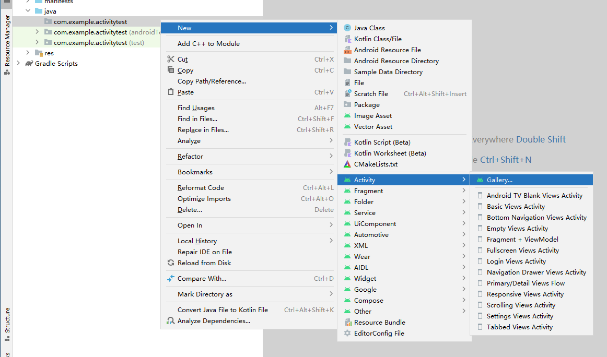
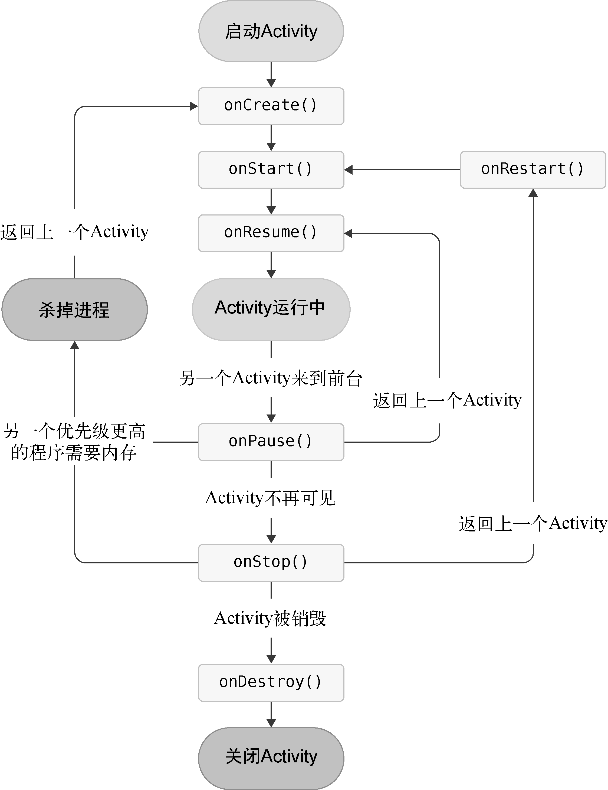

# Activity

`Activity` 类的目的就是促进这种范式的实现：当一个应用调用另一个应用时，调用方应用会调用另一个应用中的 Activity，而不是整个应用。通过这种方式，Activity 充当了应用与用户互动的入口点。

在项目中创建一个Activity：

- `Generate Layout File`表示会为`Activity`创建一个对应的布局文件，

- `Launcher Activity`表示会将当前`Activity`设置为主`Activity`

任何`Activity`都应该重写`onCreate()`方法，在其方法中需要设置该Activity的UI。有两种方式来设置

- Jetpack Compose

  ~~~xml
  class FirstActivity : ComponentActivity() {
      override fun onCreate(savedInstanceState: Bundle?) {
          super.onCreate(savedInstanceState)
          setContent {
              ActivityTestTheme {}
          }
      }
  }
  ~~~

- xml（已废弃）

  ~~~kotlin
  class FirstActivity : AppCompatActivity() {
      override fun onCreate(savedInstanceState: Bundle?) {
          super.onCreate(savedInstanceState)
          setContentView(R.layout.first_layout)
      }
  }
  ~~~

所有的`Activity`都要在`AndroidManifest.xml`中进行注册才能生效：

~~~xml
<manifest xmlns:android="http://schemas.android.com/apk/res/android"
         package="com.example.activitytest">

    <application
            android:allowBackup="true"
            android:icon="@mipmap/ic_launcher"
            android:label="@string/app_name"
            android:roundIcon="@mipmap/ic_launcher_round"
            android:supportsRtl="true"
            android:theme="@style/AppTheme">
        
        <activity android:name=".FirstActivity"></activity>
    </application>

</manifest>
~~~

`Android Studio`会在创建Activity时，自动帮我们完成注册工作。`android:name`用来指定具体注册哪一个`Activity`。由于已经在`<manifest>`中的`package`属性指定了包名，所以在注册`Activity`时，这一包名可以省略掉，直接使用`.FirstActivity`就足够了。

我们通过`<intent-filter>`标签来将一个`Activity`定义为主`Activity`。

~~~xml
<activity
    android:name=".FirstActivity"
    android:exported="false"
    android:label="@string/title_activity_first"
    android:theme="@style/Theme.ActivityTest">
    <intent-filter>
        <action android:name="android.intent.action.MAIN"/>
        <category android:name="android.intent.category.LAUNCHER" />
    </intent-filter>
</activity>
~~~

除此之外，我们还可以使用`android:label`指定`Activity`中标题栏的内容，以及启动器（`Launcher`）中应用程序名。

~~~xml
<activity android:name=".FirstActivity"
    android:label="This is FirstActivity">
	<!---->
</activity>
~~~

调用`finish()`方法可以销毁一个`Activity`。在 Jetpack Compose 中，无法直接调用 `finish` 方法来销毁 `Activity`，可以通过以下方式来实现销毁当前Activity：

~~~kotlin
@Composable
fun MyComposableFunction() {
    val context = LocalContext.current as? Activity
    context?.finish()

    // 组件的其余部分
    // ...
}
~~~

可以通过静态方法`makeText()`创建出一个`Toast`对象，然后调用`show()`将Toast显示即可

~~~kotlin
val mContext = LocalContext.current;

Button(
    // 注意不能再回调函数中获取context
	onClick = { Toast.makeText( mContext, "You clicked Button 1", Toast.LENGTH_SHORT).show() },
) {
    
}
~~~

## Intent

Intent是Android程序中各组件之间进行交互的一种重要方式，它不仅可以指明当前组件想要执行的动作，还可以在不同组件之间传递数据。Intent一般可用于启动Activity、启动Service以及发送广播等场景。

### 启动Activity

Intent大致可以分为两种：

- 显式`Intent`， 主要方法为`Intent(Context packageContext, Class<?> cls)`

  - `Context`：发起方`Activity`的上下文
  - `Class`：用于指定想要启动的目标`Activity`

  使用示例：

  ~~~kotlin
  val context = LocalContext.current as? Activity
  
  val intent = Intent(context, SecondActivity::class.java);
  context.startActivity(intent);
  ~~~

  这里需要强调的是，在Compose中，可组合函数并不在Activity类的作用范围内，所以上下文的获取是显式的（`LocalContext.current as? Activity`）。但是在Activity中，上下文直接可以使用`this`引用来获取

- 隐式`Intent`，它并不明确指出想要启动哪一个`Activity`，而是通过指定了`action`和`category`等信息，让`Android`系统选择一个合适的`Activity`来启动

  在`<intent-filter>`中，可以指定当前`Activity`能够响应的`action`和`category`：

  ~~~xml
  <activity android:name=".SecondActivity" >
      <intent-filter>
          <action android:name="com.example.activitytest.ACTION_START" />
          <!--可以指定多个category-->
          <category android:name="android.intent.category.DEFAULT" />
          <category android:name="com.example.activitytest.MY_CATEGORY"/>
      </intent-filter>
  </activity>
  ~~~

  只有`<action>`和`<category>`中的内容同时匹配Intent中指定的`action`和`category`时，这个`Activity`才能响应该`Intent`。使用示例：

  ~~~kotlin
  val mContext = LocalContext.current;
  val intent = Intent("com.example.activitytest.ACTION_START")
  intent.addCategory("com.example.activitytest.MY_CATEGORY")
  mContext.startActivity(intent);
  ~~~

  `category`的默认值是`android.intent.category.DEFAULT`

  > 当有多个Activty能够响应隐式Intent时，Android系统会弹出一个Activity列表，让用户选择一个Activity来启动。

  

使用隐式Intent，不仅可以启动自己程序内的Activity，还可以启动其他程序的Activity。例如打开网页：

~~~kotlin
val intent = Intent(Intent.ACTION_VIEW)
intent.data = Uri.parse("https://www.baidu.com")
~~~

与此对应，我们还可以在`<intent-filter>`标签中再配置一个`<data>`标签，用于更精确地指定当前Activity能够响应的数据。`<data>`标签中主要可以配置以下内容：

- `android:scheme`。用于指定数据的协议部分，如上例中的https部分。
- `android:host`。用于指定数据的主机名部分，如上例中的www.baidu.com部分。
- `android:port`。用于指定数据的端口部分，一般紧随在主机名之后。
- `android:path`。用于指定主机名和端口之后的部分，如一段网址中跟在域名之后的内容。
- `android:mimeType`。用于指定可以处理的数据类型，允许使用通配符的方式进行指定。

只有当`<data>`标签中指定的内容和Intent中携带的Data完全一致时，当前Activity才能够响应该Intent。

此外，uri还可以指定其他协议。例如，`geo`表示显示地理位置、`tel`表示拨打电话：

~~~kotlin
val intent = Intent(Intent.ACTION_DIAL)
intent.data = Uri.parse("tel:10086")
~~~

### 向Activity传递数据

通过`putExtra()`向接收`Activity`传递一个键值对，

~~~kotlin
val data = "Hello SecondActivity"
val intent = Intent(this, SecondActivity::class.java)
intent.putExtra("extra_data", data)
startActivity(intent)
~~~

接收`Activity`通过`getStringExtra()`获取发送`Activity`所传递过来的数据：

~~~kotlin
// 这里的intent是父类的getIntent()方法
val extraData = intent.getStringExtra("extra_data")
~~~

发送`Activity`通过 `startActivityForResult()`来说明，期望`Activity`要返回数据（Intent）

~~~kotlin
val mContext = LocalContext.current;
val context = LocalContext.current as Activity
val intent = Intent(context, SecondActivity::class.java)
context.startActivityForResult(intent, 1)
~~~

其中，该方法的第二个参数是请求码。在发起方的`onActivityResult`（`@Deprecated`）回调函数中，集中处理返回的`Intent`，这时候请求码就用于分辨是从哪里期望返回值的。

~~~kotlin
override fun onActivityResult(requestCode: Int, resultCode: Int, data: Intent?) {
    super.onActivityResult(requestCode, resultCode, data)
    when (requestCode) {
        1 -> if (resultCode == RESULT_OK) {
            val returnedData = data?.getStringExtra("data_return")
        }
    }
}
~~~

接收`Activity`通过`setResult()`来返回数据（`Intent`），其中第一个参数只有两个取值`RESULT_OK`或`RESULT_CANCELED`

~~~kotlin
val intent = Intent()
intent.putExtra("data_return", "Hello FirstActivity")
setResult(RESULT_OK, intent)
finish()						// 销毁Activity
~~~

**随着应用的扩展，`onActivityResult`回调方法各种嵌套、耦合严重、难以维护。** 最常见的场景就是调用系统相机相册获取照片了。代码可能像是如下这样：

~~~kotlin
class MainActivity : AppCompatActivity() {

    override fun onCreate(savedInstanceState: Bundle?) {
        super.onCreate(savedInstanceState)
        setContentView(R.layout.activity_main)
    }

    override fun onActivityResult(requestCode: Int, resultCode: Int, data: Intent?) {
        if (resultCode == Activity.RESULT_OK) {
            when (requestCode) {
                REQUEST_PERMISSION -> {
                    // 处理权限
                }
                REQUEST_CAMERA -> {
                    // 相机获取图片结果
                }
                REQUEST_ALBUM -> {
                    // 相册获取图片结果
                }
                REQUEST_CROP -> {
                    // 系统裁剪
                }
            }
        }

        super.onActivityResult(requestCode, resultCode, data)
    }
~~~

各种处理结果都耦合在`onActivityResult`回调里，并且还得定义一堆额外的常量`REQUEST_CODE`,用与判断是哪个请求的回调结果。

因此，Google官方推出了`Activity Results API` 来解决上述问题。在Activity Results API 中有两个重要的组件：

- `ActivityResultContract`: 协议，它定义了如何传递数据和如何处理返回的数据。
- `ActivityResultLauncher`: 启动器，调用`ActivityResultLauncher`的`launch`方法来启动页面跳转，作用相当于原来的`startActivity()`

首先我们来定义协议：

~~~kotlin
 class MyActivityResultContract: ActivityResultContract<String,String>(){
    override fun createIntent(
        context: Context, 
        input: String?): Intent {
        
        return Intent(context,SecondActivity::class.java)
        	.apply { putExtra("name", input) }
    }

    override fun parseResult(
        resultCode: Int, 
        intent: Intent?): String? {
        
        val data = intent?.getStringExtra("result")
        return 
        if (resultCode == Activity.RESULT_OK && data != null) 
        	data
        else 
        	null
    }

}
~~~

接着注册协议：

~~~kotlin
private val myActivityLauncher = 
	registerForActivityResult(MyActivityResultContract()){  result ->
		Toast.makeText(
			applicationContext,
    		result,
    		Toast.LENGTH_SHORT)
    	.show()
    
		textView.text = "回传数据：$result"
}
~~~

最后，调用启动器的launch方法开启界面跳转

~~~kotlin
myActivityLauncher.launch("Hello, 技术最TOP")
~~~

## Activity的生命周期

Android是使用**任务（task）**来管理`Activity`的，一个任务就是一个栈。这个栈也被称作**返回栈（back stack）**

Activity有4种状态：

- **运行状态**：当一个Activity位于返回栈的栈顶时，Activity就处于运行状态。

- **暂停（Pause）状态**：当一个Activity不再处于栈顶位置，但仍然可见时，Activity就进入了暂停状态。
- **停止（Stop）状态**：当一个Activity不再处于栈顶位置，并且完全不可见的时候，就进入了停止状态。
- **销毁状态**：一个Activity从返回栈中移除后就变成了销毁状态。

Activity类中定义了7个回调方法，覆盖了Activity生命周期的每一个环节：

- `onCreate()`：Activity第一次被创建的时候调用
- `onStart()`：由完全不可见变为可见的时候调用
- `onResume()`：在Activity准备好和用户进行交互的时候调用
- `onPause()`：在系统准备去启动或者恢复另一个Activity的时候调用。我们通常会在这个方法中将释放掉一些消耗CPU的资源，以及保存一些关键数据。但这个方法的执行速度一定要快，不然会影响到新的栈顶Activity的使用。
- `onStop()`：在Activity完全不可见的时候调用
- `onDestroy()`：在Activity被销毁之前调用
- `onRestart()`：由停止状态变为运行状态之前调用

以上7个方法中除了`onRestart()`方法，其他都是两两相对的，从而又可以将Activity分为以下3种生存期：

- **完整生存期**。Activity在`onCreate()`方法和`onDestroy()`方法之间所经历的就是完整生存期。一般情况下，一个Activity会在`onCreate()`方法中完成各种初始化操作，而在`onDestroy()`方法中完成释放内存的操作。
- **可见生存期**。Activity在`onStart()`方法和`onStop()`方法之间所经历的就是可见生存期。在可见生存期内，Activity对于用户总是可见的，即便有可能无法和用户进行交互。
- **前台生存期**。Activity在`onResume()`方法和`onPause()`方法之间所经历的就是前台生存期。在前台生存期内，Activity总是处于运行状态，此时的Activity是可以和用户进行交互的

当一个Activity进入了停止（Stop）状态时，它是有可能被系统回收的。如果用户想要再次将销毁的Activity放置到前台，那么必须重新走一遍`onCreate()`，而不是`onRestart()`。

这里有个严重的问题，就是Activity丢失了临时的数据和状态。为了解决这个问题，Android提供了`onSaveInstanceState()`回调方法，可以保证在Activity被回收之前一定调用它。`onSaveInstanceState()`方法会携带一个`Bundle`类型的参数，`Bundle`提供了一系列的方法用于以键值对的形式来保存数据

~~~kotlin
override fun onSaveInstanceState(outState: Bundle) {
    super.onSaveInstanceState(outState)
    val tempData = "Something you just typed"
    outState.putString("data_key", tempData)
}
~~~

然后通过`onCreate()`方法的`Bundle`参数来恢复数据

~~~kotlin
override fun onCreate(savedInstanceState: Bundle?) {
    super.onCreate(savedInstanceState)
     if (savedInstanceState != null) {
        val tempData = savedInstanceState.getString("data_key")
        Log.d(tag, "tempData is $tempData")
    }
}
~~~

### 销毁所有的Activity

如果栈中有多个Activity，如何同时销毁它们来退出程序呢？用一个集合统一管理它们：

~~~kotlin
object ActivityCollector {

    private val activities = ArrayList<Activity>()

    fun addActivity(activity: Activity) {
        activities.add(activity)
    }

    fun removeActivity(activity: Activity) {
        activities.remove(activity)
    }

    fun finishAll() {
        for (activity in activities) {
            if (!activity.isFinishing) {
                activity.finish()
            }
        }
        activities.clear()
    }

}
~~~

相应地，所有的`Activity`都要做出以下修改：

~~~kotlin
pen class BaseActivity : AppCompatActivity() {

    override fun onCreate(savedInstanceState: Bundle?) {
        super.onCreate(savedInstanceState)
        Log.d("BaseActivity", javaClass.simpleName)
        ActivityCollector.addActivity(this)
    }

    override fun onDestroy() {
        super.onDestroy()
        ActivityCollector.removeActivity(this)
    }
}
~~~

通过调用`ActivityCollector.finishAll()`即可销毁所有`Activity`来退出程序

### 启动Activity的最佳写法

有时候，`Activity`的初始化需要一些参数，而这些参数是通过`Intent`传递过来的。这样做有一个问题 ，即所需的参数是通过`Intent`来隐式说明的，这对其他开发者来说不明确。为此我们通过提供一个方法，显式的说明这些参数，以降低理解代码的负担：

~~~kotlin
class SecondActivity : BaseActivity() {
    ...
    companion object {
        fun actionStart(context: Context, data1: String, data2: String) {
            val intent = Intent(context, SecondActivity::class.java)
            intent.putExtra("param1", data1)
            intent.putExtra("param2", data2)
            context.startActivity(intent)
        }
    }
}
~~~

这样调用者只需编写以下代码，就可以启动Activity：

~~~kotlin
SecondActivity.actionStart(this, "data1", "data2")
~~~

显然，这样所需的参数就一目了然。而且封装了启动Activity的逻辑，提高了可重用性。

## Activity的启动模式

Activity的启动模式一共有以下四种：

- `standard`（默认）：无论栈中是否存在Activity，都会创建一个新的，并压入栈顶。
- `singleTop`：若栈顶Acticity是要启动的Activity，则直接使用它，而不会再创建新的Activity实例。否则会创建一个并压栈
- `singleTask`：Android系统首先会在返回栈中检查是否存在该Activity的实例，如果发现已经存在则直接使用该实例，并把在这个Activity之上的所有其他Activity统统出栈（销毁）；如果没有发现就会创建一个新的Activity实例。
- `singleInstance`：会启用一个新的返回栈来管理这个`Activity`。这主要为了应用程序间共享管理`Activity`的问题

可以在`AndroidManifest.xml`中通过给`<activity>`标签指定`android:launchMode`属性来选择启动模式。

~~~xml
<activity android:name=".SecondActivity"
    android:launchMode="singleInstance">

</activity>
~~~

## Fragment

fragment 允许您将界面划分为离散的区块，从而将模块化和可重用性引入 activity 的界面。

您完全可以使用 `Jetpack Compose` 中的可组合函数来替代 Fragment 。在此就不再介绍`Fragment`了