# Jetpack Compose

[TOC]

## 概述

### 声明式编程范式

长期以来，Android 以XML来描述界面的`Widget Tree`。最常见的界面更新方式是使用 [`findViewById()`](https://developer.android.google.cn/reference/android/view/View?hl=zh-cn#findViewById(int)) 等函数遍历树，并通过调用 `button.setText(String)`、`container.addChild(View)` 或 `img.setImageBitmap(Bitmap)` 等方法更改节点。但是，手动操纵视图会提高出错的可能性。例如维护多个位置的数据一致性、更新数据的冲突（可能会尝试设置刚刚从界面中移除的节点的值）。一般来说，软件维护的复杂性会随着需要更新的视图数量而增长。

在过去的几年中，整个业界已开始向声明性界面模型转型，该模型大大简化了与构建和更新界面的任务，无需在意如何操纵`Widget Tree`。该技术的工作原理是**从头开始**重新构建整个UI，并仅执行必要的更改。然而这是以时间、计算能力和电池用量等方面为代价的。

在 `Compose`中，您可以通过定义**可组合函数**（类似于Flutter中的`Widget`）来构建界面。

### HelloAndroid

~~~kotlin
class MainActivity : ComponentActivity() {
   override fun onCreate(savedInstanceState: Bundle?) {
       super.onCreate(savedInstanceState);
       
       setContent {
           GreetingCardTheme {
               // A surface container that uses the 'background' color from the theme
               Surface(color = MaterialTheme.colors.background) {
                   Greeting("Android")
               }
           }
       }
       
   }
}

@Composable
fun Greeting(name: String) {
   Surface(color = Color.Magenta) {
       // Modifier 用于扩充或修饰可组合项。
       Text(text = "Hi, my name is $name!", modifier = Modifier.padding(24.dp))
   }
}

@Preview(showBackground = true)
@Composable
fun DefaultPreview() {
   GreetingCardTheme {
       Greeting("Meghan")
   }
}
~~~

`onCreate()` 函数是此应用的入口点。在 Kotlin 程序中，`main()` 函数是 Kotlin 编译器在代码中开始编译的特定位置；在 Android 应用中，则是由 `onCreate()` 函数来担任这个角色。通过`setContent()`来设置根组件。


`Jetpack Compose` 是用于构建 `Android` 视图层的新款工具包。在 Compose 中，**可组合函数（@Composable）是界面的基本构建块**，用于表达界面元素。通过嵌套这些构建块，我们可以逐步搭建出复杂的用户界面。

~~~kotlin
@Composable
fun Greeting(name: String) {
   Text(text = "Hello $name!")
}
~~~

这是一种声明式UI语言，只需描述应用界面的外观，而不必关注界面的构建过程（如何去操纵Widget Tree上的Node）。


添加 `@Preview` 注解，使`@Composable`函数其成为预览函数，注意必须设置预览函数的参数或者为形参提供默认值。这样就无需构建整个应用，就能查看该组件的外观。`@Preview` 注解可以接收名为 `showBackground` 的参数。如果 `showBackground` 设置为 **true**，则会向应用预览添加背景。

~~~kotlin
@Preview(
    showBackground = true,
    showSystemUi = true,
    name = "My Preview"
)
@Composable
fun GreetingPreview() {
    HappyBirthdayTheme {
        Greeting("Android")
    }
}
~~~

## 基础组件


### 文字

~~~kotlin
Text(
    text = message,
    fontSize = 100.sp,
    lineHeight = 116.sp,
    fontWeight = FontWeight.Bold, 
    textAlign = TextAlign.Center, 
    modifier = Modifier.padding(16.dp),
)
~~~

一般`message`是通过资源文件中获取的，而不是硬编码在代码中，这是出于国际化翻译的考量。


在res/values/strings.xml配置

~~~xml
<resources>
    <string name="app_name">My Application</string>
    <string name="happy_birthday_sam">Happy Birthday Sam!</string>
</resources>
~~~

在代码中引用：

~~~kotlin
Text (
	text = stringResource(R.string.happy_birthday_sam)
)
~~~


设计人员认为根据字母基线（而不是顶部或底部）来对齐文本元素是一种最佳实践。

~~~kotlin
Text(
    text = stringResource(id = R.string.ab1_inversions),
    modifier = Modifier.paddingFromBaseline(top = 24.dp, bottom = 8.dp),
    style = MaterialTheme.typography.bodyMedium
)
~~~


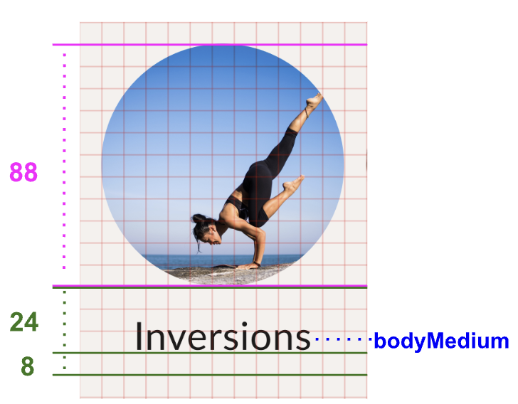

### 输入

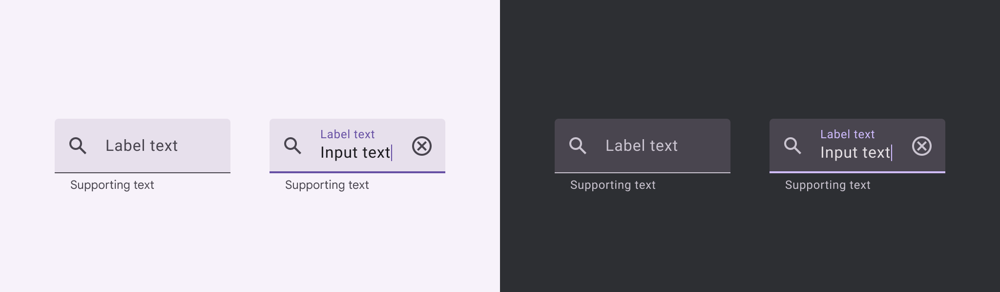


~~~kotlin
TextField(
    value = "",
    onValueChange = {},
    leadingIcon = {Icon(imageVector = Icons.Default.Search, contentDescription = null)},
    colors = TextFieldDefaults.colors(
        unfocusedContainerColor = MaterialTheme.colorScheme.surface,
        focusedContainerColor = MaterialTheme.colorScheme.surface,
    ),
    placeholder = {
      Text(stringResource(R.string.placeholder_search))
    },
    modifier = modifier
        .fillMaxWidth()
        .heightIn(min = 56.dp)
)
~~~


### 对话框

~~~kotlin
import androidx.compose.material3.AlertDialog

@Composable
fun AlertDialog(
    onDismissRequest: () -> Unit,
    buttons: @Composable () -> Unit,
    modifier: Modifier = Modifier,
    title: (@Composable () -> Unit)? = null,
    text: @Composable (() -> Unit)? = null,
    shape: Shape = MaterialTheme.shapes.medium,
    backgroundColor: Color = MaterialTheme.colors.surface,
    contentColor: Color = contentColorFor(backgroundColor),
    properties: DialogProperties = DialogProperties()
)
~~~

~~~kotlin
@Preview
@Composable
fun alertDialog(){
    var showDialog by remember {
        mutableStateOf(false)
    }
    Column() {
        Button(onClick = { showDialog = !showDialog }) {
            Text("click show AlerDialog")
        }
        if (showDialog) {
            AlertDialog(
                onDismissRequest = {
                    showDialog = false
                },
                title = {
                    Text(text = "Title")
                },
                text = {
                    Text(
                        "This area typically contains the supportive text " +
                                "which presents the details regarding the Dialog's purpose."
                    )
                },
                confirmButton = {
                    TextButton(
                        onClick = {
                            showDialog = false
                        }
                    ) {
                        Text("Confirm")
                    }
                },
                dismissButton = {
                    TextButton(
                        onClick = {
                            showDialog = false
                        }
                    ) {
                        Text("Dismiss")
                    }
                }
            )
        }
    }
}
~~~


`AlertDialog` 在一些情况下有可能还是无法满足我们的业务要求，这时候我们就可以使用更底层的一个 @Composable 函数 —— Dialog


### 按钮

~~~kotlin
@OptIn(ExperimentalMaterialApi::class)
@Composable
fun Button(
    onClick: () -> Unit,
    modifier: Modifier = Modifier,
    enabled: Boolean = true,
    interactionSource: MutableInteractionSource = remember { MutableInteractionSource() },
    elevation: ButtonElevation? = ButtonDefaults.elevation(),
    shape: Shape = MaterialTheme.shapes.small,
    border: BorderStroke? = null,
    colors: ButtonColors = ButtonDefaults.buttonColors(),
    contentPadding: PaddingValues = ButtonDefaults.ContentPadding,
    content: @Composable RowScope.() -> Unit
)
~~~


### Icon

Icon 组件用于帮助开发者显示一系列的小图标。Icon 组件支持三种不同类型的

- ImageVector：矢量图对象，可以显示 SVG 格式的图标

  ~~~kotlin
  Icon(imageVector = ImageVector.vectorResource(
      id = R.drawable.ic_svg, contentDescription = "矢量图资源"
  ~~~

  

- ImageBitmap：位图对象，可以显示 JPG，PNG 等格式的图标

  ~~~kotlin
  Icon(bitmap = ImageBitmap.imageResource(
      id = R.drawable.ic_png), contentDescription = "图片资源")
  ~~~

  

- Painter：代表一个自定义画笔，可以使用画笔在 Canvas 上直接绘制图标 我们除了直接传入具体类型的实例，也可以通过 res/ 下的图片资源来设置图标：


`contentDescription` 参数服务于系统的无障碍功能，其中的文字会转换为语言供视障人士听取内容时使用，这个参数没有默认值，必须手动设置， 也是官方有意为之，提醒开发者重视应用对于残障人士的关怀。


我们可以使用Material 包预置的 Favorite 矢量图标，通过 Icons.xxx.xxx 的方式调用

| Icon 类型 | 特点         | 代表示例                                                     |
| --------- | ------------ | ------------------------------------------------------------ |
| Outlined  | 勾勒轮廓     |  |
| Filled    | 图形填充     |  |
| Rounded   | 端点均为圆角 |  |
| Sharp     | 端点均为尖角 |  |
| TwoTone   | 双色搭配     |   |


### 图片

首先下载图片，然后在 Android Studio 中，依次点击 **View > Tool Windows > Resource Manager**，或点击 **Project** 窗口旁边的 **Resource Manager** 标签页。

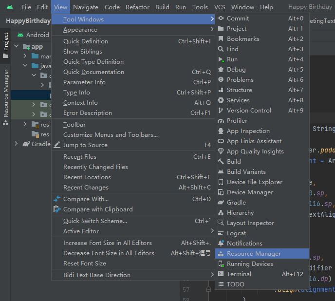


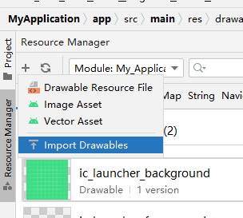

然后在代码中，用[`painterResource()`](https://developer.android.com/reference/kotlin/androidx/compose/ui/res/package-summary?hl=zh-cn#painterResource(kotlin.Int)) 函数加载图片资源：

~~~kotlin
val image = painterResource(R.drawable.androidparty);
~~~

~~~kotlin
import androidx.compose.foundation.Image
Image(
   painter = image
   contentDescription = null
   contentScale = ContentScale.Crop
   alpha = 0.5F
)
~~~

其中，`contentDescription`属性用来支持无障碍功能， 实参设为 `null`，以便 `TalkBack` 跳过 `Image` 可组合项。

> [TalkBack](https://support.google.com/accessibility/android/answer/6283677?hl=zh-cn) 是 Android 设备随附的 Google 屏幕阅读器

 `alpha`参数可以更改背景图片的不透明度

`ContentScale`参数指定如何调整图片大小

- ContentScale.Crop

  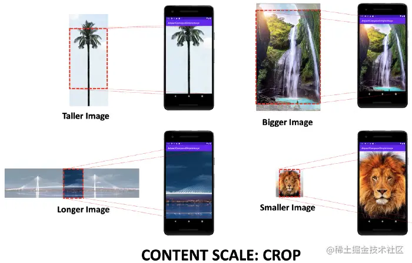

- ContentScale.Fit

  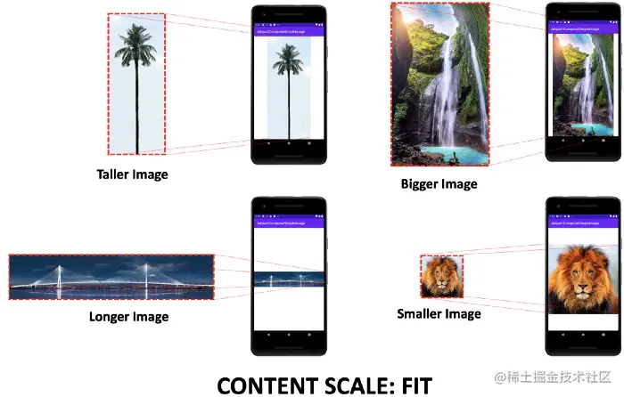

- ContentScale.FillBounds

  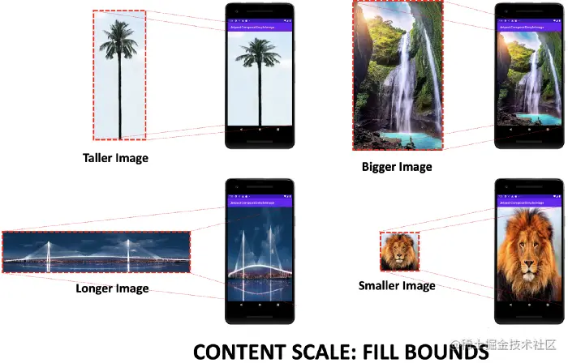


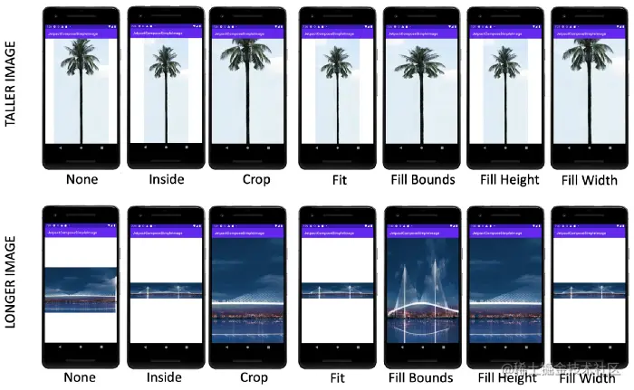


~~~kotlin
@Composable
fun Image(
    painter: Painter,
    contentDescription: String?,
    modifier: Modifier = Modifier,
    alignment: Alignment = Alignment.Center,
    contentScale: ContentScale = ContentScale.Fit,
    alpha: Float = DefaultAlpha,
    colorFilter: ColorFilter? = null
)
~~~

~~~kotlin
Image(
    painter = painterResource(id = R.drawable.wallpaper),
    contentDescription = null
)
~~~

Compose 自带的 `Image` 只能加载资源管理器中的图片文件，如果想加载网络图片或者是其他本地路径下的文件，则需要考虑其他的库，比如 [Coil](https://coil-kt.github.io/coil/compose/)

记得打开网络权限测试

~~~xml
<uses-permission android:name="android.permission.INTERNET" />
~~~

~~~kotlin
AsyncImage(
    model = ImageRequest.Builder(LocalContext.current)
        .data("https://example.com/image.jpg")
        .crossfade(true)
        .build(),
    placeholder = painterResource(R.drawable.placeholder),
    contentDescription = stringResource(R.string.description),
    contentScale = ContentScale.Crop,
    modifier = Modifier.clip(CircleShape)
)
~~~


### 像素

因为不同的屏幕具有不同的像素密度，所以同样数量的像素在不同的设备上可能对应于不同的物理尺寸。

Android 应用中的界面元素使用两种不同的度量单位：

- 密度无关像素 (DP)
- 可缩放像素 (SP)


如果将某个视图定义为“100px”宽，那么它在左侧设备上看起来要大得多。因此，您必须改用“100dp”来确保它在两个屏幕上看起来大小相同。


dp 是一个虚拟像素单位，1 dp 约等于中密度屏幕（160dpi；“基准”密度）上的 1 像素。对于其他每个密度，Android 会将此值转换为相应的实际像素数。
$$
px = dp * (dpi / 160)
$$


在定义文本大小时，您应改用可缩放像素 (sp) 作为单位（但切勿将 sp 用于布局尺寸）。默认情况下，sp 单位与 dp 大小相同，但它会根据用户的首选文本大小来做调整。


假设在某一应用中，用户的手指至少移动 16 像素之后，系统才会识别出滚动或滑动手势。在基线屏幕上，用户必须移动 `16 pixels / 160 dpi`（2.5 毫米），系统才会识别该手势。而在配备高密度显示屏 (240dpi) 的设备上，用户的手指必须至少移动 `16 pixels / 240 dpi`（1.7 毫米）。因此用户会感觉应用在该设备上更灵敏。要解决此问题，必须在代码中以 `dp` 表示手势阈值，然后再转换为实际像素。例如：

~~~kotlin
// The gesture threshold expressed in dp
    private const val GESTURE_THRESHOLD_DP = 16.0f
    ...
    private var mGestureThreshold: Int = 0
    ...
    override fun onCreate(savedInstanceState: Bundle?) {
        super.onCreate(savedInstanceState)

        // Get the screen's density scale
        val scale: Float = resources.displayMetrics.density
        // Convert the dps to pixels, based on density scale
        mGestureThreshold = (GESTURE_THRESHOLD_DP * scale + 0.5f).toInt()

        // Use mGestureThreshold as a distance in pixels...
    }
~~~

`DisplayMetrics.density` 字段根据当前像素密度指定将 `dp` 单位转换为像素时所必须使用的缩放系数。在中密度屏幕上，`DisplayMetrics.density` 等于 1.0；在高密度屏幕上，它等于 1.5；在超高密度屏幕上，等于 2.0；在低密度屏幕上，等于 0.75。


要在像素密度不同的设备上提供良好的图形质量，您应该以相应的分辨率在应用中提供每个位图的多个版本（针对每个密度级别提供一个版本）。否则，Android 系统必须缩放位图，使其在每个屏幕上占据相同的可见空间，从而导致缩放失真，如模糊。


适用于不同像素密度的配置限定符：

| `ldpi`    | 适用于低密度 (ldpi) 屏幕 (~ 120dpi) 的资源。                 |
| --------- | ------------------------------------------------------------ |
| `mdpi`    | 适用于中密度 (mdpi) 屏幕 (~ 160dpi) 的资源（这是基准密度）。 |
| `hdpi`    | 适用于高密度 (hdpi) 屏幕 (~ 240dpi) 的资源。                 |
| `xhdpi`   | 适用于加高 (xhdpi) 密度屏幕 (~ 320dpi) 的资源。              |
| `xxhdpi`  | 适用于超超高密度 (xxhdpi) 屏幕 (~ 480dpi) 的资源。           |
| `xxxhdpi` | 适用于超超超高密度 (xxxhdpi) 屏幕 (~ 640dpi) 的资源。        |
| `nodpi`   | 适用于所有密度的资源。这些是与密度无关的资源。无论当前屏幕的密度是多少，系统都不会缩放以此限定符标记的资源。 |
| `tvdpi`   | 适用于密度介于 mdpi 和 hdpi 之间的屏幕（约 213dpi）的资源。这不属于“主要”密度组。它主要用于电视，而大多数应用都不需要它。对于大多数应用而言，提供 mdpi 和 hdpi 资源便已足够，系统将视情况对其进行缩放。如果您发现有必要提供 tvdpi 资源，应按一个系数来确定其大小，即 1.33*mdpi。例如，如果某张图片在 mdpi 屏幕上的大小为 100px x 100px，那么它在 tvdpi 屏幕上的大小应该为 133px x 133px。 |

要针对不同的密度创建备用可绘制位图资源，您应遵循六种主要密度（ldpi ~ xxxhdpi）之间的 **3:4:6:8:12:16 缩放比**。

然后，将生成的图片文件置于 `res/` 下的相应子目录中，系统将自动根据运行您的应用的设备的屏幕密度选取正确的文件：

~~~xml
  res/
      drawable-xxxhdpi/
        awesome-image.png
      drawable-xxhdpi/
        awesome-image.png
      drawable-xhdpi/
        awesome-image.png
      drawable-hdpi/
        awesome-image.png
      drawable-mdpi/
        awesome-image.png
~~~

之后，每当您引用 `@drawable/awesomeimage` 时，系统便会根据屏幕 dpi 选择相应的位图。如果您没有为某个密度提供特定于密度的资源，那么系统会选取下一个最佳匹配项并对其进行缩放以适合屏幕。

您应将所有应用图标都放在 `mipmap` 目录中，而不是放在 `drawable` 目录中。

~~~xml
  res/
      mipmap-xxxhdpi/
        launcher-icon.png
      mipmap-xxhdpi/
        launcher-icon.png
      mipmap-xhdpi/
        launcher-icon.png
      mipmap-hdpi/
        launcher-icon.png
      mipmap-mdpi/
        launcher-icon.png
    
~~~


除了创建多个特定于密度的图片版本之外，另一种方法是仅创建一个矢量图形。在借助矢量图形创建图片时，是在使用 XML 来定义路径和颜色。因此，矢量图形可以缩放到任何尺寸而不会出现缩放失真矢量图形通常以 SVG（可缩放矢量图形）文件的形式提供，但 Android 不支持此格式，因此您必须将 SVG 文件转换为 Android 的[矢量图](https://developer.android.com/guide/topics/graphics/vector-drawable-resources?hl=zh-cn)格式。您可以在 Android Studio 中使用 [Vector Asset Studio](https://developer.android.com/studio/write/vector-asset-studio?hl=zh-cn) 轻松地将 SVG 转换为矢量图，具体步骤如下：

1. 在 **Project** 窗口中，右键点击 **res** 目录，然后依次选择 **New > Vector Asset**。
2. 选择 **Local file (SVG, PSD)**。
3. 找到要导入的文件并进行任何调整。

可以对所有像素密度使用一个矢量图，所以此文件位于默认的 drawable 目录中（您不需要使用特定于密度的目录）：

~~~xml
res/
      drawable/
        ic_android_launcher.xml
~~~


如果您请求预缩放的资源的尺寸，系统将返回表示缩放后尺寸的值。例如，假设针对 mdpi 屏幕设计了一个 50x50 像素的位图，它在 hdpi 屏幕上会放大到 75x75 像素（如果没有针对 hdpi 的备用资源），那么系统会将尺寸报告为 75x75 像素。

不推荐关闭预缩放行为，这会导致预期外的结果


### 资源

资源是指代码使用的附加文件和静态内容，例如位图、布局定义、界面字符串、动画说明等。您应该始终将应用资源（如图片和字符串）与代码分隔开，以便能够独立地维护这些资源。

~~~xml
MyProject/
    src/
        MyActivity.kt
    res/
        drawable/
            graphic.png
        mipmap/
            icon.png
        values/
            strings.xml
~~~

项目 `res/` 目录中支持的资源目录：

| `animator/` | 用于定义[属性动画](https://developer.android.com/guide/topics/graphics/prop-animation?hl=zh-cn)的 XML 文件。 |
| ----------- | ------------------------------------------------------------ |
| `anim/`     | 用于定义[补间动画](https://developer.android.com/guide/topics/graphics/view-animation?hl=zh-cn#tween-animation)的 XML 文件。 |
| `color/`    | 用于定义颜色状态列表的 XML 文件                              |
| `drawable/` | 位图文件（PNG、`.9.png`、JPG 或 GIF）或编译为以下可绘制资源子类型的 XML 文件：位图文件九宫图（可调整大小的位图）状态列表形状动画可绘制对象其他可绘制对象 |
| `mipmap/`   | 适用于不同启动器图标密度的可绘制对象文件                     |
| `layout/`   | 用于定义界面布局的 XML 文件。                                |
| `menu/`     | 用于定义应用菜单（例如选项菜单、上下文菜单或子菜单）的 XML 文件。 |
| `raw/`      | 需以原始形式保存的任意文件。如要使用原始 `InputStream` 打开这些资源，请使用资源 ID（即 `R.raw.filename`）调用 `Resources.openRawResource()`。但是，如需访问原始文件名和文件层次结构，请考虑将资源保存在 `assets/` 目录（而非 `res/raw/`）下。`assets/` 中的文件没有资源 ID，因此您只能使用 `AssetManager` 读取这些文件。 |
| `values/`   | 包含字符串、整数和颜色等简单值的 XML 文件。                  |
| `xml/`      | 可在运行时通过调用 `Resources.getXML()` 读取的任意 XML 文件。各种 XML 配置文件（例如[搜索配置](https://developer.android.com/guide/topics/search/searchable-config?hl=zh-cn)）都必须保存在此处。 |
| `font/`     | 带有扩展名的字体文件（例如 TTF、OTF 或 TTC），或包含 `<font-family>` 元素的 XML 文件。 |


可以使用在项目的 `R` 类中生成的资源 ID 访问资源。在大多数情况下，资源 ID 与文件名相同。


例如，可以使用以下代码访问上面的文件层次结构中的图片：

~~~xml
R.drawable.graphic
~~~

实际上，`R.XXX`都是一个类型为`Int`的资源标识符。我们可以通过`@DrawableRes`以及`@StringRes`来标识这些标识符。

~~~kotlin
fun FavoriteCollectionCard(
    @DrawableRes drawable: Int,
    @StringRes text: Int,
    modifier: Modifier = Modifier
)
~~~

### 列表和网格

系统会对所有的列表项进行组合和布局，无论它们是否可见。因此在有大量列表项时，使用 [`Column`](https://developer.android.google.cn/reference/kotlin/androidx/compose/foundation/layout/package-summary?hl=zh-cn#Column(androidx.compose.ui.Modifier,androidx.compose.foundation.layout.Arrangement.Vertical,androidx.compose.ui.Alignment.Horizontal,kotlin.Function1)) 等布局可能会导致性能问题。Compose提供了延迟列表来解决这个问题，即只对可见的列表项进行加载。

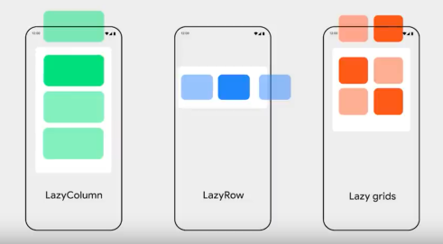


延迟组件并不是通过接受@Composable内容块参数来进行组合的，而是提供了一个 `LazyListScope.()` 块。此 [`LazyListScope`](https://developer.android.google.cn/reference/kotlin/androidx/compose/foundation/lazy/LazyListScope?hl=zh-cn) 块提供一个 DSL，允许应用描述列表项内容。

~~~kotlin
LazyColumn {
    // Add a single item
    item {
        Text(text = "First item")
    }

    // Add 5 items
    items(5) { index ->
        Text(text = "Item: $index")
    }

    // Add another single item
    item {
        Text(text = "Last item")
    }
}
~~~

~~~kotlin
import androidx.compose.foundation.lazy.items

@Composable
fun MessageList(messages: List<Message>) {
    LazyColumn {
        items(messages) { message ->
            MessageRow(message)
        }
    }
}
~~~


请注意 [**`LazyColumn`**](https://developer.android.google.cn/reference/kotlin/androidx/compose/foundation/lazy/package-summary?hl=zh-cn#LazyColumn(androidx.compose.ui.Modifier,androidx.compose.foundation.lazy.LazyListState,androidx.compose.foundation.layout.PaddingValues,kotlin.Boolean,androidx.compose.foundation.layout.Arrangement.Vertical,androidx.compose.ui.Alignment.Horizontal,androidx.compose.foundation.gestures.FlingBehavior,kotlin.Boolean,kotlin.Function1)) 的实现：

```
@Composable
fun LazyColumn(
...
    state: LazyListState = rememberLazyListState(),
...
```

可组合函数 `rememberLazyListState` 使用 `rememberSaveable` 为列表创建初始状态。重新创建 activity 后，无需任何编码即可保持滚动状态。


此外，还可以通过verticalScroll修饰符来创建一个简单的滚动列表，这是当列表项比较少时才使用的：

~~~kotlin
Column(
    modifier.verticalScroll(rememberScrollState())) {
    
}
~~~

这些修饰符需要 [`ScrollState`](https://developer.android.google.cn/reference/kotlin/androidx/compose/foundation/ScrollState?hl=zh-cn)，它包含当前的滚动状态，可用于从外部修改滚动状态。若不需要修改滚动状态，可以只使用 [`rememberScrollState`](https://developer.android.google.cn/reference/kotlin/androidx/compose/foundation/package-summary?hl=zh-cn#rememberScrollState(kotlin.Int)) 创建一个持久的 `ScrollState` 实例。


延迟网格有`LazyVerticalGrid`、`LazyHorizontalGrid`。们还使用非常相似的 DSL - [`LazyGridScope.()`](https://developer.android.google.cn/reference/kotlin/androidx/compose/foundation/lazy/grid/LazyGridScope?hl=zh-cn) 来描述内容。

~~~kotlin
@Composable
fun PhotoGrid(photos: List<Photo>) {
    LazyVerticalGrid(
        // 指定列表项的宽度
        columns = GridCells.Adaptive(minSize = 128.dp)
    ) {
        items(photos) { photo ->
            PhotoItem(photo)
        }
    }
}
~~~

[`GridCells.Fixed`](https://developer.android.google.cn/reference/kotlin/androidx/compose/foundation/lazy/grid/GridCells.Fixed?hl=zh-cn) 可以指定网格的列数。

~~~kotlin
LazyHorizontalGrid(
    rows = GridCells.Fixed(2),
    modifier = modifier
) {

}
~~~


通过span参数，可以指定非标准尺寸的列表项：

~~~kotlin
LazyVerticalGrid(
    // ...
) {
    item(span = {
        // LazyGridItemSpanScope:
        // maxLineSpan
        GridItemSpan(maxLineSpan)
    }) {
        CategoryCard(“Fruits”)
    }
    // ...
}
~~~


`contentPadding`设置的边距会应用于内容，而不是 `LazyColumn` 本身。而通过modifier设置的，会应用在`LazyColumn`本身

~~~kotlin
LazyColumn(
    contentPadding = PaddingValues(horizontal = 16.dp, vertical = 8.dp),
) {
    // ...
}
~~~

如需在列表项之间添加间距，可以使用 [`Arrangement.spacedBy()`](https://developer.android.google.cn/reference/kotlin/androidx/compose/foundation/layout/Arrangement?hl=zh-cn#spacedBy(androidx.compose.ui.unit.Dp))：

~~~kotlin
LazyColumn(
    verticalArrangement = Arrangement.spacedBy(4.dp),
) {
    // ...
}
~~~

~~~kotlin
LazyVerticalGrid(
    columns = GridCells.Fixed(2),
    verticalArrangement = Arrangement.spacedBy(16.dp),
    horizontalArrangement = Arrangement.spacedBy(16.dp)
) {
    items(data) { item ->
        Item(item)
    }
}
~~~


默认情况下，每个列表项的状态与该项在列表中的位置相对应。但是，如果数据集发生变化，那么这些列表项的状态随之也会丢失。为避免出现此情况，我们可以为每一个列表项指定一个key：

~~~kotlin
@Composable
fun MessageList(messages: List<Message>) {
    LazyColumn {
        items(
            items = messages,
            key = { message ->
                // Return a stable + unique key for the item
                message.id
            }
        ) { message ->
            MessageRow(message)
        }
    }
}
~~~

键的类型必须受 [`Bundle`](https://developer.android.google.cn/reference/android/os/Bundle?hl=zh-cn) 支持，`Bundle` 支持基元、枚举或 Parcelable 等类型。


## 布局

### Box、Column、Row

Compose 中的 3 个基本标准布局元素是 [`Column`](https://developer.android.com/reference/kotlin/androidx/compose/foundation/layout/package-summary?hl=zh-cn#Column(androidx.compose.ui.Modifier,androidx.compose.foundation.layout.Arrangement.Vertical,androidx.compose.ui.Alignment.Horizontal,kotlin.Function1))、[`Row`](https://developer.android.com/reference/kotlin/androidx/compose/foundation/layout/package-summary?hl=zh-cn#Row(androidx.compose.ui.Modifier,androidx.compose.foundation.layout.Arrangement.Horizontal,androidx.compose.ui.Alignment.Vertical,kotlin.Function1)) 和 [`Box`](https://developer.android.com/reference/kotlin/androidx/compose/foundation/layout/package-summary?hl=zh-cn#Box(androidx.compose.ui.Modifier,androidx.compose.ui.Alignment,kotlin.Boolean,kotlin.Function1)) 可组合项


 [`verticalArrangement`](https://developer.android.com/reference/kotlin/androidx/compose/foundation/layout/package-summary?hl=zh-cn#Column(androidx.compose.ui.Modifier,androidx.compose.foundation.layout.Arrangement.Vertical,androidx.compose.ui.Alignment.Horizontal,kotlin.Function1)) 属性来定义 `Column` 中的子元素的排列方式

 `horizontalArrangement` 属性来定义 `Row` 中的子元素的排列方式

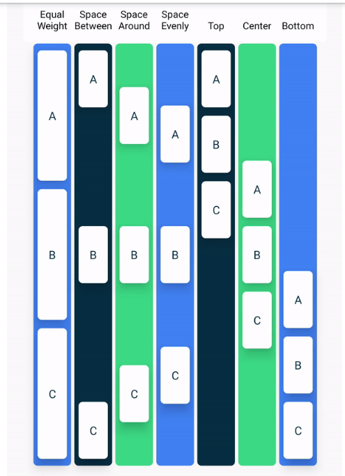

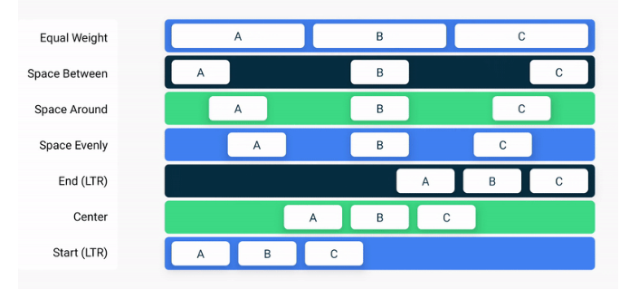


[`Box`](https://developer.android.com/reference/kotlin/androidx/compose/foundation/layout/package-summary?hl=zh-cn#Box(androidx.compose.ui.Modifier,androidx.compose.ui.Alignment,kotlin.Boolean,kotlin.Function1)) 布局是 Compose 中的标准布局元素之一。使用 `Box` 布局可将元素堆叠在一起。`Box` 布局还可用于配置它所包含的元素的特定对齐方式。

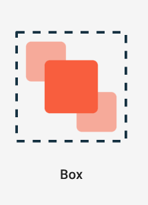

对于 `Box`，您可以使用`contentAlignment`属性来同时使用水平对齐和垂直对齐。具体选项包括：`TopStart`、`Center`、`BottomEnd`等

### FlowLayout

Flow Layout 包括 `FlowRow` 和 `FlowColumn` ，当一行（或一列）放不下里面的内容时，会自动换行。这些流式布局还允许使用权重进行动态调整大小，以将项目分配到容器中。


~~~kotlin
 @Composable
 fun Filters() {
   val filters = listOf(
     "Washer/Dryer", "Ramp access", "Garden", "Cats OK", "Dogs OK", "Smoke-free"
   )
   FlowRow(
     horizontalArrangement = Arrangement.spacedBy(8.dp)
   ) {
     filters.forEach { title ->
       var selected by remember { mutableStateOf(false) }
       val leadingIcon: @Composable () -> Unit = { Icon(Icons.Default.Check, null) }
       FilterChip(
         selected,
         onClick = { selected = !selected },
         label = { Text(title) },
         leadingIcon = if (selected) leadingIcon else null
       )
     }
   }
 }
~~~


### 响应式布局


通过`calculateWindowSizeClass`获取当前屏幕的配置

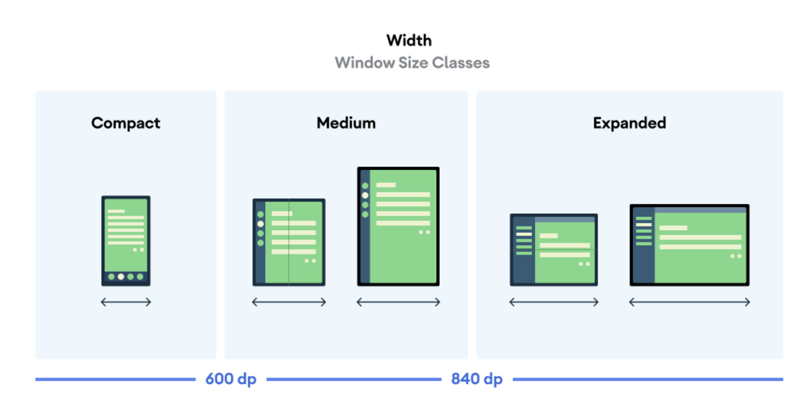

~~~kotlin
val windowSizeClass = calculateWindowSizeClass(activity = this)
when (windowSize.widthSizeClass) {
    WindowWidthSizeClass.Compact -> {
        MySootheAppPortrait()
    }
    WindowWidthSizeClass.Expanded -> {
        MySootheAppLandscape()
    }
}
~~~


### Modifier

通过`Modifier`我们可以设置控件的以下属性

- 更改可组合项的尺寸、布局、行为和外观。
- 添加信息，例如无障碍标签。
- 处理用户输入。
- 添加高级互动，例如使元素可点击、可滚动、可拖动或可缩放。

> 优秀实践是为所有可组合函数提供默认的 [`Modifier`](https://developer.android.google.cn/reference/kotlin/androidx/compose/ui/Modifier?hl=zh-cn)，从而提高可重用性。它应作为第一个可选参数，且位于所有必需参数之后。


Modifier的属性有

- `background` 设置背景

- `padding` 设置边距

  ~~~kotlin
  Modifier.padding(
      start = 16.dp,
      top = 16.dp,
      end = 16.dp,
      bottom = 16.dp
  )
  ~~~

- `aspectRatio` 按照宽高比例进行设置

- `fillMaxSize`：高度填满父容器空间

- `wrapContentSize` 根据子级元素的宽高来确定自身的宽度和高度。如果内容的大小小于我们所设置的最小尺寸，那么就会按照我们指定的`align`参数对子项进行对齐。另外如果我们将`unbounded`参数设置为`true`，其还会忽略设置的最大宽度和最大高度。

- `size` 指定元素的宽高，受到自身约束的限制

- `requiredSize`，不受到自身约束的限制

-  `heightIn`，确保该可组合项具有特定的最小高度

- `weight`：弹性布局

  ~~~kotlin
  fun Modifier.weight(
      weight: @FloatRange(from = 0.0, fromInclusive = false) Float,
      fill: Boolean = true
  ): Modifier
  ~~~

  -  `weight`：The proportional width to give to this element, as related to the total of all weighted siblings. Must be positive.
  -  `fill`：When `true`, the element will occupy the whole width allocated.

- `clip`：剪切

  


使用的例子：

~~~kotlin
Column(modifier = Modifier
  .fillMaxWidth()
  .height(100.dp)
  .verticalScroll(rememberScrollState())
)
~~~

### Surface

Surface可以让开发人员控制阴影、边框、形状和背景色等元素的视觉效果。它的属性有：

-  shape ：按指定形状进行裁剪

   ~~~kotlin
   shape = RoundedCornerShape(8.dp)
   ~~~

-  `elevation` ：设置容器平面的高度，即阴影效果

- `border`：设置边框的粗细以及色值


### Spacer

`Spacer` 能够提供一个空白的布局，可以使用 `Modifier.width`, `Modifier.height` 和 `Modifier.size` 来填充


### Pager

`Pager` 即传统 View 体系中 `ViewPager` 的替代，但在使用上大大降低了复杂度。它包括 `VerticalPager` 和 `HorizontalPager` 两类，分别对应纵向和横向的滑动。

~~~kotlin
 @Composable
fun HorizontalPagerWithIndicator() {
    val pagerState = rememberPagerState()
    val scope = rememberCoroutineScope()

    Column {
        TabRow(
            modifier = Modifier.fillMaxWidth(),
            // Our selected tab is our current page
            selectedTabIndex = pagerState.currentPage,
            // Override the indicator, using the provided pagerTabIndicatorOffset modifier
            indicator = { tabPositions ->
                TabRowDefaults.Indicator(
                    Modifier.pagerTabIndicatorOffset(
                        pagerState = pagerState,
                        tabPositions = tabPositions
                    )
                )
            }
        ) {
            // Add tabs for all of our pages
            pages.forEachIndexed { index, title ->
                Tab(
                    text = { Text(title) },
                    selected = pagerState.currentPage == index,
                    onClick = {
                        scope.launch {
                            pagerState.animateScrollToPage(index)
                        }
                    },
                )
            }
        }

        HorizontalPager(
            pageCount = pages.size,
            state = pagerState,
            modifier = Modifier.fillMaxSize().background(MaterialTheme.colors.surface)
        ) { page ->
            Text(
                text = "Page $page",
                style = MaterialTheme.typography.h5,
                modifier = Modifier
                    .fillMaxSize()
                    .wrapContentSize(Alignment.Center),
                textAlign = TextAlign.Center,
            )
        }
    }
}
~~~


### 下拉刷新

`Modifier.pullRefresh` 可以用于下拉刷新的实现。它的签名如下：

```kotlin
fun Modifier.pullRefresh(
    state: PullRefreshState,
    enabled: Boolean = true
) 
```


第一个参数用于存储下拉的进度，第二个代表是否启用。

~~~kotlin
@OptIn(ExperimentalMaterialApi::class)
@Composable
fun SwipeToRefreshTest(
    modifier: Modifier = Modifier
) {
    val list = remember {
        List(4){ "Item $it" }.toMutableStateList()
    }
    
    var refreshing by remember {
        mutableStateOf(false)
    }
    
    // 用协程模拟一个耗时加载
    val scope = rememberCoroutineScope()
    
    val state = rememberPullRefreshState(refreshing = refreshing, onRefresh = {     
        scope.launch {
            refreshing = true
            delay(1000) // 模拟数据加载
            list+="Item ${list.size+1}"
            refreshing = false
        }
    })
    
    Box(modifier = modifier
        .fillMaxSize()
        .pullRefresh(state)
    ){
        LazyColumn(Modifier.fillMaxWidth()){
            // ...
        }
        PullRefreshIndicator(refreshing, state, Modifier.align(Alignment.TopCenter))
    }
}
~~~


### 自定义布局

每个元素都会被要求根据父元素的约束来进行自我测量，约束中包含了父元素允许子元素的最大宽度与高度和最小宽度与高度。

对于一些包含多个子元素的UI元素，需要测量每一个子元素从而确定当前UI元素自身的大小。并且在每个子元素自我测量后，当前UI元素可以根据其所需要的宽度与高度进行在自己内部进行放置

使用 `Modifier.layout()` 手动控制元素的测量和布局。通常 layout 修饰符的使用方法像下面这样。

~~~kotlin
fun Modifier.customLayoutModifier(...) = Modifier.layout { measurable, constraints ->
  ...
})
~~~

通过使用 `measurable.measure(constraints)` 完成子元素的测量，子元素测量的结果被包装在一个 `Placeable` 实例中，可通过该`Placeable` 实例获取子元素测量结果。

~~~kotlin
Modifier.layout { measurable, constraints ->
  val placeable = measurable.measure(constraints)
  ...
}
~~~

现在子元素已经完成了测量流程，然后通过`layout(width, height)` 方法对当前元素的宽度与高度进行指定，以及对当前子元素布局

~~~kotlin
Modifier.layout { measurable, constraints ->
  val placeable = measurable.measure(constraints)
                 
  val firstBaseline = placeable[FirstBaseline]
  val placeableY = firstBaselineToTop.roundToPx() - firstBaseline
  val height = placeable.height + placeableY
  layout(placeable.width, height) {
    
  }
}
~~~

现在你可以通过使用 `placeable.placeRelative(x, y)` 来完成子元素的布局流程。

~~~kotlin
Modifier.layout { measurable, constraints ->
  ...
  val placeableY = firstBaselineToTop.roundToPx() - firstBaseline
  val height = placeable.height + placeableY
  layout(placeable.width, height) {
    placeable.placeRelative(0, placeableY)
  }
}
~~~


Layout Modifier 会将当前元素的所有子元素视作为整体进行统一的测量与布局，多适用于统一处理的场景。然而我们有时是需要精细化测量布局每一个子组件，这需要我们进行完全的自定义 Layout。我们应该使用 Layout Composable 了。

~~~kotlin
@Composable
fun CustomLayout(
    modifier: Modifier = Modifier,
    // custom layout attributes 
    content: @Composable () -> Unit
) {
    Layout(
        modifier = modifier,
        content = content
    ) { measurables, constraints ->
        // measure and position children given constraints logic here
       val placeables = measurables.map { measurable ->
            // 测量每个子元素，我们修改了最小的宽高为0
            // 这是因为，当父元素被设置为 fillMaxSize 时，constraints.maxWidth 与 constraints.maxHeight 会被设置为 Int.MAX_VALUE
            // 而我们的子元素并不需要也占据满父元素，所以我们将最小宽高设置为0
            measurable.measure(constraint.copy(minWidth = 0, minHeight = 0))
        }
        var yPosition = 0
        layout(constraints.maxWidth, constraints.maxHeight) {
            placeables.forEach { placeable ->
                // placeRelative 会根据当前 layoutDirection 自动调整子元素的位置（从左至右或从右至左）
                placeable.placeRelative(x = 0, y = yPosition)
                yPosition += placeable.height
            }
        }
    }
}
~~~


## Material

### NavigationBar

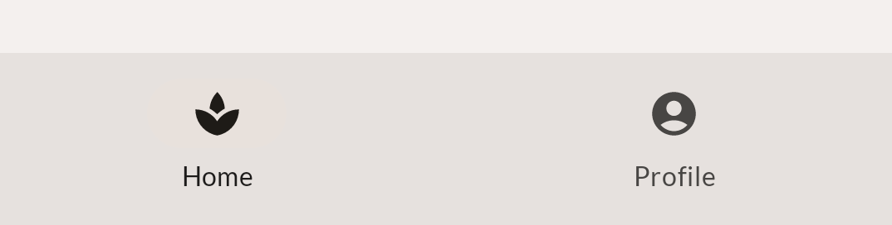

~~~kotlin
NavigationBar(
    containerColor = MaterialTheme.colorScheme.surfaceVariant,
    modifier = modifier
) {
    NavigationBarItem(
        icon = { Icon(
                	imageVector = Icons.Default.Spa,
           	    	contentDescription = null,)},
        label = { Text(
                	text = stringResource(R.string.bottom_navigation_home))},
        selected = true,
        onClick = {}
    )

    NavigationBarItem(
        icon = {Icon(
                	imageVector = Icons.Default.AccountCircle,
                	contentDescription = null)},
        label = {Text(
                	text = stringResource(R.string.bottom_navigation_profile))},
        selected = false,
        onClick = {}
    )
}
~~~

### Scaffold

`Scaffold` 实现了 **Material Design** 的基本视图界面结构

~~~kotlin
@Composable
fun Scaffold(
    modifier: Modifier = Modifier,
    scaffoldState: ScaffoldState = rememberScaffoldState(),
    topBar: @Composable () -> Unit = {},
    bottomBar: @Composable () -> Unit = {},
    snackbarHost: @Composable (SnackbarHostState) -> Unit = { SnackbarHost(it) },
    floatingActionButton: @Composable () -> Unit = {},
    floatingActionButtonPosition: FabPosition = FabPosition.End,
    isFloatingActionButtonDocked: Boolean = false,
    drawerContent: @Composable (ColumnScope.() -> Unit)? = null,
    drawerGesturesEnabled: Boolean = true,
    drawerShape: Shape = MaterialTheme.shapes.large,
    drawerElevation: Dp = DrawerDefaults.Elevation,
    drawerBackgroundColor: Color = MaterialTheme.colors.surface,
    drawerContentColor: Color = contentColorFor(drawerBackgroundColor),
    drawerScrimColor: Color = DrawerDefaults.scrimColor,
    backgroundColor: Color = MaterialTheme.colors.background,
    contentColor: Color = contentColorFor(backgroundColor),
    content: @Composable (PaddingValues) -> Unit
)
~~~


使用示例：

~~~kotlin
Scaffold(
    topBar = {
        TopAppBar(
            title = { Text("This is FirstActivity") },
            actions =  { demo_DropDownMenu() }
        )
    },

) { contentPadding ->
    Greeting(Modifier.padding(contentPadding))
   // 这个padding是必须传入的，否则内容会被topBar遮盖
}
~~~


### NavigationRail

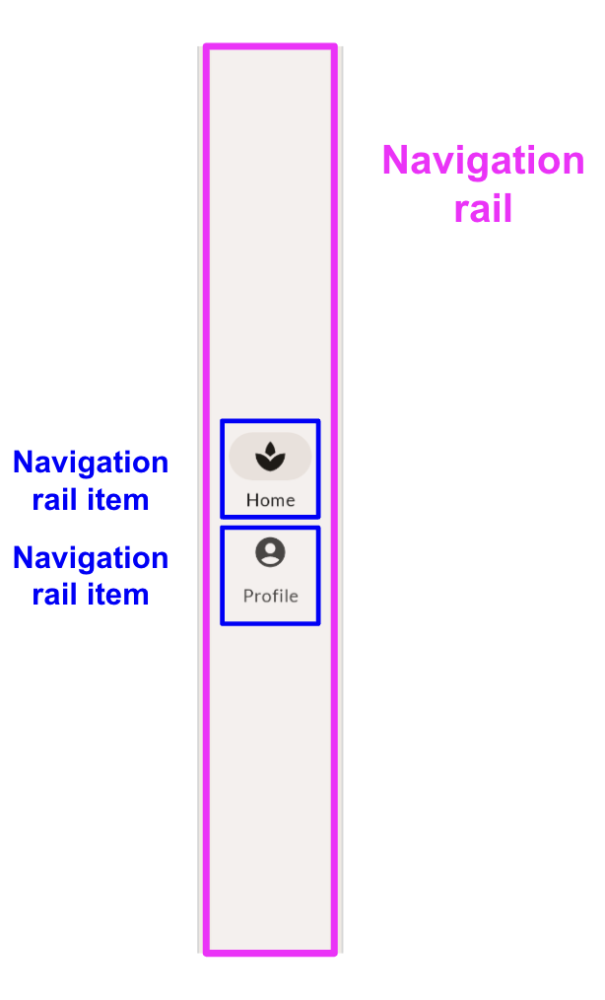

```
NavigationRail() {
    Column(
        modifier = modifier.fillMaxHeight(),
        verticalArrangement = Arrangement.Center,
        horizontalAlignment = Alignment.CenterHorizontally
    ) {
        NavigationRailItem(
            icon = { Icon(
                    imageVector = Icons.Default.Spa,
                    contentDescription = null,)}
            ,
            label = { Text(stringResource(id = R.string.bottom_navigation_home))},
            selected = true,
            onClick = {}
        )

        NavigationRailItem(
            icon = { Icon(
                        imageVector = Icons.Default.AccountCircle,
                        contentDescription = null)},
            label = {
                Text(stringResource(R.string.bottom_navigation_profile))
            },
            selected = false,
            onClick = {}
        )
    }
}
```

### DropdownMenu

https://alexzh.com/jetpack-compose-dropdownmenu/#:~:text=There%20are%20multiple%20implementations%20of%20the%20dropdown%20menu,selected%20item%20and%20an%20expandable%20list%20of%20options.

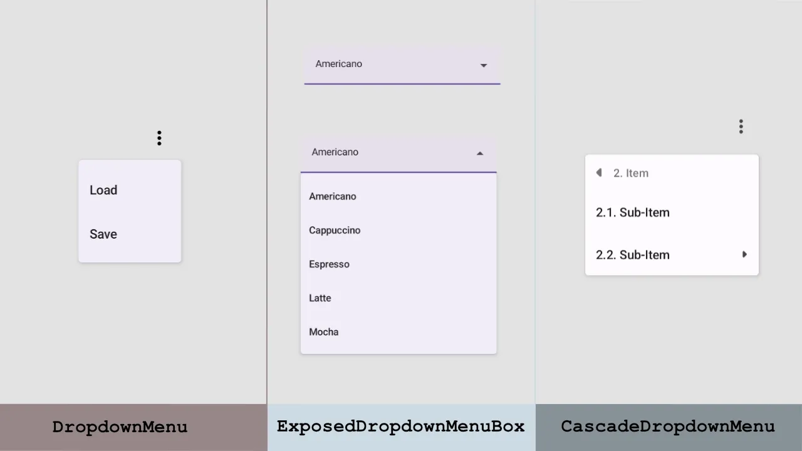


~~~kotlin
@Composable
fun demo_DropDownMenu() {
    val context = LocalContext.current;
    var expanded by remember { mutableStateOf(false) }

    Box(
        modifier = Modifier
            .wrapContentSize(Alignment.TopEnd)
    ) {
        IconButton(onClick = {expanded = !expanded}) {
            Icon(
                imageVector = Icons.Default.MoreVert,
                contentDescription = "More"
            )
        }

        DropdownMenu(
            expanded = expanded,
            onDismissRequest = { expanded = false }
        ) {
            DropdownMenuItem(
                text = { Text("Load") },
                onClick = { Toast.makeText(context, "Load", Toast.LENGTH_SHORT).show() }
            )
            DropdownMenuItem(
                text = { Text("Save") },
                onClick = { Toast.makeText(context, "Save", Toast.LENGTH_SHORT).show() }
            )
        }
    }
}
~~~


## 主题

Material 主题是一种有关于设计的系统化方法。

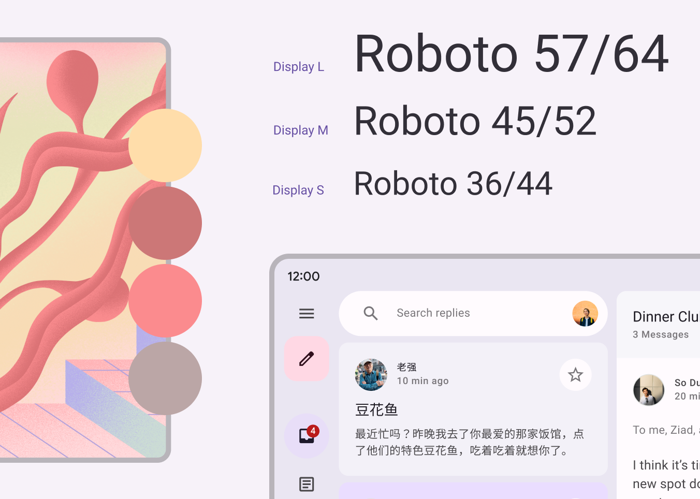

### 配色方案

配色方案的基础是五种关键颜色

- 强调色：

  - Primary：用于主要组件，例如显眼的按钮和活动状态

  - Secondary：用于界面中不太显眼的组件，例如过滤组件

  - Tertiary：提供对比鲜明的强调色

- 中性色：Neutral、Neutral Variant：用于应用中的背景和 Surface

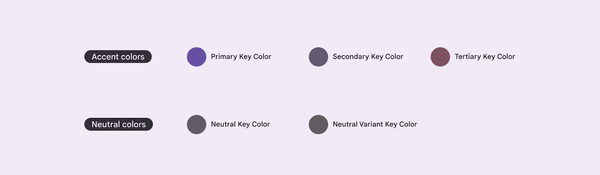

每种强调色（主色、辅色和第三色）都会提供四种不同色调的兼容色，以便进行配对、定义强调效果和视觉表现。

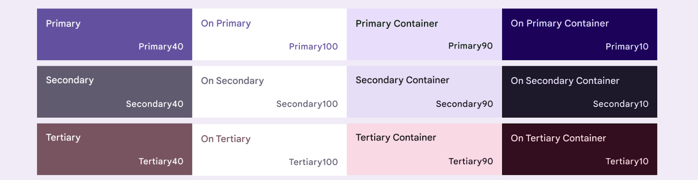

中性色也分为四种兼容的色调，用于 Surface 和背景：

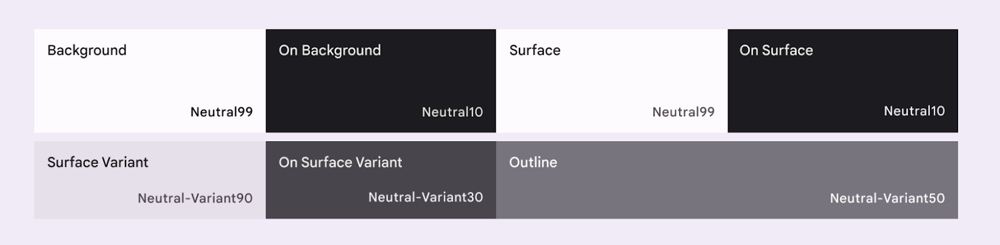


https://m3.material.io/theme-builder#/custom，这是自动生成配色方案的构造工具，我们可以以kotlin文件形式导出这些配置（`Color.kt`、`Theme.kt`）。


如何使用这些配色方案呢？

~~~kotlin
MaterialTheme.colorScheme.XXXX
~~~


[动态颜色](https://m3.material.io/styles/color/dynamic-color/overview)是 Material 3 的关键部分，使用此功能时，算法会从用户的壁纸中派生自定义颜色，以将其应用到其应用和系统界面。

动态颜色适用于 Android 12 及更高版本。如果动态颜色可用，您可以使用 `dynamicDarkColorScheme()` 或 `dynamicLightColorScheme()` 设置动态配色方案。

~~~kotlin
@Composable
fun AppTheme(
   useDarkTheme: Boolean =  isSystemInDarkTheme(),
   content: @Composable () -> Unit
) {
   val context = LocalContext.current
   val colors = when {
       (Build.VERSION.SDK_INT >= Build.VERSION_CODES.S) -> {
           if (useDarkTheme) dynamicDarkColorScheme(context)
           else dynamicLightColorScheme(context)
       }
       useDarkTheme -> DarkColors
       else -> LightColors
   }

      MaterialTheme(
       colorScheme = colors,
       content = content
     )
}
~~~


### 排版

Material Design 3 定义了一个[字体比例](https://m3.material.io/styles/typography/overview)。命名和分组已简化为：显示、大标题、标题、正文和标签，每个都有大号、中号和小号。

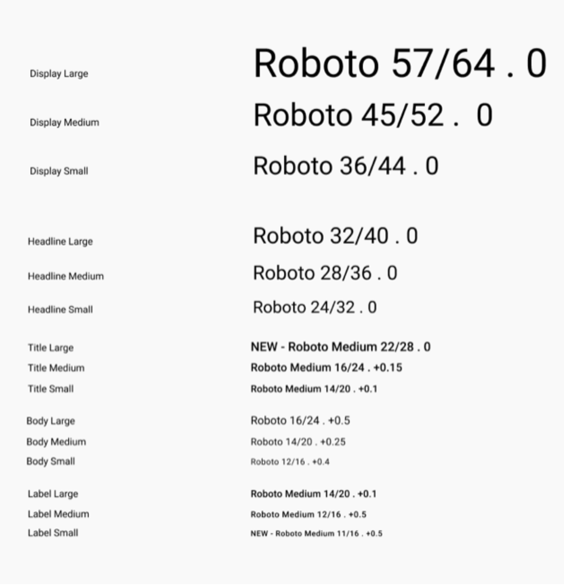

Compose 提供了 M3 [`Typography`](https://developer.android.google.cn/reference/kotlin/androidx/compose/material3/Typography?hl=zh-cn) 类以及现有的 [`TextStyle`](https://developer.android.google.cn/reference/kotlin/androidx/compose/ui/text/TextStyle?hl=zh-cn) 和 [`font-related`](https://developer.android.google.cn/reference/kotlin/androidx/compose/ui/text/font/package-summary?hl=zh-cn) 类，用以对 Material 3 字体比例进行建模。

~~~kotlin
Column {
    Text(
        text = msg.author,
        color = MaterialTheme.colors.secondaryVariant,
        style = MaterialTheme.typography.subtitle2 // 添加 style
    )
    Spacer(Modifier.padding(vertical = 4.dp))
    Text(
        text = msg.body,
        style = MaterialTheme.typography.body2 // 添加 style
    )
}
~~~


### 形状

自定义形状

~~~xml
val shapes = Shapes(
   extraSmall = RoundedCornerShape(4.dp),
   small = RoundedCornerShape(8.dp),
   medium = RoundedCornerShape(16.dp),
   large = RoundedCornerShape(24.dp),
   extraLarge = RoundedCornerShape(32.dp)
)
~~~


向MaterialTheme注册一个形状

~~~kotlin
@Composable
fun AppTheme(
   useDarkTheme: Boolean = isSystemInDarkTheme(),
   content: @Composable() () -> Unit
) {
  // dynamic theming content
   MaterialTheme(
       colorScheme = colors,
       typography = typography,
       shapes = shapes
       content = content
   )
}
~~~


将形状应用在组件上

- Material组件的`Shape`属性
- modifier的`background`属性

~~~kotlin
Card(shape = MaterialTheme.shapes.medium) { /* card content */ }
FloatingActionButton(shape = MaterialTheme.shapes.large) { /* fab content */}

Row(
   modifier = modifier
       .background(
           MaterialTheme.colorScheme.background,
           CircleShape
       ),
) {
   // Search bar content
}
~~~

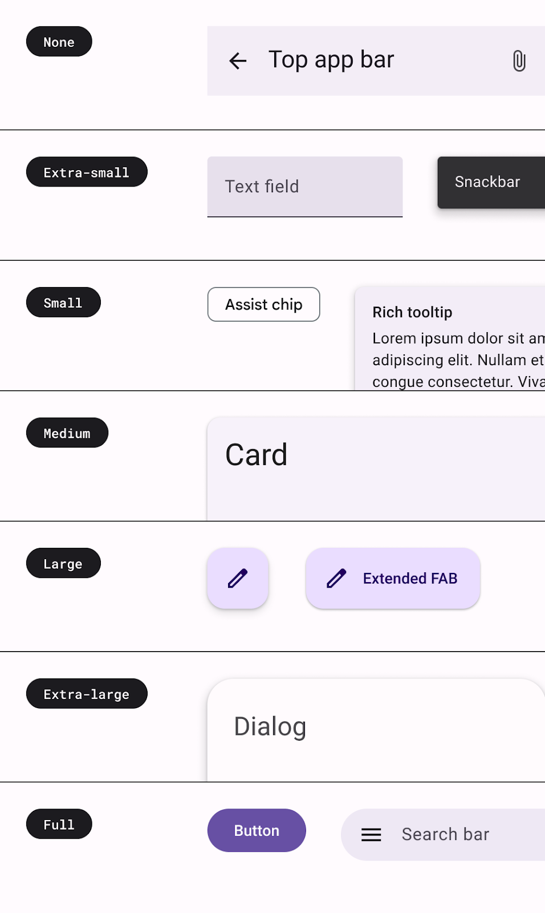


## 动画

如何对单个值的变化添加动画效果？我们可以使用`animate*AsState` API。例如为颜色变化添加动画

~~~kotlin
val backgroundColor by animateColorAsState(if (tabPage == TabPage.Home) Purple100 else Green300)
~~~

它所支持的属性值：Float、Color、Dp、Size、Bounds、Offset、Rect、Int、IntOffset 和 IntSize。这个API返回`State<T>`类型的实例，然后非动画值怎么使用，这个State<T>就怎么使用

~~~kotlin
val buttonSize by animateDpAsState(
    targetValue = if(change) 32.dp else 24.dp
)

Icon(
    Icons.Rounded.Favorite,
    contentDescription = null,
    modifier = Modifier.size(buttonSize),
)

~~~


注意，你不需要创建任何动画类的实例，也不需要处理中断。在背后，一个动画对象（即一个 `Animatable` 实例）将被创建，并被记住在调用地点，以第一个目标值作为其初始值。从那以后，任何时候你给这个 `Composable` 对象提供一个不同的目标值，一个动画就会自动开始向那个值发展。如果已经有一个动画在运行，这个动画就会从它的当前值（和速度）开始，然后向目标值动画。

例如：

~~~kotlin
animatedOffset.animateTo(targetValue,animationSpec = spring(stiffness = StiffnessLow))
~~~


`AnimatedVisibilty`是一个动画组件。每次指定的 `Boolean` 值发生变化时，`AnimatedVisibility` 会运行其动画。`AnimatedVisibility` 会以淡入和展开的方式显示元素，以淡出和缩小的方式隐藏元素。

我们可以设置`enter`与`exit`参数来指定动画：

~~~kotlin
AnimatedVisibility(
    visible = shown,
    enter = slideInVertically(),
    exit = slideOutVertically(),
){
    
}
~~~

`slideInVertically` 和 `slideOutVertically` 动画的偏移位置分别可以通过`initialOffsetY`以及`targetOffsetY`来指定。但是`slideInvertically`的终止位置（0）以及`slideOutVertically`的初始位置是不可设置的

~~~kotlin
AnimatedVisibility(
    visible = shown,
    enter = slideInVertically(
        // 默认值为 -fullHeight / 2，这里改为-fullHeight
        initialOffsetY = { fullHeight -> -fullHeight }
    ),
    exit = slideOutVertically(
        // 默认值为 -fullHeight / 2
        targetOffsetY = { fullHeight -> -fullHeight }
    ),
) {
    
}
~~~


我们可以使用 `animationSpec` 参数进一步自定义动画效果。`animationSpec` 是包括 `EnterTransition` 和 `ExitTransition` 在内的许多动画 API 的通用参数。例如

```kotlin
AnimatedVisibility(
    visible = shown,
    enter = slideInVertically(
        initialOffsetY = { -it },
        animationSpec = tween(
            durationMillis = 150,
            easing = LinearOutSlowInEasing
        )
    ),
    exit = slideOutVertically(
        targetOffsetY = { -it },
        animationSpec = tween(
            durationMillis = 250,
            easing = FastOutLinearInEasing
        )
    ),
) {
    
}
```

其中，`tween`指定了动画的时长，而`easing`指定了动画的加速


此外还可以使用 `animateContentSize` 修饰符，为控件的大小变化添加动画效果：

~~~kotlin
Column(
    modifier = Modifier
        .fillMaxWidth()
        .padding(16.dp)
        .animateContentSize()
) {
    // ... the title and the body
}
~~~


使用 `updateTransition` 可以实现多个动画组合的效果。

~~~kotlin
val transition = updateTransition(tabPage, label = "Tab indicator")
~~~

它的定义如下：

~~~kotlin
@Composable
fun <T> updateTransition(
    targetState: T,
    label: String? = null
): Transition<T> 
~~~

- targetState：过渡动画所依赖的状态（一般为枚举类）。
- label：过渡动画的标签。

当过度动画所依赖状态发生改变时，其中每个属性状态都会得到相应的更新（根据状态返回一个新的值）。

~~~kotlin
val selectBarPadding by transition.animateDp(transitionSpec = { tween(1000) }, label = "") {
    when (it) {
        SwitchState.CLOSE -> 40.dp
        SwitchState.OPEN -> 0.dp
    }
}
val textAlpha by transition.animateFloat(transitionSpec = { tween(1000)}, label = "") {
    when (it) {
        SwitchState.CLOSE -> 1f
        SwitchState.OPEN -> 0f
    }
}
~~~

接下来，我们仅需将创建的属性状态直接应用到我们的组件中即可：

~~~kotlin
Text(modifier = Modifier.alpha(textAlpha)
    ...
)
Box(modifier = Modifier.padding(top = selectBarPadding)
        ...
)
~~~

此外，我们可以指定 `transitionSpec` 参数来自定义动画行为

~~~xml
val indicatorLeft by transition.animateDp(
    transitionSpec = {
        if (TabPage.Home isTransitioningTo TabPage.Work) {
            spring(stiffness = Spring.StiffnessVeryLow)
        } else {
            spring(stiffness = Spring.StiffnessMedium)
        }
    },
    label = "Indicator left"
) { 
}
~~~


 `Transition` 会根据状态变化为值添加动画效果，而 `InfiniteTransition` 则重复呈现动画效果。

如需创建 `InfiniteTransition`，请使用 `rememberInfiniteTransition` 函数。然后，可以使用 `InfiniteTransition` 的一个 `animate*` 扩展函数声明每个动画值变化。

~~~kotlin
val infiniteTransition = rememberInfiniteTransition()
val alpha by infiniteTransition.animateFloat(
    initialValue = 0f,
    targetValue = 1f,
    animationSpec = infiniteRepeatable(
        animation = keyframes {
            durationMillis = 1000
            0.7f at 500
        },
        repeatMode = RepeatMode.Reverse
    )
)
~~~

我们还可以为此动画指定 `AnimationSpec`，其中

- `repeatMode`决定了重复的模式

  - `RepeatMode.Restart`
  - `RepeatMode.Reverse`

- `keyFrames`用来定义关键帧，我们可以按如下方式定义多个 `keyFrames`：

  ~~~kotlin
  animation = keyframes {
     durationMillis = 1000
     0.7f at 500
     0.9f at 800
  }
  ~~~


## 手势

`clickable` 修饰符允许应用检测对已应用该修饰符的元素的点击。

~~~kotlin
fun Modifier.clickable(
  enabled: Boolean = true,
  onClickLabel: String? = null,
  role: Role? = null,
  onClick: () -> Unit
)
~~~

~~~kotlin
@Composable
fun ClickableSample() {
    val count = remember { mutableStateOf(0) }
    // content that you want to make clickable
    Text(
        text = count.value.toString(),
        modifier = Modifier.clickable { count.value += 1 }
    )
}
~~~


当需要更大灵活性时，您可以通过 `pointerInput` 修饰符提供点按手势检测器：

```kotlin
Modifier.pointerInput(Unit) {
    detectTapGestures(
        onPress = { /* Called when the gesture starts */ },
        onDoubleTap = { /* Called on Double Tap */ },
        onLongPress = { /* Called on Long Press */ },
        onTap = { /* Called on Tap */ }
    )
}
```

或者可以使用 CombinedClickable 修饰符来实现手势监听。

~~~kotlin
fun Modifier.combinedClickable(
  enabled: Boolean = true,
  onClickLabel: String? = null,
  role: Role? = null,
  onLongClickLabel: String? = null,
  onLongClick: (() -> Unit)? = null,
  onDoubleClick: (() -> Unit)? = null,
  onClick: () -> Unit
)
~~~

~~~kotlin
@Composable
fun CombinedClickDemo() {
  var enableState by remember {
    mutableStateOf<Boolean>(true)
  }
  Box(modifier = Modifier
    .size(200.dp)
    .background(Color.Green)
    .combinedClickable(
      enabled = enableState,
      onLongClick = {
        Log.d(TAG, "发生长按点击操作了～")
      },
      onDoubleClick = {
        Log.d(TAG, "发生双击操作了～")
      },
      onClick = {
        Log.d(TAG, "发生单击操作了～")
      }
    )
  )
}
~~~


### 多点触控：平移、缩放、旋转

~~~kotlin
@Composable
fun TransformableSample() {
    // set up all transformation states
    var scale by remember { mutableStateOf(1f) }
    var rotation by remember { mutableStateOf(0f) }
    var offset by remember { mutableStateOf(Offset.Zero) }
    val state = rememberTransformableState { zoomChange, offsetChange, rotationChange ->
        scale *= zoomChange
        rotation += rotationChange
        offset += offsetChange
    }
    Box(
        Modifier
            // apply other transformations like rotation and zoom
            // on the pizza slice emoji
            .graphicsLayer(
                scaleX = scale,
                scaleY = scale,
                rotationZ = rotation,
                translationX = offset.x,
                translationY = offset.y
            )
            // add transformable to listen to multitouch transformation events
            // after offset
            .transformable(state = state)
            .background(Color.Blue)
            .fillMaxSize()
    )
}
~~~

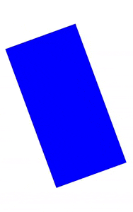

### 滚动

当视图组件的宽度或长度超出屏幕边界时，我们希望能滑动查看更多的内容。对于长列表场景，我们可以使用 LazyColumn 与 LazyRow 组件来实现。而对于一般组件，我们可以使用 Scrollable 系列修饰符来修饰组件，使其具备可滚动能力。


`verticalScroll` 修饰符和 `horizontalScroll `修饰符提供一种最简单的方法，可让用户在元素内容边界大于最大尺寸约束时滚动元素。利用 `verticalScroll` 和 `horizontalScroll` 修饰符，您无需转换或偏移内容。

```kotlin
@Composable
fun ScrollBoxes() {
    var scrollState = rememberScrollState() 
    Column(
        modifier = Modifier
            .background(Color.LightGray)
            .size(100.dp)
            .verticalScroll(scrollState)
    ) {
        repeat(10) {
            Text("Item $it", modifier = Modifier.padding(2.dp))
        }
    }
}
```


`scrollable` 修饰符与滚动修饰符不同，区别在于 `scrollable` 可检测滚动手势，但不会偏移其内容。此修饰符需要 `ScrollableController` 才能正常运行。

~~~kotlin
@Composable
fun ScrollableSample() {
    // actual composable state
    var offset by remember { mutableStateOf(0f) }
    Box(
        Modifier
            .size(150.dp)
            .scrollable(
                orientation = Orientation.Vertical,
                // Scrollable state: describes how to consume
                // scrolling delta and update offset
                state = rememberScrollableState { delta ->
                    offset += delta
                    delta
                }
            )
            .background(Color.LightGray),
        contentAlignment = Alignment.Center
    ) {
        Text(offset.toString())
    }
}
~~~


下面我们来看一个例子：

~~~kotlin
@Composable
fun PlantCardListPreview() {
  BloomTheme{
    var scrollState = rememberScrollState()
    Row(
      modifier = Modifier
        .height(136.dp)
        .offset(x = with(LocalDensity.current) {
          // 滚动位置增大时应向左偏移，所以此时应设置为负数
          -scrollState.value.toDp()
        })
        .scrollable(scrollState, Orientation.Horizontal, reverseDirection = true)
    ) {
      repeat(plantList.size) {
        // 子组件内容
      }
    }
  }
}
~~~

如果我们采用这种方案实现会发现当我们左滑时原本位于屏幕外的组件内容，实际上一片空白。这是因为 Row 组件的默认测量策略导致超出屏幕的子组件宽度测量结果为零，此时就需要我们使用 layout 修饰符自己来定制组件布局了。


~~~kotlin
Row(
  modifier = Modifier
    .height(136.dp)
    .scrollable(scrollState, Orientation.Horizontal, reverseDirection = true)
    .layout { measurable, constraints ->
      // 约束中默认最大宽度为父组件所允许的最大宽度，此处为屏幕宽度
      // 将最大宽度设置为无限大
      val childConstraints = constraints.copy(
        maxWidth = Constraints.Infinity
      )
      // 使用新的约束进行组件测量
      val placeable = measurable.measure(childConstraints)
      // 计算当前组件宽度与父组件所允许的最大宽度中取一个最小值
      // 如果组件超出屏幕，此时width为屏幕宽度。如果没有超出，则为组件本文宽度
      val width = placeable.width.coerceAtMost(constraints.maxWidth)
      // 计算当前组件高度与父组件所允许的最大高度中取一个最小值
      val height = placeable.height.coerceAtMost(constraints.maxHeight)
      // 计算可滚动的距离
      val scrollDistance = placeable.width - width
      // 主动设置组件的宽高
      layout(width, height) {
        // 根据可滚动的距离来计算滚动位置
        val scroll = scrollState.value.coerceIn(0, scrollDistance)
        // 根据滚动位置得到实际组件偏移量
        val xOffset = -scroll
        // 对组件内容完成布局
        placeable.placeRelativeWithLayer(xOffset, 0)
      }
    }
) {
  repeat(plantList.size) {
    // 子组件内容
  }
}
~~~

### 嵌套滑动

使用 `nestedScroll` 参数列表中有

- 必选参数 `connection`：嵌套滑动手势处理的核心逻辑，内部回调可以在子布局获得滑动事件前预先消费掉部分或全部手势偏移量，也可以获取子布局消费后剩下的手势偏移量。
- 调度器，内部包含用于父布局的 `NestedScrollConnection` , 可以调用 `dispatch*` 方法来通知父布局发生滑动

`NestedScrollConnection` 提供了四个回调方法。


```kotlin
interface NestedScrollConnection {
    fun onPreScroll(available: Offset, source: NestedScrollSource): Offset = Offset.Zero

    fun onPostScroll(
        consumed: Offset,
        available: Offset,
        source: NestedScrollSource
    ): Offset = Offset.Zero

    suspend fun onPreFling(available: Velocity): Velocity = Velocity.Zero

    suspend fun onPostFling(consumed: Velocity, available: Velocity): Velocity {
        return Velocity.Zero
    }
}
```


`onPreScroll`

方法描述：预先劫持滑动事件，消费后再交由子布局。

参数列表：

- available：当前可用的滑动事件偏移量
- source：滑动事件的类型

返回值：当前组件消费的滑动事件偏移量，如果不想消费可返回`Offset.Zero`


`onPostScroll`

方法描述：获取子布局处理后的滑动事件

参数列表：

- consumed：之前消费的所有滑动事件偏移量
- available：当前剩下还可用的滑动事件偏移量
- source：滑动事件的类型

返回值：当前组件消费的滑动事件偏移量，如果不想消费可返回 `Offset.Zero` ，则剩下偏移量会继续交由当前布局的父布局进行处理


`onPreFling`

方法描述：获取 `Fling` 开始时的速度。

参数列表：

- available：`Fling` 开始时的速度

返回值：当前组件消费的速度，如果不想消费可返回 `Velocity.Zero`


`onPostFling`

方法描述：获取 `Fling` 结束时的速度信息。

参数列表：

- consumed：之前消费的所有速度
- available：当前剩下还可用的速度

返回值：当前组件消费的速度，如果不想消费可返回`Velocity.Zero`，剩下速度会继续交由当前布局的父布局进行处理。


### 拖动

`draggable` 修饰符允许开发者监听UI组件的拖动手势偏移量，通过偏移量从而可以定制UI动画效果。

使用 `draggable` 修饰符至少需要传入两个参数

- draggableState：通过 draggableState 可以获取到拖动手势的偏移量，并允许开发者动态控制偏移量
- orientation：监听的拖动手势方向，只能是水平方向(Orientation.Horizontal)或垂直方向(Orientation.Vertical)

~~~kotlin
fun Modifier.draggable(
    state: DraggableState,
    orientation: Orientation,
    enabled: Boolean = true,
    interactionSource: MutableInteractionSource? = null,
    startDragImmediately: Boolean = false,
    onDragStarted: suspend CoroutineScope.(startedPosition: Offset) -> Unit = {},
    onDragStopped: suspend CoroutineScope.(velocity: Float) -> Unit = {},
    reverseDirection: Boolean = false
)
~~~

~~~kotlin
var offsetX by remember {
    mutableStateOf(0f)
}

val boxSideLengthDp = 50.dp
val boxSildeLengthPx = with(LocalDensity.current) {
    boxSideLengthDp.toPx()
}

val draggableState = rememberDraggableState {
    offsetX = (offsetX + it).coerceIn(0f, 3 * boxSildeLengthPx)
}
~~~

**注意：由于Modifer链式执行，此时offset必需在draggable与background前面。**

~~~kotlin
Box(
    Modifier
        .width(boxSideLengthDp * 4)
        .height(boxSideLengthDp)
        .background(Color.LightGray)
) {
    Box(
        Modifier
            .size(boxSideLengthDp)
            .offset {
                IntOffset(offsetX.roundToInt(), 0)
            }
            .draggable(
                orientation = Orientation.Horizontal,
                state = draggableState
            )
            .background(Color.DarkGray)

    )
}
~~~


## 状态


“状态”是指可以随时间变化的任何值。导致状态变化的因素称为事件，事件的类型有：

- 用户与界面互动
- 其他因素，例如传感器发送新值或网络响应。


**组合**是指可组合所构建的界面描述。如果发生状态更改，Compose 会根据新的状态重新执行受影响的可组合函数，从而构建更新后的界面，这一过程称为**重组**。

为此，**Compose 需要知道要跟踪的状态**，以便在收到更新（事件）时执行重组。这是通过 [`State`](https://developer.android.google.cn/reference/kotlin/androidx/compose/runtime/State?hl=zh-cn) 和 [`MutableState`](https://developer.android.google.cn/reference/kotlin/androidx/compose/runtime/MutableState?hl=zh-cn) 类型来做到的。当State发生变化时，Compose会自动触发对应组合项的重组操作。下面给出一个示例：

~~~kotlin

Column(modifier = modifier.padding(16.dp)) {
    val count : MutableState<Int> = remember{ mutableStateOf(0)}
    Text("You've had ${count.value} glasses.")
    Button(onClick = { count.value++ }, Modifier.padding(top = 8.dp)) {
        Text("Add one")
    }
}

// 委托模式简化代码 
Column(modifier = modifier.padding(16.dp)) {
var count by remember { mutableStateOf(0) }
if (count > 0) {
    Text("You've had ${count} glasses.")
}
Button(onClick = { count++ }, Modifier.padding(top = 8.dp)) {
    	Text("Add one")
	}
}
~~~

一般`remember`和`mutableStateOf`搭配使用，如果不这么做的话，每次重组都会将状态重新初始化。[`remember`](https://developer.android.google.cn/reference/kotlin/androidx/compose/runtime/package-summary?hl=zh-cn#remember(kotlin.Function0)) 会将对象存储在组合中


可以使用工厂方法 [`mutableStateListOf`](https://developer.android.google.cn/reference/kotlin/androidx/compose/runtime/package-summary?hl=zh-cn#mutableStateListOf()) 来创建可观察的 `MutableList`，然后为初始状态添加元素。

~~~kotlin
private fun getWellnessTasks() = List(30) { i -> WellnessTask(i, "Task # $i") }

fun WellnessScreen(modifier: Modifier = Modifier) {
    Column(modifier = modifier) {
        val list = remember{getWellnessTasks().toMutableStateList()}
        WellnessTasksList(list = list, onCloseTask = {task -> list.remove(task)})
    }
}
~~~

注意，别先创建`MutableList`然后再初始化，这会导致频繁地重组。而应该像上面那样，先初始化列表再创建`MutableList`，或者在单一操作中创建包含初始值的列表

~~~kotlin
// Don't do this!

val list = remember { mutableStateListOf<WellnessTask>() }
list.addAll(getWellnessTasks())


// Do this 
val list = remember {
    mutableStateListOf<WellnessTask>().apply { addAll(getWellnessTasks()) }
}
~~~


`remember` 可帮助您在重组后保持状态，但不会**在更改Activity状态后保持**。例如

- 旋转屏幕
- 更换语言
- 深色模式的切换
- 延迟列表的滚动

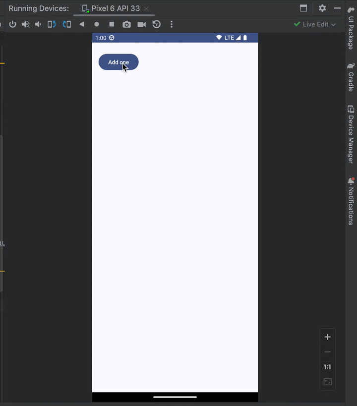

为了解决这个问题，我们需要使用[`rememberSaveable`](https://developer.android.google.cn/reference/kotlin/androidx/compose/runtime/saveable/package-summary?hl=zh-cn#rememberSaveable(kotlin.Array,androidx.compose.runtime.saveable.Saver,kotlin.String,kotlin.Function0))。`rememberSaveable` 会自动保存可保存在 [`Bundle`](https://developer.android.google.cn/reference/android/os/Bundle?hl=zh-cn) 中的任何值。

~~~kotlin
object CitySaver : Saver<City, Bundle> {
    override fun restore(value: Bundle): City? {
        //恢复
        return value.getStrinq("name")?.let { name ->
            value.getString("country")?.let { country ->
                City(name, country)
            }
        }
    }

    override fun SaverScope.save(value: City): Bundle? {
        //存值
        return Bundle().apply {
            putString("name", value.name)
            putString("country", value.country)
        }
    }
}

//使用
@Composable
fun CityScreen() {
    var selectedCity = rememberSavable(stateSaver = CitySaver) {   //传入Saver
        mutableStateof(City("Madrid", "Spain"))
    }
}

~~~

### 状态提升

Jetpack Compose 中的常规状态提升模式，是将可组合函数中的状态变量以参数形式定义

- **value: T**：要显示的当前值
- **onValueChange: (T) -> Unit**：请求更改值的事件，其中 T 是建议的新值

这样状态的维护可以抽离到新的可组合函数中，而原先的可组合函数仅需关心界面的构建逻辑即可。

```kotlin
@Composable
fun WaterCounter(modifier: Modifier = Modifier) {
    Column(modifier = modifier.padding(16.dp)) {
        var count by rememberSaveable { mutableStateOf(0) }
        if (count > 0) {
            Text("You've had $count glasses.")
        }
        Button(onClick = { count++ }, Modifier.padding(top = 8.dp), enabled = count < 10) {
            Text("Add one")
        }
    }
}
```

我们可以将上述代码重构为
~~~kotlin
@Composable
fun StatelessCounter(count: Int, onIncrement: () -> Unit, modifier: Modifier = Modifier) {
   Column(modifier = modifier.padding(16.dp)) {
       if (count > 0) {
           Text("You've had $count glasses.")
       }
       Button(onClick = onIncrement, Modifier.padding(top = 8.dp), enabled = count < 10) {
           Text("Add one")
       }
   }
}

@Composable
fun StatefulCounter(modifier: Modifier = Modifier) {
    var waterCount by remember { mutableStateOf(0) }
    var juiceCount by remember { mutableStateOf(0) }

    // 体现了复用性
    StatelessCounter(waterCount, { waterCount++ })
    StatelessCounter(juiceCount, { juiceCount++ })
}
~~~


### ViewModel

[`ViewModel`](https://developer.android.google.cn/reference/androidx/lifecycle/ViewModel?hl=zh-cn) 类是一种业务逻辑或应用级状态容器，用于

- 维护界面的全局状态
- 封装相关的业务逻辑，将业务逻辑和构建界面的逻辑进行解耦。分离关注点原则


引入依赖项：

~~~xml
implementation("androidx.lifecycle:lifecycle-viewmodel-compose:2.6.1")
~~~

使用示例：

~~~kotlin
class MainViewModel : ViewModel() {

    private val _countNumber = mutableStateOf(0)
    
    //对外暴露不可改变的State
    val countNumber: State<Int> = _countNumber

    fun add() {
        _countNumber.value = _countNumber.value + 1
    }
}

//使用
@Composable
fun Greeting() {
    val mainViewModel: MainViewModel = viewModel()     //注意这里的viewModel()
   
    // 通过函数将修改逻辑暴露出去，这样还可以正确更新UI
    CounterComponent(mainViewModel.countNumber,mainViewModel::add)
}
~~~

这里要说明几点：

- ViewModel并不是订阅发布模型，而仅仅是存储模型。要实现状态的监听，还需要配合`mutableStateOf`来使用

- 在`Activity`销毁之前，`ViewModel`将一直存在，`viewModel()`每次调用将返回同一个实例，所以此时可以不使用`remember{}`进行缓存。

- 直接将 `ViewModel` 实例传递给其他可组合项是一种不好的做法。您应仅传递它们需要的数据/逻辑（回调函数）。

  > 由于 ViewModel 的生命周期大于界面的生命周期，因此在 ViewModel 中保留与生命周期相关的 API 可能会导致内存泄漏。


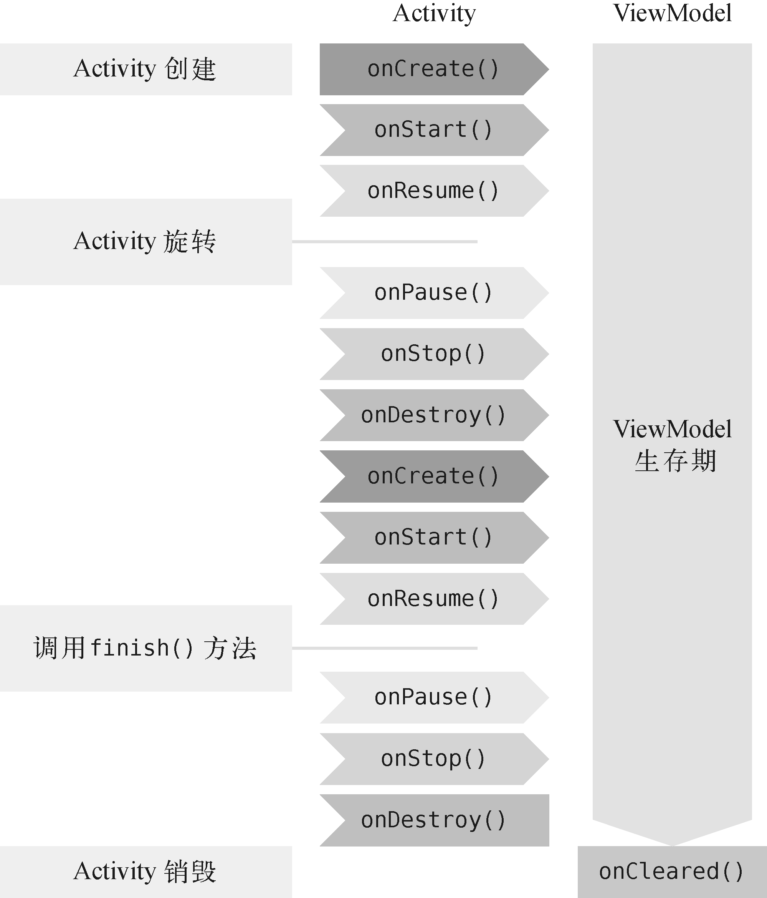


创建流

~~~kotlin

// viewModel
private val _suggestedDestinations = MutableStateFlow<List<ExploreModel>>(emptyList())

val suggestedDestinations: StateFlow<List<ExploreModel>> = _suggestedDestinations.asStateFlow()

// 更新流的逻辑
_suggestedDestinations.value = destinationsRepository.destinations
~~~

使用流

~~~kotlin
val suggestedDestinations by viewModel.suggestedDestinations.collectAsStateWithLifecycle()
~~~

这样每当有新的数据项被推送到 `suggestedDestinations` 数据流时，可组合项中的界面会进行更新。

所要添加的依赖项：

~~~xml
dependencies {
    implementation "androidx.lifecycle:lifecycle-runtime-compose:$lifecycle_version"
}
~~~


## 绘制

`Canvas Composable` 是官方提供的一个专门用来自定义绘制的独立组件，这个组件不包含任何子元素。它的定义如下：

~~~kotlin
fun Canvas(modifier: Modifier, onDraw: DrawScope.() -> Unit
~~~

| API           | 描述             |
| ------------- | ---------------- |
| drawLine      | 绘制一条线       |
| drawRect      | 绘制一个矩形     |
| drawImage     | 绘制一张图片     |
| drawRoundRect | 绘制一个圆角矩形 |
| drawCircle    | 绘制一个圆       |
| drawOval      | 绘制一个椭圆     |
| drawArc       | 绘制一条弧线     |
| drawPath      | 绘制一条路径     |
| drawPoints    | 绘制一些点       |


让我们画一个简单的圆环作为示例。

~~~kotlin
@Preview
@Composable
fun DrawColorRing() {
    Box(
        modifier = Modifier.fillMaxSize(),
        contentAlignment = Alignment.Center
    ) {
        var radius = 300.dp
        var ringWidth = 30.dp
        Canvas(modifier = Modifier.size(radius)) {
            drawCircle( // 画圆
                brush = Brush.sweepGradient(listOf(Color.Red, Color.Green, Color.Red), Offset(radius.toPx() / 2f, radius.toPx() / 2f)),
                radius = radius.toPx() / 2f,
                style = Stroke(
                    width = ringWidth.toPx()
                )
            )
        }
    }
}
~~~


我们的 `DrawScope` 会对不同类型的画笔进行缓存的，所以性能是没有问题的。


基本变换：

~~~kotlin
Canvas(modifier = Modifier.fillMaxSize()) {
    scale(scaleX = 10f, scaleY = 15f) {
        drawCircle(Color.Blue, radius = 20.dp.toPx())
    }
}

Canvas(modifier = Modifier.fillMaxSize()) {
    translate(left = 100f, top = -300f) {
        drawCircle(Color.Blue, radius = 200.dp.toPx())
    }
}

Canvas(modifier = Modifier.fillMaxSize()) {
    rotate(degrees = 45F) {
        drawRect(
            color = Color.Gray,
            topLeft = Offset(x = size.width / 3F, y = size.height / 3F),
            size = size / 3F
        )
    }
}


Canvas(modifier = Modifier.fillMaxSize()) {
    withTransform({
        translate(left = size.width / 5F)
        rotate(degrees = 45F)
    }) {
        drawRect(
            color = Color.Gray,
            topLeft = Offset(x = size.width / 3F, y = size.height / 3F),
            size = size / 3F
        )
    }
}
~~~


## 导航

### 基本

首先我们定义一个NavHost对象，它有两个必传的参数：

- `NavController`：核心组件
- `startDestination`：起始路由地址

```java
@Composable
fun NavHostDemo() {
    NavHost(navController =, startDestination =) {

    }
}
```

为了便于管理路由地址，我们新建RouteConfig配置文件，代码如下所示：

```kotlin
object RouteConfig {
     // 页面1路由
    const val ROUTE_PAGEONE = "pageOne"
    
	// 页面2路由
    const val ROUTE_PAGETWO = "pageTwo"
}
```

在这里，将页面1路由设置为起始导航，并**使用composable方法添加导航的对应关系**，修改后的NavHostDemo代码如下所示：

~~~kotlin
@Composable
fun NavHostDemo() {
    val navController = rememberNavController()
    NavHost(navController = navController, startDestination = RouteConfig.ROUTE_PAGEONE) {
        composable(RouteConfig.ROUTE_PAGEONE) {
            // 由于我们需要在各自的页面中进行页面跳转，所以将navController传递到对应的页面中去
            OnePage(navController)
        }
        composable(RouteConfig.ROUTE_PAGETWO) {
            PageTwo(navController)
        }
    }
}
~~~

那么我们该如何进行跳转呢？

~~~kotlin
@Composable
fun PageOne(navController: NavController) {
    Column(
        modifier = Modifier
            .fillMaxWidth()
            .fillMaxHeight()
            .background(
                Color.White
            )
    ) {
        Text(text = "这是页面1")
        Spacer(modifier = Modifier.height(20.dp))
        Button(onClick = {
            //点击跳转到页面2
            navController.navigate(RouteConfig.ROUTE_PAGETWO)
        }) {
            Text(
                text = "跳转页面2",
                modifier = Modifier.fillMaxWidth(),
                textAlign = TextAlign.Center
            )
        }
    }
}
~~~

在页面2中调用`popBackStack`方法将当前页面出栈便又回到了页面1。


### 参数

首先，我们定义一个参数配置文件，代码如下所示：

```java
object ParamsConfig {
    const val PARAMS_NAME = "name"
    const val PARAMS_AGE = "age"
}
```

~~~kotlin
NavHost(navController = navController, startDestination = RouteConfig.ROUTE_PAGEONE) {
    composable(RouteConfig.ROUTE_PAGEONE) {
        PageOne(navController)
    }

    composable(
        // 导航的URL
        "${RouteConfig.ROUTE_PAGETWO}/{${ParamsConfig.PARAMS_NAME}}/{${ParamsConfig.PARAMS_AGE}}",
        
        // 获取导航的查询参数
        arguments = listOf(
            // 这个可以省略
            navArgument("$ParamsConfig.PARAMS_NAME") {},
            // 默认情况下，所有的参数都会被解析成字符串，所以我们可以使用arguments来为参数指定type类型
            navArgument("$ParamsConfig.PARAMS_AGE") { type = NavType.IntType }
        )
    ) {
        val argument = requireNotNull(it.arguments)
        val name = argument.getString(ParamsConfig.PARAMS_NAME)
        val age = argument.getInt(ParamsConfig.PARAMS_AGE)
        PageTwo(name,age,navController)
    }
}
~~~

跳转的方法如下：

~~~kotlin
navController.navigate("${RouteConfig.ROUTE_PAGETWO}/黄林晴/26")
~~~


可选参数类似于get请求的添加方式 ?name = name

~~~kotlin
composable(RouteConfig.ROUTE_PAGEONE) {
    PageOne(navController)
}

composable(
    "${RouteConfig.ROUTE_PAGETWO}/{${ParamsConfig.PARAMS_NAME}}" +
            "?${ParamsConfig.PARAMS_AGE}={${ParamsConfig.PARAMS_AGE}}",
    arguments = listOf(
        navArgument(ParamsConfig.PARAMS_NAME) {},
        navArgument(ParamsConfig.PARAMS_AGE) {
            defaultValue = 30
            type = NavType.IntType
        }
    )
) {
    val argument = requireNotNull(it.arguments)
    val name = argument.getString(ParamsConfig.PARAMS_NAME)
    val age = argument.getInt(ParamsConfig.PARAMS_AGE)
    PageTwo(name, age, navController)
}
~~~


### 路由动画

Compose的导航动画提供了两个基础接口`EnterTransition`和`ExitTransition`用于提供进入页面导航动画和退出页面导航动画。并且提供了多个现成的实现效果供开发者方便使用：

- 动画基础类

  - 进入动画： EnterTransition
  - 退出动画： ExitTransition

- 滑动进入退出类型

  - 滑动进入动画：基础的进入动画是slideIn，并且派生出slideInHorizontally和slideInVertically

  - 滑动退出动画：基础的退出动画是slideOut，并且派生出slideOutHorizontally和slideOutVertically

- 淡入淡出类型

  - 淡入动画： fadeIn，无派生

  - 淡出动画： fadeOut，无派生

- 膨胀收缩类型

  - 膨胀进入动画： expandHorizontally和expandVertically

  - 收缩退出动画： shrinkHorizontally和shrinkVertically

- 放大和缩放类型

  - 缩放进入动画： scaleIn

  - 缩放推出的桑： scaleOut


~~~kotlin
// 使用rememberAnimatedNavController() 替换 rememberNavController()
val navController = rememberAnimatedNavController()
AnimatedNavHost(
    
    navController,
    startDestination = A,//设置Aui为开始界面
    enterTransition = {
        fadeIn(animationSpec = tween(700), initialAlpha = 0f)
    },
    exitTransition = {
        fadeOut(animationSpec = tween(700), initialAlpha = 0f)
    }
)
~~~


每个 composable 目的地都有四个新参数可以设置:

- `enterTransition`: 指定当您使用 `navigate()` 导航至该目的地时执行的动画。
- `exitTransition`: 指定当您通过导航至另一个目的地的方式离开该目的地时执行的动画。
- `popEnterTransition`: 指定当该目的地在经过调用 popBackStack() 后重新入场时执行的动画。默认为 enterTransition。
- `popExitTransition`: 指定当该目的地在以弹出返回栈的方式离开屏幕时执行的动画。默认为 `exitTransition`。

这使得您可以像这样编写目的地:
~~~kotlin
composable(
  "profile/{id}",
  enterTransition = { _, _ ->
    // 让我们写一个很长的淡入
    fadeIn(animationSpec = tween(2000)
  }
) {
  // 像往常一样添加内容
}
~~~

## 副作用

Composable是纯函数，即没有副作用的函数。它只能通过返回值对外产生影响。此外，纯函数是**幂等**的，唯一输入（参数）决定唯一输出（返回值）。但现实情况是有一些逻辑只能作为副作用来处理。例如一些IO操作、计时、日志埋点等，这些都是会对外界或收到外界影响的逻辑，所以Compose框架需要能够合理地处理一些副作用：

- 副作用的执行时机是明确的，例如在`Recomposition`时，或者在`onMount`时等
- 副作用的执行次数是可控的，不应该随着函数反复执行。


首先需要明确一个Composable的生命周期：

- **onActive（or onEnter）**：当Composable首次进入组件树时
- **onCommit（or onUpdate）**：UI随着recomposition发生更新时
- **onDispose（or onLeave）**：当Composable从组件树移除时 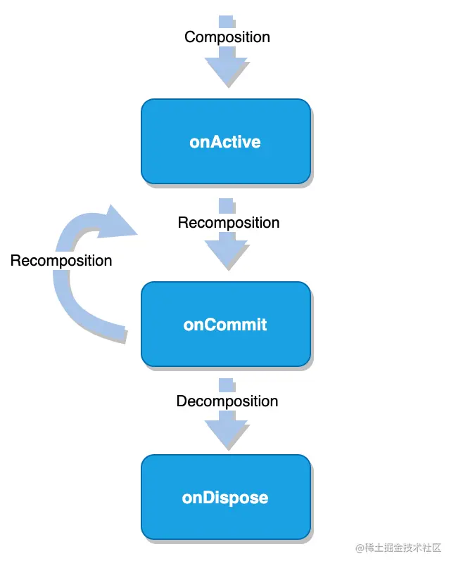


LaunchedEffect 进入可组合项（onActive）时，它会启动一个协程。当LaunchedEffect 退出组合（onDispose）时，协程也将会取消。

LaunchedEffect() 中可以传入一个key，如果重组时key发生改变，现有协程会被取消，并在新的协程中启动新的挂起函数。如果是LaunchedEffect(true) 或 LaunchedEffect(Unit)， 可以保证LaunchedEffect()中的key永远不发生变化，从而保证后面的lambda不参与重组。

~~~dart
@Composable
fun MyScreen(
    state: UiState<List<Movie>>,
    scaffoldState: ScaffoldState = rememberScaffoldState()
) {

    // 第一次组合时如果state.hasError为true，那么在LaunchedEffect开启协程并显示Snackbar；当重组state.hasError变为false后，协程结束，Snackbar也会消失
    if (state.hasError) {

        // 如果重组时scaffoldState.snackbarHostState发生变化，协程会被取消并重新创建并执行
        LaunchedEffect(scaffoldState.snackbarHostState) {
            // 展示Snackbar
            scaffoldState.snackbarHostState.showSnackbar(
                message = "Error message",
                actionLabel = "Retry message"
            )
        }
    }

    Scaffold(scaffoldState = scaffoldState) {
        /* ... */
    }
}
~~~


`LaunchedEffect` 是由`@Composable` 标记的可组合函数，因此只能在其他可组合函数中使用（类似协程中的suspend）。当需要在可组合项外启动协程时（如onClick中），可以使用`rememberCoroutineScope` 

~~~kotlin
@Composable
fun ComposeEffect() {
    var txt by remember { mutableStateOf("") }
    //rememberCoroutineScope在非重组作用域启动协程任务
    val coroutineScope = rememberCoroutineScope()

    Column(
        modifier = Modifier.fillMaxSize()wrapContentSize(Alignment.Center)
    ) {
        Text(text = txt)
        Button(onClick = {
            //在onClick中启动了协程
            coroutineScope.launch {
                delay(3000)
                txt = "修改文案"
            }
        }) {
            Text(text = "rememberCoroutineScope")
        }
    }
}
~~~


对于需要在键发生变化或可组合项退出组合后进行清理的副作用，可以使用 DisposableEffect。如果 DisposableEffect 中的key发生变化，那么就会执行onDispose()资源释放等操作，并重新执行DisposableEffect。

~~~kotlin
@Composable
fun HomeScreen(
    lifecycleOwner: LifecycleOwner = LocalLifecycleOwner.current,
    onStart: () -> Unit, // Send the 'started' analytics event
    onStop: () -> Unit // Send the 'stopped' analytics event
) {
    // Safely update the current lambdas when a new one is provided
    val currentOnStart by rememberUpdatedState(onStart)
    val currentOnStop by rememberUpdatedState(onStop)

    // If `lifecycleOwner` changes, dispose and reset the effect
    DisposableEffect(lifecycleOwner) {
        // Create an observer that triggers our remembered callbacks
        // for sending analytics events
        val observer = LifecycleEventObserver { _, event ->
            if (event == Lifecycle.Event.ON_START) {
                currentOnStart()
            } else if (event == Lifecycle.Event.ON_STOP) {
                currentOnStop()
            }
        }

        // Add the observer to the lifecycle
        lifecycleOwner.lifecycle.addObserver(observer)

        // When the effect leaves the Composition, remove the observer
        onDispose {
            lifecycleOwner.lifecycle.removeObserver(observer)
        }
    }

    /* Home screen content */
}
~~~


SideEffect 在每次成功重组时都会执行，这么看好像SideEffect 并不能处理什么副作用呀。其实还是有点区别的，SideEffect只会在重组成功之后才会执行，如果重组失败，那么SideEffect中的lambda将不再执行，以免在当前组合操作失败时使对象处于不一致状态。

~~~kotlin
@Composable
fun SideEffectStudy() {
    SideEffect {
        Log.e("Tag", "SideEffect launch")
    }
    throw IllegalArgumentException("exception throw")
}
~~~

