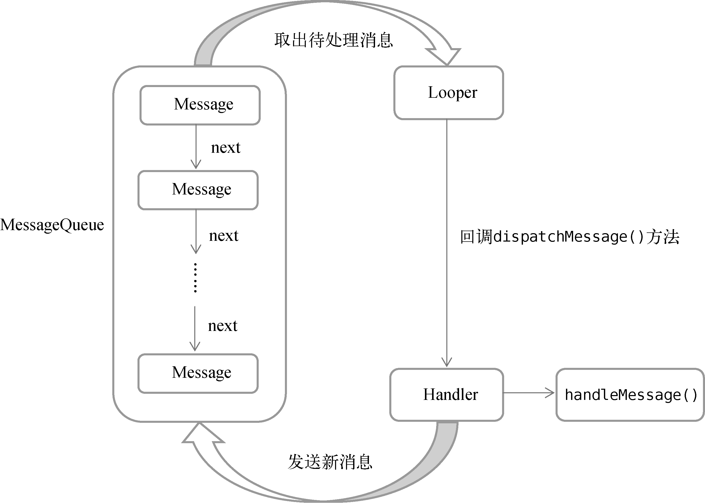

# Service

概念的要点

- Service是Android中实现程序后台运行的解决方案，Service的运行不依赖于任何用户界面，即使程序被切换到后台，Service仍然能够保持正常运行。
- 它的生命周期依赖于创建时所在的应用程序进程。此外，Service随时都有可能被系统回收，这防止一些Service长期在后台占用手机资源。如果需要在后台执行一些长期任务，可以考虑使用「前台Service」或者「WorkManager」。
- Service并不会自动开启线程，所以我们必须在Service内部中手动创建子线程。

https://blog.csdn.net/javazejian/article/details/52709857

Service(服务)是一个一种可以在后台执行长时间运行操作而没有用户界面的应用组件。服务可由其他应用组件启动（如Activity），服务一旦被启动将在后台一直运行，即使启动服务的组件（Activity）已销毁也不受影响。

有两种方式来启动Service，

- （启动状态）当应用组件（如 Activity）通过调用 **startService()** 启动服务时，服务即处于“启动”状态。一旦启动，服务即可在后台无限期运行，即使启动服务的组件已被销毁也不受影响，除非手动调用才能停止服务。
- （绑定状态）当应用组件通过调用 **bindService()** 绑定到服务时，服务即处于“绑定”状态。绑定服务提供了一个客户端-服务器接口，允许组件与服务进行交互、发送请求、获取结果，甚至是利用进程间通信 (IPC) 跨进程执行这些操作。 仅当与另一个应用组件绑定时，服务才会运行。 多个组件可以同时绑定到该服务，但全部取消绑定后，该服务即会被销毁。 而且activity销毁时会自动解绑Service

Service具有的方法

- **onCreate()**：首次创建服务时，系统将调用此方法来执行一次性设置程序（在调用 onStartCommand() 或onBind() 之前）。如果服务已在运行，则不会调用此方法，该方法只调用一次
- **onBind()**：当另一个组件想通过调用 bindService() 与服务绑定（例如执行 RPC）时，系统将调用此方法。在此方法的实现中，必须返回 一个IBinder 接口的实现类，供客户端用来与服务进行通信。无论是启动状态还是绑定状态，此方法必须重写。在启动状态的情况下直接返回 null。
- **onStartCommand()**： 当另一个组件（如 Activity）通过调用 startService() 请求启动服务时，系统将调用此方法。一旦执行此方法，服务即会启动并可在后台无限期运行。 如果自己实现此方法，则需要在服务工作完成后，通过调用 stopSelf()（在服务内调用） 或 stopService() （在服务外调用）来停止服务。（在绑定状态下，无需实现此方法。）
- **onDestroy()**：当服务不再使用且将被销毁时，系统将调用此方法。服务应该实现此方法来清理所有资源，如线程、注册的侦听器、接收器等，这是服务接收的最后一个调用。

例子：

~~~kotlin
class MyService : Service() {

    override fun onBind(intent: Intent): IBinder {
        TODO("Return the communication channel to the service.")
    }
    
    // 在创建时调用
    override fun onCreate() {
        super.onCreate()
    }

    // 在启动时调用
    override fun onStartCommand(intent: Intent, flags: Int, startId: Int): Int {
        return super.onStartCommand(intent, flags, startId)
    }

    // 在销毁时调用
    override fun onDestroy() {
        super.onDestroy()
    }

}
~~~

在`AndroidManifest.xml`中进行注册

~~~xml
<application
    ...
    <service
        android:name=".MyService"
        android:enabled="true"
        android:exported="true">
    </service>
</application>
~~~

如何在Activity中启动或停止Service呢？

~~~kotlin
override fun onCreate(savedInstanceState: Bundle?) {
    super.onCreate(savedInstanceState)
    val intent = Intent(this, MyService::class.java)
    startService(intent) 	// 启动Service
    stopService(intent) 	// 停止Service
}
~~~

如果当前Service实例先以绑定状态运行，然后再以启动状态运行，那么绑定服务将会转为启动服务运行。

如果当前Service实例先以启动状态运行，然后再以绑定状态运行，当前启动服务并不会转为绑定服务，但是还是会与宿主绑定，只是即使宿主解除绑定后，服务依然按启动服务的生命周期在后台运行，直到有Context调用了stopService()或是服务本身调用了stopSelf()方法抑或内存不足时才会销毁服务。

每个`Service`只会存在一个实例（即使对于多个`Activity`启动同一个`Service`）。**而且上面的方法都是同步阻塞方法，如果想要真正在后台执行任务，那么就启用一个线程。**

~~~java
public int onStartCommand(Intent intent, int flags, int startId)
~~~

- intent：调用者传递过来的`Intent`对象

- flags：附加参数，由系统传入

  - 通过`startService()`启动，系统传入0
  - 上一个Service的`onStartCommand()`返回值为`START_STICKY_COMPATIBILITY`或者`START_STICKY`，并且服务被强制杀死，自动启动后，系统传入`START_FLAG_REDELIVERY（1）`
  - 上一个Service的`onStartCommand()`返回值为`START_REDELIVER_INTENT`，并且服务被强制杀死重启后，自动启动后，系统传入`START_FLAG_REDELIVERY（2）`

 - startId，每次启动都对应不同的ID，

当`Service`被强行停止的时候，根据`onStartCommand`的返回值来决定重启的行为：

- `START_STICKY`（默认值）：`Service`被杀掉后会重新启动，但是不会携带之前的`Intent`对象
- `START_NOT_STICKY`：Service被杀掉后，不会进行重启
- `START_REDELIVER_INTENT`：Service被杀掉后，会进行重新启动，并且还会携带之前的Intent信息

### 与Activity通信

Service要通过`onBind()`方法向`Activty`返回`IBinder`对象，Activity可以通过该对象与Service进行通信：

~~~Kotlin
class MyService : Service() {

    private val mBinder = DownloadBinder()

    class DownloadBinder : Binder() {

        fun startDownload() {
            Log.d("MyService", "startDownload executed")
        }

        fun getProgress(): Int {
            Log.d("MyService", "getProgress executed")
            return 0
        }

    }

    override fun onBind(intent: Intent): IBinder {
        return mBinder
    }
    ...
}
~~~

~~~kotlin
class MainActivity : AppCompatActivity() {
    lateinit var downloadBinder: MyService.DownloadBinder
    
   	private val connection = object : ServiceConnection {
        // 会在Activity与Service成功绑定的时候调用
        override fun onServiceConnected(name: ComponentName, service: IBinder) {
            downloadBinder = service as MyService.DownloadBinder
           	
        }
        
        //  Android 系统会在与服务的连接意外中断时（例如当服务崩溃或被终止时）调用该方法。注意:当客户端取消绑定时，系统“绝对不会”调用该方法。
        override fun onServiceDisconnected(name: ComponentName) {
            
        }
    }
    
     override fun onCreate(savedInstanceState: Bundle?) {
         val intent = Intent(this, MyService::class.java)
         bindService(intent, connection, Context.BIND_AUTO_CREATE) // 绑定Service
         downloadBinder.startDownload()
         downloadBinder.getProgress()
         unbindService(connection) // 解绑Service
     }
    
}
~~~

在onServiceConnected()被回调前，我们还需先把当前Activity绑定到服务LocalService上，绑定服务是通过通过bindService()方法，解绑服务则使用unbindService()方法，这两个方法定义如下：

- bindService(Intent service, ServiceConnection conn, int flags)
- unbindService(ServiceConnection conn)

### 前台Service

用前台Service必须在AndroidManifest.xml文件中进行权限声明：

~~~xml
 <uses-permission android:name="android.permission.FOREGROUND_SERVICE" />
~~~

如何创建一个前台Service？

~~~kotlin
class MyService : Service() {
    ...
    override fun onCreate() {
        super.onCreate()
        val manager = getSystemService(Context.NOTIFICATION_SERVICE) as
                NotificationManager
        if (Build.VERSION.SDK_INT >= Build.VERSION_CODES.O) {
            val channel = NotificationChannel("my_service", "前台Service通知",
                    NotificationManager.IMPORTANCE_DEFAULT)
            manager.createNotificationChannel(channel)
        }
        val intent = Intent(this, MainActivity::class.java)
        val pi = PendingIntent.getActivity(this, 0, intent, 0)
        val notification = NotificationCompat.Builder(this, "my_service")
            .setContentTitle("This is content title")
            .setContentText("This is content text")
            .setSmallIcon(R.drawable.small_icon)
            .setLargeIcon(BitmapFactory.decodeResource(resources, R.drawable.large_icon))
            .setContentIntent(pi)
            .build()
        // 台前Service一般会和通知搭配使用
        startForeground(1, notification)
    }
    ...
}
~~~

这和通知的创建几乎一模一样，但是最后用`startForeground(1, notification)`代替了`manager.notify(1, notification)`

### IntentService

`Service`中的代码都是默认运行在主线程当中的，如果直接在`Service`里处理一些耗时的逻辑，就很容易出现**ANR（Application Not Responding）**的情况。这个时候就需要用到Android多线程编程的技术了：

~~~kotlin
class MyService : Service() {
    ...
    override fun onStartCommand(intent: Intent, flags: Int, startId: Int): Int {
        thread {
            // 处理具体的逻辑
        }
        return super.onStartCommand(intent, flags, startId)
    }
}
~~~

如果想让`Service`在执行完成任务后，自行销毁，那么就可以调用`stopSelf()`方法。

Android提供IntentService类，封装了多线程处理，简化了我们代码编写工作。

~~~kotlin
//父类的构造函数接受一个字符串，用于调试，可以随意传入
class MyIntentService : IntentService("MyIntentService") {

    // 该方法已经在子线程中运行的了，执行完毕后
    override fun onHandleIntent(intent: Intent?) {
        // 具体逻辑
    }

    override fun onDestroy() {
        super.onDestroy()
        Log.d("MyIntentService", "onDestroy executed")
    }

}
~~~

一般没必要在onStartCommand执行任务，它的默认实现就是将请求的Intent添加到队列中。当IntentService处理完Intent后，他会检查队列中是否还有其他的Intent。如果没有了就调用onDestroy直接退出，否则顺序地从队列中取出Intent

## Lifecycles

我们在有些情况下必须感知Activity的生命周期，为此我们可能这样实现代码：

~~~kotlin
class MyObserver {

    fun activityStart() {
    }

    fun activityStop() {
    }

}

class MainActivity : AppCompatActivity() {

    lateinit var observer: MyObserver

    override fun onCreate(savedInstanceState: Bundle?) {
        observer = MyObserver()
    }

    override fun onStart() {
        super.onStart()
        observer.activityStart()
    }

    override fun onStop() {
        super.onStop()
        observer.activityStop()
    }
}
~~~

这种方式虽然是可以正常工作的，但是不够优雅，需要在Activity中编写太多额外的逻辑。

我们可以使用Android提供的`LifecycleObserver`来优雅地做到这一点：

~~~kotlin
class MyObserver : LifecycleObserver {

    @OnLifecycleEvent(Lifecycle.Event.ON_START)
    fun activityStart() {
        Log.d("MyObserver", "activityStart")
    }

    @OnLifecycleEvent(Lifecycle.Event.ON_STOP)
    fun activityStop() {
        Log.d("MyObserver", "activityStop")
    }

}
~~~

生命周期事件的类型一共有7种：`ON_CREATE`、`ON_START`、`ON_RESUME`、`ON_PAUSE`、`ON_STOP`和`ON_DESTROY`分别匹配Activity中相应的生命周期回调；另外还有一种`ON_ANY`类型，表示可以匹配Activity的任何生命周期回调。

然后通过addObserver来注册这个观察者

~~~Kotlin
class MainActivity : AppCompatActivity() {
    ...
    override fun onCreate(savedInstanceState: Bundle?) {
        super.onCreate(savedInstanceState)
        setContentView(R.layout.activity_main)
        ...
        lifecycle.addObserver(MyObserver())
        // lifecycleOwner.lifecycle.addObserver(MyObserver())
    }
    ...
}
~~~

如果Activity是继承自`AppCompatActivity`的，那么它们本身就是一个LifecycleOwner的实例。

## 多线程

开启线程的几种语法：

- 继承方式，耦合度较高

  ~~~kotlin
  class MyThread : Thread() {
      override fun run() {
  	}
  }
  
  MyThread().start()
  ~~~

- Runnable接口

  ~~~kotlin
  class MyThread : Runnable {
      override fun run() {
          // 编写具体的逻辑
      }
  }
  
  val myThread = MyThread()
  Thread(myThread).start()		// Thread构造函数接受一个Runnable对象
  ~~~

- Lambda表达式

  ~~~kotlin
  Thread {
      // 编写具体的逻辑
  }.start()
  ~~~

- Kotlin内置的顶层函数 thread

  ~~~kotlin
  thread {
      // 编写具体的逻辑
  }
  ~~~

Android的UI是线程不安全的，因此Android禁止子线程更新UI（即使是唯一的数据源）。如果需要子线程的结果来更新UI该怎么办？对于这种情况，Android提供了一套异步消息处理机制，我们先来看一下使用案例：

~~~kotlin
class MainActivity : AppCompatActivity() {

    val updateText = 1			// 消息的类型

    val handler = object : Handler(Looper.getMaininLooper()) {
        override fun handleMessage(msg: Message) {
            // 在这里可以进行UI操作，在主线程中
            when (msg.what) {
                // 根据消息的类型，进行UI更新操作
                updateText -> textView.text = "Nice to meet you"
            }
        }
    }

    override fun onCreate(savedInstanceState: Bundle?) {
        super.onCreate(savedInstanceState)
        setContentView(R.layout.activity_main)
        
        
        changeTextBtn.setOnClickListener {
            // 创建了一个线程，通过Message机制与主线程交互
            thread {
                val msg = Message()
                msg.what = updateText
                handler.sendMessage(msg) // 将Message对象发送出去
            }
        }
    }

}
~~~

`Android`中的异步消息处理主要由4个部分组成：

- `Message`：`Message`是在线程之间传递的消息，它可以在内部携带少量的信息，
  - `what`字段
  - `arg1`和`arg2`字段来携带一些整型数据
  - `obj`字段携带一个`Object`对象。

- `Handler`：它主要是用于发送和处理消息的。发送消息一般是使用`Handler`的`sendMessage()`方法、`post()`方法等，最终在`Handler`的`handleMessage()`方法中来处理消息。

- `MessageQueue`：消息队列

- `Looper`：与`MessageQueue`搭配使用，每当发现`MessageQueue`中存在一条消息时，就会将它取出，并传递到Handler的`handleMessage()`方法中。每个线程中只会有一个`Looper`对象。

除了上面的`Handler`异步消息机制来处理子线程更新UI的问题，还可以借助`AsyncTask`，它的定义如下：

~~~kotlin
class DownloadTask : AsyncTask<Params, Progress, Result>() {
   
}
~~~

- `Params`，在执行AsyncTask时需要传入参数的类型
- `Progress`，进度值的类型
- `Result`，返回结果的类型

AsyncTask还需要重写一些方法

- `onPreExecute()`：这个方法会在后台任务开始执行之前调用
- `doInBackground(Params...)`：这个方法中的所有代码都会在子线程中运行
- `onProgressUpdate(Progress...)`：当在后台任务中调用了`publishProgress(Progress...)`方法后，`onProgressUpdate (Progress...)`方法就会很快被调用，该方法中携带的参数就是在后台任务中传递过来的。在这个方法中可以对UI进行操作，利用参数中的数值就可以对界面元素进行相应的更新。
- `onPostExecute(Result)`：当后台任务执行完毕并通过`return`语句进行返回时，这个方法就很快会被调用

如果想要启动该任务，仅需编写以下代码即可：

~~~kotlin
DownloadTask().execute()
~~~

可以给`execute()`方法传入任意数量的参数，这些参数将会传递到`DownloadTask`的`doInBackground()`方法当中

还有更加简单的方法：使用`runOnUiThread()`方法，其实它就是对异步消息处理机制进行了一层封装而已

~~~kotlin
runOnUiThread {
    // 在这里进行UI操作，将结果显示到界面上
    responseText.text = response
}
~~~

`runOnUiThread()`方法是异步的，`runOnUiThread()`会把传入的`Runnable`对象提交到`UI`线程的消息队列中,而不是直接在调用的线程中执行。