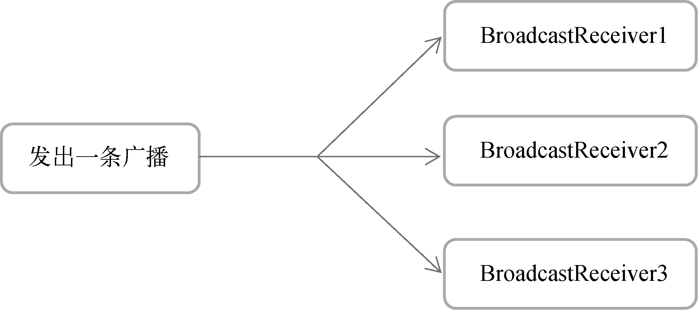
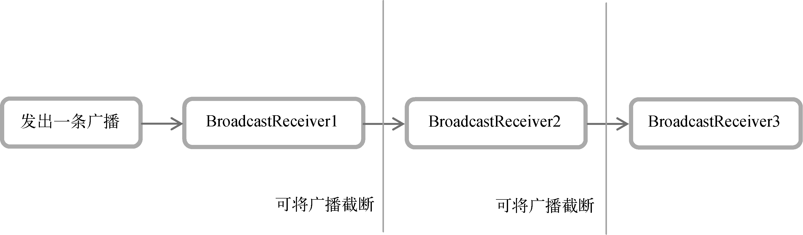

# 广播机制

## 概述

Android中的广播主要可以分为两种类型：

- **标准广播（normal broadcasts）**是一种完全异步执行的广播，在广播发出之后，所有的`BroadcastReceiver`几乎会在同一时刻收到这条广播消息，因此它们之间没有任何先后顺序可言。

  

- **有序广播（ordered broadcasts）**则是一种同步执行的广播，在广播发出之后，同一时刻只会有一个`BroadcastReceiver`能够收到这条广播消息，当这个`BroadcastReceiver`中的逻辑执行完毕后，广播才会继续传递。

  

广播消息本身会被封装在一个 `Intent` 对象中

Android内置了很多系统级别的广播，例如以下事件都会发出一条广播

- 开机完成
- 电池的电量发生变化
- 系统时间发生改变

## 创建

注册`BroadcastReceiver`的方式一般有两种：

- 在代码中注册（动态注册）

  ~~~kotlin
  class MainActivity : ComponentActivity() {
      lateinit var timeChangeReceiver: TimeChangeReceiver
  
      override fun onCreate(savedInstanceState: Bundle?) {
          super.onCreate(savedInstanceState)
          setContent {
              BroadcastTestTheme {
                  // A surface container using the 'background' color from the theme
                  Surface(
                      modifier = Modifier.fillMaxSize(),
                      color = MaterialTheme.colorScheme.background
                  ) {
                      Greeting("Android")
                  }
              }
          }
  
          val intentFilter = IntentFilter()
          // 监听特定广播事件
          intentFilter.addAction("android.intent.action.TIME_TICK")
          timeChangeReceiver = TimeChangeReceiver()
          // 注册
          registerReceiver(timeChangeReceiver, intentFilter)
      }
      
  	override fun onDestroy() {
          super.onDestroy()
          unregisterReceiver(timeChangeReceiver)
      }
  
      // 定义一个接收广播时的回调函数
      inner class TimeChangeReceiver : BroadcastReceiver() {
          override fun onReceive(context: Context?, intent: Intent?) {
              Toast.makeText(context, "Time has changed", Toast.LENGTH_SHORT).show()
          }
      }
  }
  ~~~

  有关键的三步：

  - 定义了一个内部类`TimeChangeReceiver`，这个类是继承自`BroadcastReceiver`的，并重写了父类的`onReceive()`方法
  - 调用`registerReceiver()`方法进行注册
  - 动态注册的`BroadcastReceiver`一定要取消注册才行，这里我们是在`onDestroy()`方法中通过调用`unregisterReceiver()`方法来实现的。

- 在`AndroidManifest.xml`中注册（静态注册）：虽然**动态注册**在灵活性方面有很大的优势，但是它存在着一个缺点，即**必须在程序启动之后才能接收广播。而静态注册可以克服这个缺点**。

  出于安全的考量（例如，恶意的应用程序利用广播机制**频繁地从后台被唤醒**，严重影响了用户手机的电量和性能），静态注册所能监听的广播是十分受限的。在Android 8.0系统之后，所有**隐式广播**（没有具体指定发送给哪个应用程序的广播）都不允许使用静态注册的方式来接收，而且大多数系统广播都属于隐式广播。但还是有例外情况的https://developer.android.google.cn/guide/components/broadcast-exceptions?hl=zh-cn

  首先定义一个 `BroadcastReceiver`：

  ~~~kotlin
  class BootCompleteReceiver : BroadcastReceiver() {
  
      override fun onReceive(context: Context, intent: Intent) {
          // This method is called when the BroadcastReceiver is receiving an Intent broadcast.
          TODO("BootCompleteReceiver.onReceive() is not implemented")
      }
  }
  ~~~

  然后，在`AndroidManifest`编写如下配置：

  ~~~xml
  <receiver
      android:name=".BootCompleteReceiver"
      android:enabled="true"
      android:exported="true">
      <intent-filter>
          <action android:name="android.intent.action.BOOT_COMPLETED" />
      </intent-filter>
  </receiver>
  ~~~

  - `Exported`属性表示是否允许这个BroadcastReceiver接收本程序以外的广播，

  - `Enabled`属性表示是否启用这个BroadcastReceiver
  - `<intent-filter>`表示要监听的广播

  此外，我们还需要进行权限声明：

  ~~~xml
  <uses-permission android:name="android.permission.RECEIVE_BOOT_COMPLETED" />
  ~~~

  

## 自定义

前面提及过：广播消息本身会被封装在一个 `Intent` 对象中。因此要发送广播，本身就是发送一个`intent`

~~~kotlin
val intent = Intent("com.example.broadcasttest.MY_BROADCAST")
intent.setPackage(packageName);
sendBroadcast(intent)
~~~

默认情况下我们发出的自定义广播都是隐式广播。

这里通过调用`setPackage()`，指定这条广播是发送给哪个应用程序的，让它变成一条显式广播。否则，静态注册的`BroadcastReceiver`将无法接收到这条广播。

`sendBroadcast()`发送一个标准广播，而`sendOrderedBroadcast()`发送一个有序广播

~~~xml
sendOrderedBroadcast(intent, null)
~~~

第二个参数是一个与权限相关的字符串，这里传入`null`就行了。

在xml配置文件中，通过设置`intent-filter`标签的`android:priority`属性，即可指定`BroadcastReceiver`执行的先后顺序

~~~xml
 <receiver
    android:name=".MyBroadcastReceiver">
    <intent-filter android:priority="100">
        
    </intent-filter>
</receiver>
~~~

调用`abortBroadcast()`方法来将这条广播截断，后面的BroadcastReceiver就无法接收到这条广播。

~~~kotlin
override fun onReceive(context: Context, intent: Intent) {
    abortBroadcast()
}
~~~

