# CUDA

**The future of programming is heterogeneous parallel programming!**

## 并行

通常将整个计算任务划分为多个子任务，然后在多个计算资源上并行执行这些子任务。并行计算通常包括两个不同领域的计算任务：

- **Computer architecture (hardware aspect)**
- **Parallel programming (software aspect)**

大部分现在处理器采用如下硬件架构：

- Memory (instruction memory and data memory)
- Central processing unit (control unit and arithmetic logic unit)
- Input/Output interfaces

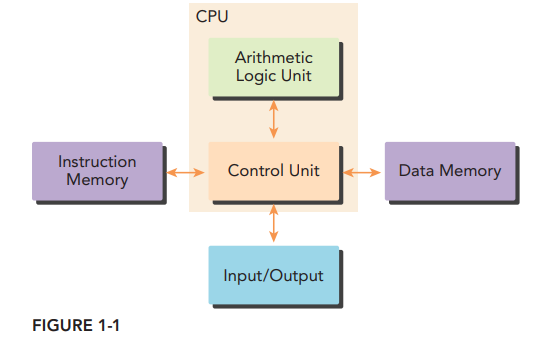

当编写串行程序时，我们无需考虑底层架构的实现。但是编写并行程序时，我们必须认识到计算机体系结构的特性

串行化程序的示意图

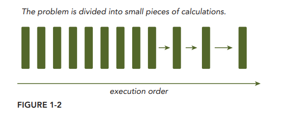

There are two ways to classify the relationship between two pieces of computation

- Some are related by a precedence restraint（优先级约束） and therefore must be calculated sequentially; 例如一个任务的输出是另一个任务的输入（数据依赖）
- others have no such restraints and can be calculated concurrently

并行化程序的示意图

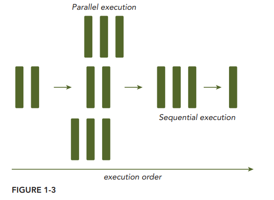

分析数据依赖性是实现并行算法的一项基础技能，因为这种依赖性是阻碍并行性的主要因素之一。

There are two fundamental types of parallelism in applications:

- **Task parallelism**
- **Data parallelism**

CUDA programming is especially well-suited to address problems that can be expressed as dataparallel computations.

The fi rst step in designing a data parallel program is to partition data across threads, with each thread working on a portion of the data. In general, there are two approaches to partitioning data: 

- **block partitioning** ：Each thread takes one portion of the data, usually an equal portion of the data.
- **cyclic partitioning**：Each thread takes more than one portion of the data.

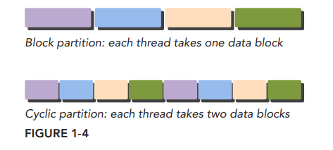

Usually, data is stored one-dimensionally. Even when a logical multi-dimensional view of data is used, it still maps to one-dimensional physical storage.

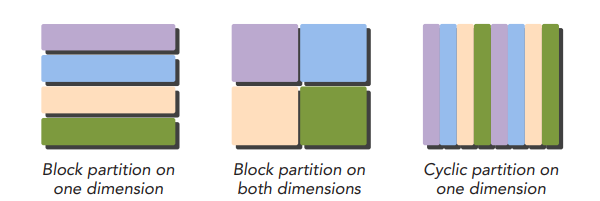

There are several different ways to classify computer architectures. One widely used classification scheme is **Flynn’s Taxonomy**, which classifies architectures into four different types according to how instructions and data flow through cores, including: 

- **Single Instruction Single Data (SISD)** ： There is only one core in the computer. At any time only one instruction stream is executed, and operations are performed on one data stream.

- **Single Instruction Multiple Data (SIMD)** ：There are multiple cores in the computer. All cores execute the same instruction stream at any time, each operating on different data streams. 

  例如ntel 手册上的MMX,SSE,AVX 等并行指令

  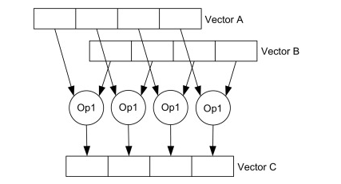

- **Multiple Instruction Single Data (MISD)** ：an uncommon architecture, where each core operates on the same data stream via separate instruction streams.

- **Multiple Instruction Multiple Data (MIMD)**： refers to a type of parallel architecture in which multiple cores operate on multiple data streams, each executing independent instructions.

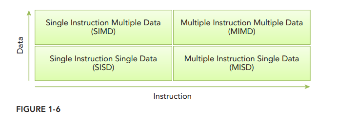

架构的演进主要为了实现以下目标：

- **Decrease latency**：Latency is the time it takes for an operation to start and complete
- **Increase bandwidth**：. Bandwidth is the amount of data that can be processed per unit of time（数据方面）
- **Increase throughput**：Throughput is the amount of operations that can be processed per unit of time（吞吐量方面）

Computer architectures can also be subdivided by their memory organization, which is generally classifi ed into the following two types:

- **Multi-node with distributed memory**：In a multi-node system, large scale computational engines are constructed from many processors connected by a network. Each processor has its own local memory, and processors can communicate the contents of their local memory over the network

  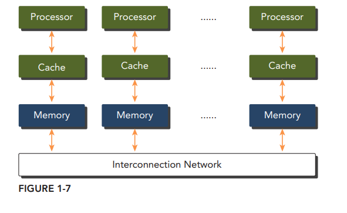

  These systems are often referred to as **clusters.**

- **Multiprocessor with shared memory**：These processors are either physically connected to the same memory. 

  

  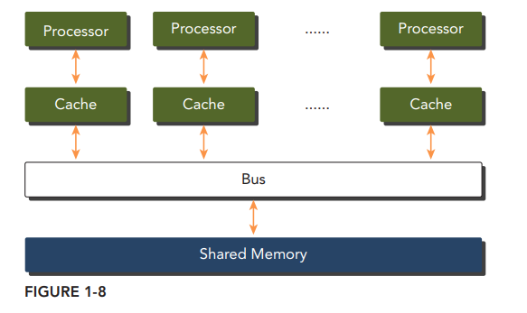

Historically, GPUs are graphics accelerators. Only recently have GPUs evolved to be powerful, general-purpose, fully programmable, task and data parallel processors. 

GPUs represent a many-core architecture, and have virtually every type of parallelism: multithreading, MIMD, SIMD, and instruction-level parallelism. NVIDIA coined（发明） the phrase **Single Instruction, Multiple Thread (SIMT)** for this type of architecture.

 a GPU core is quite different than a CPU core.

- A CPU core, relatively heavy-weight, is designed for very complex control logic, seeking to optimize the execution of sequential programs.
- A GPU core, relatively light-weight, is optimized for data-parallel tasks with simpler control logic, focusing on the throughput of parallel programs.

 

a GPU thread is also different than a CPU thread

- Threads on a CPU are generally heavyweight entities. The operating system must swap threads on and off CPU execution channels to provide multithreading capability. 
- Threads on GPUs are extremely lightweight.

CPU cores are designed to minimize latency for thread, whereas GPU cores are designed to handle a large number of concurrent, lightweight threads in order to maximize throughput.

## 异构系统

The switch from **homogeneous systems**（同构系统） to **heterogeneous systems**（异构系统） is a milestone in the history of high-performance computing

- Homogeneous computing uses one or more processor of the same architecture to execute an application
- Heterogeneous computing instead uses a suite of processor architectures to execute an application,  applying tasks to architectures to which they are well-suited

Although heterogeneous systems provide signifi cant advantages compared to traditional highperformance computing systems, effective use of such systems is currently limited by the increased application design complexity

A typical heterogeneous compute node nowadays consists of CPU and GPU. A GPU is currently not a standalone platform but a co-processor to a CPU. Therefore, GPUs must operate in conjunction with a CPU-based host through a PCI-Express bus

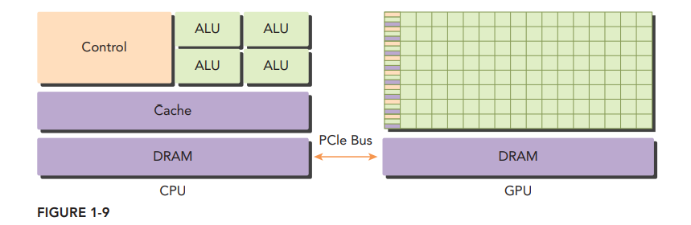

 A heterogeneous application consists of two parts:

- **Host code** that runs on CPUs. The CPU code is responsible for managing the environment, code, and data for the device before loading compute-intensive tasks on the device
- **Device code** that runs on GPUs

NVIDIA’s GPU computing platform is enabled on the following product families:

- **Tegra**：The Tegra product family is designed for mobile and embedded devices such as tablets and phones
- **GeForce**：GeForce for consumer graphics
- **Quadro**：Quadro for professional visualization
- **Tesla**：Tesla for datacenter parallel computing

There are two important features that describe GPU capability:

- **Number of CUDA cores**
- **Memory size**

Accordingly, there are two different metrics for describing GPU performance:

- **Memory bandwidth**：Memory bandwidth is a measure of the ratio at which data can be read from or stored to memory
- **Peak computational performance** Peak computational performance is a measure of computational capability, usually defi ned as how many single-precision or double-precision fl oating point calculations can be processed per second.

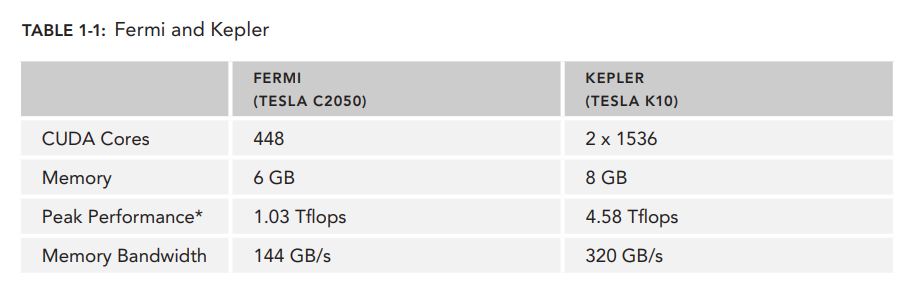

GPU computing is not meant to replace CPU computing.  CPU computing is good for control-intensive tasks, and GPU computing is good for data-parallel computation-intensive tasks.

The CPU is optimized for dynamic workloads marked by short sequences of computational operations and unpredictable control flow; and GPUs aim at workloads that are dominated by computational tasks with simple control flow. 

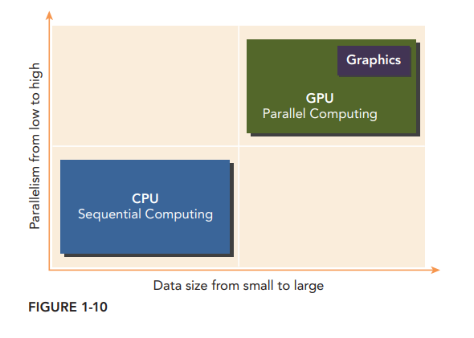

Writing code this way ensures that the characteristics of the GPU and CPU complement each other, leading to full utilization of the computational power of the combined CPU + GPU system

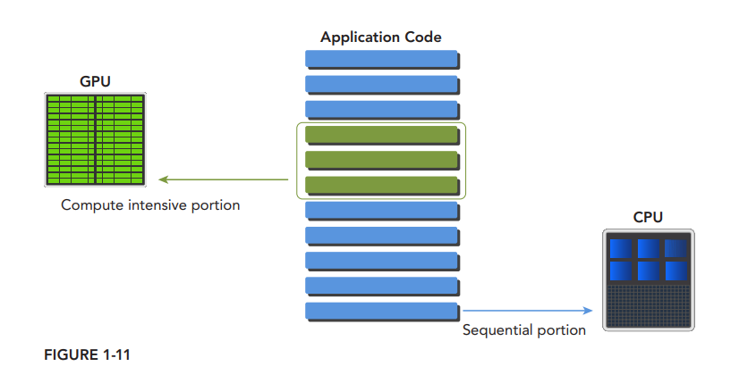

To support joint CPU + GPU execution of an application, NVIDIA designed a programming model called CUDA

## CUDA

CUDA is a general-purpose parallel computing platform and programming model that leverages the parallel compute engine in NVIDIA GPUs to solve many complex computational problems in a more effi cient way.

The CUDA platform is accessible through CUDA-accelerated libraries, compiler directives, application programming interfaces, and extensions to industry-standard programming languages, including C, C++, Fortran, and Python. CUDA C is an extension of standard ANSI C

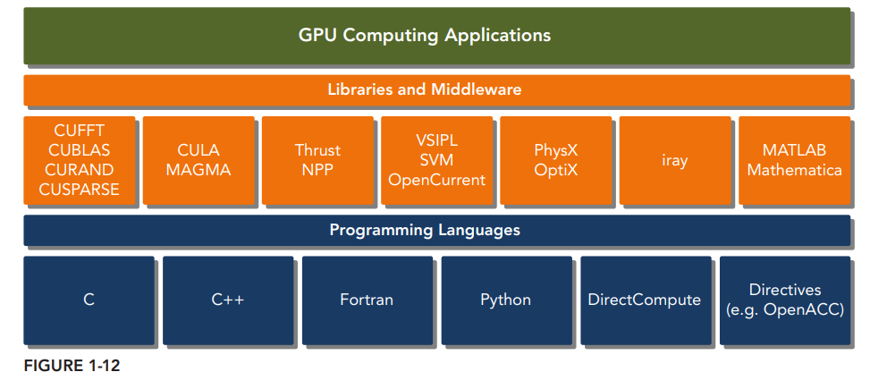

CUDA provides two API levels for managing the GPU device and organizing threads

- **CUDA Driver API**. The driver API is a low-level API and is relatively hard to program, but it provides more control over how the GPU device is used
- **CUDA Runtime API**.  The runtime API is a higher-level API implemented on top of the driver API. Each function of the runtime API is broken down into more basic operations issued to the driver API.

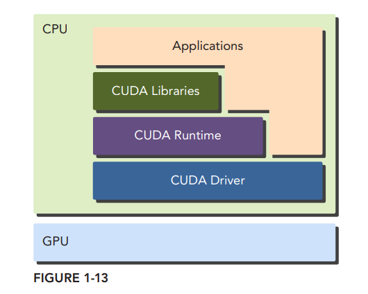

A CUDA program consists of a mixture of the following two parts:

- The host code runs on CPU.
- The device code runs on GPU.

NVIDIA’s CUDA `nvcc` compiler separates the device code from the host code during the compilation process. the host code is standard C code and is further compiled with C compilers. The device code is written using CUDA C extended with keywords for labeling data-parallel functions, called **kernels**. The device code is further compiled by nvcc.  During the link stage, CUDA runtime libraries are added for kernel procedure calls and explicit GPU device manipulation.

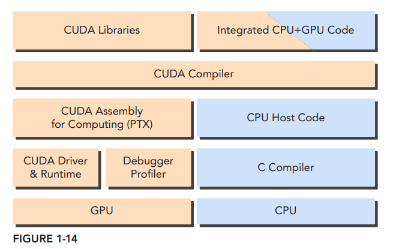

## HelloWorld

