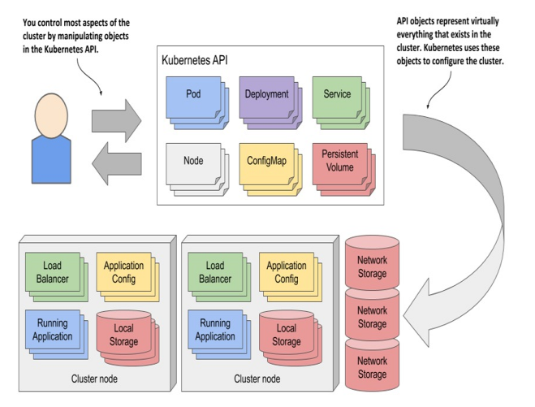
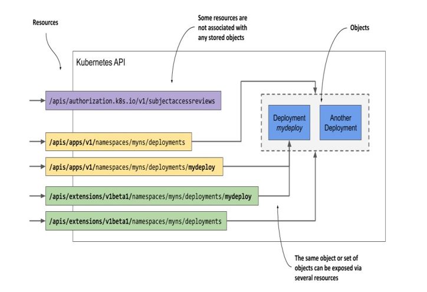
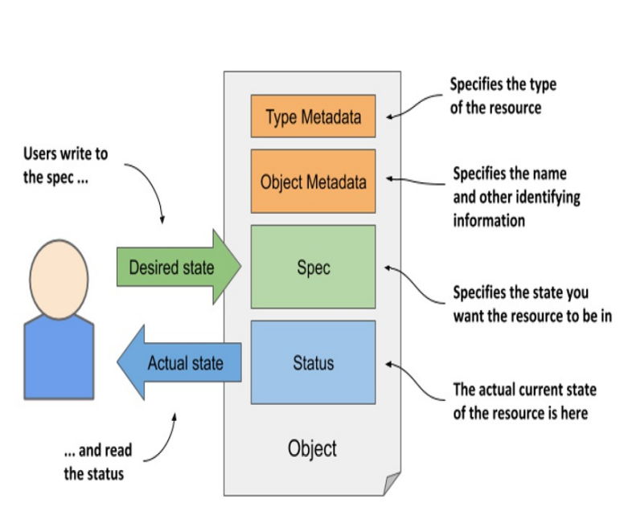
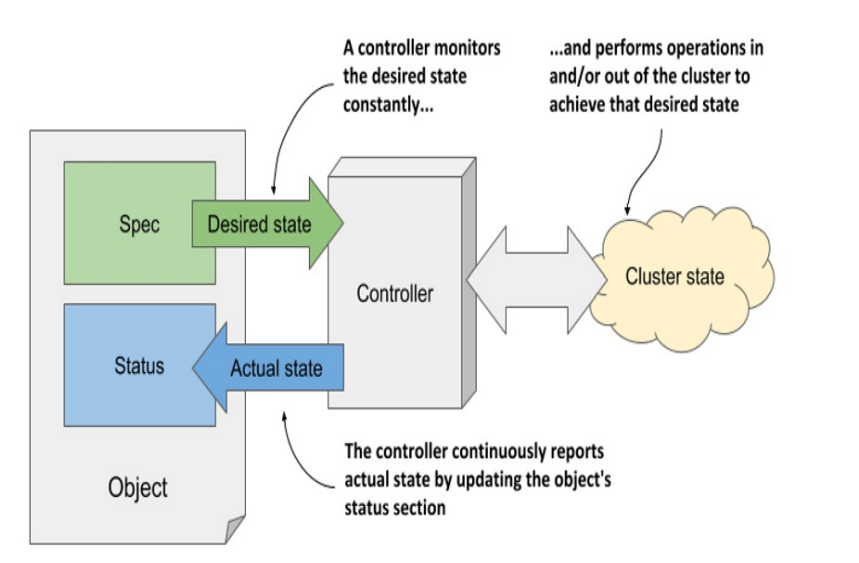

# Kuberneteds API

## Objects

In a Kubernetes cluster, both users and Kubernetes components interact with the cluster by manipulating objects through the Kubernetes API

**The Kubernetes API is an HTTP-based RESTful API**. 从理论上来讲，可以通过Web浏览器去访问API，但是API Server 一般使用TLS，这要求客户端验证或者Token。kubectl提供了代理功能，可以通过plain HTTP来访问API。

~~~shell
$ kubectl proxy
Starting to serve on 127.0.0.1:8001
~~~

In the Kubernetes community, the terms “resource” and “object” are used interchangeably. 但是这两个概念之间存在一些差异

An object can  be exposed through more than one resource

API支持JSON以及YAML这两种数据传输格式。例如

~~~shell
$ kubectl get node kind-control-plane -o yaml
~~~

这里`-o`选项指定数据格式。

The manifest of most Kubernetes API objects consists of the following four sections:

- **Type Metadata** contains information about the type of object this manifest describes. It specifies the object type, the group to which the type belongs, and the API version.
- **Object Metadata** holds the basic information about the object instance, including its name, time of creation, owner of the object, and other identifying information. The fields in the Object Metadata are the same for all object types.
- **Spec** is the part in which you specify the desired state of the object. Its fields differ between different object types
- **Status** contains the current actual state of the object

这里的wrtie to the spec和read the status，实际上是读写整个对象

The Kubernetes Control Plane runs several components called controllers that manage the objects you create. Each controller is usually only responsible for one object type

the task of a controller is to read the desired object state from the object’s Spec section, perform the actions required to achieve this state, and report back the actual state of the object by writing to its Status section. （**reads the Spec and writes the Status of the object**.）

All Kubernetes API objects contain the two metadata sections, but not all have the Spec and Status sections. Those that don’t, typically contain just static data and don’t have a corresponding controller

## Examining an object’s individual properties

### Exploring the full manifest of a Node object

Node objects are usually created by the Kubelet rather than by users.

这里我们看看node object manifest（这里只列出重要的字段）

~~~shell
$ kubectl get node kind-control-plane -o yaml
~~~

~~~yaml
apiVersion: v1
kind: Node
metadata:
	annotations: ...
	creationTimestamp: "2020-05-03T15:09:17Z"
	labels:	...
	name: kind-control-plane
	resourceVersion:..
spec:
	podCIDR: 10.244.0.0/24
	...
status:
	addresss: 
	- address: 172.18.0.2
	capacity:
		cpu: "8"
		memory:...
		hugepages-1Gi: "0"
		...
	...
~~~

### Understanding individual object fields

`kubectl explain <kind>`命令会打印在指定类型的Object Manifest中每个top-level字段的作用

~~~shell
$ kubectl explain nodes
~~~

你也可以打印指定top-level字段下的subfields

~~~shell
$ kubectl explain node.spec
~~~

multiple versions of the same kind can exist. Different versions can have different fields or default values. If you want to display a different version, specify it with the `--api-version` option.

If you want to see the complete structure of an object (the complete hierarchical list of fields without the descriptions), try `kubectl explain pods --recursive.`

### Understanding an object’s status conditions

conditions field gives a list of conditions the object is currently in

~~~shell
$ kubectl get node kind-control-plane -o yaml
~~~

~~~yaml
...
status:
  ...
  conditions:
  - lastHeartbeatTime: "2020-05-17T13:03:42Z"
    lastTransitionTime: "2020-05-03T15:09:17Z"
    message: kubelet has sufficient memory available
    reason: KubeletHasSufficientMemory
    status: "False"
    type: MemoryPressure
  - lastHeartbeatTime: "2020-05-17T13:03:42Z"
    lastTransitionTime: "2020-05-03T15:09:17Z"
    message: kubelet has no disk pressure
    reason: KubeletHasNoDiskPressure
    status: "False"
    type: DiskPressure
  - lastHeartbeatTime: "2020-05-17T13:03:42Z"
    lastTransitionTime: "2020-05-03T15:09:17Z"
    message: kubelet has sufficient PID available
    reason: KubeletHasSufficientPID
    status: "False"
    type: PIDPressure
  - lastHeartbeatTime: "2020-05-17T13:03:42Z"
    lastTransitionTime: "2020-05-03T15:10:15Z"
    message: kubelet is posting ready status
    reason: KubeletReady
    status: "True"
    type: Ready
~~~

- `Ready` condition signals whether the node is ready to accept new workloads (pods)
- The other conditions (`MemoryPressure`, `DiskPressure` and `PIDPressure`) signal whether the node is running out of resources.

- The `lastTransitionTime` field indicates when the condition moved from one status to anothe
- the `lastHeartbeatTime` 代表系统最后一次接收到此资源的"心跳"的时间。

###  Inspecting objects using the kubectl describe command

the kubectl describe command displays all the information you previously found in the YAML manifest of the Node object, but in a more readable form

~~~shell
$ kubectl describe node kind-worker-2
~~~

~~~yaml
Name:               kind-worker2
Roles:              <none>
Labels:             beta.kubernetes.io/arch=amd64
                    beta.kubernetes.io/os=linux
                    kubernetes.io/arch=amd64
                    kubernetes.io/hostname=kind-worker2
                    kubernetes.io/os=linux
Annotations:        kubeadm.alpha.kubernetes.io/cri-socket: /run/contain...
                    node.alpha.kubernetes.io/ttl: 0
                    volumes.kubernetes.io/controller-managed-attach-deta...
CreationTimestamp:  Sun, 03 May 2020 17:09:48 +0200
Taints:             <none>
Unschedulable:      false
Lease:
  HolderIdentity:  kind-worker2
  AcquireTime:     <unset>
  RenewTime:       Sun, 17 May 2020 16:15:03 +0200
Conditions:
  Type             Status  ...  Reason                       Message
  ----             ------  ---  ------                       -------
  MemoryPressure   False   ...  KubeletHasSufficientMemory   ...
  DiskPressure     False   ...  KubeletHasNoDiskPressure     ...
  PIDPressure      False   ...  KubeletHasSufficientPID      ...
  Ready            True    ...  KubeletReady                 ...
Addresses:
  InternalIP:  172.18.0.4
  Hostname:    kind-worker2
Capacity:
  cpu:                8
  ephemeral-storage:  401520944Ki
  hugepages-1Gi:      0
  hugepages-2Mi:      0
  memory:             32720824Ki
  pods:               110
Allocatable:
  ...
System Info:
  ...
PodCIDR:                      10.244.1.0/24
PodCIDRs:                     10.244.1.0/24
Non-terminated Pods:          (2 in total)
  Namespace     Name               CPU Requests  CPU Limits  ...  AGE
  ---------     ----               ------------  ----------  ...  ---
  kube-system   kindnet-4xmjh      100m (1%)     100m (1%)   ...  13d
  kube-system   kube-proxy-dgkfm   0 (0%)        0 (0%)      ...  13d
Allocated resources:
  (Total limits may be over 100 percent, i.e., overcommitted.)
  Resource           Requests   Limits
  --------           --------   ------
  cpu                100m (1%)  100m (1%)
  memory             50Mi (0%)  50Mi (0%)
  ephemeral-storage  0 (0%)     0 (0%)
  hugepages-1Gi      0 (0%)     0 (0%)
  hugepages-2Mi      0 (0%)     0 (0%)
Events:
  Type    Reason                   Age    From                      Message
  ----    ------                   ----   ----                      -------
  Normal  Starting                 3m50s  kubelet, kind-worker2     ...

~~~

