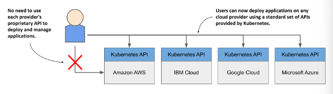
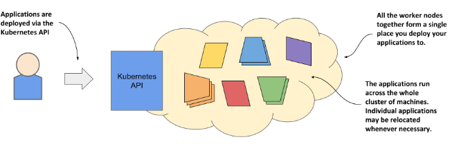

# Kubernetes 初步

## 概述

Kubernetes"这个词是希腊语，意为"领航员"或"掌舵者"。它的主要作用如下

- **云原生**

  - **集群调度**，k8s还负责在集群中调度微服务，就像操作系统在CPU中调度进程一样。
  - **自动部署**
  - **service discovery**（服务发现）
  - **horizontal scaling** 
  - **load-balancing** 
  - **self-healing**（自愈） 
  - **leader election** 

- **容器隔离**，为每一个微服务提供了独立的环境

  - 配置隔离：different microservices running in the same operating system may require different, potentially conflicting versions of dynamically linked libraries or have different environment requirements.
  - 每个微服务都有自己的开发、构建、部署、运维流程

- **抽象**：所有底层基础设施（网络、操作系统、库依赖等等）之间的差异被K8s隐藏起来了，换句话说就是为应用提供了关于基础设施的抽象层。这样做的好处如下：

  - 在应用程序的部署、开发过程中，无需关心这些设施的细节了。也就是说开发者可以专注于实现业务逻辑，而无需在应用程序与基础设施整合上浪费时间。而且这有助于弥合开发和运维之间的鸿沟

    

  - 在程序代码与基础设施进行了解耦，这样可以无缝在云服务提供商中切换

    

Kubernetes uses a **declarative model** to define an application. You describe the components that build your application and Kubernetes turns this description into a running application. It then keeps the application healthy by restarting or recreating parts of it as needed.

Whenever you change the description, Kubernetes will take the necessary steps to reconfigure the running application to match the new description

 

## 架构

**Kubernetes exposes the cluster as a uniform deployment area**

大部分情况下，我们在「应用程序落在哪一个节点」这种问题上，持有无所谓的态度。此时，k8s会把微服务放在尽可能少的节点上，以最大化硬件的利用率。

Using Kubernetes to manage your deployed applications also means that the operations team doesn’t have to constantly monitor the load of each application to respond to sudden load peaks. Kubernetes takes care of this also. It can monitor the resources consumed by each application and other metrics and adjust the number of running instances of each application to cope with increased load or resource usage.

When you run Kubernetes on cloud infrastructure, it can even increase the size of your cluster by provisioning additional nodes through the cloud provider’s API. This way, you never run out of space to run additional instances of your applications.

a **Kubernetes cluster** are divided into the **Control Plane** and the **Workload Plane**（**Data Plane**）

集群中的机器被划分为

- 主节点（master nodes），对应Kubernetes的控制层，负责控制整个集群。It consists of several components that run on a single master node or are replicated across multiple master nodes to ensure high availability.

  

  - **The Kubernetes API Server** exposes the RESTful Kubernetes API. 
  - **The etcd distributed datastore** persists the objects you create through the API, since the API Server itself is stateless. The Server is the only component that talks to etcd.
  - **The Scheduler** decides on which worker node each application instance should run.
  - **Controllers** bring to life the objects you create through the API. Most of them simply create other objects, but some also communicate with external systems

- 工作节点（worker nodes），对应Kubernetes的工作负载层，负责运行微服务

  

  - **The Kubelet**, an agent that talks to the API server and manages the applications running on its node. It reports the status of these applications and the node via the API.
  - **The Container Runtime**, which can be Docker or any other runtime compatible with Kubernetes. It runs your applications in containers as instructed by the Kubelet.
  - **The Kubernetes Service Proxy (Kube Proxy)** load-balances network traffic between applications. 

> Most Kubernetes clusters also contain several other components. This includes a DNS server, network plugins, logging agents and many others. They typically run on the worker nodes but can also be configured to run on the master.

Everything in Kubernetes is represented by an **object**. You create and retrieve these objects via the Kubernetes API. Your application consists of several types of these objects

- one type represents the application deployment as a whole
- another represents a running instance of your application
- another represents the service provided by a set of these instances and allows reaching them at a single IP address
- and so on

These objects are usually defined in one or more manifest files in either YAML or JSON format.

The following figure shows an example of deploying an application by creating a manifest with two deployments exposed using two services.

1. After you’ve created your YAML or JSON file(s), you submit the file to the API, usually via the Kubernetes command-line tool called **kubectl**. Kubectl splits the file into individual objects and creates each of them by sending an HTTP PUT or POST request to the API. The API Server validates the objects and stores them in the etcd datastore.  In addition, it notifies all interested components that these objects have been created. Controllers are one of these components.
2. Most object types have an associated controller. A controller is interested in a particular object type. It waits for the API server to notify it that a new object has been created, and then performs operations to bring that object to life. Typically, the controller just creates other objects via the same Kubernetes API. For example, the controller responsible for application deployments creates one or more objects that represent individual instances of the application. The number of objects created by the controller depends on the number of replicas specified in the application deployment object.
3. The scheduler is a special type of controller, whose only task is to schedule application instances onto worker nodes. It selects the best worker node for each new application instance object and assigns it to the instance
4. The Kubelet that runs on each worker node is also a type of controller. Its task is to wait for application instances to be assigned to the node on which it is located and run the application. This is done by instructing the Container Runtime to start the application’s container.
5. The Kube Proxy notices that the application instances are ready to accept connections from clients and configures a load balancer for them.
6. The Kubelets and the Controllers monitor the system and keep the applications running.

## Containers

