# Kubernetes 初步

## 概述

Kubernetes 这个词是希腊语，意为"领航员"或"掌舵者"。它的主要作用如下

- **云原生**

  - **集群调度**
  - **service discovery**
  - **horizontal scaling** 
  - **load-balancing** 
  - **self-healing**
  - **leader election** 
  
- **容器隔离**

  - 配置隔离：different microservices running in the same operating system may require different, potentially conflicting versions of dynamically linked libraries or have different environment requirements.
  - 每个微服务都有自己的开发、构建、部署、运维流程

- **抽象**：所有底层基础设施（网络、操作系统、库依赖、负载均衡、服务发现等等）之间的差异被K8s隐藏起来了，换句话说就是为应用提供了关于基础设施的抽象层。这样做的好处如下：

  - 在应用程序的部署、开发过程中，无需关心这些设施的细节了。也就是说开发者可以专注于实现业务逻辑，而无需在应用程序与基础设施整合上浪费时间。而且这有助于弥合开发和运维之间的鸿沟

    

  - 在程序代码与基础设施进行了解耦，这样可以无缝在云服务提供商中切换

    


Kubernetes uses a **declarative model** to define an application. Instead of telling Kubernetes what to do, you simply set a new desired state of the system and let Kubernetes achieve it. To do this, it examines the current state, compares it with the desired state, identifies the differences and determines what it must do to reconcile them.


Whenever you change the description, Kubernetes will take the necessary steps to reconfigure the running application to match the new description

 


## 架构

**Kubernetes exposes the cluster as a uniform deployment area**


大部分情况下，我们并不关心「应用程序落在哪一个节点」这种问题。此时，k8s会把微服务放在尽可能少的节点上，以最大化硬件的利用率。


a **Kubernetes cluster** are divided into the **Control Plane** and the **Workload Plane**（**Data Plane**）


集群中的机器被划分为

- 主节点（master nodes），对应Kubernetes的控制层，负责控制整个集群。

  

  - **The Kubernetes API Server** exposes the RESTful Kubernetes API.  **Everything in Kubernetes is represented by an object** and can be retrieved and manipulated via the RESTful API
  - **The etcd distributed datastore** persists the objects you create through the API, since the API Server itself is stateless. The Server is the only component that talks to etcd.
  - **The Scheduler** decides on which worker node each application instance should run.
  - **Controllers** bring to life the objects you create through the API. Most of them simply create other objects, but some also communicate with external systems

- 工作节点（worker nodes），对应Kubernetes的工作负载层，负责运行微服务

  

  - **The Kubelet**, an agent that talks to the API server and manages the applications running on its node. It reports the status of these applications and the node via the API.
  - **The Container Runtime**, which can be Docker or any other runtime compatible with Kubernetes. It runs your applications in containers as instructed by the Kubelet.
  - **The Kubernetes Service Proxy (Kube Proxy)** load-balances network traffic between applications. 

> Most Kubernetes clusters also contain several other components. This includes a DNS server, network plugins, logging agents and many others. They typically run on the worker nodes but can also be configured to run on the master.

Everything in Kubernetes is represented by an **object**. You create and retrieve these objects via the Kubernetes API. Your application consists of several types of these objects

- one type represents the application deployment as a whole
- another represents a running instance of your application
- another represents the service provided by a set of these instances and allows reaching them at a single IP address
- and so on

These objects are usually defined in one or more manifest files in either YAML or JSON format.


The following figure shows an example of deploying an application by creating a manifest with two deployments exposed using two services.


1. After you’ve created your YAML or JSON file(s), you submit the file to the API, usually via the Kubernetes command-line tool called **kubectl**. Kubectl splits the file into individual objects and creates each of them by sending an HTTP PUT or POST request to the API. The API Server validates the objects and stores them in the etcd datastore.  In addition, it notifies all interested components that these objects have been created. Controllers are one of these components.
2. Most object types have an associated controller. A controller is interested in a particular object type. It waits for the API server to notify it that a new object has been created, and then performs operations to bring that object to life. Typically, the controller just creates other objects via the same Kubernetes API. For example, the controller responsible for application deployments creates one or more objects that represent individual instances of the application. The number of objects created by the controller depends on the number of replicas specified in the application deployment object.
3. The scheduler is a special type of controller, whose only task is to schedule application instances onto worker nodes. It selects the best worker node for each new application instance object and assigns it to the instance
4. The Kubelet that runs on each worker node is also a type of controller. Its task is to wait for application instances to be assigned to the node on which it is located and run the application. This is done by instructing the Container Runtime to start the application’s container.
5. The Kube Proxy notices that the application instances are ready to accept connections from clients and configures a load balancer for them.
6. The Kubelets and the Controllers monitor the system and keep the applications running.


## Containers

由于虚拟机的资源开销，为每一个微服务分配一个VM，不太现实。容器是代替虚拟机的轻量级方案，每个容器都运行在同一个宿主操作系统上，但是它们之间的配置是隔离的。

> k8s假定每个容器只运行一个服务


虚拟机和容器之间的比较

- 资源开销

- 启动时间

- 硬件资源：Underneath those VMs is the hypervisor (and possibly an additional operating system), which splits the physical hardware resources into smaller sets of virtual resources that the operating system in each VM can use

  这个系统调用增加了负担

  
- 虚拟机相比容器唯一的优势就是，它提供了完全的隔离机制。


Docker is a platform for packaging, distributing and running applications. It simplified the process of packaging up the application and all its libraries and other dependencies - even the entire OS file system - into a simple, portable package 


- Images—Like a zip file .It contains the whole filesystem that the application will use and additional metadata
- Registries—A registry is a repository of container images that enables the exchange of images between different people and computers
- Containers—A container is instantiated from a container image. 


一个部署Docer的基本流程：


When you run an application in a container, it sees exactly the file system content you bundled into the container image, as well as any additional file systems you mount into the container.

container images consist of layers. These layers can be shared and reused across multiple images.  Layers make image distribution very efficient but also help to reduce the storage footprint of images. Docker stores each layer only once. 


The filesystems are isolated by the Copy-on-Write (CoW) mechanism. The filesystem of a container consists of read-only layers from the container image and an additional read/write layer stacked on top

When an application running in container A changes a file (delete, change permissions, write) in one of the read-only layers, the entire file is copied into the container’s read/write layer and the file contents are changed there. Since each container has its own read/write layer, changes to shared files are not visible in any other container.

when you delete a file, it is only marked as deleted in the new layer and is not removed from the layers below.

containers don’t have their own kernel. If a containerized application requires a particular kernel version, it may not work on every computer.


And it’s not just about the kernel and its modules. It should also be clear that a containerized app built for a specific hardware architecture can only run on computers with the same architecture.

For this you would need a VM to emulate the  specific architecture.

The actual isolation of containers takes place at the Linux kernel level using the mechanisms it provides. Docker just makes it easy to use these mechanisms

After the success of Docker, the Open Container Initiative (OCI) was born to create open industry standards around container formats and runtime

Kubernetes now supports many other container runtimes through the Container Runtime Interface (CRI). One implementation of CRI is CRI-O, a lightweight alternative to Docker that allows you to leverage（使用） any OCI-compliant container runtime with Kubernetes. Examples of OCI-compliant runtimes include rkt (pronounced Rocket), runC, and Kata Containers.

## Exploring containers hands-on

~~~shell
$ docker run busybox echo "Hello World"
~~~


If you want to run an image from a different registry, you must specify the registry along with the image name

Docker allows you to have multiple versions or variants of the same image under the same name by using a unique tag.  If you refer to images without explicitly specifying the tag, Docker assumes that you’re referring to the special `latest` tag.

```shell
$ docker run redis:5.0.7-alpine
$ docker run redis:5.0.7-buster
```


`Dockerfile` contains a list of instructions that Docker should perform when building the image

~~~dockerfile
# The FROM line defines the container image that you’ll use as the starting point (the base image you’re building on top of).
FROM node:12

# you add the app.js file from your local directory into the root directory of the image
ADD app.js /app.js

# you specify the command that Docker should run when you execute the image. In your case, the command is node app.js.
ENTRYPOINT ["node", "app.js"]
~~~

开始构建镜像

~~~shell
$ docker build  -t kubia:latest . 
~~~

- The `-t` option specifies the desired image name and tag
- the dot at the end specifies the path to the directory that contains the Dockerfile and the build context

查看镜像

~~~shell
docker images
~~~

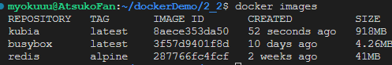


When building an image, a new layer is created for each individual directive in the Dockerfile.

You can see the layers of an image and their size by running `docker history`

~~~shell
$ docker history kubia:latest
~~~

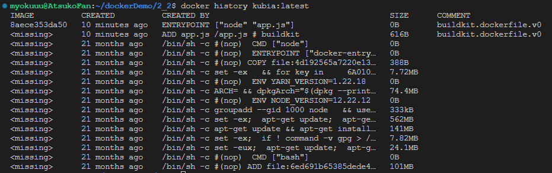

With the image built and ready, you can now run the container with the following command:

~~~shell
docker run --name kubia-container -p 1234:8080 -d kubia
~~~

- This tells Docker to run a new container called `kubia-container` from the kubia image.

- The container is detached from the console (`-d` flag) and runs in the background.
- Port `1234` on the host computer is mapped to port 8080 in the container. so you can access the app at [http://localhost:1234](http://localhost:1234/).


`docker ps` command lists all the containers that are running on your computer

```shell
$ docker ps
```

To see additional information, you can use `docker inspect`:

~~~shell
$ docker inspect kubia-container
~~~


Docker captures and stores everything the application writes to the standard output and error streams.You can use the `docker logs` command to see the output

~~~shell
$ docker logs kubia-container
~~~


Before you push the image, you must re-tag it according to Docker Hub’s image naming schema. The image name must include your Docker Hub ID, which you choose when you register at [http://hub.docker.com](http://hub.docker.com/).

~~~shell
$ docker tag kubia atsukoruo/kubia:1.0
~~~

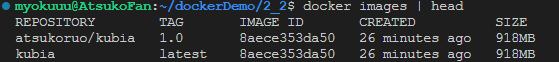

As you can see, both `kubia` and `atsukoruo/kubia:1.0` point to the same image ID, meaning that these aren’t two images, but a single image with two names.


```shell
$ docker login -u yourid -p yourpassword docker.io
```

```shell
$ docker push yourid/kubia:1.0
```

You can now run the image on any Docker-enabled host by running the following command:

~~~shell
$ docker run -p 1234:8080 -d atsukoruo/kubia:1.0
~~~

Instruct Docker to stop the container with this command:

```shell
$ docker stop kubia-container
```

The container is no longer running, but it still exists. You can see stopped containers by running `docker ps -a`

you can start the container again by running `docker start kubia-container`.

To delete it, run the following `docker rm` command:

```shell
$ docker rm kubia-container
```

The image is still there, If you also want to delete the image, use the `docker rmi` command:

```shell
$ docker rmi kubia:latest
```

## Understanding what makes containers possible

### Namespaces

The first feature called **Linux Namespaces** ensures that each process has its own view of the system. 

The following types of namespaces exist:

- The Mount namespace (mnt) isolates mount points (file systems).
- The Process ID namespace (pid) isolates process IDs.
- The Network namespace (net) isolates network devices, stacks, ports, etc.
- The Inter-process communication namespace (ipc) isolates the communication between processes (this includes isolating message queues, shared memory, and others).
- The UNIX Time-sharing System (UTS) namespace isolates the system hostname and the Network Information Service (NIS) domain name.
- The User ID namespace (user) isolates user and group IDs.
- The Cgroup namespace isolates the Control Groups root directory. You’ll learn about cgroups later in this chapter.


Each network interface belongs to exactly one namespace


Each process is associated with multiple namespace types, some of which can be shared.


Running a shell inside an existing container：

~~~shell
$ docker exec -it kubia-container bash
root@44d76963e8e1:/# ps aux
~~~

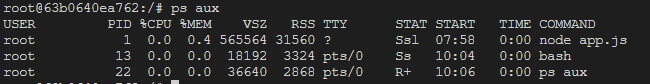

This command runs bash shell as an additional process in the existing kubia-container container. The process has the same Linux namespaces as the main container process 

The -it option is shorthand for two options:

- `-i` tells Docker to run the command in interactive mode.
- `-t` tells it to allocate a pseudo terminal (TTY) so you can use the shell properly.


the processes in the container are in fact regular processes that run in the host OS.  you may notice that the process IDs in the container are different from those on the host. Because the container uses its own Process ID namespace


### Control Groups

The second Linux kernel feature that makes containers possible is called **Linux Control Groups (cgroups)**， It limits, accounts for and isolates system resources such as CPU, memory and disk or network bandwidth.


You can explicitly specify which cores a container can use with Docker’s `--cpuset-cpus` option

~~~shell
$ docker run --cpuset-cpus="1,2" ...
~~~

You can also limit the available CPU time using options `--cpus`, `--cpu-period`, `--cpu-quota` and `--cpu-shares`


 Docker provides the following options to limit container memory and swap usage: `--memory`, `--memory-reservation`, `--kernel-memory`, `--memory-swap`, and `--memory-swappiness`.

~~~shell
$ docker run --memory="100m" ...
~~~


## Strengthening isolation between containers

the processes in these containers use the same system kernel.  A rogue container could make malicious system calls that would affect other containers

there are technologies used to secure them

- **Giving containers full privileges to the system**

  Some of these sys-calls are fairly safe and available to any process, but others are reserved for processes with elevated privileges only

  Most containers should run without elevated privileges. Only those programs that you trust and that actually need the additional privileges should run in privileged containers.

- **using capabilities to give containers a subset of all privileges**

  Linux kernel also divides privileges into units called capabilities. Examples of capabilities are:

  - `CAP_NET_ADMIN` allows the process to perform network-related operations,
  - `CAP_NET_BIND_SERVICE` allows it to bind to port numbers less than 1024,
  - `CAP_SYS_TIME allows` it to modify the system clock, and so on.

  Capabilities can be added or removed (dropped) from a container when you create it. **Don’t give them any capabilities that they don’t need.** This prevents attackers from using them to gain access to your operating system.

- **using seccomp profiles to filter individual syscalls**

  If you need even finer control over what sys-calls a program can make, you can use seccomp (Secure Computing Mode). You can create a custom seccomp profile by creating a JSON file that lists the sys-calls that the container using the profile is allowed to make

- **Hardening containers using AppArmor and SELinux**

  With SELinux, you attach labels to files and system resources, as well as to users and processes. A user or process can only access a file or resource if the labels of all subjects and objects involved match a set of policies. AppArmor is similar but uses file paths instead of labels and focuses on processes rather than users.


## Deploying a Kubernetes cluster

Setting up a full-fledged, multi-node Kubernetes cluster isn’t a simple task, especially if you’re not familiar with Linux and network administration.


### Enabling Kubernetes in Docker Desktop


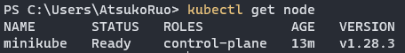

### Minikube

下载地址：https://minikube.sigs.k8s.io/docs/start/

The cluster created by minikube consists of a single node and is suitable for both testing Kubernetes and developing applications locally

启动minikube

~~~shell
$ minikube start
~~~

查看minikube的状态

~~~shell
$ minikube status
~~~

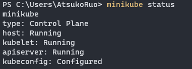

关闭minikube

~~~shell
$ minikube stop
~~~


You can run `minikube ssh` command to log into the Minikube VM

### kind

An alternative to Minikube is kind. Instead of running Kubernetes in a virtual machine or directly on the host, kind runs each Kubernetes cluster node inside a container. Unlike Minikube, this allows it to create multi-node clusters by starting several containers.


下载地址：https://github.com/kubernetes-sigs/kind/releases/

下载完后，重命名为kind.exe，然后放到`C:\Windows\`目录下即可。

启动集群

~~~shell
$ kind create cluster 
$ kind create cluster -- name ${name}
~~~

查看集群的名字

~~~shell
kind get clusters
~~~

删除集群

~~~shell
kind delete cluster --name ${name}
~~~


Kind runs a single-node cluster by default. 

If you want to run a cluster with multiple worker nodes, you must first create a configuration file named `kind-multi-node.yaml`

~~~yml
kind: Cluster
apiVersion: kind.sigs.k8s.io/v1alpha3
nodes:
  - role: control-plane
  - role: worker
  - role: worker
~~~

注意，`apiVersion`的最新版本为`kind.x-k8s.io/v1alpha4`


获取集群中的节点

~~~shell
$ kind get nodes
~~~


Unlike Minikube, where you use `minikube ssh` to log into the node. with kind you should use `docker exec`

~~~shell
$ docker exec -it kind-control-plane bash
~~~

### GKE

For complete instructions, refer to https://cloud.google.com/container-engine/docs/before-you-begin.


## Interacting with Kubernetes

### kubect

The kubeconfig configuration file is located at `~/.kube/config`，在window上是`C:\Users\AtsukoRuo\.kube`

 you can also point kubectl to file by setting the `KUBECONFIG` environment variable as follows:

~~~shell
$ export KUBECONFIG=/path/to/custom/kubeconfig
~~~


To verify that your cluster is working, use the kubectl cluster-info command

~~~shell
$ kubectl cluster-info
~~~

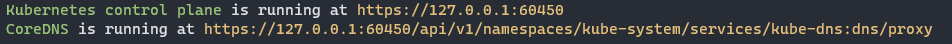

the KubeDNS service provides domain-name sevices within the cluster


list cluster nodes

~~~shell
$ kubectl get nodes
~~~

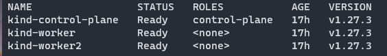

retrieve additional details of an object

~~~java
$ kubectl describe node kind-worker
~~~

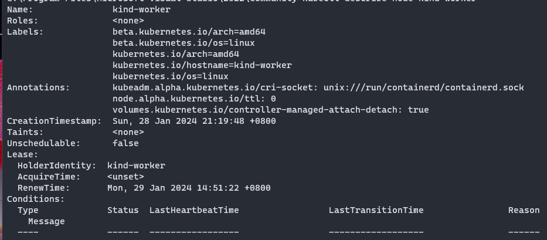

### dashboard

Dashboard 是基于网页的 Kubernetes 用户界面


安装命令：

~~~shell
kubectl apply -f https://raw.githubusercontent.com/kubernetes/dashboard/v2.7.0/aio/deploy/recommended.yaml
~~~

启用 Dashboard 访问

```
kubectl proxy
```


## Running application on Kubernetes

### Deployment

创建一个Deploymeny对象：

~~~shell
kubectl create deployment kubia --image=atsukoruo/kubia:1.0
~~~

visualize what happened when you created the Deployment


删除 deployment 对象

~~~shell
kubectl delete deployment my-deployment
~~~

获取 deployment 对象

~~~shell
$ kubectl get deployments
~~~

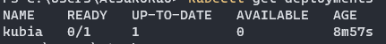


deployment对象支持横向扩展

~~~shell
kubectl scale deployment kubia --replicas=3
~~~

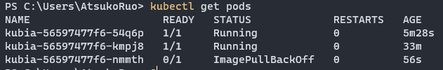

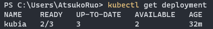

**Each replica is represented by a Pod object. **

To see which nodes the pods were scheduled to, you can use the `-o` `wide` option to display a more detailed pod list:

~~~shell
$ kubectl get pods -o wide
NAME                   ...  IP          NODE
kubia-9d785b578-58vhc  ...  10.244.1.5  worker1
kubia-9d785b578-jmnj8  ...  10.244.2.4  worker2
kubia-9d785b578-p449x  ...  10.244.2.3  worker2
~~~

If one or more pods disappear (deleted) or their status is unknown, Kubernetes replaces them to bring the actual number of pods back to the desired number of replicas.


### Pod

In Kubernetes, instead of deploying individual containers, you deploy groups of co-located containers – so-called **pods**. （也就是说， “Pod”是最小的可部署的单元）


Each pod has its own IP, hostname, processes, network interfaces and other resources.  （这类似于 Linux 的命名空间）

once a pod is assigned to a node, it runs only on that node.

Since containers aren’t a top-level Kubernetes object, you can’t list them. But you can list pods

~~~shell
kubectl get pods
~~~

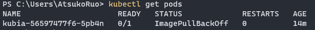

The reason the pod is pending is because the worker node to which the pod has been assigned must first download the container image before it can run it

删除pod对象

~~~shell
kubectl delete pod my-pod
~~~

获取Pod对象的详细信息

~~~shell
kubectl describe pod
~~~

### Service

each pod gets its own IP address, but this address is internal to the cluster and not accessible from the outside. To make the pod accessible externally, you’ll expose it by creating a Service object.

Several types of Service objects exist.  A service with the type LoadBalancer provisions an external load balancer, which makes the service accessible via a public IP

~~~shell
kubectl expose deployment kubia --type=LoadBalancer --port 8080
# 根据deployment对象来创建service对象
~~~

You didn’t specify a name for the Service object, so it inherits the name of the Deployment.


Pods are ephemeral.  Unlike pods, services aren’t ephemeral. When you create a service, it is assigned a static IP address that never changes during lifetime of the service. **The Service object represents a single communication entry point to these replicas.**


获取服务

~~~shell
$ kubectl get service
~~~

删除服务

~~~shell
$ kubectl delete service my-service
~~~


> Most resource types have a short name that you can use instead of the full object type (for example, `po` is short for `pods`, no for nodes and `deploy` for `deployments`).
>
> run `kubectl api-resources` command to get more information
>
> 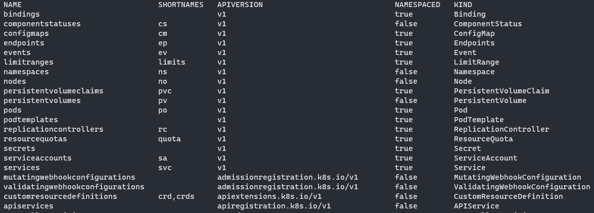

While Kubernetes allows you to create so-called LoadBalancer services, it doesn’t provide the load balancer itself.  it will ask the cloud provider to provision a load balancer


Not all Kubernetes clusters have mechanisms to provide a load balancer


Load balancing across multiple pods backing the same service


As the figure shows, you shouldn’t confuse this load balancing mechanism, which is provided by the Kubernetes service itself, with the additional load balancer provided by the infrastructure

