# 管理

[TOC]

## 集群管理

_cat APIs 查看集群相关的信息

~~~bash
# 使用 _cat API 获取所有可用的目录
GET /_cat/

# 结果
/_cat/allocation
/_cat/shards
/_cat/shards/{index}
/_cat/master
/_cat/nodes
.... 
~~~

_cat APIs 返回了多个 API 的目录，这些 API 都可以添加下面几个参数：

- **v 参数**：每个命令都可以使用 v 参数来打印详细信息。如：GET /_cat/nodes?v。
- **h 参数**：使用 h 参数可以强制只显示某些列。如：GET /_cat/nodes?h=node.role,port,name。
- **help 参数**：使用 help 参数可以输出这个接口可用的列名和其解析。如：GET /_cat/master?help。


查看集群状态：

~~~bash
# 查看集群健康状态
GET /_cat/health?v
GET /_cat/health?v&ts=false # 去除时间戳

# 查看集群状态
GET /_cluster/state

# 查看集群统计信息
GET /_cluster/stats?human&pretty

# 查看集群的设置
GET /_cluster/settings?include_defaults=true
~~~


查看磁盘使用情况

~~~bash
GET /_cat/allocation?v
~~~


节点过滤 API：

- **_all**：返回所有节点的信息
- **_local**：返回本地节点的信息
- **_master**：列出主节点
- **master:true/false**：是否列出主节点
- **data:true/false**：是否列出数据节点
- ...

~~~bash
# 节点类型过滤
GET /_nodes/master:true,data:true,ingest:true,coordinating:true
~~~

查看节点信息：

~~~bash
# 获取节点信息的请求格式
GET /_nodes
GET /_nodes/<node_id>
GET /_nodes/<metric>
GET /_nodes/<node_id>/<metric>

# 获取节点信息的示例
GET /_nodes
GET /_nodes/node_id1,node_id2 # 获取 node_id1 和 node_id2 的信息
GET /_nodes/stats 
GET /_nodes/node_id1,node_id2/stats # 获取 node_id1 和 node_id2 的统计信息
~~~


更新集群设置

~~~bash
PUT /_cluster/settings
{
  "persistent": {
    "indices.recovery.max_bytes_per_sec": "100m"
  }
}
~~~


reroute API 允许用户手动修改集群中分片的分配情况

~~~bash
POST /_cluster/reroute
{
  "commands": [
    {
      "move": {
      	# 将索引 "test" 的分片 0 从节点 "node1" 移动到了 "node2"
        "index": "test", "shard": 0,
        "from_node": "node1", "to_node": "node2"
      }
    },
    {
      # 将索引 "test" 的分片 1 副本分配到节点 "node3"
      "allocate_replica": {
        "index": "test", "shard": 1,
        "node": "node3"
      }
    }
  ]
}
~~~

在执行了任何路由重置指令后，Elasticsearch 会尝试对分片进行重新平衡，以保持各节点上的分片数量大致相等，以达到性能最优。但是这个操作受 [cluster.routing.rebalance.enable](https://link.juejin.cn/?target=https%3A%2F%2Fwww.elastic.co%2Fguide%2Fen%2Felasticsearch%2Freference%2F7.13%2Fmodules-cluster.html%23cluster-shard-allocation-settings)（是否允许重新平衡）参数的影响：

- "none"：禁用重新平衡，所有分片都将保持当前的状态，不会做任何自动的重新平衡。
- "primaries"：只有主分片会被重新平衡。
- "replicas"：只有副本分片会被重新平衡。
- "all"：所有类型的分片（主分片和副本分片）都会被重新平衡。


## 索引管理

删除索引

~~~bash
DELETE test_index
~~~


创建别名：

~~~bash
POST /_aliases
{
  "actions" : [
  	 # 为 test1 索引创建了 "alias1" 别名
    { "add" : { "index" : "test1", "alias" : "alias1" } }
  ]
}
~~~

别名删除：

~~~bash
POST /_aliases
{
  "actions" : [
  	# 
    { "remove" : { "index" : "test1", "alias" : "alias1" } }
  ]
}
~~~

别名重命名（remove + add）

别名关联多个索引：

~~~bash
POST /_aliases
{
  "actions" : [
    { "add" : { "indices" : ["test1", "test2"], "alias" : "alias1" } }
  ]
}
~~~

当一个别名关联多个索引时，会同时在多个索引中查找符合条件的数据。可以通过搜索结果的 `_index` 字段来确定文档来自哪个索引。


索引的分片和副本

~~~bash
PUT test_index
{
  "settings": {
    "number_of_shards": 3, # 指定了 3 个主分片
    "number_of_replicas": 1 # 指定了一个副本分片
  }
}
~~~

可以动态修改索引的副本数：

~~~bash
PUT /test_index/_settings
{
  "number_of_replicas": 2
}
~~~

但是要修改索引分片的数量，需要 Reindex API

1. 创建一个新索引，字段和旧分区保持一致，但分片数按需求设置
2. 使用Reindex API


Reindex 是一种将数据从一个或多个索引迁移到一个新的索引的操作

~~~bash

# 执行 reindex 操作
POST _reindex
{
  "source": { "index": "test_index" },
  "dest": { "index": "test_index_reindex" }
}
~~~

如果索引中的数据很多，同步操作可能会发生超时。可以使用 `wait_for_completion=false` 参数来进行异步操作

~~~bash
# 异步地执行 _reindex
POST _reindex?wait_for_completion=false
{
  "source": { "index": "test_index" },
  "dest": { "index": "test_index_reindex" }
}

# 结果
{
  "task" : "26d0dAjcRYygigd0shfz5w:35995695"
}
~~~

使用 Task API 查看这个任务的情况

~~~bash
GET /_tasks/26d0dAjcRYygigd0shfz5w:35995695
~~~


可以使用 _close API 和 _open API 来关闭或者打开索引。

~~~bash
# 关闭索引
POST /test_index/_close

# 打开索引
POST /test_index/_open
~~~


可以使用 Exists API 来判断索引是否存在

~~~bash
HEAD test_index
~~~


使用收缩索引的 API， 将索引收缩为具有较少主分片的新索引。收缩后的新索引的主分片数量，必须为源索引主分片数量的一个因子，例如，源索引的主分片分配了 12 个，那么收缩后的新索引的主分片数只能为 1、2、3、4、6。在进行索引收缩前，需要进行以下操作：

1. 源索引必须只读。
2. 源索引所有的副本，必须在同一个节点上
3. 源索引的状态必须为健康状态（green）

示例：将拥有 12 个主分片、2 个副本分片的索引（test_index）收缩为拥有 3 个主分片和 1 个副分片的索引（test_index_new）

~~~bash
# 如果存在的话，先删除索引
DELETE test_index

# 创建索引
PUT test_index
{
  "mappings": {
    "properties": { "test_name": { "type": "keyword"} }
  },
  "settings": {
    "number_of_shards": 12, 
    "number_of_replicas": 2
  }
}
~~~

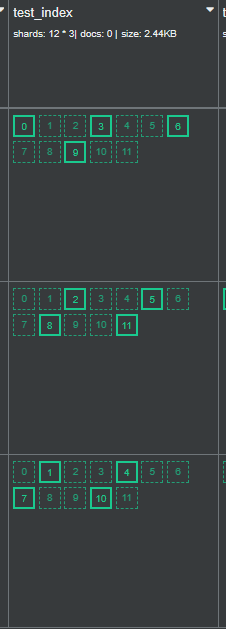

~~~bash
PUT /test_index/_settings
{
    # 分片分配到 my_node_1 节点
    "index.routing.allocation.require._name": "my_node_1",
    "index.number_of_replicas": 0,
    "index.blocks.write": true  
}
~~~

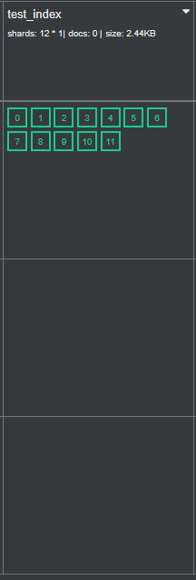


~~~bash
POST /test_index/_shrink/test_index_new
{
  "settings": {
    "index.number_of_replicas": 1,
    "index.number_of_shards": 3,
    "index.routing.allocation.require._name": null, # 系统随机分配分片
    "index.blocks.write": null # 不阻塞写操作
  }
}
~~~

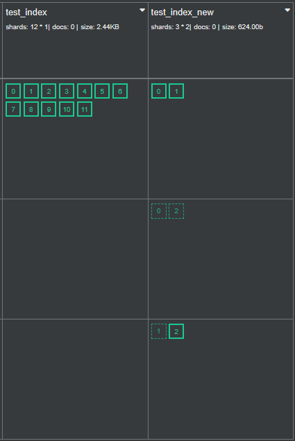

## Mapping

Mapping 定义了

1. 索引中的文档有哪些字段及其类型
2. 各个字段的相关设置


如果写入文档时索引不存在的话会自动创建索引，或者写入的字段不存在也会自动创建这个字段，官方把这种功能称为 **Dynamic Mapping**。

我们可以禁用这项功能：

~~~bash
PUT books/_mapping
{
    "dynamic": "false"
}
~~~

dynamic 属性的取值：

- **true**（默认值）：一旦有新的字段写入，Mapping 也同时被更新
- **false**：Mapping 不会被更新，新的字段不会被索引（查询、聚合），但是新增的字段数据会出现在 _source 里。可以通过 Reindex API 将这些字段迁移到到新索引中，从而这些新增字段可以被索引到
- **runtime**：...
- **strict**：如果写入不存在的字段，文档数据写入会失败


Mapping 支持的数据类型

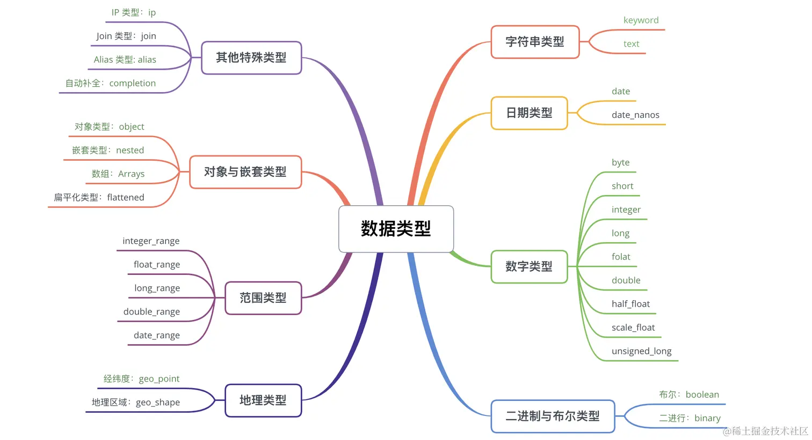

- 字符串类型只有 keyword 和 text

- 由于 JSON 没有日期类型，所以一般用字符串来表示：

  - 2015-01-01" 或者 "2015/01/01 12:10:30"
  - 时间戳，以毫秒或者秒为单位。

  实际上，在底层 ES 都会把日期类型转换为 UTC

- 数字类型分为 byte、short、integer、long、float、double、half_float、scaled_float、unsigned_long。

- 对象

  ~~~bash
  "mappings": {
      "properties": {
          "book_id" : {"type":"keyword" },
          "author": {
              "properties": {
                  "first_name": { "type": "keyword" },
                  "last_name": { "type": "keyword" }
               }
          }
      }
  }
  ~~~

  

  ~~~json
  PUT books_index/_doc/1
  {
    "book_id": "1234",
    "author": [
      { "first_name": "zhang", "last_name": "san" },
      { "first_name": "wang", "last_name": "wu" }
    ]
  }
  ~~~

  实际上，ES 在存储的时候会转化为以下格式存储：

  ~~~json
  {
    "book_id": "1234"
    "author.first": "zhang",
    "author.last": "san"
  }
  ~~~

- 数组，在索引查询时，会依次考察数组中的每个元素

  ~~~bash
  PUT books/_doc/3
  {
    "author": ["Neil Matthew","Richard Stones"],
  }
  ~~~

  


Mapping 参数可以用来控制某个字段的特性，例如这个字段是否被索引、用什么分词器、空值是否可以被搜索到等：

- `index`：当某个字段不需要被索引和查询的时候，可以使用 index 参数进行控制

  ~~~json
  PUT index_param_index
  {
    "mappings": {
      "properties": {
        "name": {
          "type": "text",
          "index": false # name 字段不进行索引操作
        },
      }
    }
  }
  ~~~

- `analyzer`：search_analyzer的优先级比 analyzer 的高：

  ~~~bash
  PUT analyzer_index
  {
    "mappings": {
      "properties": {
        "name": {
          "type": "text",
          "analyzer": "simple", 
          "search_analyzer": "standard" 
        }
      }
    }
  }
  ~~~

- `dynamic`：它可以作用在不同嵌套级别的对象上：

  ~~~bash
  PUT dynamic_index
  {
    "mappings": {
      "dynamic": "strict", # 1，文档级别，表示文档不能动态添加 top 级别的字段
      "properties": { 
        "author": { # 2，author 对象继承了文档级别的设置。    
          "properties": {
            "address": { 
              "dynamic": "true", # 3，表示 address 对象可以动态添加字段
              "properties":{}
            },
            "country": { "properties":{} }
          }
        }
      }
    }
  }
  ~~~

- `null`：该参数允许使用特定值代替空值，以便它可以索引和搜索

  ~~~bash
  PUT null_value_index
  {
    "mappings": {
      "properties": {
        "email": {
          "type": "keyword",
          "null_value": "NULL" # 使用 "NULL" 代替 null 值
        }
      }
    }
  }
  ~~~

- `copy_to` 参数，允许用户聚合多个字段到目标字段

  ~~~bash
  # 创建索引
  PUT users
  {
    "mappings": {
      "properties": {
        "first_name": {
          "type": "text",
          "copy_to": "full_name" 
        },
        "last_name": {
          "type": "text",
          "copy_to": "full_name" 
        },
        "full_name": { "type": "text" }
      }
    }
  }
  
  # 插入数据
  PUT users/_doc/1
  {
    "first_name": "zhang",
    "last_name": "san"
  }
  
  # 查询
  GET users/_search
  {
    "query": {
      "match": {
        "full_name": {
          "query": "zhang san",
          "operator": "and"
        }
      }
    }
  }
  
  # 结果
  {
    "hits" : {
      "hits" : [
        {
          "_source" : {
            "first_name" : "zhang",
            "last_name" : "san"
          }
        }
      ]
    }
  }
  ~~~

  需要注意的是，`copy_to` 创建的字段值并不会出现在 `_source` 字段中，因为 `_source` 字段只包含原始的 JSON 文档内容

- `doc_values`：除 `text` 类型外，其他类型 Doc values 默认是开启的，保存 Doc values 结构需要很大的空间开销，如果某个字段不需要排序、聚合、使用脚本访问，那么应该禁用此字段的 Doc values 来节省磁盘空间。

  

 

## 嵌套类型

在 ES 中，要描述一对多关系，可以通过 nested 、 join（Parent/Child） 这两种方式。


nested 类型允许数组中的对象整体可以被单独索引，而不是对象的属性被单独索引，下面我们来看一个例子来认识这一点：

~~~bash
# 创建 Mapping
PUT books_index
{
  "mappings": {
    "properties": { 
      "book_id": { "type": "keyword" },
      "author": { 
        "properties": {
          "first_name": { "type": "keyword" },
          "last_name": { "type": "keyword" }
        }
      }
    }
  }
}

# 写入书本数据
PUT books_index/_doc/1
{
  "book_id": "1234",
  "author": [
    { "first_name": "zhang", "last_name": "san" },
    { "first_name": "wang", "last_name": "wu" }
  ]
}

GET books_index/_search
{
  "query": {
    "bool": {
      "must": [
        { "term": { "author.first_name": "zhang" } },
        { "term": { "author.last_name": "wu" } }
      ]
    }
  }
}
~~~

数据中是没有 zhangwu 这个作者的，但是这个查询却可以命中文档。这是因为 object 经扁平化处理后，其丢失了 first_name 和 last_name 之间的关系：

~~~bash
{
    "book_id": "1234",
    "author.first_name": ["zhang", "wang"],
    "author.last_name": ["san", "wu"]
}
~~~

所以我们的查询语句在 author.first_name 中匹配了 "zhang"，在 author.last_name 匹配了 "wu"。此时我们可以 nested 类型来避免这个问题：

~~~bash
# 创建索引，author 类型为 nested
PUT books_index
{
      # ...
      "author": { 
        "type": "nested", # author 定义为 nested 类型的对象
        "properties": {
          "first_name": { "type": "keyword" },
          "last_name": { "type": "keyword" }
        }
      }
}
~~~

nested 数据类型的检索示例如下：

~~~bash
GET books_index/_search
{
  "query": {
    "nested": { # 使用 nested 关键字
      "path": "author", # path 关键字指定对象名字
      "query": {
        "bool": {
          "must": [
            { "term": { "author.first_name": "zhang" } },
            { "term": { "author.last_name": "san" } }
          ]
        }
      }
    }
  }
}
~~~


父文档和子文档是相互独立的，通过类似引用的关系进行绑定。需要注意的是，为了维护父子文档的关系需要占用额外的内存资源，并且读取性能相对较差。但由于父子文档是互相独立的，所以适合子文档更新频率高的场景。

~~~bash
PUT join_books_index
{
  "mappings": {
    "properties": { 
      "book_id": { "type": "keyword" },
      "name": { "type": "text" },
      "book_comments_relation": { # 定义字段名字
        "type": "join", # 此字段为 join 类型
        "relations": { # 声明 Parent / Child 的关系
          "book": "comment" # book 是 Parent 的名称，comment 是 Child 的名称
        }
      }
    }
  },
}
~~~


创建父文档：

~~~bash
PUT join_books_index/_doc/11
{
  "book_id": "1234",
  "name": "java book",
  "book_comments_relation": {
  	# 我们在Mapping中定义时，通过relations参数，指定了Parent/Child的名称
  	# 这里需要在 name 参数中，指定这个名称以确定是父文档还是子文档
    "name": "book"
  }
}
~~~

创建子文档：

~~~bash
PUT join_books_index/_doc/21?routing=11
{
  "comment": "a good book!!",
  "user_name": "fork",
  "book_comments_relation": {
    "name": "comment",
    # 这里的 11 是父文档的 ID
    "parent": "11"
  }
}
~~~

为了确保查询时的性能，父文档和子文档必须在同一个分片，所以需要强制使用 routing 参数，并且其值为父文档的 ID。


获取父文档的信息：

~~~bash
# 获取父文档
GET join_books_index/_doc/11

# 结果
{
  "_id" : "11",
  "_source" : {
    "book_id" : "1234",
    "name" : "java book",
    # 可以看到，父文档是不包含子文档的信息的
    "book_comments_relation" : {
      "name" : "book"
    }
  }
}
~~~

获取子文档信息：
~~~bash
GET join_books_index/_doc/21?routing=11
~~~


Parent Id API，获取与指定父文档关联的子文档

~~~bash
POST join_books_index/_search
{
  "query": {
    "parent_id": {
      # 说明子文档的名称
      "type": "comment",
      # 父文档ID
      "id": "11"
    }
  }
}
~~~

Has Child API，在子文档中进行条件匹配，然后返回匹配文档对应的父文档

~~~bash
# Has Child 查询
POST join_books_index/_search
{
  "query": {
    "has_child": {
      "type": "comment", # 在评论中查询
      "query": {
        "term": {
          "user_name": "fork"
        }
      }
    }
  }
}
~~~


 Has Parent API 在父文档中进行匹配，然后返回匹配文档对应的子文档

~~~bash
# Has Parent 查询
POST join_books_index/_search
{
  "query": {
    "has_parent": {
      "parent_type": "book",
      "query": {
        "term": {
          "name": "java"
        }
      }
    }
  }
}
~~~


## 索引

索引从本质来讲，就是一种为了加快检索数据的存储结构。

正排索引是 ID 到「数据对象」的一对一映射，而倒排索引是「数据对象某些特征」到 「数据对象」 的一对多映射。


倒排索引的组成主要有 3 个部分（如下图）：

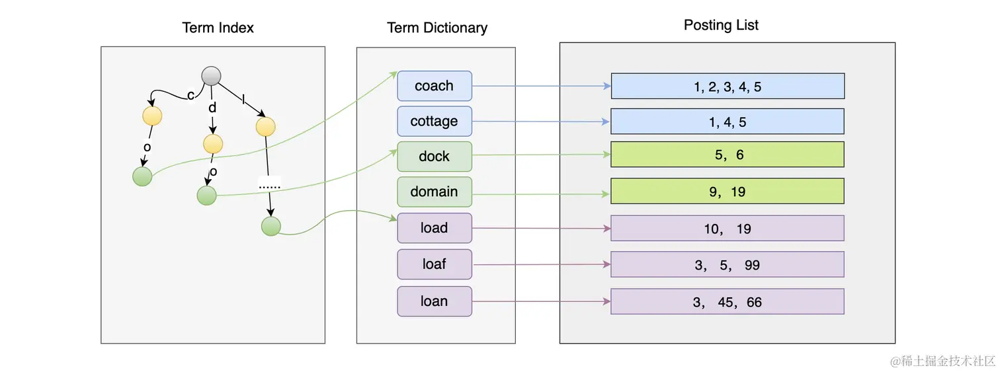

- **Term Index**： Term Dictionary 的索引
- **Term Dictionary**： 保存着词项
- **Posting List**：保存着每个词项所对应的文档 ID 列表


逻辑上，一个 Segment 上会有多个文档，一个文档有多个字段（Field）。这些字段的内容会被分词器形成多个 Term，然后以块的形式保存在 Term Dictionary 中，并且系统会对 Term Dictionary 的内容做索引形成 Term Index。在搜索的时候，通过 Term Index 找到 Block 后，进一步找到 Term 对应的 Posting List 中的文档 ID，然后计算出符合条件的文档 ID 列表进行返回。

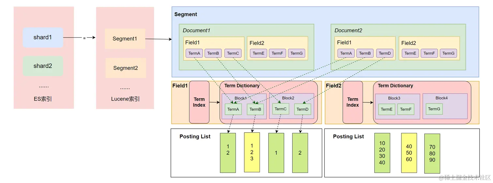

需要注意的是，Segment 中的每个字段（Field）都会有自己的 Term Index、Term Dictionary、Posting List 结构，也就是说在每个 Field 中这些结构都是独立的。

Term Index 使用各个 Term 的公共前缀做索引。

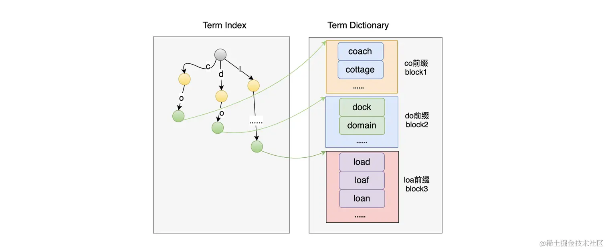

这样实现的索引只能找到公共前缀所在的块的地址，所以它既无法判断这个 Term 是否存在，也不知道这个 Term 保存在 Term Dictionary（.tim）文件的具体位置。因为 Block 中的数据是有序的，所以可以使用二分法来在 Block 中搜索 Term 是否存在。

**对于前缀索引的实现，业界使用了 FST 算法来解决**。FST（Finite State Transducers）是一种 FSM（Finite State Machines，有限状态机），并且有着类似于 Trie 树的结构。

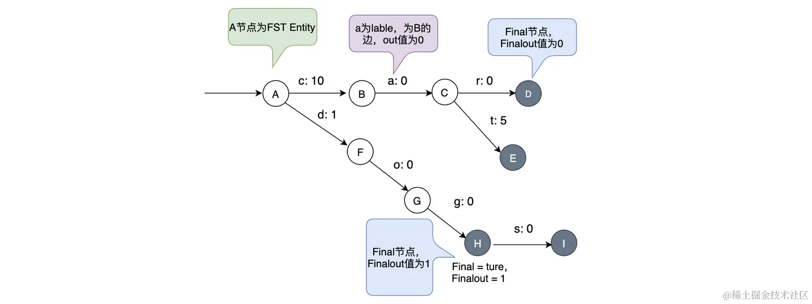

从图中可以看出，一条边有两个元素 label 和 out。图中灰黑色的为 Final 节点，它还有 Finalout，代表 Final 节点的值。当访问 cat 的时候，读取 c、a、t 的值作和， 再加上 Final 节点的 Finalout 值即可：10 + 0 + 5 + 0 = 15；

FST 可以简单理解为 Key-Value 数据结构。Term Index 使用 FST 做实现带来了两个基本功能：

1. 快速试错，如果在 FST 上不存在，不需要再遍历整个 Term Dictionary；
2. 快速定位到 Block 的位置，经过 FST 的输出，可以算出 Block 在文件中的位置。


在对 Term Dictionary 做索引的时候

1. 先将所有的 Term 进行排序
2. 然后将 Term Dictionary 中有共同前缀的 Term 抽取出来进行分块存储
3. 再对共同前缀做索引
4. 最后通过索引就可以找到公共前缀对应的块在 Term Dictionary 文件中的偏移地址。

由于每个块中都有共同前缀，所有不需要再保存每个Term的全部内容，只需要保存其后缀即可，而且这些后缀都是排好序的。


Lucene 把 Posting List 数据分成 3 个文件进行存储：

- .doc 文件，记录了：
  - 文档 ID 信息和 Term 的词频
  - 跳跃表的信息，用来加速文档 ID 的查询
  - Term 在 pos 和 pay 文件中的位置，有助于进行快速读取。
- .pay 文件，记录了 Payload 信息和 Term 在 doc 中的偏移信息；
- .pos文件，记录了 Term 在 doc 中的位置信息。


.doc 文件的数据结构：

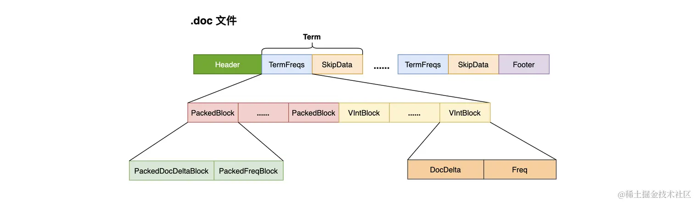

Lucene 在 Posting List 中使用了 2 种编码格式，来对整数类型的数据进行压缩：

- `PackedBlock`：在 Lucene 中，每当处理完 128 个包含某个 Term 的文档时，就会将这些文档的 ID 和词频使用 PackedInts 进行压缩存储，生成一个 PackedBlock。PackedBlock 中有两个数组，一个是存储文档 ID 的，一个是存储词频的。PackedInts 的压缩方式是将每个元素所占的位数与占用最多的保持一致。例如：

  ~~~bash
  # Int数组
  [8, 12, 100, 120]
  ~~~

  最大数 120 的有效位数为 7，所以数组中所有数据都可以使用 7 位来表示。

  

  在生成 PackedBlock 的时候，会生成跳表（SkipData），使得在读取数据时可以快速跳到指定的 PackedBlock。此外，在数组中存储文档 ID时，还使用差值存储的方式，来对数据做进一步的压缩处理。

- `VIntBlock`：Lucene 在 PackedBlock 基础上，把最后不足 128 篇文档的数据采用 VIntBlock 来存储。VIntBlock 采用 VInt 来对 Int 类型进行压缩，VInt 采用可变长的字节来表示一个整数，每个字节只使用第 1 到第 7 位来存储数据，第 8 位用来作为是否需要读取下一个字节的标记。


当我们同时检索多个词项时，会返回每个词项的文档 ID 列表。此时我们要交集求解，获取同时具有这多个词项的文档。

最简单的实现就是使用位图，但它有以下限制：


- 可能会消耗大量的空间
- 只适合于数据稠密的场景
- 只适合存储简单整型类型的数据，对于复杂的对象类型无法处理


业界中为了解决位图空间消耗大的问题，会使用一种压缩位图技术—— `Roaring Bitmap`。它会把一个 32 位的整数分成两个部分：高 16 位和低 16 位。然后将高 16 位作为一个数值存储到有序数组里。而低 16 位则存储到 2^16 的位图中：


确认一个数是否在 Roaring Bitmaps 中

1. 先以高 16 位在有序数组中进行二分查找，其复杂度为 O(log n)
2. 再拿低 16 位在对应的 Bitmaps 中查找，判断对应的位置是否为 1 即可，此时复杂度为 O(1)

当数据比较稀疏时（少于 4096 个），用 8K 大小 Bitmaps存储比较浪费，此时我们可以使用 short 类型的有序数组存储数据。


我们可以归并排序中合并思想，来合并 Roating Bitmap 中的有序数组部分：


我们来考虑这样一个情景：


此时 p1 要从 10 开始找直到多次才能找到 1000 这个大于或者等于 p2 的元素。我们可以使用跳表来优化这种情景。


此时，将p2（1000）作为 key，在链表A的跳表中快速做查找。

## 相关性评分

相关性是指搜索内容和结果的相关性，是用来描述文档与查询语句的匹配程度的。通过计算相关性，可以得出一个相关性评分，然后根据评分对结果集进行排序，返回最符合的数据给用户。

数据的相关性，可以由词项在文档中出现的频率高低来决定。但是在业界，很多著名的算法模型都是基于概率统计的，例如：TF-IDF、BM25。

TF-IDF 模型的核心思想：一个词的重要程度跟它在一篇文章中出现的频率成正比，跟它在语料库中出现的频率成反比。TF-IDF 模型的公式中，主要包含

- **TF** （Term Frequency On Per Document）表示一个词在一篇文档中出现的频率
  $$
  TF = \frac{词项在文档中出现的次数}{文档中词项总数}
  $$

- **DF**（Document Frequency）表示词项在语料库中出现的频率
  $$
  DF = \frac{包含词项的文档书}{文档总数}
  $$

- **IDF**（Inverse Document Frequency）表示逆文档频率
  $$
  IDF = log(\frac{文档总数}{包含词项w的文档数 + 1})
  $$
  如果词项的 IDF 越高，说明词项在语料库中越稀有

  

TF-IDF 算分公式：
$$
tf-idf(tremA) = TF(termA) * IDF(termA)
$$
tf-idf 本质上是对 TF 进行了加权计算，而这个权重就是 IDF

  

Lucene 的 TF-IDF 算分公式：

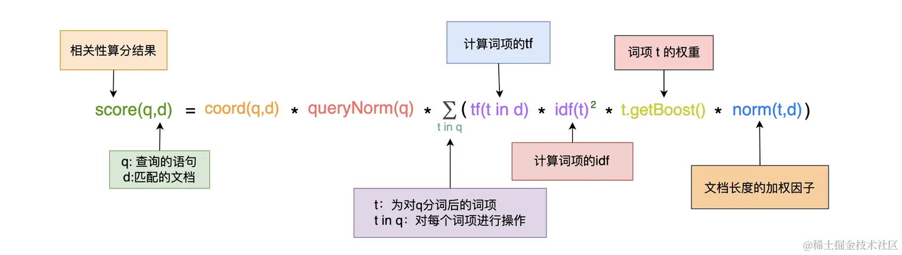


BM25 算分模型：

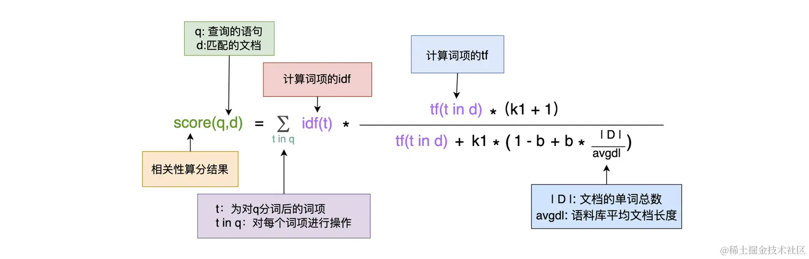

该模型中有两个自由参数：

- k1：当词频增大时，如果 k1 较高，那么接近饱和的速度会较慢。
- b：定义了文档长度对评分的影响。如果 b 设置的较高，长文档的分数会比短文档的分数降低较多


相对于 TF-IDF 来说，BM25 降低了 TF 对算分的影响力。当 TF 无限增加时，TF-IDF 模型的算分也会无限增加，而 BM25 则会趋于一个值 $k1 + 1$。

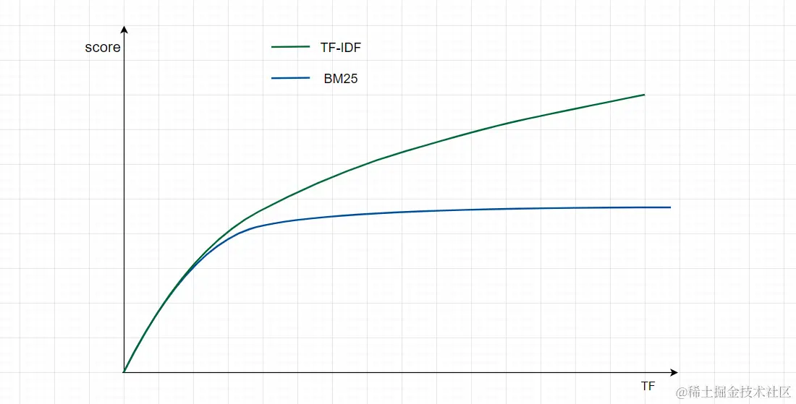


可以在创建Mapping的时候指定一个 similarity 的k1 和 b 值，并应用到每个字段中：

```bash
PUT test_similarity_index
{
  "settings": {
    "index": {
      "similarity": {
        "my_similarity": {
          "type": "BM25",
          "k1": 1.3,
          "b": 0.76
        }
      }
    }
  },
  "mappings": {
    "properties" : {
        "title" : { "type" : "text", "similarity" : "my_similarity" }
    }
  }
}
```

可以使用 explain API 来查看算分的过程：

~~~bash
POST your_index/_search
{
    "explain": true, # 开启 explain
    "query": .....
}
~~~


## 分词器


**分词**是将全文本转换为一系列单词的过程，这些单词称为 **term 或者 token**。分词是通过**分词器（Analyzer）** 来实现的，它主要由 3 部分组成：

- **Character Filter**：主要对原文本进行格式处理
- **Tokenizer**：按照指定的规则对文本进行切分
- **Token Filter**：对切分后的单词进行处理，如转换为小写、删除停用词、增加同义词、词干化等。


除了在数据写入的时候对数据进行分词，在对全文本进行查询时，也需要使用相同的分词器对检索内容进行分析

ES 为用户提供了多个内置的分词器，常见的有以下 8 种：

- **Standard Analyzer** **：** 这个是默认的分词器，使用 Unicode 文本分割算法，将文本按单词切分并且转为小写。
- **Simple Analyzer** **：** 按照非字母切分并且进行小写处理
- **Stop Analyzer** **：** 与 Simple Analyzer 类似，但增加了停用词过滤（如 a、an、and、are、as、at、be、but 等）。
- **Whitespace Analyzer** **：** 使用空格对文本进行切分，并不进行小写转换。
- **Patter** **n** **Analyzer** **：** 使用正则表达式切分，默认使用 \W+ (非字符分隔)。支持小写转换和停用词删除。
- **Keyword Analyzer** **：** 不进行分词。
- **Language Analyzer** **：** 提供了多种常见语言的分词器。如 Irish、Italian、Latvian 等。
- **Customer Analyzer**：自定义分词器。

中文内容索引常用的分词器：

1. ik
2. [拼音](https://link.juejin.cn/?target=https%3A%2F%2Fgithub.com%2Fmedcl%2Felasticsearch-analysis-pinyin)


_analyze API 的使用：

~~~bash
GET _analyze
{
  "analyzer": "standard",
  "text": "Your cluster could be accessible to anyone."
}

# 结果
{
  "tokens": [
    {
      "token": "your",
      "start_offset": 0,
      "end_offset": 4,
      "type": "<ALPHANUM>",
      "position": 0
    },
    {
      "token": "cluster",
      "start_offset": 5,
      "end_offset": 12,
      "type": "<ALPHANUM>",
      "position": 1
    }
    ......
  ]
}
~~~

~~~bash
GET _analyze 
{
  "tokenizer": "standard", # 指定一个tokenizer
  "filter":  [ "lowercase", "asciifolding" ], # 可以组合多个token filter
  "text": "java app"
}
~~~

