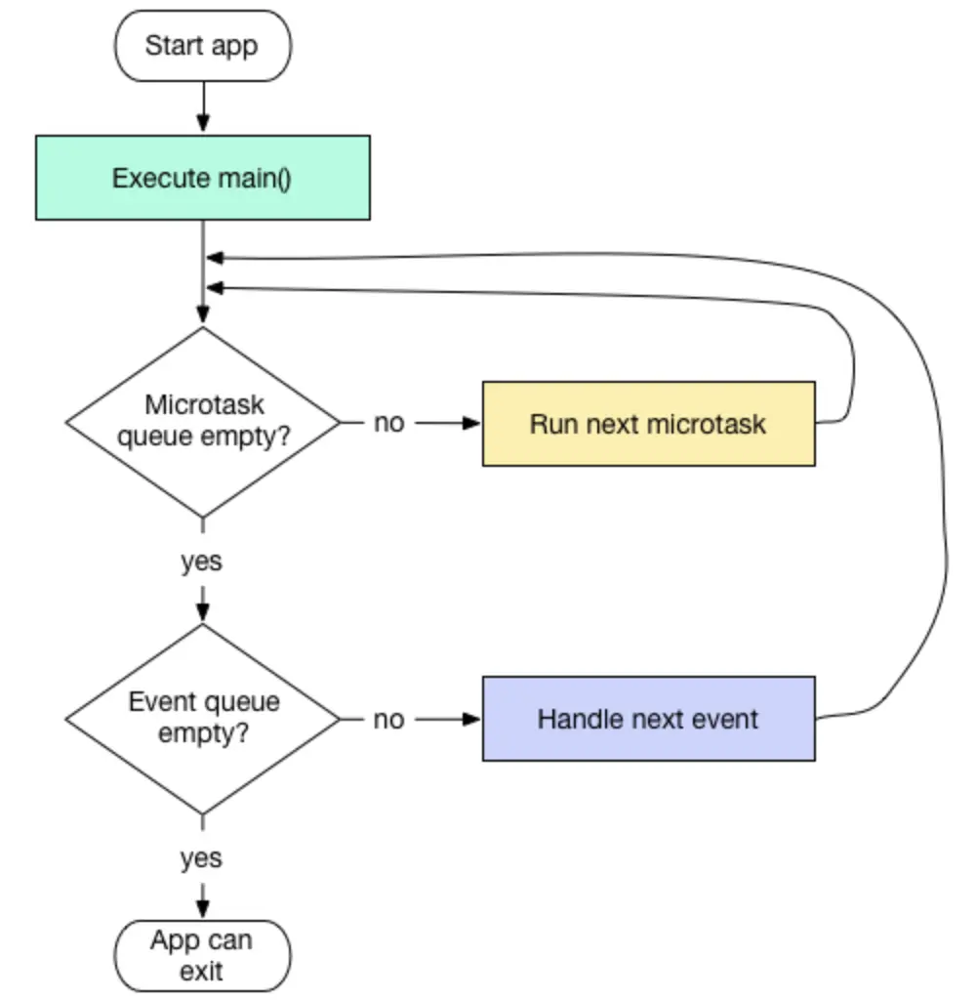

# Dart

## 事件循环

https://www.jianshu.com/p/b1a0945bff2d

Dart的事件循环中有两个队列

- **微任务队列（MicroTask queue）**
- **事件队列（Event queue）**

总之，每次事件循环中，一次性处理完微任务队列，但只处理一个在事件队列中的任务

`scheduleMicrotask`将任务提交到微任务队列中

~~~dart
scheduleMicrotask((){
    print('a microtask');
});
~~~

`Timer.run`将任务提交到事件队列中

~~~dart
Timer.run((){
   print('a event loop’);
});
~~~

`Future((){ });`、`Future.delayed`都是将任务提交到事件队列中
