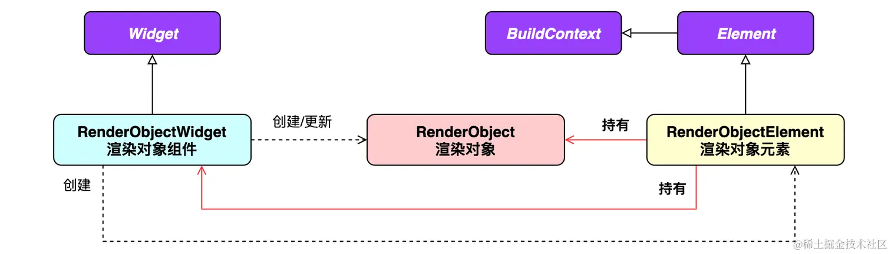

# 功能型组件

[TOC]

## 媒体查询

MediaQuery是一个帮助开发者获取设备信息的继承式组件（InheritedWidget）。例如是否为横屏状态、是否开启了夜间模式、是否在系统偏好里设置了较大的字号等。

|             查询             |        属性        |
| :--------------------------: | :----------------: |
|       屏幕的宽度和高度       |        size        |
|        是横屏还是竖屏        |    orientation     |
|       是否开启夜间模式       | platformBrightness |
| 设备的交互方式（触屏、手柄） |   navigationMode   |
|    是否调整了默认字体大小    |  textScaleFactor   |

## Builder

Builder与StatefulBuilder是为了解决获取局部context的问题。此外StatefulBuilder还可以实现局部刷新（控制刷新范围）。

下面我们通过一个例子来学习Builder组件：

~~~dart
void main() => runApp(CustomWidget());

class CustomWidget extends StatelessWidget {
    @Override
    Widget build(BuildContext context) {
        return MaterialApp(
          home: Scaffold(
            body: GestureDetector(
              onTap: () {
                Scaffold.of(context).showSnackBar(SnackBar(
                  content: Text(''),
                ));
              },
              child : child,
            )
          )
       );    
    }
}
~~~

运行后直接抛出了异常。这是因为context是CustomWidget的，而不是GestureDetector的。所以Scaffold.of无法通过context获取到Scaffold组件。为了解决这个问题，我们引入Builder组件，通过它可以获取局部context：

~~~diff
class CustomWidget extends StatelessWidget {
  @override
  Widget build(BuildContext context) {
    return MaterialApp(
        home: Scaffold(
+            body: Builder(
+                builder : (context) {
                  return GestureDetector(
                    onTap: () {
                      Scaffold.of(context).showSnackBar(SnackBar(
                        content: Text(''),
                      ));
                    },
                    child : null,
                  );
                }
            )
        )
    );
  }
}
~~~

StatefulBuilder的作用与Builder类似，但是它还可以局部刷新UI。在不考虑复用性的前提下，可以代替StatefulWidget：

~~~dart
body: Center(
    child: StatefulBuilder(
        builder: (BuildContext context, StateSetter setState) {
            return Text("clickTimes$clickTimes").gesture(onTap: () {
              setState(() {
                clickTimes++;
              });
            });
        },
    ),
),
~~~


## 悬浮

### Overlay

有时候，我们想要将`Overlay`相对定位于某个组件上，此时我们必须获取这个组件相对屏幕左上角的偏移量，以及组件的尺寸。这一点可以通过获取组件对应的渲染对象来实现：

- `renderObject.size`获取尺寸
- `renderObject.localToGlobal(Offset.zero)`来获取相对屏幕左上角的偏移量。


可以通过`Element`类中的`renderObject`方法直接获取渲染对象，但是`Flutter`框架在`Widget`层中通过`BuildContext`接口来暴露`Element`对象，其中`BuildContext` 定义了 `findRenderObject` 接口，`Element`对该接口的实现就是直接返回`renderObject`。





~~~dart
void printInfo(BuildContext context){
  RenderObject? renderObject = context.findRenderObject();
  if(renderObject!=null && renderObject is RenderBox){
    // 获取尺寸
    print(renderObject.size);
    // 获取相对屏幕左上角的偏移量
    print(renderObject.localToGlobal(Offset.zero));
  }
}
~~~


如何获取指定组件的`context`，而不是当前`StatelessWidget#build`的`context`参数呢？通过`Builder`组件

~~~dart
Widget build(BuildContext context) {
    return Builder(
      builder: (BuildContext ctx) => {
           RenderBox? renderObject = ctx.findRenderObject() as RenderBox;
           renderObject!.size
           renderObject!.localToGlobal(Offset.zero)
           return Widget(...) 
      	}
    )
}
~~~

一般没有必要直接使用 `Overlay` 组件，因为 `MaterialApp` 中已经集成了 `Overlay` 。我们只需要获取到 `OverlayState` ，然后插入 `OverlayEntry` 节点即可显示浮动组件。

~~~dart
final OverlayState? overlayState = Overlay.of(context);
final entry = OverlayEntry(
	builder : (context) => Container(...)
)
overlayState.insert(entry);
entry.remove()			// 移除该OverlayEntry
~~~

这里要注意：

- `OverlayEntry#builder` 下的约束是 紧约束 ，一般大小为整个屏幕大小
- `Positioned` 可以作为 `builder` 所返回的顶层组件（实现相对定位）
- `Overlay` 在单独的栈中维护。当显示文字时，需要在上层提供 `Material` 组件才能使用默认的`Material`字体样式


有时候插入overlayState时会报错`Unhandled Exception: setState() or markNeedsBuild() called during build.`此时我们只需这样插入即可：

~~~dart
WidgetsBinding.instance.addPostFrameCallback((_) {
	overlayState?.insert(entry);
    window.scheduleFrame(); 	// 强制刷新一帧
});
~~~


此外，`OverlayEntry`给子组件传递整个屏幕大小的强约束，对此我们可以使用Stack+Position来相对定位。

### CompositedTransform Target/Follower

`CompositedTransformFollower`组件追踪`CompositedTransformTarget`的位置。

使用时，必须设置`CompositedTransformTarget`组件的`link`属性，其类型为`LayerLink`。当追随者和目标使用同一个`LayerLink`时，追随者会被位移至目标处。这里需要注意的是，“目标”必须在“追随者”之前绘制，否则会导致运行时错误。


~~~dart
const CompositedTransformFollower({
    super.key,
    required this.link,
    this.showWhenUnlinked = true,
    this.offset = Offset.zero,
    this.targetAnchor = Alignment.topLeft,
    this.followerAnchor = Alignment.topLeft,
    super.child,
});
~~~

- `offset`：用于为追随者组件增加额外的位移
- `showWhenUnlinked`：决定是否应继续显示该追随者。默认值为true，即追随者仍然可见，但不会再有位移。若修改为false，则当目标不可见时，追随者也会随之被暂时隐藏，直到目标再次出现


## 弹窗

### Dialog

`AlertDialog`、`SimpleDialog`以及`Dialog`是`Material`组件库提供的三种对话框，旨在帮助开发者快速构建出符合Material设计规范的对话框。


~~~dart
const AlertDialog({
  Key? key,
  this.title, 					// 对话框标题组件
  this.titlePadding, 			// 标题填充
  this.titleTextStyle, 			// 标题文本样式
  this.content, 				// 对话框内容组件
  this.contentPadding = const EdgeInsets.fromLTRB(24.0, 20.0, 24.0, 24.0), //内容的填充
  this.contentTextStyle,		// 内容文本样式
  this.actions, 				// 对话框操作按钮组
  this.backgroundColor, 		// 对话框背景色
  this.elevation,				// 对话框的阴影
  this.semanticLabel, 			// 对话框语义化标签(用于读屏软件)
  this.shape,					// 对话框外形
})
~~~

实际上`AlertDialog`和`SimpleDialog`都使用了`Dialog`类。由于`AlertDialog`和`SimpleDialog`中使用了`IntrinsicWidth`来尝试通过子组件的实际尺寸来调整自身尺寸，这就导致他们的子组件不能是延迟加载模型的组件（如`ListView`、`GridView` 、 `CustomScrollView`等）。如下面的代码运行后会报错：

~~~dart
AlertDialog(
  content: ListView(
    children: ...//省略
  ),
);
~~~

如果我们就是需要嵌套一个`ListView`应该怎么做？这时，我们可以直接使用`Dialog`类，如：

~~~dart
Dialog(
  child: ListView(
    children: ...//省略
  ),
);
~~~


我们通过`Navigator.of(context).pop(…)`方法来关闭对话框的，而通过`showDialog()`以`Material`风格弹出对话框，声明如下：

~~~dart
Future<T?> showDialog<T>({
  required BuildContext context,
  required WidgetBuilder builder, // 对话框UI Widget的builder
  bool barrierDismissible = true, //点击对话框barrier(遮罩)时是否关闭它
})
~~~

该方法返回一个`Future`，它正是用于接收对话框的返回值：如果我们是通过点击对话框遮罩关闭的，则`Future`的值为`null`，否则为`Navigator.of(context).pop(result)`中的`result`参数

~~~dart
await showDialog<bool>(
	context : context,
    builder : (context) {
		return AlertDialog(...);
    }
)
~~~


`showModalBottomSheet`方法可以弹出一个Material风格的底部菜单列表模态对话框。

### 外部样式

实际上，`showDialog`方法正是`showGeneralDialog`的一个封装，它定制了`Material`风格对话框的遮罩颜色和动画。


外部样式包含对话框遮罩样式、打开动画等。

~~~dart
Future<T?> showGeneralDialog<T>({
  required BuildContext context,
  required RoutePageBuilder pageBuilder, 				//构建对话框内部UI				
  bool barrierDismissible = false, 						//点击遮罩是否关闭对话框				
  Color barrierColor = const Color(0x80000000), 		// 遮罩颜色		
  Duration transitionDuration = const Duration(milliseconds: 200), // 对话框打开/关闭的动画时长
  RouteTransitionsBuilder? transitionBuilder, 				// 对话框打开/关闭的动画
  ...
})
~~~

-  `pageBuilder`：类型为`Widget Function(BuildContext context, Animation<double> animation, Animation<double> secondaryAnimation)`。
- `transitionBuilder`：类型为`Widget Function(BuildContext context, Animation<double> animation, Animation<double> secondaryAnimation, Widget child)`


~~~dart
showGeneralDialog(
  context: context,
  pageBuilder: (BuildContext buildContext, 
                Animation<double> animation,
      			Animation<double> secondaryAnimation) {
    return Container();
  },
  barrierDismissible: barrierDismissible,
  barrierLabel: MaterialLocalizations.of(context).modalBarrierDismissLabel,
  barrierColor: Colors.black87,
  transitionDuration: const Duration(milliseconds: 150),
  transitionBuilder: (BuildContext context, Animation<double> animation,
      Animation<double> secondaryAnimation, Widget child) {
    // 使用缩放动画
    return ScaleTransition(
      scale: CurvedAnimation(
        parent: animation,
        curve: Curves.easeOut,
      ),
      child: child,
    );
  },
);
~~~


## Theme & Color

### Theme

通过定义 `Theme`，我们可以更好地复用颜色和字体样式，从而让整个 app 的设计看起来更一致。 `MaterialApp` 已经事先为你预设了一个全局的 `Theme Widget`。`Theme`组件就是一个`InheritedWidget`

可以通过`Theme`组件以及`ThemeData`，定义一套全新的主题样式。

~~~dart
ThemeData({
  Brightness? brightness, 			//深色还是浅色
  MaterialColor? primarySwatch, 	//主题颜色样本
  Color? primaryColor, 				//主色
  Color? cardColor, 				//卡片颜色
  Color? dividerColor, 				//分割线颜色
  ButtonThemeData buttonTheme, 		//按钮主题
  Color dialogBackgroundColor,		//对话框背景颜色
  String fontFamily,				//文字字体
  TextTheme textTheme,				//字体主题，包括标题、body等文字样式
  IconThemeData iconTheme, 			//Icon的默认样式
  TargetPlatform platform, 			//指定平台，应用特定平台控件风格
  ColorScheme? colorScheme,			
  ...
})
~~~

注意：**ThemeData中的颜色属性正逐渐Deprecated**，推荐使用`ColorScheme`来设置颜色。


下面给出一个例子：

~~~dart
Theme(
  data: ThemeData(
    splashColor: Colors.yellow,
  ),
  child: ...
);
~~~

相比从头开始定义一套样式，从父级 `Theme` 扩展并覆写可能更常规一些，使用 `copyWith()`方法即可。

~~~dart
Theme(
  data: Theme.of(context).copyWith(splashColor: Colors.yellow),
  child: ...
);
~~~

`Theme.of(context)` 会查询 widget 树，并返回其中最近的 `Theme`组件


### Color

> https://rydmike.com/flexcolorscheme/themesplayground-v7-1/#/ 配色网站

> https://m2.material.io/design/color/the-color-system.html#color-usage-and-palettes Materail Color

`MaterialColor`是实现`Material Design`中的颜色的类，它包含一种颜色的10个级别的渐变色。`MaterialColor`通过"[]"运算符的索引值来代表颜色的深度，有效的索引有：`50`，`100`，`200`，…，`900`。`MaterialColor`的默认值为索引等于`500`的颜色

~~~dart
Colors.blue.shade50
Colors.blue[50]
~~~


可以通过`ColorScheme`来快速创建应用程序的颜色主题。

~~~dart
final ColorScheme myColorScheme = ColorScheme(
  primary: Colors.blue,
  secondary: Colors.yellow,
  background: Colors.white,
  surface: Colors.grey[100],
  error: Colors.red[800],
  onPrimary: Colors.white,
  onSecondary: Colors.black,
  onBackground: Colors.black,
  onSurface: Colors.black,
);
~~~


它还包括 从单一种⼦颜⾊⽣成整个配⾊⽅案 的能力。你可以使用任意颜色来创建新的 `ColorScheme` 类型：

```dart
final lightScheme = ColorScheme.fromSeed(seedColor: Colors.green);
final darkScheme = ColorScheme.fromSeed(seedColor: Colors.green, brightness: Brightness.dark);
```

`ThemeData` 的构造函数还有一个新的 `colorSchemeSeed` 参数，可以直接从颜色⽣成主题的配⾊⽅案：

~~~dart
final lightTheme = ThemeData(colorSchemeSeed: Colors.orange, ...); 
final darkTheme = ThemeData(colorSchemeSeed: Colors.orange, brightness: Brightness.dark, ...); 
~~~


使用示例：

~~~kotlin
Theme.of(context).colorScheme.background
~~~


## 拖放

### Draggable

Draggable组件可为任意组件增添拖动支持，再配合DragTarget（拖放目标）组件，轻松实现拖放功能。

~~~dart
  const Draggable({
    super.key,
    required this.child,
    required this.feedback,
    this.data,
    this.axis,
    this.childWhenDragging,
    this.dragAnchorStrategy = childDragAnchorStrategy,
    this.affinity,
    this.maxSimultaneousDrags,
    this.onDragStarted,
    this.onDragUpdate,
    this.onDraggableCanceled,
    this.onDragEnd,
    this.onDragCompleted,
  })
~~~

- `feedback`：当子组件被拖动时，触点下的反馈组件。

- `childWhenDragging`：在正在被拖动的过程中，代替子组件而留在原地的组件。

- `maxSimultaneousDrags`：限制某组件可被同时拖动的次数。例如在多点触控情况下，用户可先用食指拖动一个Draggable组件，并在保持食指不松开的情况下，再使用其他手指拖动同一个组件

  

- `dragAnchorStrategy`： A strategy that is used by this draggable to get the anchor offset when it is dragged。

  - childDragAnchorStrategy，则在拖动开始的瞬间，feedback会立即将其左上角与用户手指或鼠标光标的位置对齐。可使用Transform组件将中心与光标对齐

- `axis`：限制拖动的方向

- `data`：和DragTarget配合使用的。

- `onDragStarted`：开始拖动时回调

- `onDragEnd`：拖动结束时回调

- `onDragUpdate`：拖动时回调

- `onDraggableCanceled`：当拖动结束后，若组件落在DragTarget外，或者落在DragTarget内但被拒绝了，那么执行该函数。

- `onDragCompleted`：当拖动结束后，若组件落在DragTarget内，而且被接收了，那么就执行该函数。

其中落在的含义是指，拖动组件的指针在`DragTarget`内。


LongPressDraggable（长按拖放）组件，顾名思义，是普通的Draggable组件的“长按”版本。使用该组件可使被拖动的组件只有在用户长按后才进入拖动状态。


实际上，`Draggable`组件就是在用户开始拖放操作时，在`Overlay`中插入了一个`OverlayEntry`，内容为`Positioned`组件和`Draggable`的`feedback`属性所指定的“反馈”组件。在用户拖动的过程中，`Draggable`通过连续调用`markNeedsBuild()`方法不断更新这个`OverlayEntry`中的`Positioned`组件的`top`和`left`属性，以实现`feedback`组件自动跟随光标移动的效果。当拖放操作结束时，`Draggable`会将该`OverlayEntry`撤除。

### DragTarget

`DragTarget`是一个可用于接收`Draggable`的组件，当Draggable落在DragTarget中（触点在DragTarget内），那么就执行以下逻辑

- onWillAccept：当用户拖动进来到DragTarget时
  - 若类型匹配，立即调用`onWillAccept`，根据数据做业务逻辑判断，返回一个布尔值。
  - 如果DragTarget的类型与Draggable中的data属性的类型不匹配，那么直接拒接掉，并且不调用任何回调函数（onMove、onWillAccept、builder等等）
- 无论`onWillAccept`所返回的布尔值为什么，都会调用onMove以及onLeave，其中
  - onMove，用户仍在进行拖动时，并且拖动在DragTarget范围内，那么就会调用
  - onLeave，用户仍在进行拖动时，但从DragTarget中离开
- onAccept：当用户松手后触点在DragTarget中，并且onWillAccept返回true，那么就调用该函数
- builder，当用户拖动进来以及拖动离开后，调用该函数。参数为列表的原因是，用户可能同时拖动多个控件。


## 导航


`Navigator`是一个路由管理的组件。它在内部维护一个栈以及使用Overlay组件，来管理各个页面组件。它提供了打开和退出路由页方法：

~~~dart
Future push(BuildContext context, Route route)
bool pop(BuildContext context, [ result ])
~~~

使用示例：

~~~dart
Navigator.push(BuildContext context, Route route)

Navigator.of(context).push(Route route)
~~~


如果想要给旧的路由页面返回一个值，那么在调用pop()方法时设置result参数即可。

~~~dart
Navigator.pop(context, result);	//向旧的页面返回result
~~~

如果想要给新的路由页面传递一个值。那么必须将这个页面封装成一个Widget，并且在其构造函数中声明这个要传入的值。

~~~dart
val result =  await Navigator.push(
	MaterialRoutePage(builder: (context) => NewPage(value));
)
~~~


### 命名路由

我们必须先定义一个**路由表（routing table）**：

~~~dart
Map<String, WidgetBuilder> routes;
~~~

然后在MaterialApp组件中的routes属性里注册：

~~~dart
MaterialApp(
  title: 'Flutter Demo',
  theme: ThemeData(
    primarySwatch: Colors.blue,
  ),
  //注册路由表
  routes:{
   "new_page":(context) => NewRoute(),
    ... // 省略其他路由注册信息
  } ,
  home: MyHomePage(title: 'Flutter Demo Home Page'),
);
~~~

如果我们也想将`home`注册为命名路由应该怎么做呢？使用initialRoute属性

~~~dart
MaterialApp(
  title: 'Flutter Demo',
  initialRoute:"/", //名为"/"的路由作为应用的home(首页)
  theme: ThemeData(
    primarySwatch: Colors.blue,
  ),
  //注册路由表
  routes:{
   "new_page":(context) => NewRoute(),
   "/":(context) => MyHomePage(title: 'Flutter Demo Home Page'), //注册首页路由
  } 
);
~~~

使用`Navigator` 的`pushNamed`方法来指定名称来打开路由：

~~~dart
Future pushNamed(BuildContext context, String routeName,{Object arguments})
~~~

我们也可以传递参数：

~~~dart
Navigator.of(context).pushNamed("new_page", arguments: "hi");
~~~

~~~dart
@override
Widget build(BuildContext context) {
    //获取路由参数  
    var args = ModalRoute.of(context).settings.arguments;
    //...省略无关代码
}
~~~

如果某个名称尚未在路由表中注册，那么就会调用`onGenerateRoute`：

~~~dart
Route<dynamic> Function(RouteSettings settings)
~~~

使用示例：

```dart
onGenerateRoute:(RouteSettings settings){
	  return MaterialPageRoute(builder: (context){
		   String routeName = settings.name;
       // 如果访问的路由页需要登录，但当前未登录，则直接返回登录页路由，
       // 引导用户登录；其他情况则正常打开路由。
     }
   );
}
```

此外还有`onUnknownRoute`回调属性（类型和`onGenerateRoute`一样），在打开一个不存在的命名路由时（此时，未注册`onGenerateRoute`回调函数，或者`onGenerateRoute`返回`null`）会被调用。

### 路由动画

`MaterialPageRoute`继承自`PageRoute`类。而`PageRoute`类是一个抽象类，继承自`Route`，表示占有整个屏幕空间的一个模态路由页面，它还定义了路由构建及切换时过渡动画的相关接口及属性。

而`MaterialPageRoute`定义了`Material`风格的过渡动画、遮罩等

```dart
  MaterialPageRoute({
    WidgetBuilder builder,
    RouteSettings settings,
    bool maintainState = true,
    bool fullscreenDialog = false,
  })
```

- `maintainState`：默认情况下，当入栈一个新路由时，原来的路由仍然会被保存在内存中，如果想在路由没用的时候释放其所占用的所有资源，可以设置`maintainState`为 `false`。
- `builder` 是一个`WidgetBuilder`类型的回调函数，它的作用是构建路由页面的具体内容，返回值是一个`widget`。


通过`PageRouteBuilder`来自定义路由切换动画。新的路由页面正向执行动画，而旧的路由页面反向执行动画。

```dart
Navigator.of(context).push(
  PageRouteBuilder(
    transitionDuration: Duration(milliseconds: 500), //动画时间为500毫秒
    pageBuilder: (BuildContext context, Animation animation,
        Animation secondaryAnimation) {
      	// 这里直接返回Widget即可
      );
    },
      
    // 出于关注点分离的目的，推荐在buildTransitions中来完成路由动画，而pageBuilder完成Widget的构建。
    transitionsBuilder: (context, animation, secondaryAnimation, child) {
        // 这里的child正是pageBuild所返回的Widget
    }
  ),
);
```

- `animation`: The animation for this route's transition. When entering, the animation runs forward from 0.0 to 1.0. When exiting, this animation runs backwards from 1.0 to 0.0.
- `secondaryAnimation`: The animation for the route being pushed on top of this route. This animation lets this route coordinate with the entrance and exit transition of routes pushed on top of this route.


而`PageRouteBuilder`其实只是`PageRoute`的一个封装。我们可以直接继承`PageRoute`类来实现自定义路由，但这样有点麻烦，不太推荐。

~~~dart
class FadeRoute extends PageRoute {
  FadeRoute({
    required this.builder,
    super.transitionDuration = const Duration(milliseconds: 300),
    super.opaque = true,
    super.barrierDismissible = false,
    super.barrierColor,
    super.barrierLabel,
    super.maintainState = true,
  });

  final WidgetBuilder builder;
	
    
  // Override this method to build the primary content of this route.
  
  @override
  Widget buildPage(BuildContext context, Animation<double> animation,
      Animation<double> secondaryAnimation) => builder(context);

  // Override this method to wrap the child with one or more transition widgets that define how the route arrives on and leaves the screen.
  @override
  Widget buildTransitions(BuildContext context, Animation<double> animation,
      Animation<double> secondaryAnimation, Widget child) {
     return FadeTransition( 
       opacity: animation,
       child: builder(context),
     );
  }
}


Navigator.push(context, FadeRoute(builder: (context) {
  return PageB();
}));
~~~

### WillPopScope

Flutter中可以通过`WillPopScope`来实现导航返回拦截

```dart
const WillPopScope({
  ...
  required WillPopCallback onWillPop,
  required Widget child
})
```

- onWillPop：当用户按下Android物理返回按钮，或者导航返回（Navigator.pop）时会调用该函数。该回调需要返回一个`Future`对象，如果返回的`Future`最终值为`false`时，则当前路由不出栈(不会返回)；最终值为`true`时，当前路由出栈退出。

### 局部路由

之前介绍的路由页面都是整个屏幕，如何我们想要在某一个组件中进行路由跳转怎么办？提供一个**Navigator**组件即可

~~~dart
class PageA extends StatelessWidget {
  const PageA({Key? key}) : super(key: key);
 
  @override
  Widget build(BuildContext context) {
    return Center(
      child: Container(
        height: 350,
        width: 300,
        child: Navigator(
          initialRoute: '/',
          onGenerateRoute: (RouteSettings settins) {
            WidgetBuilder builder;
            switch (settins.name) {
              case '/':
                builder = (context) => PageC();
                break;
              default:
                builder = (context) => PageD();
                break;
 
            }
            return MaterialPageRoute(builder: builder);
          },
        ),
      ),
    );
  }
}
~~~


## 异步

在`Dart`中，实际上有两种队列：

1. 事件队列(`event queue`)，包含所有的外来事件：`I/O`、`mouse events`、`drawing events`、`timers`、`isolate`之间的信息传递。
2. 微任务队列(`microtask queue`)，表示一个短时间内就会完成的异步任务。


向microtask队列中添加任务：

~~~dart
scheduleMicrotask(() => print('microtask1'));
Future.microtask(() => print('microtask2'));
~~~

向event队列中添加任务

~~~dart
Future(() => print('event task'));
~~~


正常情况下，一个 `Future` 异步任务的执行是相对简单的：

1. 声明一个 `Future` 时，`Dart` 会将异步任务的函数执行体放入`event queue`，然后立即返回，后续的代码继续同步执行。
2. 当同步执行的代码执行完毕后，`event queue`会按照加入`event queue`的顺序（即声明顺序），依次取出事件。


### Future

Dart语言选择使用Future类型并配合async、await关键字实现异步支持。Future有三种状态：uncompleted（未完成）、completed with data、completed with error

~~~dart
Future<String> mockGetName = Future.delayed(
    Duration(seconds:2),
    () => "Alice"
)
~~~


由于Future是单线程模型，因此并没有取消Future的函数。好在官方提供了timeout函数：

~~~dart
void testFuture() async {
    new Future.delayed(new Duration(seconds: 2), () {
      return 1;
    }).timeout(new Duration(seconds:1)).then(print).catchError(print);
}
testFuture();
  
print("在testFuture()执行之后打印。");
~~~


### FutureBuilder

FutureBuilder是一个可以自动追踪Future的状态并在其状态改变时自动重绘的组件。

~~~dart
FutureBuilder({
  this.future,
  this.initialData,
  required this.builder,
})
~~~

- `future`：`FutureBuilder`依赖的`Future`，通常是一个异步耗时任务。

- `initialData`：在Future尚未完成之前，initialData属性可提供一个数据的“初始值”供FutureBuilder组件暂时使用。可以通过builder回调函数中的snapshot.data来访问。

  在有初始值的情况下，Future完成前的AsyncSnapshot的hasData会返回值true，此时AsyncSnapshot中的ConnectionState也依然会（正确地）是waiting等候状态，而不是done完成状态。

  Future以异常完成，那么AsyncSnapshot的data属性也会将先前的initialData清空为null，只有error属性保存错误信息。

- `builder`：Widget构建器；该构建器会在`Future`执行的不同阶段被多次调用

  ~~~dart
  Function (BuildContext context, AsyncSnapshot snapshot) 
  ~~~

  `snapshot`会包含当前异步任务的状态信息及结果信息

  - ConnectionState属性描述了Future的状态
    - none：none状态表示没有追踪Future，在future属性为null时出现
    - waiting：等待中。
    - active：在Stream中出现，在Future中不使用该属性
    - done：已经完成，可以获取数据或者异常
  - data属性：Future的数据。
  - error属性：Future的异常
  - hasData布尔属性
  - hasError布尔属性

### Stream

`Stream`不同于`Future`，它可以在生命周期内释放出任意数量的数据值（正常）或错误信息（异常）。通过`StreamController().stream`获取`Stream`，该流只允许一个监听者，但是可以缓存数据。`StreamController.broadcast().stream`创建一个广播数据流，它允许多个监听者，但是并不缓存数据。

~~~dart
Stream<State> stream = StreamController.broadcast().stream;

StreamBuilder({stream : stream, builder : ...});
stream.add('11');		//发送消息
~~~


### StreamBuilder

`StreamBuilder`对`Stream`对象进行了封装，可以自动跟踪`Stream`（数据流或事件流）的状态，并在`Stream`有变化时自行重构组件。

```dart
StreamBuilder({
  this.initialData,
  Stream<T> stream,
  required this.builder,
}) 
```

- builder：与FutureBuilder中的builder属性类似。但是ConnectionState属性的含义有些不同
  - active则表示Stream当前活跃，可随时释放若干个数据或异常
  - done，表示Stream已经关闭，不再释放任何数据或异常。


### Timer

定时器在Flutter框架中的使用：

~~~dart
class _ImageSliderState extends State<ImageSlider>{
    late Timer timer;
    @override
    void initState() {
        timer = Timer(...)
    }
    
    @override
    void dispose() {
        timer.cancel();
	}
}
~~~


定时执行任务

~~~dart
timer = Timer.periodic(Duration(milliseconds: 5000), (timer) {
      
});
~~~


