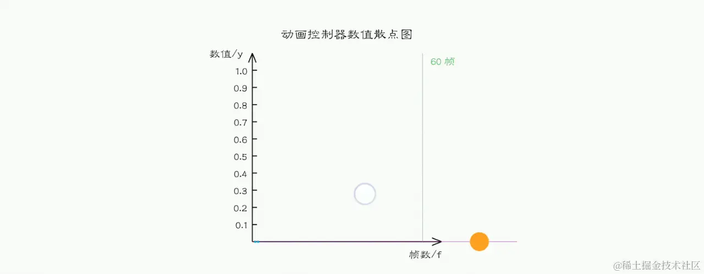

# 动画

[TOC]


一个动画`Animation<T>`需要：

- 控制器：`AnimationController`继承自`Animation<double>`。
- 插值区间：`Tween`继承自`Animatable<T>`
- 插值方式：`CurvedAnimation`继承自`Animation<double>`

`Animation`是一个抽象类，它本身和UI渲染没有任何关系，而它主要的功能是保存动画的插值和状态。**当控件的动画执行完毕后，控件会保持住最后一帧所处的状态。**

在动画的每一帧中，我们可以通过`Animation`对象的`value`属性获取动画的当前状态值。


这里给出两个关键数据：`60 fps - 16.6 ms`、`120fps - 8.33ms`


## AnimationController

`AnimationController`用于控制动画，它包含动画的启动`forward()`、停止`stop()` 、反向播放 `reverse()`、重置`reset()`、重复`repeat()`以及事件监听等方法。


基本框架

~~~dart
class CustomWidget extends StatefulWidget with SingleTrickerProviderStateMixin {		 // 需要混入SingleTickerProviderStateMixin
    late AnimationController _controller;
    
    @override
    void initState() {
        _controller = AnimationController(
            //动画持续时间
        	duration : Duration(seconds : 1),	
            
            // 动画反向持续时间
            reverseDuration: Duration(seconds : 1),
            
            //插值的初始值，默认为0.0
            lowerBound : 3.0,		
            
            //插值的最终值，默认为1.0
            upperBound : 5.0,					   
            vsync : this						  
        );
        
        //进行事件监听
        _controller.addListener((){})
            
        //开始执行动画
        _controller.forward();					
        super.initState();
    }
    
    
    
    @override
    void dispose(){
        //回收资源
        // 若多个动画对象共用一个控制器，那么只销毁这个控制器即可。
        _controller.dispose();		
        super.initState();	
    }

    
    
    @override
  	Widget build(BuildContext context) {
        return RotationTransition(
        	turns : _controller,		//Flutter自带的显式动画控件，通过参数turns传入一个Animation<T>
            child : ...
        )
    }
}
~~~


我们也可以监听动画每一帧以及动画状态的变化，`AnimationController`有如下两个方法：

1. `addListener()`；在每一帧都会被调用。
2. `addStatusListener()`；动画开始、结束、正向或反向状态发送变化时，会调用回调函数。

`Flutter`中，有四种动画状态，在`AnimationStatus`枚举类中定义，下面我们逐个说明：

| 枚举值      | 含义             |
| ----------- | ---------------- |
| `dismissed` | 动画在起始点停止 |
| `forward`   | 动画正在正向执行 |
| `reverse`   | 动画正在反向执行 |
| `completed` | 动画在终点停止   |

```dart
ontroller = AnimationController(
  duration: const Duration(seconds: 1), 
  vsync: this,
);

//图片宽高从0变到300
animation = Tween(begin: 0.0, end: 300.0).animate(controller);
animation.addStatusListener((status) {
  if (status == AnimationStatus.completed) {
    //动画执行结束时反向执行动画
    controller.reverse();
  } else if (status == AnimationStatus.dismissed) {
    //动画恢复到初始状态时执行动画（正向）
    controller.forward();
  }
});

//启动动画（正向）
controller.forward();
```


默认情况下，`AnimationController`在动画执行时间内，线性生成从 0.0 到1.0的数值。可以通过`lowerBound`和`upperBound`来指定`AnimationController`生成数值的区间，例如：

```dart
final AnimationController controller = AnimationController( 
    duration: const Duration(milliseconds: 2000), 
    lowerBound: 10.0,
    upperBound: 20.0,
    vsync: this
);
```

当创建一个`AnimationController`时，需要一个`vsync`参数，它接收一个`TickerProvider`类型的对象。通常我们会将`SingleTickerProviderStateMixin`混型到`State`的定义中，然后将本对象`this`作为`vsync`的值。注意，如果有多个独立的动画控制器，那么用`TickerProviderStateMixin`代替`SingleTrickerProviderStateMixin`。

> Flutter 应用在启动时都会绑定一个`SchedulerBinding`，通过`SchedulerBinding`可以给每一次屏幕刷新添加回调。而Ticker注册到SchedulerBinding中，这样每次屏幕刷新时都会调用Ticker中的TickerCallback回调方法。使用`Ticker`(而不是`Timer`)来驱动动画会防止屏幕外动画（动画的UI不在当前屏幕时，如锁屏时）消耗不必要的资源。


此外，还有一个好用的方法`animateTo()`。it drives the animation from its current value to target. During the animation, [status] is reported as [AnimationStatus.forward]

## Curve

动画过程可以是匀速的、匀加速的或者先加速后减速等。Flutter中通过`Curve`（曲线）来实现这一点。

通过`CurvedAnimation`将曲线与动画控制器关联起来。

```dart
final CurvedAnimation curve = CurvedAnimation(parent: controller, curve: Curves.easeIn);
```


Curves 类是一个预置的枚举类，定义了许多常用的曲线，下面列几种常用的：

| Curves曲线     | 动画过程                                                     |
| -------------- | ------------------------------------------------------------ |
| linear         | 匀速的                                                       |
| decelerate     | 匀减速                                                       |
| ease           | 开始加速，后面减速                                           |
| easeIn         | 开始慢，后面快                                               |
| easeOut        | 开始快，后面慢                                               |
| easeInOut      | 开始慢，然后加速，最后再减速                                 |
| Interval(a, b) | 假设动画的持续时间为x秒，那么Interval(0.3, 0.4)就在时间$[0.3 * x, 0.4 * x]$内执行完全部动画 |

当然我们也可以创建自己Curve，例如我们定义一个正弦曲线：

```dart
class ShakeCurve extends Curve {
  @override
  double transform(double t) {
    return math.sin(t * math.PI * 2);
  }
}
```


## Tween

`Tween`将`AnimationController`的`value`映射到你所需的数值以及类型。

```dart
// 生成区间[-200.0，0.0]
final Tween doubleTween = Tween<double>(begin: -200.0, end: 0.0);

// 生成颜色区间[trasparent, black54]
final Tween colorTween = ColorTween(begin: Colors.transparent, end: Colors.black54);
```


通过`Tween`的`animate`方法或者`AnimationController`的`drive`方法，将动画控制器的插值区间映射到新的插值区间，并返回一个新的动画对象（共用用一个控制器）

```dart
final AnimationController controller = AnimationController(
  duration: const Duration(milliseconds: 500), 
  vsync: this,
);

//这样控制器就绑定到了该CurveAnimation上了
final Animation curve = CurvedAnimation(parent: controller, curve: Curves.easeOut);

// 方式一
Animation<int> alpha = IntTween(begin: 0, end: 255).animate(curve);		
//Animation默认值为[0, 1], 这里使用IntTween将其映射到[0, 255]，并且应用了CurvedAnimation指定的Curves.easeOut插值方式

// 方式二
Animation<int> alpha = curve.drive(IntTween(begin: 0, end: 255));
```


~~~dart
Tween(begin: Offset(0, 0), end : Offset(0, 0.1))
      .chain(CurveTween(curve: Curves.elasticInOut))		
    // 注意是CurveTween, 而不是CurveAnimation
      .animate(_controller),
~~~

这段代码做了两件事

- 将动画`_controller`的区间映射到新的区间`[begin, end]`
- 通过`chain`方法，用曲线的方式来插值


此外，`Tween#evaluate(Animation)`可以将动画当前的值等比例地映射到`Tween`的值。例如，如果动画区间是`[0, 1]` ，当前动画值为 0.4 ，而Tween的区间为`[0, 10]`，那么该方法就返回 4 


如何自定义Tween呢？

~~~dart
class ColorDouble {
	final Color? color;
    final double value;
    
    ColorDouble({this.color = Colors.blue, this.value = 0})
}

class ColorDoubleTween extends Tween<ColorDouble> {
  ColorDoubleTween({required ColorDouble begin,required ColorDouble end})
      : super(begin: begin, end: end);
  // 覆写lerp方法即可
  @override
  ColorDouble lerp(double t) => ColorDouble(
      color: Color.lerp(begin?.color, end?.color, t),
      value: (begin!.value + (end!.value - begin!.value) * t)
  );
}
~~~


此外，我们还可以定义`TweenSequence`。例如，我们要将动画分为三个序列：

- `0%~40%` 期间，值从 `0 ~ 0.5` ，通过曲线 `Curves.ease` 运动。
- `40%~60%` 期间，值保持 `0.5` 不变。
- `60%~100%` 期间，值从 `0.5 ~ 1.0` ，通过曲线 `Curves.decelerate` 运动。



~~~dart
sequenceAnimation = TweenSequence<double>([
    TweenSequenceItem<double>(
    	tween: Tween<double>(begin: 0,end: 0.5).chain(CurveTween(curve: Curves.ease)),
    	weight: 40.0),
    
    TweenSequenceItem<double>(
    	tween: ConstantTween<double>(0.5),
    	weight: 20.0),
    
    TweenSequenceItem<double>(
        tween: Tween<double>(begin: 0.5,end: 1.0).chain(CurveTween(curve: Curves.decelerate)),
        weight: 40.0),
]).animate(_animationController);
~~~


## 隐式动画

Flutter SDK中也预置了很多动画过渡组件，实现方式和大都和`AnimatedDecoratedBox`差不多，如表9-1所示：

| 组件名                     | 功能                                                         |
| -------------------------- | ------------------------------------------------------------ |
| `AnimatedPadding`          | 在`padding`发生变化时会执行过渡动画到新状态                  |
| `AnimatedPositioned`       | 配合`Stack`一起使用，当定位状态发生变化时会执行过渡动画到新的状态。 |
| `AnimatedOpacity`          | 在透明度`opacity`发生变化时执行过渡动画到新状态              |
| `AnimatedAlign`            | 当`alignment`发生变化时会执行过渡动画到新的状态。            |
| `AnimatedContainer`        | 当`Container`属性发生变化时会执行过渡动画到新的状态。        |
| `AnimatedDefaultTextStyle` | 当字体样式发生变化时，子组件中继承了该样式的文本组件会动态过渡到新样式。 |

这些动画会作用在本`Widget`的属性上面，并不应用在子`Widget`上。


通过`TweenAnimationBuilder`可自定义隐式动画

~~~dart
TweenAnimationBuilder(
  duration: Duration(seconds: 1),			
  tween: Tween<double>(begin: 0.0, end : 1.0),  
  builder:(context, value, child) {
    //动画每一帧都会调用builder，并通过参数value传入补间值
    return Opacity(
        opacity: value, 
        child : child			
    );
  },
  child : ...			// 优化
)
~~~

- `duration`：动画持续时间
- `tween`：线性补间数值。当`tween`属性值发生变化时，补间数值从`current_value`到`new_end`。


### AnimatedSwitcher

当`AnimatedSwitcher`的 child 发生变化时（类型或 Key 不同），旧 child 会执行隐藏动画，新 child 会执行执行显示动画。我们先看看`AnimatedSwitcher` 的定义：

~~~dart
const AnimatedSwitcher({
  Key? key,
  this.child,
  required this.duration, // 新child显示动画时长
  this.reverseDuration,// 旧child隐藏的动画时长
  this.switchInCurve = Curves.linear, // 新child显示的动画曲线
  this.switchOutCurve = Curves.linear,// 旧child隐藏的动画曲线
  this.transitionBuilder = AnimatedSwitcher.defaultTransitionBuilder, // 动画构建器
  this.layoutBuilder = AnimatedSwitcher.defaultLayoutBuilder, //布局构建器
})
~~~

`AnimatedSwitcher.defaultTransitionBuilder` 的定义如下：

```dart
Widget defaultTransitionBuilder(Widget child, Animation<double> animation) {
  return FadeTransition(
    opacity: animation,
    child: child,
  );
}
```

## 显式动画

Flutter内置的显式动画控件，相比隐式动画控件来说，除了动画效果相同之外，还可以控制动画的播放行为（暂停、播放、重复）以及进行事件监听。

显示动画控件有：FadeTransition、ScaleTransition、SlideTransition、RotationTransition、AlignTransition、DecoratedBoxTransition。

使用`AnimatedBuilder`控件来自定义显式动画：

~~~dart
final CurvedAnimation curve = CurvedAnimation(
    parent: _controller,
    curve: Curves.easeIn
);
Animation<int> heightAnimation = IntTween(begin: 200, end: 400).animate(curve);


AnimatedBuilder(
    animation: heightAnimation,
    builder: (context, child) {
        return Container(
            height: heightAnimation.value.toDouble(),
            width: heightAnimation.value.toDouble(),
            color : Colors.red
        );
    }
);
~~~


`AnimatedBuilder`、`TweenAnimationBuilder`以及官网提供的动画控件，实际上都是继承自`StatefulWidget`。也就是说动画每一帧的刷新都是`Ticker`回调`setState`函数。下面来演示如何不用`Animation Controller`来完成动画效果

```dart
class _MyHomePageState extends State<MyHomePage>
    with SingleTickerProviderStateMixin {
  double _height = 300;

  @override
  void initState() {
    Ticker _ticker = new Ticker((elapsed) {
      setState(() {
        _height--;
        if (_height <=0 ) _height = 300;
      });
    });
    //每次设备屏幕刷新时，就会调用上述的回调函数
    _ticker.start();
    super.initState();
  }

  @override
  Widget build(BuildContext context) {
    return Center(
          child: Container(
              width: 300,
              height: _height,
          ),
    );
  }
}
```

实际上不推荐使用这种方案，因为Ticker是根据设备屏幕的刷新率来执行回调函数的，这个动画在60Hz、120Hz的屏幕上有着不同的动画执行时长。

## 交织动画

如何让一个动画序列应用在多个Widget上？

- 可以让多个`Animation`使用同一个`controller`，但是要配合`Interval`一起使用

  ```
  Animation animation1 = CurveTween(curve : Interval(0.0, 0.2)).animate(_controller);
  Animation animation2 = CurveTween(curve : Interval(0.2, 0.4)).animate(_controller);
  ...
  Animation animation5 = CurveTween(curve : Interval(0.8, 1.0)).animate(_controller);
  ```

  使用示例：

  ~~~dart
  final AnimationController controller;
  final Animation<double> opacity;
  final Animation<double> width;
  final Animation<double> height;
  final Animation<EdgeInsets> padding;
  final Animation<BorderRadius> borderRadius;
  final Animation<Color> color;
  
  Widget _buildAnimation(BuildContext context, Widget child) {
      return Container(
          padding: padding.value,
          alignment: Alignment.bottomCenter,
          child: Opacity(
              opacity: opacity.value,
              child: Container(
                  width: width.value,
                  height: height.value,
                  decoration: BoxDecoration(
                      color: color.value,
                      border: Border.all(
                          color: Colors.indigo[300],
                          width: 3.0,
                      ),
                      borderRadius: borderRadius.value,
                  ),
              ),
          ),
      );
  }
  
  @override
  Widget build(BuildContext context) {
      return AnimatedBuilder(
          builder: _buildAnimation,
          animation: controller,
      );
  }
  ~~~

- 还可以通过控制时长的方式来完成（笔者在web中就是使用这种方式来进行交织动画的）

  ~~~dart
  controller.duration = Duration(seconds : 4);
  controller2.duration = Duration(second : 7);
  
  controller.forward();
  await Future.delayed(Duration(second : 4));		
  controller2.forward();
  ~~~

  实际上，这样做有些不自然。我们可以通过监听事件来优雅地实现这一点：

  ~~~dart
  AnimationController _animationController;
  AnimationController _colorAnimationController;
  
  _animationController.addStatusListener((status) {
    if (status == AnimationStatus.completed) {
      _colorAnimationController.forward();
    };
  });
  ~~~

- 也可以通过`TweenSequence`控件来完成一个动画序列应用在一个`Widget`

  ~~~dart
  TweenSequenceItem downMarginItem = TweenSequenceItem<double>(
    tween: Tween(begin: 1.0, end: 50.0),
    weight: 50,
  );
  
  TweenSequenceItem upMarginItem = TweenSequenceItem<double>(
    tween: Tween(begin: 50.0, end: 100.0),
    weight: 100,
  );
  
  TweenSequence tweenSequence = TweenSequence<double>([
    downMarginItem,
    upMarginItem,
  ]);
  
  _animation = tweenSequence.animate(_animationController);
  ~~~

  `TweenSequence`有个缺点就是多个动画值的类型必须是相同的，不太灵活

## Hero动画

Hero 指的是可以在路由(页面)之间“飞行”的 widget。

~~~dart
const Hero({
    required this.tag,
    required this.child,
    //...
});
~~~


## Mateiral 转场模式

四种主要的 Material 转场模式如下：

- **容器转换**：用于包含容器的界面元素之间的过渡；通过将一个元素无缝转换为另一个元素，在两个不同的界面元素之间创造可视化的连接。


- **共享轴**：用于具有空间或导航关系的界面元素之间的过渡；让元素在转换时共用 x 轴、y 轴或 z 轴，用以强调元素间的关系。


- **淡出后淡入**：用于彼此之间没有密切关系的界面元素之间的过渡；使用依序淡出和淡入的效果，并会对转入的元素进行缩放。


- **淡出**：用于进入或退出屏幕画面范围的界面元素。

  