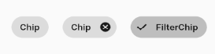
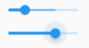

# 基础组件

[TOC]

runApp负责初始化WidgetsFlutterBinding等核心服务，并与Flutter引擎配合，将组件渲染到屏幕上。调用runApp函数时只需传入一个参数，就是一个组件。Flutter会将这个组件当作组件树（Widget Tree）的根，再继续一层层嵌套其他组件，最终满足各式复杂的布局需求和程序效果。

## 文本

### Text

Text控件的尺寸并不会影响到需要渲染字体的尺寸。

~~~dart
  const Text(
    String this.data, {
    this.style,
    this.textAlign,
    this.softWrap,
    this.overflow,
    this.textScaleFactor,
    this.maxLines,
    this.semanticsLabel,
  })
~~~

- `textAlign`：只有 Text 宽度大于文本内容长度时指定此属性才有意义

  ~~~dart
  Text("Hello world "*6,  //字符串重复六次
    textAlign: TextAlign.center,
  );
  ~~~

  

- `maxLines`：指定文本显示的最大行数

- `overflow`：指定截断方式。clip（裁剪）、fade（渐淡）、ellipsis（省略号）、visible（可见）

- `textScaleFactor`：默认值由操作系统决定。设用户在安卓或苹果系统中设置了将全局文字放大至150%，则Flutter中所有Text组件的textScaleFactor默认值都会是1.5。这属性适用在某部分布局需要固定文字大小的情景。

- `semanticsLabel`：语义标签是辅助功能的一部分，用来协助第三方软件为有障碍人士提供无障碍功能。例如，盲人一般会通过某些软件将屏幕上的内容朗读出来，而这里的语义标签就可以帮助屏幕朗读软件，以提供更友好的用户体验

  ~~~dart
  Text("$5.00",semanticsLabel: "五元整")
  ~~~


### 文本修饰

`TextStyle`用于指定文本显示的样式如颜色、字体、粗细、背景等

~~~dart
TextStyle({
    this.inherit = true,
    this.color,
    this.backgroundColor,
    this.fontSize,
    this.fontWeight,
    this.fontStyle,
    this.letterSpacing,
    this.wordSpacing,
    this.textBaseline,
    this.height,
    this.leadingDistribution,
    this.locale,
    this.foreground,
    this.background,
    this.shadows,
    this.fontFeatures,
    this.fontVariations,
    this.decoration,
  })
~~~

- `height`：该属性用于指定行高。这里接受一个比例因子，即具体的行高等于`fontSize `* `height`。


可以通过`DefaultTextStyle`组件为多个`Text`组件应用统一的样式。当`Text`组件遇到多个`DefaultTextStyle`组件嵌套时，只有最近的那个样式会生效。

可以使用`DefaultTextStyle.merge()`函数继承父级`DefaultTextStyle`，并在此基础上扩展或覆盖一些样式。

~~~dart
DefaultTextStyle(
  style: TextStyle(
      color: Colors.grey, fontSize: 24, fontWeight: FontWeight.bold),
  child: Column(
    children: <Widget>[
      DefaultTextStyle(
        style:
            TextStyle(color: Colors.black, fontStyle: FontStyle.italic),
        child: Text("落霞与孤鹜齐飞"),
      ),
      DefaultTextStyle.merge(
        style:
            TextStyle(color: Colors.black, fontStyle: FontStyle.italic),
        child: Text("秋水共长天一色"),
      ),
    ],
  ),
)
~~~


### 使用自定义字体

在`pubspec.yaml`中配置：

~~~yaml
flutter:
  fonts:
    - family: Raleway
      fonts:
        - asset: assets/fonts/Raleway-Regular.ttf
        - asset: assets/fonts/Raleway-Medium.ttf
          weight: 500
        - asset: assets/fonts/Raleway-SemiBold.ttf
          weight: 600
    - family: AbrilFatface
      fonts:
        - asset: assets/fonts/abrilfatface/AbrilFatface-Regular.ttf
~~~

~~~dart
TextStyle(
  fontFamily: 'Raleway',
);
~~~

如果使用了某一款自定义字体，但是没有参数所要求的粗体、斜体等版本。那么Flutter会模拟出对应的字体效果。

### RichText & TextSpan

`RichText`与`TextSpan`配合使用，可以很方便地为不同的字体片段应用不同的样式。下面是一个基本结构

~~~dart
RichText(
	text: TextSpan(
    	style : TextStyle(...),
        text : "晋太元中",
        children : [
            TextSpan(
            	text : "武陵",
                style : TextStyle(...),
            ),
            TextSpan(text : "人捕鱼为业"),
            TextSpan(
            	style : TextStyle(...),
                text : "缘溪行，忘路之远近",
                children : [
                    TextSpan(text : "忘路之远近")
                ]
            ),
            TextSpan(text : "忽逢桃花林")
        ]
    )
)
~~~

这里`TextSpan`形成一个树状结构，文本内容的生成遵循深度优先遍历顺序。文本内容从代码结构上来看就是从上到下的。下级`TextSpan`会自动继承上级的`style`，并且可以覆写或扩展上级`TextSpan`的`style`。**这样的树状结构仅仅是为了复用状态而已**。实践中，我们**几乎用不到这样的树状结构**。


`RichText`组件中的`TextSpan`并不会继承上级`DefaultTextStyle`组件提供的默认样式。如需使用`DefaultTextStyle`组件统一设置样式，则可以考虑使用`Text.rich（）`构造函数。

~~~dart
RichText(
	text : TextSpan(...)
)
    
Text.rich(TextSpan(...))
~~~


`TextSpan`中的`recognizer`参数支持传入一个`GestureRecognizer`类以便完成`TextSpan`树中某一片段的交互

~~~dart
Text.rich(
	TextSpan(
    	children : [
            TextSpan(
                text: "使用条款",
                recongizer: TapGestureRecongnizer()..onTap;
            ),
            TextSpan(
                text: "隐私政策",
                recongizer: TapGestureRecongnizer()..onTap;
            ),
        ]
    )
);
~~~


## 图片 & Icon

### Icon

`Icon`组件可以表示小图标。图标的本质是一些相对特殊的字体，属于矢量图形，可以支持无限缩放且不会失真。

~~~dart
const IconData(
    this.codePoint, {
    this.fontFamily,
    this.fontPackage,
    this.matchTextDirection = false,
    this.fontFamilyFallback,
});

static const IconData android_rounded = IconData(0xf071, fontFamily:"MaterialIcons");
~~~


Flutter框架中已经自带了一些图标，分别由`Icons`和`CupertinoIcons`两个类提供。前者包含常用的`Material`设计风格（常见于安卓系统）的图标，后者含有`Cupertino`风格（常见于iOS系统）的图标

~~~dart
Icon(
	IconData? icon, {		
    double? size,			//设置大小
    Color? color,			//设置图标的前景颜色
})
    
Icon(Icons.share);
~~~

`IconTheme`与`DefaultTextStyle`组件用法几乎相同，这里不再介绍。


如何使用自定义图标呢？

- 从 [www.iconfont.cn/](https://link.juejin.cn/?target=https%3A%2F%2Fwww.iconfont.cn%2F) 图标网站里，挑选自己喜欢的图标，然后保存到项目中，最后下载到本地即可

- 解压后，得到`iconfont.css`、`iconfont.ttf`、`iconfont.woff`等文件。将字体文件`.ttf`（或者`.woff`）放入到项目的资源文件中，然后`pubspec.yaml` 中进行配置

  ~~~yaml
    fonts:
      - family: TolyIcon			# 任意的名字
        fonts:
          - asset: assets/iconfont/iconfont.ttf
  ~~~

- 接下来就是在Flutter中使用了

  ~~~dart
  Icon(IconData(0xe6d9, fontFamily: 'TolyIcon'), size: 50),
  ~~~

  图标的 `Unicode`要在`.css`中查看


### Image

`Image`组件有1个必传的参数image，类型为`ImageProvider`。实际上，`ImageProvider`是一个抽象类，而Flutter框架提供了4种已知继承，分别为**NetworkImage（网络图片）**、**FileImage（文件图片）**、**AssetImage（资源包图片）**及**MemoryImage（内存图片）**。下面分别介绍它们是如何使用的：

- `NetworkImage`：Image组件将根据URL链接地址，自动完成下载、解码、渲染等一系列动作

  ~~~dart
  Image(image : NetworkImage('https://flutter.github.io/assets-for-api-docs/assets/widgets/ owl.jpg');
        
  Image.network('https://flutter.github.io/assets-for-api-docs/assets/widgets/ owl.jpg');
  ~~~

  因为这里需要访问网络，记得检查是否已经打开相关权限，如安卓App模块需要在原生manifest文件内添加android.permission.INTERNET申请网络权限。

  

- `FileImage`：用来加载文件系统中的图片资源文件

  ~~~dart
  Image(image : FileImage(File("path/...")));
  
  Image.file(File("Path/...."));
  ~~~

  记得检查是否打开相关权限，安卓模块可能需要在原生manifest里添加android.permission.READ_EXTERNAL_ STORAGE权限。

  

- `AssetImage`：用于加载在打包时放入资源包（AssetBundle）中的图片资源。

  图片资源的文件路径需要写入pubspec.yaml文件中

  ~~~yaml
  flutter:
  	assets:
  		- images/cat.jpg
          - images/icon/			#images/icon下的所有资源，但是不包括子目录的
  ~~~

  ~~~dart
  Image(image : AssetImage("images/cat.jpg"));
  ~~~

  

- `MemoryImage`：可以从内存中的一个Uint8List字节序列中加载图片。

  在实践中，一般使用convert包里的base64Decode函数，它base64编码转换成Uint8List类型，并传给MemoryImage使用。

  ~~~dart
  final String data = r'iVBORwOKGgoAAAAANsu....';
  final bytes = base64Decode(data);
  Image(image : MemoryImage(bytes));
  Image.memory(bytes);
  ~~~


Image大小受父约束、Widget参数、素材大小的影响。

~~~dart
const Image({
  ...
  this.width, 							//图片的宽
  this.height, 							//图片高度
  this.color, 							//图片的混合色值
  this.colorBlendMode, 					//混合模式
  this.fit,								//缩放模式
  this.alignment = Alignment.center, 	//对齐方式
  this.repeat = ImageRepeat.noRepeat, 	//重复方式
  ...
})
~~~

- `width`、`height`：用于设置图片的宽、高。如果只设置`width`、`height`的其中一个，那么另一个属性默认会按比例缩放

- `alignment`：设置图片的对齐方式。先`fit`再`alignment`

- `fit`：该属性用于在图片的显示空间和图片本身大小不同时指定图片的适应模式。BoxFit

  当图片过小时的适应模式

  - `none`（默认）：什么也不做。

  - `fill`：会拉伸填充满显示空间，图片本身长宽比会发生变化，图片会变形。
  - `cover`：会按图片的长宽比放大后填满显示空间，图片不会变形，超出显示空间部分会被剪裁。

  当图片过大时的适应模式

  - `contain`（默认）：图片会在保证图片本身长宽比不变的情况下缩放以适应当前显示空间，图片不会变形。
  - `fitWidth`：图片的宽度会缩放到显示空间的宽度，高度会按比例缩放，然后居中显示，图片不会变形，超出显示空间部分会被剪裁。
  - `fitHeight`：图片的高度会缩放到显示空间的高度，宽度会按比例缩放，然后居中显示，图片不会变形，超出显示空间部分会被剪裁。
  - `none`：什么也不做

  

- `errorBuilder`，如果图片加载的过程中发生错误，则Image组件会将errorBuilder方法返回的Widget渲染到屏幕上，并且Image的父组件约束会传递给这个Widget。

  ~~~dart
  Image.network(
  	'https://file.not.found/404.png',
      errorBuilder : (context, exception, stackTrace) {
          return Widget();
      }
  )
  ~~~

- `loadingBuilder`

### FadeInImage

在图片加载过程中暂时使用另一张图片来代替，并在加载完成时平滑地过渡成新的图片。

~~~dart
FadeInImage.assetNetwork(
	image : "https://.../owl.jpg",
    placeholer : "assets/loading.gif",
    fadeOutDuration : Duration(seconds : 2),
    fadeOutCurve : null
    fadeInDuration : Duration(seconds : 3),
)
~~~

```
BlocBuilder<SongBloc, Song>(builder: (_, song)
```


```
Card(
  elevation: 2,
  clipBehavior: Clip.none,
  child: Padding(
    padding:
        EdgeInsets.symmetric(horizontal: 10.0, vertical: 2.0),
    child: Row(
      crossAxisAlignment: CrossAxisAlignment.center,
      children: [
        UnconstrainedBox(
          child: Transform.translate(
            offset: Offset(0, 0),
            child: SizedBox(
              height: 50,
              width: 50,
              child: FadeInImage.assetNetwork(
                image: "${SERVER_URL}/static/${song.imgUrl}",
                placeholder: "assets/images/loading.png",
                fit: BoxFit.cover,
                alignment: Alignment.topCenter,
              ),
            ),
          ),
        ),
        SizedBox(width: 10),
        Text(
          song.name,
        ),
      ],
    ),
  ),
),
```

## 按钮

这些按钮都是在满足父约束的情况下，尽可能地匹配子组件的尺寸。


`ElevatedButton`、`TextButton`、`OutlinedButton`、`IconButton`，它们的动画效果都是涟漪动画。而`ElevatedButton`、`TextButton`、`OutlinedButton`都有一个`icon` 构造函数，通过它可以轻松创建带图标的按钮。

~~~dart
ElevatedButton(onPressed: () {},child: Text("ElevatedButton"),)
    
TextButton(child: Text("normal"),onPressed: () {},)
    
OutlinedButton(child: Text("normal"),onPressed: () {},)
    
IconButton(icon: Icon(Icons.thumb_up),onPressed: () {},)
    
ElevatedButton.icon(icon: Icon(Icons.send),label: Text("发送"),onPressed: () {},)
    
OutlinedButton.icon(icon: Icon(Icons.add),label: Text("添加"),onPressed: () {},)

TextButton.icon(icon: Icon(Icons.info),label: Text("详情"),onPressed: () {},)
~~~


## 进度条

`LinearProgressIndicator`和`CircularProgressIndicator`，它们都可以同时用于精确的进度指示和模糊的进度指示。精确进度通常用于任务进度可以计算和预估的情况，比如文件下载；而模糊进度则用户任务进度无法准确获得的情况，如下拉刷新，数据提交等。


它们都是尽可能地扩展到父组件的尺寸。

### LinearProgressIndicator

~~~dart
LinearProgressIndicator({
  double value,
  Color backgroundColor,
  Animation<Color> valueColor,
  ...
})
~~~

- `value`：`value`表示当前的进度，取值范围为[0,1]；当`value`为`null`时则指示器会执行一个循环动画（模糊进度）
- `backgroundColor`：指示器的背景色。
- `valueColor`: 指示器的进度条颜色；


### CircularProgressIndicator

~~~dart
 CircularProgressIndicator({
  double value,
  Color backgroundColor,
  Animation<Color> valueColor,
  this.strokeWidth = 4.0,
  ...   
}) 
~~~

- `strokeWidth` 表示圆形进度条的粗细

## 其他

### Placeholder

它可以方便开发者在屏幕上画出一个占位框，表示这块内容暂时还没完成。一般而言，它会试图占满全部可用空间。基本代码如下：

~~~dart
Placeholder()
~~~

## 输入框

### TextField

`TextField`一共有五种状态：无焦点、无焦点且错误、有焦点、有焦点且错误、禁用。

`TextField`会在宽度上取自身约束的最大值。如果宽度是`double.infinite`，那么也会抛出异常。

~~~dart
const TextField({
  ...
  TextEditingController controller, 
  FocusNode focusNode,
  InputDecoration decoration = const InputDecoration(),
  TextInputType keyboardType,
  TextInputAction textInputAction,
  TextStyle style,
  TextAlign textAlign = TextAlign.start,
  bool autofocus = false,
  bool obscureText = false,
  int maxLines = 1,
  int maxLength,
  this.maxLengthEnforcement,
  ToolbarOptions? toolbarOptions,
  ValueChanged<String> onChanged,
  VoidCallback onEditingComplete,
  ValueChanged<String> onSubmitted,
  List<TextInputFormatter> inputFormatters,
  bool enabled,
  this.cursorWidth = 2.0,
  this.cursorRadius,
  this.cursorColor,
  this.onTap,
  ...
})
~~~

- `InputDecoration`：用于控制`TextField`的外观显示，如提示文本、背景颜色、边框等。如果设置为null，那么什么样式都没有。

- `keyboardType`：用于设置该输入框默认的键盘输入类型，取值如下：

  | TextInputType枚举值 | 含义                                                |
  | ------------------- | --------------------------------------------------- |
  | text                | 文本输入键盘                                        |
  | number              | 数字；会弹出数字键盘                                |
  | phone               | 优化后的电话号码输入键盘；会弹出数字键盘并显示“* #” |
  | datetime            | 优化后的日期输入键盘；Android上会显示“: -”          |
  | emailAddress        | 优化后的电子邮件地址；会显示“@ .”                   |
  | url                 | 优化后的url输入键盘； 会显示“/ .”                   |

- `textInputAction`：键盘动作按钮图标(即回车键位图标)。下面是当值为`TextInputAction.search`时，原生Android系统下键盘样式如图所示：

  

- `style`：正在输入的文本样式。

- `cursorWidth`、`cursorRadius`和`cursorColor`：这三个属性是用于自定义输入框光标宽度、圆角和颜色的。

- `enable`：如果为`false`，则输入框会被禁用，禁用状态不能响应输入和事件，同时显示禁用态样式。程序在运行时可随时通过`enabled`属性设置启用或禁用文本框。

- `maxLines`：

  - 默认值为`1`，此时输入框不会换行（水平溢出，有滚动条）。

  - 值为`null`，则无限行。它会自适应内容
  
    
  
  
    - 值为`x`，那么最多显示`x`行，但不会阻止用户输入超过`x`行（垂直溢出，有滚动条）。如果未设置`minLines`，那么文本框的高度就为`x`行。否则初始时显示minLines行，然后根据内容自适应，直到maxLines行
  


- `minLines`：设置输入框的最小高度。

- `obscureText`：决定是否将内容遮挡，并且用什么字符遮挡。默认为“U+2022 BULLET”字符。

- `maxLength`代表输入框文本的最大长度，设置后输入框右下角会显示计数器。如果不想使用计数器，那么将InputDecoration中的counterText属性设置为空字符串即可

  

  

- `maxLengthEnforcement`决定当输入文本长度超过`maxLength`时如何处理，如截断、超出等。

- `inputFormatters`：自动过滤器

  ~~~dart
  TextField(
  	inputFormatters : [
          FilteringTextInputFormatter.deny(
          	"zzz",								//当用户输入zzz时，自动替换成ZZZZ
              replacementString: "ZZZZ",
          ),
          FilteringTextInputFormatter.deny(
              RegExp(r"[aeiou]"),					
              replacementString : "*",
          ),
          FilteringTextInputFormatter.allow(RegExp("[0-9.]"))	//只允许用户指定字符，其他字符会被忽略掉
      ]
  )
  ~~~

- `onSubmitted`：当用户单击屏幕软键盘上的“完成”等表示结束的按钮时，软键盘会被收起，同时onSubmitted事件会被触发

- `onChanged`：每当用户对TextField的内容做出改动，如添加或删除文字时，onChangd事件都会被触发。但若用户没有直接修改TextField，而是通过controller导致文本内容发生变动的，则不会触发onChanged事件。

- `onEditingComplete`。当用户完成输入时，onEditingComplete事件会在onSubmitted事件之前触发。它的主要作用是处理与焦点相关的逻辑。

  默认情况下，当用户单击软键盘上的done、go、send、search等表示结束的按键时，TextField会自动放弃焦点并收起软键盘。例如，在即时通信软件中，开发者通常会通过textInputAction属性将软键盘右下角修改为“发送”按键，但用户发送完一条短消息后很可能希望立即开始编辑下一条消息，因此不应该放弃焦点。此时可通过向onEditingComplete传入一个空函数来覆盖默认行为。

- `onTap`：每当用户单击一次TextField组件，它的onTap事件就会被触发一次

- `autofocus`: 是否自动获取焦点。

- `buildCounter`：设置计数器。

  ~~~dart
  buildCounter: (
    BuildContext context, {
    required int currentLength,
    required int? maxLength,
    required bool isFocused,
  }) {
    return Text('${maxLength! - currentLength}');
  }),
  ~~~

  `InputDecoration`中的`counter`属性也可以设置计数器。若两边都设置，``InputDecoration`的counter`属性则有优先权。


### InputDecoration


- `icon`，在搜索框外面的`Icon`

- `prefixIcon`、`prefixIconConstraints`，其中`prefixIconConstraints`一般用于设置`prefixIcon`与输入内容之间的间距的。在搜索框内部的`Icon`。

- `prefix`、`prefixText`、`prefixStyle`。注意：`prefix`与`prefixText`只能二选一。只有在获得焦点时才渲染出`prefix`控件或者`prefixText`。

  ~~~dart
  TextField(
  	decoration : InputDecoration(
      	icon : Icon(Icons.add),
          prefixIcon : Icon(Icons.lock),
          prefixText : "https://",
      )
  )
  ~~~


- `counter`、`counterText`、`counterStyle`：`counter`与`counterText`只能二选一
- `suffixIcon`、`sufficIconConstraints`
- `suffixText`、`suffixStyle`、`suffix`

- `labelText`、`labelStyle`、`floatingLabelBehavior`属性用于设置标签

- `hintText`、`hintStyle`用于设置提示信息，当用户输入时，这些信息就会消失。


`TextField`组件共有5种状态，因此`InputDecoration`也有5个相应的定义边框样式的属性，分别为

- `enabledBorder`（无焦点时的边框）

- `errorBorder`（无焦点且错误）

- `focusedBorder`（有焦点时的边框）

- `focusedErrorBorder`（有焦点且错误）

- `disabledBorder`（禁用时的边框）


另外它还提供简单的`border`属性，用于定义默认边框，一般情况下通过`border`属性即可同时设置5种状态。注意，如果要自定义边框，那么需要设置`enabledBorder`等五个属性。若未设置，那么会显示`border`属性所设置的样式。

`TextField`样式自带下划线背景，在`decoration`中设置`border: InputBorder.none`即可去掉。

~~~dart
TextField(
  decoration: InputDecoration(
    border: InputBorder.none,
  ),
)
~~~

设置圆角

~~~dart
 var customBorder = OutlineInputBorder(
        borderRadius: BorderRadius.circular(24),
        borderSide: const BorderSide(style: BorderStyle.none));
~~~

~~~dart
border: customBorder,
enabledBorder: customBorder,
focusedBorder: customBorder,
focusedErrorBorder: customBorder,
errorBorder: customBorder,
~~~


有时TextFild中的输入值布局中，此时我们可以通过contentPadding来解决这个问题：

~~~dart
child: TextField(
    decoration: InputDecoration(
        	contentPadding: EdgeInsets.symmetric(vertical: 0)),
),
~~~


### 控制器

~~~dart
class _HyHomePageState extends State<MyHomePage> {
  TextEditingController _controller = TextEditingController();

  @override
  void dispose() {
    _controller.dispose();
    super.dispose();
  }

  @override
  Widget build(BuildContext context) {
    return TextField(
        controller: _controller,
        onChanged: (_) => {log("onChange")},
      ),
    );
  }
}
~~~

~~~dart
controller.text;		//获取并修改文本
controller.clear();		//清除文本
controller.section;		//获取并修改选中的区域
~~~


## From

Flutter提供了一个`Form` 组件，它可以对输入框进行分组，然后进行一些统一操作，如输入内容校验、输入框重置以及输入内容保存。

`Form`继承自`StatefulWidget`对象，它对应的状态类为`FormState`。它的定义如下：

~~~dart
Form({
  required Widget child,
  bool autovalidate = false,
  WillPopCallback onWillPop,
  VoidCallback onChanged,
})
~~~

- `autovalidate`：是否自动校验输入内容；当为`true`时，Form中的每一个 FormField 内容发生变化时都会调用`FormField`的`validate`方法。
- `onChanged`：`Form`的任意一个`FormField`内容发生变化时会调用此回调


`TextFormField`组件，它继承自`FormField`类，除了`FormField`定义的属性之外，它还包括`TextField`的属性。`FormField`部分定义如下：

~~~dart
const FormField({
  ...
  FormFieldSetter<T> onSaved, //保存回调
  FormFieldValidator<T>  validator, //验证回调
  bool autovalidate = false, //是否自动校验。
})
~~~


`FormState`为`Form`的`State`类，可以通过`Form.of()`或`GlobalKey`获得，我们可以通过它来对FormField进行统一操作

- `FormState.validate()`：调用`FormField的validate`回调，如果有一个校验失败，则返回false。所有校验失败项都会返回用户返回的错误提示。
- `FormState.save()`：调用`FormField`的`save`回调，用于保存表单内容
- `FormState.reset()`：将子孙`FormField`的内容清空。

## Material Widget

**避免重复造轮子**是软件工程的核心思想之一，Flutter框架所提供的Material Widget正是实践这种思想。因此对于一个新的UI需求，我们首先要考虑是否有某个Material Widget切合这个需求，而不是立马手撸一个出来。官网示例：https://docs.flutter.dev/ui/widgets/material。


在Flutter中，如果出现如下报错信息：

~~~text
No Material Widget found
~~~

那就说明

1. 你应该使用了material风格的控件，如Textfield，Switch等；
2. 没有使用Scaffold作为根控件

解决方法很简单，即添加Scaffold作为根控件即可

### MaterialApp

`MaterialApp`是一个`StatefulWidget`。它集成了很多组件，来实现应用的基础需求，主要包括：

- `AnimatedTheme` 、 `Theme` 、`Localizations` 组件处理应用主题和语言。
- `ScrollConfiguration` 、`Directionality`、 `PageStorage` 、`PrimaryScrollController` 、`MediaQuery` 等 `InheritedWidget` 组件为子级节点提供全局信息。
- `Navigator` 与 `Router` 组件处理路由跳转。
- `WidgetInspector` 、`PerformanceOverlay` 等调试信息组件。

MaterialApp直接将父约束（一般是屏幕大小的紧约束）传递给home属性所指向的Widget。

### Chip

该组件用于实现标签：

~~~dart
Chip(
    label: Text("Chip"),
),
Chip(
    label: Text("Chip"),
    onDeleted: () {},
),
FilterChip(
    selected: true,
    label: Text("FilterChip"),
    onSelected: (bool _) {},
)
~~~



### DatePickerDialog

~~~dart
ElevatedButton(
    child: Text("请选择日期!"),
    onPressed: () async {
      var result = await showDatePicker(
          context: context,
          initialDate: DateTime.now(),			//初始化时间，通常情况下设置为当前时间
          firstDate: DateTime(2020),			//表示开始时间，不能选择此时间前面的时间
          lastDate: DateTime(2030));			//lastDate表示结束时间，不能选择此时间之后的时间
      log('$result');
    },
  ),
);
~~~


### TimePickerDialog

~~~dart
showTimePicker(
    context: context,
    initialTime: TimeOfDay.now(),
    errorInvalidText: "errorInvalidText",
    cancelText: "cancelText",
    confirmText: "confirmText",
    hourLabelText: "hourLabelText",
    minuteLabelText: "minuteLabelText",
    helpText: "HelpText",
);
~~~


### Radio


~~~dart
Radio(
    value : 1,
    groupValue: _groupValue,
    onChanged: (value) { 
        setState(() {
      		_groupValue = value!;
    	});
    },
)
~~~

当groupValue与value匹配时，该Radio显示为选中状态。

### Slider


~~~dart
Slider(
    value: _currentSliderValue,	
    min: 0
    max: 100,
    divisions: 5,				
    onChanged: (double value) {
      setState(() {
        _currentSliderValue = value;
      });
    },
  ),
~~~


`Slider`中的`secondaryTrackValue`使用：

~~~dart
Slider(
    value: _currentSliderPrimaryValue,
    secondaryTrackValue: _currentSliderSecondaryValue,
    onChanged: (double value) {
        setState(() {
        _currentSliderPrimaryValue = value;
        });
    },
),
Slider(
    value: _currentSliderSecondaryValue,
    onChanged: (double value) {
        setState(() {
        _currentSliderSecondaryValue = value;
        });
    },
),
~~~



### RangeSlider


~~~dart
RangeSlider(
  values: _currentRangeValues,			//这个类型为RangeValues
  max: 100,
  divisions: 5,
  onChanged: (RangeValues values) {
    setState(() {
      _currentRangeValues = values;
    });
  },
);
~~~


### Switch

~~~dart
Switch(
  // This bool value toggles the switch.
  value: light,
  activeColor: Colors.red,
  onChanged: (bool value) {
    // This is called when the user toggles the switch.
    setState(() {
      light = value;
    });
  },
);
~~~


~~~dart
final MaterialStateProperty<Color?> trackColor =
    MaterialStateProperty.resolveWith<Color?>(
  (Set<MaterialState> states) {
    // Track color when the switch is selected.
    if (states.contains(MaterialState.selected)) {
      return Colors.amber;
    }
    
    // Otherwise return null to set default track color
    // for remaining states such as when the switch is
    // hovered, focused, or disabled.
    return null;
  },
);
final MaterialStateProperty<Color?> overlayColor =
    MaterialStateProperty.resolveWith<Color?>(
  (Set<MaterialState> states) {
    // Material color when switch is selected.
    if (states.contains(MaterialState.selected)) {
      return Colors.amber.withOpacity(0.54);
    }
      
    // Material color when switch is disabled.
    if (states.contains(MaterialState.disabled)) {
      return Colors.grey.shade400;
    }
      
    // Otherwise return null to set default material color
    // for remaining states such as when the switch is
    // hovered, or focused.
    return null;
  },
);

return Switch(
  // This bool value toggles the switch.
  value: light,
  overlayColor: overlayColor,
  trackColor: trackColor,
  thumbColor: const MaterialStatePropertyAll<Color>(Colors.black),
  onChanged: (bool value) {
    // This is called when the user toggles the switch.
    setState(() {
      light = value;
    });
  },
);
~~~


~~~dart
final MaterialStateProperty<Icon?> thumbIcon =MaterialStateProperty.resolveWith<Icon?>(
    (Set<MaterialState> states) {
      if (states.contains(MaterialState.selected)) {
        return const Icon(Icons.check);
      }
      return const Icon(Icons.close);
    },
  );

Switch(
  thumbIcon: thumbIcon,
  value: light1,
  onChanged: (bool value) {
    setState(() {
      light1 = value;
    });
  },
),
~~~


### Divider

~~~dart
VerticalDivider(width: 1, color: Color(0xffD1D1D1));
Divider(height: 1, color: Color(0xffD1D1D1));
~~~


### SnackBar

~~~dart
const snackBar = SnackBar(
  content: Text('Yay! A SnackBar!'),
);

// Find the ScaffoldMessenger in the widget tree
// and use it to show a SnackBar.
ScaffoldMessenger.of(context).showSnackBar(snackBar);
~~~


我们可能想在显示 SnackBar 的时候给用户提供一个附加的操作。比如，当他们意外的删除了一个消息，我们可以提供一个撤销更改的操作。

~~~dart
final snackBar = SnackBar(
  content: const Text('Yay! A SnackBar!'),
  action: SnackBarAction(
    label: 'Undo',
    onPressed: () {
      // Some code to undo the change.
    },
  ),
);
~~~

### Card

| Card 属性          | 介绍                                    |
| ------------------ | --------------------------------------- |
| color              | 卡片背景色                              |
| shadowColor        | 阴影颜色                                |
| elevation          | 阴影高度                                |
| shape              | 形状 BorderShape                        |
| borderOnForeground | 是否在 child 前绘制 border，默认为 true |
| margin             | 外边距                                  |
| clipBehavior       | 裁剪方式                                |
| child              | 子控件                                  |

