# Layout

[TOC]

## 概述

现在UI构建的底层逻辑就是**图层**。在Flutter中，图层抽象为组件**Widget**。图层之间的父子关系正好可以用树状结构来描述。这种树状结构在代码中体现为组件之间的**嵌套**。因此，我们可以通过定义一个个相对独立的小组件，再利用组件与组件之间的嵌套，逐步搭建出复杂的用户界面。

在Flutter框架中，组件是**不可变（immutable）**的，即一旦组件被创建就不可以再修改其中的内容。因此每当程序内部数据发生改变或因动画效果而导致用户界面需要更新时，所有涉及的组件都会被摧毁并重制。Flutter框架对组件摧毁和重制的过程优化到极致，所以并不需要过度担心性能问题。

Flutter框架中的尺寸或位置信息，例如高度、宽度等，一般都以**逻辑像素**作为单位。由于每个物理像素的规格不同。运行时，Flutter程序会根据当前的设备信息，自动提供逻辑像素到物理像素的转换，即「每38像素约为1cm」。这样开发者在处理页面布局时，就不需要考虑设备屏幕的像素密度问题了。

Flutter 中有两种布局模型：

- 基于 **RenderBox** 的盒模型布局：2D 绘制布局
- 基于 **Sliver ( RenderSliver )** 按需加载列表布局：滚动布局

这里我们介绍RenderBox的布局流程，对于Sliver布局，在滚动一节介绍。


盒模型的布局流程如下：

1. Widget向子组件传递约束。
   1. 父约束，父组件的自身约束

   2. 自身约束，由父约束和父组件的属性（例如size）等因素共同决定

   3. 子约束，子组件的自身约束

2. 子级将所需的大小回传给Widget。Widget根据以下因素来决定自身的大小：

   - 自身约束
   - 子组件的大小
   - 属性（例如，mainAxisSize、height、width等）

3. 然后Widget 就会对子Widget逐个进行布局。**如果子Widget溢出，可以将其直接裁剪掉，或者直接绘制出来**，甚至抛出异常（理论上可以，但实践中并未遇到过）

4. Widget 将会把它的大小信息向上传递至父 widget


**在任何时候，子组件都必须先遵守父组件所传递的约束**。也就是说，当子组件所期望的大小不满足约束时，那么必须将大小设置为自身约束的范围内。**这是所有Widget在布局时都必须遵守假设，在自己自定义布局时，一定要满足这条不变式。但是要注意的是，这个不变式仅仅在父子之间成立。**

## 约束

`Flutter `通过 `Constraints`抽象类来表达「约束」这个概念，其中有 `BoxConstraints` 和 `SliverConstraints` 两种实现类。其中，**BoxConstraints**（以下简称为约束）有以下形式：

- **紧约束（Tight Constraint）**：最小约束与最大约束相等
- **松约束（Loose Constraint）**：约束的最小值为0。
- **无边界（unbounded）**：约束的最大值为正无穷`double.infinity`，最小值为0。


Flutter Framework向根组件传入屏幕大小的紧约束

~~~dart
void main() => runApp(Container());		// Container会接收到1920 * 1080的紧约束
~~~

一般是将MaterialApp作为根组件，但MaterialApp会直接把屏幕大小的紧约束传递给home属性所引用的Widget。而`Scaffold`组件会以松约束的形式将该约束传递下去。

## Layout Widget

### Column & Row

`Row` 本质上是 `direction: Axis.horizontal` 的 `Flex` 组件；`Column` 本质上是 `direction: vertical` 的 `Flex` 组件。

`Column` & `Row` 在主轴方向上传递无约束。在副轴上传递自身约束的松约束，如果`CrossAxisAlignment`为`stretch`，那么以紧约束的形式将自身约束的最大值传递给子组件。

Column & Row 组件在主轴大小，取决于父级约束、children的总尺寸，以及mainAxisSize属性。而它们的副轴大小，取决于他们所有子元素在副轴方向上的最大大小、CrossAxisAlignment、父级约束。

~~~dart
Row({
  ...  
  TextDirection 		textDirection,    									//子组件的布局顺序(是从左往右还是从右往左)
  MainAxisSize 			mainAxisSize = MainAxisSize.max,    				//在主轴(水平)方向占用的空间
  MainAxisAlignment 	mainAxisAlignment = MainAxisAlignment.start,		
  VerticalDirection 	verticalDirection = VerticalDirection.down,  
  CrossAxisAlignment 	crossAxisAlignment = CrossAxisAlignment.center,
  List<Widget> 			children = const <Widget>[],
})
~~~

- MainAxisAlignment：只有当`mainAxisSize`的值为`MainAxisSize.max`时，此属性才有意义。

  - start、end、center
  - spaceBetween：在相邻的子组件之间插入空白，但不在第一个和最后一个子组件外围插入留白
  - spaceEvenly：在子组件周围统一插入留白
  - spaceAround：在相邻的子组件之间插入留白，并在第一个和最后一个子组件外围插入一半的留白

  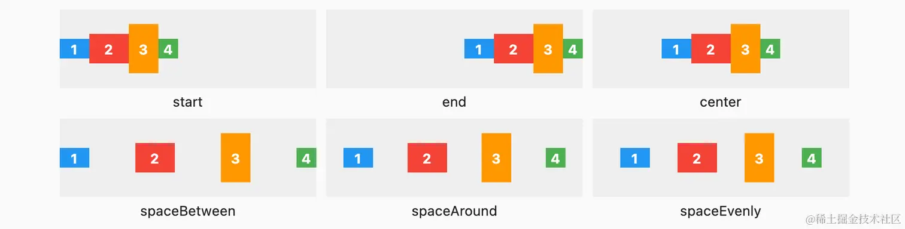

- `CrossAxisAlignment`

  - start、end、center
  - stretch：Row或者Column控件在副轴上尽量扩展到最大约束，同时以紧约束的形式将自身约束的最大值传递给子组件。
  - baseline：按组件文字的基准线对齐

  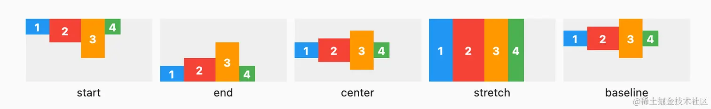

- mainAxisSize：

  - MainAxisSize.max：表示尽可能多的占用主轴方向的空间（大小为最大约束）
  - MainAxisSize.min：表示尽可能少的占用主轴空间。例如，当Row的子组件没有占满水平剩余空间，则`Row`的实际宽度等于所有子组件占用的水平空间；
  
- textDirection（TextDirection.rtl）：

  

  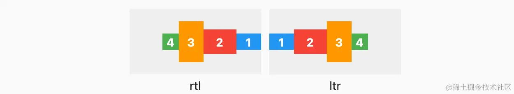

  


如果`Row`里面嵌套`Row`，或者`Column`里面再嵌套`Column`，那么只有最外面的`Row`或`Column`会占用尽可能大的空间，内部的`Row`或`Column`主轴所占用的空间为MainAxisSize.min。如果不这么做，其他元素将会被挤出去。


### Wrap

Wrap的行为与Row类似，但是如果一个元素在主轴放不下时，那么Wrap为其自动换行。Wrap尽可能地匹配所有子组件布局后的总尺寸。

Wrap在主轴上尽可能占用所约束的空间，副轴大小取决于子组件布局后所占的副轴大小以及自身约束。它在主轴上传递一个松约束，而在副轴上传递无约束。

```dart
Wrap({
  ...
  this.direction = Axis.horizontal,
  this.alignment = WrapAlignment.start,
  this.spacing = 0.0,
  this.runAlignment = WrapAlignment.start,
  this.runSpacing = 0.0,
  this.crossAxisAlignment = WrapCrossAlignment.start,
  List<Widget> children = const <Widget>[],
})
```

- `direction`：确定主轴的方向

  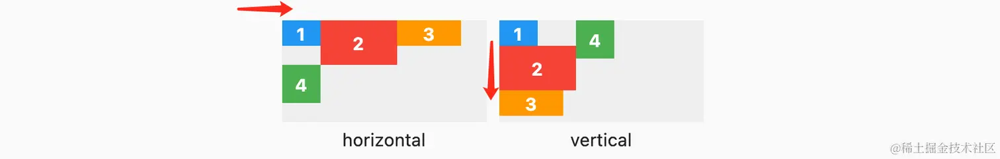

- `spacing`：主轴方向子widget的间距

- `runSpacing`：纵轴方向的间距

- `runAlignment`（WrapAlignment枚举）：它是控制多个副轴的对齐，

  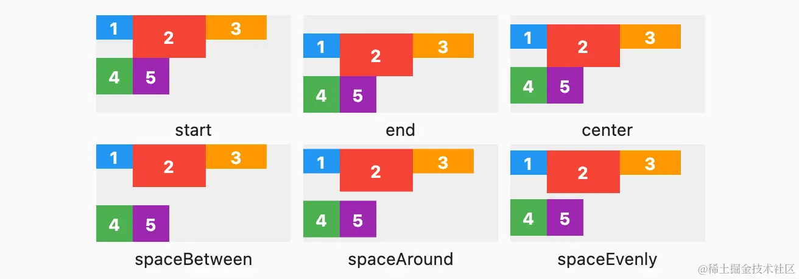

- `crossAxisAlignment`（WrapCrossAlignment枚举）：控制的是一个副轴上多个Widget的对齐。

  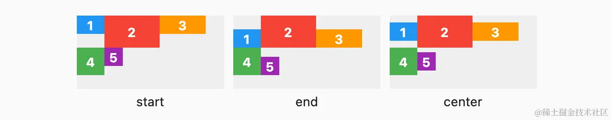

- `alignment`：

  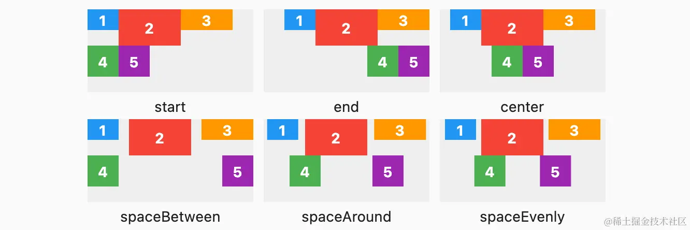


### Stack & Positioned

层叠布局和 Web中的绝对定位是相似的。Flutter中使用`Stack`和`Positioned`这两个组件来配合实现绝对定位。`Stack`允许子组件堆叠，而`Positioned`用于确定子组件的位置。


Stack里的子组件在布局时会被分为“有位置”和“无位置”这2大类，而其中“有位置”是指被Positioned包裹的子组件。

```dart
Stack({
  this.alignment = AlignmentDirectional.topStart,
  this.fit = StackFit.loose,
  this.clipBehavior = Clip.hardEdge,
  List<Widget> children = const <Widget>[],
})
```

- `clipBehavior`：决定对超出`Stack`显示空间的部分如何剪裁。
  - Clip.hardEdge 表示直接剪裁，不应用抗锯齿。
  - Clip. none，要求不裁剪
  - antiAlias：应用抗锯齿
  - antiAliasWithSaveLayer：不仅抗锯齿，而且还会分配一个缓冲区，后续所有的绘制都在缓冲区上进行，最后被剪切和合成
  
- `fit`：控制Stack如何将自己的父级组件的尺寸约束传达给“无位置”的子组件。
  - StackFit. loose（宽松，默认值）：传递松约束
  - StackFit.expand（扩张）：传递紧约束
  - StackFit.passthrough（穿透）：直接传递父约束
  
- `alignment`：对于以下两种子Widget，会应用该属性：
  - “无位置”Widget
  - “有位置”Widget，但并未设置水平或垂直方向的对齐方式，此时，未设置的方向会应用alignment属性
  
  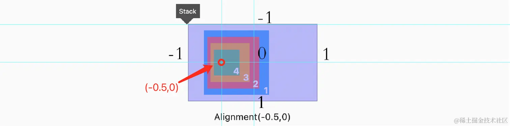
  
  

`Stack`的布局算法

1. Stack首先会找到所有“无位置”的子组件，并向它们传入fit属性所设置的布局约束
2. 在得到全部“无位置”子组件所确定的最终尺寸后，Stack会把自身尺寸匹配到其中最大的子组件的尺寸。如果Stack里不存在“无位置”的子组件，则Stack会尽量将自身尺寸设置为父级布局约束所允许的最大尺寸。
3. 再把子组件按照alignment属性设置的对齐方式摆放。默认为左上角

Stack在渲染时，会按照children属性里的列表顺序，依次绘制子组件并覆盖叠放。因此列表里第一个组件会首先被绘制，于是出现在最底层。


```dart
const Positioned({
  Key? key,
  this.left, 
  this.top,
  this.right,
  this.bottom,
  this.width,
  this.height,
  required Widget child,
})
```

同一维度的3个属性（横轴left、right、width属性，以及纵轴top、bottom、height属性）最多只可以传入2个，否则会产生运行时错误。


### Align

~~~dart
Align({
  Key key,
  this.alignment = Alignment.center,
  this.widthFactor,
  this.heightFactor,
  Widget child,
})
~~~

- alignment：它有两个常用的子类：`Alignment`和 `FractionalOffset`（不推荐）。

  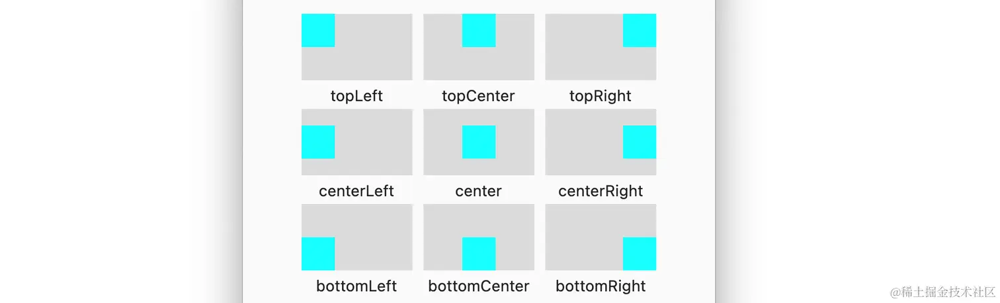

- `widthFactor`和`heightFactor`：它们是两个缩放因子，会分别乘以子组件的宽、高得到该组件期望的宽高。再结合自身约束，确定`Align` 组件的最后布局的宽高。

  在不设置widthFactor与heightFactor的情况下，Align组件的自身尺寸会尽量占满父级最大约束。

Align将父组件所传递的约束以松约束的形式传递下去。


`RenderPositionedBox`的布局逻辑

```dart
@override
void performLayout() {
  final BoxConstraints constraints = this.constraints;
  final bool shrinkWrapWidth = _widthFactor != null || constraints.maxWidth == double.infinity;
  final bool shrinkWrapHeight = _heightFactor != null || constraints.maxHeight == double.infinity;

  if (child != null) {
    child!.layout(constraints.loosen(), parentUsesSize: true);
    size = constraints.constrain(Size(
      shrinkWrapWidth ? child!.size.width * (_widthFactor ?? 1.0) : double.infinity,
      shrinkWrapHeight ? child!.size.height * (_heightFactor ?? 1.0) : double.infinity,
    ));
    // 在这里设置子组件的ParentData对象
    alignChild();
  } else {
    size = constraints.constrain(Size(
      shrinkWrapWidth ? 0.0 : double.infinity,
      shrinkWrapHeight ? 0.0 : double.infinity,
    ));
  }
}
```

其中 `Align` 、`OverflowBox` 、`SizedOverflowBox` 、`FractionallySizedBox` 四个组件对应的渲染对象都继承自 `RenderAligningShiftedBox` ，这说明四者都会通过 `alignChild` 方法，计算出绘制时偏移量，并让子组件携带它（设置子组件的parentData属性），从而完成 `alignment` 属性相对定位的功能。


### Center

Center是Align的一个特例！

~~~dart
class Center extends Align { 
    const Center({
        double widthFactor,
        double heightFactor, 
        Widget child
    }) : super(widthFactor:widthFactor,heightFactor: heightFactor, child: child); 
}
~~~


### Flex & Expanded & Flexible

在主轴方向上传递无约束。在副轴上传递松约束形式的自身约束。

~~~dart
Flex({
  ...
  required this.direction, //弹性布局的方向, Row默认为水平方向，Column默认为垂直方向
  List<Widget> children = const <Widget>[],
})
~~~

`Flex`组件的属性请见Row、Column。


`Expanded` 只能作为 Flex 的孩子（包括Row、Column），否则会报错。Flex会首先给其他组件布局，然后计算布局后所剩的空间大小，最后将这些剩余空间按比例分配给“弹性”组件。

~~~dart
const Expanded({
  int flex = 1, 
  required Widget child,
})
~~~

`flex`参数为弹性系数，默认为`1`。如果为` 0` 或`null`，则`child`是没有弹性的，应被当作普通的固定尺寸的子组件处理。其余情况下，它会被当作有弹性的组件，将按照flex属性的权重，参与Flex剩余空间的分配。


Flexible是Expanded组件的父类，它与Expanded作用类似，但是支持fit属性

- `FlexFit.tight`：将分配到的空间大小以紧约束形式传递给组件，此时大小为分配到的空间，这也是Expanded组件的行为
- `FlexFit.loose`：将分配到的空间大小以松约束形式传递给组件，此时大小由子组件决定。那些剩余的分配空间就浪费掉了。

~~~dart
Row(children: [
    Flexible(flex: 5),
    Expanded(flex: 1),
    Expanded(flex: 1),
])
~~~

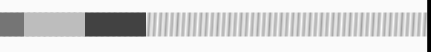

`Spacer`是一个用于在`Flex`中弹性留白的组件（没有child参数）。

~~~dart
Row(children: [
    Spacer(flex:5 ),
    Expanded(flex: 1),
    Expanded(flex: 1),
])
~~~

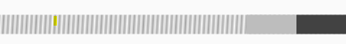


### LayoutBuilder

通过 LayoutBuilder，我们可以在**布局过程**中拿到父组件传递的约束信息，然后我们可以根据约束信息动态的构建不同的布局。

~~~dart
LayoutBuidler(
	builder: (BuildContext context, BoxConstraints constraints) {
        if (constraints.maxWidth < 200) {
            
        } else {
            
        }
    }
)
~~~

## Constraints Widget

这些约束组件可以改变父组件向子组件传递的约束

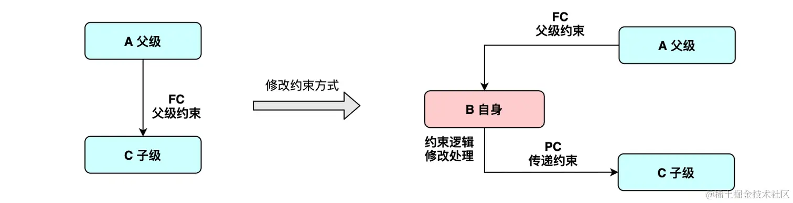

注意：这里的父级约束的含义应该是父组件向子组件所传递的约束。

### UnconstrainedBox	

通过`UnconstrainedBox`向子组件传递$[0, double.infinite)$约束。在debug模式下，如果`UnconstrainedBox`下的子组件大小超过其`UnconstrainedBox`父组件约束时，可能会因为溢出而报错。Release模式下，无任何报错信息。

### ConstrainedBox

`ConstrainedBox`**在满足自身约束的前提下**，对子组件添加额外的约束。


它的尺寸会尽量匹配子Widget的尺寸。如果孩子为空，那么它的大小计算如下：

- 在满足自身约束的情况下，对`_additionalConstraints`约束（由`constraints`属性设置）处理，处理后的结果取最小约束


### SizedBox

实际上，SizeBox是ConstrainedBox特例：

~~~java
SizedBox(
  width: 80.0,
  height: 80.0,
  child: ...
)
    
ConstrainedBox(
  constraints: BoxConstraints.tightFor(width: 80.0,height: 80.0),
  child: ...
)
~~~

其中，`tightFor`的定义如下：

~~~dart
const BoxConstraints.tightFor({
  double? width,
  double? height,
}) : minWidth = width ?? 0.0,
     maxWidth = width ?? double.infinity,
     minHeight = height ?? 0.0,
     maxHeight = height ?? double.infinity;
~~~

由此可见，在未设置width情况下，直接将SizedBox父组件的约束传递下去。

~~~dart
const SizedBox.shrink({ Key? key, Widget? child })
  : width = 0.0,
    height = 0.0,
    super(key: key, child: child);

const SizedBox.expand({ Key? key, Widget? child })
  : width = double.infinity,
    height = double.infinity,
    super(key: key, child: child);
~~~


它的尺寸会尽量匹配子Widget的尺寸。如果孩子为空，那么它的大小计算如下：

- 在满足自身约束的情况下，对`_additionalConstraints`约束（由`width`、`height`属性设置）处理，处理后的结果取最小约束


### LimitedBox

~~~dart
class LimitedBox extends SingleChildRenderObjectWidget {
  /// Creates a box that limits its size only when it's unconstrained.
  ///
  /// The [maxWidth] and [maxHeight] arguments must not be null and must not be negative.
  const LimitedBox({
    super.key,
    this.maxWidth = double.infinity,
    this.maxHeight = double.infinity,
    super.child,
  }) : assert(maxWidth >= 0.0),
       assert(maxHeight >= 0.0);
~~~

从 `LimitedBox` 的构造方法中可以看出，它只能限制宽高的最大值。如果孩子不为空，那么尺寸尽可能地匹配子组件的大小。否则取最小约束

### FractionallySizedBox

~~~dart
class FractionallySizedBox extends SingleChildRenderObjectWidget {
  const FractionallySizedBox({
    super.key,
    this.alignment = Alignment.center,
    this.widthFactor,
    this.heightFactor,
    super.child,
  }) : assert(widthFactor == null || widthFactor >= 0.0),
       assert(heightFactor == null || heightFactor >= 0.0);
~~~

`FractionallySizedBox`尽可能地扩展到父组件的最大约束上。`FractionallySizedBox`可将父级约束乘以一个倍数，所得到的结果再以紧约束传递给子组件。一般用来实现**「相对尺寸」**。

此外，还可以通过alignment属性设置子组件的对齐方式，默认是`Alignment.center`。

### OverflowBox

`OverflowBox`直接向组件传递任意约束，从而摆脱原父组件向子组件所传递的约束的限制：

~~~xml
class OverflowBox extends SingleChildRenderObjectWidget {
  /// Creates a widget that lets its child overflow itself.
  const OverflowBox({
    super.key,
    this.alignment = Alignment.center,
    this.minWidth,
    this.maxWidth,
    this.minHeight,
    this.maxHeight,
    super.child,
  });
~~~


### SizedOverflowBox

~~~dart
class SizedOverflowBox extends SingleChildRenderObjectWidget {
  /// Creates a widget of a given size that lets its child overflow.
  ///
  /// The [size] argument must not be null.
  const SizedOverflowBox({
    super.key,
    required this.size,
    this.alignment = Alignment.center,
    super.child,
  });
~~~

`SizedOverflowBox`直接将其父组件所传递的约束给子组件。通过`alignment`属性定义子`Widget`的对齐方式，可以溢出。

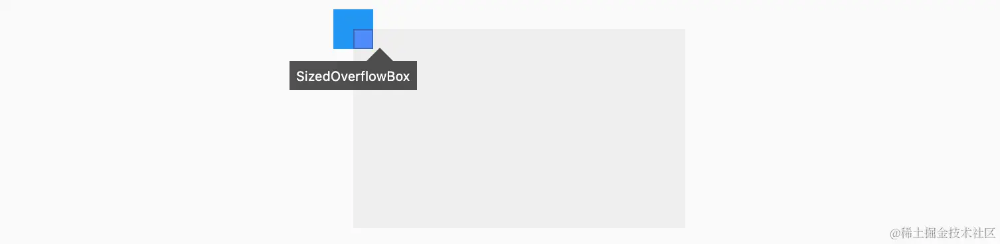

## 容器类Widget

### Padding

`Padding`可以给其子节点添加填充（留白），Padding将根据父组件所传递的约束以及padding属性计算出新的约束，并传递给子组件。

~~~dart
Padding({
  ...
  EdgeInsetsGeometry padding,
  Widget child,
})
~~~

`EdgeInsetsGeometry`是一个抽象类，开发中，我们一般都使用`EdgeInsets`类

我们看看`EdgeInsets`提供的便捷方法：

- `fromLTRB(double left, double top, double right, double bottom)`：分别指定四个方向的填充。
- `all(double value)` : 所有方向均使用相同数值的填充。
- `only({left, top, right ,bottom })`：可以设置具体某个方向的填充(可以同时指定多个方向)。
- `symmetric({ vertical, horizontal })`：用于设置对称方向的填充，`vertical`指`top`和`bottom`，`horizontal`指`left`和`right`。

### SafeArea

SafeArea组件可以保证子组件不会被渲染到屏幕缺陷位置内。

~~~dart
const SafeArea({
  //...
	this.minimum = EdgeInsets.zero,
	required this.child,
});
~~~

- `minimum`：当屏幕无缺陷，或缺陷的尺寸小于最小留白尺寸时就会被采用。


### Transform

`Transform`可以**在其子组件绘制时**，对其应用一些矩阵变换。`Transform`的变换是应用在绘制阶段，而并不是应用在布局阶段。并且任何一个3D变换都可以用4*4矩阵来表达。

> 关于矩阵变换的相关内容属于线性代数范畴，在此不做讨论。


`Transform.translate`接收一个`offset`参数，可以在绘制时沿`x`、`y`轴对子组件平移指定的距离。

`Transform.rotate`可以对子组件进行旋转变换

`Transform.scale`可以对子组件进行缩小或放大


~~~dart
Transform.scale(
    scale: 1.5, 			//放大到1.5倍
    child: Text("Hello world")
);

Transform.rotate(
    angle:math.pi/2 ,		//旋转90度
    child: Text("Hello world"),
);

Transform.translate(
    offset: Offset(-20.0, -5.0),	//平移
    child: Text("Hello world"),
);
~~~

### RotatedBox

`RotatedBox`和`Transform.rotate`功能相似，它们都可以对子组件进行旋转变换，但是有一点不同：`RotatedBox`的变换是在layout阶段，会影响在子组件的位置和大小。

```dart
RotatedBox(
    quarterTurns: 1, //旋转90度(1/4圈)
    child: Text("Hello world"),
),
```

### Clip

Flutter中提供了一些剪裁组件，用于对组件进行剪裁。剪裁是在绘制阶段进行，而不是在layout阶段进行。

| 剪裁Widget | 默认行为                                                 |
| ---------- | -------------------------------------------------------- |
| ClipOval   | 子组件为正方形时剪裁成内贴圆形；为矩形时，剪裁成内贴椭圆 |
| ClipRRect  | 将子组件剪裁为圆角矩形                                   |
| ClipRect   | 默认剪裁掉子组件布局空间之外的绘制内容（溢出部分剪裁）   |
| ClipPath   | 按照自定义的路径剪裁                                     |


ClipPath的clipper属性接受一个`CustomClipper`类型的对象。

~~~dart
abstract class CustomClipper<T> extends Listenable {
  T getClip(Size size);
  bool shouldReclip(covariant CustomClipper<T> oldClipper);
}
~~~


### FittedBox

FittedBox在布局子组件时会忽略其父组件所传递的约束，而直接传递给子组件的约束为无边界。

```dart
const FittedBox({
  Key? key,
  this.fit = BoxFit.contain, 			// 适配方式
  this.alignment = Alignment.center, 	// 对齐方式
  this.clipBehavior = Clip.none, 		// 是否剪裁
  Widget? child,
})
```

fit属性值如下：

- BoxFit. contain（默认值）：

  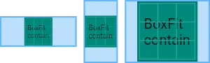

- BoxFit.fill：

- BoxFit.cover：

  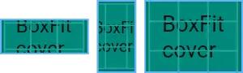

- BoxFit.fitHeight

  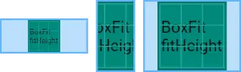

- BoxFit.fitWidth

  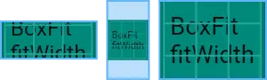

- BoxFit.none

  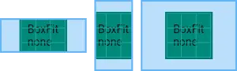

- BoxFit.scaleDown

  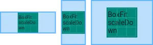


### Container

Container组件是一个结合了定义尺寸、形状、背景颜色、装饰、间距、对齐等多功能于一身的组件。虽然这些功能都有对应的组件，而Container的实现也是利用这些组件。

~~~dart
Container({
  this.alignment,					// 子组件的对齐方式
  this.padding, 					// 内边距
  Color color, 						// 背景色，默认是透明的
  Decoration decoration, 			// 背景装饰。包括形状、阴影、边框、渐变色填充等
  Decoration foregroundDecoration, 	// 前景装饰
  double width,						// 宽度
  double height, 					// 高度
  BoxConstraints constraints, 		// 布局约束
  this.margin,						// 外边距
  this.transform, 					// 变换
  this.child,						// 子组件
  ...
})
~~~

- Alignment(double x, double y)，其中x、y分别对应横轴和纵轴方向的位置，取值范围为[-1.0, 1.0]。左上对齐既可以用Alignment(-1.0, -1.0)，也可以用Alignment.topLeft

- EdgeInsets. fromLTRB（double left，double top，double right，double bottom）即依次单独设置左、上、右、下这4个方向分别留白多少逻辑像素。EdgeInsets. all（doublevalue）同时设置4个方向的值。EdgeInsets. only（）方法，传入需要设置的方向，省略的方向则自动为0。

  ~~~dart
  EdgeInsets.only(left : 16.0, bottom : 80);
  EdgeInsets.all(16.0)
  EdgeInsets.formLTRB(10, 20, 10, 20);
  ~~~

- transform接收一个4×4的矩阵。三维物体的任意缩放、平移和旋转都可以通过一个4× 4矩阵完成。


Container的布局行为十分复杂：推荐查阅官方文档https://api.flutter.dev/flutter/widgets/Container-class.html

- 没有子组件
  - 根据自身约束、width、height、constraints属性来计算一个临时约束
  - 如果最终计算出的约束有界，则尽量占满
  - 如果最终计算出的约束无界，则尽量缩小
- 有子组件
  - 根据自身约束、width、height、constraints属性计算出一个紧约束，并传递给子组件
  - 但若提供了alignment属性，则尺寸扩大到父组件的最大约束，为对齐child创造条件；
  - 又若某一维度上约束无界，则依然只能尽量匹配child尺寸。


### AspectRatio

计算方式：

~~~dart
@override
void performLayout() {
    size = computeDryLayout(constraints);
    if (child != null) {
        // 向子组件传递一个紧约束，大小为自身的尺寸。
      	child!.layout(BoxConstraints.tight(size));
    }
}

@override
Size computeDryLayout(BoxConstraints constraints) {
	return _applyAspectRatio(constraints);
}
~~~

~~~dart
 Size _applyAspectRatio(BoxConstraints constraints) {
    if (constraints.isTight) {
      return constraints.smallest;
    }

    double width = constraints.maxWidth;
    double height;


    if (width.isFinite) {
      height = width / _aspectRatio;
    } else {
      height = constraints.maxHeight;
      width = height * _aspectRatio;
    }

    if (width > constraints.maxWidth) {
      width = constraints.maxWidth;
      height = width / _aspectRatio;
    }

    if (height > constraints.maxHeight) {
      height = constraints.maxHeight;
      width = height * _aspectRatio;
    }

    if (width < constraints.minWidth) {
      width = constraints.minWidth;
      height = width / _aspectRatio;
    }

    if (height < constraints.minHeight) {
      height = constraints.minHeight;
      width = height * _aspectRatio;
    }

    // 将width、height修正到约束范围内
    return constraints.constrain(Size(width, height));
  }
~~~


~~~dart
AspectRatio(
    aspectRatio: 16 / 9,
    child: Container(
      	color: Colors.green,
    ),
),
~~~


### OffStage

~~~dart
Offstage(
  offstage: true,
  child: child
),
~~~

offstage并不是通过插入或者删除widget tree的节点来实现显示隐藏效果，而是通过不绘制child来实现的。此时使用GlobalKey等方式可以获取它的尺寸。

### Visbility

相比较`Offstage`组件，`Visbility`是从widget tree中彻底将其子组件移除，来实现显示隐藏效果的。

~~~dart
const Visibility({
    required this.child,
    this.replacement = const SizedBox.shrink(),
    this.visible = true,
    this.maintainState = false,
    this.maintainAnimation = false,
    this.maintainSize = false,
    this.maintainInteractivity = false,
})
~~~

- `maintainState`：是否需要保持状态。如果不需要保存状态，那么将使用`replacement`参数所指定的`widget`代替该`child`

- `maintainAnimation`：是否保持动画。如果设置为false，Visibility组件会调用TickerMode组件将动画控制器所依赖的ticker关闭。如果要设置为true，那么maintainState必须设置为true。

- `maintainSize`：是否保持尺寸。如果要设置为`true`，那么`maintainAnimation`必须设置为`true`。

- `maintainInteractivity`：是否保持交互。如果要设置为`true`，那么`maintainSize`必须设置为`true`。

### DecoratedBox

~~~dart
const DecoratedBox({
  Decoration decoration,
  DecorationPosition position = DecorationPosition.background,
  Widget? child
})
~~~

- `decoration`：代表将要绘制的装饰，它的类型为`Decoration`。`Decoration`是一个抽象类，它定义了一个接口 `createBoxPainter()`，子类的主要职责是需要通过实现它来创建一个画笔，该画笔用于绘制装饰。
- `position`：此属性决定在哪里绘制`Decoration`
  - `background`：在子组件之后绘制，即背景装饰。
  - `foreground`：在子组件之上绘制，即前景。


`BoxDecoration`类，它是一个Decoration的子类，实现了常用的装饰元素的绘制。

~~~dart
BoxDecoration({
  Color color, 		//颜色
  DecorationImage image,//图片
  BoxBorder border, //边框
  BorderRadiusGeometry borderRadius, //圆角
  List<BoxShadow> boxShadow, //阴影,可以指定多个
  Gradient gradient, //渐变
  BlendMode backgroundBlendMode, //背景混合模式
  BoxShape shape = BoxShape.rectangle, //形状
})
~~~


### RepaintBoundary

~~~dart
RepaintBoundary(
	child : MyExpensiveWidget(),
)
~~~

Flutter会将RepaintBoundary单独绘制在一个新图层上。这样当其他图层平移（如被嵌入于滚动列表中）或缩放（如受到Transform组件影响）时，Flutter就可以直接移动或缩放整个图层，而不再需要重新绘制它的内容了。

实际上，Flutter框架中不少组件已经自动添加了RepaintBoundary以提升性能。实战中，需要开发者手动添加RepaintBoundary的控件一般是CustomPaint等。

此外，RepaintBoundary对象的toImage方法可以输出图层数据。


### Flow

`Flow` 也是可以用于自定义多子组件布局的，相对于 `CustomMultiChildLayout` 来说，它更加简洁，不需要通过 `LayoutId` 来配合。其中，子级的布局逻辑（绘制）是通过`FlowDelegate`代理类来实现的，定义如下：

~~~dart
abstract class FlowDelegate {
  const FlowDelegate({ Listenable? repaint }) : _repaint = repaint;

  // 可监听对象，我们可以接收可监听对象的变更通知来重新进行绘制（paintChildren）
  final Listenable? _repaint;

  Size getSize(BoxConstraints constraints) => constraints.biggest;
    
  BoxConstraints getConstraintsForChild(int i, BoxConstraints constraints) => constraints;

  void paintChildren(FlowPaintingContext context);


  bool shouldRelayout(covariant FlowDelegate oldDelegate) => false;


  bool shouldRepaint(covariant FlowDelegate oldDelegate);

}

abstract class FlowPaintingContext {
  Size get size; // 父亲尺寸
  
  int get childCount;//孩子个数
  
  Size getChildSize(int i);//第i个孩子尺寸
  
  //绘制孩子
  void paintChild(int i, { Matrix4 transform, double opacity = 1.0 });
}
~~~

下面给出一个例子：

~~~dart
Flow(
  delegate : MyDelegate(),
  children: [
    FlutterLogo(size : 48),
    FlutterLogo(size : 48),
  ],
);


class MyDelegate extends FlowDelegate {
    
  //接收父组件的约束，然后向父组件报告自身大小
  @override
  Size getSize(BoxConstraints constraints) {
    return constraints.biggest;
  }

  @override
  BoxConstraints getConstraintsForChild(int i, BoxConstraints constraints) {
    //默认情况下会直接将Flow的父级约束转达给自己的每个子组件
    return super.getConstraintsForChild(i, constraints);
  }

  @override
  void paintChildren(FlowPaintingContext context) {
    final size0 = context.getChildSize(0)!;
    final size1 = context.getChildSize(1)!;

    //直接绘制该子组件
    context.paintChild(0);
      
    //使用transform代替子组件的布局
    context.paintChild(1,
      transform : Matrix4.identity()
        ..translate(size0.width, size0.height)
        ..rotateZ(3.14 / 4)
        ..scale(2.0),

      opacity: .5,
    );
  }

  @override
   
  bool shouldRepaint(_) => false;
}
~~~


### IntrinsicHeight

`IntrinsicWidth`根据其子元素的宽度（具体来说是`computeMinIntrinsicWidth`等方法的返回值）来确定自身的宽度。

`IntrinsicWidth` 对应的渲染对象`RenderIntrinsicWidth`在`performLayout`方法中会调用各个子渲染对象的`computeMinIntrinsicWidth`等方法，而且这些方法只会被`RenderIntrinsicWidth`调用。


它的布局算法如下：

~~~dart
@override
void performLayout() {
    size = _computeSize(
        layoutChild: ChildLayoutHelper.layoutChild,
        constraints: constraints,
    );
}


  Size _computeSize({required ChildLayouter layoutChild, required BoxConstraints constraints}) {
    if (child != null) {
      if (!constraints.hasTightWidth) {
        final double width = child!.getMaxIntrinsicWidth(constraints.maxHeight);
        constraints = constraints.tighten(width: _applyStep(width, _stepWidth));
      }
      // 当自身约束为紧约束时，IntrinsicHeight无效
      return layoutChild(child!, constraints);
    } else {
      return constraints.smallest;
    }
  }
~~~


如果有子组件`$A`且自身约束为松约束，那么就会调用

1. `$A`的`getMaxIntrinsicHeight`，
2. `$A`的`computeMaxIntrinsicHeight`方法。
3. `$A`的子组件的`getMaxIntrinsicHeight`方法。

也就是说 `IntrinsicHeight` 会触发以其为根节点的渲染树上的所有节点的`getMaxIntrinsicHeight` 方法来获取尺寸。在最坏情况下有$O(N^2)$的时间复杂度，其中$N$为子树的深度。


### CustomSingleChildLayout

`CustomSingleChildLayout`组件的最重要的属性就是`SingleChildLayoutDelegate`，它用于控制子级的布局逻辑。它是一个抽象类，定义如下：

~~~dart
abstract class SingleChildLayoutDelegate {
  const SingleChildLayoutDelegate({ Listenable? relayout }) : _relayout = relayout;

  // 可监听对象，我们可以接收可监听对象的变更通知来重新进行布局
  // 通过_relayout.value来访问对象
  // 这个对象可以是一个Animation，也可以是一个ValueNotifier
  final Listenable? _relayout;

  // 设置该组件的大小
  Size getSize(BoxConstraints constraints) => constraints.biggest;
    
  // 设置子组件的约束
  BoxConstraints getConstraintsForChild(BoxConstraints constraints) => constraints;

  // 设置子组件的位置
  Offset getPositionForChild(Size size, Size childSize) => Offset.zero;

  // 是否需要重新布局
  bool shouldRelayout(covariant SingleChildLayoutDelegate oldDelegate);
}
~~~

在布局时，`RenderCustomSingleChildLayoutBox`通过`_getSize`方法来设置组件的大小。

~~~dart
Size _getSize(BoxConstraints constraints) {
	return constraints.constrain(_delegate.getSize(constraints));
}
~~~

可以看到`SingleChildLayoutDelegate`对象中的`getSize`方法所返回的大小，受到自身约束的限制。


 下面我们给出一个根据极坐标来布局子组件的`CustomSingleChildLayout`

~~~dart
class Polar {
  final double len;
  final double deg;

  Polar({required this.len, required this.deg});
}

class PolarLayoutDelegate extends SingleChildLayoutDelegate {
  final ValueListenable<Polar> polar;

  PolarLayoutDelegate({required this.polar}) : super(relayout: polar);

  @override
  bool shouldRelayout(covariant PolarLayoutDelegate oldDelegate) =>
      oldDelegate.polar != polar;

  // 在尽可能匹配自身约束的最大值情况下，维持正方形的形状
  @override
  Size getSize(BoxConstraints constraints) {
    final radius = constraints.biggest.shortestSide;
    return Size(radius, radius);
  }

  @override
  Offset getPositionForChild(Size size, Size childSize) {
    double r = size.width / 2 * polar.value.len;
    Offset center = Offset(size.width / 2, size.height / 2);
    Offset offset = Offset(r * cos(polar.value.deg), r * sin(polar.value.deg));
    Offset childSizeOffset = Offset(childSize.width / 2, childSize.height / 2);
    return center + offset - childSizeOffset;
  }

  // 向子组件传递一个松约束
  @override
  BoxConstraints getConstraintsForChild(BoxConstraints constraints) {
    return constraints.loosen();
  }
}
~~~


### CustomMultiChildLayout

一般来说，多子布局通过 `Flex` 、`Wrap`、`Stack` 都能完成，并没有自定义 `CustomSingleChildLayout` 的必要。`CustomMultiChildLayout` 中是通过 `MultiChildLayoutDelegate` 代理类进行自定义布局的。这是一个抽象类，定义如下：

~~~dart
abstract class MultiChildLayoutDelegate {
  MultiChildLayoutDelegate({ Listenable? relayout }) : _relayout = relayout;

  final Listenable? _relayout;

  Size getSize(BoxConstraints constraints) => constraints.biggest;

  void performLayout(Size size);

  bool shouldRelayout(covariant MultiChildLayoutDelegate oldDelegate);
    
  
  void positionChild(Object childId, Offset offset) {
      // ... 
  }
  
  Size layoutChild(Object childId, BoxConstraints constraints) {
      // ... 
  }
    
   bool hasChild(Object childId) {
       // ...
   }
}
~~~

在通过 `CustomMultiChildLayout` 实现自定义布局时，需要提前定义子组件所在的部位：

1. 自定义枚举类型来表示有哪些部位
2. 使用`LayoutId` 组件，用枚举值设置其`id`属性
3. 在 代理类的`performLayout` 方法中，根据枚举值对子组件进行布局

例如，我们定义一个四角布局


首先定义枚举类型，来表示这四个部位。

~~~dart
enum CornerType{
  topLeft,
  topRight,
  bottomLeft,
  bottomRight
}
~~~

使用`CornerCustomMultiChildLayout`代理类

~~~dart
CustomMultiChildLayout(
  delegate: CornerCustomMultiChildLayout(),
  children: [
    LayoutId(id: CornerType.topLeft, child: Box50(Colors.red)),
    LayoutId(id: CornerType.topRight, child: Box50(Colors.yellow)),
    LayoutId(id: CornerType.bottomLeft, child: Box50(Colors.blue)),
    LayoutId(id: CornerType.bottomRight, child: Box50(Colors.green)),
  ],
),
~~~

其中，代理类的实现逻辑如下：

~~~dart
class CornerCustomMultiChildLayout extends MultiChildLayoutDelegate {
  final EdgeInsets padding;

  CornerCustomMultiChildLayout({this.padding = EdgeInsets.zero});

  @override
  void performLayout(Size size) {
    BoxConstraints childBoxConstraints = BoxConstraints.loose(size);
    if (hasChild(CornerType.topLeft)) {
      layoutChild(CornerType.topLeft, childBoxConstraints);
      positionChild(
          CornerType.topLeft, Offset.zero.translate(padding.left, padding.top));
    }
    if (hasChild(CornerType.topRight)) {
      var childSize = layoutChild(CornerType.topRight, childBoxConstraints);
      positionChild(
          CornerType.topRight,
          Offset(size.width - childSize.width, 0)
              .translate(-padding.right, padding.top));
    }
    if (hasChild(CornerType.bottomLeft)) {
      var childSize = layoutChild(CornerType.bottomLeft, childBoxConstraints);
      positionChild(
          CornerType.bottomLeft,
          Offset(0, size.height - childSize.height)
              .translate(padding.left, -padding.bottom));
    }
    if (hasChild(CornerType.bottomRight)) {
      var childSize = layoutChild(CornerType.bottomRight, childBoxConstraints);
      positionChild(
          CornerType.bottomRight,
          Offset(size.width - childSize.width, size.height - childSize.height)
              .translate(-padding.right, -padding.bottom));
    }
  }

  @override
  bool shouldRelayout(CornerCustomMultiChildLayout oldDelegate) =>
      oldDelegate.padding != padding;
}
~~~


