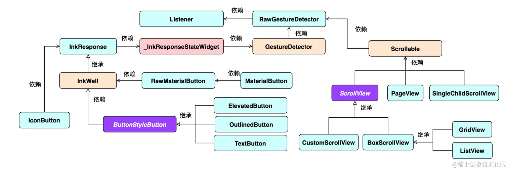
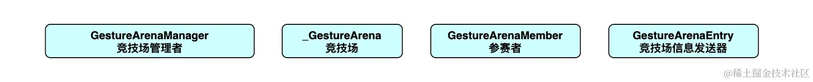
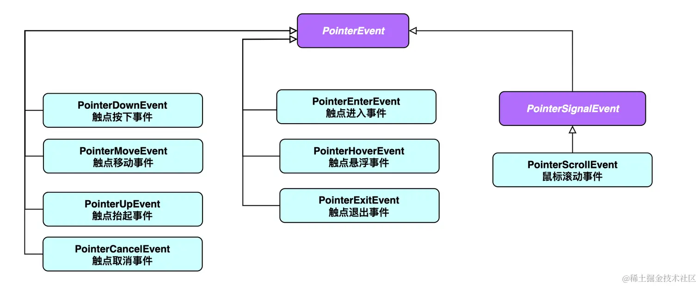
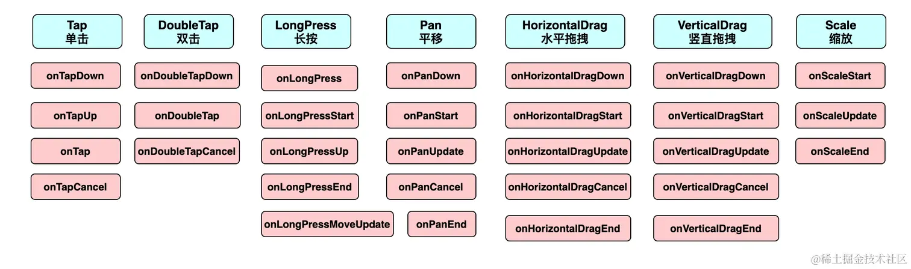
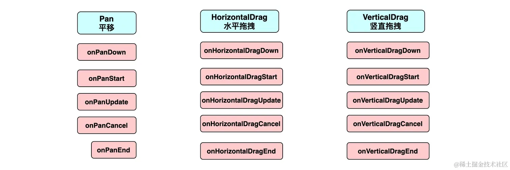

# 手势

[TOC]

## 概述

一个组件可以响应多种手势。如果同时有多个手势可以响应，那么必须只有一个手势胜出。而仲裁逻辑要涉及到以下类型：

- `GestureArenaManager`
- `_GestureArena` 
- `GestureArenaMember` 
- `GestureArenaEntry` 

手势事件由平台接收，然后通过 `GestureBinding` 传递给 Flutter 端。Flutter引擎会解析平台所传入的事件，然后构建出`PointerEvent` 对象，最后分发给手势识别器以及需要被通知的`RenderObject`。

## GestureDetector的手势

### 单击

单击有如下有四个回调事件：

~~~dart
onTap: 	      void Function();
onTapCancel:  void Function();
onTapDown:    void Function(TapDownDetails details);
onTapUp:      void Function(TapUpDetails details);
~~~

其中，`TapDownDetails` 和 `TapUpDetails` 的成员如下：

| 属性名           | 类型                | 介绍                         |
| ---------------- | ------------------- | ---------------------------- |
| `localPosition`  | `Offset`            | 触点相对于组件左上角的偏移量 |
| `globalPosition` | `Offset`            | 触点相对于屏幕左上角的偏移量 |
| `kind`           | `PointerDeviceKind` | 触点设备类型                 |

而`PointerDeviceKind` 是一个枚举类，包括下面五个属性：

~~~dart
enum PointerDeviceKind {
  touch, 			// 点击
  mouse, 			// 鼠标
  stylus, 			// 针尖笔
  invertedStylus, 	// 反向针尖笔
  unknown 			// 未知
}
~~~

单击成功时事件的顺序：`onTapDown`、`onTapUp`、`onTap`

单击失败时事件的顺序：`onTapDown`、`onTapCancel`

### 双击

双击事件有如下有三个回调事件：

~~~dart
onDoubleTap:  		void Function();
onDoubleTapDown: 	void Function(TapDownDetails details);
onDoubleTapCancel:	void Function();
~~~

### 长按

长按有如下有五个回调事件：

~~~dart
onLongPressStart:       void Function(LongPressStartDetails details);
onLongPress: 	        void Function();
onLongPressMoveUpdate:  void Function(LongPressMoveUpdateDetails details);
onLongPressEnd:			void Function(LongPressEndDetails details);
onLongPressUp:			void Function();
~~~

`LongPressStartDetails`的成员如下：

| 属性名           | 类型     | 介绍                         |
| ---------------- | -------- | ---------------------------- |
| `localPosition`  | `Offset` | 触点相对于组件左上角的偏移量 |
| `globalPosition` | `Offset` | 触点相对于屏幕左上角的偏移量 |

`LongPressEndDetails`的成员如下：

| 属性名           | 类型       | 介绍                         |
| ---------------- | ---------- | ---------------------------- |
| `localPosition`  | `Offset`   | 触点相对于组件左上角的偏移量 |
| `globalPosition` | `Offset`   | 触点相对于屏幕左上角的偏移量 |
| `velocity`       | `Velocity` | 结束时的速度信息             |

`LongPressMoveUpdateDetails`的成员如下：

| 属性名                  | 类型     | 介绍                                   |
| ----------------------- | -------- | -------------------------------------- |
| `localPosition`         | `Offset` | 触点相对于`组件左上角`的偏移量         |
| `globalPosition`        | `Offset` | 触点相对于`屏幕左上角`的偏移量         |
| `offsetFromOrigin`      | `Offset` | 长按开始触点开始到当前触点(全局)偏移量 |
| `localOffsetFromOrigin` | `Offset` | 长按开始触点开始到当前触点(相对)偏移量 |

首先 `onLongPressStart` 执行；然后 `onLongPress` 执行；随着触点的移动，会不断执行 `onLongPressMoveUpdate`；最后抬手时，先执行 `onLongPressEnd`，再执行 `onLongPressUp` 标志着一次长按事件的完成。

### 平移

平移有如下有五个回调事件：

~~~dart
onPanDown: 		void Function(DragDownDetails details);
onPanStart: 	void Function(DragStartDetails details);
onPanUpdate:  	void Function(DragUpdateDetails details);
onPanEnd:		void Function(DragEndDetails details);
onPanCancel:	void Function();
~~~

`DragDownDetails`的成员如下：

| 属性名           | 类型     | 介绍                         |
| ---------------- | -------- | ---------------------------- |
| `localPosition`  | `Offset` | 触点相对于组件左上角的偏移量 |
| `globalPosition` | Offset   | 触点相对于屏幕左上角的偏移量 |

`DragStartDetails`的成员如下：

| 属性名            | 类型                | 介绍                         |
| ----------------- | ------------------- | ---------------------------- |
| `localPosition`   | `Offset`            | 触点相对于组件左上角的偏移量 |
| `globalPosition`  | `Offset`            | 触点相对于屏幕左上角的偏移量 |
| `sourceTimeStamp` | `Duration`          | 拖拽开始的时间戳             |
| `kind`            | `PointerDeviceKind` | 触点设备类型                 |

`DragUpdateDetails`的成员如下：

| 属性名            | 类型       | 介绍                                       |
| ----------------- | ---------- | ------------------------------------------ |
| `localPosition`   | `Offset`   | 触点相对于`组件左上角`的偏移量             |
| `globalPosition`  | `Offset`   | 触点相对于`屏幕左上角`的偏移量             |
| `delta`           | `Offset`   | 每次执行时的偏移量                         |
| `sourceTimeStamp` | `Duration` | 移动时的时间戳                             |
| `primaryDelta`    | `double`   | 主方轴向上的初始偏移量(如未指定，默认null) |

DragEndDetails的成员如下：

| 属性名            | 类型       | 介绍                                     |
| ----------------- | ---------- | ---------------------------------------- |
| `velocity`        | `Velocity` | 速度信息                                 |
| `primaryVelocity` | `double`   | 主方轴向上的初始速度(如未指定，默认null) |

首先 `onPanDown` 执行；然后 `onPanStart` 执行；随着触点的移动，会不断执行 `onPanUpdate`；最后抬手时，执行 `onPanUpdate`，标志着一次平移事件的完成。

此外，`HorizontalDrag` 和 `VerticalDrag` 可以视为 `Pan` 事件在水平和竖直方向的特例

需要注意的是：

- 如果只监听某一方向的拖拉（`HorizontalDrag` 或 `VerticalDrag`），那么无论用户的手势是否具有正确的方向性，都会执行回调函数。

- 已经监听了`pan`事件，而又继续监听`HorizontalDrag` 或 `VerticalDrag`事件。

  假设这里监听`HorizontalDrag`事件，若用户的平移手势有明显的水平倾向，则会执行`HorizontalDrag`的回调函数，否则会执行`pan`的回调函数。

- Horizontal and vertical drag callbacks cannot be used simultaneously because a combination of a horizontal and vertical drag is a pan. Use the pan callbacks instead.

### 缩放

缩放有如下有三个回调事件：

~~~dart
onScaleStart: 	void Function(ScaleStartDetails details);
onScaleUpdate: 	void Function(ScaleUpdateDetails details);
onScaleEnd:  	void Function(ScaleEndDetails details);
~~~

`ScaleStartDetails`的成员如下：

| 属性名            | 类型     | 介绍                                 |
| ----------------- | -------- | ------------------------------------ |
| `focalPoint`      | `Offset` | 触点与屏幕接触的焦点(平面左上角)     |
| `localFocalPoint` | `Offset` | 触点与屏幕接触的初始焦点(组件左上角) |
| `pointerCount`    | `int`    | 触点个数                             |

`ScaleUpdateDetails`的成员如下：

| 属性名            | 类型     | 介绍                                 |
| ----------------- | -------- | ------------------------------------ |
| `focalPoint`      | `Offset` | 触点与屏幕接触的焦点(平面左上角)     |
| `localFocalPoint` | `Offset` | 触点与屏幕接触的初始焦点(组件左上角) |
| `pointerCount`    | `int`    | 触点个数                             |
| `scale`           | `double` | 缩放比例                             |
| `horizontalScale` | `double` | 水平缩放比例                         |
| `verticalScale`   | `double` | 竖直缩放比例                         |
| `rotation`        | `double` | 旋转角度(弧度)                       |

`DragEndDetails`的成员如下：

| 属性名         | 类型       | 介绍     |
| -------------- | ---------- | -------- |
| `velocity`     | `Velocity` | 速度信息 |
| `pointerCount` | `int`      | 触点个数 |

需要指出的是，**Pan and scale callbacks cannot be used simultaneously because scale is a superset of pan. Use the scale callbacks instead**

## MouseRegion

鼠标区域组件可用于监听与鼠标相关的事件，用法与Listener相似

~~~dart
const MouseRegion({
    super.key,
    this.onEnter,						//鼠标进入该区域
    this.onExit,						//鼠标退出该区域
    this.onHover,						//鼠标在该区域移动
    this.cursor = MouseCursor.defer,	  //鼠标的图标
    this.opaque = true,
    this.hitTestBehavior,
    super.child,
});
~~~

