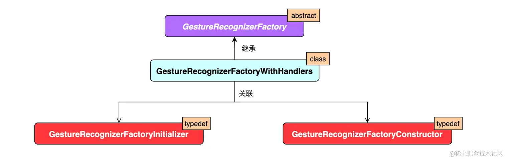
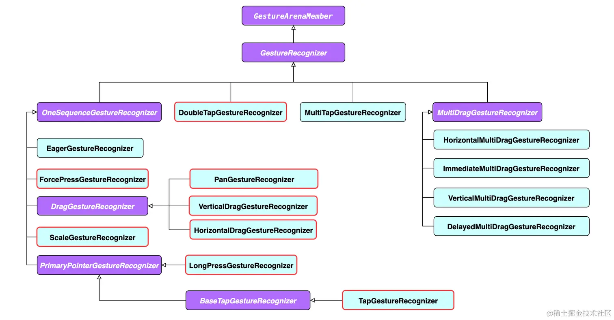
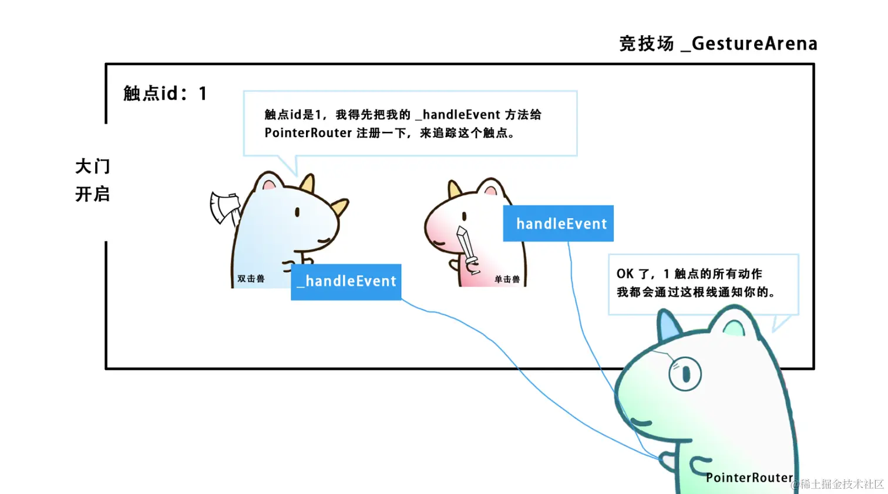

# 手势原理

[TOC]

## 概述


一个组件可以响应多种手势。如果同时有多个手势可以响应，那么必须只有一个手势胜出。而仲裁逻辑要涉及到以下类型：

- `GestureArenaManager`
- `_GestureArena` 
- `GestureArenaMember` 
- `GestureArenaEntry` 


- 

手势事件由平台接收，然后通过 `GestureBinding` 传递给 Flutter 端。Flutter引擎会解析平台所传入的事件，然后构建出`PointerEvent` 对象，最后分发给手势识别器以及需要被通知的`RenderObject`。


## GestureDetector的手势


### 单击

单击有如下有四个回调事件：

~~~dart
onTap: 	      void Function();
onTapCancel:  void Function();
onTapDown:    void Function(TapDownDetails details);
onTapUp:      void Function(TapUpDetails details);
~~~

其中，`TapDownDetails` 和 `TapUpDetails` 的成员如下：

| 属性名           | 类型                | 介绍                         |
| ---------------- | ------------------- | ---------------------------- |
| `localPosition`  | `Offset`            | 触点相对于组件左上角的偏移量 |
| `globalPosition` | `Offset`            | 触点相对于屏幕左上角的偏移量 |
| `kind`           | `PointerDeviceKind` | 触点设备类型                 |

而`PointerDeviceKind` 是一个枚举类，包括下面五个属性：

~~~dart
enum PointerDeviceKind {
  touch, 			// 点击
  mouse, 			// 鼠标
  stylus, 			// 针尖笔
  invertedStylus, 	// 反向针尖笔
  unknown 			// 未知
}
~~~

单击成功时事件的顺序：`onTapDown`、`onTapUp`、`onTap`

单击失败时事件的顺序：`onTapDown`、`onTapCancel`

### 双击

双击事件有如下有三个回调事件：

~~~dart
onDoubleTap:  		void Function();
onDoubleTapDown: 	void Function(TapDownDetails details);
onDoubleTapCancel:	void Function();
~~~

### 长按

长按有如下有五个回调事件：

~~~dart
onLongPressStart:       void Function(LongPressStartDetails details);
onLongPress: 	        void Function();
onLongPressMoveUpdate:  void Function(LongPressMoveUpdateDetails details);
onLongPressEnd:			void Function(LongPressEndDetails details);
onLongPressUp:			void Function();
~~~

`LongPressStartDetails`的成员如下：

| 属性名           | 类型     | 介绍                         |
| ---------------- | -------- | ---------------------------- |
| `localPosition`  | `Offset` | 触点相对于组件左上角的偏移量 |
| `globalPosition` | `Offset` | 触点相对于屏幕左上角的偏移量 |

`LongPressEndDetails`的成员如下：

| 属性名           | 类型       | 介绍                         |
| ---------------- | ---------- | ---------------------------- |
| `localPosition`  | `Offset`   | 触点相对于组件左上角的偏移量 |
| `globalPosition` | `Offset`   | 触点相对于屏幕左上角的偏移量 |
| `velocity`       | `Velocity` | 结束时的速度信息             |

`LongPressMoveUpdateDetails`的成员如下：

| 属性名                  | 类型     | 介绍                                   |
| ----------------------- | -------- | -------------------------------------- |
| `localPosition`         | `Offset` | 触点相对于`组件左上角`的偏移量         |
| `globalPosition`        | `Offset` | 触点相对于`屏幕左上角`的偏移量         |
| `offsetFromOrigin`      | `Offset` | 长按开始触点开始到当前触点(全局)偏移量 |
| `localOffsetFromOrigin` | `Offset` | 长按开始触点开始到当前触点(相对)偏移量 |

首先 `onLongPressStart` 执行；然后 `onLongPress` 执行；随着触点的移动，会不断执行 `onLongPressMoveUpdate`；最后抬手时，先执行 `onLongPressEnd`，再执行 `onLongPressUp` 标志着一次长按事件的完成。

### 平移

平移有如下有五个回调事件：

~~~dart
onPanDown: 		void Function(DragDownDetails details);
onPanStart: 	void Function(DragStartDetails details);
onPanUpdate:  	void Function(DragUpdateDetails details);
onPanEnd:		void Function(DragEndDetails details);
onPanCancel:	void Function();
~~~

`DragDownDetails`的成员如下：

| 属性名           | 类型     | 介绍                         |
| ---------------- | -------- | ---------------------------- |
| `localPosition`  | `Offset` | 触点相对于组件左上角的偏移量 |
| `globalPosition` | Offset   | 触点相对于屏幕左上角的偏移量 |

`DragStartDetails`的成员如下：

| 属性名            | 类型                | 介绍                         |
| ----------------- | ------------------- | ---------------------------- |
| `localPosition`   | `Offset`            | 触点相对于组件左上角的偏移量 |
| `globalPosition`  | `Offset`            | 触点相对于屏幕左上角的偏移量 |
| `sourceTimeStamp` | `Duration`          | 拖拽开始的时间戳             |
| `kind`            | `PointerDeviceKind` | 触点设备类型                 |

`DragUpdateDetails`的成员如下：

| 属性名            | 类型       | 介绍                                       |
| ----------------- | ---------- | ------------------------------------------ |
| `localPosition`   | `Offset`   | 触点相对于`组件左上角`的偏移量             |
| `globalPosition`  | `Offset`   | 触点相对于`屏幕左上角`的偏移量             |
| `delta`           | `Offset`   | 每次执行时的偏移量                         |
| `sourceTimeStamp` | `Duration` | 移动时的时间戳                             |
| `primaryDelta`    | `double`   | 主方轴向上的初始偏移量(如未指定，默认null) |

DragEndDetails的成员如下：

| 属性名            | 类型       | 介绍                                     |
| ----------------- | ---------- | ---------------------------------------- |
| `velocity`        | `Velocity` | 速度信息                                 |
| `primaryVelocity` | `double`   | 主方轴向上的初始速度(如未指定，默认null) |

首先 `onPanDown` 执行；然后 `onPanStart` 执行；随着触点的移动，会不断执行 `onPanUpdate`；最后抬手时，执行 `onPanUpdate`，标志着一次平移事件的完成。


此外，`HorizontalDrag` 和 `VerticalDrag` 可以视为 `Pan` 事件在水平和竖直方向的特例


需要注意的是：

- 如果只监听某一方向的拖拉（`HorizontalDrag` 或 `VerticalDrag`），那么无论用户的手势是否具有正确的方向性，都会执行回调函数。

- 已经监听了`pan`事件，而又继续监听`HorizontalDrag` 或 `VerticalDrag`事件。

  假设这里监听`HorizontalDrag`事件，若用户的平移手势有明显的水平倾向，则会执行`HorizontalDrag`的回调函数，否则会执行`pan`的回调函数。

- Horizontal and vertical drag callbacks cannot be used simultaneously because a combination of a horizontal and vertical drag is a pan. Use the pan callbacks instead.

### 缩放

缩放有如下有三个回调事件：

~~~dart
onScaleStart: 	void Function(ScaleStartDetails details);
onScaleUpdate: 	void Function(ScaleUpdateDetails details);
onScaleEnd:  	void Function(ScaleEndDetails details);
~~~

`ScaleStartDetails`的成员如下：

| 属性名            | 类型     | 介绍                                 |
| ----------------- | -------- | ------------------------------------ |
| `focalPoint`      | `Offset` | 触点与屏幕接触的焦点(平面左上角)     |
| `localFocalPoint` | `Offset` | 触点与屏幕接触的初始焦点(组件左上角) |
| `pointerCount`    | `int`    | 触点个数                             |

`ScaleUpdateDetails`的成员如下：

| 属性名            | 类型     | 介绍                                 |
| ----------------- | -------- | ------------------------------------ |
| `focalPoint`      | `Offset` | 触点与屏幕接触的焦点(平面左上角)     |
| `localFocalPoint` | `Offset` | 触点与屏幕接触的初始焦点(组件左上角) |
| `pointerCount`    | `int`    | 触点个数                             |
| `scale`           | `double` | 缩放比例                             |
| `horizontalScale` | `double` | 水平缩放比例                         |
| `verticalScale`   | `double` | 竖直缩放比例                         |
| `rotation`        | `double` | 旋转角度(弧度)                       |

`DragEndDetails`的成员如下：

| 属性名         | 类型       | 介绍     |
| -------------- | ---------- | -------- |
| `velocity`     | `Velocity` | 速度信息 |
| `pointerCount` | `int`      | 触点个数 |


需要指出的是，**Pan and scale callbacks cannot be used simultaneously because scale is a superset of pan. Use the scale callbacks instead**


### 代码实现

`GestureDetector`本质上是一个`StatelessWidget`组件：

~~~dart
class GestureDetector extends StatelessWidget {}
~~~

由此可见，`GestureDetector`仅仅是一个属性配置类，真正的手势处理逻辑并不在其中实现。它仅仅是将各个手势识别器传给`RawGestureDetector`而已，即仅对`RawGestureDetector`进行了一层封装。

~~~dart
 Widget build(BuildContext context) {
    final Map<Type, GestureRecognizerFactory> gestures = <Type, GestureRecognizerFactory>{};
     
    final DeviceGestureSettings? gestureSettings = MediaQuery.maybeGestureSettingsOf(context);
    if (onTapDown != null ||
        onTapUp != null ||
        onTap != null ||
        onTapCancel != null ||
        onSecondaryTap != null ||
        onSecondaryTapDown != null ||
        onSecondaryTapUp != null ||
        onSecondaryTapCancel != null||
        onTertiaryTapDown != null ||
        onTertiaryTapUp != null ||
        onTertiaryTapCancel != null
    ) {
      gestures[TapGestureRecognizer] = GestureRecognizerFactoryWithHandlers<TapGestureRecognizer>(
        () => TapGestureRecognizer(debugOwner: this, supportedDevices: supportedDevices),
        (TapGestureRecognizer instance) {
          instance
            ..onTapDown = onTapDown
            ..onTapUp = onTapUp
            ..onTap = onTap
            ..onTapCancel = onTapCancel
            ..onSecondaryTap = onSecondaryTap
            ..onSecondaryTapDown = onSecondaryTapDown
            ..onSecondaryTapUp = onSecondaryTapUp
            ..onSecondaryTapCancel = onSecondaryTapCancel
            ..onTertiaryTapDown = onTertiaryTapDown
            ..onTertiaryTapUp = onTertiaryTapUp
            ..onTertiaryTapCancel = onTertiaryTapCancel
            ..gestureSettings = gestureSettings
            ..supportedDevices = supportedDevices;
        },
      );
    }
     
     // 还有其他类似的判断语句，不再列出
    return RawGestureDetector(
      gestures: gestures,
      behavior: behavior,
      excludeFromSemantics: excludeFromSemantics,
      child: child,
    );
 }
~~~

这里我们需要一个`Map<Type, GestureRecognizerFactory>`对象，其中`GestureRecognizerFactory`仅仅是手势识别器的工厂方法，定义如下：



`GestureRecognizerFactory` 本身是一个抽象类：

~~~dart
@optionalTypeArgs
abstract class GestureRecognizerFactory<T extends GestureRecognizer> {
  const GestureRecognizerFactory();
  
  // 返回一个手势识别器
  T constructor();

  // 初始化一个手势识别器
  void initializer(T instance);

 // ...
}
~~~

`GestureRecognizerFactoryWithHandlers`是它的实现类，其定义如下：

~~~dart
class GestureRecognizerFactoryWithHandlers<T extends GestureRecognizer> extends GestureRecognizerFactory<T> {

  const GestureRecognizerFactoryWithHandlers(this._constructor, this._initializer)
    : assert(_constructor != null),
      assert(_initializer != null);

  final GestureRecognizerFactoryConstructor<T> _constructor;
  final GestureRecognizerFactoryInitializer<T> _initializer;

  @override
  T constructor() => _constructor();

  @override
  void initializer(T instance) => _initializer(instance);
}

typedef GestureRecognizerFactoryConstructor<T extends GestureRecognizer> = T Function();
typedef GestureRecognizerFactoryInitializer<T extends GestureRecognizer> = void Function(T instance);
~~~

可以看到，它通过回调函数将手势识别器暴露给调用者，由调用者负责实现创建手势识别器的逻辑。


在GestureDetector中，手势识别器包括：`TapGestureRecognizer`、`DoubleTapGestureRecognizer`、`LongPressGestureRecognizer`、`VerticalDragGestureRecognizer`、`HorizontalDragGestureRecognizer`、`PanGestureRecognizer`、`ScaleGestureRecognizer`、`ForcePressGestureRecognizer`


## RawGestureDetector

`RawGestureDetector` 也是一个 `StatefulWidget` 组件：

~~~dart
class RawGestureDetector extends StatefulWidget { 
    //...
	final Map<Type, GestureRecognizerFactory> gestures;
	final HitTestBehavior? behavior;
}
~~~

而对应的状态类`RawGestureDetectorState`，它维护的关键状态是`_recognizers`，这里我们无需关心它的维护逻辑。

~~~dart
class RawGestureDetectorState extends State<RawGestureDetector> {
  // 会在didUpdateWidget中更新
  Map<Type, GestureRecognizer>? _recognizers = const <Type, GestureRecognizer>{};
  //...
}
~~~

`RawGestureDetector` 组件作为一个 `StatefulWidget`，其组件构建逻辑由 `RawGestureDetectorState` 的 `build` 方法完成:

~~~dart
@override
Widget build(BuildContext context) {
    Widget result = Listener(
        onPointerDown: _handlePointerDown,
        onPointerPanZoomStart: _handlePointerPanZoomStart,
        behavior: widget.behavior ?? _defaultBehavior,
        child: widget.child,
    );
    
    // ...
    return result;
}
~~~

可见，`RawGestureDetector`也只不过是`Listener`组件的封装，它向`Listener`组件注册点击时的回调函数`_handlePointerDown`，该函数的实现逻辑如下：

~~~dart
void _handlePointerDown(PointerDownEvent event) {
    for (final GestureRecognizer recognizer in _recognizers!.values) {
      	recognizer.addPointer(event);
    }
}
~~~

也就是说，手势事件数据 `PointerDownEvent` 通过 `Listener` 组件的 `onPointerDown` 回调函数来暴露给`RawGestureDetectorState`。接着 `RawGestureDetectorState` 在`_handlePointerDown` 中，将这个手势数据传递给每个手势识别器。


## Listener

Listener定义了多个回调函数，列出其中的一部分

~~~dart
Listener({
  Key key,
  this.onPointerDown, 	//手指按下回调
  this.onPointerMove, 	//手指移动回调
  this.onPointerUp,		//手指抬起回调
  this.onPointerCancel, //触摸事件取消回调
  this.behavior = HitTestBehavior.deferToChild, 
  Widget child
})
~~~

这些回调函数的参数 `PointerDownEvent`、 `PointerMoveEvent`、 `PointerUpEvent` 都是`PointerEvent`的子类。`PointerEvent`类中包括当前指针的一些信息。`PointerEvent`一些常用属性如下：

- `position`：它是指针相对于当对于全局坐标的偏移。
- `localPosition`: 它是指针相对于当对于本身布局坐标的偏移。
- `delta`：两次指针移动事件（`PointerMoveEvent`）的距离。
- `pressure`：按压力度，如果手机屏幕支持压力传感器(如iPhone的3D Touch)，此属性会更有意义，如果手机不支持，则始终为1。
- `orientation`：指针移动方向，是一个角度值。


在用户在按下时，由平台通知 `GestureBinding` 进行事件分发，在其 `_handlePointerEventImmediately` 方法中对 `renderView` 执行 `hitTest` ，从而依次对渲染对象树上的所有节点进行 `hitTest` 。然后对满足测试的渲染对象会被维护起来，在之后通过 `dispatchEvent` 方法进行事件分发，依次触发它们的 `handleEvent` 方法。

这样 `RenderPointerListener` （`Listener`对应的`RenderObject`）对象监听到触点事件，通过回调将手势数据传递给 `Listener` 组件。然后 `RawGestureDetector` 监听 `Listener` 组件的按下事件，将触点和手势检测器进行关联。手势检测器接下来通过 `PointerRouter` 注册回调函数，来进行追踪触点，可以在接下来的事件分发时可以获得通知。并在回调方法中(`handleEvent`)进行各自的手势校验，主动判定胜负。

从这里就可以看出为什么要设计手势识别器了**，就是将原始指针操作序列转换为具有语义的手势操作**。所以`Listener`与手势识别器的设计是有必要分离的。

## 参赛者 GestureArenaMember



在 Flutter 中，手势事件的处理被视为一场**竞技(Arena)**，进入竞技场的**参赛者**（手势识别器）被抽象为 `GestureArenaMember` 接口。

~~~dart
abstract class GestureArenaMember {
  /// Called when this member wins the arena for the given pointer id.
  void acceptGesture(int pointer);

  /// Called when this member loses the arena for the given pointer id.
  void rejectGesture(int pointer);
}
~~~


`GestureRecognizer`继承自`GestureArenaMember`，为手势识别器子类定义了一些通用属性：

~~~dart
abstract class GestureRecognizer extends GestureArenaMember with DiagnosticableTreeMixin {
    final PointerDeviceKind? _kindFilter;
    final Map<int, PointerDeviceKind> _pointerToKind = <int, PointerDeviceKind>{};
}
~~~

- `_kindFilter`：表示可以处理的触点类型

  `PointerDeviceKind` 枚举，在之前有所介绍，有如下五个枚举值：

  ~~~dart
  enum PointerDeviceKind {
    touch, // 点击
    mouse, // 鼠标
    stylus, // 针尖笔
    invertedStylus, // 反向针尖笔
    unknown // 未知
  }
  ~~~

  如果为 `null` ，则全部指针事件都将被识别。

- `_pointerToKind`：用于保存「触点 id」 和「触点设备类型」之间的映射


前面我们提及过，手势数据`PointerDownEvent` 通过`addPointer()`方法被添加到手势识别器中：

~~~dart
void addPointer(PointerDownEvent event) {
    _pointerToKind[event.pointer] = event.kind;
    if (isPointerAllowed(event)) {
      	addAllowedPointer(event);
    } else {
      	handleNonAllowedPointer(event);
    }
}

@protected
void addAllowedPointer(PointerDownEvent event) { }

@protected
void handleNonAllowedPointer(PointerDownEvent event) { }

@protected
bool isPointerAllowed(PointerDownEvent event) {
  // Currently, it only checks for device kind. But in the future we could check for other things e.g. mouse button.
  return _kindFilter == null || _kindFilter == event.kind;
}
~~~

这里`addAllowedPointer`、`handleNonAllowedPointer`等方法需要子类来覆写。


## 竞技场 _GestureArena

它的定义如下：
~~~dart
class _GestureArena {
  final List<GestureArenaMember> members = <GestureArenaMember>[];
  bool isOpen = true;					// 表示该竞技场是否开放
  bool isHeld = false;					// 表示该竞技场是否挂起
  bool hasPendingSweep = false;			// 表示该竞技场是否延迟清扫，一般用于未决出胜负的情况下

  /// If a member attempts to win while the arena is still open, it becomes the "eager winner". We look for an eager winner when closing the arena to new participants, and if there is one, we resolve the arena in its favor at that time.
  GestureArenaMember? eagerWinner;		// 主动宣布胜利的竞技者

  void add(GestureArenaMember member) {
    assert(isOpen);
    members.add(member);
  }

}

~~~

## 竞技场信息发送器 GestureArenaEntry

用于竞技者主动表明胜利还是失败。

~~~dart
class GestureArenaEntry {
  GestureArenaEntry._(this._arena, this._pointer, this._member);

  final GestureArenaManager _arena;		// 手势竞技场的管理者
  final int _pointer;					// 触点id
  final GestureArenaMember _member;		// 参赛者

  void resolve(GestureDisposition disposition) {
    _arena._resolve(_pointer, _member, disposition);
  }
}
~~~

其中，`GestureDisposition`为枚举类型：

~~~dart
enum GestureDisposition {
  accepted, // 手势被接受
  rejected, // 手势被拒绝
}
~~~

## 竞技场管理者 GestureArenaManager

它是所有裁决逻辑处理的地方，定义如下：

~~~dart
class GestureArenaManager {
    
  // 每一个触点都会对应一个竞技场，它俩的关系是一一对应的
  final Map<int, _GestureArena> _arenas = <int, _GestureArena>{};

  // 将参赛者（手势识别器）加入对应的竞技场中
  GestureArenaEntry add(int pointer, 
                        GestureArenaMember member) {
      final _GestureArena state = _arenas.putIfAbsent(
          pointer, 
          () => _GestureArena();
      );
    state.add(member);
    return GestureArenaEntry._(this, pointer, member);
  }

  
  void close(int pointer) {
    final _GestureArena? state = _arenas[pointer];
    if (state == null) {
      return; // This arena either never existed or has been resolved.
    }
    state.isOpen = false;
    // 关闭后，尝试仲裁
    _tryToResolveArena(pointer, state);
  }
    
  // 这个裁决方法并不一定能判定胜负，只是去尝试裁决
  void _tryToResolveArena(int pointer, 
                          _GestureArena state) {
      
      if (state.members.length == 1) {
        // 如果竞技场中只有一名竞技者，直接胜出
        scheduleMicrotask(() => _resolveByDefault(pointer, state));
      } else if (state.members.isEmpty) {
        // 无竞技者，移除触点对应的竞技场
        _arenas.remove(pointer);
      } else if (state.eagerWinner != null) {
        // 如果有主动宣布胜利的竞技者，直接胜出
        _resolveInFavorOf(pointer, state, state.eagerWinner!);
      }
  }

  // Forces resolution of the arena, giving the win to the first member.
  void sweep(int pointer) {
    final _GestureArena? state = _arenas[pointer];
    if (state == null)
      return; // This arena either never existed or has been resolved.
      
    if (state.isHeld) {
      state.hasPendingSweep = true;
      return; // This arena is being held for a long-lived member.
    }
      
    _arenas.remove(pointer);
    if (state.members.isNotEmpty) {
      // First member wins.
      state.members.first.acceptGesture(pointer);
      // Give all the other members the bad news.
      for (int i = 1; i < state.members.length; i++) {
        state.members[i].rejectGesture(pointer);
      }
    }
  }

  // 将pointer对应的竞技场的状态设置为hold
  void hold(int pointer) {
    final _GestureArena? state = _arenas[pointer];
    if (state == null)
      return; // This arena either never existed or has been resolved.
  	state.isHeld = true;
    
  }

  void release(int pointer) {
      final _GestureArena? state = _arenas[pointer];
      if (state == null)
        return; // This arena either never existed or has been resolved.
      state.isHeld = false;
      if (state.hasPendingSweep)
   		sweep(pointer);
  }


  void _resolve(int pointer, 
      GestureArenaMember member, 
      GestureDisposition disposition) {
      final _GestureArena? state = _arenas[pointer];
      if (disposition == GestureDisposition.rejected) {
        state.members.remove(member);
        member.rejectGesture(pointer);
        if (!state.isOpen) {
          _tryToResolveArena(pointer, state);
        }
      } else {
        if (state.isOpen) {
          state.eagerWinner ??= member;
        } else {
          // 之前的竞技场并未决出胜负，这接下来会有一个参赛者主动宣布胜利
          _resolveInFavorOf(pointer, state, member);
        }
      }
  }

  

  // 该方法处理只有一位参赛者的竞技场
  void _resolveByDefault(int pointer, 
                         _GestureArena state) {
    if (!_arenas.containsKey(pointer))
      return; // Already resolved earlier.
    final List<GestureArenaMember> members = state.members;
    assert(members.length == 1);
    _arenas.remove(pointer);
    state.members.first.acceptGesture(pointer);
  }

  // 该方法直接宣布member获胜
    void _resolveInFavorOf(int pointer, 
      _GestureArena state, 
      GestureArenaMember member) {
        
      _arenas.remove(pointer);
    for (final GestureArenaMember rejectedMember in state.members) {
      if (rejectedMember != member) {
        rejectedMember.rejectGesture(pointer);
      }
    }
    member.acceptGesture(pointer);
  }
}
~~~


由`GestureBinding`对象来维护一个竞技场管理者对象：

~~~dart
---->[GestureBinding$gestureArena]----
final GestureArenaManager gestureArena = GestureArenaManager();
~~~

通过以下代码来访问它：

~~~dart
GestureBinding.instance!.getstureArena.add(pointer, this);
~~~


竞技场的仲裁完成在两个地方：

- 在各个手势识别器的注册`handleEvent`方法中（主动宣布胜利），此时调用`_arena#_resolve`
- 在是`GestureBinding`的`handleEvent()`方法中（无人主动宣布胜利），此时调用`close/sweep`。如果仍未决出胜负，那么继续等待竞技的完成。


## 案例：TapGestureRecognizer源码

1. 用户点击屏幕触发`Listener#onPointerDown`，即调用`RawGestureDetector#_handlePointerDown`回调函数

2. 执行`GestureRecognizer#addPoint`（实际对象仍为`TapGestureRecognizer`）

   ~~~dart
   void addPointer(PointerDownEvent event) {
       _pointerToKind[event.pointer] = event.kind;
       if (isPointerAllowed(event)) {
       	addAllowedPointer(event);
       } else {
       	handleNonAllowedPointer(event);
       }
   }
   ~~~

3. 如果`isPointerAllowed() == true`，依次执行：

   1. BaseTapGestureRecognizer#addAllowedPointe

   2. PrimaryPointerGestureRecognizer#addAllowedPointer

   3. OneSequenceGestureRecognizer#addAllowedPointer

      ~~~dart
      @override
      @protected
      void addAllowedPointer(PointerDownEvent event) {
      	startTrackingPointer(event.pointer, event.transform);
      }
      ~~~

4. OneSequenceGestureRecognizer#startTrackingPointer

   ~~~dart
   void startTrackingPointer(int pointer, [Matrix4? transform]) {
       // 将 OneSequenceGestureRecognizer 的 handleEvent 注册入 GestureBinding.pointerRouter ，这样在 GestureBinding 分发事件时（该触点发生变化），就会通过该回调方法通知 OneSequenceGestureRecognizer 对象进行响应
   	GestureBinding.instance.pointerRouter.addRoute(pointer, handleEvent, transform);
   	_trackedPointers.add(pointer);
       
       // 通过 _addPointerToArena 方法，使用GestureBinding.gestureArena 将当前参赛者加入竞技场
   	_entries[pointer] = _addPointerToArena(pointer);
   }
   
   GestureArenaEntry _addPointerToArena(int pointer) {
     	// ...
     	return GestureBinding.instance.gestureArena.add(pointer, this);
   }
   
   @protected
   void handleEvent(PointerEvent event);
   
   
   //  触点对应的信息发送器
   final Map<int, GestureArenaEntry> _entries = <int, GestureArenaEntry>{};
   // 用于维护触点 id 集合
   final Set<int> _trackedPointers = HashSet<int>();
   ~~~

5. 返回到`PrimaryPointerGestureRecognizer#addAllowedPointer`中，`PrimaryPointerGestureRecognizer`会维护一个定时器，如果超时就执行`didExceedDeadlineWithEvent()`。可以通过`_stopTimer` 方法取消任务

   ~~~dart
   ---->[PrimaryPointerGestureRecognizer#_stopTimer]----
   void _stopTimer() {
     if (_timer != null) {
       _timer!.cancel();
       _timer = null;
     }
   }
   ~~~

   在 `acceptGesture`、`rejectGesture`、`didStopTrackingLastPointer`、`dispose` 都会触发取消延迟任务。


此时，竞技场以及竞技对象都已经就绪了。下面就开始处理仲裁逻辑了。首先由`GestureBinding`来分发事件。`GestureBinding#dispatchEvent` -> `GestureBinding#handleEvent` -> `PointerRouter#route` -> `PointerRouter#_dispatchEventToRoutes` -> ... -> `PointerRouter#_dispatch` -> `PrimaryPointerGestureRecognizer#handleEvent`：

~~~dart
----[PrimaryPointerGestureRecognizer#handleEvent]----
@override
void handleEvent(PointerEvent event) {
  assert(state != GestureRecognizerState.ready);
  if (state == GestureRecognizerState.possible && event.pointer == primaryPointer) {
    
    // preAcceptSlopTolerance 是一个 double 值，标记着触点移动距离的阈值，为 18 逻辑像素。
    // isPreAcceptSlopPastTolerance 主要就是在竞技还没胜利时，校验加入时的触点坐标和当前 event 的触点距离是否大于 18 逻辑像素，如果大于的话会返回 true 。
    final bool isPreAcceptSlopPastTolerance =
        !_gestureAccepted &&
        preAcceptSlopTolerance != null &&
        _getGlobalDistance(event) > preAcceptSlopTolerance!;
      
    // isPostAcceptSlopPastTolerance 成立的条件是: 该参赛者已胜利，且触点偏移了 18 逻辑像素。
    final bool isPostAcceptSlopPastTolerance =
        _gestureAccepted &&
        postAcceptSlopTolerance != null &&
        _getGlobalDistance(event) > postAcceptSlopTolerance!;
      
    
    if (event is PointerMoveEvent && (isPreAcceptSlopPastTolerance || isPostAcceptSlopPastTolerance)) {
      resolve(GestureDisposition.rejected);
      stopTrackingPointer(primaryPointer!);
    } else {
      
      // 如果没有发生 18 逻辑像素的偏移，就可以执行 handlePrimaryPointer 方法
      handlePrimaryPointer(event);
    }
  }
  stopTrackingIfPointerNoLongerDown(event);
}
~~~

> 为什么要判断偏移值？因为一般手机触控采样率为 120Hz，即8ms采集一次。而用户单击一次屏幕所花费的时间往往比8ms大。而且按下和抬起视为两个不同的触点

其中，`BaseTapGestureRecognizer`实现了`handlePrimaryPointer()`方法：

~~~dart
@override
void handlePrimaryPointer(PointerEvent event) {
  if (event is PointerUpEvent) {
    _up = event;
    _checkUp();
  } else if (event is PointerCancelEvent) {
    resolve(GestureDisposition.rejected);
    if (_sentTapDown) {
      _checkCancel(event, '');
    }
    _reset();
  } else if (event.buttons != _down!.buttons) {
    resolve(GestureDisposition.rejected);
    stopTrackingPointer(primaryPointer!);
  }
}

void _checkUp() {
    if (!_wonArenaForPrimaryPointer || _up == null) {
      	return;
    }
    assert(_up!.pointer == _down!.pointer);
    handleTapUp(down: _down!, up: _up!);
    _reset();
}
~~~

注意：`TapGestureRecognizer`提供了`handleTapUp()`方法的实现，并在其中调用了`onTapUp`或者`onTap`回调函数。

在`GestureBinding`分发完事件后，然后就开始处理竞技场了

~~~dart
@override // from HitTestTarget
void handleEvent(PointerEvent event, HitTestEntry entry) {
    pointerRouter.route(event);		
    if (event is PointerDownEvent || event is PointerPanZoomStartEvent) {
      	gestureArena.close(event.pointer);
    } else if (event is PointerUpEvent || event is PointerPanZoomEndEvent) {
      	gestureArena.sweep(event.pointer);
    } else if (event is PointerSignalEvent) {
      	pointerSignalResolver.resolve(event);
    }
}
~~~

当按下后，竞技场就会关闭，不能再向竞技场添加手势识别器了。抬起手时，竞技场管理者会执行清扫 (sweep)。

此时，假设`TapGestureRecognizer`胜出，那么`GestureArena`就会执行它的`acceptGesture()`方法。

~~~dart
// TapGestureRecognizer的acceptGesture方法在父类BaseGestureRecognizer中实现  
@override
  void acceptGesture(int pointer) {
    if (pointer != _primaryPointer) {
      return;
    }
    // 关闭计时器
    _stopDeadlineTimer();
    _acceptedActivePointers.add(pointer);
    if (currentDown != null) {
      _checkTapDown(currentDown!);
    }
    _wonArenaForPrimaryPointer = true;
    if (_start != null) {
      _acceptDrag(_start!);
    }
    if (currentUp != null) {
      _checkTapUp(currentUp!);
    }
  }
~~~

并在`_checkTapDown`方法中，执行由用户传入的`onTapDown()`回调。

## 案例：Tap与DoubleTap之间的竞技

下面我们来考虑 `DoubleTapGestureRecognizer` 和 `TapGestureRecognizer` 同时放入 `gestures` 映射中，即有两个手势检测器进入竞技场的情况。

当触点按下后，`Listener` 组件会触发 `_handlePointerDown` 方法，遍历维护的所有手势检测器，执行 `addPointer` 将参赛者添加到竞技场。

~~~dart
---->[RawGestureDetector#initState]----
void _handlePointerDown(PointerDownEvent event) {
  assert(_recognizers != null);
  for (final GestureRecognizer recognizer in _recognizers!.values)
    recognizer.addPointer(event);
}
~~~

如果此时对应触点的竞技场不存在，则会竞技场管理者会创建竞技场，然后参赛者加入这个竞技场中。在竞技场创建完后，竞技场管理者会给参赛者返回一个 `GestureArenaEntry` 对象。这个对象主要作用就是：让参赛者通过 `accepted` 和 `rejected` 两个请求来通知管理者进行裁决：

~~~dart
---->[GestureArenaManager#_addPointerToArena]----
GestureArenaEntry add(int pointer, GestureArenaMember member) {
  final _GestureArena state = _arenas.putIfAbsent(
      pointer, 
      () => _GestureArena()
  );
  state.add(member);
  return GestureArenaEntry._(this, pointer, member);
}
~~~

`TapGestureRecognizer`会通过 `startTrackingPointer()` ，将自己的 `handleEvent` 在 `pointerRouter` 在注册，这样就可以在触点变化时事件分发中得到通知。



分发完事件后，就关闭竞技场，开始仲裁

~~~dart
@override // from HitTestTarget
void handleEvent(PointerEvent event, HitTestEntry entry) {
    pointerRouter.route(event);		
    if (event is PointerDownEvent || event is PointerPanZoomStartEvent) {
      	gestureArena.close(event.pointer);
    } else if (event is PointerUpEvent || event is PointerPanZoomEndEvent) {
      	gestureArena.sweep(event.pointer);
    } else if (event is PointerSignalEvent) {
      	pointerSignalResolver.resolve(event);
    }
}


void close(int pointer) {
  final _GestureArena? state = _arenas[pointer];
  if (state == null)
    return; // This arena either never existed or has been resolved.
  state.isOpen = false;
  _tryToResolveArena(pointer, state);
}
~~~

然而`_tryToResolveArena` 未能分出胜负，所以竞技继续。

现在考虑双击事件下的竞技。当第一触点抬起时，`pointerRouter` 会通过注入的回调来通知竞技场中的参赛者。

根据注册顺序，先是对单击事件进行校验。单击对抬起的校验主要在于 `BaseTapGestureRecognizer#handlePrimaryPointer` 方法中，执行 `_checkUp` 方法。而在 `_checkUp` 方法内，如果没赢的话，直接 `return` ，什么也不处理。

~~~dart
---->[BaseTapGestureRecognizer#handlePrimaryPointer]----
@override
void handlePrimaryPointer(PointerEvent event) {
  if (event is PointerUpEvent) {
    _up = event;
    _checkUp();
  } else if (event is PointerCancelEvent) {
	// 略...
}
  
void _checkUp() {
  if (!_wonArenaForPrimaryPointer || _up == null) {
    return;
  }
  handleTapUp(down: _down!, up: _up!);
  _reset();
}
~~~

另外，单击手势检测器在抬起手势时，会执行 `stopTrackingPointer`，通知 `pointerRouter` 取消对第一触点的追踪。

然后对双击事件进行校验。第一触点抬起时，没有发生 18 逻辑像素偏移，会触发 `_registerFirstTap`。在这里，会将通过竞技场管理者的 `hold` 方法挂起，然后通过 `_freezeTracker` 方法，通知 `pointerRouter` 取消对第一触点的追踪。

在 `pointerRouter` 分发完毕后，如果该触点事件是抬起类型时，竞技场管理者会执行清扫 sweep 。前面说过，竞技场被挂起时，会将 `hasPendingSweep` 置为 `true`，直接返回。也就是说，在竞技场中并未仲裁出胜利者。注意，此时第一竞技场并未被销毁。

~~~dart
void sweep(int pointer) {
  final _GestureArena? state = _arenas[pointer];
  if (state == null)
    return;
  assert(!state.isOpen);
  if (state.isHeld) { // <---- 被挂起
    state.hasPendingSweep = true;
    return; 
  }
  // 略...
}
~~~

当第二触点按下时，单击手势识别器的逻辑和之前一样，但是双击手势识别器会在未加入竞技场前调用`onDoubleTapDown`回调函数：

~~~dart
---->[DoubleTapGestureRecognizer#addAllowedPointer]----
void addAllowedPointer(PointerDownEvent event) {
  if (_firstTap != null) {
    if (!_firstTap!.isWithinGlobalTolerance(event, kDoubleTapSlop)) {
      return;
    } else if (!_firstTap!.hasElapsedMinTime() || !_firstTap!.hasSameButton(event)) {
      _reset();
      return _trackTap(event);
    } else if (onDoubleTapDown != null) {
      //...
      invokeCallback<void>('onDoubleTapDown', () => onDoubleTapDown!(details));
    }
  }
  _trackTap(event);
}
~~~

当第二触点抬起时，`pointerRouter` 通知参赛者触点的变化，单击手势识别器 和之前一样，没什么动作。而双击兽手势识别器 会执行 `_registerSecondTap`，并在这里宣布两个竞技场的胜利。

~~~dart
---->[DoubleTapGestureRecognizer#_registerSecondTap]----
void _registerSecondTap(_TapTracker tracker) {
  _firstTap!.entry.resolve(GestureDisposition.accepted);
  tracker.entry.resolve(GestureDisposition.accepted);
  _freezeTracker(tracker);
  _trackers.remove(tracker.pointer);
  _checkUp(tracker.initialButtons);
  _reset();
}
~~~

然后单击手势识别器所在的两个竞技场都会调用它的 `rejectGesture()`回调方法，向它发送失败通知，也就是下面的 `rejectGesture` 会触发两次。

~~~dart
---->[BaseTapGestureRecognizer#]----
@override
void rejectGesture(int pointer) {
  super.rejectGesture(pointer);
  if (pointer == primaryPointer) { //<-- tag1
    if (_sentTapDown)
      _checkCancel(null, 'forced');
    _reset();
  }
}
~~~

竞技场 1 发送的失败通知 pointer =1 ，由于第二触点落下时 primaryPointer = 2，所以 竞技场 1发生的通知并没什么影响。

现在应对整体的流程有一个清晰的认知。手势竞技最最重要的是事件分发 `hanleEvent` 时，手势如何进行校验，是主动认输退出，还是霸道宣布获胜，又或是暂不处理。

如果想要自定义手势识别器，那么就需要考虑：

- 覆写 `isPointerAllowed` 方法

- 覆写 `addAllowedPointer` 方法。其中，向`GestureBinding`注册回调函数，这样就能跟踪触点的变化（手势识别器 是通过 `pointerRouter` 对象实现监听手势的）：

  ~~~dart
   GestureBinding.instance.pointerRouter.addRoute(pointer, route, transform);
  ~~~

  并在注册的回调函数（handleEvent）中，处理仲裁逻辑（主动认输退出，还是霸道宣布获胜，又或是暂不处理）。

  同时记得要将手势识别器添加到竞技场中

  ~~~dart
  GestureBinding.instance.gestureArena.add(pointer, this);
  ~~~

- 覆写 `rejectGesture` 和 `acceptGesture` 方法，执行失败、胜利后的操作。


## 命中测试

`_handlePointerEventImmediately`主要完成以下三件事情：

1. 命中测试：当手指按下时，触发 PointerDownEvent 事件，按照深度优先遍历当前渲染（render object）树，对每一个渲染对象进行“命中测试”（hit test），如果命中测试通过，则该渲染对象会被添加到一个 HitTestResult 列表当中。

2. 事件分发：命中测试完毕后，会遍历 HitTestResult 列表，调用每一个渲染对象的事件处理方法（handleEvent）来处理 PointerDownEvent 事件，该过程称为“事件分发”（event dispatch）。随后当手指移动时，便会分发 PointerMoveEvent 事件。

   ~~~dart
   // 事件分发
   void dispatchEvent(PointerEvent event, HitTestResult? hitTestResult) {
     ... 
     for (final HitTestEntry entry in hitTestResult.path) {
       entry.target.handleEvent(event.transformed(entry.transform), entry);
     }
   }
   ~~~

   所以组件只需要重写 `handleEvent` 方法就可以处理事件了。

3. 事件清理：当手指抬（ PointerUpEvent ）起或事件取消时（PointerCancelEvent），会先对相应的事件进行分发，分发完毕后会清空 HitTestResult 列表。

这表明：命中测试是在 PointerDownEvent 事件触发时进行的，而且一个完成的事件流是 down > move > up (cancle)。

~~~dart
// 触发新事件时，flutter 会调用此方法
void _handlePointerEventImmediately(PointerEvent event) {
  HitTestResult? hitTestResult;
  if (event is PointerDownEvent ) {
    hitTestResult = HitTestResult();
    // 发起命中测试
    hitTest(hitTestResult, event.position);
    if (event is PointerDownEvent) {
      _hitTests[event.pointer] = hitTestResult;
    }
  } else if (event is PointerUpEvent || event is PointerCancelEvent) {
    // 当事件结束后，移除响应的命中测试通过的组件
    hitTestResult = _hitTests.remove(event.pointer);
  } else if (event.down) { // PointerMoveEvent
    //直接获取命中测试的结果
    hitTestResult = _hitTests[event.pointer];
  }
  
  // 事件分发
  if (hitTestResult != null) {
    dispatchEvent(event, hitTestResult);
  }
}

@override
void hitTest(HitTestResult result, Offset position) {
  //从根节点开始进行命中测试
  renderView.hitTest(result, position: position); 
  super.hitTest(result, position); 
}
~~~

`RenderObject` 对象的 `hitTest()` 方法主要功能是：从该节点出发，按照深度优先的顺序（一种约定）递归遍历子树上的每一个节点，并对它们进行命中测试。

~~~dart
// RenderObject
// 发起命中测试，position 为事件触发的坐标（如果有的话）。
bool hitTest(HitTestResult result, { Offset position }) {
  if (child != null)
    child.hitTest(result, position: position); //递归对子树进行命中测试
  //根节点会始终被添加到HitTestResult列表中
  result.add(HitTestEntry(this)); 
  return true;
}
~~~

所以子渲染对象会比父渲染对象先加入 `HitTestResult` 列表，又因为在事件分发时是从前到后遍历 `HitTestResult` 列表的，所以子组件比父组件会更先被调用 `handleEvent` 。


每一个`RenderObject`可以有不同的`hitTest()`实现，以`RenderBox`为例，它的`hitTest()`实现如下：

~~~dart
bool hitTest(HitTestResult result, { @required Offset position }) {
  ...  
  if (_size.contains(position)) { // 判断事件的触发位置是否位于组件范围内
    // hitTestChildren() 功能是判断是否有子节点通过了命中测试
    // hitTestSelf() 决定自身是否通过命中测试
    if (hitTestChildren(result, position: position) || hitTestSelf(position)) {
      // 它被添加到 HitTestResult 列表中
      result.add(BoxHitTestEntry(this, position));
      return true;
    }
  }
  return false;
}
~~~

其中，`hitTestChildren`以及`hitTestSelf`的默认实现如下：

~~~dart
@protected
bool hitTestChildren(HitTestResult result, { Offset position }) => false;

@protected
bool hitTestSelf(Offset position) => false;
~~~

要注意的是，`result.add()`才表示通过命中测试，而`hitTest`的布尔返回值一般用在`hasTestChildren()`的重写实现中。


`Listener` 组件有一个 `behavior` 参数，它决定了在命中测试过程中 `Listener` 组件该如何表现。

```dart
enum HitTestBehavior {
  // 默认值，组件是否通过命中测试取决于子组件是否通过命中测试
  deferToChild,
    
  // 组件必然会通过命中测试，同时其 hitTest 返回值始终为 true
  opaque,
    
  // 组件必然会通过命中测试，但其 hitTest 返回值可能为 true 也可能为 false
  translucent,
}
```

~~~dart
// RenderProxyBoxWithHitTestBehavior
// RenderPointerListener extends RenderProxyBoxWithHitTestBehavior
@override
  bool hitTest(BoxHitTestResult result, { required Offset position }) {
    bool hitTarget = false;
    if (size.contains(position)) {
      hitTarget = hitTestChildren(result, position: position) || hitTestSelf(position);
      if (hitTarget || behavior == HitTestBehavior.translucent) {
        result.add(BoxHitTestEntry(this, position));
      }
    }
    return hitTarget;
  }

@override
  bool hitTestSelf(Offset position) => behavior == HitTestBehavior.opaque;
~~~


## MouseRegion

鼠标区域组件可用于监听与鼠标相关的事件，用法与Listener相似

~~~dart
const MouseRegion({
    super.key,
    this.onEnter,						//鼠标进入该区域
    this.onExit,						//鼠标退出该区域
    this.onHover,						//鼠标在该区域移动
    this.cursor = MouseCursor.defer,	//鼠标的图标
    this.opaque = true,
    this.hitTestBehavior,
    super.child,
});
~~~


## 忽略指针

假如我们不想让某个子树响应`PointerEvent`的话，我们可以使用`IgnorePointer`和`AbsorbPointer`，这两个组件都能阻止子树接收指针事件，不同之处在于`AbsorbPointer`本身会参与命中测试，而`IgnorePointer`本身不会参与。这就意味着`AbsorbPointer`本身是可以接收指针事件的(但其子树不行)


