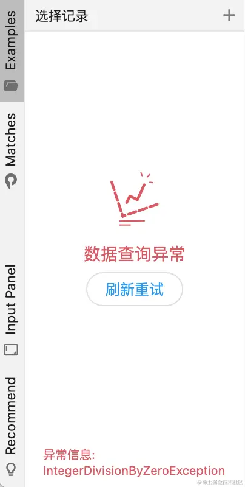
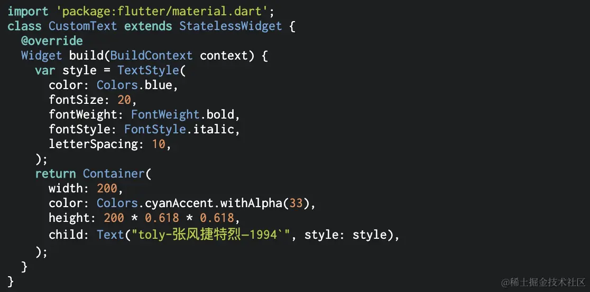

# 构建Flutter应用

[TOC]

## 概述

跨平台的挑战：

- UI元素的差异化
- 性能的差异化
- 平台特性和使用习惯的差异化

对于构建逻辑封装来说，是抽离成 **函数** 还是 **组件** 。

- **函数封装** ，封装的逻辑很难在其他组件的构建逻辑中被复用，但是可以使用本类的成员数据
- **组件封装** ，复用性要强很多，但无法享有其它类中的数据，只能通过构造进行传参。

## 项目的分层设计

在自定义Widget类代码中，只实现UI构建的逻辑。对于数据处理的业务逻辑一律在ViewModel层来实现。这里我们使用Bloc框架来实现MVVM结构。

- `Repository`
  - `Model`：数据对象
  - `DaoImpl`：直接与数据源打交道的对象，它们依赖于`LocalDatabase`或者`NetworkDatabase`对象
  - `Dao`：对不同的数据来源提供统一的操作接口
  - `LocalDatabase.dart`：实现DataSource抽象类，表示本地数据库
  - `NetworkDatabase.dart`：实现DataSource抽象类，表示网络数据库
  - `DataSource.dart`：管理Dao对象。提供Dao对象的访问器，需要子类去实现这些访问器。
- `ModelView`
  - XXXXbloc
    - state.dart
    - event.dart
    - bloc.dart
- `View`
  - Component：桌面端与手机端共用的组件，一般是响应式布局
  - Mobile：适配移动端的布局、组件（一个文件夹内，放与内容主题相关的控件，例如footer、header、nav等等）
  - Desktop：适配Windows端布局、组件
- `Util`：工具类
- `Assets`：项目的资源文件
  - images：图片资源
  - font：字体资源
  - config：配置文件
- `main.dart`：应用初始化的代码

## 项目初始化代码

直接复制即可

## 视图层

分析跨越不同组件之间的数据流是至关重要的，因为它决定了UI动态变化的逻辑。

一般从`界面构建`、`事件触发` 和 `数据维护` 三个维度去分析数据流

例如

## 适配暗黑模式

首先，组件的颜色都是通过

- `MaterialApp`中的`colorScheme`对象来获取（十分推荐），例如`Theme.of(context).colorScheme.inversePrimary;`
- 自定义的颜色配置类来获取（不推荐，维护成本极高）

然后再按照`Bloc`思路去更新即可

~~~dart
class AppConfig {			// 对应的Bloc对象为AppConfigBloc
  final Color? colorSchemeSeed;
  final ThemeMode themeMode;
}
~~~

~~~dart
class RootWidget extends StatelessWidget {
  const RootWidget({super.key});

  @override
  Widget build(BuildContext context) {
    Color? color = context
        .select<AppConfigBloc, Color?>((value) => value.state.colorSchemeSeed);
    ThemeMode themeMode = context
        .select<AppConfigBloc, ThemeMode>((value) => value.state.themeMode);

    return MaterialApp(
      theme: ThemeData(colorSchemeSeed: color, brightness: Brightness.light),
      darkTheme: ThemeData(colorSchemeSeed: color, brightness: Brightness.dark),
      themeMode: themeMode,
      routes: routes,
      initialRoute: "splash_page",
      debugShowCheckedModeBanner: false,
    );
  }
}
~~~

其中，ThemeMode是一个枚举类型，取值如下：

~~~dart
enum ThemeMode {
  /// Use either the light or dark theme based on what the user has selected in
  /// the system settings.
  system,
  /// Always use the light mode regardless of system preference.
  light,
  /// Always use the dark mode (if available) regardless of system preference.
  dark,
}
~~~

## 首屏加载页面

定义一个Cubit对象，来处理数据的初始化加载：

~~~dart

class AppConfigBloc extends Cubit<AppConfig> {
  AppConfigBloc() : super(AppConfig());
  
  // 必须是一个异步方法
  void initApp() async {
    await LocalDatabase.localDatabase.connect();
    AppConfig newAppConfig = state.copyWith(isInitialized: true);

    // 为了避免发送信号后Widget尚未构建完成，我们需要在帧结束后再调用emit()，
    final widgetsBinding = WidgetsBinding.instance;
    widgetsBinding.addPostFrameCallback((_) {
      emit(newAppConfig);
    });
    // 强制触发一帧的更新
    widgetsBinding.scheduleFrame();
  }
}
~~~

然后，定义`Splash Page`即可

~~~dart
const int minimumLoadTime = 1000; // 启动页的最小时间，单位毫秒

/// 启动页
class SplashPage extends StatefulWidget {
  const SplashPage({super.key});

  @override
  State<StatefulWidget> createState() => _SplashPageState();
}

class _SplashPageState extends State<SplashPage> {
  late int _initTimestamp;

  @override
  void initState() {
    super.initState();
    _initTimestamp = DateTime.now().millisecondsSinceEpoch;

    // 由于initApp是一个异步方法，不通过await调用异步方法并不会阻塞，任务交给后台来处理
    // initApp通过Bloc对象来通知数据加载完毕的事件
    context.read<AppConfigBloc>().initApp();
  }

  @override
  Widget build(BuildContext context) {
    // 监听数据加载完成的事件
    return BlocListener<AppConfigBloc, AppConfig>(
      listener: _listenInitialization,
      child: buildSplashPage(context),
    );
  }

  // 启动页的构建逻辑
  Widget buildSplashPage(BuildContext context) {
    return Container(color: Colors.green);
  }

  void _listenInitialization(BuildContext context, AppConfig state) async {
    // 保证启动页的最小时间
    int now = DateTime.now().millisecondsSinceEpoch;
    int delay = minimumLoadTime - (now - _initTimestamp);
    if (delay > 0) {
      await Future.delayed(Duration(milliseconds: delay));
    }

    if (state.isInitialized) {
      Widget mainWidget = PlatformUIAdapter(
        desktopWidget: Container(color: Colors.red),
        mobileWidget: Container(color: Colors.yellow),
      );

      // 通过Navigator将启动页替换为主界面
      Navigator.of(context).pushReplacement(
        MaterialPageRoute(builder: (_) => mainWidget),
      );
    }
  }
}
~~~

最后，创建`Cubit`对象以及订阅者即可

~~~dart
// 大致结构
BlocProvider(
	child : BlocBuilder (
    	child : MaterialApp(		
        	home : MainPage();
        )
    )
)
~~~

## 异步加载页面（1）

| 数据为空                                                     | 加载中                                                       | 加载完成                                                     | 加载异常                                                     |
| ------------------------------------------------------------ | ------------------------------------------------------------ | ------------------------------------------------------------ | ------------------------------------------------------------ |
|  |  |  |  |

这些不同场景中的数据，彼此之间孤立，但又同属于一个UI组件。将各种场景下的界面所依赖的数据，分别进行封装。

对于视图层来说，就是常规的处理方案：BlocBuilder + buildWidgetByState

~~~dart
class _RecordPanelState extends State<RecordPanel> with AutomaticKeepAliveClientMixin {

  RecordBloc get bloc => context.read<RecordBloc>();

  @override
  void initState() {
    super.initState();
    bloc.loadRecord(LoadType.load);
  }

  @override
  Widget build(BuildContext context) {
    return BlocBuilder<RecordBloc, RecordState> (
       builder: (_, state) => _buildByState(state),
    )
  }

  // 根据状态来加载相应的页面
  Widget _buildByState(RecordState state) {
    if (state is LoadingRecordState) {
      return const LoadingPanel();
    }
    if (state is EmptyRecordState) {
      return const EmptyPanel(
        data: "记录数据为空",
        icon: TolyIcon.icon_empty_panel,
      );
    }
    if (state is ErrorRecordState) {
      return ErrorPanel(
        data: "数据查询异常",
        icon: TolyIcon.zanwushuju,
        error: state.error,
        onRefresh: bloc.loadRecord,
      );
    }
    if (state is LoadedRecordState) {
      return LoadedPanel(
        state: state,
        onSelectRecord: _selectRecord,
      );
    }
    return const SizedBox();
  }
}
~~~

在ViewModel层，就是利用emit机制来更新页面

~~~dart
class RecordBloc extends Cubit<RecordState> {
  RecordBloc() : super(const EmptyRecordState());		// 页面的初始状态

  void loadRecord({
    LoadType operation = LoadType.load,
  }) async {
    RecordState state;
    try {
      if (operation == LoadType.load) {
        // 触发Loading页面
        emit(const LoadingRecordState());
      }
        
	  // 处理数据
      List<Record> records = [];
      if (operation == LoadType.more) {
        records = await _loadMore();
      } else if (operation == LoadType.load) {
        records = await repository.search();
      } else {
        records = await _loadRefresh();
      }
      
        
      // 根据数据状态来加载页面
      if (records.isNotEmpty) {
        state = LoadedRecordState(
          activeRecordId: _handleActiveId(records, operation),
          records: records,
        );
      } else {
        state = const EmptyRecordState();
      }
    } catch (e) {
      debugPrint(e.toString());
      state = ErrorRecordState(error: e.toString());
    }
      
    emit(state);
  }
}
~~~

## 异步加载页面（2）

在Flutter中如何优化异步耗时任务执行期间的界面？在相应UI控件中，维护一个状态，用于指示是否在异步执行任务。并根据这个状态构建相应的UI

~~~dart
class _AsyncButtonState extends State<AsyncButton> {
  bool _loading = false;
  @override
  Widget build(BuildContext context) {
    return ElevatedButton(
        onPressed: _loading ? null : _doTask,	//加载时，禁用该按钮
        child: _loading							//根据loading，动态切换UI控件
            ? const CupertinoActivityIndicator(radius: 8)
            : Text(
                widget.conformText,
                style: const TextStyle(fontSize: 12),
              ));
  }
    
  // 这个回调函数是异步的
  void _doTask() async {
    setState(() {
      _loading = true;
    });
    await asyncTask(context);		// 执行一个异步任务
    setState(() {					// 这里有个问题，就是在执行异步任务期间，如果Widget被销毁了，那么异步任务执行完成后，执行该setState函数就会触发异常
      _loading = false;
    });
  } 
}
~~~

## 下拉刷新 上拉加载

两个关键点：

1. 触发加载的逻辑

   ~~~dart
   // 下拉到90%时，触发加载操作
     bool get _shouldLoadMore {
       if (!_scrollCtrl.hasClients) 
           return false;
       final maxScroll = _scrollCtrl.position.maxScrollExtent;
       final currentScroll = _scrollCtrl.offset;
       final bool down = _scrollCtrl.position.userScrollDirection == ScrollDirection.reverse;
         
       return currentScroll >= (maxScroll * 0.9) && down;
     }
   ~~~

2. `ListView.builder`构造方法在重新构造后，仍会保留滚动偏移量。此时可以通过`itemExtent`来对重新构造的性能进行优化

   ~~~dart
     @override
     Widget build(BuildContext context) {
       return ListView.builder(
         controller: _scrollCtrl,
         itemCount: ,					// 这里更新即可
         itemExtent: 70,
         itemBuilder: (_, index) => ,
       );
     }
   ~~~

基于以上两点，我们可以自定义下拉刷新的操作

## 平台界面适配

### 响应式布局

响应式布局，即根据区域尺寸大小动态构建组件，是适配各种屏幕的「银弹」。在Flutter中，我们可以通过`LayoutBuilder`组件来动态构建UI。

~~~dart
class MyHomePage extends StatelessWidget{
  const MyHomePage({super.key});

  @override
  Widget build(BuildContext context) {
    return LayoutBuilder(
      builder: (ctx, cts){
        if(cts.maxWidth<400){
          return const SmallWidthLayout();
        }
        if(cts.maxWidth>650){
          return const LargeWithLayout();
        }
        return const MiddleWidthLayout();
      },
    );
  }
}
~~~

可以通过 `Expanded`、`Flexible`、`Spacer` 组件，在 `Column`、`Row` 中利用填充剩余空间，实现某些区域在变化时等分区域。

### 平台适配

对于构建桌面和移动端差异性非常大的界面（动态布局已经满足不了需求了），根据平台来构建定制化界面。我们可以通过 `Platform.isXXX` 来判断当前平台是否是 `XXX`。

~~~dart
if (Platform.isAndroid || Platform.isIOS){
  // 返回移动 UI
} else {
  // 返回桌面 UI
}
~~~

也可以将上述逻辑封装成一个类（可选），来提高复用性：

~~~dart
class PlatformUIAdapter extends StatelessWidget {
  final Widget desktopWidget;
  final Widget mobileWidget;

  const PlatformUIAdapter({
    super.key,
    required this.desktopWidget,
    required this.mobileWidget,
  });

  @override
  Widget build(BuildContext context) {
    if (Platform.isAndroid || Platform.isIOS) {
      return mobileWidget;
    }
    return desktopWidget;
  }
}
~~~

## 代码编辑器

在Flutter中富文本的使用：

~~~dart
void main() => runApp(
      MaterialApp(
        home: Scaffold(
          body: HomePage(),
        ),
      ),
    );

String src = '这是一段测试文字';
final TextStyle lightTextStyle =
    const TextStyle(color: Colors.blue, fontWeight: FontWeight.bold);
String part1 = src.substring(0, 4);
String part2 = src.substring(4, 6);
String part3 = src.substring(6, 8);

// 十分不推荐使用树状结构的TextSpan
InlineSpan span = TextSpan(children: [
  TextSpan(text: part1),
  TextSpan(text: part2, style: lightTextStyle),
  TextSpan(text: part3)
]);

class HomePage extends StatelessWidget {
  @override
  Widget build(BuildContext context) {
    return Text.rich(span);
  }
}
~~~

我们接下来实现匹配功能：

~~~dart
InlineSpan formSpan(String src, String pattern) {
  List<TextSpan> span = [];
  RegExp regExp = RegExp(pattern);

  List<String> parts = src.split(regExp); //获取分割段
  if (parts.isNotEmpty) return TextSpan(text: src);

  List<RegExpMatch> allMatches = regExp.allMatches(src).toList(); //获取匹配段
    
  // 将分割段与匹配段交错插入到span中
  for (int i = 0; i < parts.length; i++) {
    span.add(TextSpan(text: parts[i]));
    if (i != parts.length - 1) {
      String matchValue = allMatches[i].group(0) ?? '';
      span.add(TextSpan(text: matchValue, style: lightTextStyle));
    }
  }
  return TextSpan(children: span);
}
~~~

split在根据匹配规则进行切分字符时，会进行匹配，但最后却丢弃匹配结果，并返回的是分割后的字符串列表。为了获取匹配段，我们不得不用 `RegExp` 再匹配一次。**splitMapJoin** 方法可以优化上述问题。

~~~dart
String splitMapJoin(Pattern pattern,
      {String Function(Match)? onMatch, String Function(String)? onNonMatch});
~~~

- **Pattern**：匹配规则
- **onMatch** 监听到每次匹配结果
- **onNonMatch** 监听到不匹配结果

为此，我们可以将`formSpan`重构为：

~~~dart
InlineSpan formSpan(String src, String pattern) {
  List<TextSpan> span = [];
  RegExp regExp = RegExp(pattern);
  src.splitMapJoin(regExp, onMatch: (Match match) {
    String value = match.group(0) ?? '';
    span.add(TextSpan(text: value, style: lightTextStyle));
    return '';
  }, onNonMatch: (str) {
    span.add(TextSpan(text: str));
    return '';
  });
  return TextSpan(children: span);
}
~~~

前面的正则匹配中，我们只能为一种正则表达式进行高亮匹配。但很多场景下，我们需要为满足不同的规则的文字进行不同着色。

我们可以使用`StringScanner`来实现上述需求。它有一个`position`属性，是当前被扫描字符的索引。`isDone` 表示是否扫描结束。它的核心工作原理是：每次 `scan` 时都会在 `position` 处进行 `matchAsPrefix` 匹配（字符串的开头是否匹配此模式）。如果匹配成功`position` 会自动移动到匹配末尾，否则保持在原位

下面我们将StringScanner应用在多种不同规则的场景：

~~~dart
TextSpan generateSpan() {
    StringScanner scanner = StringScanner("toly 1994,hello!");
    List<InlineSpan> span = [];
    while (!scanner.isDone) {
        if (scanner.scan(RegExp(r'\d+'))) {
      		String? matchStr = scanner.lastMatch?.group(0);
      		span.add(TextSpan(text: matchStr, style: style1));
      		continue;
    	}
    	if (scanner.scan(RegExp(r'o.'))) {
      		String? matchStr = scanner.lastMatch?.group(0);
      		span.add(TextSpan(text: matchStr, style: style2));
      		continue;
    	}
    	span.add(TextSpan(text: scanner.string[scanner.position]));
    	scanner.position++;
    }
    
    return TextSpan(children: span);
}
~~~

上述代码对于未匹配字符的处理是，每次移动索引都会添加一个`TextSpan`，这对于大片连续的未匹配字符是不友好的。

我们可以定义一个`HeightMatch` 对象，用于保存所有匹配段的相关信息。这样扫描完后，就可以这些匹配段的信息，反推出非匹配段。因此上述代码重构为

~~~dart
// 高亮的类型
enum HighlightType {
  type1,
  type2,
}

class HeightMatch {
  final HighlightType type;
  final int start;
  final int end;

  HeightMatch(this.type, this.start, this.end);
    
  // 高亮的样式
  TextStyle get style => kHeightMap[type]!;
}

TextSpan generateSpan() {
    string str = "toly 1994,hello!";
    StringScanner scanner = StringScanner(str);
    List<HeightMatch> heightMatches = [];
    
    while (!scanner.isDone) {
    	if (scanner.scan(RegExp(r'\d+'))) {
        	Match? match = scanner.lastMatch;
            if (match != null) {
            	HeightMatch heightMatch = HeightMatch(HighlightType.type1, match.start, match.end);
                heightMatches.add(heightMatch);
            }
            continue;
        }
    	scanner.position++;
    }
    return TextSpan(child : _handleHeightMathes(heightMatches, str));
}

List<InlineSpan> _handleHeightMatches(
	List<HeightMatch> heightMatches,
    String string,
) {
    List<InlineSpan> span = [];
    
    // 设置一个游标，然后遍历匹配段
    int cursor = 0;
    for (int i = 0; i < heigthMatch.length; i++) {
        HeightMatch match = heightMatches[i];
        // 如果游标与匹配段的开头不相等
        if (cursor != mathc.start) {
            // 加入未匹配的字符
            span.add(TextSpan(text: string.substring(cursor, match.start)));
        }
        // 然后加入匹配的字符
        String matchStr = string.substring(match.start, match.end);
        span.add(TextSpan(text: matchStr, style: match.style));
        
        //将游标设置到该匹配段的末尾
    	cursor = match.end;
    }
    
    if (cursor != string.length - 1) {
        span.add(TextSpan(text: string.substring(cursor)));
        
    }
    return span;
}
~~~

我们可以继续优化上述获取匹配段的代码：

将相似逻辑抽象为一个Map对象来处理：

~~~dart
Map<HighlightType,Pattern> ruleMap = {
  	HighlightType.type1: RegExp(r"\d+"),
  	HighlightType.type2: RegExp(r"o."),
};

List<Pattern> rules = ruleMap.values.toList();
List<HighlightType> types = ruleMap.keys.toList();
while (!scanner.isDone) {
    next:
    for (int i = 0; i < rules.length; i++) {
        if (scanner.scan(rules[i])) {
            Match? match = scanner.lastMatch;
            if (match != null) {
                HighlightMatch heightMatch = HighlightMatch(types[i], match.start, match.end);
                heightMatches.add(heightMatch);
            }
            break next;
        }
    }
    if(scanner.isDone) break;
    scanner.position++;
}
~~~

## 

