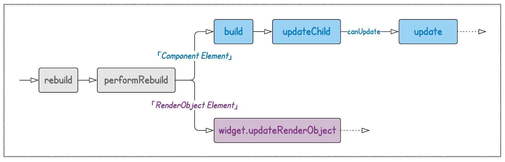
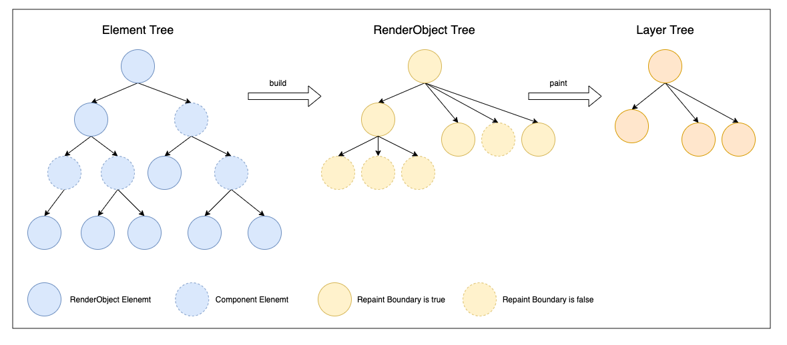
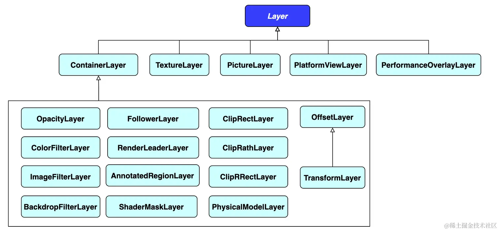
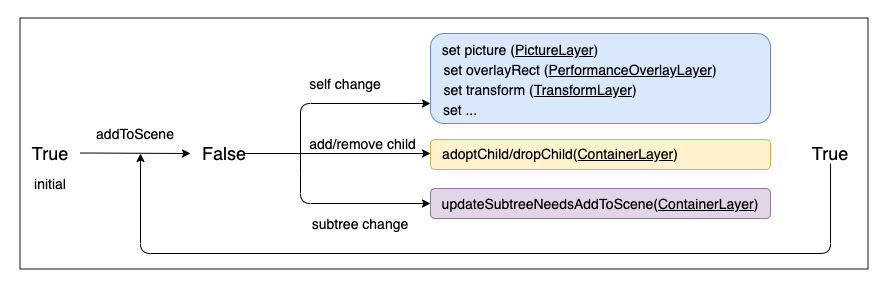
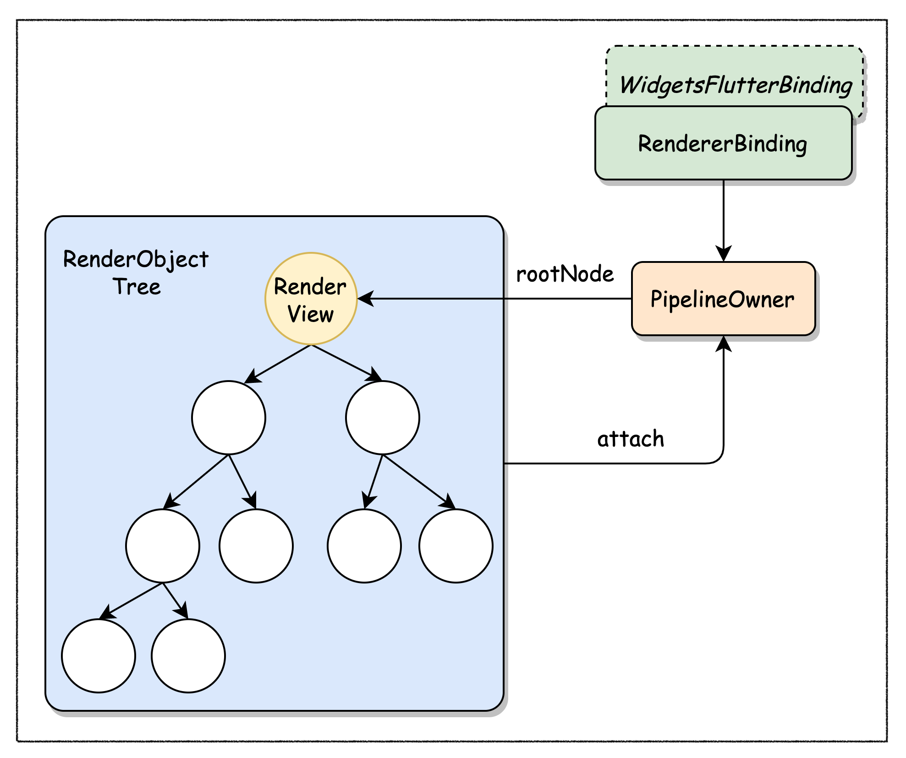
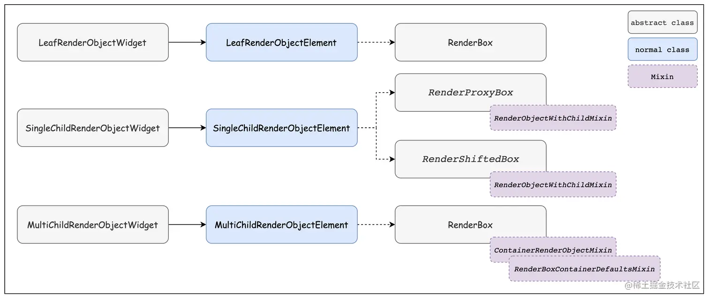

Flutter 整体分为三层：Framework (dart)、Engine (C/C++)、Embedder (Platform)


## Widget

Flutter 中万物皆为Widget。**Widget 的功能就是描述一个UI元素的配置信息**：

- 描述 UI 的层级结构 (通过`Widget`嵌套)；
- 定制 UI 的具体样式 (如：`font`、`color`等)；
- 指导 UI 的布局过程 (如：`padding`、`center`等)；

既然 Widget 只是描述一个UI元素的配置信息，那么真正的布局、绘制是由谁来完成的呢？Flutter 框架的处理流程是这样的：

1. 根据 Widget 树生成一个 Element 树，Element 树中的节点都继承自 `Element` 类。
2. 根据 Element 树生成 Render 树（渲染树），渲染树中的节点都继承自`RenderObject` 类。
3. 根据渲染树生成 Layer 树，然后上屏显示，Layer 树中的节点都继承自 `Layer` 类。

真正的布局和渲染逻辑在 Render 树中，Element 是 Widget 和 RenderObject 之间的桥梁。

[](https://github.com/AtsukoRuo/note/blob/47c4a2d257bac7490467abc1978cba4cd4ae0443/框架 中间件/Flutter/assets/2-2.59d95f72.png)


按照功能划分`Widget`大致可以分为 3 类：

- **「Component Widget」** —— 组合类 Widget，这类 Widget 都直接或间接继承于`StatelessWidget`或`StatefulWidget`。这就体现了组合大于继承的原则。如果只是使用 `RenderObjectWidget` 通过子级关系进行构建界面，将会导致代码结构非常复杂，而且难以复用。`StatelessWidget` 和 `StatefulWidget` 两个组件正是为了解决这个的问题，在 `build` 方法中组合其他组件完成构建逻辑。
- **「Proxy Widget」** —— 代理类 Widget，「Proxy Widget」本身并不涉及 Widget 内部逻辑，只是为「Child Widget」提供一些附加的中间功能。典型的如：`InheritedWidget`用于在「Descendant Widgets」间传递共享信息
- **「Render Widget」** —— 渲染类 Widget，是最核心的`Widget`类型，会直接参与后面的「Layout」、「Paint」流程。


它的核心方法/属性有

- `Key key` —— 在同一父节点下，用作兄弟节点间的唯一标识

- `Element createElement()` ，每个`Widget`都有一个与之对应的`Element`，由该方法负责创建

- `static bool canUpdate(Widget oldWidget, Widget newWidget)`，默认实现如下：

  ~~~dart
  static bool canUpdate(Widget oldWidget, Widget newWidget) {
      return oldWidget.runtimeType == newWidget.runtimeType
          && oldWidget.key == newWidget.key
  }
  ~~~

  

### StatelessWidget

~~~dart
abstract class StatelessWidget extends Widget {
  const StatelessWidget({ super.key });
  @override
  StatelessElement createElement() => StatelessElement(this);
  @protected
  Widget build(BuildContext context);
}
~~~

### StatefulWidget

`StatefulWidget`本身还是不可变的，其可变状态存在于`State`中。

~~~dart
abstract class StatefulWidget extends Widget {
  const StatefulWidget({ super.key });
    
  @override
  StatefulElement createElement() => StatefulElement(this);
    
  @protected
  @factory
  State createState();
}
~~~

其中，`StatefulElement`的构造函数为：

~~~dart
StatefulElement(StatefulWidget widget)
     : _state = widget.createState(),
       super(widget) {
   _state._element = this;
   _state._widget = widget;
 }
~~~

### State

State 用于处理「Stateful Widget」的业务逻辑以及可变状态。State的回调函数有：


需要说明几点：

- State实例有两个重要的属性

  - `widget`：指向与该 `State` 实例的`StatefulWidget`实例。注意，这种关联并非永久的

  - `context`：指向与该 State 实例关联的Element实例。

    ~~~dart
    Widget build(BuildContext context) {
        // 和参数context指向同一个对象
        this.context;				
        return Widget();
    }
    ~~~

    

- `State`实例与`Element`实例间的绑定关系一经确定，在整个生命周期内不会再变了。Element 对应的 Widget 可能会变，但对应的 State 永远不会变

- `createState()` 用于创建和 `StatefulWidget` 相关的状态，它在`StatefulWidget` 的生命周期中可能会被多次调用。例如，当一个 `StatefulWidget` 同时插入到 `widget` 树的多个位置时，`Flutter` 框架就会调用该方法为每一个位置生成一个独立的`State`实例。这里多次插入的意思是：

  ~~~dart
  class CustomWidget extends StatelessWidget  {
    @override
    Widget build(BuildContext context) {
      StatefulWidget statefulWidget = new StatefulWidet();
        
      return Column(
      	children: [
              statefulWidget,			//多次插入，每一处插入都对应一个新的State实例
              statefulWidget,
              statefulWidget,
          ]
      )
    }
  }
  ~~~

- `StatefulWidget`中也可以保存状态，但由于多个`State`实例对应一个`Widget`，其中一个`State`调用`setState`来更新数据，而其他`State`却不能主动感知这一点，从而造成数据不一致问题。

  ~~~dart
  class _MyAppState extends State<MyApp> {
    @override
    Widget build(BuildContext context) {
      StatefulWidget widget = CustomWidget();
      return Column(
        children: [
            widget,
            widget,
            widget,
        ],
      );
    }
  }
  
  class CustomWidget extends StatefulWidget {
    CustomWidget({super.key});
    int _j = 10;			// State公有的状态
    @override
    State<CustomWidget> createState() => _CustomWidgetState();
  }
  
  class _CustomWidgetState extends State<CustomWidget> {
    int i = 10;			// 每个State私有的状态
      
    @override
    Widget build(BuildContext context) {
      return GestureDetector(
        onTap: () {setState(() {i++; widget._j++;});},
        child: Container(
          width : 100, height: 100, color : Colors.red,
          child: Text("private: $i   public: ${widget._j}"),
        )
      );
    }
  }
  ~~~

  

### ParentDataWidget

`ParentDataWidget`作为 `Proxy` 型 `Widget`，其功能主要是为其他 `Widget` 提供`ParentData`信息。

在挂载`RenderObjectElement`过程中，会调用`attachRenderObject`方法，在该方法中会将`Element`对应的`RenderObject`挂在到`RenderTree`上，同时会寻找最近祖先`ParentDataElement`，然后执行一些操作

~~~dart
void attachRenderObject(dynamic newSlot) {
  assert(_ancestorRenderObjectElement == null);
  _slot = newSlot;
  _ancestorRenderObjectElement = _findAncestorRenderObjectElement();
  _ancestorRenderObjectElement?.insertChildRenderObject(renderObject, newSlot);		// 挂载RenderTree
  final ParentDataElement<RenderObjectWidget> parentDataElement = _findAncestorParentDataElement();		// 寻找ParentDataElement
  if (parentDataElement != null)
    _updateParentData(parentDataElement.widget);
}

ParentDataElement<RenderObjectWidget> _findAncestorParentDataElement() {
  Element ancestor = _parent;
  while (ancestor != null && ancestor is! RenderObjectElement) {
    if (ancestor is ParentDataElement<RenderObjectWidget>)
      return ancestor;
    ancestor = ancestor._parent;
  }
  return null;
}

void _updateParentData(ParentDataWidget<RenderObjectWidget> parentData) {
  parentData.applyParentData(renderObject);			// 以要挂载的渲染对象作为参数传入
}
~~~

而`ParentDataWidget.applyParentData(RenderObject renderObject)`是抽象方法，需要子类需要重写该方法。

~~~dart
/// Write the data from this widget into the given render object's parent data.
@protected
void applyParentData(RenderObject renderObject);
~~~


以`Positioned`组件为例

~~~dart
class Positioned extends ParentDataWidget<StackParentData> {
    @override
    void applyParentData(RenderObject renderObject) {
      assert(renderObject.parentData is StackParentData);
      final StackParentData parentData = renderObject.parentData;
      bool needsLayout = false;

      if (parentData.left != left) {
        parentData.left = left;
        needsLayout = true;
      }
      ...
      if (parentData.width != width) {
        parentData.width = width;
        needsLayout = true;
      }
      ...
      if (needsLayout) {
        final AbstractNode targetParent = renderObject.parent;
        if (targetParent is RenderObject)
          targetParent.markNeedsLayout();
      }
    }
}
~~~

### InheritedWidget

`InheritedWidget`作为 `Proxy` 型 `Widget`，其功能主要是在树上向下传递数据。

~~~dart
abstract class InheritedWidget extends ProxyWidget {
  const InheritedWidget({ super.key, required super.child });

  @override
  InheritedElement createElement() => InheritedElement(this);
    
  @protected
  bool updateShouldNotify(covariant InheritedWidget oldWidget);
}
~~~

-  `updateShouldNotify`：在「Inherited Widget」`notifyClients` 时，判断是否需要 `rebuild` 那些依赖它的 `Widget`；如下是`MediaQuery.updateShouldNotify`的实现

  ~~~dart
  bool updateShouldNotify(MediaQuery oldWidget) => data != oldWidget.data;
  ~~~

  

例如`TextDefault`、`Theme`、`MediaQuery`等组件都是`InheritedWidget`的子类。这些组件一般会提供`of`方法：

~~~dart
static MediaQueryData of(BuildContext context, { bool nullOk = false }) {
  final MediaQuery query = context.dependOnInheritedWidgetOfExactType<MediaQuery>();
  if (query != null)
    return query.data;
  if (nullOk)
    return null;
}
~~~


通过`BuildContext.dependOnInheritedWidgetOfExactType`可以获取最近的`「Inherited Widget」`，但是组件会依赖`InheritedWidget`。而`context.findAncestorWidgetOfExactType`同样可以获取最近的`「Inherited Widget」`，但是不会依赖`InheritedWidget`

### RenderObjectWidget

一切要渲染到屏幕上的`Widget`，都是`RenderObjectWidget`类型。它有四个关键方法

- `RenderObjectElement createElement()`：一个抽象方法，需要子类覆写它

- `RenderObject createRenderObject(BuildContext context)` ：创建 Render Widget 对应的 Render Object，同样子类需要重写该方法。

  ~~~dart
  @override
  RenderFlex createRenderObject(BuildContext context) {
    return RenderFlex(
      direction: direction,
      mainAxisAlignment: mainAxisAlignment,
      mainAxisSize: mainAxisSize,
      crossAxisAlignment: crossAxisAlignment,
      textDirection: getEffectiveTextDirection(context),
      verticalDirection: verticalDirection,
      textBaseline: textBaseline,
    );
  }
  ~~~

- `void updateRenderObject(BuildContext context, covariant RenderObject renderObject)`：在 Widget 更新后，修改对应的 Render Object。

  ~~~dart
  @override
  void updateRenderObject(BuildContext context, covariant RenderFlex renderObject) {
    renderObject
      ..direction = direction
      ..mainAxisAlignment = mainAxisAlignment
      ..mainAxisSize = mainAxisSize
      ..crossAxisAlignment = crossAxisAlignment
      ..textDirection = getEffectiveTextDirection(context)
      ..verticalDirection = verticalDirection
      ..textBaseline = textBaseline;
  }
  ~~~

  这些都是访问器，在访问器内部会执行`markNeedsPaint()`，从而触发重绘操作

- `void didUnmountRenderObject(covariant RenderObject renderObject)`


## BuildOwner

BuildOwner的主要作用有：

1. 维护`dirty elements`。在有「dirty elements」时，及时通知引擎，以便在下一帧对「dirty elements」的 rebuild，从而去刷新 UI；
2. 维护 `inactive Element`。

~~~dart
class BuildOwner {
    final _InactiveElements _inactiveElements = _InactiveElements();
	final List<Element> _dirtyElements = <Element>[];
}
~~~


整棵「Element Tree」共享同一个`BuildOwner`实例 (全局的)，而`BuildOwner`实例由`WidgetsBinding`负责创建。并在`Element#mount`中，`Element`获取到`BuildOwner`实例

~~~dart
@mustCallSuper
void mount(Element? parent, Object? newSlot) {
    _parent = parent;
    _slot = newSlot;
    _lifecycleState = _ElementLifecycle.active;
    _depth = _parent != null ? _parent!.depth + 1 : 1;
    if (parent != null) {
          // Only assign ownership if the parent is non-null. If parent is null
          // (the root node), the owner should have already been assigned.
          // See RootRenderObjectElement.assignOwner().
          _owner = parent.owner;
    }
}
~~~


那么`BuildOwner`是如何收集「Dirty Elements」的呢？

1. 对于需要更新UI的Widget，首先调用setState

   ~~~dart
   void setState(VoidCallback fn) {
     	final dynamic result = fn() as dynamic;
     	_element.markNeedsBuild();
   }
   ~~~

2. 然后执行markNeedsBuild

   ~~~dart
   void markNeedsBuild() {
         if (!_active) return;
   
         if (dirty) return;
   
         _dirty = true;
         owner.scheduleBuildFor(this);
   }
   ~~~

3. 执行scheduleBuildFor

   ~~~dart
   void scheduleBuildFor(Element element) {
         onBuildScheduled();			// 会通知 Engine 在下一帧需要做更新操作；
   
         _dirtyElements.add(element);	// 将「Dirty Elements」加入到_dirtyElements中。
         element._inDirtyList = true;
   }
   ~~~

   `onBuildScheduled()`之后的调用链如下：`scheduleBuildFor` -> `onBuildScheduled` -> `ensureVisualUpdate` -> `scheduleFrame`。而`scheduleFrame` 会向平台发送一个帧调度的请求

   ~~~dart
   void scheduleFrame() {
       // ...
       window.scheduleFrame();
   }
   ~~~

   > `GPU` 和 `屏幕` 两者是供给关系，其中 `GPU` 会生成图像放入缓存区， `屏幕` 则从缓存区中获取图像。这就是一个 `生产者-消费者模型` 。
   >
   > 比如，这样当 `GPU` 的帧率过快，可能屏幕只渲染了一半， `GPU` 就把下一帧的图片数据塞到缓存区了。接下来屏幕下一半拿的数据就是下一帧内容，就会导致画面显示的 `撕裂` 。而 `Vsync` 就是为了将 `屏幕刷新频率` 和 `渲染帧率` 进行同步的一种信号。当 `VSync` 信号产生时，`GPU` 才会开始绘制

   

此后，在新一帧绘制到来时，`WidgetsBinding.drawFrame`会调用`BuildOwner.buildScope`方法：

~~~dart
void buildScope(Element context, [ VoidCallback callback ]) {
  if (callback == null && _dirtyElements.isEmpty)
    return;

  try {
    if (callback != null) {
      callback();
    }
	
    // 对「dirty elements」按在「Element Tree」上的深度排序。确保 parent 先于 child 被 rebuild，以免 child 被重复 rebuild，因为 parent 在 rebuild 时会递归地 update child。
    _dirtyElements.sort(Element._sort);
    int dirtyCount = _dirtyElements.length;
    int index = 0;
    while (index < dirtyCount) {
      // 对_dirtyElements中的元素依次调用rebuild
      _dirtyElements[index].rebuild();
      index += 1;
    }
  } finally {
    for (Element element in _dirtyElements) {
      element._inDirtyList = false;
    }
    // 清理_dirtyElements
    _dirtyElements.clear();
  }
}
~~~

## Element

Element 有以下主要职责：

- 根据 UI (「Widget Tree」) 的变化来维护「Element Tree」
- 维护「Render Tree」
- Widget 与 RenderObject 间的协调者。


Element 根据特点可以分为 2 类：

- **「Component Element」** —— 组合型 Element，「Component Widget」、「Proxy Widget」对应的 Element 都属于这一类型
- **「Renderer Element」** —— 渲染型 Element，对应「Renderer Widget」，其不同的子类型包含的子节点个数也不一样，如：LeafRenderObjectElement 没有子节点，RootRenderObjectElement、SingleChildRenderObjectElement 有一个子节点，MultiChildRenderObjectElement 有多个子节点。


> 注：在3.10版本后，`Element`不再继承`AbstractNode`，而是继承`DiagnosticableTree`


它的定义如下：

~~~dart
abstract class Element extends DiagnosticableTree implements BuildContext {
    Element? _parent;
    
    // 用于确定子节点的排列顺序 (兄弟节点间的排序)，对子节点透明。
  	Object? _slot;
    
    
}
~~~


Element 与其他几个核心元素间的关系：


> 上述这些关系并不是所有类型的 Element 都有，如：「Render Object」只有「RenderObject Element」才有，State 只有「Stateful Element」才有。


### 总体流程

以 Element 生命周期为切入点，描述这些方法执行的流程

#### 创建


在初始化Element Tree时，我们有

- inactive element为空。因此可以认为 inflateWidget一定会调用mount。
- updateChild的child参数一定为空，因此可以认为updateChild一定会调用inflateWidget。

综上，有一条循环建立。


#### 更新


将创建、更新、重建的ComponentElement路线结合起来一起来看，就会发现一个大循环在其中。只有调用到updateChild(null, null, ...) 或 oldWIdget == newWidget时，这个循环才会倾向于结束。这个循环表明，只要一个节点发生了更新，那么以该节点为根的子树都会进行更新。

#### 重建



如果是通过`setState()`来进行重建的，那么必然会走`Component Element`那条路。然后开启循环。

#### 销毁


### 关键方法

#### updateChild

父节点通过该方法来修改子节点对应的 Widget。


~~~dart
//Element
Element updateChild(Element child, Widget newWidget, dynamic newSlot) {
    // child：		旧的Widget所对应的Element
    // newWidget：	新的Widget
  if (newWidget == null) {
    if (child != null)
      deactivateChild(child);
    return null;
  }

  if (child != null) {
    if (child.widget == newWidget) {
      if (child.slot != newSlot)
        updateSlotForChild(child, newSlot);
      return child;
    }

    if (Widget.canUpdate(child.widget, newWidget)) {
      if (child.slot != newSlot)
        updateSlotForChild(child, newSlot);
      child.update(newWidget);
      assert(child.widget == newWidget);

      return child;
    }

    deactivateChild(child);
    assert(child._parent == null);
  }

  return inflateWidget(newWidget, newSlot);
}
~~~

#### update

~~~dart
// Element
@mustCallSuper
void update(covariant Widget newWidget) {
  // 更换Element所持有的Widget
  _widget = newWidget;
}

// ComponentElement没有重写该方法


// StatelessElement
void update(StatelessWidget newWidget) {
  super.update(newWidget);  // Element
  _dirty = true;
  rebuild();
}

// StatefulElement
void update(StatefulWidget newWidget) {
  super.update(newWidget);	// Element
  final StatefulWidget oldWidget = _state._widget;
  _dirty = true;
  // 同时更换state所持有的Widget
  _state._widget = widget;
  try {
    // 触发回调事件
    _state.didUpdateWidget(oldWidget) as dynamic;
  }
  finally {
  }
  rebuild();
}

// ProxyElement
void update(ProxyWidget newWidget) {
  final ProxyWidget oldWidget = widget;
  super.update(newWidget);
  // 进行通知
  updated(oldWidget);
  _dirty = true;
  rebuild();
}

void updated(covariant ProxyWidget oldWidget) {
  // ParentDataElement与InheritedElement都覆写了notifyClients方法
  notifyClients(oldWidget);
}
// 


// RenderObjectElement
void update(covariant RenderObjectWidget newWidget) {
  super.update(newWidget);
    
  // 更新渲染对象
  widget.updateRenderObject(this, renderObject);
  _dirty = false;
}

//  SingleChildRenderObjectElement
void update(SingleChildRenderObjectWidget newWidget) {
  super.update(newWidget);		// RenderObjectElement
  _child = updateChild(_child, widget.child, null);
}

// MultiChildRenderObjectElement
void update(MultiChildRenderObjectWidget newWidget) {
  super.update(newWidget);	// RenderObjectElement
  _children = updateChildren(_children, widget.children, forgottenChildren: _forgottenChildren);
}
~~~


#### inflateWidget

根据`Widget`创建出`Element`，然后进行挂载。或者复活符合条件的`inactive element`

~~~dart
// Element
Element inflateWidget(Widget newWidget, dynamic newSlot) {
    
  final Key key = newWidget.key;
  if (key is GlobalKey) {
    // 如果 Widget 带有 GlobalKey，首先在 Inactive Elements 列表中查找是否有处于 inactive 状态的节点 (即刚从树上移除)，如找到就直接复活该节点。
    final Element newChild = _retakeInactiveElement(key, newWidget);
    if (newChild != null) {
      newChild._activateWithParent(this, newSlot);
      final Element updatedChild = updateChild(newChild, newWidget, newSlot);
      return updatedChild;
    }
  }

  // 创建Widget对应的Element
  final Element newChild = newWidget.createElement();
  newChild.mount(this, newSlot);
  return newChild;
}
~~~


#### mount

将Element挂载到Element Tree上

~~~dart
// Element
@mustCallSuper
void mount(Element parent, dynamic newSlot) {
  // 维护节点的信息
  _parent = parent;
  _slot = newSlot;
  _depth = _parent != null ? _parent.depth + 1 : 1;
  _active = true;
  if (parent != null) // Only assign ownership if the parent is non-null
    _owner = parent.owner;

  if (widget.key is GlobalKey) {
    final GlobalKey key = widget.key;
    key._register(this);
  }

  _updateInheritance();
}


// ComponentElement
void mount(Element parent, dynamic newSlot) {
  super.mount(parent, newSlot);	// Element
  _firstBuild();
}

void _firstBuild() {
  rebuild();
}

// RenderObjectElement
void mount(Element parent, dynamic newSlot) {
  super.mount(parent, newSlot);			// Element
    
  // 创建RenderObject
  _renderObject = widget.createRenderObject(this);
    
  // 将RenderObject挂载到RenderObjectTree上
  // 会调用adoptChild，其中会markNeedsLayout、markNeedsCompositingBitsUpdate以及markNeedsSemanticsUpdate
  attachRenderObject(newSlot);
  _dirty = false;
}


// SingleChildRenderObjectElement
@override
void mount(Element parent, dynamic newSlot) {
  super.mount(parent, newSlot);		// RenderObjectElement
  _child = updateChild(_child, widget.child, null);
}


// MultiChildRenderObjectElement
void mount(Element parent, dynamic newSlot) {
  super.mount(parent, newSlot);		// RenderObjectElement
  _children = List<Element>(widget.children.length);
  Element previousChild;
  for (int i = 0; i < _children.length; i += 1) {
    final Element newChild = inflateWidget(widget.children[i], previousChild);
    _children[i] = newChild;
    previousChild = newChild;
  }
}
~~~

#### markNeedsBuild

~~~dart
void markNeedsBuild() {
  if (!_active)
    return;

  if (dirty)
    return;

  _dirty = true;
  owner.scheduleBuildFor(this);
}
~~~


#### rebuild

```dart
void rebuild() {
  if (!_active || !_dirty)
    return;

  performRebuild();
}
```


#### performRebuild

~~~dart
// ComponentElement
void performRebuild() {
  Widget built;
  built = build();

  _child = updateChild(_child, built, slot);
}


// RenderObjectElement
void performRebuild() {
  widget.updateRenderObject(this, renderObject);
  _dirty = false;
}
~~~

- StatelessElement.build: `Widget build() => widget.build(this);`
- StatefulElement.build: `Widget build() => state.build(this);`
- ProxyElement.build: `Widget build() => widget.child;`


### 依赖

在 Element 基类中还这样两个成员：

~~~dart
// 用于收集从「Element Tree」根节点到当前节点路径上所有的「Inherited Elements」；
Map<Type, InheritedElement> _inheritedWidgets;

// 当前节点依赖了哪些「Inherited Elements」
Set<InheritedElement> _dependencies;
~~~

其中`_inheritedWidgets`成员在`Element#_updateInheritance`方法中维护，而该方法又在`Element#mount`结束处被调用。

~~~dart
// Element
void _updateInheritance() {
  _inheritedWidgets = _parent?._inheritedWidgets;
}
~~~

`InheritedElement`类覆写了该方法

~~~dart
// InheritedElement
void _updateInheritance() {
  final Map<Type, InheritedElement> incomingWidgets = _parent?._inheritedWidgets;
  if (incomingWidgets != null)
    _inheritedWidgets = HashMap<Type, InheritedElement>.from(incomingWidgets);
  else
    _inheritedWidgets = HashMap<Type, InheritedElement>();
  // 其在父节点的基础上将自己加入到_inheritedWidgets中
  _inheritedWidgets[widget.runtimeType] = this;
}
~~~

这个相当于缓存，不用重新扫描从该节点到根节点这一整条路径了。


而我们调用`context.dependOnInheritedWidgetOfExactType<T>`时，就会更新`_dependencies`

~~~dart
// Element
@override
  T? dependOnInheritedWidgetOfExactType<T extends InheritedWidget>({Object? aspect}) {
      
    // 先找到InheritedElement
    final InheritedElement? ancestor = _inheritedElements == null ? null : _inheritedElements![T];
    if (ancestor != null) {
      // 该方法会执行维护_dependencies的方法
      return dependOnInheritedElement(ancestor, aspect: aspect) as T;
    }
    _hadUnsatisfiedDependencies = true;
    return null;
  }

@override
  InheritedWidget dependOnInheritedElement(InheritedElement ancestor, { Object? aspect }) {
    _dependencies ??= HashSet<InheritedElement>();
    _dependencies!.add(ancestor);		// 在InheritedElement中维护_dependencies
    ancestor.updateDependencies(this, aspect);
    return ancestor.widget as InheritedWidget;
  }
~~~


同时，在`InheritedElement`中还有用于记录所有依赖于它的节点：`final Map<Element, Object> _dependents`。
最终，在「Inherited Element」发生变化，会通知依赖者，

~~~dart
void notifyClients(InheritedWidget oldWidget) {
  for (Element dependent in _dependents.keys) {
    // check that it really depends on us
    assert(dependent._dependencies.contains(this));
    notifyDependent(oldWidget, dependent);
  }
}

@protected
void notifyDependent(covariant InheritedWidget oldWidget, Element dependent) {
    dependent.didChangeDependencies();
}

@mustCallSuper
void didChangeDependencies() {
    // rebuild
    markNeedsBuild();
}
~~~


## PaintingContext

`Painting Context`的主要职责包括

- 维护「Layer Tree」。
- 对 `Repaint Boundary`、`need Compositing` 的处理。
- 管理 `Canvas`，对底层细节进行抽象、封装。


- `ClipContext`是抽象类，主要提供了几个与裁剪 (Clip) 有关的辅助方法；
- `PictureLayer _currentLayer`、`ui.PictureRecorder _recorder`以及`Canvas _canvas`都是用于具体的绘制操作；
- `ContainerLayer _containerLayer`：「Layer Subtree」的根节点

### 基础概念

#### Canvas

`Canvas`是 Engine(C++) 层向Framework(Dart) 层暴露的接口，绘制在Engine层实现。`RenderObject` 正是通过`Canvas`来完成绘制任务的。

#### Picture

是一系列「graphical operations」的集合，对 Framework 层透明。在Canvas上执行的操作会映射会graphical operations。

#### PictureRecorder

记录在`Canvas`上执行的「graphical operations」。

通过`PictureRecorder#endRecording`最终生成`Picture`。然后可以通过`Picture#toImage`来获取所有操作经光棚化后生成的Image对象

#### Scene

同样对 Framework 层透明，是一系列 Picture、Texture 合成的结果。它被送入 Engine 层，最终经 GPU 光栅化后显示在屏幕上。

#### ScenBuilder

用于将多个图层(Layer)、Picture、Texture 合成为 Scene。通过`addPicture`、`addTexture`可以引入要合成的 Picture、Texture。

~~~dart
void addPicture(Offset offset, Picture picture, { bool isComplexHint = false, bool willChangeHint = false });

void addTexture(int textureId, { Offset offset = Offset.zero, double width = 0.0, double height = 0.0 , bool freeze = false});
~~~

同时，SceneBuilder 还会维护一个图形操作 stack：

```
pushTransform
pushOffset
pushClipRect
...
pop
```

这个stack与canvas的save/restore的作用类似


#### 小案例

~~~dart
void main() {
  PictureRecorder recorder = PictureRecorder();
  Canvas canvas = Canvas(recorder);

  Paint circlePaint = Paint();
  circlePaint.color = Colors.blueAccent;

  canvas.drawCircle(Offset(400, 400), 300, circlePaint);

  Picture picture = recorder.endRecording();
  SceneBuilder sceneBuilder = SceneBuilder();
  sceneBuilder.pushOffset(-400, -400); // 定义屏幕左上角的坐标
  sceneBuilder.addPicture(Offset(0, 0), picture);
  sceneBuilder.pop();

  Scene scene = sceneBuilder.build();

  window.onDrawFrame = () {
    // 将 scene 送入 Engine 层进行渲染显示
    window.render(scene);
  };
  window.scheduleFrame();
}

~~~

为了支持多窗口，这个`window`对象已经`deprecated`了，推荐使用`View.of(context)`。

### 绘制流程

`PaintingContext` 与 `RenderObject`之间是**依赖关系**，即`PaintingContext` 作为参数出现在 `RenderObject` 的绘制方法中。`PaintingContext` 是一次性的，每次执行 `Paint` 时都会生成对应的 `PaintingContext`，当绘制完成时其生命周期也随之结束。


基本流程如下：

1. 在 UI Frame 刷新时，Flutter引擎通过`RendererBinding#drawFrame`->`PipelineOwner#flushPaint`来触发 `RenderObject#paint`；

2. `RenderObject#paint`调用`PaintingContext.canvas`所提供的图形操作接口(`draw*`、`clip*`、`transform`等)来完成绘制任务；

   ~~~dart
     // PaintingContext
     Canvas? _canvas;
     @override
     Canvas get canvas {
       if (_canvas == null) {
         _startRecording();
       }
       assert(_currentLayer != null);
       return _canvas!;
     }
   ~~~

3. 上述绘制操作被 `PictureRecorder` 记录下来，在绘制结束时生成 `picture`，并被添加到 `PictureLayer` (`_currentLayer`)上；

   ~~~dart
   void _startRecording() {
       assert(!_isRecording);
       // 新的Layer
       _currentLayer = PictureLayer(estimatedBounds);
       
       _recorder = ui.PictureRecorder();
       // 初始化 Canvas，传入_recorder
       _canvas = Canvas(_recorder!);
       // 将_currentLayer插入以_containerLayer为根节点的子树上
       _containerLayer.append(_currentLayer!);
   }
   ~~~

   ~~~dart
   void stopRecordingIfNeeded() {
     // 在停止记录时，将结果 picture 加到 _currentLayer 上
     _currentLayer.picture = _recorder.endRecording();
      
     // 注意！此时_currentLayer、_recorder、_canvas 被释放，
     // 此后，若还要通过当前 PaintingContext 进行绘制，则会生成新的 _currentLayer、_recorder、_canvas
     // 即在 PaintingContext 的生命周期内 _canvas 可能会变
     _currentLayer = null;
     _recorder = null;
     _canvas = null;
   }
   ~~~

4. 随后，`RenderObject` 通过`PaintingContext#paintChild`递归地绘制子节点。在绘制子节点时，根据子节点是否是「Repaint Boundary」而采用不同的策略：

   1. 是「Repaint Boundary」— 为子节点生成新的 `PaintingContext`，从而子节点可以独立进行绘制，绘制结果就是一颗「Layer subTree」（此时会创建OffsetLayer），最后新创建的子树挂载到该节点的`Container Layer`上；

   2. 不是「Repaint Boundary」— 子节点直接绘制在当前`PaintingContext.canvas`上。此时多个RenderObject对应一个Layer

      ~~~dart
      child._paintWithContext(this, offset);
      ~~~

5. 整个绘制流程结束时就得到了一棵「Layer Tree」，其后通过 SceneBuilder 生成 Scene，再经`window.render`送入 Engine 层，最终 GPU 对其进行光栅化处理，显示在屏幕上。


### 合成

`RenderObject.needCompositing`表示该 `RenderObject` 是否需要合成，即在`paint`方法中是否需要生成新的 `Layer`。

通常 `RenderObject`在`paint`时会通过`PaintingContext#push*`来处理 `Compositing`，也就是引入新的Container Layer：

~~~dart
void pushLayer(ContainerLayer childLayer, PaintingContextCallback painter, Offset offset, { Rect childPaintBounds }) {
    stopRecordingIfNeeded();
  	appendLayer(childLayer);
    
    final PaintingContext childContext = createChildContext(childLayer, childPaintBounds ?? estimatedBounds);
  	painter(childContext, offset);
  	childContext.stopRecordingIfNeeded();
}

PaintingContext createChildContext(ContainerLayer childLayer, Rect bounds) {
  	return PaintingContext(childLayer, bounds);
}

// needsCompositing 参数一般来自 RenderObject.needCompositing
ClipRectLayer pushClipRect(
    bool needsCompositing, 
    Offset offset, 
    Rect clipRect, 
    PaintingContextCallback painter, { 
    Clip clipBehavior = Clip.hardEdge, 
    ClipRectLayer oldLayer }) {
    
    final Rect offsetClipRect = clipRect.shift(offset);
    if (needsCompositing) {
    	// 在需要合成时，创建新Layer 
        final ClipRectLayer layer = oldLayer ?? ClipRectLayer();
        layer
        ..clipRect = offsetClipRect
        ..clipBehavior = clipBehavior;

        // 将新 layer 添加到 layer tree 上，并在其上完成绘制
        pushLayer(layer, painter, offset, childPaintBounds: offsetClipRect);
        return layer;
    } else {
    	// 否则在当前 Canvas 上进行裁剪、绘制
    	clipRectAndPaint(offsetClipRect, clipBehavior, offsetClipRect, () => painter(this, offset));
    	return null;
    }
}
~~~


## Layer

Layer Tree 是 Flutter Framework 最终的输出产物，之后的流程就进入到 Flutter Engine 了。



Layer 大致可以分为2类：

- Container Layer：作为 Layer 容器，用于管理一组 Layers。
- 非 Container Layer：真正用于承载渲染结果的 layer，在 Layer Tree 中属于叶结点。如：`PictureLayer`承载的是图片的渲染结果，`TextureLayer`承载的是纹理的渲染结果。




### EngineLayer

每个 Layer 实例都有一个与之对应的`EngineLayer`实例，它对framework透明，可以简单的理解为engine渲染的结果。`SceneBuilder`类有一系列的`push`方法 (如：`pushOffset`、`pushClipRect`等)，这些方法的返回值即为`EngineLayer`实例。例如：`ColorFilterLayer#addToScene`方法在调用`SceneBuilder#pushColorFilter`方法时就保存了其返回的`engineLayer`：

~~~dart
// ColorFilterLayer
@override
void addToScene(ui.SceneBuilder builder, [ Offset layerOffset = Offset.zero ]) {
  engineLayer = builder.pushColorFilter(colorFilter, oldLayer: _engineLayer);
  addChildrenToScene(builder, layerOffset);
  builder.pop();
}
~~~

### needsAddToScene

在`Layer`内有一个非常重要的变量：`_needsAddToScene`，用于记录该 Layer 自上次渲染后(`addToScene`)是否发生了变化。可以表明该 layer 所持有的 EngineLayer 是否可以复用。它的维护见下图



注意，当`Layer#alwaysNeedsAddToScene`为`true`时，表示该 layer 在每帧刷新时都需要重新渲染：

~~~dart
// Layer
@protected
@visibleForTesting
void updateSubtreeNeedsAddToScene() {
  	_needsAddToScene = _needsAddToScene || alwaysNeedsAddToScene;
}
~~~

### addToScene

`addToScene`方法可以说是`Layer`中最重要的方法之一，用于将 layer 送入 engin 进行渲染。

~~~dart
// Layer
@protected
void addToScene(ui.SceneBuilder builder);
~~~

### 合成总体流程


- RenderView 是 RenderObject Tree 的根节点，在每帧刷新时都会调用其`compositeFrame`方法去合成新的帧
- 此外，renderView.compositeFrame(); 开始向GPU发送数据


## PipelineOwner

`PipelineOwner`在 Rendering Pipeline 中起到重要作用：

- 随着 UI 的变化而不断收集『 Dirty Render Objects 』
- 随之驱动 Rendering Pipeline 刷新 UI




~~~dart
// RendererBinding#init
    
mixin RendererBinding {
  @override
  void initInstances() {
    super.initInstances();
    _instance = this;
      
    // RendererBinding创建并持有PipelineOwner实例
    _pipelineOwner = PipelineOwner(
      onNeedVisualUpdate: ensureVisualUpdate,
      onSemanticsOwnerCreated: _handleSemanticsOwnerCreated,
      onSemanticsOwnerDisposed: _handleSemanticsOwnerDisposed,
    );
    
    // 创建『RenderObject Tree』的根节点，RenderView。并将其赋值给PipelineOwner#rootNode
    initRenderView();
    addPersistentFrameCallback(_handlePersistentFrameCallback);
  }

  void initRenderView() {
    renderView = RenderView(configuration: createViewConfiguration(), window: window);
    renderView.prepareInitialFrame();
  }

  set renderView(RenderView value) {
    _pipelineOwner.rootNode = value;
  }
}
~~~


渲染树在创建时的细节如下：

~~~dart
// RenderObject#adoptChild
void adoptChild(RenderObject child) {
    setupParentData(child);
    markNeedsLayout();
    markNeedsCompositingBitsUpdate();
    markNeedsSemanticsUpdate();
    // 将RenderObject挂载到子树上了
    child._parent = this;
    
    if (attached) {
      child.attach(_owner!);
    }
    redepthChild(child);
}

// 『RenderObject Tree』上所有结点共享同一个PipelineOwner实例
void attach(covariant Object owner) {
  _owner = owner;
}
~~~


### Dirty RenderObjects


- 当 RenderObject 需要重新 layout 时，调用`markNeedsLayout`方法，该方法会将当前 RenderObject 加入 `PipelineOwner#_nodesNeedingLayout`

- 当 RenderObject 的 Compositing Bits 有变化时，调用`markNeedsCompositingBitsUpdate`方法，该方法会将当前 RenderObject 加入 `PipelineOwner#_nodesNeedingCompositingBitsUpdate`
- 当 RenderObject 需要重新 paint 时，调用`markNeedsPaint`方法，该方法会将当前 RenderObject 加入`PipelineOwner#_nodesNeedingPaint`
- 当 RenderObject 的辅助信息(Semantics)有变化时，调用`markNeedsSemanticsUpdate`方法，该方法会将当前 RenderObject 加入 `PipelineOwner#_nodesNeedingSemantics`

可见ipelineOwner 收集所有 dirty 节点，并在下一帧刷新时批量处理，而不是实时更新 dirty ，从而避免不必要的重复relaouy、repaint等等。


上述4个`markNeeds*`方法，除了`markNeedsCompositingBitsUpdate`，其他方法最后都会调用`PipelineOwner#requestVisualUpdate`。而`markNeedsCompositingBitsUpdate`会和其他三个之一配合使用。

随着`PipelineOwner#requestVisualUpdate`->`RendererBinding#scheduleFrame`->`Window#scheduleFrame`调用链，UI 需要刷新的信息最终传递到了 Engine 层。具体讲，`Window#scheduleFrame`主要是向 Engine 请求在下一帧刷新时调用`Window#onBeginFrame`以及`Window#onDrawFrame`方法。

~~~dart
void ensureFrameCallbacksRegistered() {
  window.onBeginFrame ??= _handleBeginFrame;
  window.onDrawFrame ??= _handleDrawFrame;
}
~~~


~~~dart
// RenderBinding#drawFrame
void drawFrame() {
  pipelineOwner.flushLayout();
  pipelineOwner.flushCompositingBits();
  pipelineOwner.flushPaint();
  renderView.compositeFrame(); // this sends the bits to the GPU
  pipelineOwner.flushSemantics(); // this also sends the semantics to the OS.
}
~~~

> 注：在调用完`BuildOwner.buildScope`后（重新构建Widget Tree、Element Tree、RenderObject），就开始执行`RenderBinding#drawFrame`

~~~dart
// PipelineOwner#flushLayout
void flushLayout() {
  while (_nodesNeedingLayout.isNotEmpty) {
    final List<RenderObject> dirtyNodes = _nodesNeedingLayout;
    _nodesNeedingLayout = <RenderObject>[];
    for (RenderObject node in dirtyNodes..sort((RenderObject a, RenderObject b) => a.depth - b.depth)) {
      if (node._needsLayout && node.owner == this)
        node._layoutWithoutResize();
    }
  } 
}
~~~

`PipelineOwner`对于收集到的『 Needing Layout RenderObjects 』按其在『 RenderObject Tree 』上的深度升序排序，主要是为了避免子节点重复 Layout 。其次，对排好序的且满足条件的 RenderObjects 依次调用`RenderObject#_layoutWithoutResize`来执行 layout 操作。在该方法中会调用`RenderObject`的`performLayout()`方法。


~~~dart
void flushPaint() {
  final List<RenderObject> dirtyNodes = _nodesNeedingPaint;
  _nodesNeedingPaint = <RenderObject>[];
  // Sort the dirty nodes in reverse order (deepest first).
  for (RenderObject node in dirtyNodes..sort((RenderObject a, RenderObject b) => b.depth - a.depth)) {
    if (node._needsPaint && node.owner == this) {
      if (node._layer.attached) {
          PaintingContext.repaintCompositedChild(node);
      } 
    }
  }
}
~~~

对于 Paint 操作来说，父节点需要用到子节点绘制的结果，故子节点需要先于父节点被绘制。


## RenderObject

RenderObject 的职责概括起来主要有三点：

- Layout
- Paint
- Hit Testing


### RenderObject Tree的创建

RenderObject Tree随着Element Tree创建而创建。

`adoptChild`会在`RenderObjectElement#attachRenderObject`中的`insertRenderObjectChild`调用：

~~~dart
void attachRenderObject(dynamic newSlot) {
  // ...
  _ancestorRenderObjectElement?.insertChildRenderObject(renderObject, newSlot);		// 挂载RenderTree
 // ...
}
~~~

~~~dart
// SingleChildRenderObjectElement
@override
void insertRenderObjectChild(RenderObject child, Object? slot) {
    renderObject.child = child as T;		// RenderObjectWithChildMixin#child
}

//  RenderObjectWithChildMixin
ChildType? get child => _child;

set child(ChildType? value) {
    // 如果该节点已经有子级，会先通过 dropChild 解除关联。
    if (_child != null) {
      	dropChild(_child!);
    }
    _child = value;
    if (_child != null) {
      	adoptChild(_child!);
    }
}
~~~


~~~dart
// MultiChildRenderObjectElement 
@override
void insertRenderObjectChild(RenderObject child, IndexedSlot<Element?> slot) {
    final ContainerRenderObjectMixin<RenderObject, ContainerParentDataMixin<RenderObject>> renderObject = this.renderObject;
    renderObject.insert(child, after: slot.value?.renderObject); // ContainerRenderObjectMixin#insert
}

// ContainerRenderObjectMixin
void insert(ChildType child, { ChildType? after }) {
    adoptChild(child);
    _insertIntoChildList(child, after: after);		// 额外去维护的孩子信息
}
~~~


~~~dart
// RenderObject#adoptChild
void adoptChild(RenderObject child) {
    setupParentData(child);
    markNeedsLayout();
    markNeedsCompositingBitsUpdate();
    markNeedsSemanticsUpdate();
    // 将RenderObject挂载到Render Tree树上了
    child._parent = this;
    
    if (attached) {
      child.attach(_owner!);
    }
    redepthChild(child);
}
~~~

### 布局

markNeedsLayout的调用场景：

1. 在adoptChild中，即Render Object 被添加到『 RenderObject Tree 』;

2. 子节点 adopt、drop、move；

3. Render Object 自身与布局相关的属性发生变化，例如`RenderFlex`的排版方向有变化时：

   ~~~dart
   set direction(Axis value) {
     assert(value != null);
     if (_direction != value) {
       _direction = value;
       markNeedsLayout();
     }
   }
   ~~~

4. ...

`markNeedsLayout`的定义如下：

~~~dart
void markNeedsLayout() {
  if (_needsLayout) {
    return;
  }
  // 若当前 Render Object 不是 Relayout Boundary，则 layout 请求向上传播给父节点
  if (_relayoutBoundary != this) {
    markParentNeedsLayout();
  } 
  // 若当前 Render Object 是 Relayout Boundary，则 layout 请求到该节点为此，不会传播到其父节点。
  else {
    _needsLayout = true;
    if (owner != null) {
      owner._nodesNeedingLayout.add(this);
      owner.requestVisualUpdate();
    }
  }
}
~~~


若某个 Render Object 的布局变化不会影响到其父节点的布局，则该 Render Object 就是『 Relayout Boundary 』。当某个 Render Object 是 Relayout Boundary 时，会切断 layout dirty 向父节点传播，即下一帧刷新时父节点无需 re-layout。


满足以下 4 个条件之一即可成为 Relayout Boundary：

- `parentUsesSize`为`false`，即父节点在 layout 时不会使用当前节点的 size 信息
- `sizedByParent`为`true`，即当前节点的 size 完全由父节点的 constraints 决定
- 传给当前节点的 constraints 是紧凑型 (Tight)
- 父节点不是 `RenderObject` 类型（处理根节点这种特殊情况，其父节点为nil）。

~~~dart
// RenderObject#layout
void layout(Constraints constraints, { bool parentUsesSize = false }) {
  RenderObject relayoutBoundary;
  if (!parentUsesSize || sizedByParent || constraints.isTight || parent is! RenderObject) {
    relayoutBoundary = this;
  } 
  else {
    relayoutBoundary = (parent as RenderObject)._relayoutBoundary;
  }

  if (!_needsLayout && constraints == _constraints && relayoutBoundary == _relayoutBoundary) {
    return;
  }
  _constraints = constraints;
  if (_relayoutBoundary != null && relayoutBoundary != _relayoutBoundary) {
    visitChildren(_cleanChildRelayoutBoundary);
  }
  _relayoutBoundary = relayoutBoundary;

  if (sizedByParent) {
    performResize();
  }

  performLayout();
  markNeedsSemanticsUpdate();
  
  _needsLayout = false;
  markNeedsPaint();
}

@override
void performResize() {
  // default behavior for subclasses that have sizedByParent = true
  size = constraints.smallest;
  assert(size.isFinite);
}
~~~


本质上，`layout`是一个模板方法，`RenderObject`的子类不应重写该方法。具体的布局工作由`performLayout`方法完成。一般情况下，由父节点在`performLayout`中调用子节点的`layout`方法来更新其整体布局。`RenderObject#performLayout`是一个抽象方法，子类需重写。

例如`RenderFlex#performLayout`：

~~~dart
// RenderFlex
void performLayout() {
  RenderBox child = firstChild;
  while (child != null) {
    final FlexParentData childParentData = child.parentData;
    BoxConstraints innerConstraints = BoxConstraints(minHeight: constraints.maxHeight, maxHeight: constraints.maxHeight);
    // 对所有子节点逐个调用layout方法；
    child.layout(innerConstraints, parentUsesSize: true);
    child = childParentData.nextSibling;
  }
  
  // 计算当前 Render Object 的 size
  size = constraints.constrain(Size(idealSize, crossSize));
  
  child = firstChild;
  while (child != null) {
    final FlexParentData childParentData = child.parentData;
    double childCrossPosition = crossSize / 2.0 - _getCrossSize(child) / 2.0;
      
    // 将与子节点布局有关的信息存储到相应子节点的parentData中。之后子节点在绘制时，根据这些信息来绘制
    childParentData.offset = Offset(childMainPosition, childCrossPosition);
    child = childParentData.nextSibling;
  }
}
~~~

### 绘制

markNeedsPaint的定义如下：

~~~dart
void markNeedsPaint() {
  // 若当前 Render Object 是 Repaint Boundary，则将其添加到PipelineOwner#_nodesNeedingPaint中，Paint request 也随之结束；
  if (isRepaintBoundary) {
    assert(_layer is OffsetLayer);
    if (owner != null) {
      owner._nodesNeedingPaint.add(this);
      owner.requestVisualUpdate();
    }
  } 
  // 否则，Paint request 向父节点传播，即需要 re-paint 的范围扩大到父节点(这是一个递归的过程)；
  else if (parent is RenderObject) {
    final RenderObject parent = this.parent;
    parent.markNeedsPaint();
  } 
  // 处理根节点特殊情况
  else {
    if (owner != null)
      owner.requestVisualUpdate();
  }
}
~~~

**Repaint Boundary** 有以下特点：

- 每个 **Repaint Boundary** 都有一个独属于自己的 OffsetLayer (ContainerLayer)，其自身及子孙节点的绘制结果都将 attach 到以该 layer 为根节点的子树上；
- 每个 Repaint Boundary 都有一个独属于自己的 PaintingContext (包括背后的 Canvas)，从而使得其绘制与父节点完全隔离开。


`RenderObject.isRepaintBoundary`属性决定了该渲染对象是否是**Repaint Boundary** 

~~~dart
bool get isRepaintBoundary => false;
~~~


Flutter Framework 为开发者预定义了`RepaintBoundary` widget，其继承自`SingleChildRenderObjectWidget`，在有需要时我们可以通过`RepaintBoundary` widget 来添加 Repaint Boundary。

~~~dart
// 对应的RenderObject对象
class RenderRepaintBoundary extends RenderProxyBox {
  @override
  bool get isRepaintBoundary => true;

	//,,,省略无关代码
}

~~~


抽象基类`RenderObject`中的`paint`是个空方法，需要子类重写。
`paint`方法主要有2项任务：

- 当前 Render Object 本身的绘制，如：`RenderImage`，其`paint`方法主要职责就是 image 的渲染

  ```
  void paint(PaintingContext context, Offset offset) {
    paintImage(
      canvas: context.canvas,
      rect: offset & size,
      image: _image,
      ...
    );
  }
  ```

- 绘制子节点，如：`RenderTable`，其`paint`方法主要职责是依次对每个子节点调用`PaintingContext#paintChild`方法进行绘制：

  ```dart
  void paint(PaintingContext context, Offset offset) {
    for (int index = 0; index < _children.length; index += 1) {
      final RenderBox child = _children[index];
      if (child != null) {
        final BoxParentData childParentData = child.parentData;
        context.paintChild(child, childParentData.offset + offset);
      }
    }
  }
  ```

此外，还可以通过在`PaintingContext#push*` 中根据`needCompositing`来决定是否引入新的`Container Layer`。


6、7分支体现了根据子节点是否是「Repaint Boundary」而采用不同策略的事实


## runApp

~~~dart
void runApp(Widget app) {
  final WidgetsBinding binding = WidgetsFlutterBinding.ensureInitialized();
  binding
    ..scheduleAttachRootWidget(binding.wrapWithDefaultView(app))
    ..scheduleWarmUpFrame();
}
~~~

- 在`RendererBinding#initInstances`中会创建『 RenderObject Tree 』的根节点：`RenderView`。

首先来看一下`scheduleAttachRootWidget`方法

~~~dart
@protected
void scheduleAttachRootWidget(Widget rootWidget) {
    // Timer是一个定时器异步方法，Future正是基于Timer来实现的。
    Timer.run(() {
      	attachRootWidget(rootWidget);
    });
}
~~~

而`attachRootWidget`实现逻辑如下

~~~dart
Element? get rootElement => _rootElement;

void attachRootWidget(Widget rootWidget) {
    final bool isBootstrapFrame = rootElement == null;
    _readyToProduceFrames = true;
    
    // 顶级组件Widget只会在这里用一次
    _rootElement = RenderObjectToWidgetAdapter<RenderBox>(
    	container: renderView,
    	debugShortDescription: '[root]',
    	child: rootWidget,
    ).attachToRenderTree(
        buildOwner!, 
        rootElement as RenderObjectToWidgetElement<RenderBox>?);
    
    if (isBootstrapFrame) {
    	SchedulerBinding.instance.ensureVisualUpdate();
    }
}
~~~

这里`RenderObjectToWidgetAdapter`主要是为根`Widget`提供一个`RenderObject`而已。

~~~dart
// RenderObjectToWidgetAdapter
@override
RenderObjectWithChildMixin<T> createRenderObject(BuildContext context) => container;
~~~


上述代码的关键就是赋值`_rootElement`这一句。这里处理了 渲染树 、组件树 、元素树的三个根节点之间的依赖关系。

|           | 顶级组件 Widget               | 顶级渲染对象 RenderObject | 顶级元素 Element              |
| --------- | ----------------------------- | ------------------------- | ----------------------------- |
| 类型      | `RenderObjectToWidgetAdapter` | `RenderView`              | `RenderObjectToWidgetElement` |
| 名称(get) | 匿名                          | `renderView`              | `_renderViewElement`          |


`attachToRenderTree`的具体逻辑如下：

~~~dart
// RenderObjectToWidgetAdapter#attachToRenderTree
RenderObjectToWidgetElement<T> attachToRenderTree(
	BuildOwner owner, 
	[ RenderObjectToWidgetElement<T>? element ]) {
    if (element == null) {
        // 程序初始化时，根节点是空的，因此会走这条分支。
        // lockState可以简单的理解直接调用该回调函数即可
        owner.lockState(() {
            element = createElement();
            element!.assignOwner(owner);
        });

        // buildScope也可以理解为直接调用该回调函数，实际上有很多复杂的逻辑
        owner.buildScope(element!, () {
            element!.mount(null, null);
        });
    } else {
        // 热加载
    	element._newWidget = this;
    	element.markNeedsBuild();
    }
    return element!;
}
~~~


## 自定义Render Object的逻辑

我们根据孩子的数量，选择性继承`LeafRenderObjectWidget`、`SingleChildRenderObjectWidget`、`MultiChildRenderObjectWidget`。这些基类已经实现了模板方法来帮助我们处理Element，但是我们还要按需选择`RenderObject`



下面我们通过一个案例来说明如何自定义`RenderObject`，首先需要一个`Widget`对其进行封装。

~~~dart
class ScoreStar extends LeafRenderObjectWidget {
  final Color backgroundColor;
  final Color foregroundColor;
  final double score;

  ScoreStar(this.backgroundColor, this.foregroundColor, this.score);

  // 重写createRenderObject、updateRenderObject方法；
  @override
  RenderObject createRenderObject(BuildContext context) {
    return RenderScoreStar(backgroundColor, foregroundColor, score);
  }

  @override
  void updateRenderObject(BuildContext context, covariant RenderScoreStar renderObject) {
    renderObject
      ..backgroundColor = backgroundColor
      ..foregroundColor = foregroundColor
      ..score = score;
  }
}
~~~

然后正式开始定义`RenderObject`：

~~~dart
class RenderScoreStar extends RenderBox {
  Color _backgroundColor;
  ...

  Color _foregroundColor;
  ...

  double _score;
  double get score => _score;
  set score(double value) {
    _score = value;
    // score 变化时需要repaint，很常见的技巧
    markNeedsPaint();
  }

  RenderScoreStar(this._backgroundColor, this._foregroundColor, this._score);

  @override
  bool get sizedByParent => false;

  // 从中实现布局逻辑
  @override
  void performLayout() {
    double height = min(constraints.biggest.height, constraints.biggest.width / 5);
    height = max(height, constraints.smallest.height);
    size = Size(constraints.biggest.width, height);
  }

  // 命中测试
  @override
  bool hitTestSelf(Offset position) {
    return true;
  }

  // 从中实现渲染逻辑
  @override
  void paint(PaintingContext context, Offset offset) {
    void _backgroundStarPainter(PaintingContext context, Offset offset) {
      _starPainter(context, offset, backgroundColor);
    }

    void _foregroundStarPainter(PaintingContext context, Offset offset) {
      _starPainter(context, offset, foregroundColor);
    }

    _backgroundStarPainter(context, offset);
    context.pushClipRect(
        needsCompositing,
        offset,
        Rect.fromLTRB(0, 0, size.width * score / 5, size.height),
        _foregroundStarPainter
    );
  }
}
~~~


介绍几个用于布局的工具函数：

- `enforce`：强制符合约束范围：

  ~~~dart
  BoxConstraints enforce(BoxConstraints constraints) {
      return BoxConstraints(
        minWidth: clampDouble(minWidth, constraints.minWidth, constraints.maxWidth),
        maxWidth: clampDouble(maxWidth, constraints.minWidth, constraints.maxWidth),
        minHeight: clampDouble(minHeight, constraints.minHeight, constraints.maxHeight),
        maxHeight: clampDouble(maxHeight, constraints.minHeight, constraints.maxHeight),
      );
    }
  ~~~

- ~~~dart
  double clampDouble(double x, double min, double max) {
    assert(min <= max && !max.isNaN && !min.isNaN);
    if (x < min) {
      return min;
    }
    if (x > max) {
      return max;
    }
    if (x.isNaN) {
      return max;
    }
    return x;
  }
  ~~~

  


之前提及过，对于一个渲染对象而言，有时希望父级传来一些数据，从而在绘制阶段获取所需的信息。`parentData`正是出于此目的而引入的，它是`RenderObject`中的一个成员，定义如下：

~~~dart
ParentData? parentData;

class ParentData {
  @protected
  @mustCallSuper
  void detach() { }

  @override
  String toString() => '<none>';
}
~~~

注意到`ParentData`类并没有定义任何的属性。因此，我们在使用`parentData`时，需要从中派生出子类，并在其中定义所需的数据。例如`RenderShiftedBox`定义了`BoxParentData`派生类来获取到子类的偏移信息：

~~~dart
class BoxParentData extends ParentData {
  /// The offset at which to paint the child in the parent's coordinate system.
  Offset offset = Offset.zero;

  @override
  String toString() => 'offset=$offset';
}
~~~

这样子级RenderObject就可以使用了

~~~dart
  @override
  void paint(PaintingContext context, Offset offset) {
    final RenderBox? child = this.child;
    if (child != null) {
      final BoxParentData childParentData = child.parentData! as BoxParentData;
      context.paintChild(child, childParentData.offset + offset);
    }
  }
~~~

