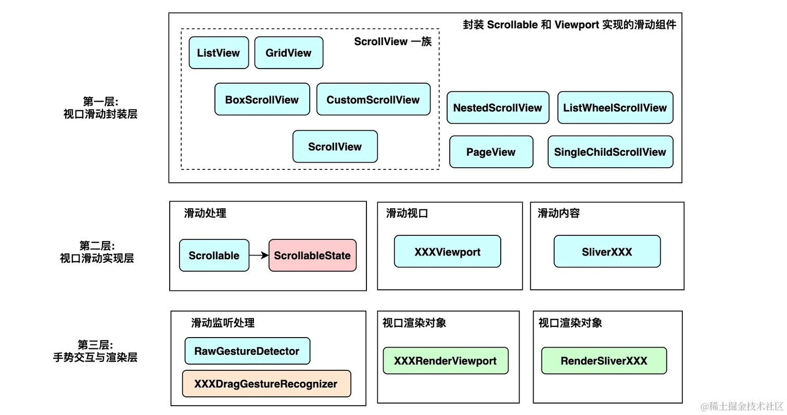
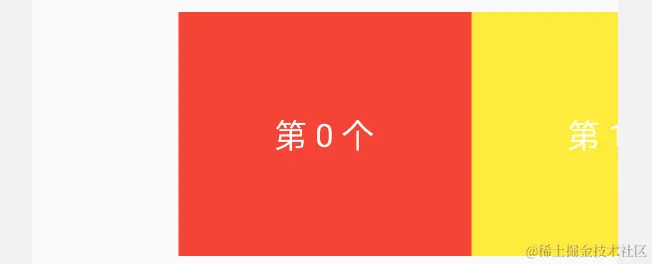
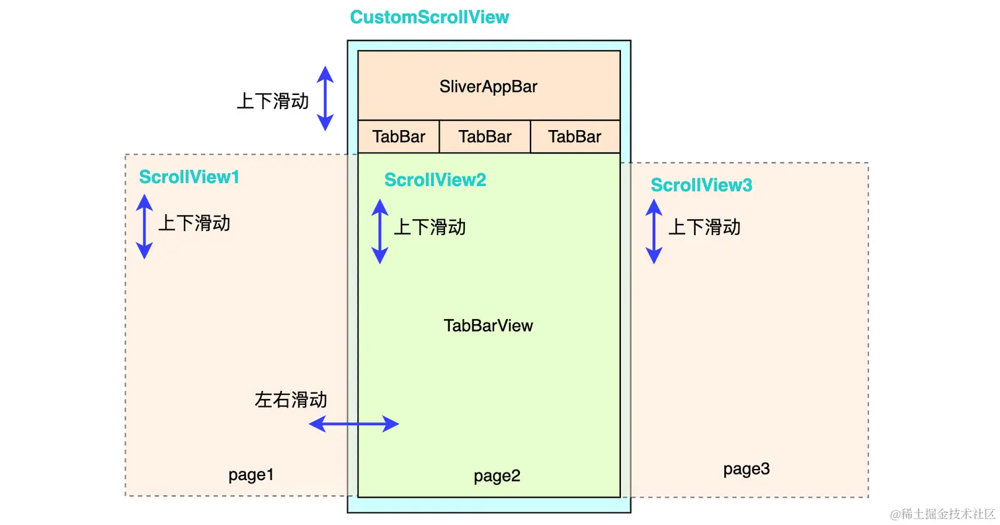

# 滚动

[TOC]

## 概述

通常将滚动方向称为主轴，非滚动方向称为副轴

Flutter 中的可滚动组件主要由三个角色组成：`Scrollable`、`Viewport` 和 `Sliver`：

- `Scrollable` ：用于处理滑动手势，确定滑动偏移，滑动偏移变化时构建 `Viewport` 
- `Viewport`：显示的视窗，即列表的可视区域；
- `Sliver`：可滚动的片段。

具体布局过程：

1. `Scrollable` 监听到用户滑动行为后，根据最新的滑动偏移构建 `Viewport` 。
2. `Viewport` 将当前视口信息和配置信息通过 `SliverConstraints` 传递给 `Sliver`。
3. `Sliver` 中对子组件按需进行构建和布局，然后确认自身的位置、绘制等信息，保存在 `SliverGeometry`  中。
4. `Viewport` 读取 `SliverGeometry`  中的信息来对 `Sliver` 进行布局和绘制。




 `RenderSliver` 和 `RenderBox` 的最核心差异在于，当渲染对象不可见时，就不会进行渲染。这个优化大大减少绘制的负担。

## ListView

`ListView`是最常用的可滚动组件之一，它可以沿一个方向线性排布所有子组件，并且它也支持列表项懒加载。它会尽量扩展到父Widget所允许的最大尺寸，而且将自己在滚动副轴上的长度，以紧约束的形式传递给它的子Widget。如果父约束是无边界（例如，其父Widget为Column），那么将会抛出异常。

在Flutter框架中，使用ListView组件的默认构造函数，会使其立即初始化children列表，即不支持懒加载，不推荐使用。

~~~dart
ListView({
  ...  
  //可滚动widget公共参数
  Axis scrollDirection = Axis.vertical,
  bool reverse = false,
  ScrollController? controller,
  bool? primary,
  ScrollPhysics? physics,
  EdgeInsetsGeometry? padding,
  
  //ListView各个构造函数的共同参数  
  double? itemExtent,
  Widget? prototypeItem, 
  bool shrinkWrap = false,
  bool addAutomaticKeepAlives = true,
  bool addRepaintBoundaries = true,
  double? cacheExtent, // 预渲染区域长度
    
  //子widget列表
  List<Widget> children = const <Widget>[],
})
~~~

- `itemExtent`：该参数如果不为`null`，则会强制`children`的“长度”为`itemExtent`的值；这里的“长度”是指滚动方向上子组件的长度。

  >固定子组件的主轴尺寸可在大幅跳转时提升性能。某程序可通过滚动控制器实现一键跳转x逻辑像素的功能。若ListView无法提前确定每个元素的高度，则跳转时它必须依次加载这些元素并完成布局测量。然而，若每个元素的高度是固定的，则只需简单计算便可得知一共需跳过个元素

- `cacheExtent`：在ListView动态加载与回收元素时，除了屏幕上可见的子组件外，ListView还会在视窗范围外额外加载x个像素作为缓冲

- `scrollDirection`：设置滚动的方向。Axis.horizontal水平滚动

- `shrinkWrap`：该属性表示是否根据子组件的总长度来设置`ListView`的长度，默认值为`false`。

- `padding`：内边距。该内边距会应用在第一个和最后一个子组件的旁边，而不是整个`ListView`上。

- `physics`，可以设置列表滚动的行为

- `addAutomaticKeepAlives`：ListView 会为每一个列表项添加一个 AutomaticKeepAlive 父组件。可以缓存列表项，保存其状态


推荐使用支持懒加载的`ListView.builder()`：

~~~java
ListView.builder({
  // ListView公共参数已省略  
  ...
  required IndexedWidgetBuilder itemBuilder,
  int itemCount,
  ...
})
 
~~~

- `itemBuilder`：它是列表项的构建器，类型为`IndexedWidgetBuilder`，返回值为一个widget。当列表滚动到具体的`index`位置时，会调用该构建器构建列表项。

- `itemCount`：列表项的数量，如果为`null`，则为无限列表。

  

`ListView.separated()`可以在生成的列表项之间添加一个分割组件，它比`ListView.builder`多了一个`separatorBuilder`参数，该参数是一个分割组件生成器。

`ListView.custom()`可以自己指定一个委托：

~~~dart
const ListView.custom({
  // 暂略其他无关内容...
  required this.childrenDelegate,
  // 暂略其他无关内容...
}) : assert(childrenDelegate != null),
~~~

在ListView组件对元素的动态加载与资源回收机制的作用下，移出屏幕的元素会被摧毁，其内部状态也一并销毁。有两种解决方案：

- 状态提升：采纳前端网页React框架中著名的Lift State Up（状态提升）思路，把列表中每个子组件的状态都提升到列表之上。不过在构建列表项时，需要根据状态来构造。

- KeepAlive：将列表项所在的State类融合AutomaticKeepAliveClientMixin类，最后覆写wantKeepAlive函数。如果返回true，那么将保存其内部状态，否则直接销毁。别忘了在`build()`内调用`super.build(context)`

  ~~~dart
  class _CounterState extends State<Counter> with AutomaticKeepAliveClientMixin {
      int _count = 0;
      
      @override
      Widget build(BuildContext context) {
          //...
      }
      
      @override
      bool get wantKeepAlive => _count != 0;
  }
  ~~~


## GridView

GridView组件是一个可将元素显示为二维网格状的列表组件，并支持主轴方向滚动。它会尽量扩展到父Widget所允许的最大尺寸。

~~~dart
  GridView({
    Key? key,
    Axis scrollDirection = Axis.vertical,
    bool reverse = false,
    ScrollController? controller,
    bool? primary,
    ScrollPhysics? physics,
    bool shrinkWrap = false,
    EdgeInsetsGeometry? padding,
    required this.gridDelegate,  //下面解释
    bool addAutomaticKeepAlives = true,
    bool addRepaintBoundaries = true,
    double? cacheExtent, 
    List<Widget> children = const <Widget>[],
    ...
  })
~~~

`GridView`和`ListView`的大多数参数都是相同的。其中我们需要关注`SliverGridDelegate`属性，它说明网格该如何构建。Flutter框架已经提供了该委托的两种实现方式，分别是：

- `SliverGridDelegateWithFixedCrossAxisCount`（交叉轴方向固定数量的委托）

  ~~~dart
  SliverGridDelegateWithFixedCrossAxisCount({
    @required double crossAxisCount, 
    double mainAxisSpacing = 0.0,
    double crossAxisSpacing = 0.0,
    double childAspectRatio = 1.0,
  })
  ~~~

  - `crossAxisCount`：副轴子元素的数量
  - `mainAxisSpacing`：主轴方向的间距
  - `crossAxisSpacing`：副轴方向子元素的间距
  - `childAspectRatio`：子元素在副轴长度和主轴长度的比例

  子元素的大小是通过`crossAxisCount`和`childAspectRatio`两个参数共同决定的

- `SliverGridDelegateWithMaxCrossAxisExtent`（交叉轴方向限制最大长度的委托）

  ~~~dart
  SliverGridDelegateWithMaxCrossAxisExtent({
    double maxCrossAxisExtent,
    double mainAxisSpacing = 0.0,
    double crossAxisSpacing = 0.0,
    double childAspectRatio = 1.0,
  })
  ~~~
  
  - `maxCrossAxisExtent`：设置每个元素的在副轴上的最大尺寸。
  
    在不考虑间距的情况下，假设GridView在副轴上的长度为$L$，而在副轴上的子元素有$x$个，它的在副轴上的宽度为$a$，那么必须满足$x*a \leq L < (x+1)*a$。


`GridView.count`构造函数内部封装了`SliverGridDelegateWithFixedCrossAxisCount`，我们通过它可以快速的创建副轴固定数量子元素的`GridView`。

`GridView.extent`构造函数内部封装了`SliverGridDelegateWithMaxCrossAxisExtent`，我们通过它可以快速的创建副轴子元素为固定最大长度的`GridView`。


~~~dart
GridView.builder(
 ...
 required SliverGridDelegate gridDelegate, 
 required IndexedWidgetBuilder itemBuilder,
)
~~~

## CustomScrollView

`CustomScrollView` 组件来帮助我们创建一个公共的 `Scrollable` 和 `Viewport` ，然后它的 `slivers` 参数接受一个 `Sliver` 数组。为所有子 `Sliver` 提供一个共享的 `Scrollable`，然后统一处理指定滑动方向的滑动事件。

~~~dart
CustomScrollView(
    slivers: [
        SliverFixedExtentList(),
        SliverFixedExtentList(),
    ],
);
~~~

| Sliver名称                | 功能                               | 对应的可滚动组件                 |
| ------------------------- | ---------------------------------- | -------------------------------- |
| SliverList                | 列表                               | ListView                         |
| SliverFixedExtentList     | 高度固定的列表                     | ListView，指定`itemExtent`时     |
| SliverAnimatedList        | 添加/删除列表项可以执行动画        | AnimatedList                     |
| SliverGrid                | 网格                               | GridView                         |
| SliverPrototypeExtentList | 根据原型生成高度固定的列表         | ListView，指定`prototypeItem` 时 |
| SliverFillViewport        | 包含多个子组件，每个都可以填满屏幕 | PageView                         |

| Sliver名称                      | 对应 RenderBox      |
| ------------------------------- | ------------------- |
| SliverPadding                   | Padding             |
| SliverVisibility、SliverOpacity | Visibility、Opacity |
| SliverFadeTransition            | FadeTransition      |
| SliverLayoutBuilder             | LayoutBuilder       |

| Sliver名称             | 说明                                                   |
| ---------------------- | ------------------------------------------------------ |
| SliverAppBar           | 对应 AppBar，主要是为了在 CustomScrollView 中使用。    |
| SliverToBoxAdapter     | 一个适配器，可以将 RenderBox 适配为 Sliver，后面介绍。 |
| SliverPersistentHeader | 滑动到顶部时可以固定住                                 |

### SliverPersistentHeader

~~~dart
class SliverPersistentHeader extends StatelessWidget {
  const SliverPersistentHeader({
    super.key,
    required this.delegate,
    this.pinned = false,			// 是否固定，即吸附在顶部
    this.floating = false,			
  });

  final SliverPersistentHeaderDelegate delegate;
}
~~~

- `floating`：Whether the header should immediately grow again if the user reverses scroll direction. 这个属性仅当`pinned = false`时起作用（经测试，桌面端的实现有Bug）
- `pinned`：Whether to stick the header to the start of the viewport once it has reached its minimum size. 


我们必须自己提供`SliverPersistentHeaderDelegate`的实现

~~~dart
class FixedPersistentHeaderDelegate extends SliverPersistentHeaderDelegate {
  final double height;

  FixedPersistentHeaderDelegate({required this.height});

  @override
  Widget build(
      BuildContext context, double shrinkOffset, bool overlapsContent) {
      // shrinkOffset表示伸缩进行，范围[0, max - min]
    return Container(
      height: height,
      alignment: Alignment.center,
      color: Colors.red,
      child: Text(
        'FixedPersistentHeader',
        style: TextStyle(color: Colors.white, fontSize: 16, fontWeight: FontWeight.bold),
      ),
    );
  }

  // maxExtent以及minExtent定义伸缩区域
  @override
  double get maxExtent => height;

  @override
  double get minExtent => height;

  @override
  bool shouldRebuild(covariant FixedPersistentHeaderDelegate oldDelegate) {
    return oldDelegate.height != height;
  }
    
  // Specifies how a pinned header or a floating header should react to RenderObject.showOnScreen calls.
  @override
  PersistentHeaderShowOnScreenConfiguration get showOnScreenConfiguration {
    return PersistentHeaderShowOnScreenConfiguration(
      minShowOnScreenExtent: double.infinity,
    );
  }
    
  TickerProvider? get vsync => null;
    
  // Creates an object that specifies how a floating header is to be "snapped" (animated) into or out of view.
  FloatingHeaderSnapConfiguration? get snapConfiguration => null;
  OverScrollHeaderStretchConfiguration? get stretchConfiguration => null;
}
~~~


### SliverFillRemaining

由于滑动的内容可以是无限的，因此滑动组件（ListView、Scrollable等等）对内容组件并没有高度约束。这对于一些组件（例如，`TabBarView`）来说，是不合预期的。

`SliverFillRemaining`正是解决这个问题的，它会填充剩余的视口空间，并给子组件传递一个约束。

## PageView

Tab 换页效果、图片轮动以及TikTok上下滑页切换视频功能等等，这些都可以通过 PageView 轻松实现。


`PageView`会尽量扩展到自身约束的最大尺寸，而且将自身约束的最大值以紧约束形式传递给子组件。

~~~dart
PageView({
  Key? key,
  this.scrollDirection = Axis.horizontal, // 滑动方向
  PageController? controller,
  this.physics,
  List<Widget> children = const <Widget>[],
  this.onPageChanged,
  this.pageSnapping = true,
})
~~~

- `pageSnapping`：如需允许用户停留在相邻页面之间的任意位置，则可传入`pageSnapping：false`实现

- `onPageChanged`：无论`pageSnapping`是否开启，页码变化的回传函数都会在翻页过半时触发，而不是在动作完成后触发

- `controller`：接受一个`PageController`（页面控制器，继承于`ScrollController`）。它的方法有：
  
  - `jumpTo(300)`可以跳转300个逻辑像素（受pageSnapping属性影响），有动画
  
  - `jumpToPage(3)`可以直接跳转到第4个页面。无动画
  - `previousPage`（跳转到前一页）和`nextPage`（跳转到后一页）方法。有动画
  
  它的定义如下：
  
  ~~~dart
  class PageController extends ScrollController {
  
    PageController({
      this.initialPage = 0,
      this.keepPage = true,
      this.viewportFraction = 1.0,
    }) : assert(viewportFraction > 0.0);
  ~~~
  
  其中， `viewportFraction` 指定条目占据视口的百分比
  
  | viewportFraction:1.0                                         | viewportFraction:0.5                                         |
  | ------------------------------------------------------------ | ------------------------------------------------------------ |
  |  |  |
  
  而PageView的padEnds属性，决定在 `viewportFraction` 小于 1 时，左右两侧需不需要保留白色的边距。
  
  | padEnds:true                                                 | padEnds:false                                                |
  | ------------------------------------------------------------ | ------------------------------------------------------------ |
  |  |  |


`PageView.builder`支持懒加载。


通过设置`physics: const NeverScrollableScrollPhysics()`来禁止用户点击。

## NestedScrollView

我们开发的时候可能会遇到这种情况。当前界面显示的内部滑动体是 `ScrollView2`，在它的区域内上下滑动时，对 `SliverAppBar` 并不会有任何影响。从本质上来说，就是内部滑动体的 `Scrollable` 对象的滑动信息，无法将滑动中的偏移数据通知外层的 `Viewport` ，从而进行重建。



```dart
const NestedScrollView({
  ... //省略可滚动组件的通用属性
  //header，sliver构造器
  required this.headerSliverBuilder,
    
  //可以接受任意的组件
  required this.body,
    
  this.floatHeaderSlivers = false,
}) 
    
typedef NestedScrollViewHeaderSliversBuilder = 
        List<Widget> Function(BuildContext context, bool innerBoxIsScrolled);
// 这里的Widget必须是Sliver
```


它的构建逻辑如下：

~~~dart
List<Widget> _buildSlivers(BuildContext context, ScrollController innerController, bool bodyIsScrolled) {
    return <Widget>[
      ...headerSliverBuilder(context, bodyIsScrolled),
        
      // 他会给body属性，自动包裹一个SliverFillRemaining.
      SliverFillRemaining(
        child: PrimaryScrollController(
          automaticallyInheritForPlatforms: TargetPlatform.values.toSet(),
          controller: innerController,
          child: body,
        ),
      ),
    ];
  }
~~~


## SingleChildScrollView

通常`SingleChildScrollView`只应在滚动的内容不会超过屏幕太多时使用。这是因为`SingleChildScrollView`不支持基于 `Sliver` 的延迟加载模型。

它将父组件传递过来的约束直接传递给子组件，然后它会尽可能地匹配子组件的大小。当子组件中的溢出时，就会提供一个滚动条。当`Column`作为`SingleChildScrollView`的孩子时且`scrollDirection = Axis.vertical`，会强制对Column组件设置`mainAxisSize：MainAxisSize.min`

~~~dart
SingleChildScrollView({
  this.scrollDirection = Axis.vertical, //滚动方向，默认是垂直方向
  this.padding, 
  bool primary, 
  this.physics, 
  this.controller,
  this.child,
})
~~~


## ScrollNotification

 `Scrollable` 组件在滑动时就会发送**滚动通知**（`ScrollNotification`）。它的子类包括：

- `ScrollStartNotification`：滚动开始通知。
- `UserScrollNotification`：用户滚动通知，通常在用户改变滚动方向时触发。
- `ScrollUpdateNotification`：滚动更新通知。
- `ScrollEndNotification`：滚动终止通知
- `OverscrollNotification`：过度滚动通知


`ScrollNotification`有一个`metrics`属性，它的类型是`ScrollMetrics`，该属性包含当前`ViewPort`及滚动位置等信息：

- `pixels`：滚动的位置
- `atEdge`：是否在顶部或底部
- axisDirection：滚动方向描述是down还是up，这个受列表reverse影响，正序就是down倒序就是up，并不代表列表是上滑还是下滑
- `extentAfter`：视口底部距离列表底部有多大
- `extentBefore`：视口顶部距离列表顶部有多大
- `extentInside`：视口范围内的列表长度
- maxScrollExtent：最大滚动距离，列表长度-视口长度
- minScrollExtent：最小滚动距离
- viewportDimension：沿滚动方向视口的长度
- `outOfRange`：是否越过边界

~~~dart
NotificationListener<ScrollNotification>(
onNotification: (notification) {
  ScrollMetrics metrics = notification.metrics;
  print('ScrollNotification####################');
  print('pixels = ${metrics.pixels}');
  print('atEdge = ${metrics.atEdge}');
  print('axis = ${metrics.axis}');
  print('axisDirection = ${metrics.axisDirection}');
  print('extentAfter = ${metrics.extentAfter}');
  print('extentBefore = ${metrics.extentBefore}');
  print('extentInside = ${metrics.extentInside}');
  print('maxScrollExtent = ${metrics.maxScrollExtent}');
  print('minScrollExtent = ${metrics.minScrollExtent}');
  print('viewportDimension = ${metrics.viewportDimension}');
  print('outOfRange = ${metrics.outOfRange}');
  print('ScrollNotification####################');
  return false;
},
~~~


## Scrollbar

Scrollbar组件可以为大部分滚动列表添加滚动条，若需要在任何设备上都显示iOS风格的滚动条，则可以直接使用CupertinoScrollbar组件。

`thumbVisbility`属性设置滚动条是否一直可见。

~~~dart
 Scrollbar(
     thumbVisibility: true,
     child: 
 )
~~~

- `isAlwaysShown` 表示 `Scrollbar` 是否一直显示
- `radius` 表示 圆角半径 ；
- `thickness` 表示 `Scrollbar` 滑块的宽度。
- `interactive`：滑块是否可交互
- `controller`：必须确保`Scrollable`所使用的`controller`与它的`controller`相同。否则就会渲染结果不符合预期


## ScrollController

~~~dart
ScrollController({
  double initialScrollOffset = 0.0, //初始滚动位置
  this.keepScrollOffset = true,//是否保存滚动位置
  ...
})
~~~

当`keepScrollOffset`为`true`时，每次滚动结束，可滚动组件都会将滚动位置`offset`存储到`PageStorage`中。此后，可滚动组件重新创建时，再从`PageStorage`中恢复。

~~~dart
ListView(key:PageStorageKey(1), ...);
~~~

它的一些常用属性和方法如下：

- `offset`：可滚动组件当前的滚动位置。只在控制器唯一绑定一个可滚动组件时，才可以访问这个属性，否则会抛出异常。

- `positions`：`ScrollController`会获取每一个可滚动组件的`ScrollPosition`对象，然后将这些`ScrollPosition`保存在该属性中。

  假设一个`ScrollController`同时被两个可滚动组件使用，那么我们可以通过如下方式分别读取他们的滚动位置：

  ~~~dart
  controller.positions.elementAt(0).pixels
  controller.positions.elementAt(1).pixels
  ~~~

- `jumpTo(double offset)`、`animateTo(double offset,...)`：这两个方法用于跳转到指定的位置。

  `offset`可以设置为负数，列表则会跳转至顶部后过量滚动，产生触顶动画并自动纠正至`0.0`

- `addListener`：在滚动值发生变化时调用

  ~~~dart
  _controller.addListener((){ print("现在的位置: ${_controller.offset}");});
  ~~~


使用用例：

~~~dart
class _MyAppState extends State<MyApp> {
    final List<int> data = List.generate(60, (index) => index + 1);
    final ScrollController _ctrl = ScrollController();	// 创建
    
    @override
    void initState() {
        super.initState();
        _ctrl.addListener(listenScroll);	// 监听
    }
    
    @override
    void dispose() {
        _ctrl.dispose();
        super.dispose();
    }
    
    @override
    Widget build(BuildContext context) {
        return Scrollable(
        	controller: _ctrl,
            viewportBuilder: _buildViewPort,
        )
    }
}
~~~

