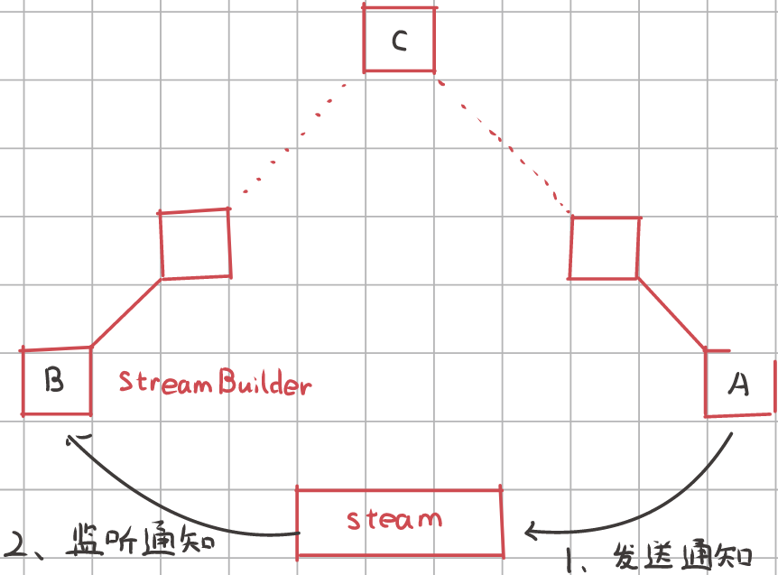
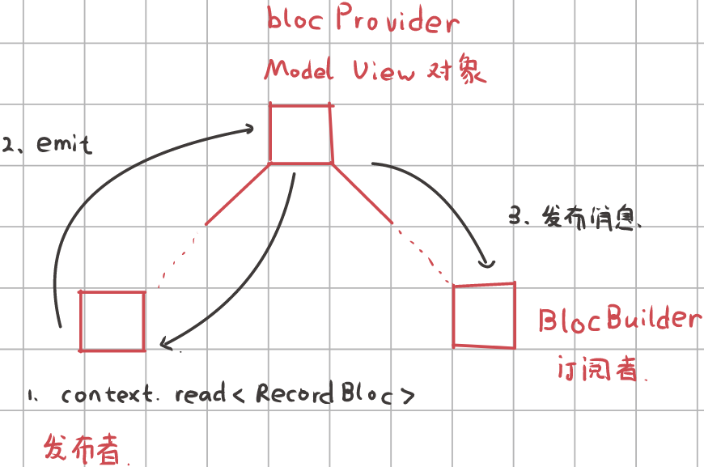

[TOC]

## 多媒体

### 音频


### 视频


## 网络请求

### HTTP

#### HttpClient

先给出一个GET HTTP Request的例子：

~~~dart
//创建一个HttpClient
HttpClient httpClient = HttpClient();

//设置一个URI，指定协议、域名以及查询参数
Uri uri = Uri(scheme: "https", host: "flutterchina.club", queryParameters: {
    "xx":"xx",
    "yy":"dd"
});

HttpClientRequest request = await httpClient.getUrl(uri);		//GET请求

//设置请求header
request.headers.add("user-agent", "test");


//等待response
HttpClientResponse response = await request.close();

//读取响应内容
String responseBody = await response.transform(utf8.decoder).join();

//关闭HttpClient
httpClient.close();
~~~

此外，其他的`Http Method`可调用`httpClient.post(...)`、`httpClient.delete(...)`来创建。如果是post或put等可以携带请求体方法，可以通过HttpClientRequest对象发送请求体，如：

~~~dart
String payload="...";
request.add(utf8.encode(payload)); 
//request.addStream(_inputStream); //可以直接添加输入流
~~~


`HttpClient`有很多属性可以配置，常用的属性列表如下：

| 属性                  | 含义                                                         |
| --------------------- | ------------------------------------------------------------ |
| idleTimeout           | 对应请求头中的keep-alive字段值，为了避免频繁建立连接，httpClient在请求结束后会保持连接一段时间，超过这个阈值后才会关闭连接。 |
| connectionTimeout     | 和服务器建立连接的超时，如果超过这个值则会抛出SocketException异常。 |
| maxConnectionsPerHost | 同一个host，同时允许建立连接的最大数量。                     |
| autoUncompress        | 对应请求头中的Content-Encoding，如果设置为true，则请求头中Content-Encoding的值为当前HttpClient支持的压缩算法列表，目前只有"gzip" |
| userAgent             | 对应请求头中的User-Agent字段。                               |

这样设置对所有的HttpClientRequest都生效。

#### Authentication

Http协议的**认证（Authentication）**机制可以用于保护非公开资源。如果Http服务器开启了认证，那么用户在发起请求时就需要携带用户凭据。

Http认证有 ：Basic 认证、Digest 认证、Client 认证、Form Based 认证等。目前Flutter 的 HttpClient 只支持 Basic 和 Digest 两种认证方式，这两种认证方式最大的区别是发送用户凭据时，对于用户凭据的内容，前者只是简单的通过 Base64 编码（可逆），而后者会进行哈希运算。


`HttpClient`关于Http认证的方法和属性：

1. `addCredentials(Uri url, String realm, HttpClientCredentials credentials)`

   该方法用于向指定的URL添加用户凭据,如：

   ```dart
   HttpClient httpClient = HttpClient();
   httpClient.addCredentials(_uri,
    "admin", 
     HttpClientBasicCredentials("username","password"), //Basic认证凭据
     HttpClientDigestCredentials("username","password") //Digest认证凭据       
   );
   ```

2. `authenticate(Future<bool> f(Uri url, String scheme, String realm))`

   这是一个setter，类型是一个回调，当服务器需要用户凭据且该用户凭据未被添加时，httpClient会调用此回调，在这个回调当中，一般会调用`addCredential()`来动态添加用户凭证

   ~~~dart
   HttpClient httpClient = HttpClient();
   httpClient.authenticate=(Uri url, String scheme, String realm) async{
     if(url.host=="xx.com" && realm=="admin"){
       httpClient.addCredentials(url,
         "admin",
         HttpClientBasicCredentials("username","pwd"), 
       );
       return true;
     }
     return false;
   };
   ~~~

   

#### Porxy

可以通过`findProxy`来设置代理策略

~~~dart
HttpClient httpClient = HttpClient();
httpClient.findProxy = (uri) {
    // 如果需要过滤uri，可以手动判断
    return "PROXY 192.168.1.2:8888";
};
~~~

`findProxy` 回调返回值是一个遵循浏览器PAC脚本格式的字符串。如果不需要代理，返回"DIRECT"即可。

有时代理服务器也启用了身份验证，这和http协议的认证是相似的，HttpClient提供了对应的Proxy认证方法和属性：

```dart
set authenticateProxy(
    Future<bool> f(String host, int port, String scheme, String realm));
void addProxyCredentials(
    String host, int port, String realm, HttpClientCredentials credentials);
```


#### 证书校验

Https中为了防止通过伪造证书而发起中间人攻击，客户端应该对自签名或非CA颁发的证书进行校验。`HttpClient`对证书校验的逻辑如下：

1. 如果返回的Https证书是可信CA颁发的，并且访问host包含在证书的domain列表中，并且证书未过期，则验证通过。
2. 如果第一步验证失败，但在创建HttpClient时，已经通过 SecurityContext 将证书添加到证书信任链中，那么当服务器返回的证书在信任链中的话，则验证通过。
3. 如果1、2验证都失败了，如果用户提供了`badCertificateCallback`回调，则会调用它，如果回调返回`true`，则允许继续链接，如果返回`false`，则终止链接。

综上所述，我们的证书校验其实就是提供一个`badCertificateCallback`回调，下面通过一个示例来说明。


假设我们的后台服务使用的是自签名证书，证书格式是PEM格式，我们将证书的内容保存在本地字符串中，那么我们的校验逻辑如下：

```dart
String PEM = "XXXXX";//可以从文件读取
...
httpClient.badCertificateCallback = (X509Certificate cert, String host, int port){
  if(cert.pem == PEM){
    return true; //证书一致，则允许发送数据
  }
  return false;
};
```

对于自签名的证书，我们也可以将其添加到本地证书信任链中，这样证书验证时就会自动通过，而不会再走到`badCertificateCallback`回调中：

~~~dart
SecurityContext sc = SecurityContext();
//file为证书路径
sc.setTrustedCertificates(file);
//创建一个HttpClient
HttpClient httpClient = HttpClient(context: sc);
~~~


#### dio

直接使用HttpClient发起网络请求是比较麻烦的。我们可以使用dio库，它是一个强大的Dart Http请求库，支持Restful API、FormData、拦截器、请求取消、Cookie管理、文件上传/下载、超时等

发送一个GET请求

~~~dart
final dio = Dio();
Response response = await dio.get("https://localhost:8080/test?id=12&name=wendu");

response.data.toString();
~~~

发送一个POST请求

~~~dart
response=await dio.post("/test",data:{"id":12,"name":"wendu"}) 
    
FormData formData = FormData.from({
    "name": "wendux",
    "age": 25,
    "file1": UploadFileInfo(File("./upload.txt"), "upload1.txt"),
    "file2": UploadFileInfo(File("./upload.txt"), "upload2.txt"),
     // 支持文件数组上传
    "files": [
      UploadFileInfo(File("./example/upload.txt"), "upload.txt"),
      UploadFileInfo(File("./example/upload.txt"), "upload.txt")
    ]
});
response = await dio.post("/info", data: formData)
~~~

下载文件

~~~dart
//下载文件    
response=await dio.download(
    "https://www.google.com/",
    _savePath,
    onReceiveProgress: createCallback(no), // 创建进度回调，后面实现
    options: Options(
      headers: {"range": "bytes=$start-$end"}, //指定请求的内容区间
    ),
);	
~~~

并发请求

~~~dart
response= await Future.wait([dio.post("/info"),dio.get("/token")]);		//并发请求
~~~

认证

~~~dart
//onHttpClientCreate会在当前dio实例内部需要创建HttpClient时调用
(dio.httpClientAdapter as DefaultHttpClientAdapter).onHttpClientCreate = (client) {
	//设置代理 
    client.findProxy = (uri) {
    	return "PROXY 192.168.1.2:8888";
    };
    //校验证书
    httpClient.badCertificateCallback=(X509Certificate cert, String host, int port){
        if(cert.pem==PEM){
        return true; //证书一致，则允许发送数据
        }
        return false;
    };   
};
~~~


#### 分块下载

> 分块下载真的能提高下载速度吗？
>
> 答：分块下载的最终速度受设备所在网络带宽、源出口速度、每个块大小、以及分块的数量等诸多因素影响。如果是同一个数据源，分块下载的意义并不大。如果是多个数据源分块下载，速度也不一定快。假设有三个源，三个源的出口带宽都为1Gb/s，而我们设备所连网络的峰值假设只有800Mb/s，那么瓶颈就在我们的网络。假设有两个源A和B，速度A源是B源的3倍。如果采用分块下载，两个源各下载一半所需的时间比单线程从A源下载的时间要长。
>
> 分块下载还有一个比较使用的场景是断点续传。


我们可以指定请求头的"range"字段来验证服务器是否支持分块传输

~~~shell
bogon:~ duwen$ curl -H "Range: bytes=0-10" http://download.dcloud.net.cn/HBuilder.9.0.2.macosx_64.dmg -v
# 请求头
> GET /HBuilder.9.0.2.macosx_64.dmg HTTP/1.1
> Range: bytes=0-10
# 响应头
< HTTP/1.1 206 Partial Content
< Content-Range: bytes 0-10/233295878
~~~

如果服务器不支持分块传输，那么在Response中不包括Content-Range字段。

基于此，我们可以设计一个简单的多线程的文件分块下载器，实现的思路是：

1. 先检测是否支持分块传输，如果不支持，则直接下载；若支持，则将剩余内容分块下载。
2. 各个分块下载时保存到各自临时文件，等到所有分块下载完后合并临时文件。
3. 删除临时文件。

### WebSockets

Http协议是无状态的，只能由客户端主动发起，服务端再被动响应，服务端无法向客户端主动推送内容，并且一旦服务器响应结束，链接就会断开，所以无法进行实时通信。WebSocket协议正是为解决客户端与服务端实时通信而产生的技术

> 注意：Http协议中虽然可以通过keep-alive机制使服务器在响应结束后链接会保持一段时间，但最终还是会断开，keep-alive机制主要是用于避免在同一台服务器请求多个资源时频繁创建链接，它本质上是支持链接复用的技术，而并非用于实时通信


WebSocket协议本质上是一个基于tcp的协议，它是先通过HTTP协议发起一条特殊的http请求进行握手后，如果服务端支持WebSocket协议，则会进行协议升级。WebSocket会使用http协议握手后创建的tcp链接，和http协议不同的是，WebSocket的tcp链接是个长链接（不会断开），所以服务端与客户端就可以通过此TCP连接进行实时通信。

使用 WebSocket 通信分为五个步骤：

1. 连接到WebSocket服务器

   ~~~dart
   final channel = IOWebSocketChannel.connect('wss://echo.websocket.events');
   ~~~

2. 监听来自服务器的消息。

   ~~~dart
   StreamBuilder(
     stream: channel.stream,
     builder: (context, snapshot) {
       return Text(snapshot.hasData ? '${snapshot.data}' : '');
     },
   );
   ~~~

3. 将数据发送到服务器。

   ~~~dart
   channel.sink.add('Hello!');
   ~~~

4. 关闭WebSocket连接。

   ~~~dart
   channel.sink.close();
   ~~~

   

### Socket

Socket API 是操作系统为实现应用层网络协议提供的一套基础的、标准的API，它是对**传输层**网络协议（主要是TCP/UDP）的一个封装。

如果我们需要自定义协议或者想直接来控制管理网络链接，这时我们就需要使用Socket。

~~~dart
 //建立连接
var socket = await Socket.connect("baidu.com", 80);
//根据http协议，发起 Get请求头
socket.writeln("GET / HTTP/1.1");
socket.writeln("Host:baidu.com");
socket.writeln("Connection:close");
socket.writeln();
await socket.flush(); //发送
//读取返回内容，按照utf8解码为字符串
String _response = await utf8.decoder.bind(socket).join();
await socket.close();
~~~

### JSON

后台接口往往会返回一些结构化数据，如 JSON、XML 等。为了方便我们在代码中操作 JSON，我们先将 JSON 格式的字符串转为 Dart 对象，这个可以通过 `dart:convert` 中内置的 JSON 解码器`json.decode()`来实现，该方法可以根据 JSON 字符串具体内容将其转为 List 或 Map。

~~~dart
//一个JSON格式的用户列表字符串
String jsonStr='[{"name":"Jack"},{"name":"Rose"}]';`
//将JSON字符串转为Dart对象(此处是List)
List<dynamic> items=json.decode(jsonStr);
//输出第一个用户的姓名
print(items[0]["name"]);
~~~

注意`json.decode()`仅返回一个`Map<String, dynamic>`。这意味着直到运行时我们才知道值的类型。 通过这种方法，我们失去了大部分静态类型语言特性。

一个解决方法就是“Json Model化”。即通过预定义一些与 Json 结构对应的 Model 类，然后在请求到数据后再动态根据数据创建出 Model 类的实例。这样一来，在开发阶段我们使用的是 Model 类的实例，而不再是 Map/List，这样访问内部属性时就不会发生拼写错误。那么现在调用代码可以具有类型安全、自动补全字段以及编译时异常。

~~~dart
class User {
  final String name;
  final String email;

  User(this.name, this.email);

  User.fromJson(Map<String, dynamic> json)
      : name = json['name'],
        email = json['email'];

  Map<String, dynamic> toJson() =>
    <String, dynamic>{
      'name': name,
      'email': email,
    };
}
~~~

使用用例：

~~~dart
Map<String, dynamic> userMap = jsonDecode(jsonString);
var user = User.fromJson(userMap);

String json = jsonEncode(user);
~~~


如果要序列化一个对象，那么实现toJson()方法，然后直接将该对象传递给该json.encode方法即可：

~~~dart
String json = json.encode(user);
~~~


## 持久化

### 文件

[`PathProvider` (opens new window)](https://pub.dartlang.org/packages/path_provider)插件提供了一种平台透明的方式来访问设备文件系统上的常用位置。该类当前支持访问两个文件系统位置：

- **临时目录:** 可以使用 `getTemporaryDirectory()` 来获取临时目录；在 iOS 上，这对应于[`NSTemporaryDirectory()` (opens new window)](https://developer.apple.com/reference/foundation/1409211-nstemporarydirectory)返回的值。在 Android上，这是[`getCacheDir()` (opens new window)](https://developer.android.com/reference/android/content/Context.html#getCacheDir())返回的值。

- **文档目录:** 可以使用`getApplicationDocumentsDirectory()`来获取应用程序的文档目录，该目录用于存储只有自己可以访问的文件。在 iOS 上，这对应于`NSDocumentDirectory`。在 Android 上，这是`AppData`目录。在Windows上就是`document`

### SQLite

最常用的数据库插件是 `sqflite` 插件，默认支持 `Android`、`iOS`、`MacOS`。

`sqflite_common_ffi`支持 `Windows`、`Linux` 桌面端。`sqflite_common_ffi_web`实验性支持`Web`。注意`Windows`平台还需要下载 [sqlite3.dll](https://github.com/tekartik/sqflite/raw/master/sqflite_common_ffi/lib/src/windows/sqlite3.dll)，一般放在项目的根目录里。


下面我们介绍如何在MVVM架构中整合SQLite插件。

首先，定义一个`LocalDatabaseHelper`辅助类，处理不同平台上的差异

~~~dart
import 'dart:ffi';
import 'dart:io';
import 'package:path/path.dart';
import 'package:path_provider/path_provider.dart';
import 'package:sqlite3/open.dart';
import 'package:sqlite3/sqlite3.dart';
class LocalDatabaseHelper {
  static const String dirName = 'databases_HYS7GV4U';

  const LocalDatabaseHelper();

  void setupDatabase() {
    // 加载Windows平台的DDL文件
    if (Platform.isWindows) {
      String location = Directory.current.path;

      //dll文件已经放在了项目的根目录中
      _windowsInit(join(location, 'sqlite3.dll'));
    }
  }

  // 加载dll文件
  void _windowsInit(String path) {
    open.overrideFor(OperatingSystem.windows, () {
      try {
        return DynamicLibrary.open(path);
      } catch (e) {
        stderr.writeln('Failed to load sqlite3.dll at $path');
        rethrow;
      }
    });
    sqlite3.openInMemory().dispose();
  }

  // 获取数据库文件所在文件夹的默认路径，如果不存在则创建一个
  Future<String> getDbDirPath() async {
    Directory appDocDir = await getApplicationDocumentsDirectory();
    
    String dirPath = join(appDocDir.path, dirName);

    // 创建文件夹
    Directory result = Directory(dirPath);
    if (!result.existsSync()) {
      result.createSync(recursive: true);
    }

    return dirPath;
  }
}

~~~

定义一个`LocalDb`类，负责与数据库进行通信。

~~~dart
import 'dart:async';
import 'dart:io';

import 'package:poetry/Helper/Util/LocalDatabaseHelper.dart';
import 'package:poetry/Repository/DataSource.dart';
import 'package:sqflite_common_ffi/sqflite_ffi.dart';
import 'package:path/path.dart' as path;

class LocalDatabase implements DataSource {
  Database? _database;

  LocalDatabase._();
  static LocalDatabase database = LocalDatabase._();

  final LocalDatabaseHelper helper = const LocalDatabaseHelper();

  // 与数据库建立连接
  @override
  Future<void> connect(ConnectionArgument? connectionArgument) async {
    if (_database != null) return;
    helper.setupDatabase();

    // 数据库文件所在的文件夹路径
    String dbDirPath = await helper.getDbDirPath();

    // 数据库文件的路径
    String dbPath = path.join(dbDirPath, 'sqlite.db');

    //当文件夹中未发现数据库时，会创建数据库并触发 onCreate 回调
    //当数据库的版本变化时，会触发 onUpgrade 回调；
    //数据库打开成功后，会触发 onOpen 函数通知。
    OpenDatabaseOptions options = OpenDatabaseOptions(
        version: 1,
        onCreate: _onCreate,
        onUpgrade: _onUpgrade,
        onOpen: _onOpen);

    // 在Windows/Linux下，与数据库建立连接
    if (Platform.isWindows || Platform.isLinux) {
      DatabaseFactory databaseFactory = databaseFactoryFfi;
      _database = await databaseFactory.openDatabase(
        dbPath,
        options: options,
      );
      return;
    }

    // 在Android、Ios、Mac下，与数据库建立连接
    _database = await openDatabase(
      dbPath,
      version: options.version,
      onCreate: options.onCreate,
      onUpgrade: options.onUpgrade,
      onOpen: options.onOpen,
    );
  }

  // 释放连接
  @override
  Future<void> close() async {
    await _database?.close();
    _database = null;
  }

  FutureOr<void> _onCreate(Database db, int version) async {
    // 这里执行创建表的逻辑
  }

  FutureOr<void> _onUpgrade(Database db, int oldVersion, int newVersion) {}

  FutureOr<void> _onOpen(Database db) {
    // 这里依赖注入_recordDao对象
    _recordDao = recordDaoImpl();
  }

  late RecordDao _recordDao;
  RecordDao get recordDao => _recordDao;
}

~~~

这里定义 `Dao`接口以及`DataSource`接口，对不同的数据来源提供统一的操作接口

~~~dart
class DataSource {
  DataSource._();
  static DataSource dataSource = DataSource._();

  Future<void> connect(ConnectionArgument? connectionArgument) async {
    throw UnimplementedError();
  }

  Future<void> close() async {
    throw UnimplementedError();
  }
    
  RecordDao get recordDao;
}

class ConnectionArgument {}
~~~


~~~dart
abstract class RecordDao {
  /// 查询记录
  Future<List<Record>> search({
    int page = 1,
    int pageSize = 25,
    String? arg,
  });

  /// 插入记录
  Future<int> insert(Record record);

  /// 根据 [id] 删除记录
  Future<int> deleteById(int id);

  /// 修改记录
  Future<int> update(Record record);
}
~~~

定义数据对象：
~~~dart
class Record { //... }
~~~

定义`LocalDatabase`的`Dao`对象，它依赖于`Database`对象（sqlite3），负责与本地数据库进行交互：

~~~dart

// dao 依赖于 Database 对象，是纯粹和数据库进行交互的层级，承担核心的数据库操作任务。
class RecordDaoImpl implements RecordDao {
  final Database _database;

  RecordDaoImpl(this._database);

  // page 1 pageSize 25 ==> 1~25
  Future<List<Map<String, Object?>>> _search(
      int page, int pageSize, String? arg) {
    String? where;
    List<Object?>? whereArgs;
    if (arg != null) {
      where = "title LIKE ?";
      whereArgs = ['%$arg%'];
    }

    return _database.query('Recorder',
        where: where,
        whereArgs: whereArgs,
        limit: pageSize,
        offset: (page - 1) * pageSize);
  }

  @override
  Future<List<Record>> search(
      {int page = 1, int pageSize = 25, String? arg}) async {
    List<Map<String, Object?>> result = await _search(page, pageSize, arg);
    return result.map(Record.fromJson).toList();
  }

  Future<int> insert(Record data) => _database.insert(
        'Recorder',
        data.toJson(),
        conflictAlgorithm: ConflictAlgorithm.replace,
      );

  Future<int> deleteById(int id) => _database.delete(
        'Recorder',
        where: "id = ?",
        whereArgs: [id],
      );

  Future<int> update(Record data) => _database.update(
        'Recorder',
        data.toJson(),
        where: "id = ?",
        whereArgs: [data.id],
      );
}
~~~

### Key-Value

`shared_preferences`主要的作用是用于将键值对数据**异步持久化到磁盘**。可用于

- Web Cache的实现
- 配置信息的保存

它通过封装 iOS 上的 `NSUserDefaults` 和 Android 上的 `SharedPreferences` 为简单数据提供持久化存储。

支持存储类型：`bool`、`int`、`double`、`string`、`stringList`


获取实例对象：

~~~dart
SharedPreferences? sharedPreferences = await SharedPreferences.getInstance();
~~~

调用`set`方法保存数据：

~~~dart
// 设置string类型
  await sharedPreferences?.setInt("name", 12);
~~~

调用`get`方法读取持久化数据：

~~~dart
sharedPreferences?.getInt("name")
~~~

此外还有一些方法`getKeys()`、`containsKey()`、`remove()`、`clear()`


## Bloc

在Flutter框架中，处理数据跨节点传输的思路就是「状态提升」：


如果组件间是强依赖关系，而且嵌套层数只有一、二层（处理组件的内部状态），那么就推荐使用这个状态提升方案。


如果嵌套层数过多，或者组件之间的依赖关系很弱，那么推荐使用基于Stream对象的订阅发布模型：




`Bloc`框架是提供一个基于 `Stream` 的 `MVVM` 架构中的 `ViewModel `层。**一方面，它将业务逻辑以及视图逻辑解耦；另一方面，实现了订阅者发布者框架，解决了在状态提升中的跨节点更新难的问题。**



`Bloc`框架提供了`Cubit`对象以及`Bloc`对象，它们都是 `BlocBase` 的派生类，并把流控制器隐藏在了内部。`Cubit` 弱化了事件的概念。而 `Bloc` 依赖于事件来触发业务逻辑，可以定义多种类型的事件进行分发（在Cubit视角中，只有一种事件），是一种更加灵活的用法。


首先定义事件，这些**事件都携带着要更新视图的所需数据**：

~~~dart
// 要定义多种要分发的事件，必须要使用继承、多态特性

abstract class MatchEvent {
  const MatchEvent();
    
  @override
  List<Object?> get props => [];
}

class ChangeRegex extends MatchEvent {
  final String pattern;
  const ChangeRegex({required this.pattern});
}

class ChangeContent extends MatchEvent {
  final String content;
  const ChangeContent({required this.content});
}

class HoverMatchRegex extends MatchEvent {
  final MatchInfo? matchInfo;
  const HoverMatchRegex({required this.matchInfo});
}

class UpdateRegexConfig extends MatchEvent {
  final RegExpConfig config;
  const UpdateRegexConfig({required this.config});
}
~~~

然后定义状态类：

~~~dart
class MatchState {	//... }
~~~


接着定义`ModelView`层对象，首先来看看`Bloc`对象是如何定义的。`Bloc`中有两个泛型，分别表示事件和状态：

~~~dart
class MatchBloc extends Bloc<MatchEvent, MatchState> {
  // MatchState 是 ViewModel 对象所维护的状态
  // 我们不用再显式维护这个状态了，通过super.state可以访问到这个状态
  
  MatchBloc() : super(const MatchSuccess()) {		//设置初始状态
    // 调用On方法，为某个事件注册回调函数
    on<ChangeRegex>(_onChangeRegex);
    on<ChangeContent>(_onChangeContent);
    on<HoverMatchRegex>(_onHoverMatchRegex);
    on<UpdateRegexConfig>(_onUpdateRegexConfig);
  }

  void _onChangeRegex(ChangeRegex event, Emitter<MatchState> emit) {
    // 更新状态的具体逻辑（1）
    // 1. 通过super.state 获取当前ViewModel对象的状态
    // 2. 结合event事件中的数据做业务逻辑处理  
    // 3. 最后再通过emit(state)函数来更新状态
	// .... 
      
   	// 更新状态并通知订阅者
    emit(match);
  }

  void _onHoverMatchRegex(HoverMatchRegex event, Emitter<MatchState> emit) {
    // 更新状态的具体逻辑（2）
    // 1. 定义一个局部状态 match
    // 2. 结合event事件中的数据做业务逻辑处理  
    // 3. 最后再通过emit(match)来更新状态
    MatchState match;
    
    // ... 
    emit(match);
  }

  void _onChangeContent(ChangeContent event, Emitter<MatchState> emit) {
    // ... 
    emit(match);
  }

  void _onUpdateRegexConfig(UpdateRegexConfig event, Emitter<MatchState> emit) {
    // ... 
    emit(match);
  }
}
~~~

通过`emit()`函数来向订阅者发送通知，并且用实参来设置状态。


Cubit对象的定义很简单，它仅仅关注状态的定义，而无需定义或注册事件：

~~~dart
class RecordBloc extends Cubit<RecordState> {
  RecordBloc() : super(const EmptyRecordState()); //设置初始状态
    
  // 按需调用这个方法，调用emit更新状态，并向订阅者发送通知
  void loadRecord() async {
 	// ... 
    emit(state);
  }
	
  // 按需调用这个方法，调用emit更新状态，并向订阅者发送通知
  void select(int id) {
    // ...
    emit(state.copyWith(activeRecordId: id));
  }
}
~~~


再定义订阅者，有以下几种定义方式：

- `BlocBuilder` ：

  ~~~dart
  @override
  Widget build(BuildContext context) {
      return BlocBuilder<MatchBloc, MatchState>(
          condition: (previousState, state) {
      		//根据返回的状态决定是否重构组件
              return true;
    		},
      	builder: (context, state) {
          	//根据Bloc的状态构建组件
              return _buildWidgetByState(state);
    		}	
      )
  }
  ~~~

- `BlocListener`：与`BlocBuilder`类似，但是它的回调函数并没有返回值，通常用在导航、SnackBar和显示Dialog的场景。

  ~~~dart
  BlocListener<BlocA, BlocAState>(
    listenWhen: (curretnState, nextState) {
        return true;
    }
      
    listener: (context, state) {
      //基于BlocA的状态执行某些操作
    }
    child: Widget(),
  )
  ~~~

- `MultiBlocListener`组件可以同时监听多个bloc的状态

  ```dart
  MultiBlocListener(
    listeners: [
      BlocListener<BlocA, BlocAState>(
        listener: (context, state) {},
      ),
      BlocListener<BlocB, BlocBState>(
        listener: (context, state) {},
      ),
      // ...
    ],
    child: Widget(),
  )
  ```

- `watch` ：除了使用`BlocBuilder`来监听重新构建之外，还可以在控件内部通过 `watch` 获取 `MatchBloc` ，并向`Bloc`注册该订阅者。这样当状态发生变化，会触发 `build` 进行重新构建：

  ~~~dart
  class RegexConfigTools extends StatelessWidget {
      @override
      Widget build(BuildContext context) {
          //获取Bloc对象，并监听事件
  		MatchBloc bloc = context.watch<MatchBloc>();
          
      }
  }
  ~~~

- `read`，它只会获取Bloc对象，而不会进行监听。

- `select`：监听并获取状态的某个属性。如果发生变化了，那么就触发 `build` 进行重新构建：

  ~~~dart
  @override
  Widget build(BuildContext context) {
    //要监听的属性类型RegExpConfig，要监听的ModelView层对象是MatchBloc
    RegExpConfig config = context.select<MatchBloc, RegExpConfig>(
      // 这个回调函数通过参数，传递一个ModelView对象，并返回RegExpConfig类型的数据
      (bloc) => bloc.state.config,
    );
    // ... 
  }
  ~~~

  

那么怎么发送消息呢？首先通过`MatchBloc bloc = context.read<MatchBloc>();`来获取ViewModel对象

- 对于Bloc类型的对象，需要调用`bloc#add()`的方法来发布消息：

  ~~~dart
  // 发布UpdateRegexConfig类型的消息，并携带RegExpConfig类型的数据
  bloc.add(UpdateRegexConfig(config: cfg));
  ~~~

- 对于Cubit类型的对象，直接调用暴露出来的方法即可


最后再实例化`ModelView`对象：

~~~
BlocProvider<RecordBloc>(
    create: (_) => MatchBloc(),
    child: Widget(); 
);
~~~


如何用`Bloc`对象来处理复杂的数据依赖关系呢？下面给出一种常见的情景：

~~~dart
@override
Widget build(BuildContext context) {
    return BlocProvider<RecordBloc>(
        create: (_) => RecordBloc(),
        child: BlocProvider<MatchBloc>(
            create: (_) => MatchBloc(),
            child:  BlocProvider<LinkRegexBloc>(
                create: (_) => LinkRegexBloc(),
                child: MaterialApp(
                    title: 'regexpo',
                    debugShowCheckedModeBanner: false,
                    theme: ThemeData(
                    	primarySwatch: Colors.blue,
                    ),
                    home: const HomePage(),
                ),
            ),
        ),
    );
}
~~~

遗憾的是，这种嵌套多个`BlocProviders`的场景只能处理数据的单向依赖关系，因为`context.read<Bloc>`只能从下往上，而不能反过来。数据的双向依赖关系只能将数据状态暴露给依赖者，并在依赖者中实现数据的业务逻辑，这样才能拆分成单向关系，但这违反了最小依赖的原则。用图来描述的的、更加复杂的依赖关系，业务逻辑的拆分更加困难，甚至无从下手。好在我们可以使用`MultiBlocProvider`，这样`context.read<Bloc>`就可以读取到相互依赖的`Bloc`对象，从而避免这个问题：

~~~dart
@override
Widget build(BuildContext context) {
  return MultiBlocProvider(
    providers: [
      BlocProvider<AppConfigBloc>(create: (_) => AppConfigBloc()),
      BlocProvider<RecordBloc>(create: (_) => RecordBloc()),
      BlocProvider<LinkRegexBloc>(create: (_) => LinkRegexBloc()),
      BlocProvider<MatchBloc>(create: (_) => MatchBloc()),
    ],
    child: child,
  );
}
~~~


此外，我们可以覆写onChange方法，来“观察”Cubit对象的变化：

~~~dart
class CounterCubit extends Cubit<int> {
  CounterCubit() : super(0);

  void increment() => emit(state + 1);

  @override
  void onChange(Change<int> change) {
    super.onChange(change);
    print(change);
  }
}
~~~

此外Bloc对象除了能够覆写onChange方法，还可以覆写onTransition方法，当Bloc对象接受到事件后，就会触发onTransition方法：

~~~dart
class CounterIncrementPressed extends CounterEvent {}

class CounterBloc extends Bloc<CounterEvent, int> {
  CounterBloc() : super(0) {
    on<CounterIncrementPressed>((event, emit) => emit(state + 1));
  }

  @override
  void onChange(Change<int> change) {
    super.onChange(change);
    print(change);
  }

  @override
  void onTransition(Transition<CounterEvent, int> transition) {
    super.onTransition(transition);
    print(transition);  // { currentState: 0, event: CounterIncrementPressed, nextState: 1 }
  }
} 
~~~


## 桌面端特性

### window_manager

`window_manager`插件一些平台特性，例如自定义标题栏、管理应用窗口的尺寸、监听事件、最小化、边框阴影等特性。详情请见[window_manager](https://gitee.com/leanflutter/window_manager#%E7%9B%91%E5%90%AC%E4%BA%8B%E4%BB%B6)

~~~dart
void main() async {
  WidgetsFlutterBinding.ensureInitialized();
  await windowManager.ensureInitialized();

  WindowOptions windowOptions = const WindowOptions(
    size: Size(800, 600),
    center: true,
    backgroundColor: Colors.transparent,
    skipTaskbar: false,
    titleBarStyle: TitleBarStyle.hidden,
    windowButtonVisibility: false,
  );
  windowManager.waitUntilReadyToShow(windowOptions, () async {
    await windowManager.show();
    await windowManager.focus();
  });

  runApp(const MyApp());
}
~~~


在`Windows`下，如果你隐藏了标题栏，那么应用就不可被拖动。为此，我们需要`DragToMoveArea`组件来解决这个问题。

~~~dart
DragToMoveArea(
  child: Container(
    width: 300,
    height: 32,
    color: Colors.red,
  ),
)
~~~


