# 日志存储

[TOC]

## 文件布局

为了防止 Log 过大， Kafka 又引入了日志分段（LogSegment）。Log 以文件夹的形式存储，而每个 LogSegment 对应于磁盘上的日志文件、索引文件等。

 Log 中追加消息时是顺序写入的，只有最后一个 LogSegment 才能执行写入操作。我们称最后一个 `LogSegment` 为 `activeSegment`。

为了便于消息的检索，每个 LogSegment 中的日志文件（以“.log”为文件后缀）都有对应的两个索引文件：偏移量索引文件（以“.index”为文件后缀）和时间戳索引文件（以“.timeindex” 为文件后缀）。每个 LogSegment 都有一个基准偏移量 baseOffset，用来表示当前 LogSegment 中第一条消息的 offset。偏移量是一个 64 位的长整型数。它们都是都是根据基准偏移量（baseOffset）命名的。比如第一个 LogSegment 的基准偏移量为 114514，对应的日志文件为 00000000000000114514.log。

LogSegment 不只包含 “.log”“.index”“.timeindex” 这 3 种文件，还可能包 含 “.deleted”“.cleaned”“.swap” 等临时文件，以及可能的 “.snapshot” “.txnindex” “leader-epoch-checkpoint” 等文件。

在第一次启动 Kafka 时，它在${logs}下就会创建以下 4 个检查点文件（XXX-checkpoint ）和 1 个meta.properties 文件

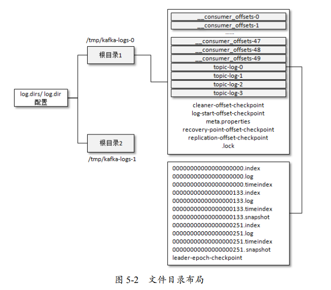

## 日志格式

### V0

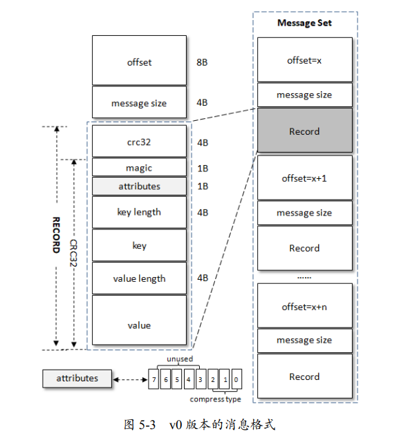

- offset 是逻辑值，而非实际物理偏移值
- crc32（4B）：crc32 校验值。校验范围为 magic 至 value 之间。
- magic（1B）：消息格式版本号，此版本的 magic 值为 0。
- attributes（1B）：消息的属性。总共占 1 个字节，低 3 位表示压缩类型：0 表示 NONE、1 表示 GZIP、2 表示 SNAPPY、3 表示 LZ4
- key length（4B）：表示消息的 key 的长度。如果为 -1，则表示没有设置 key，即 key = null。
- value length（4B）：实际消息体的长度。如果为-1，则表示消息为空。
- value：消息体。可以为空

v0 版本中一条消息的最小 长度为 14B，如果小于这个值，那么这就是一条破损的消息而不被接收。

### V1

 v0 版本就多了 一个 timestamp 字段，表示消息的时间戳

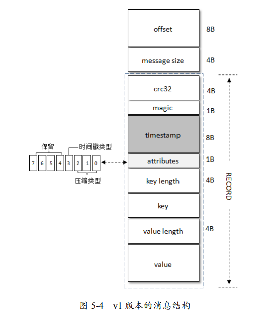

- attributes 字段中，第四位表示 timestamp 类型为 CreateTime 还是 LogAppendTime

在创建 ProducerRecord 时没有显式指定消息的时间戳，那么 KafkaProducer 也会在发送这条消息前自动添加上

~~~java
long timestamp = record.timestamp() == null ? time.milliseconds() : record.timestamp();
~~~

### 消息压缩

当消息压缩时，是将整个消息集进行压缩作为**「内层消息」 （inner message）**，内层消息作为**「外层消息」**（wrapper message）的 value。外层消息中的 key 为 null

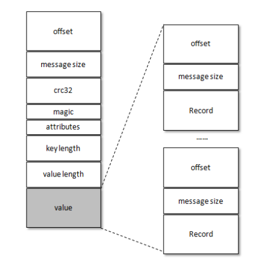

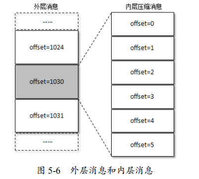

外层消息保存了内层消息中最后一条消息的绝对位移（absolute offset）。对 offset 的转换是在服务端进行的，客户端不需要做这个工作。

压缩消息，英文是 compress message。而 compact message 是针对日志清理策略而言的，是指日志压缩（Log Compaction）后的消息。

外层消息的 timestamp 设置为：

- CreateTime，那么设置的是内层消息中最大的时间戳。此时内层消息的 timestamp 设置为生产者创建消息时的 时间戳。
- LogAppendTime，那么设置的是 Kafka 服务器当前的时间戳。此时所有内层消息的时间戳都 会被忽略。

### 变长字段

Varints 中的每个字节都有一个位于最高位的 msb 位（most significant bit），除最后一个字 节外，其余 msb 位都设置为 1，最后一个字节的 msb 位为 0。Varints 中采用的是小端字节序。

ZigZag 编码以一种锯齿形（zig-zags）的方式来回穿梭正负整数，将带符号整数映射为无符 号整数，这样可以使绝对值较小的负数仍然享有较小的 Varints 编码值

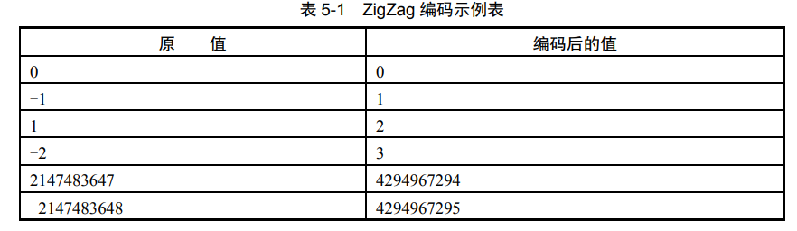

int32对应的公式为 `(n << 1) ^ (n >> 31)`

以-1 为例，其二进制表现形式为 1111 1111 1111 1111 1111 1111 1111 1111（补码）。 

1. (n << 1) = 1111 1111 1111 1111 1111 1111 1111 1110 
2. (n >> 31) = 1111 1111 1111 1111 1111 1111 1111 1111
3.  (n << 1) ^ (n >> 31) = 1

Varints + ZigZag 具体的编码实现如下（针对 int32 类型）：

~~~java
public static void writeVarint(int value, ByteBuffer buffer) {
    int v = (value << 1) ^ (value >> 31);
    while ((v & 0xffffff80) != 0L) {
        byte b = (byte) ((v & 0x7f) | 0x80);
        buffer.put(b);
        v >>>= 7;
    }
    buffer.put((byte) v);
}
~~~

对应的解码实现如下（针对 int32 类型）：

~~~java
public static int readVarint(ByteBuffer buffer) {
    int value = 0;
    int i = 0;
    int b;
    while (((b = buffer.get()) & 0x80) != 0) {
 		value |= (b & 0x7f) << i;
 		i += 7;
 		if (i > 28)
            throw illegalVarintException(value);
 	}
 	value |= b << i;
 	return (value >>> 1) ^ -(value & 1);
}
~~~

Varints 并非一直会节省空间，一个 int32 最长会占用 5 个字节（大于默认的 4 个字节），一个 int64 最长会占用 10 个字节（大于默认的 8 个字节）。

### V2

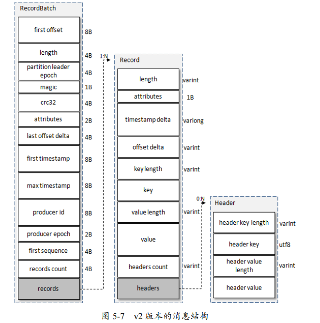

Record 的字段说明：

- `length`：消息总长度。
- `attributes`：弃用，但还是在消息格式中占据 1B 的大小
- `timestamp delta`：时间戳增量，相对于 RecordBatch 中的 first timestamp
- `offset delta`：位移增量，相对于 RecordBatch 中的 first offset
- `headers`：这个字段用来支持应用级别的扩展

`RecordBatch` 的字段说明：

- `first offset`：表示当前 RecordBatch 的起始位移
- `length`：计算从 `partition leader epoch` 字段开始到末尾的长度。
- `partition leader epoch`：分区 leader 纪元
- `magic`：消息格式的版本号，对 v2 版本而言，magic 等于 2。
- `attributes`：消息属性
  - 低 3 位表示压缩格式
  - 第 4 位表示时间戳类型
  - 第 5 位表示此 RecordBatch 是否处于事务中
  - 第 6 位表示是否是控制消息（ControlBatch）
- `last offset delta`：RecordBatch 中最后一个 Record 的 offset 与 first offset 的差值。 主要被 broker 用来确保 RecordBatch 中 Record 组装的正确性。
- `first timestamp`：RecordBatch 中第一条 Record 的时间戳。
- `max timestamp`：RecordBatch 中最大的时间戳，一般情况下是指最后一个 Record 的时间戳，和 last offset delta 的作用一样，用来确保消息组装的正确性。
- `producer id`：PID，用来支持幂等和事务
- `producer epoch`：用来支持幂等和事务
- `first sequence`：用来支持幂等和事务
- `records count`：RecordBatch 中 Record 的个数。

## 日志索引

Kafka 中的索引文件以稀疏索引（sparse index）的方式构造消息的索引，它并不保证每个 消息在索引文件中都有对应的索引项。每当写入一定量（由 broker 端参数 log.index. interval.bytes 指定，默认值为 4096，即 4KB）的消息时，偏移量索引文件和时间戳索引文件分别增加一个偏移量索引项和时间戳索引项。

稀疏索引通过 MappedByteBuffer 将索引文件映射到内存中，以加快索引的查询速度。由于偏移量和时间戳都是单调递增的，所以会使用二分查找法，返回小于指定数值的最大数值。

日志分段文件切分包含以下几个条件，满足其一即可：

- 当前日志分段文件的大小超过了 broker 端参数 log.segment.bytes 。 默认值为 1073741824，即 1GB。
- 当前日志分段中消息的最大时间戳与当前系统的时间戳的差值，大于 log.roll.ms 或 log.roll.hours 参数。 如果同时配置了 log.roll.ms 和 log.roll.hours 参数， 那么 log.roll.ms 的优先级高。默认情况下，只配置了 log.roll.hours 参数，其值为 168， 即 7 天。
- 偏移量索引文件或时间戳索引文件的大小，达到 broker 端参数 log.index.size.max. bytes 配置的值。默认值为 10485760，即 10MB。
- 追加的消息的偏移量与当前日志分段的偏移量之间的差值，大于 Integer.MAX_VALUE。此时，偏移量就不能用 4B 的 relativeOffset 表示了，也就是说，不能享受这个索引项的设计所带来的便利了。

在索引文件切分的时候，Kafka 会关闭当前正在写入的索引文件并置为只读模式，把该索引文件裁剪到实际的数据大小。同时以可读写的模式创建新的索引文件，并为其预分配 log.index.size.max.bytes 大小的空间。

还需要注意的是，Kafka 强制要求索引文件大小必须是索引项大小的整数倍，对偏移量索 引文件而言，必须为 8 的整数倍。如果 broker 端参数 log.index.size.max.bytes 配置为 67，那么 Kafka 在内部会将其转换为 64。与偏移量索引文件相似，时间戳索引文件大小必须是索引项大小（12B）的整数倍。

### 偏移量索引

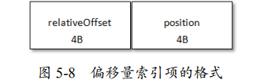

- relativeOffset：相对偏移量，表示消息相对于 baseOffset 的偏移量。当前索引文件的文件名即为 baseOffset 的值
- position：物理地址，也就是消息在日志分段文件中对应的物理位置

如果我们要查找偏移量为 23 的消息，那么从索引文件中二分查找，得到位置 656。然后在实际文件中，从位置 656 开始查询偏移量为 23 的消息。

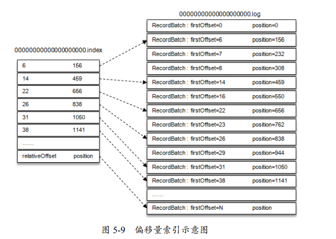

### 时间戳索引

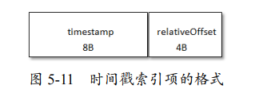

- timestamp：当前日志分段最大的时间戳。
- relativeOffset：时间戳所对应的消息的相对偏移量。

如果 broker 端参数 log.message. timestamp.type 设置为 LogAppendTime，那么消息的时间戳必定能够保持单调递增；相反， 如果是 CreateTime 类型则无法保证。

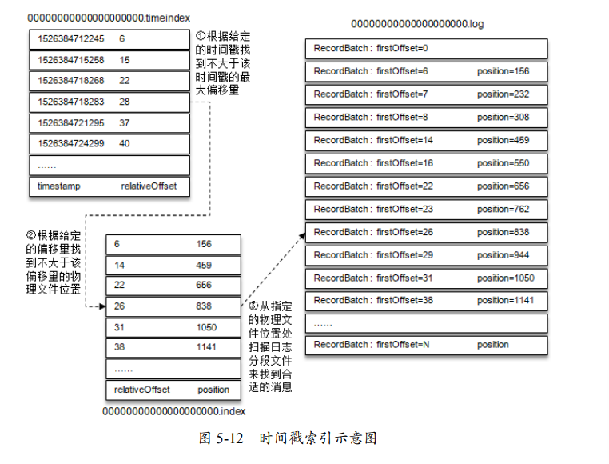

## 日志清除

Kafka 提供了两种日志清理策略。

- 日志删除（Log Retention）：按照一定的保留策略直接删除不符合条件的日志分段。
- 日志压缩（Log Compaction）：针对每个消息的 key 进行整合，对于有相同 key 的不 同 value 值，只保留最新的版本。

我们可以通过 broker 端参数 log.cleanup.policy 来设置日志清理策略

- delete（默认值）：采用日志删除
- compact：采用日志压缩。还需要将 log.cleaner.enable（默认值 为 true）设定为 true

可同时支持日志删除和日志压缩两种策略，将该参数设置为 'delete, compact'。

日志清理的粒度可以控制到主题级别，比如与 log.cleanup.policy 对应的主题级别的参数为 cleanup.policy

同时 Kafka 支持通过参数 log.cleaner.min.compaction.lag.ms（默认值为 0）来配置消息在被清理/压缩前的最小保留时间

### 日志删除

**当 Kafka 消费者尝试通过offset读取已经被删除的消息时，客户端将会抛出一个 OffsetOutOfRange 的错误。**

Kafka 日志管理器会周期性（log.retention.check.interval.ms 参数，默认值为300000，即5分钟）地检测，删除不符合保留条件的日志分段文件。删除一定保证留下一个活跃的日志分段 activeSegment。删除流程：

1. 确保没有线程对这些日志分段进行读取操作。
2. 日志分段所对应的所有文件添加上 “.deleted”的后缀（当然也包括对应的索引文件）。
3. 最后交由一个以“delete-file”命名的延迟任务来删除以“ .deleted ”为后缀的文件，这个任务的延迟执行时间可以通过 file.delete.delay.ms 参数来配置，默认值为 60000，即 1 分钟。

当前日志分段的保留策略有 3 种:

- 基于时间：删除「保留时间」超过设阈值（retentionMs）的日志分段。阈值可以通过 broker 端参数 log.retention.hours、log.retention.minutes 和 log.retention.ms 来配置，其中 log.retention.ms 的优先级最高。默认情况下只配置了 log.retention.hours 参数，其值为 168，故默认情况下日志分段文件的保留时间为 7 天。

  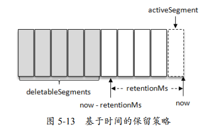

  这里的保留时间是指，在日志分段所对应的时间戳索引文件中，最后一条索引项所对应的时间戳字段值。如果该值为0，那么取日志分段文件最近修改时间 lastModifiedTime

- 基于日志大小：删除超过阈值（retentionSize）那部分日志分段。阈值可以通过 broker 端参数 log.retention.bytes 来配置，默认值为-1，表示无穷大。该参数是所有日志文件的总大小，而不是单个日志分段的大小

  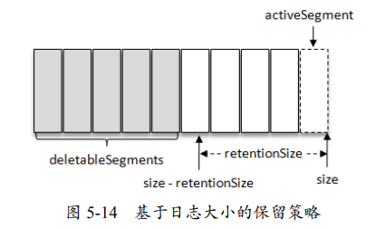

- 基于日志起始偏移量：删除起始偏移量小于logStartOffset的日志分段

  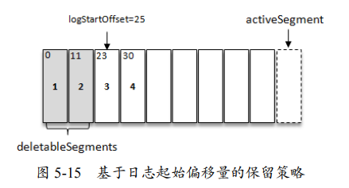

### 日志压缩

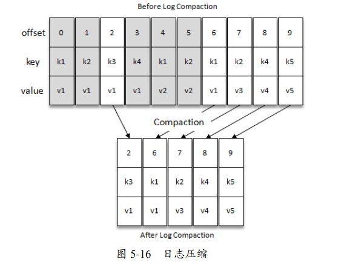

activeSegment 不会参与 Log Compaction 的执行。

`cleaner-offset-checkpoint`文件中保存了「清理检查点」。该检查点划分出一个已经清理过的 clean 部分 和一个还未清理过的 dirty 部分。dirty 部分的消息偏移量是逐一递增的，而 clean 部分的消息偏移量是断续的

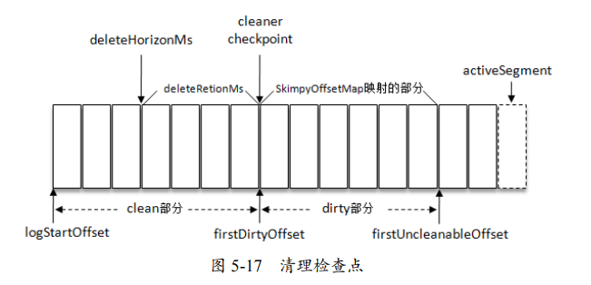

默认情况下 firstUncleanableOffset 等于 activeSegment 的 baseOffset。

每 个 broker 会启动 log.cleaner.thread（默认值为 1）个日志清理线程负责执行清理任务， 这些线程会选择“污浊率”最高的日志文件进行清理。Kafka 还使用了参数 log.cleaner.min. cleanable.ratio（默认值为 0.5）来限定可进行清理操作的最小污浊率。

Kafka 中的每个日志清理线程会使用一个名为「SkimpyOffsetMap」的对象来构建 key 与 offset 的映射关系的哈希表。日志清理需要遍历两次日志文件，

1. 第一次遍历把每个 key 的哈希值和最后出现的 offset 都保存在 SkimpyOffsetMap 中。
2. 第二次遍历会检查每个消息是否符合保留条件（对比哈希表中的offset 以及 自身offset）

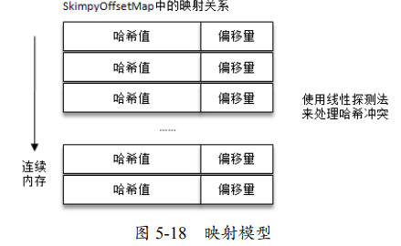

这里，SkimpyOffsetMap 使用 MD5 来计算 key 的哈希值。

Kafka引入**“墓碑消息”（Tombstone Message）**来支持对消息的删除操作。一条消息的key不为null，但value为null时，这条消息被称为墓碑消息。日志清理线程在发现墓碑消息时，并保留墓碑消息一段时间，然后再删除该消息，这是为了保证消费者有机会看到这个墓碑消息，从而知道这个键的消息已经被删除了。

日志分段保留墓碑消息的条件是，当前墓碑消息所在日志分段的最近修改时间 lastModifiedTime 大于 deleteHorizonMs。deleteHorizonMs计算方式：
$$
clean 部分中最后一个 LogSegment 的 lastModifiedTime - deleteRetionMs
$$

deleteRetionMs 可以通过 broker 端参数 `log.cleaner.delete.retention.ms` 配置，默认值为 86400000，即 24 小时。

Kafka 在实际清理过程中并不对单个的日志分段进行单独清理，这是为了防止出现太多的小文件。而是将日志文件中 offset 从 0 至 firstUncleanableOffset 的所有日志分段进行分组。分组策略为：按照日志分段的顺序遍历，每组中日志分段的占用空间大小之和不超过 segmentSize（可以通过 broker 端参数 `log.segment.bytes` 设置，默认值为 1GB），且对应的索引文件 占用大小之和不超过 `maxIndexSize`（可以通过 broker 端参数 `log.index.interval.bytes` 设置，默认值为 10MB）。同一个组的多个日志分段清理过后，只会生成一个新的日志分段。

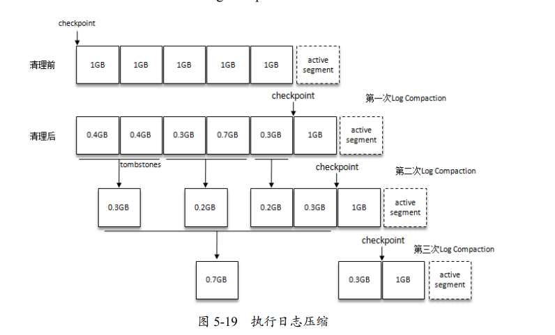

## 磁盘存储

Kafka 依赖于文件系统（更底层地来说，就是磁盘）来存储和缓存消息

页缓存就是把磁盘中的数据缓存到内存中，把对磁盘的访问变为对内存的访问，从而减少对磁盘 I/O 的操作。操作系统会在合适的时间把脏页中的 数据写入磁盘，以保持数据的一致性。Linux操作系统中，与页缓存有关的参数：

- vm.dirty_background_ratio 参数用来指定当脏页数量达到系统内存的百分之多少之后，就会触发 pdflush/flush/kdmflush 等后台回写进程的运行来处理脏页
- vm.dirty_ratio 参数，它用来指定当脏页数量达到系统内存的百分之多少之后，就不得不开始对脏页进行处理。在此过程中，新的 I/O 请求会被阻挡直至所有脏页被冲刷到磁盘中。

Kafka 中大量使用了页缓存。但在 Kafka 中同样提供了同步刷盘及间断性强制刷盘（fsync）的功能，这些功能可以通过 log.flush.interval. messages、 log.flush.interval.ms 等参数来控制。

同时也要考虑 swap 分区对于 Kafka 性能的影响。vm.swappiness 参数的上限为 100，它表示积极地使用 swap 分区，并把内存上的数据及时地搬运到 swap 分区中； vm.swappiness 参数的下限为 0，表示在任何情况下都不要发生交换。

### 

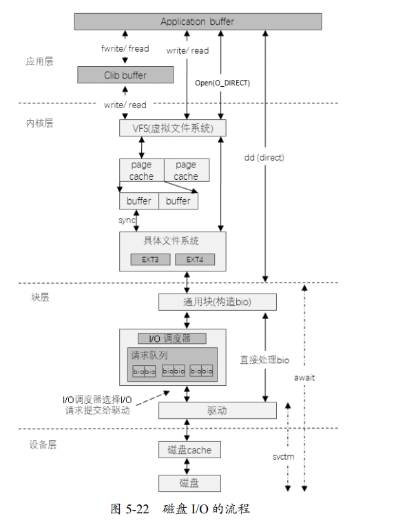

Kafka 还使用零拷贝（Zero-Copy）技术来进一步提升性能。将数据直接从磁盘文件复制到网卡设备中，而不需要经过应用程序，这样减少了内存复制的次数，以及内核核切换的次数。对 Linux 操作系统而言，零拷贝技术依赖于底层的 sendfile() 方法实现。对应于 Java 语言， `FileChannal.transferTo()` 方法的底层实现就是 sendfile()方法。

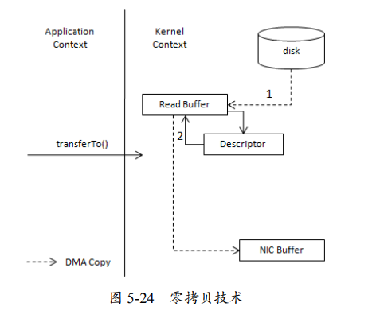

