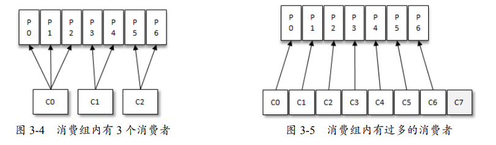
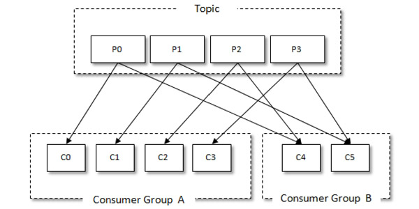
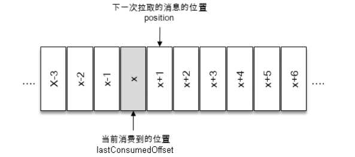
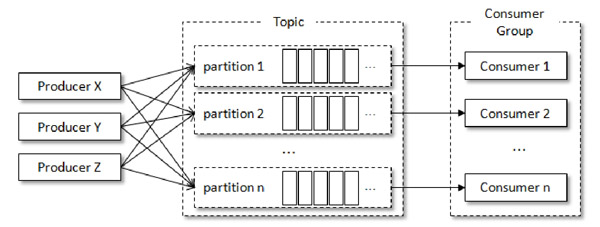
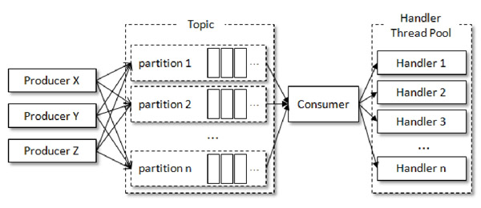
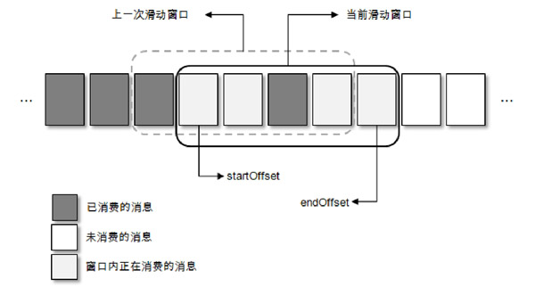

# 消费者

[TOC]

## 消费者与消费组

消费者（Consumer）负责订阅Kafka中的主题（Topic），并且从订阅的主题上拉取消息。此外，Kafka还有消费组（Consumer Group）的概念，每个消费者都有一个对应的消费组。

在Kafka中，消费组订阅主题是通过其内的消费者实现的。然而消费者可以直接订阅特定的分区，这种方式叫做手动分配（Manual Assignment）。此时，它就不再参与到Kafka的自动分区分配中。

消费组中的每一个分区都只会被**唯一地**投递给**一个消费者**

以上分配逻辑都是基于默认的分区分配策略进行的，可以通过消费者客户端参数`partition.assignment.strategy` 来设置消费者与订阅主题之间的分区分配策略。

对于消息中间件而言，一般有两种消息投递模式：

- 点对点（P2P，Point-to-Point）模式
- 发布/订阅（Pub/Sub）模式（一对多）

Kafka 同时支持两种消息投递模式，而这正是得益于消费者与消费组模型的契合：

- 如果所有的消费者都隶属于同一个消费组，那么所有的消息都会被均衡地投递给每一个消费者，即每条消息只会被一个消费者处理，这就相当于点对点模式的应用。
- 如果所有的消费者都隶属于不同的消费组，那么所有的消息都会被广播给所有的消费 者，即每条消息会被所有的消费者处理，这就相当于发布/订阅模式的应用。

消费者需要指定其所属消费组的名称，这可以通过参数 `group.id` 来配置，默认值为空字符串。

## API

### 简单示例

~~~java
public class KafkaConsumerAnalysis {
    public static final String brokerList = "localhost:9092";

    public static final String topic = "topic-demo";

    public static final String groupId= "group.demo";

    public static final AtomicBoolean isRunning = new AtomicBoolean(true);
    public static Properties initConfig() {
        Properties props = new Properties();
        props.put(ConsumerConfig.KEY_DESERIALIZER_CLASS_CONFIG, "org.apache.kafka.common.serialization.StringDeserializer");
        props.put("value.deserializer", "org.apache.kafka.common.serialization.StringDeserializer");
        props.put("bootstrap.servers", brokerList);
        props.put("group.id", groupId);
        props.put("client.id", "consumer.client.id.demo");
        return props;
    }

    public static void main(String[] args) {
        Properties props = initConfig();
        // 创建消费者
        KafkaConsumer<String, String> consumer = new KafkaConsumer<>(props);
        try (consumer) {
            // 订阅主题，此方法并不是幂等的
            consumer.subscribe(List.of(topic));
            
            while (isRunning.get()) {
                // 轮询等待消息
                ConsumerRecords<String, String> records = consumer.poll(Duration.ofMillis(1000));
                for (ConsumerRecord<String, String> record : records) {
                    System.out.println("topic = " + record.topic() + ", partition = " + record.partition());
                    System.out.println("key = " + record.key() + ", value = " + record.value());
                }
            }
        } catch (Exception e) {
            System.out.println("occur exception " + e);
        }
    }
}

~~~

### 订阅

Kafka Consumer 通过 `subscribe` 来订阅多个主题：

~~~java
consumer.subscribe(Arrays.asList("topic1", "topic3"));
~~~

KafkaConsumer 中提供了一个`assign()`方法，来订阅某些主题的特定分区：

~~~java
public void assign(Collection<TopicPartition> partitions);
~~~

其中，`TopicPartition`用于表示分区，它的定义如下：

~~~java
public final class TopicPartition implements Serializable {
    private static final long serialVersionUID = -613627415771699627L;
    private int hash = 0;
    private final int partition;
    private final String topic;
    // ...
}
~~~

使用示例：

~~~java
consumer.assign(
    List.of(
        new TopicPartition("topic-demo", 0),
        new TopicPartition("topic-demo", 1),
    )
);
~~~

KafkaConsumer 中的`partitionsFor()`方法可以用来查询指定主题的元数据信息：

~~~java
public List<PartitionInfo> partitionsFor(String topic);
~~~

PartitionInfo类型即为主题的分区元数据信息，它的定义如下：

~~~java
public class PartitionInfo {
    private final String topic;				// 主题名称
    private final int partition;			// 分区编号
    private final Node leader;				// leader副本所在的位置
    private final Node[] replicas;			// AR集合
    private final Node[] inSyncReplicas;	// ISR集合
    private final Node[] offlineReplicas;	// OSR集合
    // ... 
}
~~~

通过`assign()`来订阅主题所有分区的示例

~~~java
List<TopicPartition> partitions = new ArrayList<>();
List<PartitionInfo> partitionInfos = consumer.partitionsFor(topic);
if (partitionsInfos != null) {
    for (PartitionInfo tpInfo: partitionInfos) {
        partitions.add(new TopicPartition(tpInfo.topic(), tpInfo.partition()));
    }
}
~~~

可以使用KafkaConsumer 中的 `unsubscribe()` 方法来取消主题的订阅：

~~~java
// 以下三个方式是等价的
consumer.unsubscribe();
// 空集合
consumer.subscribe(new ArrayList<String>());
// 空集合
consumer.assign(new ArrayList<TopicPartition>());
~~~

集合订阅的方式`subscribe(Collection)`、正则表达式订阅的方式`subscribe(Pattern)`和指定分区的订阅方式 `assign(Collection)`，分别代表了三种不同的订阅状态：`AUTO_TOPICS`、`AUTO_PATTERN`和`USER_ASSIGNED`（如果没有订阅，那么订阅状态为`NONE`）。然而这三种状态是互斥的，消费者中只能使用其中的一种，否则会报出`IllegalStateException`异常。

通过 `subscribe()` 方法订阅主题的消费者，会根据分区分配策略来自动分配各个消费者与分区的关系。而通过 `assign()` 方法订阅主题的消费者，不具有自动均衡功能的。也就是说 assign 将分区分配的决定权，从 Kafka 消费者组协调器转移到了消费者自己。

我们无法直接移除对于某个主题的订阅，可以通过重新订阅实现这一点：

~~~java
List<String> topics = new ArrayList<>(Arrays.asList("topic1", "topic2", "topic3"));
consumer.subscribe(topics);

// 一段时间以后...
topics.remove("topic2"); 	// 移除你不再需要的主题
consumer.subscribe(topics); // 重新订阅新的主题列表
~~~

### 反序列化

Kafka所提供的反序列化器有ByteBufferDeserializer、DoubleDeserializer等等。反序列化器需要实现`Deserializer`接口，它的定义如下：

~~~java
public interface Deserializer<T> extends Closeable {
    default void configure(Map<String, ?> configs, boolean isKey) {}

    T deserialize(String var1, byte[] var2);

    default T deserialize(String topic, Headers headers, byte[] data) {
        return this.deserialize(topic, data);
    }

    default void close() { }
}

~~~

如无特殊需要，笔者还是不建议在自定义的序列化器或反序列化器中，直接进行编码操作（例如，ByteBuffer），因为这样会增加生产者与消费者之间的耦合度。推荐使用Avro、JSON、Thrift、ProtoBuf或Protostuff等通用的序列化工具来进行包装。

### 消费

消息的消费一般有两种模式：

- **推模式**：服务端主动将消息推送给消费者
- **拉模式**：消费者主动向服务端发起请求来拉取消息

Kafka中的消费是基于拉模式的，通过 poll 方法获取**消费者订阅的消息**：

~~~java
public ConsumerRecords<K, V> poll(final Duration timeout);
~~~

- timeout：阻塞时间。

`max.poll.records`： 设置了单次`poll()`调用可以返回的最大记录数量。其默认值通常设为 `500`

一个消息被所有消费者消费了，它还是会继续存在在日志中，不会被删除。直到消息过期，或者日志大小超出限制，才会被删除。

消费者消费到的每条消息的类型为 ConsumerRecord，与 ProducerRecord 相对应，它的定义如下：

~~~java
public class ConsumerRecord<K, V> {
    public static final long NO_TIMESTAMP = -1L;
    public static final int NULL_SIZE = -1;
    public static final int NULL_CHECKSUM = -1;
    private final String topic;			// 所属主题的名称
    private final int partition;		// 所在分区的编号
    private final long offset;			// 在所属分区的偏移量
    private final long timestamp;		// timestampType 有两种类型：CreateTime 和LogAppendTime，分别代表消息创建的时间戳和消息追加到日志的时间戳
    private final TimestampType timestampType;
    private final int serializedKeySize;
    private final int serializedValueSize;
    private final Headers headers;		// 消息的头部内容
    private final K key;				// 消息的键
    private final V value;				// 消息的值
    private final Optional<Integer> leaderEpoch;
    private volatile Long checksum;		// checksum是CRC32的校验值
    // .. 
}
~~~

通过`ConsumerRecords`获取消息：

1. `iterator()`方法：循环遍历消息集内部的消息
2. `records(TopicPartition)`方法，来获取指定分区的消息
3. `records(String)`方法，来获取指定主题中的消息。
4. `partitions()`方法，来获取「消息集」中所有分区的元数据。

~~~java
public List<ConsumerRecord<K, V>> records(TopicPartition partition);
public Iterable<ConsumerRecord<K, V>> records(String topic);
public Set<TopicPartition> partitions();
~~~

### 位移提交

每条消息都有唯一的`offset`，用来表示消息在分区中对应的位置（偏移量）。而消费者也有一个`offset`，用来表示消费到分区中某个消息所在的位置（位移）。

消费位移必须做持久化保存，否则由于重启或者分配分区算法等等因素，使得消费者无法知晓之前的消费位移。因此，Kafka将消费位移存储在内部的主题`__consumer_offsets`中，这里把将消费位移存储起来（持久化）的动作称为“提交”。

在正常情况下，消费者将根据其本地的消费者位移进行操作。只有在它们被初始化或者本地消费者位移丢失的情况下，才会从Kafka中的`__consumer_offsets`主题获取消费者位移（如果还没有就触发`auto.offset.reset`）。

这里需要明确两个概念：

- `committed offset`，它表示已经提交过的消费位移。消费者报告给 Kafka 集群，表示其已成功处理的消息的位置。注意，当前消费者需要提交的消费位移是 `x + 1`，并不是 `x`。

  

- `position`，它表示下一次poll消息的位移。消费者当前在主题分区中的读取位置，这个值在消费者本地进行更新，并在读取新消息时前进。

`KafkaConsumer` 类提供了 `KafkaConsumer#position(TopicPartition)`和`KafkaConsumer#committed(TopicPartition)`两个方法来获取它们

~~~java
public long position(TopicPartition partition)
public OffsetAndMetadata conmmitted(TopicPartition partition);
~~~

一个位移提交的示例

~~~java
TopicPartition tp = new TopicPartition(topic, 0);
consumer.assign(Arrays.asList(tp));

long lastConsumedOffset = -1;
while (true) {
    ConsumerRecords<String, String> records = consumer.poll(1000);
    if (records.isEmpty()) {
        break;
    }
    List<ConsumerRecord<String, String>> partitionRecords = records.records(tp);
    lastConsumerdOffset = partitionRecords.get(partitionRecords.size() - 1).offset();			// 获取最后一条消息的偏移值
    
    consumer.commitSync();	// 同步提交消费位移，即position
}

lastConsumedOffset;							// 356

OffsetAndMetadata offsetAndMetadata = consumer.committed(tp);
offsetAndMetadata.offset();					//357

long position = consumer.position(tp);		// 357
~~~

如果提交位移的时机不当，可能会造成重复消费和消息丢失的现象。

- 当前一次 `poll()` 操作所拉取的消息集为[x+2，x+7]，如果在消费x+5之前就提交了x+8，并且在消费x+5的时候遇到了异常，那么在故障恢复之后，我们重新拉取的消息是从x+8开始的。也就是说，x+5至x+7之间的消息并未能被消费
- 如果在消费完所有消息后，才提交操作，并且当消费x+5的时候遇到了异常，那么重新拉取的消息是从x+2开始的。也就是说，x+2至x+4之间的消息又重新消费了一遍

`Kafka`默认会定期自动提交消费位移，由`enable.auto.commit` 配置（默认为true）决定是否自动提交。而定期的周期时间由客户端参数`auto.commit.interval.ms`配置，默认值为5秒。

自动位移提交的动作是在`poll()`方法中完成的。在每次向服务端发起拉取请求之前，会检查是否可以进行位移提交，如果可以，那么就会提交上一次从 poll 获取到消息集中的最大位移。自动提交也有会重复消费和消息丢失的现象：

- 假设刚刚提交完一次消费位移，然后拉取一批消息进行消费，然而在下一次自动提交消费位移之前，消费者崩溃了，那么又得从上一次位移提交的地方重新开始消费
- 拉取线程A不断地拉取消息并存入本地缓存，另一个处理线程B从缓存中读取消息并进行相应的逻辑处理。假设x+6之前的位移已经确认提交了，处理线程B却还正在消费x+3的消息。此时如果处理线程B发生了异常，待其恢复之后会从x+6的位置开始拉取消息，那么x+3至x+6之间的消息就没有得到相应的处理

很多时候并不是说拉取到消息就算消费完成，而是需要将消息写入数据库、写入本地缓存，或者是更加复杂的业务处理。手动的提交方式可以让开发人员根据程序的逻辑，在合适的地方进行位移提交。**（记得关闭自动提交）**

手动提交可以细分为

- 同步提交

  ~~~java
  public void commitSync();
  ~~~

  使用示例：批量提交

  ~~~java
  final int minBatchSize = 200;
  List<ConsumerRecord> buffer = new ArrayList<>();
  while (true) {
      ConsumerRecords<String, String> records = consumer.poll(1000);
      for (ConsumerRecord<String, String> record: records) {
          buffer.add(record);
      }
      if (buffer.size() >= minBatchSize) {
          // 等到积累到足够多的时候，再做相应的批量处理以及批量提交
          consumer.commitSync();
          buffer.clear();
      }
  }
  ~~~

  `commitSync()`方法会根据`poll()`方法拉取的最新位移来进行提交。只要没有发生不可恢复的错误（Unrecoverable Error），它就会阻塞消费者线程直至位移提交完成

  

  下面这个方法提供一个 offsets 参数，用来提交指定分区的位移。

  ~~~java
  public void commitSync(Map<TopicPartition, OffsetAndMetadata> offsets)
  ~~~

  

- 异步提交

  ~~~java
  public void commitAsync();
  // 当位移提交完成后，会回调 OffsetCommitCallback 中的onComplete（）方法
  public void commitAsync(OffsetCommitCallback callback);
  public void commitAsync(Map<TopicPartition, OffsetAndMetadata> offsets, OffsetCommitCallback callback)
  ~~~

  异步提交失败时，重试可能会出现某些问题。例如，如果某一次异步提交的消费位移为 x，但是提交失败了。然后另一个异步又成功提交x+y，此时上一次异步又重试成功了，那么消费位移又变为了 x。

  为此，我们可以设置一个递增的序号，来维护异步提交的顺序。每次位移提交之后，就将序号设置为提交的位移。在需要重试的时候，可以检查所提交的位移和序号值的大小，如果前者小于后者，则说明有更大的位移已经提交了，不需要再进行本次重试；

### 控制或关闭消费

KafkaConsumer 提供了调整消费速率的方法。

~~~java
public void pause(Collection<TopicPartition> partition);
public void resume(Collection<TopicPartition> partition);
~~~

- `pause`：可以用来暂停该消费者从指定分区拉取数据，之后`poll()`方法将返回一个空的数据集。
- `resume`：恢复该消费者从指定分区拉取数据

paused 用于获取在该消费者中被暂停的分区集合

~~~java
public Set<TopicPartition> paused();
~~~

`KafkaConsumer#wakeup()`方法用来中断消费者的阻塞操作，当你从另一个线程调用`wakeup()`时，它将使得消费者的正在被阻塞的`poll()`方法立即抛出一个`WakeupException`异常，从而退出阻塞。

但调用 `wakeup()` 方法时，消费者并没有正在执行 `poll()` 方法，那么Kafka 都会记住这个 `wakeup` 信号。也就是说在将来你的消费者下一次去调用 `poll()` 方法时，会立马抛出 `WakeupException` 异常

wakeup是在消费者所有方法中，唯一线程安全的。

close()方法来释放消费者所持有的资源（Socket连接、内存资源等）

~~~java
public void close();					// 默认等待30秒
public void close(Duration timeout);

@Deprecated
public void close(long timeout, TimeUnit timeUnit);
~~~

注意，如果设置了自动提交消费位移，那么`close()`还会做一次提交。

### 指定位移消费

在 Kafka 中，每当消费者查找不到所记录的消费位移时，就会根据消费者客户端参数`auto.offset.reset`的配置来决定从何处开始进行消费，

- `latest`（默认值），表示从分区末尾开始消费消息。
- `earliest`，那么消费者会从分区起始处消费消息。
- `none`：抛出`NoOffsetForPartitionException`异常
- 其他：抛出`ConfigException`异常

除了查找不到消费位移，位移越界也会触发 `auto.offset.reset` 参数的执行。所谓的位移越界就是，消费者尝试读取的偏移量不在分区有效范围内，过大或者过小。

`seek()`方法让我们能够回溯消费，即会改变消费者的 position

~~~java
public void seek(TopicPartition partition, long offset);
~~~

- `partition`：表示分区
- `offset`：用来指定从分区的哪个位置开始消费

在执行`seek()`方法之前，需要执行过`poll()`方法，以获取必要的分区信息，否则抛出`IllegalStateException`的异常。

~~~java
KafkaConsumer<String, String> consumer = new KafkaConsumer<>(props);

consumer.subscribe(Arrays.asList(topic));
consumer.poll(Duration.ofMillis(10000));				// 1
Set<TopicPartition> assignment = consumer.assignment();

for (TopicPartition tp : assignment) {
    consumer.seek(tp, 10);
}

while (true) {
    ConsumerRecords<String, String> records = consumer.poll(Duration.ofMillis(1000));
}
~~~

我们可以将消费位移存储在数据库中，在下次消费的时候，可以读取存储在数据表中的消费位移，并通过seek()方法指向这个具体的位置。

`assignment()`方法是用来获取消费者所分配到的分区信息的，定义如下：

~~~java
public Set<TopicPartition> assignment();
~~~

注意，仍需要在 poll 方法执行后，再调用 assignment() ，否则返回空Set

注意，如果将 (1) 处改为`poll(0)`，那么poll方法内部所进行分区分配的操作，就会来不及执行，此时`seek()`方法并未有任何作用。下面这段代码修补了这个问题：

~~~java
while (assignment.size() == 0) {
	consumer.poll(Duration.ofMillis(1000));
    assignment = consumer.assignment();
}
~~~

`endOffsets()`方法用来获取指定分区的末尾的位置：

~~~java
public Map<TopicPartition, Long> endOffsets(Collection<TopicPartition> partitions);

public Map<TopicPartition, Long> endOffsets(Collection<TopicPartition> partitions, Duration timeout);
~~~

- `timeout`：设置等待获取的超时时间。如果未设置，那么等待时间由客户端参数`request.timeout.ms` 来设置，默认值为 30000

与 endOffsets 对应的是 `beginningOffsets()` 方法

~~~java
public Map<TopicPartition, Long> beginningOffsets(Collection<TopicPartition> partitions);

public Map<TopicPartition, Long> beginningOffsets(Collection<TopicPartition> partitions, Duration timeout);
~~~

`endOffsets` + `seek`操作可以由`seekToEnd()`来代替，即将消费者的偏移量移动到分区的最后。

~~~java
public void seekToBeginning(Collection<TopicPartition> partitions);
public void seekToEnd(Collection<TopicPartition> partitions);
~~~

`offsetsForTimes()`方法可以让我们获取特定时间点的消息，而无需知道消息的消费位置

~~~java
public Map<TopicPartition, OffsetAndTimestamp> offsetsForTimes(
	Map<TopicPartition, Long> timestampesToSearch
)
    
public Map<TopicPartition, OffsetAndTimestamp> offsetsForTimes(
	Map<TopicPartition, Long> timestampesToSearch,
    Duration timeout,
)
~~~

- `timestampsToSearch`，`key`为待查询的分区，而 `value` 为待查询的时间戳

- 该方法会返回首条时间戳大于查询时间的消息的位置

  ~~~java
  public final class OffsetAndTimestamp {
      private final long timestamp;
      private final long offset;
      // ...
  }
  ~~~

使用示例：获取一天之前的消息位置

~~~java
Map<TopicPartition, Long> timestampToSearch = new HashMap<>();
for (TopicPartition tp : assignment) {
    timestampToSearch.put(tp, System..currentTimeMillis() - 1 * 24 * 3600 * 1000);
}

Map<TopicPartition, OffsetAndTimestamp> offsets = consumer.offsetsForTimes(timestampToSearch);

for (TopicPartition tp : assignment) {
    OffsetAndTimestamp offsetAndTimestamp = offsets.get(tp);
    if (offsetAndTimestamp != null) {
        consumer.seek(tp, offsetAndTimestamp.offset());
    }
}
~~~

### 再均衡

再均衡是指分区的所属权从一个消费者转移到另一消费者的行为，使得消费组具备高可用性和伸缩性。不过，在再均衡发生期间，消费组内的消费者是无法读取消息的。另外，当一个分区被重新分配给另一个消费者时，消费者当前的状态也会丢失（未提交的本地消费位移）。

「再均衡监听器」用来注册在再均衡动作发生前后的回调方法。

~~~java
void subscribe(Pattern var1, ConsumerRebalanceListener var2);
void subscribe(Collection<String> var1, ConsumerRebalanceListener var2);
~~~

~~~java
public interface ConsumerRebalanceListener {
    //  这个方法会在再均衡开始之前和消费者停止读取消息之后被调用
    void onPartitionsRevoked(Collection<TopicPartition> var1);
	
    //  这个方法会在重新分配分区之后和消费者开始读取消费之前被调用
    void onPartitionsAssigned(Collection<TopicPartition> var1);

    default void onPartitionsLost(Collection<TopicPartition> partitions) {
        this.onPartitionsRevoked(partitions);
    }
}
~~~

使用示例：

~~~java
consumer.subscribe(Arrays.asList(topic), new ConsumerRebalanceListener() {
    @Override
    public void onPartitionsRevoked(Collection<TopicPartition> partitions) {
        // 消费位移的提交，以此来避免一些不必要的重复消费现象的发生
        consumer.commitSync(currentOffsets);
        currentOffsets.clear();
    }
    
    @Override
    public void onPartitionsAssigned(Collection<TopicPartition> partitions) {
        for (TopicPartition tp : partitions) {
            consumer.seek(tp, getOffsetFromDB(tp));
		}
    }
})
~~~

### 拦截器

消费者拦截器实现了`org.apache.kafka.clients.consumer.ConsumerInterceptor`接口：

~~~java
public interface ConsumerInterceptor<K, V> extends Configurable, AutoCloseable {
    // 会在poll（）方法返回之前，调用拦截器的onConsume（）
    // 如果 onConsume（）方法中抛出异常，那么会被捕获并记录到日志中，但是异常不会再向上传递
    ConsumerRecords<K, V> onConsume(ConsumerRecords<K, V> var1);

    // 会在提交完消费位移之后，调用拦截器的onCommit（）方法
    void onCommit(Map<TopicPartition, OffsetAndMetadata> var1);

    void close();
}
~~~

使用示例：消息TTL（Time to Live，即过期时间）

~~~java
public class ConsumerInterceptorTTL implements ConsumerInterceptor<String, String> {
    private static final long EXPIRE_INTZERVAL = 10 * 1000;

    @Override
    public ConsumerRecords<String, String> onConsume(ConsumerRecords<String, String> consumerRecords) {
        long now = System.currentTimeMillis();
        Map<TopicPartition, List<ConsumerRecord<String, String>>> newRecords = new HashMap<>();

        for (TopicPartition tp : consumerRecords.partitions()) {
            List<ConsumerRecord<String, String>> tpRecords = consumerRecords.records(tp);
            List<ConsumerRecord<String, String>> newTpRecords = new ArrayList<>();
            for (ConsumerRecord<String, String> record : tpRecords) {
                if (now - record.timestamp() < EXPIRE_INTZERVAL) {
                    newTpRecords.add(record);
                }
            }
            if (!newTpRecords.isEmpty()) {
                newRecords.put(tp, newTpRecords);
            }
        }
        return new ConsumerRecords<>(newRecords);
    }

    @Override
    public void onCommit(Map<TopicPartition, OffsetAndMetadata> offsets) {
        offsets.forEach((tp, offset) -> System.out.println(tp + ":" + offset.offset()));
    }

    @Override
    public void close() {}

    @Override
    public void configure(Map<String, ?> configs) {}
}

~~~

注册该拦截器

~~~java
props.put(ConsumerConfig.INTERCEPROT_CLASSES_CONFIG, ConsumerInterceptorTTL.class.getName());
~~~

### 多线程

`KafkaProducer`是线程安全的，然而`KafkaConsumer`却是非线程安全的（除了wakeup方法）。`KafkaConsumer`中定义了一个 `acquire()`方法，用来获取锁。获取失败时，并不会阻塞等待，而是直接抛出`ConcurrentModifcationException`异常。同时定义了一个 `release()` 方法，用于释放锁

KafkaConsumer中的每个公用方法在执行所要执行的动作之前，都会调用到这个`acquire()`方法（除了wakeup方法）

~~~java
private final AtomicLong currentThread;
private void acquire() {
    // 使用线程操作计数标记的方式，来检测线程是否发生了并发操作
    long threadId = Thread.currentThread().getId();
    if (threadId != this.currentThread.get() && !this.currentThread.compareAndSet(-1L, threadId)) {
        throw new ConcurrentModificationException("KafkaConsumer is not safe for multi-threaded access");
    } else {
        this.refcount.incrementAndGet();
    }
}
~~~

KafkaConsumer 非线程安全并不意味着只能以单线程方式来消费消息。下面介绍几种多线程消费消息的实现。第一种就是线程封闭，即每个线程实例化一个KafkaConsumer 对象，所有的消费线程都隶属于同一个消费组。

第二种就是，多个消费线程同时消费同一个分区。不过这种实现方式对于位移提交等会变得非常复杂，因此并不推荐。

实际上，系统瓶颈并不在拉取消息（poll）上，而是在处理消息这一块（RPC的同步响应、事务操作等等）。因此我们可以复用一个Consumer对象，并消息转发到不同的处理线程上，以减少系统资源的消耗。这就是第三种方式。

在第三种方式种我们可以引入下述对象，来处理位移提交的逻辑。

~~~java
Map<TopicPartiton, OffsetAndMeradata> offsets
~~~

一个处理线程 RecordHandler1 正在处理 offset 为 0～99 的消息，而另一个处理线程 RecordHandler2 已经处理完了offset 为 100～199 的消息并进行了位移提交，此时如果 RecordHandler1 发生异常，则之后的消费只能从 200 开始，而无法再次消费 0～99 的消息。我们引入滑动窗口来解决这个问题，这是第四种解决方式。

消费者拉取分批次的消息，然后缓存到滑动窗口中，多个处理线程可以拉取暂存的消息。一个方格对应一个处理线程。每当 startOffset 所指向的消息被消费后，就可以提交这部分的位移，同时滑动窗口。

如果一个方格内的消息无法被标记为消费完成，那么就会造成 startOffset 的悬停。为了使 窗口能够继续向前滑动，那么就需要设定一个阈值，当 startOffset 悬停一定的时间后就对这部分消息进行本地重试消费，如果重试失败就转入重试队列，如果还不奏效就转入死信队列。

## 参数

- `fetch.min.bytes`，用于配置Consumer所拉取的最小数据量，默认值为1（B）。如果返回给Consumer的数据量小于这个参数所配置的值，那么它就阻塞，直到数据量满足这个参数的配置大小。
- `fetch.max.bytes`，用于配置Consumer所拉取的最大数据量，默认值为52428800（B），也就是 50MB
- `fetch.max.wait.ms`用于指定Kafka的等待时间，默认值为500（ms）。如果Kafka中没有足够多的消息而满足不了fetch.min.bytes参数的要求，那么只会会等待500ms。
- `max.partition.fetch.bytes`：用来配置从**每个分区**里返回给Consumer的最大数据量，默认值为1048576（B），即1MB。注意与fetch.max.bytes的区别，fetch.max.bytes是拉取所有消息的大小，而该参数是拉取一个分区中所有消息的大小。
- `max.poll.records`：用来配置Consumer所拉取的最大消息数，默认值为500（条）
- `connections.max.idle.ms`：用来指定在多久之后关闭空闲的连接，默认值是540000（ms），即9分钟。
- `exclude.internal.topics`：如果设置为true，那么只能使用subscribe（Collection）的方式，而不能使用subscribe（Pattern）的方式来订阅内部主题（`__consumer_offsets`和`__transaction_state`），设置为false则没有这个限制。
- `receive.buffer.bytes`：用来设置Socket接收消息缓冲区（SO_RECBUF）的大小，默认值为65536（B），即64KB。如果设置为-1，则使用操作系统的默认值。
- `send.buffer.bytes`：用来设置Socket发送消息缓冲区（SO_SNDBUF）的大小，默认值为131072（B），即128KB。如果设置为-1，则使用操作系统的默认值。
- `request.timeout.ms`：用来配置Consumer等待请求响应的最长时间，默认值为30000（ms）。
- `metadata.max.age.ms`：配置元数据的过期时间，默认值为300000（ms），即5分钟。如果元数据在此参数所限定的时间范围内没有进行更新，则会被强制更新
- `reconnect.backoff.ms`：用来配置尝试重新连接主机之前的等待时间，默认值为50（ms）
- `retry.backoff.ms`：用来配置重新发送请求的等待（退避）时间，默认值为100（ms）。
- `isolation.level`：用来配置消费者的事务隔离级别。字符串类型
  - “read_committed”，那么消费者就会忽略事务未提交的消息，即只能消费到 LSO（LastStableOffset）的位置
  - read_uncommitted”（默认值），即可以消费到HW（High Watermark）处的位置

