# 深入客户端

[TOC]

## 分区分配策略

实际上，分区分配策略是由客户端执行的。当触发分区分配时，kafka会从consumer中挑选一个作为leader，leader根据客户端配置的分配策略计算分区结果，然后发送回给kafka，再由kafka同步给其它的consumer follower。

Kafka 提供了消费者客户端参数 `partition.assignment.strategy` ，来设置**消费组中的消费者**与订阅主题之间的分区分配策略

- org.apache.kafka. clients.consumer.RangeAssignor，即采用 RangeAssignor 分配策略
- RoundRobinAssignor策略
- StickyAssignor策略

当消费组中的某个消费者退出后，会重新执行分区分配策略。

RangeAssignor 分配策略的原理

1. 按照消费者总数和分区总数进行整除运算来获得一个跨度
2. 然后将分区按照跨度进行平均分配，以保证分区尽可能均匀地分配给所有的消费者

我们来看一个例子，假设：

1. 有 2 个主题，且每个都有 3 个分区，分别标识为：t0p0、 t0p1、t0p2、t1p0、t1p1、t1p2。

2. 消费组内有 2 个消费者 C0 和 C1

那么最终的分配结果为： 

- 消费者 C0：t0p0、t0p1、t1p0、t1p1 
- 消费者 C1：t0p2、t1p2

RoundRobinAssignor 分配策略的原理是，将消费组内所有消费者，以及它们订阅主题的所有分区，按照字典序排序。然后通过轮询方式，逐个将分区依次分配给每个消费者。

举个例子，假设消费组中有 2 个消费者 C0 和 C1，都订阅了主题 t0 和 t1，并且每个主题都有 3 个分区，那么订阅的所有分区可以标识为：t0p0、t0p1、t0p2、t1p0、 t1p1、t1p2。最终的分配结果为：

- 消费者 C0：t0p0、t0p2、t1p1
- 消费者 C1：t0p1、t1p0、t1p2

假设消费组内有 3 个消费者（C0、C1 和 C2），它们共订阅了 3 个主题（t0、t1、 t2），这 3 个主题分别有 1、2、3 个分区，即整个消费组订阅了 t0p0、t1p0、t1p1、t2p0、t2p1、 t2p2 这 6 个分区。具体而言，消费者 C0 订阅的是主题 t0，消费者 C1 订阅的是主题 t0 和 t1， 消费者 C2 订阅的是主题 t0、t1 和 t2，那么最终的分配结果为：

- 消费者 C0：t0p0
- 消费者 C1：t1p0
- 消费者 C2：t1p1、t2p0、t2p1、t2p2

StickyAssignor 分配策略更加复杂，它主要有两个目的：

- 分区的分配要尽可能均匀。
- 分区的分配尽可能与上次分配的保持相同。

对于上面的例子，它的分配结果为：

- 消费者 C0：t0p0
- 消费者 C1：t1p0、t1p1
- 消费者 C2：t2p0、t2p1、t2p2

我们可以实现 `org.apache.kafka.clients.consumer.internals.PartitionAssignor` 接口，来自定义分配策略：

~~~java
public interface PartitionAssignor {
    // 用于设置 Subscription 中的userData属性
    Subscription subscription(Set<String> var1);

    // 实现分区分配方案
    Map<String, Assignment> assign(Cluster var1, Map<String, Subscription> var2);

    // 受到分配结果后，调用的回调函数
    void onAssignment(Assignment var1);

    // 用来提供分配策略的名称
    String name();

    public static class Assignment {
        private final List<TopicPartition> partitions;
        private final ByteBuffer userData;

        // ...
    }

    // 用来表示消费者订阅的主题
    public static class Subscription {
        private final List<String> topics;
        
        // 用户自定义的信息，例如权重、IP 地址、host 或机架（rack）等
        private final ByteBuffer userData; 
        // ...
    }
}

~~~

注册分配策略：

~~~java
properties.put(
    ConsumerConfig.PARTITION_ASSIGNMENT_STRATEGY_CONFIG,
    RandomAssignor.class.getName());
~~~

## 消费者协调器与组协调器

协调器解决了以下问题：

1. 如果消费者客户端中配置了两个分配策略，那么以哪个为准
2. 如果有多个消费者，彼此所配置的分配策略并不完全相同，那么以哪个为准
3. 多个消费者之间的分区分配是如何协同的。

旧版的消费者客户端是使用 ZooKeeper 的监听器（Watcher）来实现这些功能的。这种严重依赖于 ZooKeeper 集群的做法，有两个比较严重的问题：

- 羊群效应（Herd Effect）：所谓的羊群效应是指 ZooKeeper 中一个被监听的节点变化， 大量的 Watcher 通知被发送到客户端
- 脑裂问题（Split Brain）

以下情形会触发再均衡的操作：

- 有新的消费者加入消费组
- 有消费者宕机下线
- 有消费者主动退出消费组。比如客户端调用了 unsubscrible()方法取消对某些主题的订阅。
- 消费组所对应的 GroupCoorinator 节点发生了变更
- 消费组内所订阅的任一主题，或者主题的分区数量发生变化

当有消费者加入消费组时，需要经历以下几个阶段：

- 第一阶段（FIND_COORDINATOR）
- 第二阶段（JOIN_GROUP）
- 第三阶段（SYNC_GROUP）
- 第四阶段（HEARTBEAT）

消费者需要确定它所属的消费组对应的 GroupCoordinator 所在的 broker，并创建与该 broker 相互通信的网络连接。

- 如果消费者已经保存了与消费组对应的 GroupCoordinator 节点的信息，并且与它之间的网络连接是正常的，那么就可以进入第二阶段。

- 否则，就需要向集群中的某个节点发送 FindCoordinatorRequest 请求，来查找对应的 GroupCoordinator。Kafka 会根据  groupId 的哈希值，算出消费者在主题 __consumer_offsets 对应的分区。找到分区就找到了 broker 节点

  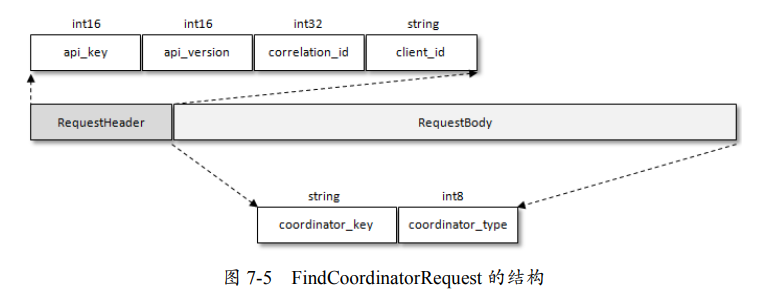

  - coordinator_key：消费组的名称，即 groupId
  - coordinator_type 置为 0

  Kafka 在收到 FindCoordinatorRequest 请求之后，会根据 coordinator_key，查找对应的 GroupCoordinator 节点。 

在成功找到消费组所对应的 GroupCoordinator 之后，就进入 JOIN_GROUP 阶段，在此阶段的消费者会向 GroupCoordinator 发送 JoinGroupRequest 请求，然后阻塞等待Kafka服务端的响应。

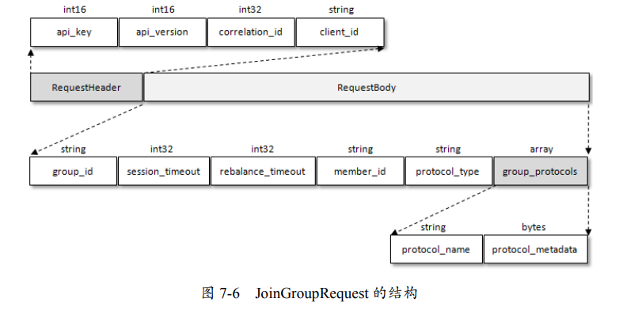

- group_id 就是消费组的 id
- session_timout 对应消费端参数 session.timeout.ms，默认值为 10000，即 10 秒。GroupCoordinator 超过 session_timeout 指定的时间内没有收到心跳报文，则认为此消费者已经下线。
- rebalance_timeout 对应消费端参数 max.poll.interval.ms，默认值为 300000，即 5 分钟。表示当消费组再平衡的时候，GroupCoordinator 等待各个消费者重新加入的最长等待时间。如果消费者在这个时间段结束前没有发送心跳给GroupCoordinator，那么GroupCoordinator将会假设该消费者已经离线，并会启动再平衡过程重新分配他的分区给其他消费者。
- member_id 表示 GroupCoordinator 分配给消费者的 id 标识。消费者第一次发送 JoinGroupRequest 请求的时候此字段设置为 null。
- group_protocols：分区分配策略
  - protocol_name：对应于 PartitionAssignor 接口中的 name()方法
  - protocol_ metadata
    - version
    - topics：对应 PartitionAssignor 接口的 subscription() 方法返回类型 Subscription 中的 topics 属性
    - user_data：对应 Subscription 中的 userData 属性

GroupCoordinator 需要为消费组内的消费者，选举出一个 leader，这个选举的算法如下：

-  如果消费组内还没有 leader，那么第一个加入消费组的消费者，为消费组的 leader
- 如果某一时刻 leader 由于某些原因，退出了消费组，那么会重新**随机**选举一 个新的 leader

每个消费者都可以设置自己的分区分配策略。对服务端而言，需要从各个消费者呈报上来的各个分配策略中，挑选出来一个：

- 服务端收集各个消费者支持的所有分配策略，组成候选集 candidates
- 每个消费者从候选集 candidates 中找出第一个自身支持的策略，为这个策略投上一票。这个过程无需再与客户端交互了，而是根据各个消费者呈报的分配策略，在服务端来实施
- 计算候选集中各个策略的选票数，选票数最多的策略即为当前消费组的分配策略

如果有消费者并不支持选出的分配策略，那么在客户端就会抛出异常 IllegalArgumentException： Member does not support protocol。**一定要确保所有消费者都支持选出的分配策略。**

在此之后，Kafka 服务端就要发送 JoinGroupResponse 响应给各个消费者

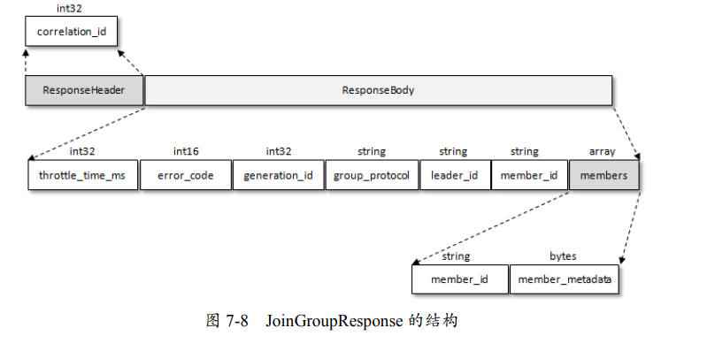

- generation_id 用来标识当前消费组的年代信息，避免受到过期请求的影响
- leader_id 表示消费组 leader 消费者的 member_id。
- members：Kafka 发送给普通消费者的 JoinGroupResponse 中的 members 内容为空，而只有 leader 消费者的 JoinGroupResponse 中的 members 包含有效数据。

由此可见，Kafka 把分区分配的具体分配交还给客户端，它只传输一些元信息，自身并不参与具体的分配细节。

leader 消费者根据在第二阶段中选举出来的分区分配策略，来实施具体的分区分配。在计算处分配方案后，leader 并不直接向其余普通消费者同步分配方案，而是通过GroupCoordinator 这个中间人，来转发分配方案。在第三阶段（SYNC_GROUP），各个消费者会向 GroupCoordinator 发送 SyncGroupRequest 请求，来同步分配方案

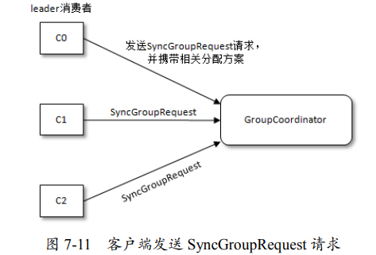

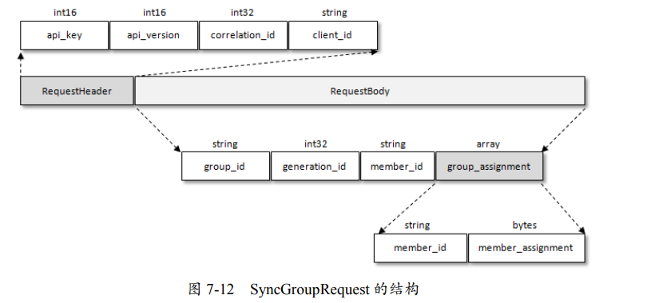

- group_assignment
  - member_id 表示消费者的唯一标识
  - member_assignment 是与消费者对应的分配方案

服务端将 leader 发送的 SyncGroupRequest 请求中的分配方案提取出来，连同整个消费组的元数据信息一起存入 Kafka 的__consumer_offsets 主题中，最后发送响应给各个消费者，以提供给各个消费者各自所属的分配方案。

当消费者收到所属的分配方案之后，会调用 PartitionAssignor 中的 onAssignment() 方法。随后再调用 ConsumerRebalanceListener 中的 OnPartitionAssigned()方法。最后开启心跳任务，消费者定期向服务端的 GroupCoordinator 发送 HeartbeatRequest 来报告在线。

客户端提交的消费位移会保存在 Kafka 的 `__consumer_offsets` 主题中。同样地，消费组的元数据信息（GroupMetadata）也保存在其中

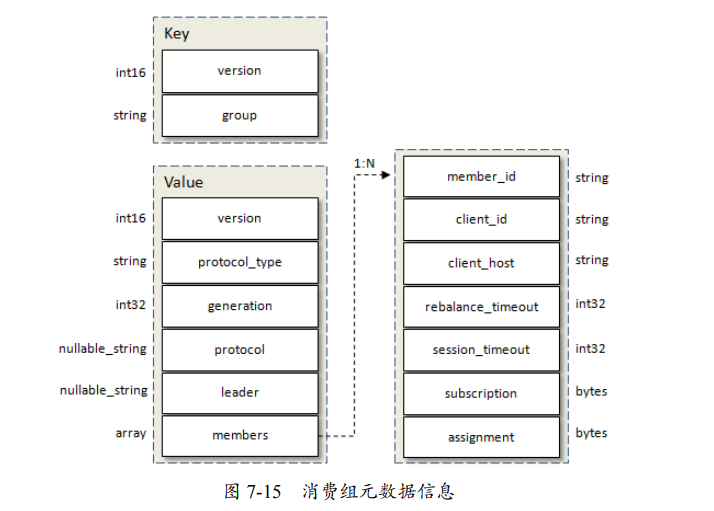

- generation：标识当前消费组的年代信息，避免收到过期请求的影响
- protocol：消费组选取的分区分配策略
- leader：消费组的 leader 消费者的名称
- members：包含了消费组的各个消费者成员信息

消费组的元数据信息与消费组对应的 GroupCoordinator ，处于同一个 broker 节点上，这省去了中间轮转的开销。

在第四阶段（HEARTBEAT）中，消费者通过向 GroupCoordinator 发送心跳，来维持它与消费组的从属关系。

## __consumer_offsets

一般情况下，当集群中第一次有消费者消费消息时，会自动创建主题__consumer_offsets。该主题的副本因子由 offsets.topic.replication.factor 参数决定（默认为3），而分区数可以通过 offsets.topic.num.partitions 参数设置，默认为 50。

客户端提交消费位移，是使用 OffsetCommitRequest 请求实现的。OffsetCommitRequest 的结构如图

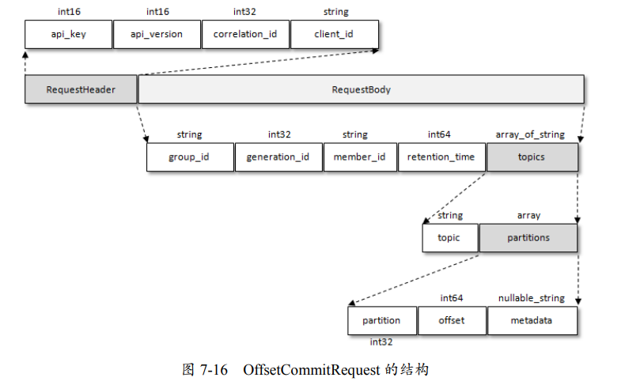

- retention_time 表示当前提交的消费位移所能保留的时长。默认为 -1，即按照 broker 端的配置 offsets.retention.minutes 来确定保留时长。在 Kafka 中有一个名为“delete-expired-group-metadata” 的定时任务，来负责清理过期的消费位移，这个定时任务的执行周期由参数 offsets. retention.check.interval.ms 控制，默认值为 600000，即 10 分钟。

同消费组的元数据信息一样，提交的消费位移也会以消息的形式，发送至主题 __consumer_offsets中

在处理完消费位移之后，Kafka返回 OffsetCommitResponse 给客户端

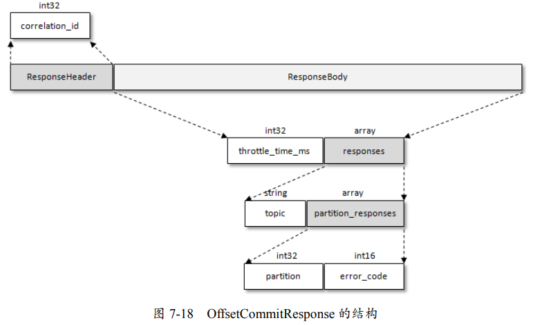

在正式消费之前，消费者还需要确定拉取消息的起始位置。假设之前已经将消费位移提交到了 GroupCoordinator，并且 GroupCoordinator 将其保存到了 Kafka 内部的__consumer_offsets 主题中。此时，消费者可以通过 OffsetFetchRequest 请求，获取上次提交的消费位移

## 事务

### 消息传输保障

一般而言，消息中间件的消息传输保障有 3 个层级：

- at most once：至多一次。消息可能会丢失，但绝对不会重复传输。
- at least once：最少一次。消息绝不会丢失，但可能会重复传输。
- exactly once：恰好一次。每条消息肯定会被传输一次且仅传输一次

- 对于生产者来说，它无法判断消息是否已经成功提交，但可以进行多次重试来确保消息已经写入 Kafka。这是 at least once
- 对于消费者而言，如果先处理消息，后提交消费位移，那么是 at least once。因为在处理消息时宕机，那么重新上线之后，会从上一次位移提交的位置拉取，这样就出现了重复消费
- 对于消费者而言，如果先提交消费位移，后处理消息，那么是 at most once。因为在处理消息时宕机，那么重新上线之后，会从已经提交的位移处开始重新消费，但之前尚有部分消息未进行消费，如此就会发生消息丢失，

Kafka 从 0.11.0.0 版本开始引入了**「幂等」**和**「事务」**这两个特性，以此来实现 **EOS（exactly once semantics）**。

### 幂等

注意，Kafka中的事务只有原子性，并没有隔离性。

将生产者客户端参数 `enable.idempotence` 设置为 true，即可开启幂等特性。

~~~java
properties.put(ProducerConfig.ENABLE_IDEMPOTENCE_CONFIG, true);
~~~

此时，参数要满足一些约束

- 如果用户显式地指定了 retries 参数，那么这个参数的值必须大于 0，否则会报出 ConfigException。若未显式指定，那么 KafkaProducer 会将它置为 Integer.MAX_ VALUE。
- 如果用户还显式地指定了 acks 参数，那么还需要保证这个参数的值为-1（all）

为了实现生产者的幂等性，Kafka 为此引入了 producer id 和 sequence number 这两个概念。

每个生产者**实例**都有一个PID，这对用户而言是透明的。而且每个分区都对应序列号。生产者每发送一 条消息，就会将对应的序列号的值加 1。在 broker 端，同时也为每对`<PID，分区>`维护一个序列号。即生产者`<PID，分区>`对应的序列号为 SN_new，而Broker的为 SN_old，那么有

- SN_new =  SN_old + 1，broker 接收它
- SN_new < SN_old + 1，那么说明消息被重复写入，broker 可以直接将其丢弃。
- 如果 SN_new > SN_old + 1，那么说明出现了乱序，暗示着可能有消息丢失。对应的生产者会抛出 OutOfOrderSequenceException。后续的诸如 send()、beginTransaction()、commitTransaction()等方法的调用，都会抛出 IllegalStateException 的异常。

注意，Kafka 并不会保证消息内容的幂等，请看下面一个例子：

~~~java
ProducerRecord<String, String> record = new ProducerRecord<>(topic, "key", "msg");
producer.send(record);
producer.send(record);
~~~

发送了两条内容相同的消息，但对 Kafka 而言是两条不同的消息，因此会为这两条消息分配不同的序列号。

### 事务

幂等性并不能跨多个分区运作，而事务可以弥补这个缺陷。事务可以保证对多个分区写入操作的原子性。为了实现事务，客户端必须

- 设置 transactional.id 参数

  ~~~java
  properties.put(ProducerConfig.TRANSACTIONAL_ID_CONFIG, "transactionId");
  ~~~
  
- 开启幂等特性

transactionalId 与 PID 一一对应，PID由 Kafka 自动分配，而 transactionalId 由用户显式设置。另外，为了保证新的生产者启动后，具有相同 transactionalId 的旧生产者能够立即失效，每个生产者通过 transactionalId 获取 PID 的同时，还会获取一个单调递增的 producer epoch

从生产者的角度分析，通过事务，Kafka 可以保证：

- 跨生产者会话的消息幂等发送
- 跨生产者会话的事务恢复：某个生产者实例宕机后， 新的生产者实例可以保证，任何未完成的旧事务，要么被提交（Commit），要么被中止（Abort）。 如此可以使新的生产者实例从一个正常的状态开始工作。

KafkaProducer 提供了 5 个与事务相关的方法

- `void initTransactions()`：用来初始化事务，会获取一个 producer epoch
- `void beginTransaction()`：开启事务
- `void sendOffsetsToTransaction(Map offsets, String consumerGroupId)`：通过 KafkaProducer 的 `sendOffsetsToTransaction()` 方法，可以在一个事务批次里，处理消费位移的提交。即只有当事务成功提交时，这个位移才被认为是提交的。而调用 commit() 方法，这个位移就被认为是提交的，无论事务之后是否成功提交，也就是说，没有事务的原子性。
- `void commitTransaction()` ：提交事务
- `void abortTransaction()`：中止事务，类似于事务回滚

事务消息发送示例：

~~~java
Properties properties = new Properties();
// ...
properties.put(
    ProducerConfig.TRANSACTIONAL_ID_CONFIG, 
    transactionId);

KafkaProducer<String, String> producer = new KafkaProducer<>(properties);

producer.initTransactions();
producer.beginTransaction();
try {
    // 处理业务逻辑并创建 ProducerRecord
    ProducerRecord<String, String> record1 = new ProducerRecord<>(topic, "msg1");
    producer.send(record1);
    producer.commitTransaction();
} catch (ProducerFencedException e) {
    producer.abortTransaction();
}
producer.close();
~~~

在消费端有一个参数 `isolation.level`，默认值为 `read_uncommitted`，意思是说消费端应用可以看到（消费到）未提交的事务。这个参数还可以设置为 `read_committed`，表示消费端应用不可以看到尚未提交的事务内的消息

在 KafkaConsumer 内部会缓存这些消息，直到生产者执行 commitTransaction() 方法后，它才将这些消息推送给消费端应用。反之，如果生产者执行了 abortTransaction() 方法，那么 KafkaConsumer 会将这些缓存的消息丢弃，而不推送给消费端应用。

日志文件中除了普通的消息，还有一种控制消息专门用来标志一个事务的结束。控制消息一共有两种类型：COMMIT 和 ABORT。KafkaConsumer 可以通过这个控制消息，来判断对应的事务消息（`isTransaction`标志位为1）是被提交了，还是被中止了。然后结合参数 isolation.level 配置的隔离级别，来决定是否将相应的消息，返回给消费者实例

当 Kafka 的日志清理线程（log cleaner）扫描日志时，一旦遇到 ABORT 控制消息，它就会知道所有标记了这个事务ID的消息，都应该要删除。

消费—转换—生产模式示例

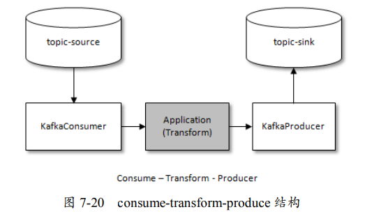

~~~java
KafkaConsumer<String, String> consumer = new KafkaConsumer<>(getConsumerProperties());
consumer.subscribe(Collections.singletonList("topic-source"));

KafkaProducer<String, String> producer = new KafkaProducer<>(getProducerProperties());
producer.initTransactions();
while (true) {
    ConsumerRecords<String, String> records = consumer.poll(Duration.ofMillis(1000));
    if (!records.isEmpty()) {
        Map<TopicPartition, OffsetAndMetadata> offsets = new HashMap<>();
        producer.beginTransaction();
        try {
            for (TopicPartition partition : records.partitions()) {
                List<ConsumerRecord<String, String>> partitionRecords = records.records(partition);
                for (ConsumerRecord<String, String> record : partitionRecords) {
                    //do some logical processing.
                    ProducerRecord<String, String> producerRecord =
                        new ProducerRecord<>("topic-sink", record.key(),
                            record.value());
                    //消费—生产模型
                    producer.send(producerRecord);
                }
                long lastConsumedOffset = partitionRecords.get(partitionRecords.size() - 1).offset();
                offsets.put(partition, new OffsetAndMetadata(lastConsumedOffset + 1));
            }
        } catch (ProducerFencedException e) {
            producer.abortTransaction();
        }

        //提交消费位移
        producer.sendOffsetsToTransaction(offsets,"groupId");
        //提交事务
        producer.commitTransaction();
    }
}
~~~

注意：在使用 KafkaConsumer 的时候要将 enable.auto.commit 参数设置为 false。

为了实现事务的功能，Kafka 还引入了**「事务协调器」（TransactionCoordinator）**，来负责处理事务。每一个生产者都会被指派一个特定的 TransactionCoordinator。所有的事务逻辑等都是由 TransactionCoordinator 来负责实现的。TransactionCoordinator 会将事务状态持久化到内部主题`__transaction_state` 中

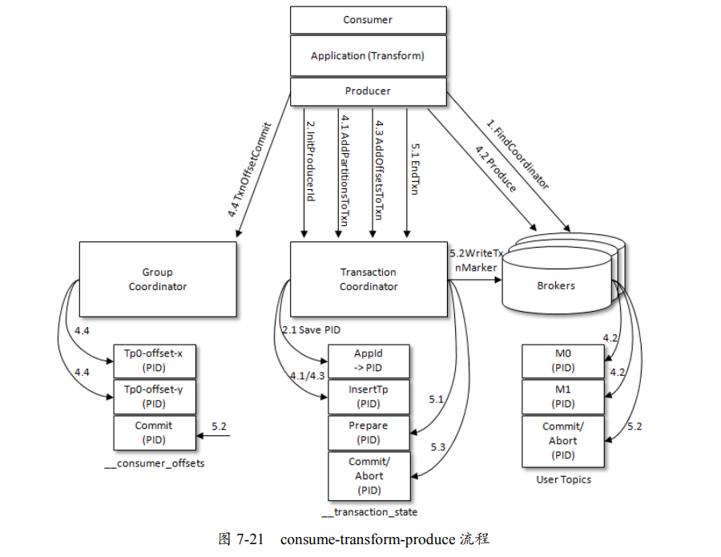

生产者首先找出它的 TransactionCoordinator 所在的 broker 节点。与查找 GroupCoordinator 节点一样，也是通过 FindCoordinatorRequest 请求来实现的。Kafka 会根据 transactionalId 的哈希值，算出在该生产者事务在主题 `__transaction_state` 对应的分区。找到 leader 分区就找到了 broker 节点。

生产者获取 PID 的操作是通过 InitProducerIdRequest 请求来实现的

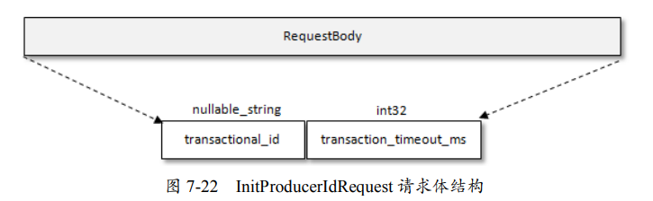

- transactional_id 表示事务的 transactionalId
- transaction_ timeout_ms 表示TransactionCoordinaor 等待事务状态更新的超时时间，通过生产者客户端参 数 transaction.timeout.ms 配置，默认值为 60000。

TransactionCoordinator 第一次收到包含该 transactionalId 的 InitProducerIdRequest 请求时，它会把 transactionalId 和对应的 PID 以消息的形式，保存到主题__transaction_state 中

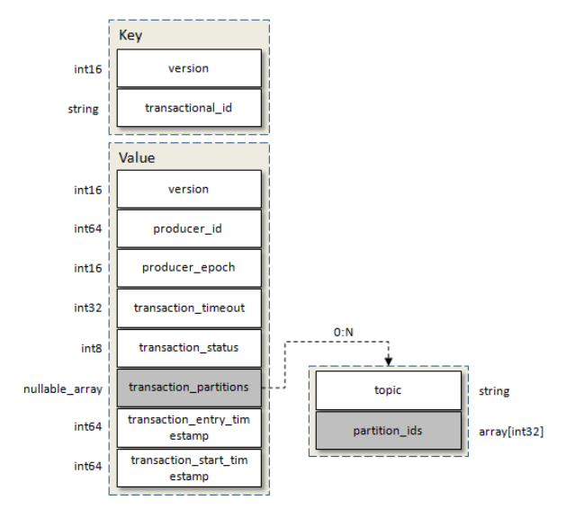

此外，InitProducerIdRequest 还会触发执行以下任务：

- 增加该 PID 对应的 producer_epoch。
- 恢复（Commit）或中止（Abort）之前的生产者未完成的事务。

与 InitProducerIdRequest 对应的 InitProducerIdResponse 响应体结构

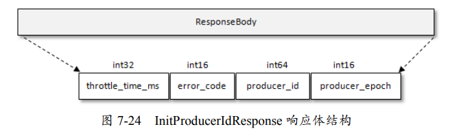

当生产者给一个新的分区（TopicPartition）发送数据前，它需要先向 TransactionCoordinator 发送 AddPartitionsToTxnRequest 请求。这个请求会让 TransactionCoordinator 将的对应关系存储在主题 `__transaction_state` 中，有了这个对照关系之后，我们就可以在后续的步骤中，为每个分区设置 COMMIT 或 ABORT 标记（发送控制信息）。

sendOffsetsToTransaction() 方法会向 TransactionCoordinator 节点发送 AddOffsetsToTxnRequest 请求。在处理完 AddOffsetsToTxnRequest 之后，生产者还会发送 TxnOffsetCommitRequest 请求给 GroupCoordinator，从而将本次事务中包含的消费位移消息offsets （设置了事务ID），存储到主题__consumer_offsets 中。

无论调用 commitTransaction() 方法还是 abortTransaction() 方法，生产者都会向 TransactionCoordinator 发送 EndTxnRequest 请求

TransactionCoordinator 向事务中各个分区的 leader 节点，发送 WriteTxnMarkersRequest 请求。当节点收到这个请求之后，会在相应的分区中写入控制消息（ControlBatch）。RecordBatch 中 attributes 字段的第 6 位，用来标识当前消息是否是控制消息。

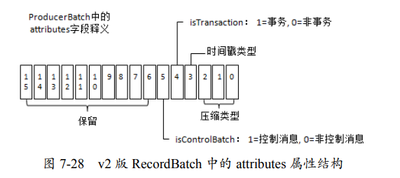

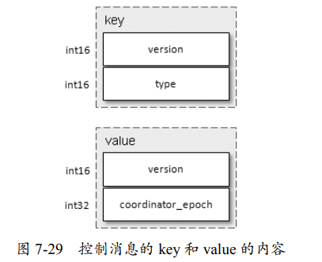

TransactionCoordinator 将最终的 COMPLETE_COMMIT 或 COMPLETE_ABORT 信息写入主题`__transaction_state` ，以表明当前事务已经结束。此时，可以删除在主题transaction_state 中所有有关该事务的消息。由于主题`__transaction_state`采用的日志清理策略为日志压缩，所以这里的删除只需将相应的消息设置为墓碑消息即可。

