# 深入服务端

[TOC]

## 协议设计

在目前的 Kafka 2.0.0 中，一共包含了 43 种协议类型，每种协议类型都有对应的请求 （Request）和响应（Response）

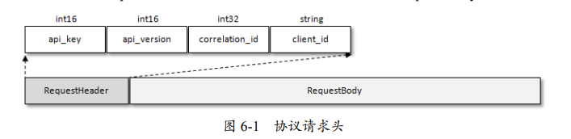

- api_key：API 标识
- api_version：API 版本号
- correlation_id：由客户端指定的一个数字来唯一地标识这次请求的 id，服务端在处理完请求后也 会把同样的 coorelation_id 写到 Response 中，这样客户端就能把某个请求和响应 对应起来了
- client_id：客户端 id

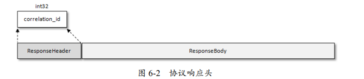

发送消息的协议 ProduceRequest（api_version = 6）

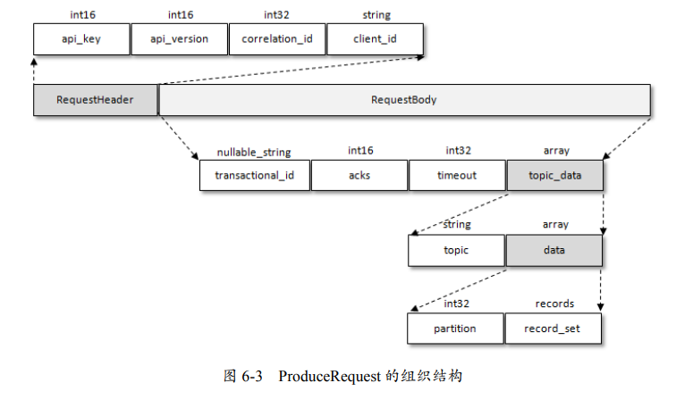

- transactional_id：事务 id
- acks：客户端参数 acks
- timeout：请求超时时间，对应客户端参数 request.timeout.ms
- topic_data
  - topic：主题名称
  - data
    - 分区编号
    - 与分区对应的数据

如果参数 acks 设置非 0 值，那么生产者客户端在发送 ProduceRequest 请求之后就需要（异步）等待服务端的响应 ProduceResponse。

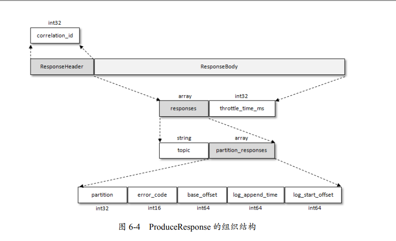

- throttle_time_ms：如果超过了配额（quota）限制，则客户端可能需要等待一段时间后才能继续发送消息。这是一种反压机制，用于控制消息的传输速率，防止服务端压力过大。
- responses
  - topic：主题名称
  - partition_responses
    - partition：分区编号
    - error_code：错误码，用来标识错误类型
    - base_offset：消息集的起始偏移量
    - log_append_time：消息写入 broker 端的时间
    - log_start_offset：所在分区的起始偏移量

拉取消息的协议 FetchRequest/FetchResponse（V8）

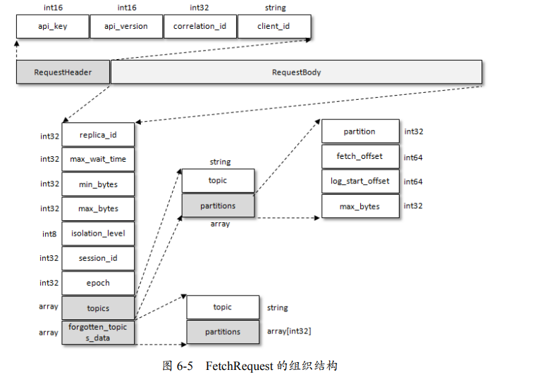

- replica_id：这个域是用于 follower 副本向 leader 副本发起 FetchRequest 请求的，对于普通消费者客 户端而言，这个域的值保持为 -1

- max_wait_time：与消费者客户端参数 fetch.max.wait.ms 对应

- min_bytes：和消费者客户端参数 fetch.min.bytes 对应

- max_bytes：和消费者客户端参数 fetch.max.bytes 对应

- isolation_level：和消费者客户端参数 isolation.level 对应

- session_id：fetch session 的 id

- epoch：fetch session 的 epoch 纪元

- topics

  - topic：主题名称

  - partitions

    - partition：分区编号
    - fetch_offset：指定从分区的哪个位置开始读取消息
    - log_start_offset：该域专门用于 follower 副本发起的 FetchRequest 请求，用来指明分区的起始偏移量。对于普通消费者客户端而言这个值保持为 -1
    - max_bytes：和消费者客 户端参数 max.partition.fetch.bytes 对应
  
- forgotten_topics_data：用于取消对某些分区的拉取订阅

  - topic：主题名称
  - partitions：表示分区编号的集合
  
    

session_id 和 epoch 确定一条拉取链路的 fetch session，当 session 建立时会发送全量式的 FetchRequest。当 session 稳定时，则会发送增量式的 FetchRequest 请求。

FetchResponse 的组织结构（V8 版本）

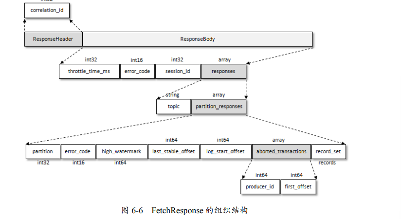

## 时间轮

Kafka 中存在大量的延时操作，比如延时生产、延时拉取和延时删除等。Kafka 基于时间轮的概念，实现了一个用于延时功能的定时器（SystemTimer）。

所谓的的**时间轮（TimingWheel）**，就是一个存储定时任务的环形队列，每个元素可以存放一个**定时任务列表（TimerTaskList）**。TimerTaskList 是一个环形的双向链表，链表中的每一项表示的都是**定时任务项（TimerTaskEntry）**，其中封装了**定时任务（TimerTask）**。

时间轮由多个时间格组成，每个时间格代表基本的**时间跨度（tickMs）**。时间轮的时间格个数是固定的，可用 wheelSize 来表示。整个时间轮的总体**时间跨度（interval）** 可以通过公式 tickMs×wheelSize 计算得出。时间轮还有一个**表盘指针（currentTime）**，用来表示时间轮当前所处的时间。同时 currentTime 所指向的时间格，表示刚好到期。

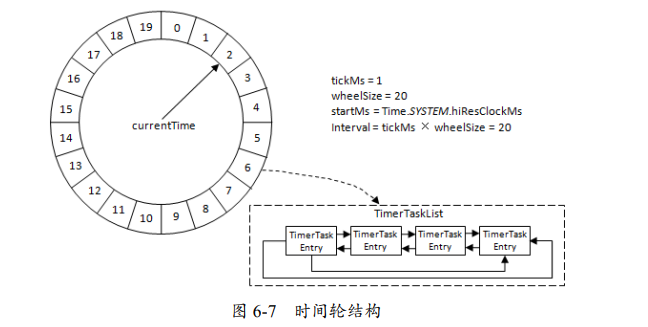

如果要支持长时间的定时任务，那么不得不增加 wheelSize，但这样占用了大量内存。为此，Kafka 引入了层级时间轮的概念。当任务的定时时间超过了时间轮所能表示的时间范围时，就会尝试添加到上层时间轮中。当上层时间轮的 TimerTaskList 到期时，会取出定时任务，然后将定时任务的延迟时间减少上层时间轮的 tickMs。 如果减少后的延迟时间不为0，那么就降级到下层时间轮中。

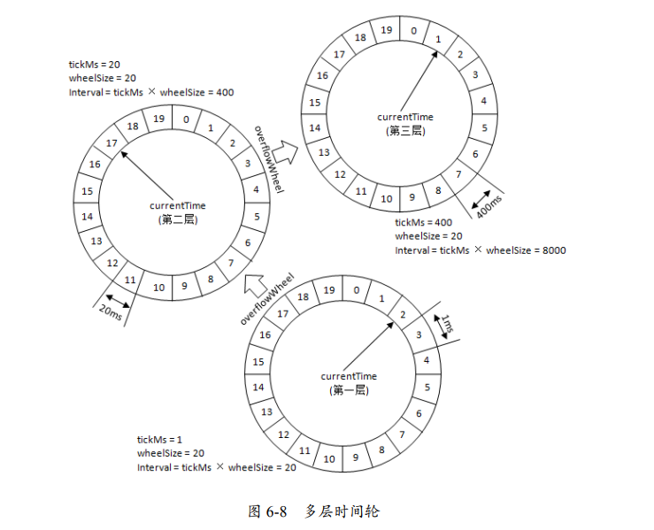

时间轮是如何推进时间的呢？

Kafka 将每个使用到的 TimerTaskList 都加入 DelayQueue。DelayQueue 会根据 TimerTaskList 对应的超时时间 expiration 来排序。Kafka 通过 ExpiredOperationReaper 线程获取 DelayQueue 中超时的任务列表 TimerTaskList ，然后根据 TimerTaskList 的 expiration 来推进时间轮的时间，同时就获取到的TimerTaskList 执行相应的操作，对里面的 TimerTaskEntry 该执行过期操作的就执行过期操作， 该降级时间轮的就降级时间轮。

对定时任务项 TimerTaskEntry 的插入和删除操作而言，TimingWheel时间复杂度为O(1)，性能高出DelayQueue很多（ 时间复杂度为O(nlogn)）。因此，用 TimingWheel 做最擅长的任务添加和删除操作，而用 DelayQueue 做最擅长的时间推进工作，两者相辅相成。如果不使用 DelayQueue，那么需要执行多次空推进。

## 延时操作

在 Kafka 中有多种延时操作，例如，延时生产，延时拉取（DelayedFetch）、 延时数据删除（DelayedDeleteRecords）。延时操作在创建之后，会被加入延时操作管理器（DelayedOperationPurgatory）中。

延时操作不同于定时操作，定时操作是指在特定时间之后执行的操作，而延时操作可以在所设定的超时时间之前完成，所以延时操作能够支持外部事件的触发。

延时操作管理器配备：

- 定时器，来做超时管理
- 监听池，来负责监听每个分区的外部事件

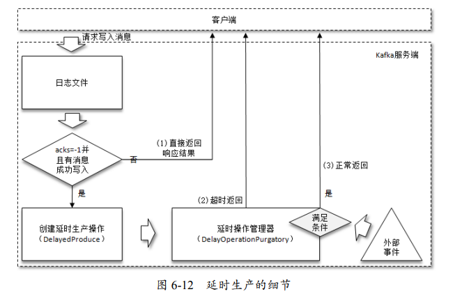

## 控制器

在 Kafka 的早期版本中，每个 broker 都会在 ZooKeeper 上为分区和副本注册大量的监听器（Watcher）。当分区或副本状态变化时，会唤醒很多不必要的监听器。一方面这会有脑裂问题，另一方面，又会有性能问题。现在在 Kafka 集群中，有一个 Broker 被选举为控制器，它负责管理整个集群中所有分区和副本的状态：

- 监听分区相关的变化。
  - 为 ZooKeeper 中的 /admin/reassign_partitions 节点注册 PartitionReassignmentHandler，用来处理分区重分配的动作。
  - 为 ZooKeeper 中的 /isr_change_notification 节点注册 IsrChangeNotificetionHandler，用来处理 ISR 集合变更的动作。
  - 为 ZooKeeper 中的/admin/preferred-replica-election 节 点添加 PreferredReplicaElectionHandler，用来处理优先副本的选举动作。
- 监听主题相关的变化
  - 为 ZooKeeper 中 的 /brokers/topics 节点添加 TopicChangeHandler ，用来处理主题增减的变化
  -  ZooKeeper 中的/admin/ delete_topics 节点添加 TopicDeletionHandler，用来处理删除主题的动作。
- 监听broker 相关的变化。为ZooKeeper 中的/brokers/ids 节点添加BrokerChangeHandler， 用来处理 broker 增减的变化。
- ...

只有 Kafka Controller 在 ZooKeeper 上注册相应的监听器，其他的 broker 极少需要再监听 ZooKeeper 中的数据变化

Kafka 的控制器使用单线程基于事件队列的模型，将每个事件都做一层封装，然后按照事件发生的先后顺序暂存到 LinkedBlockingQueue 中，最后使用一个专用的线程 （ControllerEventThread）按照 FIFO（First Input First Output，先入先出）的原则顺序处理各个 事件。这样避免锁带来的性能损耗。

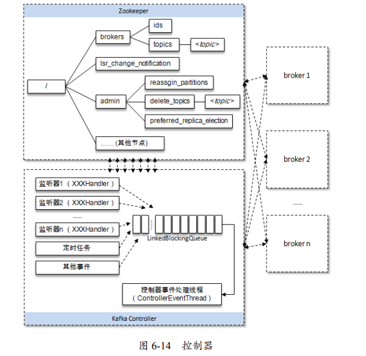

成功竞选为控制器的 broker ，会在 ZooKeeper 中创建/controller 临时节点：

~~~json
{"version":1,"brokerid":0,"timestamp":"1529210278988"}
~~~

每个 broker 还是会对/controller 节点添加监听器，以此来监听此节点的数据变化（ControllerChangeHandler）。

ZooKeeper 中还有 /controller_epoch 持久节点，存放选举纪元。每个和控制器交互的请求都会携带 controller_ epoch 这个字段，如果请求的 controller_epoch 值小于内存中的 controller_epoch 值， 那么这个请求会被认定为无效的请求。

`kill -s TERM $PIDS` 或 `kill -15 $PIDS` 的方式来关闭进程，因为 Kafka 捕获到 TERM 信号后，会执行 “kafka-shutdownhock” 关闭钩子，它的作用如下：

- 正常释放一些必要的资源
- 执行一个控制关闭（ControlledShutdown）的动作
  - 让消息完全同步到磁盘上
  - 对其上的 leader 副本进行迁移，这样就可以减少分区的不可用时间。

控制关闭需要将参数 controlled. shutdown.enable 设置为 true。。ControlledShutdown 动作如果执行不成功还会重试执行，这个重试的动作由参数 controlled.shutdown.max.retries 配置，默认为 3 次，每次重试的间隔由参数 controlled.shutdown.retry.backoff.ms 设置，默认为 5000ms。

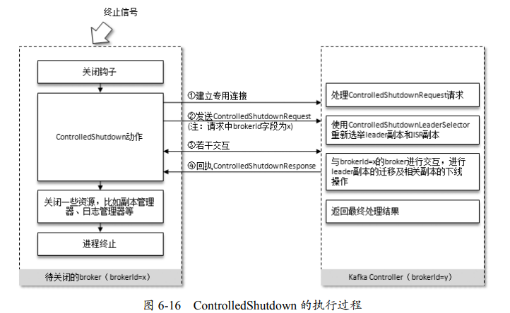

## 参数

broker 在启动时会在 ZooKeeper 中的 /brokers/ids 路径下创建一个以当前 brokerId 为名称的虚节点，broker 的健康状态检查就依赖于此虚节点。当 broker 下线时，该虚节点会自动删除。

bootstrap.servers

- 客户端 KafkaProducer 与 bootstrap.servers 参数所指定的 Server 连接，并发送 MetadataRequest 请求来获取集群的元数据信息
- Server 返回 MetadataResponse 给 KafkaProducer2
- 客户端 KafkaProducer2 收到的 MetadataResponse 之后，解析出其中包含的集群元数据信 息，然后与集群中的各个节点建立连接

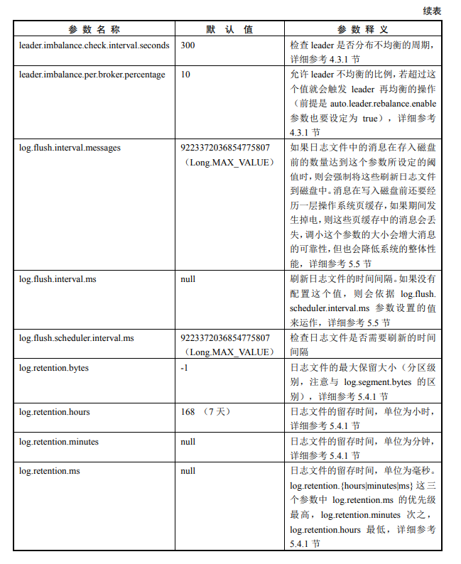

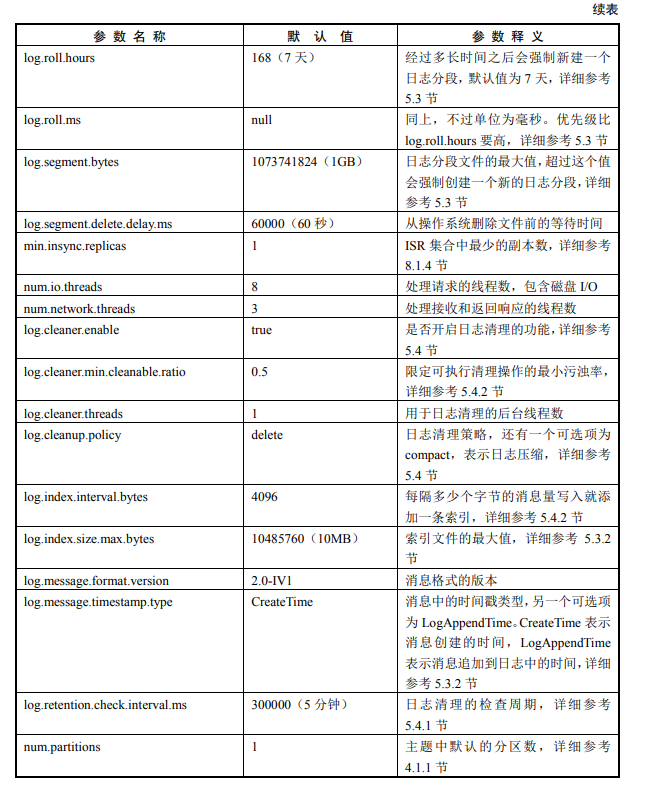

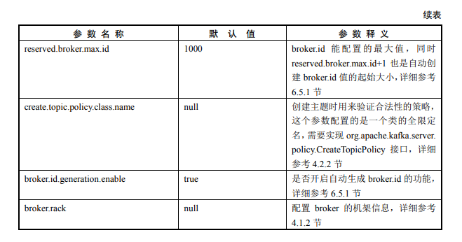
