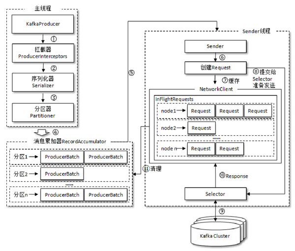

# 生产者

[TOC]

**在 Kafka 中，一个消息只能被发送到一个特定的分区。**

## 客户端

Kafka的Java客户端依赖如下：

~~~xml
<dependency>
    <groupId>org.apache.kafka</groupId>
    <artifactId>kafka-clients</artifactId>
    <version>2.0.0</version>
</dependency>
~~~

它还要log4j的实现

~~~xml
<!-- Log4j API and Core implementation required for binding -->
<dependency>
    <groupId>org.apache.logging.log4j</groupId>
    <artifactId>log4j-api</artifactId>
    <version>2.13.3</version>
</dependency>
<dependency>
    <groupId>org.apache.logging.log4j</groupId>
    <artifactId>log4j-core</artifactId>
    <version>2.13.3</version>
</dependency>
<!-- SLF4J Binding -->
<dependency>
    <groupId>org.apache.logging.log4j</groupId>
    <artifactId>log4j-slf4j-impl</artifactId>
    <version>2.13.3</version>
</dependency>
~~~

~~~java
public static final String brokerList = "localhost:9092";
public static final String topic = "topic-demo";

// 配置生产者客户端参数
Properties properties = new Properties();
properties.put("key.serializer", "org.apache.kafka.common.serialization.StringSerializer");
properties.put("value.serializer", "org.apache.kafka.common.serialization.StringSerializer");
properties.put("bootstrap.servers", brokerList);
properties.put(ProducerConfig.ACKS_CONFIG, "all");

// 创建相应的生产者实例
KafkaProducer<String, String> producer = new KafkaProducer<>(properties);

// 构建待发送的消息
ProducerRecord<String, String> record = new ProducerRecord<>(topic, "Hello, Kafka!");

try {
    // 发送消息
    producer.send(record);
} catch (Exception e) {
    e.printStackTrace();
}

// 关闭生产者实例
producer.close();
~~~

注意：`close()`方法会同步阻塞，等待所有发送的请求都完成后，再关闭`KafkaProducer`。

### 参数配置

KafkaProducer有三个参数是必填的

- `bootstrap.servers`：该参数用来指定生产者客户端连接Kafka集群所需的broker地址清单。具体的内容格式为`host1：port1，host2：port2`，可以设置一个或多个地址，中间以逗号隔开。这样当其中任意一个宕机时，生产者仍然可以连接到Kafka集群上。
- key.serializer 和 value.serializer：key.serializer 和 value.serializer 这两个参数分别用来指定 key 和 value 序列化操作的序列化器
- `client.id`：用来设定KafkaProducer对应的客户端id

我们可以使用 `org.apache.kafka.clients.producer.ProducerConfig` 类来减少误写参数名的可能性：

~~~java
Properties properties = new Properties();
properties.put(ProducerConfig.KEY_SERIALIZER_CLASS_CONFIG, "org.apache.kafka.common.serialization.StringSerializer");
properties.put(ProducerConfig.VALUE_SERIALIZER_CLASS_CONFIG, "org.apache.kafka.common.serialization.StringSerializer");
properties.put(ProducerConfig.BOOTSTRAP_SERVERS_CONFIG, brokerList);
~~~

KafkaProducer是线程安全的，可以在多个线程中共享单个KafkaProducer实例

### 消息发送

~~~java
public class ProducerRecord<K, V> {
    private final String topic;			// 主题
    private final Integer partition;	// 分区
    private final Headers headers;		// 消息头部
    private final K key;				// 键
    private final V value;				// 值
    private final Long timestamp;		// 消息时间戳
    // ...
}
~~~

- key 有以下作用：

  - 消息的附加信息

  - 可以用来计算分区号进而可以让消息发往特定的分区

  - 可以支持日志压缩的功能

- value 是消息体
- timestamp 是指消息的时间戳，它有 CreateTime 和 LogAppendTime 两种类型，前者表示消息创建的时间，后者表示消息追加到日志文件的时间。时间戳被用来支持日志压缩，以实现精确到毫秒级别的消息定位。

> 在ProducerRecord对象中，topic属性和value属性是必填项，其余属性是选填项。

发送消息主要有三种模式：

- **发后即忘（fire-and-forget）**：它只管往Kafka中发送消息而并不关心消息是否正确到达。这种发送方式的性能最高，可靠性也最差。

- **同步**：

  ~~~java
  public Future<RecordMetadata> send(ProducerRecord<K, V> record)
  
  public Future<RecordMetadata> send(ProducerRecord<K, V> record, Callback callback)
  ~~~

  通过`Future#get`方法，同步阻塞获取结果。

  ~~~java
  Future<RecordMetadata> future = producer.send(record);
  RecordMetadata metadata = future.get();
  ~~~

  RecordMetadata对象里包含了消息的一些元数据信息，比如当前消息的主题、分区号、分区中的偏移量（offset）、时间戳等。

- 异步：一般是在`send()`方法里指定一个 Callback 回调函数

  ~~~java
  producer.send(producerRecord, new Callback() {
      @Override
      public void onCompletion(
          RecordMetadata recordMetadata, 
          Exception e) {
  		// 两个参数是互斥的，消息发送成功时，metadata 不为 null 而exception为null；消息发送异常时，metadata为null而exception不为null。
      }
  });
  ~~~

  

KafkaProducer中一般会发生两种类型的异常：

- 可重试的异常：NetworkException、LeaderNotAvailableException、UnknownTopicOrPartitionException、NotEnoughReplicasException、NotCoordinatorException 等
- 不可重试的异常。RecordTooLargeException异常

对于可重试的异常，如果配置了 retries 参数，那么只要在规定的重试次数内自行恢复了，就不会抛出异常。retries参数的默认值为0

~~~java
props.put(ProducerConfig.RETRIES_CONFIG, 10);
~~~

### 序列化

生产者所使用的`KafkaProducer＜String，String＞`和`ProducerRecord＜String，String＞`中的泛型`＜String，String＞`，对应的就是消息中 key 和 value 的类型，这样可以让代码具有良好的可读性。

broker 端接收的消息必须是字节数组（byte[]）。所以在发送消息之前，key 和 value 做相应的序列化操作来转换成字节数组。所有的序列化器都实现以下接口：

~~~java
public interface Serializer<T> extends Closeable {
    
    void configure(Map<String, ?> var1, boolean var2);
    
    // 执行序列化操作
    byte[] serialize(String var1, T var2);
    
    // 如果实现了此方法，则必须确保此方法的幂等性
    void close();
}
~~~

StringSerializer 的代码实现

~~~java
public class StringSerializer implements Serializer<String> {
    private String encoding = "UTF8";
    public StringSerializer() {}

    // 在创建KafkaProducer实例的时候调用的，主要用来确定编码类型
    // 一般客户端对于 key.serializer.encoding、value.serializer.encoding和serializer.encoding这几个参数都不会配置。默认的“UTF-8”就足够用
    
    public void configure(Map<String, ?> configs, boolean isKey) {
        String propertyName = isKey ? "key.serializer.encoding" : "value.serializer.encoding";
        Object encodingValue = configs.get(propertyName);
        if (encodingValue == null) {
            encodingValue = configs.get("serializer.encoding");
        }
        if (encodingValue != null && encodingValue instanceof String) {
            this.encoding = (String)encodingValue;
        }
    }

    public byte[] serialize(String topic, String data) {
        try {
            return data == null ? null : data.getBytes(this.encoding);
        } catch (UnsupportedEncodingException var4) {
            throw new SerializationException("Error when serializing string to byte[] due to unsupported encoding " + this.encoding);
        }
    }

    public void close() {}
}
~~~

下面介绍如何自定义一个序列化器，首先明确我们要序列化的对象

~~~java
@Data
@NoArgsConstructor
@AllArgsConstructor
@Builder
public class Company {
    private String name;
    private String address;
}
~~~

接着就定义对应的序列化器

~~~java
public class CompanySerializer implements Serializer<Company> {
    @Override
    public void configure(Map configs, boolean isKey) {}
    
    @Override
    public byte[] serialize(String topic, Company data) {
        if (data == null) {
            return null;
        } 
        byte[] name, address;
        
        try {
            if (data.getName() != null) {
                name = data.getName().getBytes("UTF-8");
            } else {
                name = new byte[0];
            }
            
            if (data.getAddress() != null) {
                address = data.getAddress().getBytes("UTF-8");
            } else {
                address = new byte[0];
            }
            ByteBuffer buffer = ByteBuffer.allocate(4 + 4 + name.length + address.length);
            buffer.putInt(name.length);
            buffer.put(name);
            buffer.putInt(address.length);
            buffer.put(adress);
            return buffer.array();
        } catch (UnsupportedEncodingException e) {
            e.printStackTrace();
        }
        return new byte[0];
    }
    @Override
    public void close() {}
}
~~~

注册该序列化器：

~~~java
Properties properties = new Properties();
properties.put(ProducerConfig.VALUE_SERIALIZER_CLASS_CONFIG, CompanySerializer.class.getName());
KafkaProducer<String, Company> producer = new KafkaProducer<>(properties);
~~~

### 分区器

消息在通过`send()`方法发往 broker 的过程中，有可能需要经过拦截器（Interceptor）、序列化器（Serializer）和分区器（Partitioner）的一系列作用之后才能被真正地发往 broker

如果消息 ProducerRecord 中指定了 partition 字段，那么就不需要分区器，因为partition 代表的就是所要发往的分区号。否则，分区器根据 key 字段来计算 partition 的值

Kafka中提供的默认分区器是`org.apache.kafka.clients.producer.internals.DefaultPartitioner`，它实现了`org.apache.kafka.clients.producer.Partitioner`接口：

~~~java
public interface Partitioner extends Configurable, Closeable {
    // 这些参数分别表示主题、键、序列化后的键、值、序列化后的值，以及集群的元数据信息
    int partition(String var1, Object var2, byte[] var3, Object var4, byte[] var5, Cluster var6);
    void close();
}

// Partitioner的父接口
public interface Configurable {
    void configure(Map<String, ?> var1);
}
~~~

在默认分区器 DefaultPartitioner 的实现中，`close()` 是空方法，而在 `partition()` 方法使用 MurmurHash2 算法对 key 进行哈希。如果 key 为 null ，那么消息将会以轮询的方式发往主题内的各个可用分区。

自定义一个分区器

~~~java
public class DemoPartitioner implements Partitioner {
    private final AtomicInteger counter = new AtomicInteger(0);
    
    @Override
    public int partition(String topic, Object key, byte[] keyBytes,
                        Object value, byte[] valueBytes, Cluster cluster) {
        List<PartitionInfo> partitions = cluster.partitionsForTopic(topic);
        int numPartitions = partitions.size();
        if (null = keyBytes) {
            return conter.getAndIncrement() % numPartitions;
        } else {
            return Utils.tpPositive(Utils.murmur2(keyBytes)) % numPartitions;
        }
    }
    @Override
    void close();{}
    
    @Override
    void configure(Map<String, ?> var1) {}
}
~~~

注册：

~~~java
properties.put(ProducerConfig.PARTITIONER_CLASS_CONFIG, DemoPartitioner.class.getName());
~~~

### 拦截器

Kafka一共有两种拦截器：

- 生产者拦截器
- 消费者拦截器

生产者拦截器既可以用来在消息发送前做一些准备工作，比如按照某个规则过滤不符合要求的消息、修改消息的内容等。它实现`org.apache.kafka.clients.producer.ProducerInterceptor`接口

~~~java
public interface ProducerInterceptor<K, V> extends Configurable {
    // KafkaProducer在将消息序列化和计算分区之前会调用生产者拦截器的onSend()方法来对消息进行相应的定制化操作
    ProducerRecord<K, V> onSend(ProducerRecord<K, V> var1);

    // KafkaProducer 会在消息应答（Acknowledgement）之前或消息发送失败时，调用该方法，优先于用户设定的 Callback 之前执行
    // 这个方法运行在Producer 的 I/O 线程中
    void onAcknowledgement(RecordMetadata var1, Exception var2);

    void close();
}
~~~

注册：

~~~java
properties.put(ProducerConfig.INTERCEPTOR_CLASSES_CONFIG, ProducerInterceptorPrefix.class.getName());
~~~

KafkaProducer中，还可以设置拦截链（多个拦截器）。

~~~java
properties.put(ProducerConfig.INTERCEPTOR_CLASSES_CONFIG, ProducerInterceptorPrefix.class.getName() + "," + ProducerInterceptorSuffix.class.getName());
~~~

## 原理

整个生产者客户端由两个线程协调运行

- 主线程
- Sender线程：负责从 `RecordAccumulator` 中获取消息并将其发送到 Kafka Cluster 中

RecordAccumulator 主要用来缓存消息，以便 Sender 线程可以批量发送，进而减少网络传输的资源消耗以提升性能。

`RecordAccumulator` 缓存的大小可以通过生产者客户端参数 `buffer.memory` 配置，默认值为 33554432B，即 32MB。如果缓存已满，就同步阻塞，如果阻塞超出 `max.block.ms`（默认60000，60秒），那么就抛出异常。

在 `RecordAccumulator` 的内部为每个分区都维护了一个双端队列，队列中的元素就是`ProducerBatch`。`ProducerBatch` 中可以包含一至多个 `ProducerRecord`

消息在网络上都是以字节（Byte）的形式传输的，在发送之前需要创建一块内存区域（ByteBuffer）来保存对应的消息。在 RecordAccumulator 的内部还有一个 BufferPool ，它主要用来实现 ByteBuffer 的复用，减少频繁地创建和释放的次数。不过 BufferPool 只针对特定大小的 ByteBuffer 进行管理，这个特定的大小由 `batch.size` 参数来指定，默认值为16384B，即16KB。

ProducerBatch的大小和batch.size参数也有着密切的关系。

- 当一条消息（ProducerRecord）流入RecordAccumulator时，会先寻找与消息分区所对应的双端队列（如果没有则新建）
- 再从这个双端队列的尾部获取一个 ProducerBatch（如果没有则新建）
- 查看是否还可以写入这个ProducerRecord，如果可以则写入，否则需要创建一个新的ProducerBatch
- 在新建 ProducerBatch 时评估这条消息的大小是否超过 batch.size 参数的大小，如果不超过，那么就以 batch.size 参数的大小来创建 ProducerBatch，这样在使用完这段内存区域之后，可以通过 BufferPool 的管理来进行复用；否则，那么就以消息的大小来创建 ProducerBatch ，这段内存区域不会被复用。

Sender 从 RecordAccumulator 中获取缓存的消息之后，将`＜分区，Deque＜ProducerBatch＞＞`转换为`＜Node，List＜ ProducerBatch＞`，其中 Node 表示 Kafka 集群的 broker 节点。这里做了应用逻辑层面到网络I/O层面的转换

- 对于网络连接来说，关注向具体的 broker 节点发送消息，而并不关心消息属于哪一个分区
- 而对于应用逻辑而言，我们只关注向哪个分区中发送哪些消息

接着，Sender 将`＜Node，List＜ProducerBatch＞＞`进一步封装成`＜Node，Request＞`，这里的 Request 是指 Kafka 的各种协议请求

请求在从 Sender 线程发往 Kafka 之前，还会保存到 InFlightRequests 中。InFlightRequests 保存对象的具体形式为`Map＜NodeId，Deque＜Request＞＞`，它的主要作用是缓存了已经发出去但还没有收到响应的请求。

通过配置参数`max.in.flight.requests.per.connection`，来限制每个客户端与Node之间的连接，默认值为 5，即每个连接最多只能缓存 5 个未响应的请求。InFlightRequests 还可以获得 leastLoadedNode，即所有Node中负载最小的那一个。

**我们在调用生产者API时，只需知道一个Broker地址即可，客户端可以自己发现其他 broker 节点的地址。**并且，客户端可以动态捕获集群元数据的变化，而这些元数据记录了：

- 集群中有哪些主题、这些主题有哪些分区
- 每个分区的leader副本、follower副本分配在哪个节点上
- 哪些副本在AR、ISR等集合中
- 集群中有哪些节点、控制器节点又是哪一个
- ...

当客户端中没有特定的元数据信息，或者超过 `metadata.max.age.ms` 时间（默认值为300000，即5分钟）没有更新元数据时，客户端会向 leastLoadedNode 发送MetadataRequest 请求，来获取具体的元数据信息。

## 参数

- acks（字符串类型），这个参数用来指定分区中必须要有多少个副本收到这条消息，之后生产者才会认为这条消息是成功写入的。

  - `acks=1`（默认值）：生产者发送消息之后，只要分区的leader副本成功写入消息，那么它就会收到来自服务端的成功响应。
  - `acks=0`：生产者发送消息之后，不需要等待任何服务端的响应。
  - `acks=-1`或`acks=all`。生产者在消息发送之后，需要等待ISR中的所有副本都成功写入消息之后，才能够收到来自服务端的成功响应。
- `max.request.size`：用来限制生产者客户端能发送的消息的最大值，默认值为 1048576B，即 1MB。
- `retries`：retries参数用来配置，客户端抛除可重试异常后，生产者进行重试的次数。默认值为0，即在发生异常的时候不进行任何重试动作。
- `retry.backoff.ms`：用来设定两次重试之间的时间间隔，默认值为100
- `compression.type`：用来指定消息的压缩方式，默认值为“none”。该参数还可以配置为“gzip”“snappy”和“lz4”。压缩是一种时间换空间的优化方式
- `connections.max.idle.ms`：用来指定在空闲多久之后再关闭连接，默认值是540000（ms），即9分钟。
- `linger.ms`：这个参数用来指定生产者发送 ProducerBatch 之前，等待更多消息（ProducerRecord）加入ProducerBatch 的时间，默认值为 0。增大这个参数的值会增加消息的延迟，但是同时能提升一定的吞吐量
- `receive.buffer.bytes`：用来设置Socket接收消息缓冲区（SO_RECBUF）的大小，默认值为32768（B），即32KB。如果设置为-1，则使用操作系统的默认值。
- `send.buffer.bytes`：用来设置Socket发送消息缓冲区（SO_SNDBUF）的大小，默认值为131072（B），即128KB。如果设置为-1，则使用操作系统的默认值。
- `request.timeout.ms`：用来配置Producer等待请求响应的最长时间，默认值为30000（ms）

