# Redis基础

[TOC]

## 概述

**Redis**（REmote Dictionary Server）是一种基于**键值对（key-value）**的NoSQL数据库（将key理解为变量即可）。它具有以下特性：

1. Redis在内存中存储数据，访问速度快

   

2. 它在key-value基础上，提供了以下数据结构：字符串、哈希、列表、集合、有序集合、位图（Bitmaps）、HyperLogLog，GEO（地理信息定位）等等

3. 提供了许多额外的功能

   1. 提供了键过期功能，可以用来实现缓存。
   2. 提供了基本的发布订阅功能，可以用来实现简单的消息系统。
   3. 提供了简单的事务功能，能在一定程度上保证事务特性。
   4. 提供了流水线（Pipeline）功能，这样客户端能将一批命令一次性传到 Redis，减少了网络的开销。

4. 简单稳定，Redis的简单主要表现在三个方面：

   1. Redis的源码行数在4万行左右
   2. 使用单线程模型
   3. 不依赖于操作系统中的类库

5. Redis提供了两种持久化方式：RDB和 AOF

6. Redis提供了主从复制功能

7. Redis Sentine能够保证故障发现和故障自动转移

8. Redis Cluster是Redis分布式实现

**由于内存的特性，Redis适用于小规模、热点数据集。**

在Redis中，Key的类型都是String，而value可以是二进制数据，也可以是字符串

图2-10是比较典型的缓存使用场景，其中Redis作为缓存层，MySQL作为存储层，Redis缓存起到加速读写和降低后端压力的作用。

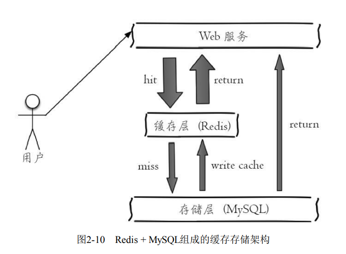

~~~java
UserInfo getUserInfo(long id){
    userRedisKey = "user:info:" + id
    value = redis.get(userRedisKey);
    UserInfo userInfo;
    if (value != null) {
    	userInfo = deserialize(value);
    } else {
        // 如果不在Redis中，那么从MySQL中读取，并且在Redis中设置
        userInfo = mysql.get(id);
        if (userInfo != null)
        redis.setex(userRedisKey, 3600, serialize(userInfo));
    }
    return userInfo;
}
~~~

作为缓存层时，推荐将Key命名为`业务名:对象名:id:[属性]`。例如MySQL的数据库名为 vs，用户表名为user，那么对应的键可以用`vs:ser:1`或者`vs:user:1:name`来表示。

## 安装

~~~shell
$ wget http://download.redis.io/releases/redis-3.0.7.tar.gz
$ tar xzf redis-3.0.7.tar.gz
$ ln -s redis-3.0.7 redis
$ cd redis
$ make

# 是将Redis的相关运行文件放到/usr/local/bin/下，这样就可以在任意目录下执行Redis的命令
$ make install
~~~

**真正的Redis数据库操作发生在RedisServer中，而RedisClient仅仅负责与RedisServer进行通信而已。**

通过redis-server命令来启动Redis服务端。

~~~shell
$ redis-server
~~~

Redis的默认端口是6379。如果要用6380作为端口启动Redis，那么可以执行：

~~~shell
$ redis-server --port 6380
~~~

`redis-server`默认会读取`Redis`安装根目录下的`redis.conf`配置文件。如果想要使用其他配置文件，那么输入以下命令：

~~~shell
$ redis-server /opt/redis/redis.conf
~~~

注意，redis-server会忽略掉SIGHUP信号，也就是说即使退出终端，Redis也会在后台运行。

通过`redis-cli`命令来启动Redis客户端：

- 交互式方式。通过`redis-cli-h{host}-p{port}`的方式连接到Redis 服务，之后所有的操作都是通过交互的方式实现，不需要每次都输入redis-cli
- 命令方式用`redis-cli-h ip{host}-p{port}{command}`就可以直 接得到命令的返回结果

注意，如果没有-h参数，那么默认连接127.0.0.1；如 果没有-p，那么默认6379端口。

客户端通过shutdown命令来结束Redis服务端：

~~~shell
$ redis-cli shutdown
~~~

不建议使用用`kill-9`强制结束Redis服务端。因为这种方式不仅不会做持久化操作，还会造成缓冲区等资源不能被优雅关闭，极端情况下会造成AOF和复制丢失数据的情况。

## 全局命令

> 更多命令请见 键管理 一节

- **查看所有键**

  ~~~shell
  $ keys *
  ~~~

- **获取键总数**，dbsize命令会返回当前数据库中键的总数，时间复杂度为`O(1)`，而keys命令会遍历所有键，所以它的时间复杂度是O（n）

  ~~~shell
  $ dbsize
  ~~~

- **检查键是否存在**

  ~~~shell
  exists key
  ~~~

  如果键存在则返回1，不存在则返回0

- **删除键**

  ~~~shell
  $ del key [key ...]
  ~~~

  返回结果为成功删除键的个数

- **键过期**，Redis支持对键添加过期时间，当超过过期时间后，会自动删除键。

  ~~~shell
  $ expire key seconds
  ~~~

- **查看过期时间**

  ~~~shell
  $ ttl hello
  ~~~

  ttl命令会返回键的剩余过期时间，它有3种返回值： 

  - 大于或等于0的整数：键剩余的过期时间。 

  - -1：键没设置过期时间。 

  - -2：键不存在

- **查看键的数据结构类型**

  ~~~shell
  $ type key
  ~~~

  如果键不存在，则返回none

- **查看键的内部编码**：

  ~~~shell
  $ object encoding mylist
  ~~~
  
  每个键的数据结构类型都由各自的内部编码实现。这些不同的内部编码为了就是应对不同的负载场景，而且修改内部编码，而对外的数据结构和命令没有影响。
  
  
  

## 原理初步

Redis使用了「**单线程架构**」和「**I/O多路复用模型**」来实现高性能的内存数据库服务。

需要强调的是，Redis只有CPU计算部分是单线程模型，而对磁盘、网络的访问是多线程模型。

Redis为什么采用单线程模型：

- Redis性能瓶颈在IO上，而不是在CPU上。而且服务器的体系架构一般是多核共享一块内存（MCU）。此时多线程技术并不能提高CPU访问内存的效率。如果是多个MCU架构的处理器，那么Redis在CPU利用率上有很大的提升空间。
- 单线程避免了线程切换和竞争条件所产生的消耗。

但是单线程对响应时间来说，是不友好的。例如一条命令的执行时间过长，那么就会阻塞其他命令的执行。

## 字符串

**创建一个字符串**

~~~shell
$ set key value [ex seconds] [px milliseconds] [nx|xx]
~~~

set命令有几个选项：

- ex seconds：为键设置秒级过期时间。
- px milliseconds：为键设置毫秒级过期时间。
- nx：键必须不存在，才可以设置成功
- xx：与nx相反，键必须存在，才可以设置成功，用于更新。

除了set选项，Redis还提供了setex和setnx两个命令：

~~~shell
$ setex key seconds value
$ setnx key value
~~~

它们的作用和ex和nx选项是一样的。

由于Redis的单线程命令处理机制，如果有多个客户端同时执行setnx key value， 根据setnx的特性只有一个客户端能设置成功，setnx可以作为分布式锁的一种实现方案，Redis官方给出了使用setnx实现分布式锁的方 法：http://redis.io/topics/distlock。

**获取值**

~~~shell
$ get key
~~~

**批量设置值**

~~~shell
$ mset key value [key value ...]
~~~

**批量获取值**

~~~shell
$ mget key [key ...]
~~~

批量操作可以减少客户端与服务端进行网络通信的次数，但是批量操作可能会在服务端阻塞其他命令的执行

**自增操作**

~~~shell
$ incr key
~~~

incr命令用于对值做自增操作，返回结果分为三种情况：

- 值不是整数，返回错误。(error) ERR value is not an integer or out of range

- 值是整数，返回自增后的结果。

- 键不存在，按照值为0开始自增。下面的qwe键是不存在的

  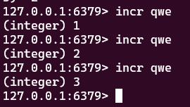

除了incr命令，Redis提供了decr（自减）、incrby（自增指定数字）、 decrby（自减指定数字）、incrbyfloat（自增浮点数）

**向字符串尾部追加值**

~~~shell
$ append key value
~~~

**获取字符串长度**

~~~shell
$ strlen key
~~~

**设置并返回原值**

~~~shell
$ getset key value
~~~

**设置指定位置的字符**

~~~shell
$ setrange key offeset value
~~~

偏移量从0开始计算

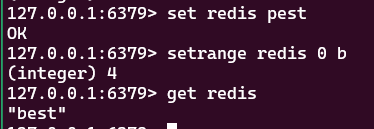

**获取子串**

~~~shell
$ getrange key start end
~~~

start和end分别是开始和结束的偏移量，偏移量从0开始计算

字符串命令的时间复杂度基本是是$\Omicron(1)$的，批量操作的时间复杂度是$\Omicron(k)$，其中$k$是键的个数。而`getrange`的时间复杂度是$\Omicron(n)$，其中$n$是子串的长度

字符串类型的内部编码有3种： 

- int：8个字节的长整型。 
- embstr：小于等于39个字节的字符串。 ·
- raw：大于39个字节的字符串。可以存储二进制串

## 哈希

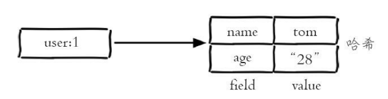

**设置值**

~~~shell
$ hset key field value
~~~

**获取值**

~~~shell
$ hget key field
~~~

如果键或field不存在，会返回nil

**删除field**

~~~shell
hdel key field [field...]
~~~

返回结果为成功删除field的个数。

**计算field个数**

~~~shell
$ hlen key
~~~

**批量设置或获取field-value**

~~~shell
$ hmget key field [field ...]
$ hmset key field value [field value ...]
~~~

**判断field/key是否存在**

~~~shell
$ hexists key field
~~~

**获取所有field**

~~~shell
$ hkeys key
~~~

**获取所有value**

~~~shell
$ hvals key
~~~

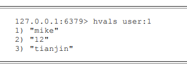

**获取所有的field-value**

~~~shell
$ hgetall key
~~~

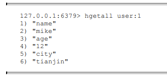

**增加操作**，增加键所对应的值

~~~shell
$ hincrby key field increnment_value
$ hincrbyfloat key field increnment_value
~~~

如果值的类型不符合条件，那么(error) ERR hash value is not an integer

**计算value的字符串长度**（需要Redis3.2以上）

~~~shell
$ hstrlen key field
~~~

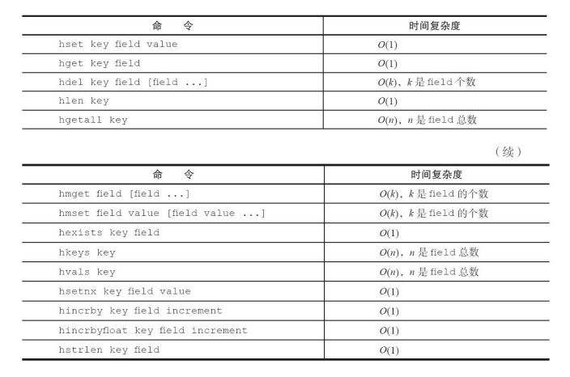

哈希类型的内部编码有两种： 

- **ziplist（压缩列表）**：当哈希类型元素个数小于`hash-max-ziplist-entries` 配置（默认512个）、同时所有值都小于`hash-max-ziplist-value`配置（默认64 字节）时，`Redis`会使用`ziplist`作为哈希的内部实现，ziplist使用更加紧凑的 结构实现多个元素的连续存储，所以在节省内存方面比`hashtable`更加优秀。 
- **hashtable（哈希表）**：当哈希类型无法满足`ziplist`的条件时，`Redis`会使 用`hashtable`作为哈希的内部实现

我们可以使用**「哈希类型」**来缓存**「关系型数据库表」**。

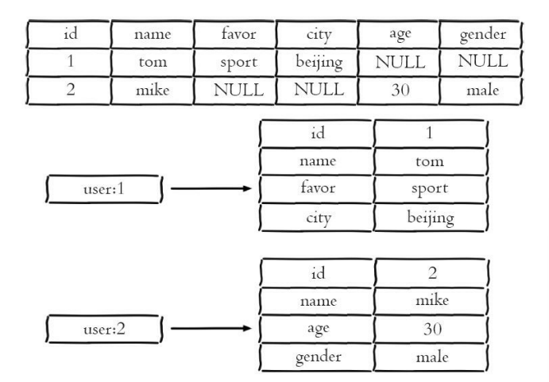

注意，Redis中的哈希可以不存储表中值为NULL的属性，这种特性称为**稀疏性**。

此外，还有两种方法来缓存关系型数据库表（都不推荐使用）

- **原生字符串类型**：为每一个属性设置一个键

  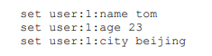

  这样简单直观，而但是数据内聚性比较差

- **序列化字符串类型**：用一个键来保存序列化后的数据。

  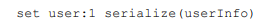

  序列化和反序列化有一定的开销，同时每次更新属性都需要把全 部数据取出进行反序列化，更新后再序列化到Redis中。

## 列表

列表（list）类型是用来存储多个有序的字符。在Redis中，可以对列表两端插入（push）和弹出（pop），而且列表中的元素可以是重复的

 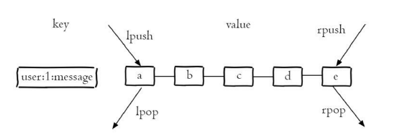

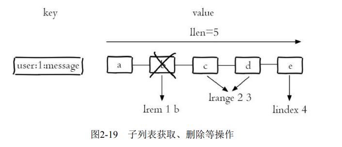

**从右边插入元素**：

~~~shell
$ rpush key value [value ...]
~~~

返回成功插入的元素个数。

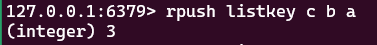

**范围获取元素**：

~~~shell
$ lrange key start end
~~~

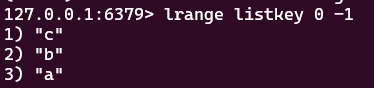

索引下标从左到右分别是0到N-1，但是从右到左分别是-1到-N。而且查询区间是左闭右闭的，这和大部分编程语言左闭右开的约定不同。

lrange命令在列表两端性能较好，但是如果列表较大，获取列表中间范围的元素性能会变差。此时可以使用Redis3.2的quicklist内部编码实现， 它结合ziplist和linkedlist的特点，可以高效完成获取「列表中间范围元素」的操作。

**向某个元素前或者后插入元素**：

~~~shell
$ linsert key before|after pivot value
~~~

这里的`privot`就是元素值，而value是新插入的元素值

 

**获取列表指定索引下标的元素**

~~~shell
$ lindex key index
~~~

**获取列表长度**

~~~shell
$ llen key
~~~

**从列表左侧弹出元素**

~~~shell
$ lpop key
~~~

**删除指定元素**

~~~shell
$ lrem key count value
~~~

lrem命令会从列表中找到等于value的元素进行删除，根据count的不同 分为三种情况： 

- `count>0`，从左到右，删除最多`count`个元素。 
- `count<0`，从右到左，删除最多`count`绝对值个元素。 
- `count=0`，删除所有。

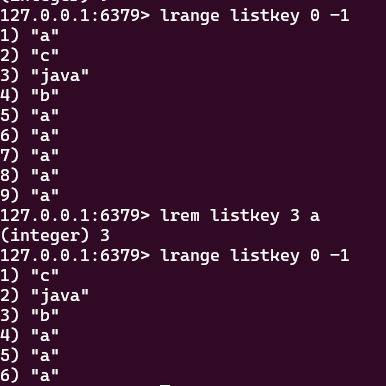

**按照索引范围保留列表**

~~~shell
$ ltrim key start end
~~~

**修改指定索引下标的元素：**

~~~shell
$ lset key index newValue
~~~

**阻塞操作**

~~~shell
$ blpop key [key ...] timeout
$ brpop key [key ...] timeout
~~~

- 如果是多个键，那么brpop会从左至右遍历键，一旦有一个键能弹出元素，客户端立即返回。这包括brpop被阻塞的情况
- 如果多个客户端对同一个键执行brpop，那么最先执行brpop命 令的客户端可以获取到弹出的值。

注意，这里的阻塞是指网络上的阻塞，而不是单线程中计算部分的阻塞

如果`timeout`为0，那么在弹出失败后则无限期等待。

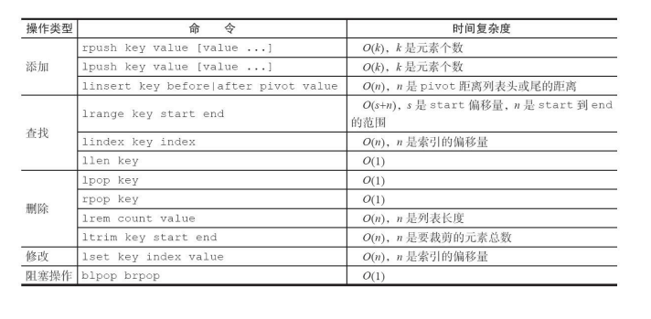

- **ziplist（压缩列表）**：当列表的元素个数小于list-max-ziplist-entries配置 （默认512个），同时列表中每个元素的值都小于list-max-ziplist-value配置时 （默认64字节），Redis会选用ziplist来作为列表的内部实现来减少内存的使用。
- **linkedlist（链表）**：当列表类型无法满足ziplist的条件时，Redis会使用 linkedlist作为列表的内部实现。

- lpush+lpop=Stack（栈） 
- lpush+rpop=Queue（队列） 
- lpsh+ltrim=Capped Collection（有限集合） 
- lpush+brpop=Message Queue（消息队列）

Redis的`lpush+brpop`命令组合即可实现阻塞队列，生产 者客户端使用`lrpush`从列表左侧插入元素，多个消费者客户端使用`brpop`命令 阻塞式的“抢”列表尾部的元素，

## 集合

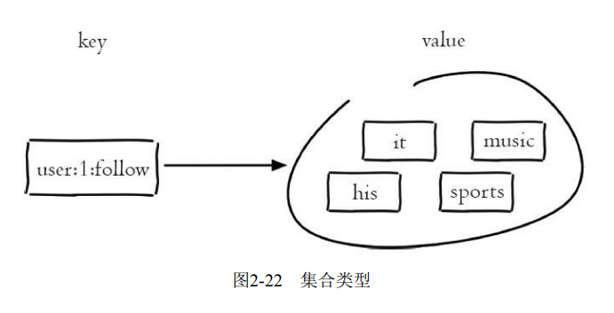

集合不支持重复元素，而且不支持列表的下标查询操作。

**添加元素**

~~~shell
$ sadd key element [element ...]
~~~

返回结果为添加成功的元素个数。

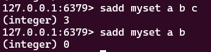

**删除元素**

~~~shell
$ srem key element [element ...]
~~~

**计算元素个数**

~~~shell
$ scard key
~~~

scard的时间复杂度为$\Omicron(1)$，它不会遍历集合所有元素，而是直接用 Redis内部的变量

**判断元素是否在集合中**

~~~shell
$ sismember key element
~~~

如果给定元素element在集合内返回1，反之返回0

**随机从集合返回指定个数元素**

~~~shell
$ srandmember key [count]
~~~

[count]是可选参数，如果不写默认为1，

**从集合随机弹出元素**

~~~shell
$ spop key
~~~

spop操作可以从集合中随机弹出一个元素

**获取所有元素**

~~~shell
$ smembers key
~~~

**求多个集合的交集**

~~~shell
$ sinter key [key ...]
~~~

**求多个集合的并集**

~~~shell
$ suinon key [key ...]
~~~

**求多个集合的差集**

~~~shell
$ sdiff key [key ...]
~~~

**将交集、并集、差集的结果保存**

~~~shell
$ sinterstore destination key [key ...]
$ suionstore destination key [key ...]
$ sdiffstore destination key [key ...]
~~~

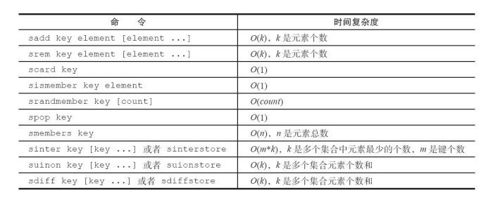

集合类型的内部编码有两种：

- **intset（整数集合）**：当集合中的元素都是整数且元素个数小于set-maxintset-entries配置（默认512个）时，Redis会选用intset来作为集合的内部实 现，从而减少内存的使用。
- **hashtable（哈希表）**：当集合类型无法满足intset的条件时，Redis会使 用hashtable作为集合的内部实现。

## 有序集合

它和普通集合一样不支持包含重复元素，但是它可以给每个元素设置一个**分数（score）**作为排序的依据。

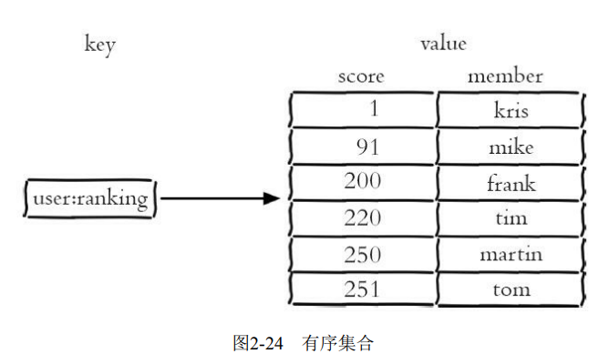

**添加成员**

~~~shell
zadd key score member [score member ...]
~~~

返回结果代表成功添加成员的个数。

Redis3.2为zadd命令添加了nx、xx、ch、incr四个选项： 

- nx：member必须不存在，才可以设置成功，用于添加。 
- xx：member必须存在，才可以设置成功，用于更新。 
- ch：返回此次操作后，有序集合元素和分数发生变化的个数 
- incr：对score做增加，相当于后面介绍的zincrby。

**获取成员个数**

~~~shell
$ zcard key
~~~

**获取某个成员的分数**

~~~shell
$ zscore key member
~~~

如果成员不存在则返回nil：

**获取成员的排名**

~~~shell
$ zrank key member
$ zrevrank key member
~~~

zrank是从分数从低到高返回排名，zrevrank反之。排名从0开始计算

**删除成员**

~~~shell
$ zrem key member [member ...]
~~~

**增加成员的分数**

~~~shell
$ zincrby key increment member
~~~

increment是一个整数值

**返回指定排名范围的成员**

~~~shell
$ zrange key start end [withscores]
$ zrevrange key start end [withscores]
~~~

如果加上`withscores`选项，则会返回成员的分数。

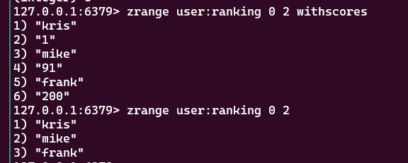

**返回指定分数范围的成员**

~~~shell
$ zrangebyscore key min max [withscores] [limit offset count]
$ zrevrangebyscore key max min [withscores] [limit offset count]
~~~

`[limit offset count]`选项可以限制输出的起始位置和个数：

同时，min和max还支持

- 开区间（小括号）和闭区间（中括号）
- -inf和 +inf分别代表无限小和无限大：

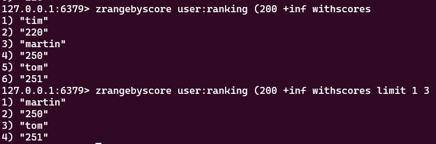

**返回指定分数范围成员个数**：

~~~shell
$ zcount key min max
~~~

**删除指定排名内的升序元素**

~~~shell
$ zremrangebyrank key start end
~~~

**删除指定分数范围的成员**:

~~~shell
$zremrangebyscore key min max
~~~

**获取交集**

~~~ shell
$ zinterstore destination numkeys key [key ...] [weights weight [weight ...]] [aggregate sum|min|max]
~~~

- destination：交集计算结果保存到这个键。
- numkeys：需要做交集计算键的个数。
- key[key...]：需要做交集计算的键
- weights weight[weight...]：每个键的权重，在做交集计算时，每个键中 的每个member会将自己分数乘以这个权重，每个键的权重默认是1。
- 计算成员交集后，分值可以按照sum（和）、 min（最小值）、max（最大值）做汇总，默认值是sum

**获取并集**

~~~shell
$ zunionstore destination numkeys key [key ...] [weights weight [weight ...]]
[aggregate sum|min|max]
~~~

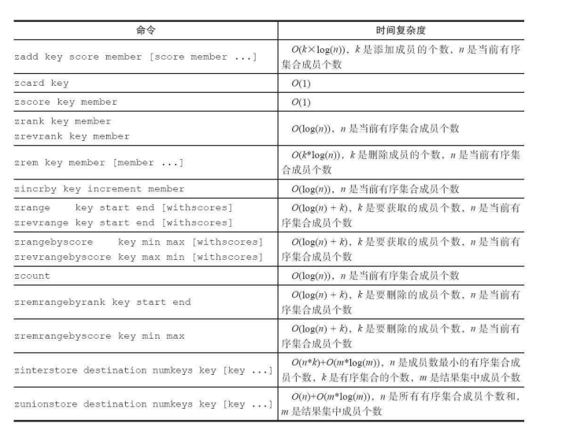

有序集合类型的内部编码有两种：

- **ziplist（压缩列表）**：当有序集合的元素个数小于zset-max-ziplistentries配置（默认128个），同时每个元素的值都小于zset-max-ziplist-value配 置（默认64字节）时，Redis会用ziplist来作为有序集合的内部实现，ziplist 可以有效减少内存的使用。
- **skiplist（跳跃表）**：当ziplist条件不满足时，有序集合会使用skiplist作 为内部实现，因为此时ziplist的读写效率会下降。

## 键管理

前面已经介绍过一些重要命令了，例如：type、del、object、exists、expire

**键重命名**

~~~shell
$ rename key newkey
~~~

如果键重命名为一个已有名字的键，那么就会覆盖该值。

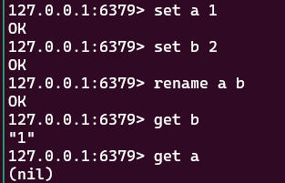

为了防止被强行rename，Redis提供了`renamenx`命令，确保只有newKey 不存在时候才被覆盖

随机返回一个键：

~~~shell
$ randomkey
~~~

### 过期时间

除了expire、ttl命令以外，Redis还提供了 expireat、pexpire、pexpireat、pttl、persist等一系列命令来处理键值对的过期时间。

ttl命令和pttl都可以查询键的剩余过期时间，但是pttl精度更高可以达到 毫秒级别，有3种返回值： 

- 大于等于0的整数：键剩余的过期时间（ttl是秒，pttl是毫秒）。 
- -1：键没有设置过期时间。 
- -2：键不存在。

expireat命令可以设置键的秒级过期时间戳，例如如果需要将键hello在 2016-08-0100：00：00（秒级时间戳为1469980800）过期，可以执行如下操作：

~~~shell
$ expireat hello 1469980800
~~~

如果过期时间为负值，键会立即被删除，犹如使用del命令一样：

除此之外，Redis2.6版本后提供了毫秒级的过期方案： 

- pexpire key milliseconds：键在milliseconds毫秒后过期。 
- pexpireat key milliseconds-timestamp键在毫秒级时间戳timestamp后过 期。

但无论是使用过期时间还是时间戳，秒级还是毫秒级，在Redis内部最 终使用的都是pexpireat。

`PERSIST`：此命令用来移除给定 key 的过期时间，使得 key 永不过期。

对于字符串类型键，执行set命令会移除过期时间。但是对于`LPUSH` (List)、 `SADD` (Set)、 `ZADD` (Sorted Set) 或者 `HSET` (Hash) ，这些操作不会影响键的过期时间。

如下是Redis源码中，set命令的函数setKey，可以看到最后执行了 removeExpire（db，key）函数去掉了过期时间：

~~~c
void setKey(redisDb *db, robj *key, robj *val) {
    if (lookupKeyWrite(db,key) == NULL) {
    	dbAdd(db,key,val);
    } else {
    	dbOverwrite(db,key,val);
    }
    incrRefCount(val);
    // 去掉过期时间
    removeExpire(db,key);
    signalModifiedKey(db,key);
}
~~~

### 迁移

有时候我们只想把部分数据由一个Redis迁 移到另一个Redis（例如从生产环境迁移到测试环境）。Redis提供了move、dump+restore、migrate三组迁移键的方法：

- **move**

  ~~~shell
  $ move key db
  ~~~

  Redis内部可以有多个数据库，该命令正是在这些数据库中进行迁移。move key db就是把指定的键从源数据库移动到目标数据库中。

- **dump + restore**

  dump+restore可以实现在不同的Redis实例之间进行数据迁移的功能，整 个迁移的过程分为两步：
  
  1. 在源Redis上，dump命令会将键值序列化，格式采用的是RDB格式。
  
     ~~~shell
     $ set hello world
     # OK
     $ dump hello
     # "\x00\x05world\x06\x00\x8f<T\x04%\xfcNQ"
     ~~~
  
     
  
  2. 在目标Redis上，`restore key ttl value`命令将上面序列化的值进行复原，其中ttl参数代表过期时间，如果ttl=0代表没有过期时间。
  
     ~~~shell
     $ get hello
     # (nil)
     $ restore hello 0 "\x00\x05world\x06\x00\x8f<T\x04%\xfcNQ"
     # OK
     $ get hello
     # "world"
     ~~~
  
  整个迁移过程并非原子性 的，而是通过客户端分步完成的。
  
- **migrate**：实现过程和dump+restore基本类似，但整个过程是原子执行的
  
  ~~~shell
  $ migrate host port key|"" destination-db timeout [copy] [replace] [keys key [key
  ~~~
  
  - `host`：目标Redis的IP地址
  - `port`：目标Redis的端口
  - `key|""`：在Redis3.0.6版本之前，migrate只支持迁移一个键，所以此处是 要迁移的键，但Redis3.0.6版本之后支持迁移多个键，如果当前需要迁移多 个键，此处为空字符串""
  - `destination-db`：目标Redis的数据库索引，例如要迁移到0号数据库，这里就写0
  - `timeout`：迁移的超时时间
  - `[copy]`：如果添加此选项，迁移后并不删除源键
  - `[replace]`：如果添加此选项，migrate不管目标Redis是否存在该键都会 正常迁移进行数据覆盖。如果没有添加该选项，而且目标Redis有该键，那么就会返回错误提示
  - `[keys key[key...]]`：迁移多个键，例如要迁移key1、key2、key3，此处填 写“keys key1 key2 key3”

### 遍历键

**全量遍历键**

~~~shell
$ keys pattern
~~~

其中，`pattern`是`glob`风格的通配符

- `*` 代表匹配任意字符
- `?`  代表匹配一个字符
- `[]` 代表匹配部分字符
- \x用来做转义，例如要匹配星号、问号需要进行转义

想删除所有以video字符串开头的键，可以 执行如下操作：

~~~shell
$ redis-cli keys video* | xargs redis-cli del
~~~

如果Redis包含了 大量的键，执行keys命令很可能会造成Redis阻塞，所以一般建议不要在生产环境下使用keys命令。如果确实又该需求该怎么办？

- 使用scan命令，渐进式遍历所有键
- 在一个不对外提供服务的Redis从节点上执行，这样不会阻塞到客户端 的请求，但是会影响到主从复制

scan采用渐进式遍历 的方式来解决keys命令可能带来的阻塞问题，每次scan命令的时间复杂度是$\Omicron(1)$。但是要真正实现keys的功能，需要执行多次scan。Redis存储键值对 实际使用的是hashtable的数据结构，其简化模型如图2-29所示。

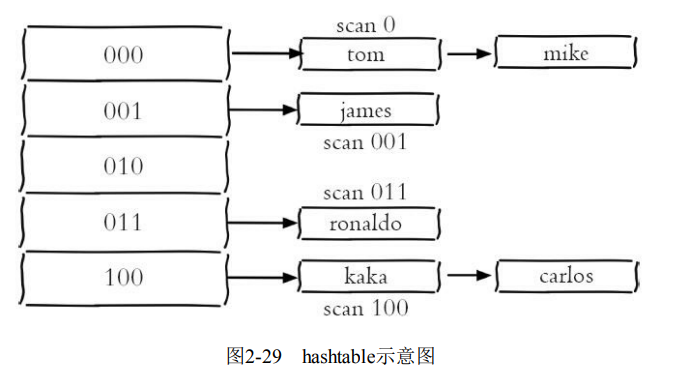

~~~shell
$ scan cursor [match pattern] [count number]
~~~

- cursor是必需参数，实际上cursor是一个游标。第一次遍历从0开始，每次scan遍历完都会返回当前游标的值，直到游标值为0，表示遍历结束。游标值并不与key的个数对应。

  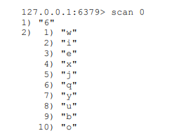

  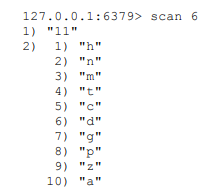

  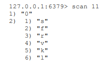

- match pattern类似keys命令的pattern

- count number是可选参数，它的作用是表明每次要遍历的键个数，默认值是10

除了scan以外，Redis提供了面向哈希类型、集合类型、有序集合的扫描遍历命令，解决诸如`hgetall`、`smembers`、`zrange`可能产生的阻塞问题，对应的命令分别是`hscan`、`sscan`、`zscan`

如果在多次scan的过程中如果有键的变化（增加、删除、修改），那么这些变化可能被scan忽略掉。也就是说scan并不能保证完整的遍历出来所有的键，这些是 我们在开发时需要考虑的。

### 数据库管理

**切换数据库**

~~~shell
$ select dbIndex
~~~

Redis默认配置中是有16个数据库，客户端默认使用0号数据库。我们很自然地想将生产环境中的数据放在0号数据库，测试环境中的数据放在1号数据库？但是这样做真的欠妥吗？

Redis3.0中已经逐渐弱化这个功能，例如Redis的分布式实现Redis Cluster只允许使用0号数据库，只不过为了向下兼容老版本的数据库功能， 该功能没有完全废弃掉。

- Redis是单线程的。如果使用多个数据库，那么这些数据库仍然是使用一个CPU，彼此之间还是会受到影响的。
-  假如有一个慢查询存在，依然会影响其他数据库，这样会使得别的业务方定位问题非常的困难。

如果要使用多个数据库功能，完全可以在一台机器上部署多个 Redis实例，彼此用端口来做区分，因为现代计算机或者服务器通常是有多 个CPU的。这样既保证了业务之间不会受到影响，又合理地使用了CPU资源。

flushdb/flushall命令用于清除数据库，两者的区别的是flushdb只清除当 前数据库，flushall会清除所有数据库。

## 慢查询分析

Redis提供了慢查询分析功能，所谓慢查询日志就是系统在命令执行前后计算每条命令的执行时间，当超过预设阀值，就将这条命令的相关信息记录下来。

在Redis中，慢查询记录有4个属性组成，分别是

- 慢查询日志的标识id
- 发生时间戳
- 命令耗时
- 所执行的命令。

Redis客户端执行一条命令分为如下4个部分：发送命令、排队、执行命令、返回结果

 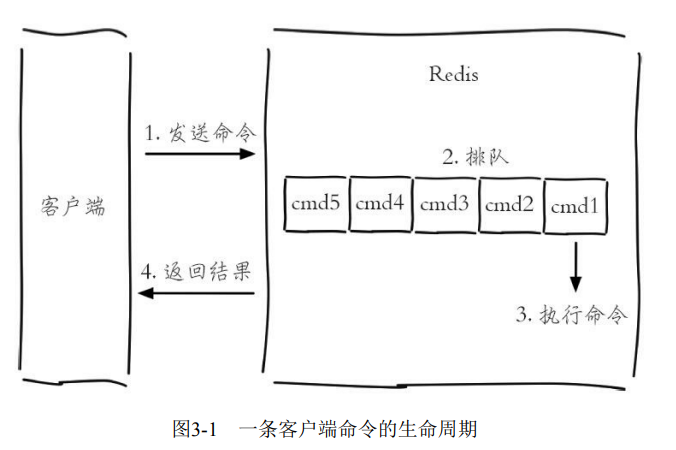

注意，慢查询只统计步骤3）的时间。也就是说，慢查询只记录命令执行时间，并不包括命令排队和网络传输时间。

`slowlog-log-slower-than`预设阀值，单位为微秒，默认值是10000（10ms）。`slowlog-log-slower-than=0`会记录所有的命令，`slowlog-log-slowerthan<0`对于任何命令都不会进行记录。

`slowlog-max-len`说明了慢查询日志最多存储多少条。

在Redis中有两种修改配置的方法

- 修改配置文件

- `config set`命令动态修改

  ~~~shell
  $ config set slowlog-log-slower-than 20000
  $ config set slowlog-max-len 1000
  $ config rewrite
  ~~~

  如果要`Redis`将配置持久化到本地配置文件，需要执行`config rewrite`命令

**获取慢查询日志**

~~~shell
$ slowlog get [n]
~~~

可选参数`n`可以指定条数

**获取慢查询日志列表当前的长度**

~~~shell
$ slowlog len
~~~

**慢查询日志重置**

~~~shell
$ slowlog reset
~~~

## Redis Shell

### 客户端

- `-r`（repeat）选项代表将命令执行多次

  ~~~shell
  $ redis-cli -r 3 ping
  ~~~

- `-i`（interval）选项代表每隔几秒执行一次命令，必须配合`-r`选项使用

  ~~~shell
  $ redis-cli -r 5 -i 1 ping
  ~~~

  注意-i的单位是秒，是如果想以每隔10毫秒执行 一次，可以用`-i 0.01`

- `-x`选项表示从标准输入（stdin）中所读取的数据作为redis-cli的最后一个参数

  ~~~shell
  $ echo "world" | redis-cli -x set hello
  ~~~

- `-c`（cluster）选项是连接Redis Cluster节点时需要使用的，以后再介绍

- `-a`（auth）选项用于输入密码（如果有的话）

- `--slave`选项指定当前Redis客户端为从节点

- `--rdb`选项与持久化有关，以后再介绍

- `--pipe`选项发送批量命令

- `--bigkeys`选项，使用scan命令对Redis的键进行采样，从中找到内存占用比较大的键值

- `--eval`选项，用于执行指定Lua脚本

- `--latency`选项，用于检测网络延迟

  - `--latency`：该选项可以测试客户端到目标Redis的网络延迟

    ~~~shell
    $ redis-cli -h {machineB} --latency
    ~~~

    

  - `--latency-history`：周期性地（默认每15秒）测试从Redis服务器接收到回应的延迟

    ~~~shell
    $ redis-cli -h 10.10.xx.xx --latency-history
    min: 0, max: 1, avg: 0.28 (1330 samples) -- 15.01 seconds range…
    min: 0, max: 1, avg: 0.05 (1364 samples) -- 15.01 seconds range
    
    ~~~

    延时信息默认每15秒输出一次，可以通过-i参数控制间隔时间。

  - `--latency-dist`,使用统计图表的形式从控制台输出延迟统计信息。
  
- `--stat`选项，可以实时获取Redis的重要统计信息

  

- `--raw`返回原始格式

  可以看到如果正常执行get或者使用--no-raw选项，那么返回的结果是二进制格 式

  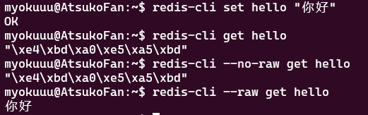

### 服务端

`redis-server`还有一个`--test-memory`选项，用来检测当前操作系统能否稳定地分配指定容量的内存给 Redis

~~~shell
$ redis-server --test-memory 1024
# 检测当前操作系统能否提供1G的内存给Redis
~~~

整个内存检测的时间比较长。当输出`passed this test`时说明内存检测完毕。

### 性能测试

`redis-benchmark`可以为Redis做基准性能测试

- `-c`（clients）选项代表客户端的并发数量（默认是50）

- `-n`（num）选项代表客户端请求总量（默认是100000）

  `redis-benchmark -c 100 -n 20000`代表100个客户端同时请求Redis，每个客户端请求20000次。

  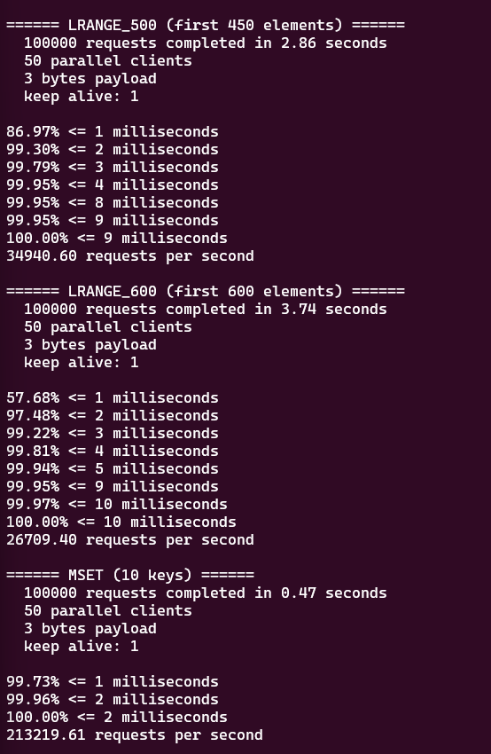

- `-q`选项表示仅显示redis-benchmark的requests per second信息

  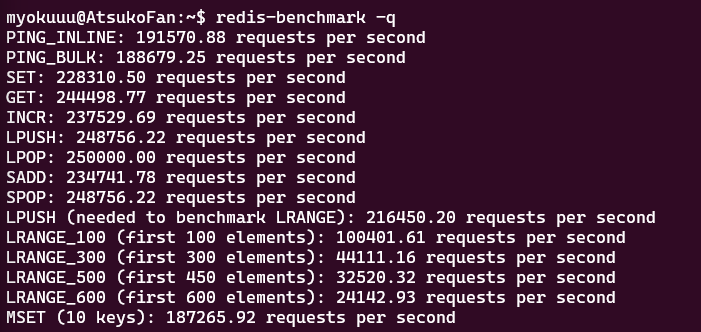

- -r，表示使用随机key数量。

## Pipeline

Redis提供了几条批量操作命令（例如mget、mset等），但是大部分命令是不支持批量操作的。好在我们可以通过 `redis-cli --pipe`来解决这个问题

~~~shell
# 这里的格式为RESP
$ echo -en '*3\r\n$3\r\nSET\r\n$5\r\nhello\r\n$5\r\nworld\r\n*2\r\n$4\r\nincr\r\
n$7\r\ncounter\r\n' | redis-cli --pipe
~~~

我们之后介绍如何通过Java的Redis客户端Jedis来使用Pipeline功能。

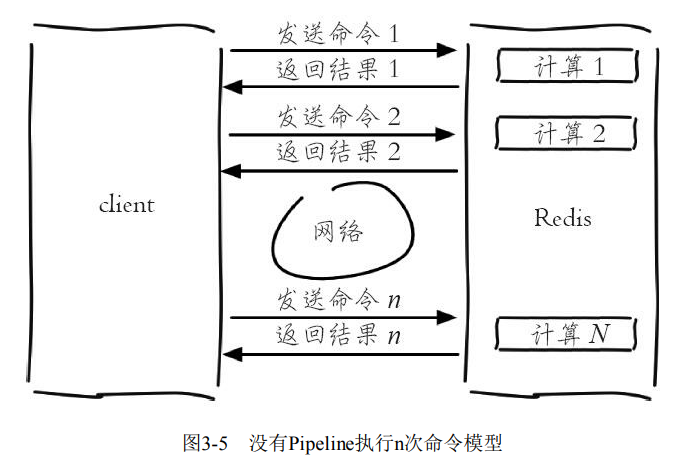

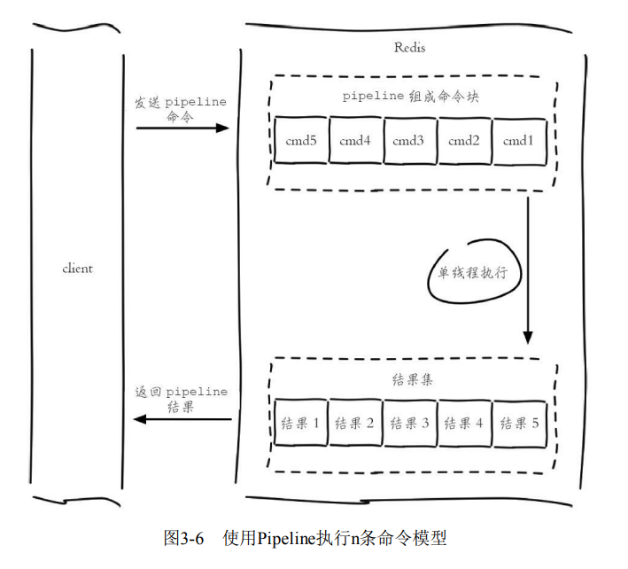

Pipeline和原生批量命令（mset）还是有所区别的，即原生批量命令是原子的，Pipeline是非原子的。

## 事务与Lua

为了保证多条命令组合的原子性，Redis提供了简单的事务功能以及集成Lua脚本来解决这个问题。

Redis提供了简单的事务功能，将一组需要一起执行的命令放到`multi`和`exec`两个命令之间。`multi`命令代表事务开始，`exec`命令代表事务提交，它们之间的命令是原子顺序执行的。

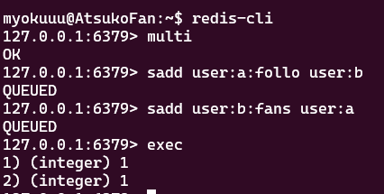

可以看到`sadd`命令此时的返回结果是`QUEUED`，代表命令并没有真正执行，而是暂时保存在Redis中，直到指定`exec`命令。

如果要主动回滚事务，可以使用`discard`命令

以下几种情况会回滚事务

- **命令错误**（语法错误），例如将`set`写成了`sett`，此时会回滚事务

- **运行时错误**，例如对集合使用`zadd`命令，此时整个事务都会被提交执行。此时并不能进行回滚了

  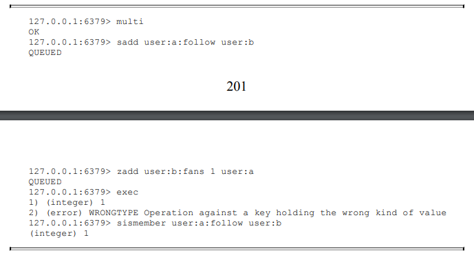

有些应用场景需要在提交事务之前，确保事务中的key没有被其他客户端修改过，才执行事务，否则不执行（类似乐观锁）。Redis提供了`watch`命令来解决这类问题。

一个简单的例子

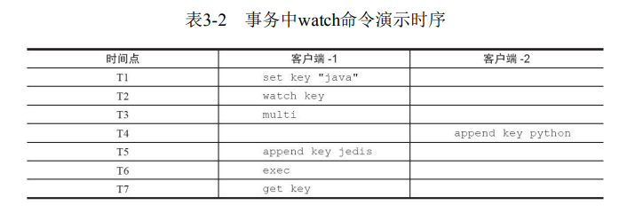

Lua语言是在1993年由巴西一个大学研究小组发明，其设计目标是作为 嵌入式程序移植到其他应用程序，它是由C语言实现的。它的应用场景如下：

- 暴雪公司将Lua语言引入到“魔兽世界”这款游戏中
- Web服务器Nginx 将Lua语言作为扩展

Lua语言提供了如下几种数据类型：booleans（布尔）、numbers（数 值）、strings（字符串）、tables（表格）

~~~lua
-- local定义一个局部变量
local strings val = "world"

-- tables类型可以模拟， 下标从1开始
local tables myArray = {"redis", "jedis", true, 88.0}
myArray[3]

-- 获取数组的长度
 #myArray

-- tables类型也可以模拟hash
local tables user_1 = {age = 28, name = "tome"}
print("user_1 age is " .. user_1["age"])
~~~

在Lua语言中，for语句有两种形式：数值for循环和范围for循环。

- **范围for循环**

  ~~~lua
  for var=start, stop, step do
    -- statements to be repeated
  end
  ~~~

  其中，`var` 为变量，`start` 是变量的初始值，`stop` 是变量的结束值，`step` 是变量的变化值。如果省略，则默认为1

- **范围for循环**

  ~~~lua
  -- myArray、user_1都是表
  for index,value in ipairs(myArray)
  do
      print(index)
      print(value)
  end
  
  for key, value in pairs(user_1)
  	-- .. 用于拼接字符串
  	do print(key .. value)
  end
  ~~~

**while语句**

~~~lua
local int sum = 0
local int i = 0
while i <= 100
do
    sum = sum +i
    i = i + 1
end
--输出结果为5050

~~~

`if else`语句

~~~lua
local tables myArray = {"redis", "jedis", true, 88.0}
for i = 1, #myArray
do
    if myArray[i] == "jedis"
    then
        print("true")
        break
    else
        --do nothing
    end
end
~~~

函数定义

~~~lua
function contact(str1, str2)
	return str1 .. str2
end

print(contact("hello ", "world"))
~~~

在Redis中执行Lua脚本有两种方法：

- `eval`：

  ~~~shell
  eval 脚本内容 key个数 key列表 参数列表
  ~~~

  其中key列表传递给KEYS[ ]，而参数列表传递给`VALUE[ ]`

  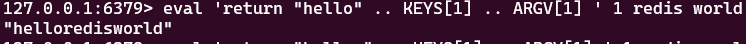

  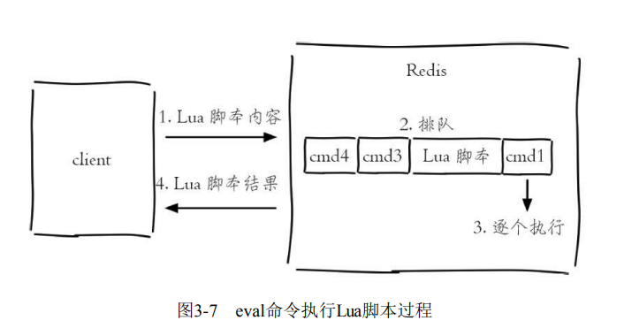

- `evalsha`：首先要将Lua脚本加载到Redis服务端，得到该脚本的SHA1校验和。 evalsha命令使用SHA1作为参数直接执行对应Lua脚本，避免每次发送 Lua脚本的开销

  ~~~shell
  $ evalsha 脚本SHA1值 key个数 key列表 参数列表
  ~~~

  

  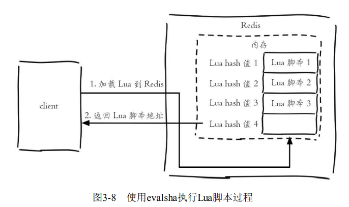

  其中，使用`script load`命令将脚本内容加载到Redis内存中

  ~~~shell
  $ redis-cli script load "$(cat lua_get.lua)"
  "7413dc2440db1fea7c0a0bde841fa68eefaf149c"
  ~~~

  ~~~shell
  $ evalsha 7413dc2440db1fea7c0a0bde841fa68eefaf149c 1 redis world
  ~~~

Lua可以使用redis.call函数实现对Redis的访问

~~~lua
redis.call("set", "hello", "world")
redis.call("get", "hello")
~~~

- Lua脚本在Redis中是原子执行的，执行过程中间不会插入其他命令
- Lua脚本可以将多条命令一次性打包，有效地减少网络开销
- Lua脚本可以帮助开发和运维人员创造出自己定制的命令

Redis提供了4个命令实现对Lua脚本的管理

- **script load**：将Lua脚本加载到Redis内存中

- **script exists**：用于判断sha1是否已经加载到Redis内存中

  ~~~shell
  script exists a5260dd66ce02462c5b5231c727b3f7772c0bcc5
  ~~~

- **script flush**：用于清除所有在Redis内存中加载的Lua脚本

  ~~~shell
  script flush
  ~~~

- **script kill**：杀掉正在执行的Lua脚本

  Redis提供了一个lua-time-limit参数，默认是5s。当脚本运行时间超过参数预设的值后，Server会向所有客户端发送BUSY信号，但是并不会终止脚本的执行。

  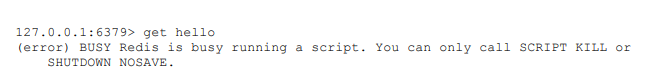

  此时使用`script kill`命令即可。如果当前Lua脚本正在执行写操作（调用Redis函数），那么script kill将不会生效。

## Bitmaps

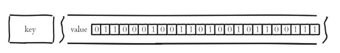

**设置值**

~~~shell
$ setbit key offset value

# 例子，偏移量从0开始
$ setbit unique:users:2016-04-05 0 1
~~~

**获取值**

~~~shell
$ gitbit key offset
~~~

**获取Bitmaps指定范围值为1的个数**

~~~shell
bitcount [start][end]
~~~

位运算

~~~shell
$ bitop op destkey key[key....]
~~~

op可以取值为`and`、`or`、`not`、`xor`，并将计算结果保存在`destkey`中，`destkey`并不参与运算。

计算Bitmaps中第一个值为targetBit的偏移量

~~~shell
$ bitpos key targetBit [start] [end]

# 例子
 bitpos unique:users:2016-04-04 1 
~~~

## HyperLogLog

HyperLogLog是一种用于高性能基数统计的算法。在 Redis 里面，每个 HyperLogLog 键最多需要花费 12 KB 内存。基数估计的结果是一个带有 **0.81% 标准错误**（standard error）的近似值。

`pfadd`用于向HyperLogLog添加元素，如果添加成功返回1：

~~~shell
$ pfadd key element [element …]

# 例子
$ pfadd 2016_03_06:unique:ids "uuid-1" "uuid-2" "uuid-3" "uuid-4"
~~~

**计算独立用户数**

~~~shell
$ pfcount key [key …]

# 在这个例子中， PFCOUNT 命令会分别计算key1 和 key2 的基数估计值，然后将这两个估计值相加，返回最后的结果。
$ PFCOUNT key1 key2
~~~

**合并**

pfmerge可以求出多个HyperLogLog的并集并赋值给destkey

~~~shell
$ pfmerge destkey sourcekey [sourcekey ...]
~~~

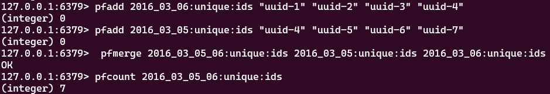

## 发布订阅

Redis提供了基于“发布/订阅”模式的消息机制。发布者客户端向指定的**频道（channel）**发布消息，订阅该频道的每个客户端都可以收到该消息。

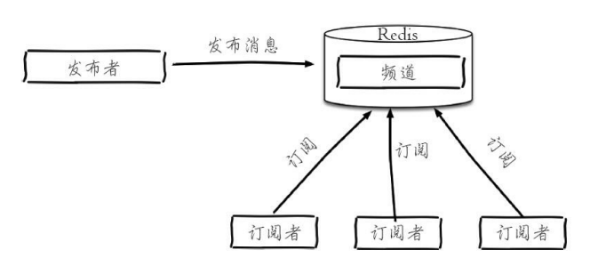

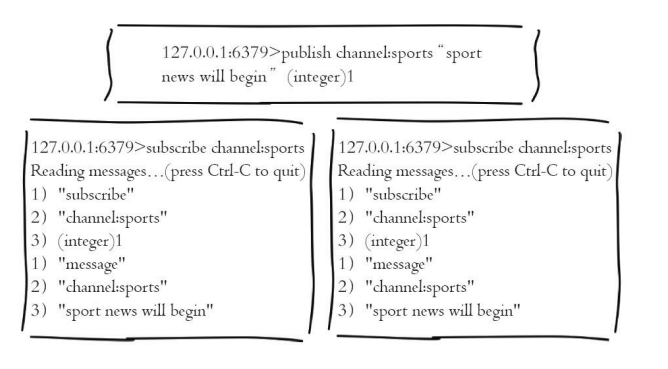

**发布消息**

~~~shell
$ publish channel message

# 例子
$ publish channel:sports "Tim won the championship"
~~~

**订阅消息**

~~~shell
$ subscribe channel [channel ...]

# 例子
$ subscribe channel:sports
~~~

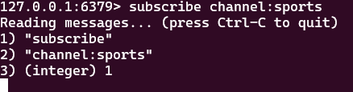

客户端在执行订阅命令之后进入了订阅状态，只能使用`subscribe`、 `psubscribe`、`unsubscribe`、`punsubscribe`的四个命令。

UNSUBSCRIBE命令的行为和SUBSCRIBE命令的行为正好相反，当一个客户端退订某个或某些频道的时候，服务器将从pubsub_channels中解除客户端与被退订频道之间的关联：

**按照模式订阅和取消订阅**

~~~shell
$ psubscribe pattern [pattern...]
$ punsubscribe [pattern [pattern ...]]
~~~

- 使用punsubscribe只能退订通过psubscribe命令订阅的规则，不会影响直接通过subscribe命令订阅的频道；同样unsubscribe命令也不会影响通过psubscribe命令订阅的规则。另外需要注意punsubscribe命令退订某个规则时不会将其中的通配符展开，而是进行严格的字符串匹配，所以`punsubscribe *` 无法退订`c*`规则，而是必须使用`punsubscribe c*`才可以退订。
- 如果punsubscribe命令没有参数，则会退订所有规则。
- 使用psubscribe命令可以重复订阅同一个频道，如客户端执行了`psubscribe c? c?*`。这时向c1发布消息客户端会接受到两条消息，而同时publish命令的返回值是2而不是1。

**查看活跃的频道**

~~~shell
$ pubsub channels [pattern]
~~~

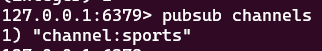

**查看频道订阅数**

~~~shell
pubsub numsub [channel ...]

~~~

## GEO

Redis3.2版本提供了GEO（地理信息定位）功能，支持存储地理位置信息

**设置键**

~~~shell
$ geoadd key longitude latitude member [longitude latitude member ...]

$ geoadd cities:locations 116.28 39.55 beijing
~~~

`longitude`、`latitude`、`member`分别是该地理位置的经度、纬度、成员

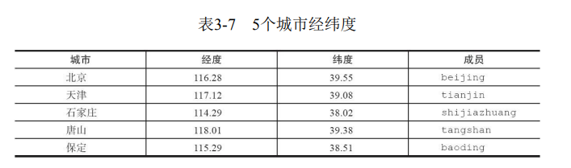

**获取地理位置信息**

~~~shell
$ geopos key member [member ...]
~~~

**获取两个地理位置的距离**

~~~shell
$ geodist key member1 member2 [unit]
~~~

其中unit代表返回结果的单位，包含以下四种：

- m（meters）
- km（kilometers）
- mi（miles）
- ft（feet）

**获取指定位置范围内的地理信息位置集合**

~~~shell
$ georadius key longitude latitude radiusm|km|ft|mi [withcoord] [withdist]
[withhash] [COUNT count] [asc|desc] [store key] [storedist key]

$ georadiusbymember key member radiusm|km|ft|mi [withcoord] [withdist]
[withhash] [COUNT count] [asc|desc] [store key] [storedist key]
~~~

`georadius`和`georadiusbymember`两个命令的作用是一样的，都是以一个地理位置为中心算出指定半径内的其他地理信息位置，不同的是`georadius`命令的通过具体的经纬度来给出中心，`georadiusbymember`只需给出成员即可。

- withcoord：返回结果中包含经纬度。
- withdist：返回结果中包含离中心节点位置的距离。
- withhash：返回结果中包含geohash。
- COUNT count：指定返回结果的数量。
- asc|desc：返回结果按照离中心节点的距离做升序或者降序。
- store key：将返回结果的地理位置信息保存到指定键。
- storedist key：将返回结果离中心节点的距离保存到指定键。

store key以及storedist key所对应的键类型是有序集合（zset）

Redis使用geohash [3]将二维经纬度转换为一维字符串

~~~shell
$ geohash key member [member ...]
~~~

GEO的数据类型为zset，Redis将所有地理位置信息的geohash存放在zset中

**删除地理位置信息**

~~~shell
zrem key member
~~~

