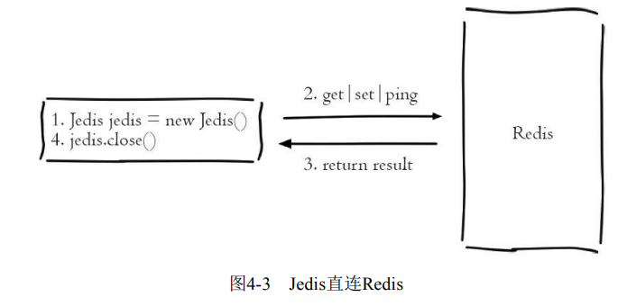
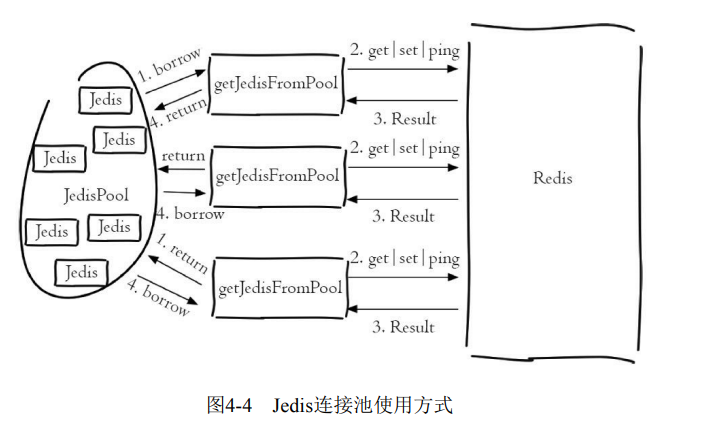
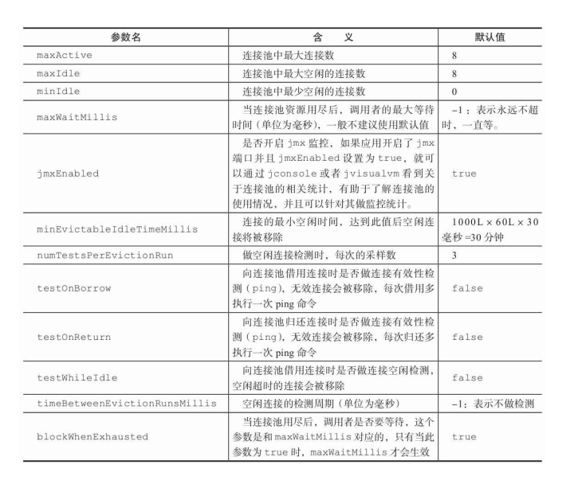
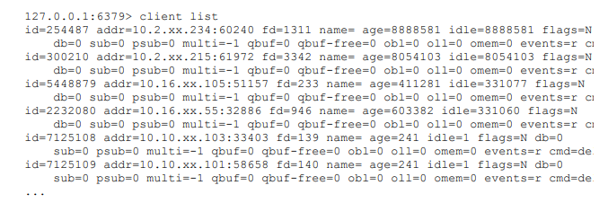
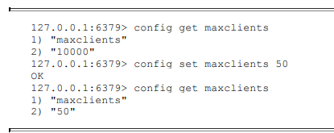
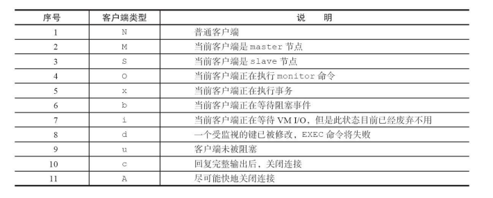
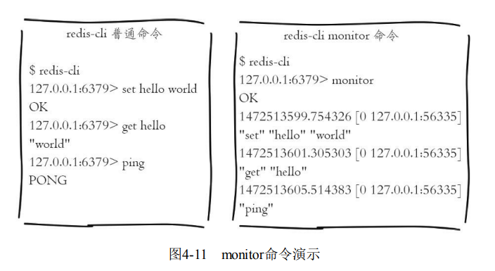
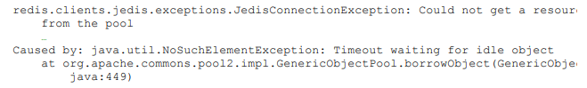
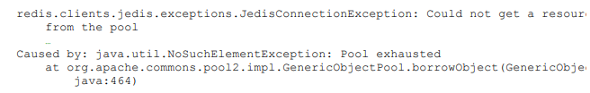

# 客户端

## 协议格式

Redis制定了**RESP（REdis Serialization Protocol，Redis序列化协议）**来实现客户端与服务端的交互。

RESP的规定一条请求命令的格式如下，CRLF代表"\r\n"。

~~~resp
*<参数数量> CRLF
$<参数1的字节数量> CRLF
<参数1> CRLF
...
$<参数N的字节数量> CRLF
<参数N> CRLF
~~~

Redis的响应结果的类型分为以下五种

- 状态回复："+"

  ~~~resp
  +OK
  ~~~

- 错误回复："-"

  ~~~resp
  -ERR unknown command 'sethx'
  ~~~

- 整数回复："："

  ~~~resp
  :1
  ~~~

- 字符串回复："$"

  ~~~resp
  $5
  world
  ~~~

- 字符串回复："*"

  ~~~resp
  *3
  $5
  world
  $-1
  $5
  jedis
  ~~~

  

## Java客户端Jedis

### 基本使用

SpringBoot中默认的客户端是Lettuce, 所以需要exclude掉lettuce-core包，并引入jedis的包。

~~~xml
<dependency>
    <groupId>org.springframework.boot</groupId>
    <artifactId>spring-boot-starter-data-redis</artifactId>
    <exclusions>
        <exclusion>
            <artifactId>lettuce-core</artifactId>
            <groupId>io.lettuce</groupId>
        </exclusion>
    </exclusions>
</dependency>
<dependency>
    <groupId>redis.clients</groupId>
    <artifactId>jedis</artifactId>
</dependency>
<dependency>
    <groupId>org.apache.commons</groupId>
    <artifactId>commons-pool2</artifactId>
    <version>2.9.0</version>
</dependency>
~~~

配置文件如下：

~~~properties
spring.data.redis.host = 你的Redis服务器地址
spring.data.redis.port = 你的Redis服务器端口
spring.data.redis.password = 你的Redis密码 (如果有的话)
spring.data.redis.database = 数据库索引 (默认为0)
spring.data.redis.jedis.pool.max-active = 连接池最大连接数 (使用负值表示没有限制)
spring.data.redis.jedis.pool.max-idle = 连接池中的最大空闲连接
spring.data.redis.jedis.pool.min-idle = 连接池中的最小空闲连接
spring.data.redis.jedis.pool.max-wait = 连接池最大阻塞等待时间（使用负值表示没有限制）
~~~

然后使用RedisTemplate来操控Redis，它提供了一些模板方法

~~~java
@SpringBootApplication
@RestController
public class ConfigserverApplication {

    @Autowired
    public RedisTemplate redisTemplate;

    public static void main(String[] args) {
        SpringApplication.run(ConfigserverApplication.class, args);
    }

    @GetMapping(path = "redis")
    public String getKey(String key) {
        return (String)redisTemplate.opsForValue().get(key);
    }
}
~~~

下面讲解如何原生态地使用Jedis，依赖如下：

~~~xml
<dependency>
    <groupId>redis.clients</groupId>
    <artifactId>jedis</artifactId>
    <version>2.8.2</version>
</dependency>

~~~

获取Jedis

~~~java
// 1. 生成一个Jedis对象，这个对象负责和指定Redis实例进行通信
Jedis jedis = new Jedis("127.0.0.1", 6379);

// 2. 执行各种操作
jedis.set("hello", "world"); 		// 返回String类型
jedis.incr("counter");      		// 返回Long类型
jedis.hset("myhash", "f1", "v1");   // 返回Long类型
jedis.hgetAll("myhash");        	// 返回Map<String, String>
jedis.rpush("mylist", "1");     	// 返回Long
jedis.sadd("myset", "a");       	// 返回Long

// 3. 关闭Redis
jedis.close();
~~~

> 默认情况下，WSL 使用基于 NAT（网络地址转换）的网络体系结构。 使用基于 NAT 的网络体系结构时，请牢记以下注意事项：
>
> 1. 如果要在 Linux 分发版中构建网络应用，可以使用 `localhost` 从 Windows 应用访问Linux
>
> 2. 如果要从 Linux 分发版访问 Windows 上运行的网络应用，则需要使用主机的 IP 地址
>
>    下图显示了一个示例，该示例说明如何通过 curl 连接到在 Windows 中运行的 Node.js 服务器。
>
>    

一个常用的构造函数如下

~~~java
public Jedis(String host, int port, int connectionTimeout, int soTimeout) {
~~~

- host：Redis实例的所在机器的IP
- port：Redis实例的端口
- connectionTimeout：客户端连接超时
- soTimeout：客户端读写超时

Jedis还提供了以下方法

~~~java
public String set(final byte[] key, final byte[] value)
public byte[] get(final byte[] key)
~~~

有了这些API的支持，就可以将Java对象序列化为二进制，当应用需要获取Java对象时，使用`get(byte[] key)`函数将字节数组取出，然后反序列化为Java对象即可。

### 连接池

用连接池技术来复用Redis对象，避免频繁地创建销毁Redis对象。

Jedis本身提供了一个连接池，即`JedisPool`对象。它还要搭配了Apache的 通用对象池工具`common-pool`一起使用

~~~java
GenericObjectPoolConfig poolConfig = new GenericObjectPoolConfig();
JedisPool jedisPool = new JedisPool(poolConfig, "127.0.0.1", 6379);

// 获取一个Jedis对象
Jedis jedis = jedisPool.getResource();

// 归还给连接池
jedis.close();
~~~

这里`redis#close`方法实现如下：

~~~java
public void close() {
    if (this.dataSource != null) {
        // 如果有连接池，则进行归还
        if (this.client.isBroken()) {
            this.dataSource.returnBrokenResource(this);
        } else {
            this.dataSource.returnResource(this);
        }
    } else {
        this.client.close();
    }
}
~~~

前面GenericObjectPoolConfig使用的是默认配置，实际它提供有很多参 数，例如池子中最大连接数、最大空闲连接数、最小空闲连接数、连接活性 检测

~~~java
GenericObjectPoolConfig poolConfig = new GenericObjectPoolConfig();

// 设置最大连接数为默认值的5倍
poolConfig.setMaxTotal(GenericObjectPoolConfig.DEFAULT_MAX_TOTAL * 5);

// 设置最大空闲连接数为默认值的3倍
poolConfig.setMaxIdle(GenericObjectPoolConfig.DEFAULT_MAX_IDLE * 3);

// 设置最小空闲连接数为默认值的2倍
poolConfig.setMinIdle(GenericObjectPoolConfig.DEFAULT_MIN_IDLE * 2);

// 设置开启jmx功能
poolConfig.setJmxEnabled(true);

// 设置连接池没有连接后客户端的最大等待时间(单位为毫秒)
poolConfig.setMaxWaitMillis(3000);

~~~

表4-2给出了 Generic-ObjectPoolConfig其他属性及其含义解释。

### pipeline

下面给出一个批量删除键的例子

~~~java
public void mdel(List<String> keys) {
    Jedis jedis = new Jedis("127.0.0.1");
    // 1)生成pipeline对象
    
    Pipeline pipeline = jedis.pipelined();
    
    // 2)pipeline执行命令，注意此时命令并未真正执行
    for (String key : keys) {
    	pipeline.del(key);
    }
    
    // 3)执行命令
    pipeline.sync();		// 返回类型为void
  
    
}

~~~

用pipeline.syncAndReturnAll（）可以获取pipeline命令的结果

~~~java
Jedis jedis = new Jedis("127.0.0.1");
Pipeline pipeline = jedis.pipelined();
pipeline.set("hello", "world");
pipeline.incr("counter");

List<Object> resultList = pipeline.syncAndReturnAll();
for (Object object : resultList) {
	System.out.println(object);
}
~~~

### Lua

Jedis中执行Lua脚本和redis-cli十分类似，Jedis提供了三个重要的函数实 现Lua脚本的执行：

~~~java
Object eval(String script, int keyCount, String... params)
Object evalsha(String sha1, int keyCount, String... params)
String scriptLoad(String script)
~~~

- script：Lua脚本内容。
- keyCount：键的个数。
- params：相关参数KEYS和ARGV。

~~~java
String key = "hello";
String script = "return redis.call('get',KEYS[1])";
Object result = jedis.eval(script, 1, key);
~~~

~~~java
String scriptSha = jedis.scriptLoad(script);
Stirng key = "hello";
Object result = jedis.evalsha(scriptSha, 1, key);

~~~

## 客户端管理

Redis提供了与客户端相关的API，可以对其状态进行监控和管理

### API

client list命令能列出与Redis服务端相连的所有客户端连接信息

其中，

- id、addr、fd、name：客户端的标识

  - id 客户端连接的唯一标识
  - addr 客户端连接的ip和端口
  - fd：socket的文件描述符
  - name：客户端的名字

- qbuf、qbuf-free：输入缓冲区。Redis为每个客户端分配了输入缓冲区，它的作用是将客户端发送的命令临时保存，同时Redis从会输入缓冲区拉取命令并执行

  - qbuf：缓冲区的总容量
  - qbuf-free：剩余容量

  Redis没有提供相应的配置来规定每个缓冲区的大小，输入缓冲区会根据输 入内容大小的不同动态调整，只是要求每个客户端缓冲区的大小不能超过 1G，超过后客户端将被关闭。

  ~~~c
  /* Protocol and I/O related defines */
  #define REDIS_MAX_QUERYBUF_LEN (1024*1024*1024) /* 1GB max query buffer. */
  ~~~

  输入缓冲区不受`maxmemory`控制，假设一个Redis实例设置了 `maxmemory`为4G，已经存储了2G数据，但是如果此时输入缓冲区使用了 3G，已经超过`maxmemory`限制，此时可能会产生数据丢失、键值淘汰、OOM等情况。如何监控到这一问题呢？

  - 通过定期执行client list命令，收集qbuf和qbuf-free找到异常的连接记录并分析。执行比较慢
  - 通过info clients命令，输出最大的输入缓冲区使用量。执行比较快

  

- obl、oll、omem：输出缓冲区。Redis为每个客户端分配了输出缓冲区，它的作用是缓存命令执行的结果。与输入缓冲区不同的是，输出缓冲区的容量可以通过参数`client-outputbuffer-limit`来进行设置

  ~~~shell
  $ client-output-buffer-limit <class> <hard limit> <soft limit> <soft seconds>
  ~~~

  - class ：客户端类型，分为三种。
    - a）normal：普通客户端；
    - b） slave：slave客户端
    - c）pubsub：发布订阅客户端。
  - `hard limit`： 如果客户端使用的输出缓冲区大于`hard limit`，客户端会被立即关闭。
  - `<soft limit>`和`<soft seconds>`：如果客户端使用的输出缓冲区超过了`<soft limit>`并且持续了`<soft seconds>`秒，客户端会被立即关闭。

  Redis的默认配置是：

  ~~~shell
  $ client-output-buffer-limit normal 0 0 0
  $ client-output-buffer-limit slave 256mb 64mb 60
  $ client-output-buffer-limit pubsub 32mb 8mb 60
  ~~~

  和输入缓冲区相同的是，输出缓冲区也不会受到maxmemory的限制。

  实际上输出缓冲区由两部分组成：固定缓冲区（16KB）和动态缓冲区，其中固定缓冲区返回比较小的执行结果，而动态缓冲区返回比较大的结果，例如大的字符串、hgetall、smembers命令的结果等。

  固定缓冲区使用的是字节数组，动态缓冲区使用的是链表。当固定缓 区存满后，一律会将Redis新的返回结果存放在动态缓冲区的队列中。

  - obl代表固定缓冲区的长度（结果的个数）
  - oll代表动态缓冲区列表的长度（结果的个数）
  - omem代表使用的字节数

  监控输出缓冲区的方法依然有两种：

  - 通过定期执行client list命令，收集obl、oll、omem找到异常的连接记录并分析
  - 通过info命令的info clients模块，输出最大的缓冲区列表对象数

- 客户端

  - age：当前客户端已经连接的时间
  - idle：客户端连接自最后一次发送任何命令到现在的秒数

- 客户端的限制

  - maxclients：最大连接数。默认值是10000

    可以通过config set maxclients对最大客户端连接数进行动态设置

    

  - timeout：空闲超时时间.

- 客户端类型

  

`client setName`用于给客户端设置名字

~~~shell
127.0.0.1:6379> client setName test_client
OK
~~~

`client getName`命令获取当前客户端的名字

`client kill`命令用于杀掉指定IP地址和端口的客户端

~~~shell
$ client kill ip:port
~~~

`client pause`命令用于阻塞**所有**客户端timeout毫秒数

~~~shell
$ client pause timeout
~~~

client pause只对普通和发布订阅客户端有效，对于主从复制是无效的。也就是说，这个命令主要用于给Redis主从复制提供一个的时间窗口

`monitor`命令用于监控其他Redis客户端正在执行的命令

每个客户端都有自己的 输出缓冲区，既然monitor能监听到所有的命令，一旦Redis的并发量过大， monitor客户端的输出缓冲会暴涨

客户端还有其他配置

- timeout：检测客户端空闲连接的超时时间，一旦idle时间达到了 timeout，客户端将会被关闭，如果设置为0（默认值）就不进行检测。

- maxclients：客户端最大连接数

- tcp-keepalive：检测TCP连接活性的周期，默认值为0，也就是不进行检测。

- tcp-backlog：TCP三次握手后，会将该连接放入队列中等待Redis处理，tcpbacklog就是队列的大小，默认511。

  如果`/proc/sys/net/core/somaxconn`小于`tcp-backlog`，那么在Redis启动时会看到如下日志，并建议将`/proc/sys/net/core/somaxconn`设置更大。

  修改方法也非常简单，只需要执行如下命令：

  ~~~shell
  $ echo 511 > /proc/sys/net/core/somaxconn
  ~~~

  

~~~shell
127.0.0.1:6379> info clients
# Clients
connected_clients:1414
client_longest_output_list:0
client_biggest_input_buf:2097152
blocked_clients:0
~~~

- connected_clients：代表当前Redis节点的客户端连接数。一旦超过maxclients，新的客户端连接将被拒绝。
- client_longest_output_list：当前所有输出缓冲区中队列对象个数的最大值。
- client_biggest_input_buf：当前所有输入缓冲区中占用的最大容量。
- blocked_clients：正在执行阻塞命令（例如blpop、brpop、 brpoplpush）的客户端个数。

除此之外info stats中还包含了两个客户端相关的统计指标

~~~shell
127.0.0.1:6379> info stats
~~~

- `total_connections_received`：Redis自启动以来处理的客户端连接数总数。
- `rejected_connections`：Redis自启动以来拒绝的客户端连接数。

## 案例分析

1. **无法从连接池获取到连接**

   JedisPool中的Jedis对象个数是有限的，默认是8个。如果要获取Jedis但连接池中已经没有了，那么就需要进行等待。等待maxWaitMillis时间后仍然无法获取到Jedis对象，就会抛出异常

   

   

   如果设置了`blockWhenExhausted=false`，那么调用者发现池子中没有资源时，会立即抛出异常

   

2. **客户端执行命令超时**：

   ~~~shell
   redis.clients.jedis.exceptions.JedisConnectionException:
   java.net.SocketTimeoutException: connect timed out
   ~~~

   - 连接超时设置得过短
   - Redis发生阻塞，造成tcp-backlog已满
   - 客户端与服务端网络不正常

3. **客户端连接超时**

4. **客户端缓冲区异常**

5. 如果Redis当前正在执行某个Lua脚本超过了`lua-time-limit`，那么此时Jedis调用Redis时，会收到下面的异常

   ~~~shell
   redis.clients.jedis.exceptions.JedisDataException: BUSY Redis is busy running a
   script. You can only call SCRIPT KILL or SHUTDOWN NOSAVE.
   ~~~

6. Redis正在加载持久化文件

   Jedis调用Redis时，如果Redis正在加载持久化文件，那么会收到下面的 异常：

   ~~~shell
   redis.clients.jedis.exceptions.JedisDataException: LOADING Redis is loading the
   dataset in memory
   ~~~

7. Redis使用的内存超过maxmemory配置

8. 客户端连接数过大

Redis内存陡增

- 服务端现象：Redis主节点内存陡增，几乎用满maxmemory，而从节点 内存并没有变化

- 客户端现象：客户端产生了OOM异常，也就是Redis主节点使用的内存 已经超过了maxmemory的设置

- 分析原因：

  - 查看主从复制是否出现问题，正常来说主节点的键个数与从节点的键个数基本相同

  - 排查是否由客户端缓冲区造成主节点内存陡增。一般monitor命令会导致缓冲区占用过大

客户端周期性的超时

- 客户端现象：客户端出现大量周期性超时
- 服务端现象：服务端并没有明显的异常
- 分析
  - 网络：服务端和客户端之间的网络出现周期性问题
  - 客户端：排查是否因为慢查询阻塞了Redis

