# 持久化 & 复制

Redis 分别提供了 RDB 和 AOF 两种持久化机制：

- RDB 将数据库的快照（snapshot）以二进制的方式保存到磁盘中。
- AOF 则以协议文本的方式，将所有对数据库进行过写入的命令（及其参数）记录到 AOF 文件，以此达到记录数据库状态的目的。

Redis加载RDB恢复数据远远快于AOF的方式，但是没办法做到实时持久化/秒级持久化，因为bgsave每次运行都要执行fork操作创建子进程，属于重量级操作。它非常适用于备份，全量复制等场景。

## RDB

RDB持久化是把当前Redis在内存中的数据生成快照保存到硬盘的过程，触发RDB持久化过程分为**手动触发**和**自动触发**。

手动触发分别对应`save`和`bgsave`命令

- save命令（废除）：阻塞当前Redis节点，直到RDB过程完成为止
- bgsave命令：Redis进程执行fork操作创建子进程，RDB持久化过程由子 进程负责。它的工作流程如下：
  - 执行bgsave命令，Redis父进程判断当前是否存在正在执行的子进程，例如RDB/AOF子进程。如果存在，则直接返回
  - 父进程执行fork操作创建子进程，fork操作过程中父进程会阻塞，通 过info stats命令查看latest_fork_usec选项，可以获取最近一个fork操作的耗 时，单位为微秒
  - 父进程fork完成后，bgsave命令返回“Background saving started”信息 并不再阻塞父进程，可以继续响应其他命令。由于 RDB 是在某个时间点生成的数据快照，所以备份启动时间之后的数据变化并不会体现在当前的 RDB 备份文件中。AOF却不一样。
  - 子进程创建RDB文件，根据父进程内存生成临时快照文件，完成后 对原有文件进行原子替换。执行lastsave命令可以获取最后一次生成RDB的 时间，对应info统计的rdb_last_save_time选项
  - 进程发送信号给父进程表示完成，父进程更新统计信息。

Redis内部还存在自动触发RDB的持久化 机制，例如以下场景：

1. 使用save相关配置，如“save m n”。表示m秒内数据集存在n次修改 时，自动触发bgsave。
2. 如果从节点执行全量复制操作，主节点自动执行bgsave生成RDB文件并发送给从节点
3. 执行debug reload命令重新加载Redis时，也会自动触发save操作
4. 执行shutdown命令时，若没有开启AOF持久化功能，则自动执行bgsave

RDB文件保存在dir配置指定的目录下，文件名通过dbfilename配 置指定。可以通过执行`config set dir{newDir}`和`config set dbfilename{newFileName}`运行期动态执行

Redis默认采用LZF算法对生成的RDB文件做压缩处理，可以通过参数config set rdbcompression{yes|no}来决定是否开启压缩操作。虽然压缩RDB会消耗CPU，但可大幅降低文件的体积，推荐开启。

## AOF

**AOF（append only file）持久化**：以日志的方式记录每次写命令， 重启时再重新执行AOF文件中的命令达到恢复数据的目的。AOF的主要作用是解决了数据持久化的实时性。

开启AOF功能需要设置配置：appendonly yes，默认不开启

AOF文件名通过`appendfilename`配置设置，默认文件名是`appendonly.aof`

保存路径同 RDB持久化方式一致，通过dir配置指定

AOF的工作流程操作：

1. **命令写入 （append）**：所有的写入命令会以RESP格式追加到aof_buf（缓冲区）中。

2. **文件同步（sync）**：AOF缓冲区根据对应的策略向硬盘做同步操作。

   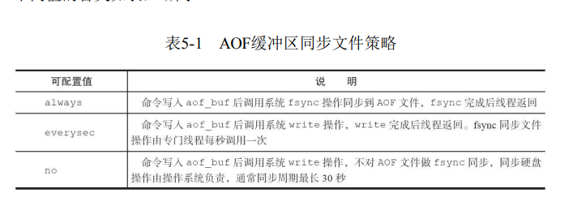

   - 配置为always时，每次写入都要同步AOF文件
   - 配置为no，由于操作系统同步AOF文件
   - 配置为everysec，是建议的同步策略，也是默认配置。

   > 关于系统调用我们要说明几点：
   >
   > - write操作会触发延迟写（delayed write）机制。Linux在内核提供页缓 冲区用来提高硬盘IO性能。write操作在写入系统缓冲区后直接返回。同步 硬盘操作依赖于系统调度机制
   > - fsync针对单个文件操作（比如AOF文件），做强制硬盘同步，fsync将 阻塞直到写入硬盘完成后返回，保证了数据持久化。

3. **文件重写（rewrite）**：随着AOF文件越来越大，需要定期对AOF文件进行重写，达到压缩的目的。AOF重写过程可以手动触发和自动触发：

   - **手动触发**：直接调用bgrewriteaof命令

   - **自动触发**：根据auto-aof-rewrite-min-size和auto-aof-rewrite-percentage参 数确定自动触发时机。

     - auto-aof-rewrite-min-size：表示运行AOF重写时文件最小体积，默认 为64MB。
     - auto-aof-rewrite-percentage：代表当前AOF文件空间 （aof_current_size）和上一次重写后AOF文件空间（aof_base_size）的比值

     自动触发时机为

     ~~~c
     aof_current_size > auto-aof-rewrite-minsize
     &&（aof_current_size - aof_base_size）/aof_base_size >= auto-aof-rewrite-percentage
     ~~~

     其中aof_current_size和aof_base_size可以在info Persistence统计信息中查看。

     自动触发的工作流程如下：

     1. 如果当前进程正在执行AOF重写，则直接返回
     2. 如果当前进程正在执行bgsave操作，重写命令延迟到bgsave完成之后再执行
     3. 父进程执行fork创建子进程，开销等同于bgsave过程。主进程fork操作完成后，继续响应其他命令。所有命令依然写入AOF缓冲区并根据appendfsync策略同步到硬盘，保证原有AOF机制正确性
     4. 由于父进程依然响应命令，Redis使用**“AOF重写缓冲区”**（注意不是AOF缓冲区）保存这部分新数据，防止新AOF文件生成期间丢失这部分数据。
     5. 子进程将数据写入到新的AOF文件。每次批量写入硬盘数据量由配置`aof-rewrite-incremental-fsync`控制，默认为 32MB，防止单次刷盘数据过多造成硬盘阻塞。
     6. 新AOF文件写入完成后，子进程发送信号给父进程，父进程更新统计信息，具体见info persistence下的aof_*相关统计。
     7. 父进程把AOF重写缓冲区的数据写入到新的AOF文件。
     8. 使用新AOF文件替换老文件，完成AOF重写。

4. **重启加载 （load）**：当Redis服务器重启时，可以加载AOF文件进行数据恢复

   

## 重启加载

AOF和RDB文件都可以用于服务器重启时的数据恢复

1. AOF持久化开启且存在AOF文件时，优先加载AOF文件
2. AOF关闭或者AOF文件不存在时，加载RDB文件
3. 加载AOF/RDB文件成功后（如果有的话），Redis启动成功
4. AOF/RDB文件存在错误时（校验失败），Redis启动失败并打印错误信息。

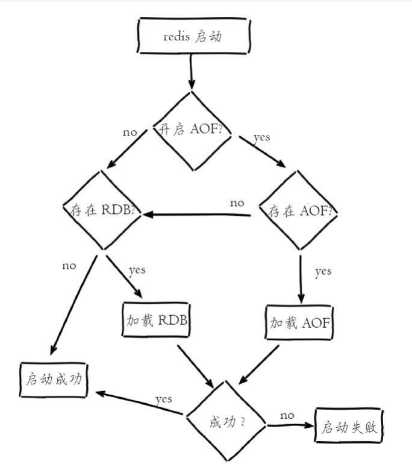

对于错误格式的AOF文件，采用redis-check-aof --fix命 令进行修复，修复后使用diff-u对比数据的差异，找出丢失的数据，有些可以人工修改补全。

AOF文件可能存在结尾不完整的情况，比如机器突然掉电导致AOF尾部文件命令写入不全。Redis为我们提供了aof-load-truncated配置来兼容这种情况，默认开启。加载AOF时，当遇到此问题时会忽略并继续启动，同时打印警告日志。

## AOF追加阻塞

当开启AOF持久化时，常用的同步硬盘的策略是everysec，这平衡了性能和数据丢失的风险。 对于这种方式，Redis使用另一条线程，原则上每秒执行fsync同步硬盘。当系统硬盘资源繁忙时，会造成Redis主线程阻塞。

每当服务器常规任务函数被执行、 或者事件处理器被执行时， `aof.c/flushAppendOnlyFile` 函数都会被调用， 这个函数执行以下两个工作：

- WRITE：根据条件，将 `aof_buf` 中的缓存写入到 AOF 文件。

- SAVE：根据条件，调用 `fsync` 或 `fdatasync` 函数，将 AOF 文件保存到磁盘中。

在everysec策略下，每当 `flushAppendOnlyFile` 函数被调用时， 可能会出现以下四种情况：

- 子线程正在执行 SAVE 
  - 这个 SAVE 的执行时间未超过 2 秒，那么程序直接返回，并不执行 WRITE 或新的 SAVE 。
  - 这个 SAVE 已经执行超过 2 秒，那么程序执行 WRITE ，但不执行新的 SAVE 。注意，因为这时 WRITE 的写入必须等待子线程先完成（旧的） SAVE ，因此这里 WRITE 会比平时阻塞更长时间。
- 子线程没有在执行 SAVE 
  - 上次成功执行 SAVE 距今不超过 1 秒，那么程序执行 WRITE ，但不执行 SAVE 。
  - 上次成功执行 SAVE 距今已经超过 1 秒，那么程序执行 WRITE 和 SAVE 。

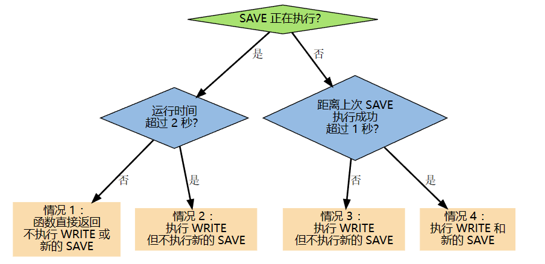

- 发生AOF阻塞时，Redis输出如下日志，用于记录AOF fsync阻塞导致拖慢Redis服务的行为：

  ~~~log
  Asynchronous AOF fsync is taking too long (disk is busy). Writing the AOF buffer
  without waiting for fsync to complete, this may slow down Redis
  ~~~

- 每当发生AOF追加阻塞事件发生时，在info Persistence统计中， aof_delayed_fsync指标会累加，查看这个指标方便定位AOF阻塞问题。

## 多实例部署

Redis单线程架构导致无法充分利用CPU多核特性，通常的做法是在一 台机器上部署多个Redis实例。当多个实例开启AOF重写后，彼此之间会产生对CPU和IO的竞争，这是无法避免的，但是我们可以提供监控机制以分散竞争压力。

Redis在info Persistence中为我们提供了监控子进程运行状况的度量指标

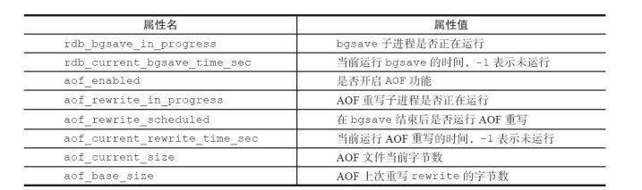

我们基于以上指标，可以通过外部程序轮询控制AOF重写操作的执行，

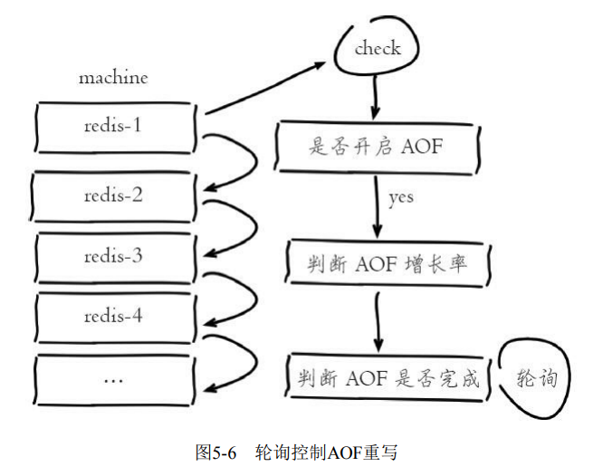

1. 外部程序定时**轮询**监控机器（machine）上所有Redis实例。
2. 对于开启AOF的实例，查看（aof_current_sizeaof_base_size）/aof_base_size确认增长率。
3. 当增长率超过特定阈值（如100%），执行`bgrewriteaof`命令手动触发 当前实例的AOF重写。
4. 运行期间循环检查aof_rewrite_in_progress和 aof_current_rewrite_time_sec指标，直到AOF重写结束。
5. 确认实例AOF重写完成后，再检查其他实例并重复2）~4）步操作。 从而保证机器内每个Redis实例AOF重写串行化执行。

## 启用主从复制

在分布式系统中为了解决单点问题，通常会把数据复制多个副本部署到其他机器，满足故障恢复和负载均衡等需求，Redis主从复制也正是如此。

> 分布式系统中，两个关于数据的关键设计：
>
> - 数据分区
> - 数据复制
>
> 在Redis中，主从复制解决的是数据复制的问题，而集群解决的是数据分区的问题

参与复制的Redis实例划分为主节点（master）和从节点（slave）。

- 默认情况下，Redis都是主节点。 
- 主节点和从节点的关系是一对多的
- 复制的数据流是单向的，只能由主节点复制到从节点。

有三种方式，启用主从复制

- 在配置文件中加入slaveof {masterHost} {masterPort}，随Redis启动生 效。
- 在redis-server命令后添加--slaveof {masterHost} {masterPort}选项
- 直接使用命令：slaveof {masterHost} {masterPort}。

主从节点复制成功建立后，可以使用`info replication`命令查看复制相关状态

主节点的复制状态信息

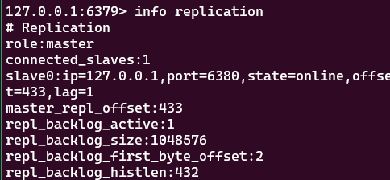

从节点的复制状态信息

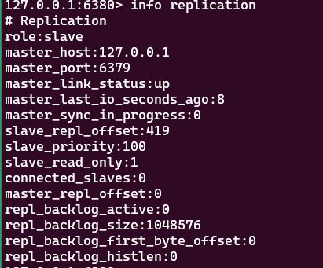

可以通过`slaveof no one`来断开复制：

- 断开与主节点复制关系。
- 从节点晋升为主节点。

从节点断开复制后并不会抛弃原有数据，只是无法再获取主节点上的数据变化。

`slaveof`命令还可以切换主节点

- 断开与旧主节点复制关系。
- 与新主节点建立复制关系
- 删除从节点当前所有数据
- 对新主节点进行复制操作

在Redis中，`masterauth`参数用于处理主从复制时的安全验证问题。如果主节点设置了`requirepass`密码，那么从节点需要通过`masterauth`参数（在redis.conf配置文件中）来设置相同的密码。

默认情况下，从节点使用`slave-read-only=yes`配置，即只读模式。由于复 制只能从主节点到从节点，对于从节点的任何修改主节点都无法感知，修改 从节点会造成主从数据不一致

在Redis中，`repl-disable-tcp-nodelay`参数用于控制Redis复制(replication)数据时是否禁用TCP_NODELAY。 默认情况下，`repl-disable-tcp-nodelay`参数是设置为no的，即默认启用`TCP_NODELAY`。在这种情况下，Redis主服务器会尽可能快地将数据发送到从节点，不会去等待可能的更大的数据包，以减少数据在网络中传输的延迟。然而，这种立即发送的方式，虽然可以减少延迟，但可能会导致网络带宽的浪费。

## 拓扑

- 一主一从

  "一主一从"是最基本的Redis复制配置，其中一个主节点负责接收写入，一个从节点维持数据副本，用于在主节点故障时提供冗余备份。

  在高并发的写入场景中，持久化操作可能会对主节点造成性能压力。在这种情况下，可以只在从节点启用AOF（Append Only File，追加只读文件持久化），这样可以保证数据的安全性，同时避免持久化对主节点的性能干扰。

  然而，这种配置中有一个需要特别注意的点。当主节点因为某些原因被关闭，且本身没有开启持久化，如果此时主节点自动重启，那么主节点将会成为空数据库。此时，如果从节点还在复制主节点，从节点的数据也会被清空，这就破坏了我们原本设定AOF的意义——数据的持久化。

  为了避免这种情况发生，当主节点关闭时，应该先在从节点上执行 `slaveof no one`命令，这个命令会断开从节点与主节点的复制关系。然后再重启主节点，这样就可以避免从节点数据被误清空的情况。

- 一主多从

  相当于一主一从拓扑结构的扩展。

  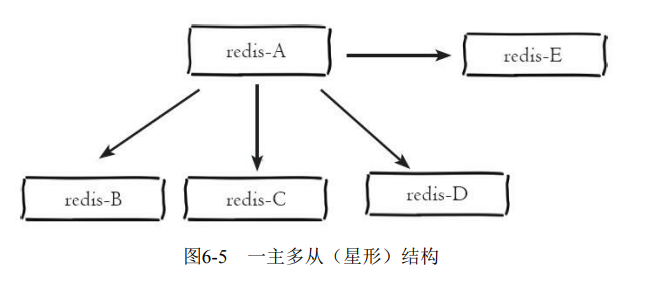

- 树状主从

  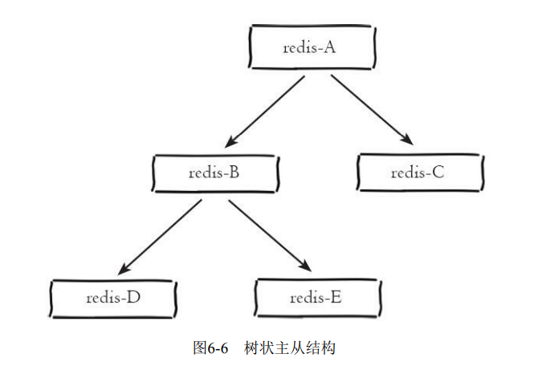

  在树状主从结构中，一个节点既可以作为主节点对下一层的从节点复制数据，又可以作为从节点从上一层的主节点获取数据。这种多级复制的模式形成了一种类似于树形的拓扑结构，它可以更有效地分散主节点的负载，减少主节点需要传输给从节点的数据量。

## 复制原理

Redis的复制功能分为**同步（sync）**和**命令传播（command propagate）**两个操作

在旧复制机制实现中，从服务器对主服务器的同步操作，需要向主服务器发送SYNC命令。以下是SYNC命令的执行步骤：

- 从服务器向主服务器发送SYNC命令
- 收到SYNC命令的主服务器执行BGSAVE命令，在后台生成一个RDB文件，并使用一个缓冲区记录从现在开始执行的所有写命令。
- 当主服务器的BGSAVE命令执行完毕时，主服务器会将BGSAVE命令生成的RDB文件发送给从服务器，从服务器接收并载入这个RDB文件，这样就将自己的数据库状态更新至主服务器执行BGSAVE命令时的数据库状态。此时从节点会阻塞直到加载完RDB文件。
- 主服务器将记录在缓冲区里面的所有写命令发送给从服务器，从服务器执行这些写命令，将自己的数据库状态更新至主服务器数据库当前所处的状态

当完成了同步之后，主从服务器就会进入命令传播阶段，这时主服务器只要一直将自己执行的写命令发送给从服务器，就可以保证主从服务器的数据一致性了。

注意，这里是异步完成的，也就是说主节点自身处理完写命令后，直接返回结果，并不等待从节点复制完成。而且传播操作的延迟还受`repl-disabletcp-nodelay`影响。

在命令传播阶段，从服务器默认会以每秒一次的频率，向主服务器发送命令（**心跳机制**）：
`REPLCONF ACK <replication_offset>`，其中replication_offset是从服务器当前的复制偏移量。发送REPLCONF ACK命令对于主从服务器有三个作用：

- 检测主从服务器的网络连接状态。

- 检测命令丢失

  主服务器将发觉从服务器当前的复制偏移量少于自己的复制偏移量，然后主服务器就会根据从服务器提交的复制偏移量，在复制积压缓冲区里面找到从服务器缺少的数据，并将这些数据重新发送给从服务器。

- 辅助实现min-slaves选项。

  Redis的min-slaves-to-write和min-slaves-max-lag两个选项可以防止主服务器在不安全的情况下执行写命令。

  举个例子，如果我们向主服务器提供以下设置：

  ~~~
  min-slaves-to-write 3
  min-slaves-max-lag 10
  ~~~

  那么在从服务器的数量少于3个，或者三个从服务器的延迟（lag）值都大于或等于10秒时，主服务器将拒绝执行写命令。

同步操作的两个场景：

- 初次连接
- 断线重连

在旧版复制功能中，从节点短暂地断线而又恢复后，会向主节点再次发送SYNC命令。显然这种做法十分低效。Redis从2.8版本开始，使用PSYNC命令代替SYNC命令来执行复制时的同步操作。

PSYNC命令具有**「全量同步」（full resynchronization）**和**「部分同步」（partial resynchronization）**两种模式：

- 全量同步的执行步骤和SYNC命令的执行步骤基本一样，用于处理初次复制情况
- 部分同步用于当从服务器在断线后重新连接主服务器时。**如果条件允许**，主服务器可以将主从服务器连接断开期间执行的写命令发送给从服务器，从服务器只要接收并执行这些写命令，就可以将数据库更新至主服务器当前所处的状态。而不是低效地执行SYNC命令

部分重同步功能由以下三个部分构成

- 主服务器的**复制偏移量（replication offset）**和从服务器的复制偏移量
- 主服务器的**复制积压缓冲区（replication backlog）**
- **服务器的运行ID（run ID）**

主服务器和从服务器会**分别**维护一个复制偏移量：

- 主服务器每次向从服务器传播N个字节的数据时，就将自己的复制偏移量的值加上N
- 从服务器每次收到主服务器传播来的N个字节的数据时，就将自己的复制偏移量的值加上N

通过对比主从服务器的复制偏移量，程序可以很容易地知道主从服务器是否处于一致状态

复制积压缓冲区是由主服务器维护的一个固定长度先进先出（FIFO）队列，默认大小为1MB。

- 当主服务器进行命令传播时，它不仅会将写命令发送给所有从服务器，还会将写命令入队到复制积压缓冲区里面。

- 主服务器的复制积压缓冲区里面会保存着一部分最近传播的写命令，并且复制积压缓冲区会为队列中的每个字节记录相应的复制偏移量

  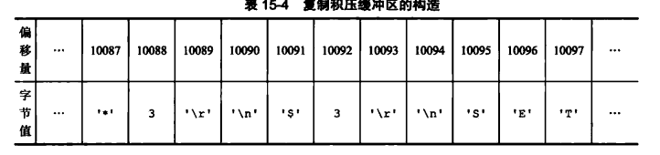

当从服务器重新连上主服务器时，从服务器会通过PSYNC命令将自己的复制偏移量offset发送给主服务器，主服务器会根据这个复制偏移量来决定对从服务器执行何种同步操作：

- 如果offset偏移量之后的数据（也即是偏移量offset+1开始的数据）仍然存在于复制积压缓冲区里面，那么主服务器将对从服务器执行部分重同步操作
- 相反，如果offset偏移量之后的数据已经不存在于复制积压缓冲区，那么就执行全量复制操作。

配置文件中，`repl-backlog-size`可修改复制积压缓冲区的大小

> 复制积压缓冲区的最小大小可以根据公式second * write_size_per_second来估算
>
> - 其中second为从服务器断线后重新连接上主服务器所需的平均时间（以秒计算）
> - 而write_size_per_second则是主服务器平均每秒产生的写命令数据量（协议格式的写命令的长度总和）

实现部分同步还需要用到服务器**运行ID（run ID）**

- 每个Redis服务器，不论主服务器还是从服务，都会有自己的运行ID
- 运行ID在服务器启动时自动生成，由40个随机的十六进制字符组成，例如53b9b28df8042fdc9ab5e3fcbbbabff1d5dce2b3

当从服务器对主服务器进行初次复制时，主服务器会将自己的运行ID传送给从服务器，而从服务器则会将这个运行ID保存起来。当从服务器断线并重新连上一个主服务器时，从服务器将向当前连接的主服务器发送之前保存的运行ID

- 如果从服务器保存的运行ID和当前连接的主服务器的运行ID相同，那么说明从服务器断线之前复制的就是当前连接的这个主服务器，尝试执行部分同步操作。
- 相反地，执行全量同步操作。

PSYNC命令的调用方法有两种：

- 如果从服务器以前没有复制过任何主服务器，或者之前执行过SLAVEOF no one命令，那么从服务器在开始一次新的复制时将向主服务器发送PSYNC   -1命令，主动请求主服务器进行全量同步

- 相反，向主服务器发送`PSYNC <runid> <offset>`命令：其中runid是上一次复制的主服务器的运行ID，而offset则是从服务器当前的复制偏移。

  - 如果主服务器返回`+FULLRESYNC <runid> <offset>`回复，那么表示主服务器将与从服务器执行全量同步操作
  - 如果主服务器返回+CONTINUE回复，那么执行部分操作
  - 如果主服务器返回-ERR回复，那么表示主服务器的版本低于Redis 2.8，它识别不了PSYNC命令，从服务器将向主服务器发送SYNC命令

  

SLAVEOF命令的执行流程

- **设置主服务器的地址和端口**

  从服务器首先要做的就是将客户端给定的主服务器IP地址127.0.0.1以及端口6379，保存到服务器状态的masterhost属性和masterport属性里面：

  ~~~c
  struct redisServer {
  
      // ...
      // 主服务器的地址
      char *masterhost;
  
      // 主服务器的端口
      int masterport;
  };
  ~~~

  SLAVEOF命令是一个异步命令，在完成masterhost属性和masterport属性的设置工作之后，从服务器将向发送SLAVEOF命令的客户端返回OK，表示复制指令已经被接收，而实际的复制工作将在OK返回之后才真正开始执行。

- **建立套接字连接**。在SLAVEOF命令执行之后，从服务器将根据命令所设置的IP地址和端口，创建连向主服务器的套接字连接。如果成功连接，那么从节点为这个连接关联一个处理器，这个处理器将负责执行后续的复制工作

- **发送PING命令**。这个PING命令有两个作用：

  - 虽然主从服务器成功建立起了套接字连接，但双方并未使用该套接字进行过任何通信，通过发送PING命令可以检查套接字的读写状态是否正常。
  - 检查主服务器能否正常处理命令请求

  之后有两种情况

  - 如果主节点的恢复超时，或者返回一个错误。那么从服务器断开，并重新创建连向主服务器的套接字。
  - 收到PONG回复，执行下一个步骤

- **身份验证**：如果从服务器设置了masterauth选项，那么进行身份验证，即向主服务器发送一条AUTH命令，命令的参数为从服务器masterauth选项的值。

  - 主服务器没有设置requirepass选项，并且从服务器也没有设置masterauth选项。OK
  - masterauth和主服务器requirepass选项相同。OK
  - masterauth和主服务器requirepass选项不同。Invalid Password错误
  - 如果主服务器设置了requirepass选项，但从服务器却没有设置masterauth选项。NOAUTH错误
  - 主服务器没有设置requirepass选项，但从服务器却设置了masterauth选项。no password is set错误

  所有错误情况都会令从服务器中止目前的复制工作，并重新创建新的套接字，直到身份验证通过，或者从服务器放弃执行复制为止。

- **发送端口信息**：在身份验证步骤之后，从服务器将执行命令`REPLCONF listening-port <port-number>`，向主服务器发送从服务器的监听端口号。服务器在接收到这个命令之后，会将端口号记录在从服务器所对应的客户端状态的slave_listening_port属性中

  ~~~c
  typedef struct redisClient {
      // ...
      // 从服务器的监听端口号
      int slave_listening_port;
  } redisClient;
  ~~~

  slave_listening_port属性目前唯一的作用就是在主服务器执行INFO replication命令时打印出从服务器的端口号。

- **同步**

- **命令传播**

## 复制中运维问题

如果RDB文件过大，导致传输时间超过repl-timeout所配置的值（默认60秒），那么从节点将放弃接受RDB文件并清理已 经下载的临时文件，导致全量复制失败

前面提及过。在从节点接收RDB快照期间，主节点仍然响应读写命令，因此主节点会把这期间写命令数据保存在复制客户端缓冲区内，当从节点加载完RDB文件后，主节点再把缓冲区内的数据发送给从节点。如果传输时间过长，可能导致缓冲区溢出，此时主节点将直接关闭复制客户端连接，造成全量同步失败。

溢出的默认配置为`client output-buffer-limit slave 256MB 64MB 60`，即60秒内缓冲区消耗持续大于 64MB，或者直接超过256MB。

当使用主从复制来实现读写分离特性时，会存在数据延迟、过期数据等问题：

- **数据延迟**：由于Redis异步复制，这种问题是无法避免的。可以编写外部监控程序监听主从节点的复制偏移量，当延迟较大时通知客户端，以避免读取延迟过高的从节点。

  监控程序（monitor）定期检查主从节点的偏移量，主节点偏移量在 info replication的master_repl_offset指标记录，从节点偏移量可以查询主节点 的slave0字段的offset指标

- **过期数据**，删除策略主要有两种

  - 惰性删除：主节点每次处理读取命令时，都会检查键是否超时，如果超 时则执行del命令删除键对象，之后del命令也会异步发送给从节点。
  - Redis主节点在内部定时任务会循环采样一定数量的键，当发现采样的键过期时执行del命令，之后再同步给从节点

  **从节点永远不会主动删除超时数据**，需要主节点通过del命令进行同步。这可能导致在从节点上。读取到已经超时的数据。Redis在3.2版本解决了这个问题，从节点读取到过期数据，仍不会主动删除，但会返回NULL。

  

主从配置不一致是一个容易忽视的问题。对于有些配置是可以不一致的，比如：主节点关闭AOF在从节点开启。但是对于与内存相关的配置必须要一致

复制风暴是指大量从节点对同一主节点（单主节点复制风暴）或者对同一台机器的多个主节点（单机器复制风暴）短时间内发起全量复制的过程。

- 单主节点复制风暴

  - 减少主节点挂载从节点的数量

  - 采用树状复制结构，减少挂载从节点的数量

    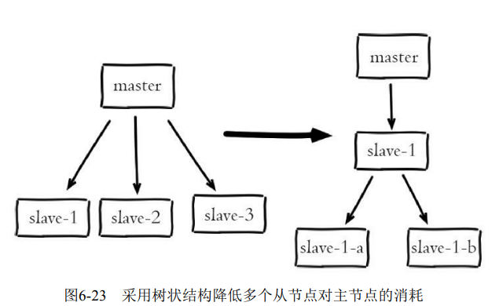

    这样网络开销交给位于中间层的从节点，但是会增加处理故障转移的难度。

- 单机器复制风暴：由于Redis的单线程架构，通常单台机器会部署多个Redis实例。当一台 机器（machine）上同时部署多个主节点（master）时，会有大量从节点针对这台机器的主节点进行全量复制，从而造成当前机器网络带宽耗尽。

  - 应该把主节点尽量分散在多台机器上，避免在单台机器上部署过多的主节点。

  - 当主节点所在机器故障后提供故障转移机制，避免机器恢复后进行密集的全量复制。

